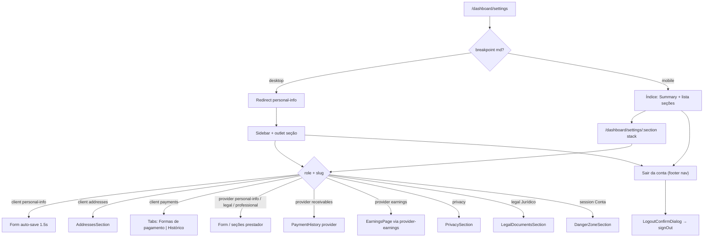

# Configurações (cliente e prestador)

Documentação alinhada a `src/features/settings/`, hub em `src/router.tsx` (`/dashboard/settings/*`) e APIs/hooks da feature. Endereços e histórico de pagamentos são **embutidos** — detalhe canônico nos módulos `addresses` e `payments` (links apenas). Ganhos: UI de `provider-earnings` hospedada no hub.

ADR de navegação: [`docs/adr/0002-account-settings-hub.md`](../../../../adr/0002-account-settings-hub.md).

---

## 1. Resumo executivo

Hub responsivo de configurações sob `/dashboard/settings` (slugs em inglês), não mais uma página única em scroll em `/dashboard/conta`. Cliente e prestador mantêm cadastro, foto, privacidade/LGPD, documentos oficiais (seção **Jurídico**, slug `legal`) e exclusão de conta (seção Conta) em seções; o prestador gerencia ainda identidade legal (`legal-identity` — cadastro PF/PJ, distinto de Jurídico), perfil profissional (público, ofertados, área, portfólio), recebimentos na captura e Ganhos (liquidação). Logout fica no rodapé da navegação do hub (**Sair da conta**), não em rota. **Fase 1:** só o shell de navegação; UIs de formulário/seção existentes reutilizadas; auto-save inalterado. Exclusão de conta e exportação LGPD hoje são fluxos manuais via e-mail ao DPO (`dpo@prestway.com`). Jurídico não persiste dados (só links externos).

## 2. Objetivo de negócio

- Manter dados cadastrais confiáveis para contratação, matching geográfico e página pública do prestador.
- Oferecer ponto de saída (logout no rodapé da nav / exclusão em Conta) mesmo com KYC prestador incompleto.
- Centralizar preferências de privacidade e pedidos LGPD sem self-service destrutivo na API.
- Um hub de conta no menu do dashboard (sem Endereços / Ganhos como itens top-level).

## 3. Localização na plataforma

| Superfície | Rota | Guard / chrome |
|------------|------|----------------|
| Índice Configurações | `/dashboard/settings` | Dashboard autenticado; **mobile** tab-root (lista); **desktop** `Navigate` → `personal-info` |
| Seções | `/dashboard/settings/:section` | Mobile **stack** (voltar → `/dashboard/settings`); desktop sidebar + outlet |

**Seções (slugs):**

| Papel | Slugs |
|-------|-------|
| Cliente | `personal-info`, `addresses`, `payments`, `privacy`, `legal`, `session` |
| Prestador | `personal-info`, `legal-identity`, `professional-profile`, `receivables`, `earnings`, `privacy`, `legal`, `session` |

- **Layout:** `SettingsLayout` — desktop: sidebar `SettingsNavList` + `<Outlet />`; mobile: só outlet.
- **Índice mobile:** `SettingsIndexPage` — título “Configurações”, `AccountSummaryCard`, lista de seções + rodapé **Sair da conta**.
- **Nav do hub (`settingsNav.ts` / `SettingsNavList`):** cauda compartilhada (`SHARED_TAIL`) **Privacidade** → **Jurídico** (`legal`, ícone Lucide `Scale`) → **Conta** (`session`, ícone `UserCog`); abaixo do divisor, item de rodapé **Sair da conta** (`kind: "logout"`, ícone `LogOut`) — **não** é rota; abre `LogoutConfirmDialog`. Título stack mobile: `SETTINGS_SECTION_STACK_TITLE.legal = "Jurídico"`.
- **Jurídico vs Identidade legal:** slug `legal` (`ROUTE_SETTINGS_LEGAL` = `/dashboard/settings/legal`) é hub de documentos oficiais para **ambos** os papéis (sem `SettingsRoleGate`); `legal-identity` é só prestador (cadastro PF/PJ). Não confundir.
- **Summary card:** mobile no índice; desktop só em `personal-info` (`ClientPersonalInfoPage` / `ProviderPersonalInfoPage`).
- **KYC:** prefixo allowlist `PROVIDER_KYC_ALLOWED_PATH_PREFIX = "/dashboard/settings"` — ver [gate-e-acesso-operacional](../../provider-kyc/features/gate-e-acesso-operacional.md).
- **Menu dashboard:** item **Configurações** → `/dashboard/settings` (`dashboardMenu.ts`). Removidos itens **Endereços** e **Ganhos**.
- **Rotas removidas (sem redirect):** `/dashboard/conta`, `/dashboard/earnings`, `/dashboard/addresses`.
- **Constante:** `ROUTE_SETTINGS`; helpers `settingsSectionPath` / `SETTINGS_SECTION` (incl. `legal`) / `ROUTE_SETTINGS_LEGAL` em `constants/routes.ts`.

## 4. Perfis envolvidos

| Perfil | Acesso | Não acessa |
|--------|--------|------------|
| `client` | Seções cliente + cauda compartilhada (`privacy`, `legal`, `session`); `SettingsRoleGate` nas seções client-only | legal-identity, professional-profile, receivables, earnings |
| `provider` | Seções prestador + mesma cauda compartilhada; em Jurídico vê também o contrato de uso | addresses, payments (cartões/histórico cliente) |
| Visitante | Não | Guard do dashboard |
| `admin` | Sem superfície dedicada neste hub | — |

## 5. Fluxo funcional principal

### Cliente — feliz

1. Abre hub → mobile lista; desktop personal-info.
2. Edita nome/telefone/CPF em personal-info → após 1500 ms valida Zod e persiste `profiles` + `client_profiles_private`.
3. Endereços / pagamentos nas seções dedicadas; em Pagamentos, abas **Formas de pagamento** (cartões) e **Histórico**.
4. Privacidade (DPO / exportar / atalho da política); Jurídico (termos + política); Conta (exclusão / DPO); ou **Sair da conta** no rodapé da nav (logout).

### Prestador — feliz

1. Abre hub → mesma lógica mobile/desktop.
2. **Informações pessoais** (`personal-info`): nome, e-mail (somente leitura) e telefone — **sem CPF** (`DadosPessoaisSection` com `showCpf={false}`; header: “Nome, foto e telefone de contato”). Auto-save com debounce 2000 ms.
3. **Identidade legal** (`legal-identity`): header “Identidade legal” / “Como você atua na Prestway e os documentos do cadastro”. `EntityTypeSection`: escolha PF/PJ em `radiogroup` (tiles com `aria-checked` e check no canto; sem card aninhado; **sem** botão/dialog “Preciso de ajuda para escolher”); a troca **não** aplica imediatamente — ao clicar no tipo **diferente** do `entity_type` atual, abre `AlertDialog` (`alertdialog`) **antes** de `onChange`/auto-save (padrão `LogoutConfirmDialog`, não bottom sheet). Copy PJ: título “Trocar para pessoa jurídica?”; descrição: documentos do cadastro passam a ser os da empresa (CNPJ, razão social e representante legal). Copy PF: título “Trocar para pessoa física?”; descrição: documentos passam a ser os de pessoa física (CPF); dados da empresa deixam de ser o documento principal. Botões: **Cancelar** (fecha, não chama `onChange`, seleção permanece) | **Trocar** (`onChange` com o tipo pendente → `ProviderLegalIdentityPage` faz `form.setValue("entity_type", v, { shouldDirty: true })` e o auto-save existente segue). Clicar no tipo já selecionado ou com `disabled`: não abre dialog / não chama `onChange`. **Não** limpa os campos da outra entidade. Disclaimer visível abaixo: “A Prestway não fornece assessoria jurídica ou contábil…”. `LegalIdentitySection`: um painel — PF: grupo “Documento” + CPF (`cpf`); PJ: “Empresa” (CNPJ, razão social, nome fantasia), “Representante legal” (nome completo, CPF do representante — `legal_representative_cpf`, não o campo `cpf` de PF), “Contato comercial” (telefone ou e-mail). Loading: `LegalIdentityFormSkeleton`. Auto-save via `useProviderSettingsForm` (debounce/grupos dirty inalterados). Sem mudança de persistência/API.
4. **Perfil profissional** (`professional-profile`): header “Perfil profissional” / “Serviços, área de atuação, perfil público e portfólio”. Layout em **quatro capítulos** (cards), nesta ordem: (1) `OfferedServicesSection` — **Serviços oferecidos**; busca com ícone; seleção em chips pill; empty state se nenhum serviço (“Nenhum serviço selecionado ainda…”); add/remove com mutação explícita (`setServiceIdsAsync`); (2) `PublicProfileSettingsSection` — **Perfil público** (nome profissional, bio); visibilidade em tiles `radiogroup` (**Público** / **Restrito**, padrão visual de `EntityTypeSection`: check no canto, ícones Globe/Lock; descrições sem prefixo “Público —”); barra “Ver como os clientes veem” com **Visualizar perfil** / **Copiar link** quando há slug; **não** inclui área de atuação neste card; (3) `ServiceAreaSection` — **Área de atuação** em card próprio; cidades em artigos com MapPin; empty state; no mobile, “Alterar bairros” abre Drawer (vaul), no desktop Popover; (4) `PortfolioManagementSection` — **Portfólio** em cards (capa + título); empty state ilustrado (“Nenhum item no portfólio”); DnD (`@dnd-kit`) e dialog de add/edit inalterados em contrato (`visibility: "public"` forçado no create/update pela página). Loading: `ProfessionalProfileFormSkeleton` (não o skeleton monolítico `ProviderFormSkeleton`). Auto-save do form (debounce 2000 ms / grupos dirty) e APIs de ofertados/área/portfólio **inalterados**.
5. Recebimentos (captura); Ganhos (liquidação bancária — feature externa hospedada).
6. Privacidade; Jurídico (termos + política + **Contrato de uso da plataforma**); Conta (DPO); ou **Sair da conta** no rodapé da nav.

## 6. Fluxos alternativos e exceções

| Caso | Comportamento |
|------|---------------|
| Erro de carga do perfil | `AccountErrorState` — “Não foi possível carregar sua conta” + retry |
| Auto-save parcial (cliente/prestador) | Toast “Não foi possível salvar todas as alterações…” |
| Schema inválido (cliente) | Seta erro no primeiro campo; **sem** toast de inválido |
| Schema inválido (prestador) | Erro no campo + toast “Não foi possível salvar… campo inválido.” |
| Catch genérico auto-save | Toast “Não foi possível atualizar seus dados…” |
| Sucesso prestador | Toast “Dados atualizados com sucesso.” |
| Sem `VITE_MAIN_SITE_URL` | Links jurídicos `null` → textos “em breve” por documento (Privacidade e seção Jurídico) |
| Copiar link falha | Toasts distintos no card vs seção pública |
| Foto inválida no seletor | Validação retorna e **encerra sem toast** (`AccountSummaryCard`) |
| Exclusão | Dialog informa mailto DPO — **não** chama delete API |
| Papel errado na seção | `SettingsRoleGate` redireciona / bloqueia conforme implementação |
| Troca PF↔PJ em Identidade legal | `AlertDialog` de confirmação **antes** de `onChange`; Cancelar mantém seleção; Trocar aplica e auto-save segue; tipo já selecionado / `disabled` não abre; **não** limpa campos da outra entidade; **não** é o dialog antigo de ajuda |

## 7. Regras de negócio (numeradas)

1. Auto-save cliente só com `formState.isDirty`; debounce **1500 ms**.
2. Auto-save prestador debounce **2000 ms**; limpa erros dos campos alterados antes de revalidar.
3. Grupos prestador: `full_name`/`phone` → `profiles`; bloco privado → `provider_profiles_private`; bloco público → `provider_profiles_public`.
4. `service_area_neighborhood_ids` só enviado no update público quando o campo está dirty (evita delete+insert desnecessário).
5. PJ: schema exige CNPJ e razão social preenchidos (`entity_type === "pj"`).
6. Portfólio criado/atualizado pela página força `visibility: "public"`.
7. Imagem de perfil: máx. **2 MB**; tipos JPEG/PNG/WebP/HEIC/HEIF.
8. Imagem de portfólio: máx. **5 MB**; mesmos tipos; input pode acumular múltiplos arquivos; sem teto explícito de quantidade por item no front.
9. DPO: `dpo@prestway.com`; prazo informado na UI: **15 dias úteis**.
10. E-mail do usuário não é editável no formulário.
11. Slug: em `updateProviderPublicProfile`, se `display_name` atualiza e slug atual é null ou igual a `providerId`, gera slug único; após slug “real”, alterações de nome não mudam o slug (código analisado).
12. Prestador: `useUpdateAccountProfile({ silent: true })` — toasts de profile base silenciados no fluxo de grupos.
13. Cliente — seção payments: header “Pagamentos”; abas **Formas de pagamento** (`SavedCardsList` com `tokenizeContext="profile"` e `phone` do perfil) e **Histórico** (`PaymentHistorySection role="client"`). Listas Prestway sem card/título aninhado (título só no header da página).
14. Prestador — receivables: header “Recebimentos” + `PaymentHistorySection role="provider"` (sem abas). Contratos/views no módulo payments.
15. Logout: item **Sair da conta** no rodapé de `SettingsNavList` (sidebar desktop + índice mobile) → `LogoutConfirmDialog` (`AlertDialog`) → `signOut()` (`useAuth`). Não é rota/`session`.
16. Seção Conta (`/dashboard/settings/session`): header “Conta” / “Exclusão permanente da sua conta”; só `DangerZoneSection` (orientação DPO). `LogoutSection` removida.
17. Seção Jurídico (`/dashboard/settings/legal`): header “Jurídico” / “Documentos oficiais da Prestway”; `LegalDocumentsSection` (`aria-label="Documentos jurídicos"`). Links (mesmo padrão do cadastro; `null` se `VITE_MAIN_SITE_URL` ausente): Termos de uso → `TERMS_OF_USE_URL` (`…/juridico/termos-de-uso`); Política de privacidade → `PRIVACY_POLICY_URL`; **só prestador** (`showProviderContract` via `profile.role === "provider"`): Contrato de uso da plataforma → `PROVIDER_PLATFORM_CONTRACT_URL` (`…/juridico/adesao-prestador`, mesmo path do “Contrato de Adesão” no signup). **Não** lista política de comissões nem adesão-cliente. Sem `SettingsRoleGate`, sem persistência/API/migration. Privacidade permanece com DPO / exportar / atalho da política — Jurídico não a substitui.
18. Fase 1: shell de navegação; sem redesign row-by-row dos formulários.
19. Prestador — Informações pessoais: `DadosPessoaisSection` com `showCpf={false}` (sem campo CPF na UI). Cliente — mesma seção com default `showCpf={true}` (CPF em Dados pessoais).
20. Prestador — Identidade legal (`ProviderLegalIdentityPage`): PF/PJ via tiles `radiogroup` (`EntityTypeSection`); troca para tipo diferente exige confirmação em `AlertDialog` (Cancelar / Trocar) **antes** de `onChange` + auto-save (`setValue` dirty); tipo já selecionado ou `disabled` não abre dialog; **não** limpa campos da outra entidade; **sem** dialog “Preciso de ajuda para escolher”. Documentos em um painel (`LegalIdentitySection`) — PF: grupo Documento/`cpf`; PJ: grupos Empresa / Representante legal / Contato comercial (`legal_representative_cpf`, não o campo `cpf` de PF). Skeleton dedicado `LegalIdentityFormSkeleton`. Persistência/API inalteradas.
21. Prestador — Perfil profissional (`ProviderProfessionalProfilePage`): quatro cards — Serviços oferecidos (`OfferedServicesSection`), Perfil público (`PublicProfileSettingsSection`; visibilidade Público/Restrito em tiles `radiogroup`; preview Visualizar/Copiar só com slug; **sem** área embutida), Área de atuação (`ServiceAreaSection` / `ServiceAreaField`; mobile Drawer vaul para editar bairros), Portfólio (`PortfolioManagementSection`; cards capa+título; empty ilustrado; DnD/dialog contrato inalterado). Skeleton dedicado `ProfessionalProfileFormSkeleton`. Rota `/dashboard/settings/professional-profile`, persistência e auto-save **inalterados**.

## 8. Campos e dados

### 8.1 Cliente — `accountFormSchema`

| Campo | Label | Obrigatório | Validação | Persistência |
|-------|-------|-------------|-----------|--------------|
| `full_name` | Nome completo | Sim | `min(1)` + `validateFullName` | `profiles.full_name` |
| `phone` | Telefone / WhatsApp | Não | Vazio OK; senão `validateBrazilPhone` | `profiles.phone` |
| `cpf` | CPF | Não | Vazio OK; senão `validateCPF` | `client_profiles_private.cpf` |
| E-mail | E-mail | — | Disabled | Auth (`user.email`) |

### 8.2 Prestador — `providerAccountFormSchema`

| Campo | UI | Obrigatório | Validação | Persistência |
|-------|-----|-------------|-----------|--------------|
| `full_name` | Nome completo | Sim | Igual cliente | `profiles` |
| `phone` | Contato (card separado) | Não | Telefone BR | `profiles` |
| `entity_type` | PF / PJ | Sim | enum | privado |
| `cpf` | CPF (PF) — só em `legal-identity` / `LegalIdentitySection` quando PF; **oculto** em `personal-info` | Se preenchido válido | CPF | `provider_profiles_private` |
| `cnpj`, `razao_social` | PJ (`legal-identity`) | Refine PJ | CNPJ + não vazios | privado |
| `nome_fantasia`, `legal_representative_name`, `legal_representative_cpf`, `commercial_contact` | PJ (`legal-identity`) | Não | CPF rep. se preenchido; contact max 120 | privado |
| `display_name`, `bio` | Perfil público | Não | max 120 / 2000 | público |
| `profile_visibility` | Visibilidade | Sim | `public` \| `restricted` | público |
| `service_area_neighborhood_ids` | Área | Não | UUIDs | `provider_service_area_neighborhoods` |
| `service_area_city` | Apoio UI | Não | — | derivado |

## 9. Validações de front-end

- Zod: `types/accountForm.validation.ts`, `types/providerAccountForm.validation.ts` (reexports em `schemas/` também existem).
- Máscaras: `maskPhone`, `maskCPF`, CNPJ via validadores compartilhados.
- Upload: `validateProfileImageFile` / `validatePortfolioImageFile`.
- Portfólio: título obrigatório (trim) no dialog da seção (evidência em `PortfolioManagementSection` / hooks).

## 10. Validações de back-end

- UPSERTs/tabelas privados com RLS por usuário (migrations `20260318100000_*` tipicamente — evidência parcial: paths de API; regras SQL finas no módulo Supabase).
- Storage buckets privados com signed URLs (expiry 3600 s nas constantes).
- **Evidência parcial:** constraints exatas de unique slug / RLS não reauditadas neste ciclo além do comportamento do client `resolveUniqueSlug`.

## 11. Status, estados e transições

| Estado UI | Quando |
|-----------|--------|
| Loading skeleton | `profileLoading` / sem perfil inicial / layout loading; em `professional-profile`: `ProfessionalProfileFormSkeleton`; em `legal-identity`: `LegalIdentityFormSkeleton` |
| Error state | `profileError && !profile` |
| Salvando… | Mutação em andamento (`Loader2`) |
| Idle auto-save | Texto “As alterações são salvas automaticamente.” |
| Dialogs | Exportar dados, excluir conta (orientação), logout |

Não há FSM de domínio próprio além de `entity_type` PF/PJ e `profile_visibility`.

## 12. Persistência

| Destino | Conteúdo |
|---------|----------|
| Supabase tables | Ver README §7 / seção 8 |
| Storage | `profile-images`, `provider-portfolio-images` |
| Cliente | React Hook Form + TanStack Query caches dos hooks |
| Sem Preferences/draft local de conta | Evidência: sem keys de Preferences nesta feature |

## 13. Integrações

| Destino | Como |
|---------|------|
| `auth` | Perfil base, update, signOut |
| `addresses` | `/dashboard/settings/addresses` — [gestão de endereços](../../addresses/features/gestao-de-enderecos.md) |
| `payments` | Cartões + histórico — [histórico e reembolso](../../payments/features/historico-e-reembolso.md); erros de cartão em [checkout](../../payments/features/checkout-e-cobranca.md) |
| `provider-earnings` | Hospedado em `/dashboard/settings/earnings` (`ProviderEarningsSectionPage` → `EarningsPage`); `ROUTE_PROVIDER_EARNINGS` |
| `provider-profile` | Link `/perfil/{slug}` |
| Site jurídico | Com `VITE_MAIN_SITE_URL`: `TERMS_OF_USE_URL` = `…/juridico/termos-de-uso`; `PRIVACY_POLICY_URL` = `…/juridico/politica-de-privacidade`; `PROVIDER_PLATFORM_CONTRACT_URL` = `…/juridico/adesao-prestador` (UI Jurídico só prestador). Sem env → `null` / “em breve”. Sem política de comissões nem adesão-cliente nesta seção. |

## 14. Listagens, buscas, filtros, paginação

- **Ofertados:** busca em `platform_services` — até 20 resultados com query / 10 sem query (`OfferedServicesSection`).
- **Portfólio:** lista do prestador + reorder DnD (`@dnd-kit`); sem paginação server-side evidenciada no hook de conta.
- **Histórico de pagamentos:** listagem/paginação no módulo `payments` (não duplicar aqui).
- **Ganhos:** listagem/filtros no módulo `provider-earnings`.
- **Endereços:** CRUD no módulo `addresses`.

## 15. Ações disponíveis

| Ação | Quem | Pré-condição | Resultado |
|------|------|--------------|-----------|
| Navegar seções | Ambos | Autenticado | Hub / stack / sidebar |
| Auto-save campos | Ambos | Dirty + Zod OK | Persistência |
| Upload / remover foto | Ambos | Arquivo válido / path existe | Storage + profile path |
| CRUD endereços | Cliente | Seção addresses | Feature addresses |
| Cartões salvos | Cliente | Seção payments → aba Formas de pagamento | Feature payments |
| Ver histórico captura | Cliente / Prestador | payments → aba Histórico / receivables | `PaymentHistorySection` |
| Ver Ganhos | Prestador | Seção earnings | `EarningsPage` |
| Add/remove serviços | Prestador | professional-profile | `setOfferedServices` |
| Copiar / abrir perfil | Prestador | slug | Clipboard / nova URL |
| CRUD portfólio | Prestador | Título | Items + imagens |
| Falar DPO / Exportar | Ambos | privacy | mailto / dialog |
| Abrir documentos oficiais | Ambos | legal (`LegalDocumentsSection`); URLs se `VITE_MAIN_SITE_URL` | Nova aba / “em breve” |
| Ver contrato de uso da plataforma | Prestador | legal + `showProviderContract` | Link `PROVIDER_PLATFORM_CONTRACT_URL` ou “em breve” |
| Excluir conta (UI) | Ambos | Conta (`session`) / `DangerZoneSection` | Orientação DPO |
| Sair da conta | Ambos | Rodapé da nav (`SettingsNavList`) | `LogoutConfirmDialog` → `signOut` |

## 16. Dependências

- Internas: hooks/api listados na seção 19.
- Externas de feature: `auth`, `addresses`, `payments`, `provider-earnings` (host), `request-quote` (estilo), UI shadcn.
- Downstream: matching/área usa bairros; público usa slug.

## 17. Regras implícitas

- Hidratação do form: `hydratedProfileIdRef` evita reset contínuo após primeiro load do `profile.id` (fluxos de formulário reutilizados).
- Prestador: telefone fora de `DadosPessoaisSection` (card Contato dedicado) em personal-info.
- Prestador: CPF **não** aparece em Informações pessoais — `ProviderPersonalInfoPage` passa `showCpf={false}` a `DadosPessoaisSection` (default da prop é `true`). Cliente em `ClientPersonalInfoPage` não passa a prop → CPF permanece em Dados pessoais.
- Prestador: edição de documento fiscal/cadastral em Identidade legal (`LegalIdentitySection`, um painel): PF → grupo “Documento” + `cpf`; PJ → grupos “Empresa”, “Representante legal”, “Contato comercial” (`legal_representative_cpf` e demais campos PJ), sem exibir o campo `cpf` de PF. Tipo de entidade: tiles `radiogroup` + disclaimer jurídico; **sem** botão/dialog “Preciso de ajuda para escolher”. Troca PF↔PJ: `AlertDialog` de confirmação **antes** de `onChange` (não aplica imediatamente; Cancelar mantém seleção; Trocar dispara auto-save; **não** limpa campos da outra entidade; padrão `LogoutConfirmDialog`, não bottom sheet).
- Cliente não vê `PaymentHistorySection` com role provider e vice-versa.
- Zona de perigo copy fala em remoção irreversível, mas ação real é pedido por e-mail.
- Toasts de sucesso de foto: “Foto atualizada com sucesso.” / “Foto removida.” (`useProfilePhotoMutation`).
- Produção usa apenas `SettingsLayout` + páginas em `components/sections/*` (hub por seção).

## 18. Riscos

- Usuário pode interpretar “Excluir minha conta” como delete imediato.
- Validação de foto silenciosa na UI.
- Dados sensíveis (CPF/CNPJ): cliente edita CPF em personal-info; prestador edita CPF/CNPJ em legal-identity — ambos com auto-save.
- Dependência de env (`VITE_MAIN_SITE_URL`) para links de documentos jurídicos (Privacidade + Jurídico).
- Deep links legados para `/dashboard/conta` (ex.: enqueue de lembrete KYC na migration) **não** redirecionam — rota removida.

## 19. Evidências

- Shell: `SettingsLayout.tsx`, `SettingsIndexPage.tsx`, `SettingsNavList.tsx`, `SettingsSectionHeader.tsx`, `SettingsRoleGate.tsx`
- Seções: `components/sections/PersonalInfoPage.tsx`, `ClientPersonalInfoPage.tsx`, `ProviderPersonalInfoPage.tsx`, `ClientAddressesPage.tsx`, `ClientPaymentsPage.tsx`, `ProviderLegalIdentityPage.tsx`, `ProviderProfessionalProfilePage.tsx`, `ProviderReceivablesPage.tsx`, `ProviderEarningsSectionPage.tsx`, `AccountPrivacyPage.tsx`, `AccountLegalPage.tsx`, `AccountSessionPage.tsx`
- Blocos reutilizados: `DadosPessoaisSection`, `ContatoIdentidadeSection`, `EntityTypeSection`, `LegalIdentitySection`, `LegalIdentityFormSkeleton`, `OfferedServicesSection`, `PublicProfileSettingsSection`, `ServiceAreaField` / `ServiceAreaSection`, `PortfolioManagementSection`, `ProfessionalProfileFormSkeleton`, `PrivacySection`, `LegalDocumentsSection`, `DangerZoneSection`, `LogoutConfirmDialog`, `AccountSummaryCard`, `AccountErrorState`
- Nav: `SettingsNavList` (variantes sidebar/list) + `constants/settingsNav.ts` (item logout de rodapé)
- APIs: `api/clientProfilePrivate.api.ts`, `providerPrivateProfile.api.ts`, `providerPublicProfile.api.ts`, `offeredServices.api.ts`, `portfolio.api.ts`, `profileImageStorage.api.ts`, `portfolioImageStorage.api.ts`, `providerProfile.api.ts`
- Hooks: `useAccountProfile`, `useClientPrivateProfile`, `useUpdateAccountProfile`, `useProviderProfile`, `useUpdateProviderProfile`, `useProviderSettingsForm`, `useOfferedServices`, `usePortfolioItems`, `useProfilePhotoMutation`, `useProfileImageUrl`
- Validação: `types/accountForm.validation.ts`, `types/providerAccountForm.validation.ts`
- Constantes: `constants.ts`, `constants/routes.ts`, `constants/settingsNav.ts`
- Router: `src/router.tsx` path `settings` + children
- Menu / chrome: `dashboardMenu.ts`, `mobileNavigation.config.ts`

## 20. Pendências

| Item | Status |
|------|--------|
| Limite de imagens por item de portfólio | Não encontrado no front |
| Toast de erro de validação de foto | Ausente no seletor |
| Detalhe RLS/migrations | Evidência parcial — aprofundar em auditoria backend se necessário |
| Atualizar deep_link SQL de lembretes KYC de `/dashboard/conta` → `/dashboard/settings` | Gap comprovado (rota antiga removida, sem redirect) |

---

## Anexo A — Composição por seção (fase 1)

### Cliente

| Seção | Conteúdo principal |
|-------|-------------------|
| Índice (mobile) | Summary + nav list |
| personal-info | Header; Summary (só desktop); Dados pessoais (nome, e-mail, CPF — `showCpf` default) + Contato (telefone) + auto-save |
| addresses | `AddressesSection` |
| payments | Header “Pagamentos”; Tabs **Formas de pagamento** (`SavedCardsList`) e **Histórico** (`PaymentHistorySection role="client"`) |
| privacy | `PrivacySection` (DPO / exportar / atalho da política) |
| legal (Jurídico) | Header “Jurídico” / “Documentos oficiais da Prestway”; `LegalDocumentsSection` (termos + política; sem contrato de prestador) |
| session (Conta) | Header “Conta” / “Exclusão permanente da sua conta”; só `DangerZoneSection` |
| Rodapé nav (não é seção) | **Sair da conta** → `LogoutConfirmDialog` |

### Prestador

| Seção | Conteúdo principal |
|-------|-------------------|
| Índice (mobile) | Summary (+ link/copiar perfil) + nav list |
| personal-info | Header “Informações pessoais” / “Nome, foto e telefone de contato”; Summary (só desktop); `DadosPessoaisSection` com `showCpf={false}` (nome, e-mail) + card Contato (telefone) — **sem CPF** |
| legal-identity | Header “Identidade legal” / “Como você atua na Prestway e os documentos do cadastro”; `EntityTypeSection` (tiles PF/PJ `radiogroup` + check; disclaimer assessoria jurídica/contábil; **sem** dialog “Preciso de ajuda para escolher”; troca para tipo diferente → `AlertDialog` “Trocar para pessoa jurídica?” / “Trocar para pessoa física?” com **Cancelar** / **Trocar** **antes** de `onChange`/auto-save; tipo já selecionado ou `disabled` não abre; **não** limpa campos da outra entidade); `LegalIdentitySection` (um painel — ≠ Jurídico): PF → grupo “Documento” + CPF (`cpf`); PJ → “Empresa” (CNPJ, razão social, nome fantasia), “Representante legal” (nome completo, CPF), “Contato comercial” (telefone ou e-mail); loading `LegalIdentityFormSkeleton`; auto-save `useProviderSettingsForm` |
| professional-profile | Header “Perfil profissional” / “Serviços, área de atuação, perfil público e portfólio”; quatro cards: `OfferedServicesSection` (busca + chips; empty se nenhum); `PublicProfileSettingsSection` (nome, bio; tiles Público/Restrito `radiogroup` Globe/Lock; barra Visualizar/Copiar com slug; **sem** área); `ServiceAreaSection` (cidades em artigos MapPin; empty; mobile Drawer vaul para Alterar bairros); `PortfolioManagementSection` (cards capa+título; empty ilustrado; DnD + dialog add/edit); loading `ProfessionalProfileFormSkeleton`; auto-save/API inalterados |
| receivables | `PaymentHistorySection role="provider"` |
| earnings | `SettingsSectionHeader` + `EarningsPage` (header interno oculto no host) |
| privacy | `PrivacySection` |
| legal (Jurídico) | Igual cliente + linha **Contrato de uso da plataforma** (`PROVIDER_PLATFORM_CONTRACT_URL`) |
| session (Conta) | Header “Conta” / “Exclusão permanente da sua conta”; só `DangerZoneSection` |
| Rodapé nav (não é seção) | **Sair da conta** → `LogoutConfirmDialog` |

## Anexo B — Mensagens (toasts / diálogos)

| Mensagem | Origem |
|----------|--------|
| Não foi possível salvar todas as alterações. Tente novamente. | Auto-save parcial |
| Não foi possível atualizar seus dados. Tente novamente. | Catch |
| Não foi possível salvar os campos automaticamente porque há um campo inválido. | Prestador Zod |
| Dados atualizados com sucesso. | Prestador OK |
| Foto atualizada com sucesso. / Foto removida. | Foto |
| Link copiado. / Não foi possível copiar. | Card prestador |
| Link copiado para a área de transferência. / Não foi possível copiar o link. | Seção pública |
| Não foi possível atualizar. / o perfil. | Hooks update provider |
| Textos DPO / 15 dias úteis | Privacy + DangerZone |
| Termos / política / contrato “… em breve.” | `LegalDocumentsSection` (e atalho em Privacidade) quando URL `null` |
| Confirmação logout (“Sair da conta”) | `LogoutConfirmDialog` (via `SettingsNavList`) |
| “Trocar para pessoa jurídica?” / “Trocar para pessoa física?” (+ Cancelar / Trocar) | `EntityTypeSection` (`AlertDialog` de confirmação de troca PF↔PJ) |

## Anexo C — Checklist QA

- [ ] Mobile: `/dashboard/settings` lista seções + summary; seções abrem em stack com voltar ao índice
- [ ] Desktop: `/dashboard/settings` → personal-info; sidebar; summary só em personal-info
- [ ] Cliente e prestador veem conjuntos de seções distintos
- [ ] Auto-save 1,5 s / 2 s; inválido bloqueia persistência
- [ ] E-mail disabled; CPF/CNPJ máscaras
- [ ] Prestador: personal-info **sem** CPF; CPF (PF) ou CNPJ + CPF do representante (PJ) só em legal-identity
- [ ] Identidade legal: header “Identidade legal” / “Como você atua…”; tiles PF/PJ (`radiogroup` / `aria-checked`); disclaimer “A Prestway não fornece assessoria jurídica ou contábil…”; **sem** botão/dialog “Preciso de ajuda para escolher”
- [ ] Identidade legal — troca PF↔PJ: clicar tipo diferente abre `AlertDialog` **antes** de salvar; Cancelar fecha sem `onChange`; Trocar aplica e auto-save segue; tipo já selecionado / `disabled` não abre; campos da outra entidade **não** são limpos
- [ ] Identidade legal PF: grupo “Documento” + CPF; PJ: grupos “Empresa”, “Representante legal”, “Contato comercial” (telefone ou e-mail) no mesmo painel
- [ ] Identidade legal loading: `LegalIdentityFormSkeleton` (não skeleton monolítico de todas as seções do prestador)
- [ ] Cliente: CPF permanece em Dados pessoais (personal-info)
- [ ] Endereços / pagamentos só cliente; receivables / earnings só prestador
- [ ] Cliente payments: abas Formas de pagamento / Histórico sob header Pagamentos
- [ ] Ganhos em `/dashboard/settings/earnings` (não top-level)
- [ ] Menu sem Endereços / Ganhos; Configurações → `/dashboard/settings`
- [ ] `/dashboard/conta`, `/dashboard/earnings`, `/dashboard/addresses` 404 (sem redirect)
- [ ] Prestador sem KYC ACTIVE ainda acessa `/dashboard/settings*`
- [ ] Nav: **Privacidade** → **Jurídico** (Scale) → **Conta** (UserCog); **Sair da conta** (LogOut) abaixo do divisor
- [ ] Jurídico (`/dashboard/settings/legal`): ambos os papéis; cliente vê termos + política; prestador vê também contrato de uso; sem comissões/adesão-cliente; sem `SettingsRoleGate`
- [ ] Sem `VITE_MAIN_SITE_URL`: textos “em breve” por documento em Jurídico (e atalho em Privacidade)
- [ ] Conta (`/dashboard/settings/session`): só exclusão (`DangerZoneSection`); sem logout na página
- [ ] **Sair da conta** abre `LogoutConfirmDialog` e chama `signOut` (desktop sidebar + índice mobile)
- [ ] Não confundir Jurídico (`legal`) com Identidade legal (`legal-identity`)
- [ ] Perfil profissional (`/dashboard/settings/professional-profile`): quatro cards na ordem Serviços oferecidos → Perfil público → Área de atuação → Portfólio
- [ ] Perfil público: tiles **Público** / **Restrito** (`radiogroup`); **não** embute área de atuação; Visualizar perfil / Copiar link só com slug
- [ ] Área de atuação: card próprio (`ServiceAreaSection`); mobile “Alterar bairros” = Drawer (vaul); desktop = Popover
- [ ] Portfólio: lista em cards (capa + título); empty state ilustrado; DnD e dialog add/edit intactos
- [ ] Perfil profissional loading: `ProfessionalProfileFormSkeleton` (não `ProviderFormSkeleton` monolítico)

## 21. Atualização de auditoria (2026-08-12)

- Hub settings `/dashboard/settings/*` (fase 1 shell); ADR 0002.
- Menu e rotas top-level Endereços/Ganhos/conta removidos.
- Allowlist KYC `/dashboard/settings`.
- Regras de formulário/auto-save revalidadas como inalteradas na fase 1.
- Superfície monolítica removida: `SettingsPage` / `SettingsClientPage` / `SettingsProviderPage` / `DeleteAccountDialog` — produção só `SettingsLayout` + `SettingsIndexPage` + `components/sections/*`; exclusão permanece mailto DPO em `DangerZoneSection`.
- **UI Pagamentos (cliente):** `ClientPaymentsPage` com Tabs Formas de pagamento / Histórico; listas Prestway (skeleton, empty dashed); CRUD/rotas inalterados.
- **UX Conta / logout:** **Conta** na lista principal (após Jurídico, ícone `UserCog`); **Sair da conta** no rodapé da nav (`LogoutConfirmDialog` → `signOut`, sem rota); `AccountSessionPage` só `DangerZoneSection`; `LogoutSection` removida.
- **Seção Jurídico (`legal`):** `AccountLegalPage` + `LegalDocumentsSection`; nav `SHARED_TAIL` Privacidade → Jurídico → Conta; rota `/dashboard/settings/legal`; links site jurídico (termos, política; prestador + contrato `adesao-prestador`); Privacidade não substituída; sem persistência/API.
- **CPF prestador fora de personal-info:** `DadosPessoaisSection` ganha prop `showCpf` (default `true`); `ProviderPersonalInfoPage` usa `showCpf={false}`; cliente inalterado. Prestador edita CPF em `legal-identity` (`LegalIdentitySection`: PF → `cpf`; PJ → CNPJ + `legal_representative_cpf`).
- **UI Identidade legal (redesign, sem mudança de API):** `ProviderLegalIdentityPage` — `EntityTypeSection` em tiles `radiogroup` + disclaimer jurídico (**sem** dialog de ajuda); confirmação de troca PF↔PJ via `AlertDialog` (Cancelar / Trocar) **antes** de `onChange`/auto-save; **não** limpa campos da outra entidade; `LegalIdentitySection` em um painel com grupos PF/PJ; skeleton `LegalIdentityFormSkeleton`; auto-save `useProviderSettingsForm` inalterado.
- **UI Perfil profissional (redesign, sem mudança de API):** `ProviderProfessionalProfilePage` — quatro capítulos (cards): Serviços oferecidos (busca + chips + empty); Perfil público (nome/bio; visibilidade Público/Restrito em tiles `radiogroup` padrão `EntityTypeSection`; barra “Ver como os clientes veem” com Visualizar/Copiar se slug; **sem** área no card); Área de atuação (`ServiceAreaSection`, card próprio; cidades MapPin; mobile Drawer vaul para editar bairros); Portfólio (cards capa+título; empty ilustrado; DnD/dialog contrato inalterado). Skeleton `ProfessionalProfileFormSkeleton`. Rota, persistência e auto-save inalterados.
