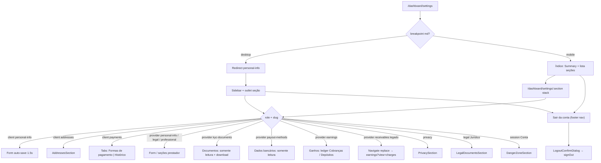

# Configurações (cliente e prestador)

Documentação alinhada a `src/features/settings/`, hub em `src/router.tsx` (`/dashboard/settings/*`) e APIs/hooks da feature. Endereços e histórico/cartões do **cliente** são **embutidos** — detalhe canônico nos módulos `addresses` e `payments` (links apenas). Prestador: página **Ganhos** unificada (settings **compõe** Public API de `provider-earnings` + `payments`, como Pagamentos do cliente); seção **Dados bancários** (somente leitura; settings **compõe** `provider_profiles_private` + catálogo/suporte de `provider-kyc`); seção **Documentos** (`kyc-documents` — somente leitura + download; settings **compõe** Public API de `provider-kyc`: `listKycOnboardingDocuments`, `getKycDocumentSignedUrl`, URLs de suporte).

ADR de navegação: [`docs/adr/0002-account-settings-hub.md`](../../../../adr/0002-account-settings-hub.md).

---

## 1. Resumo executivo

Hub responsivo de configurações sob `/dashboard/settings` (slugs em inglês), não mais uma página única em scroll em `/dashboard/conta`. Cliente e prestador mantêm cadastro, foto, privacidade/LGPD, documentos oficiais (seção **Jurídico**, slug `legal`) e exclusão de conta (seção Conta) em seções; o prestador gerencia ainda identidade legal (`legal-identity` — cadastro PF/PJ **editável**, distinto de Jurídico e de Documentos), **Documentos** (`kyc-documents` — anexos do onboarding, somente leitura + download), perfil profissional (público, ofertados, área, portfólio) e **Ganhos** (página unificada: valor combinado na captura + o que cai na conta), e consulta **Dados bancários** (`payout-methods` — somente leitura nesta iteração). Logout fica no rodapé da navegação do hub (**Sair da conta**), não em rota. **Fase 1:** só o shell de navegação; UIs de formulário/seção existentes reutilizadas; auto-save inalterado (Dados bancários e Documentos **não** têm auto-save). Exclusão de conta e exportação LGPD hoje são fluxos manuais via e-mail ao DPO (`dpo@prestway.com`). Jurídico não persiste dados (só links externos).

## 2. Objetivo de negócio

- Manter dados cadastrais confiáveis para contratação, matching geográfico e página pública do prestador.
- Oferecer ponto de saída (logout no rodapé da nav / exclusão em Conta) mesmo com KYC prestador incompleto.
- Centralizar preferências de privacidade e pedidos LGPD sem self-service destrutivo na API.
- Um hub de conta no menu do dashboard (sem Endereços / Ganhos como itens top-level).

## 3. Localização na plataforma

| Superfície | Rota | Guard / chrome |
|------------|------|----------------|
| Índice Configurações | `/dashboard/settings` | Dashboard autenticado; **mobile** tab-root (lista); **desktop** `Navigate` → `personal-info` |
| Seções | `/dashboard/settings/:section` | Mobile **stack** (voltar → `/dashboard/settings`); desktop sidebar + outlet |

**Seções (slugs):**

| Papel | Slugs |
|-------|-------|
| Cliente | `personal-info`, `addresses`, `payments`, `privacy`, `legal`, `session` |
| Prestador (nav) | `personal-info`, `legal-identity`, `kyc-documents`, `professional-profile`, `payout-methods`, `earnings`, `privacy`, `legal`, `session` — **Documentos** (`FileText`) depois de Identidade legal e antes de Perfil profissional; **Dados bancários** (`Landmark`) depois de Perfil profissional e antes de **Ganhos** (`Wallet`); **sem** item Recebimentos; cliente **não** vê Documentos nem Dados bancários |
| Prestador (legado) | Slug `receivables` permanece em `SETTINGS_SECTION` e `PROVIDER_ONLY_SETTINGS_SECTIONS`; rota `/dashboard/settings/receivables` existe no router; `ProviderReceivablesPage` faz `Navigate replace` para `ROUTE_SETTINGS_RECEIVABLES` = `/dashboard/settings/earnings?view=charges`. Stack title de `receivables` e `earnings` = “Ganhos” |

- **Layout:** `SettingsLayout` — desktop: sidebar `SettingsNavList` + `<Outlet />`; mobile: só outlet.
- **Índice mobile:** `SettingsIndexPage` — título “Configurações”, `AccountSummaryCard`, lista de seções + rodapé **Sair da conta**.
- **Nav do hub (`settingsNav.ts` / `SettingsNavList`):** cauda compartilhada (`SHARED_TAIL`) **Privacidade** → **Jurídico** (`legal`, ícone Lucide `Scale`) → **Conta** (`session`, ícone `UserCog`); abaixo do divisor, item de rodapé **Sair da conta** (`kind: "logout"`, ícone `LogOut`) — **não** é rota; abre `LogoutConfirmDialog`. Título stack mobile: `SETTINGS_SECTION_STACK_TITLE.legal = "Jurídico"`.
- **Jurídico vs Identidade legal vs Documentos:** slug `legal` (`ROUTE_SETTINGS_LEGAL` = `/dashboard/settings/legal`) é hub de documentos oficiais da plataforma para **ambos** os papéis (sem `SettingsRoleGate`); `legal-identity` é só prestador (campos PF/PJ **editáveis**, auto-save — **não** baixa arquivos); `kyc-documents` é só prestador (anexos do onboarding, somente leitura + download). Não misturar.
- **Summary card:** mobile no índice; desktop só em `personal-info` (`ClientPersonalInfoPage` / `ProviderPersonalInfoPage`).
- **KYC:** prefixo allowlist `PROVIDER_KYC_ALLOWED_PATH_PREFIX = "/dashboard/settings"` — ver [gate-e-acesso-operacional](../../provider-kyc/features/gate-e-acesso-operacional.md).
- **Menu dashboard:** item **Configurações** → `/dashboard/settings` (`dashboardMenu.ts`). Removidos itens **Endereços** e **Ganhos**.
- **Rotas removidas (sem redirect):** `/dashboard/conta`, `/dashboard/earnings`, `/dashboard/addresses`.
- **Constante:** `ROUTE_SETTINGS`; helpers `settingsSectionPath` / `SETTINGS_SECTION` (incl. `legal`, `kycDocuments` = `kyc-documents`, `payoutMethods` = `payout-methods`, `earnings`, `receivables`) / `ROUTE_SETTINGS_LEGAL` / `ROUTE_SETTINGS_KYC_DOCUMENTS` (`/dashboard/settings/kyc-documents`) / `ROUTE_SETTINGS_PAYOUT_METHODS` (`/dashboard/settings/payout-methods`) / `ROUTE_SETTINGS_EARNINGS` / `ROUTE_SETTINGS_RECEIVABLES` (`${ROUTE_SETTINGS_EARNINGS}?view=charges`) em `constants/routes.ts`. Stack title `kyc-documents` = “Documentos”; `payout-methods` = “Dados bancários”; `PROVIDER_ONLY_SETTINGS_SECTIONS` inclui `kycDocuments` e `payoutMethods`.
- **Query da página Ganhos:** `view=charges` abre Cobranças; ausência ou outro valor = Depósitos. `period=3m` | `period=6m`; default **Este mês** omite o param. Os dois convivem (`useEarningsViewParam` / `parseEarningsView` / `parseEarningsPeriod`; helper `providerEarningsPath("charges")` só define `view`).

## 4. Perfis envolvidos

| Perfil | Acesso | Não acessa |
|--------|--------|------------|
| `client` | Seções cliente + cauda compartilhada (`privacy`, `legal`, `session`); `SettingsRoleGate` nas seções client-only | legal-identity, kyc-documents, professional-profile, payout-methods, earnings (e rota legado receivables, que redireciona para Ganhos e depois o gate da página earnings) |
| `provider` | Seções prestador + mesma cauda compartilhada; em Jurídico vê também o contrato de uso | addresses, payments (cartões/histórico cliente) |
| Visitante | Não | Guard do dashboard |
| `admin` | Sem superfície dedicada neste hub | — |

## 5. Fluxo funcional principal

### Cliente — feliz

1. Abre hub → mobile lista; desktop personal-info.
2. Edita nome/telefone/CPF em personal-info → após 1500 ms valida Zod e persiste `profiles` + `client_profiles_private`.
3. Endereços / pagamentos nas seções dedicadas; em Pagamentos, abas **Formas de pagamento** (cartões) e **Histórico**.
4. Privacidade (DPO / exportar / atalho da política); Jurídico (termos + política); Conta (exclusão / DPO); ou **Sair da conta** no rodapé da nav (logout).

### Prestador — feliz

1. Abre hub → mesma lógica mobile/desktop.
2. **Informações pessoais** (`personal-info`): nome, e-mail (somente leitura) e telefone — **sem CPF** (`DadosPessoaisSection` com `showCpf={false}`; header: “Nome, foto e telefone de contato”). Auto-save com debounce 2000 ms.
3. **Identidade legal** (`legal-identity`): header “Identidade legal” / “Como você atua na Prestway e os documentos do cadastro”. `EntityTypeSection`: escolha PF/PJ em `radiogroup` (tiles com `aria-checked` e check no canto; sem card aninhado; **sem** botão/dialog “Preciso de ajuda para escolher”); a troca **não** aplica imediatamente — ao clicar no tipo **diferente** do `entity_type` atual, abre `AlertDialog` (`alertdialog`) **antes** de `onChange`/auto-save (padrão `LogoutConfirmDialog`, não bottom sheet). Copy PJ: título “Trocar para pessoa jurídica?”; descrição: documentos do cadastro passam a ser os da empresa (CNPJ, razão social e representante legal). Copy PF: título “Trocar para pessoa física?”; descrição: documentos passam a ser os de pessoa física (CPF); dados da empresa deixam de ser o documento principal. Botões: **Cancelar** (fecha, não chama `onChange`, seleção permanece) | **Trocar** (`onChange` com o tipo pendente → `ProviderLegalIdentityPage` faz `form.setValue("entity_type", v, { shouldDirty: true })` e o auto-save existente segue). Clicar no tipo já selecionado ou com `disabled`: não abre dialog / não chama `onChange`. **Não** limpa os campos da outra entidade. Disclaimer visível abaixo: “A Prestway não fornece assessoria jurídica ou contábil…”. `LegalIdentitySection`: um painel — PF: grupo “Documento” + CPF (`cpf`); PJ: “Empresa” (CNPJ, razão social, nome fantasia), “Representante legal” (nome completo, CPF do representante — `legal_representative_cpf`, não o campo `cpf` de PF), “Contato comercial” (telefone ou e-mail). Loading: `LegalIdentityFormSkeleton`. Auto-save via `useProviderSettingsForm` (debounce/grupos dirty inalterados). Sem mudança de persistência/API. **Não** lista nem baixa os arquivos do onboarding (isso é a seção Documentos).
4. **Documentos** (`ProviderKycDocumentsPage`): `SettingsRoleGate allow={["provider"]}`. Header “Documentos” / “Arquivos enviados na verificação da conta”. Loading: `KycDocumentsFormSkeleton` (3 campos). Erro: `AccountErrorState` + retry. Card **Documentos do cadastro** (`KycDocumentsSection`, ícone FileText; descrição “Enviados no cadastro. Alterações só pelo suporte.”): lista de slots via `listKycOnboardingDocuments` (domínio `provider-kyc`). PF: Documento de identidade (CPF/CNH) + Comprovante de endereço. PJ: Documento do representante legal + Comprovante de endereço da empresa + Contrato social (**não** duplica identity; se `legal_rep_doc_storage_path` vazio, fallback para `identity_doc_storage_path` — dual-map do wizard). `entity_type` ausente trata como PF. Slots esperados aparecem mesmo sem arquivo. Slot enviado: filename (último segmento do path) + botão **Baixar** (`aria-label` “Baixar {label}”). Slot não enviado: “Não enviado”, sem Baixar. Copy: “Estes documentos não podem ser alterados por aqui. Se precisar atualizar algum arquivo, fale com o suporte.” CTA **Falar com o suporte** (`<a target="_blank" rel="noopener noreferrer">`): `PROVIDER_KYC_SUPPORT_URL` ?? `PROVIDER_KYC_HELP_MAILTO`. Download: `useProviderKycDocuments` → `getKycDocumentSignedUrl(path)` → `window.open(url, "_blank", "noopener,noreferrer")`; falha → toast “Não foi possível baixar o documento. Tente novamente.” Path vazio na API → error “Documento não encontrado”. Bucket `provider-kyc-documents`; expiry `KYC_DOCUMENT_SIGNED_URL_EXPIRY_SEC` (7 dias). Fonte: `getProviderPrivateProfile` (`select *`) via `useProviderProfile`. **Não** há auto-save, **não** há re-upload, **não** há edição. Sem RPC/migration nova (Storage SELECT do dono já permitido). **≠** Identidade legal (campos) **≠** Jurídico (termos) **≠** Dados bancários (conta/PIX).
5. **Perfil profissional** (`professional-profile`): header desktop “Perfil profissional” / “Pedidos que você recebe e como os clientes te veem” (nav e stack mobile: “Perfil profissional”). Layout em **Tabs** (`aria-label="Seções do perfil profissional"`), mesmo padrão de Pagamentos (`ClientPaymentsPage`: `TabsList` grid 2 colunas, `rounded-xl bg-canvas-soft`): (1) aba **Pedidos** (ícone Briefcase, value `orders`, default) — `OfferedServicesSection` (**Serviços oferecidos**: “Tipos de pedido que entram no seu feed”; busca com ícone; chips pill; empty “Nenhum serviço selecionado ainda. Busque acima para receber pedidos desses tipos.”; add/remove com mutação explícita `setServiceIdsAsync`) + `ServiceAreaSection` (**Área de atuação**: “Cidades e bairros em que você atende”; cidades em artigos com MapPin; empty “Nenhuma cidade adicionada. Inclua onde você atende para receber pedidos da região.”; no mobile, “Alterar bairros” abre Drawer (vaul), no desktop Popover) + `SettingsAutosaveHint`; (2) aba **Vitrine** (ícone Eye, value `showcase`) — `PublicProfileSettingsSection` (**Perfil público**: “Nome, bio e visibilidade do perfil”; visibilidade em tiles `radiogroup` **Público** / **Restrito**, padrão visual de `EntityTypeSection`: check no canto, ícones Globe/Lock; descrições sem prefixo “Público —”; barra “Ver como os clientes veem” com **Visualizar perfil** / **Copiar link** quando há slug; **não** inclui área de atuação neste card), `SettingsAutosaveHint`, `PortfolioManagementSection` (**Portfólio**: “Trabalhos exibidos no perfil público”; cards capa + título; empty ilustrado “Nenhum item no portfólio”; DnD `@dnd-kit` inalterado; overlay add/edit no padrão Endereços (`AddressFormDialog`) e cartão em settings (`AddCardSheetDialog` com `desktopPresentation="sheet"`): desktop (`useBreakpointMd`) **Sheet** `side="right"` (título Manrope; footer **Cancelar** / **Adicionar**|**Salvar**; close nativo sr-only “Fechar”); mobile **Drawer** (vaul, `shouldScaleBackground={false}`, `handleOnly`, `dismissible={!isWorking}`) com handle, botão “Fechar” e footer acima do teclado (`safe-area-inset-bottom`, blur); enquanto `isWorking` (criar/atualizar/submit), Cancelar disabled e overlay não fecha; contrato do formulário inalterado — título, descrição, imagens, create/update; `visibility: "public"` forçado no create/update pela página). Cards empilhados com `space-y-5`. `SettingsConsequenceGroup` **removido** (sem capítulos editoriais “Como você atua” / “Como os clientes te veem”). Loading: `ProfessionalProfileFormSkeleton` (barra de abas + cards da aba Pedidos: ofertados + área + hint — não o skeleton monolítico `ProviderFormSkeleton`). Auto-save do form (debounce 2000 ms / grupos dirty) e APIs de ofertados/área/portfólio **inalterados**. Sem rota nova e sem item novo na nav.
6. **Dados bancários** (`ProviderPayoutMethodsPage`): `SettingsRoleGate allow={["provider"]}`. Header “Dados bancários” / “Conta onde a Prestway deposita os seus ganhos”. Loading: `PayoutMethodsFormSkeleton` (4 campos). Erro: `AccountErrorState` + retry. Card **Conta para depósito** (`PayoutMethodsSection`, ícone Landmark; descrição “Informados no cadastro. Alterações só pelo suporte.”): campos **read-only + disabled** — Banco (label via `formatBankLabel` / lista `useBrazilianBanks`; se o código FEBRABAN não resolve na lista, fallback = o próprio código), Agência, Conta com dígito, Chave PIX. Vazio (após trim): Banco/Agência/Conta = “—”; PIX = “Não informada”. Copy: “Estes dados não podem ser alterados por aqui. Se precisar atualizar banco, agência, conta ou PIX, fale com o suporte.” CTA **Falar com o suporte** (`<a target="_blank" rel="noopener noreferrer">`): `PROVIDER_KYC_SUPPORT_URL` (`VITE_MAIN_SITE_URL/suporte`) ou, se `VITE_MAIN_SITE_URL` ausente, `PROVIDER_KYC_HELP_MAILTO` (`mailto:contato@prestway.com?subject=Ajuda com documentos do onboarding`). Fonte: `getProviderPrivateProfile` (`select *` em `provider_profiles_private`) via `useProviderProfile` + `useProviderPayoutMethods`. **Não** há auto-save, **não** há `BankPicker` editável, **não** atualiza `bank_*` / `pix_key` via `updateProviderPrivateProfile` (params de update continuam só identidade legal). Sem RPC/migration nova. **≠** Ganhos (liquidação). **≠** Documentos (anexos KYC).
7. **Ganhos** (`ProviderEarningsSectionPage`): header “Ganhos” / “O valor combinado com o cliente e o que cai na sua conta”; `EarningsLedgerSwitch` num único poço `rounded-xl bg-canvas-soft p-1`: período (`role="group"` `aria-label="Período dos ganhos"`; `grid-cols-3`; botões `h-11` `aria-pressed`; ativo = `bg-canvas shadow-sm`; **Este mês** default / **3 meses** / **6 meses`) + abas (`TabsList` `grid-cols-2`; `aria-label="Listas de ganhos"`; ícones Banknote/Landmark em poço `bg-audience-soft text-audience`, não `text-accent`; captions **Valor combinado** / **Na sua conta**; aba ativa: fundo canvas + sombra + `aria-selected`; **sem** “Lista abaixo”, “Toque para ver a lista” nem ChevronDown; **sem** seta entre painéis). Query `view=charges` abre **Cobranças**; ausência ou outro valor = **Depósitos** (default). Query `period=3m`/`6m` (default Este mês omite o param) convive com `view`. `useEarningsViewParam` + `parseEarningsView` + `parseEarningsPeriod`. O período filtra totais do ledger e as duas listas (`getEarningsPeriodRange`, calendário `America/Sao_Paulo`). Aba Depósitos: `EarningsPage` (filtros Todos/Previsto/Liquidado em chips soltos — `rounded-full`, `bg-transparent`, ativo `bg-muted`; **sem** ícones; `aria-label="Filtros de ganhos"` + lista; sem header próprio e sem link para Recebimentos). Aba Cobranças: `PaymentHistorySection role="provider"` (filtro `received_at` na view). Totais do ledger via `useEarningsLedgerSummary` (Public API de payments + `useProviderSettlements`, com o mesmo range). Deep link legado `/dashboard/settings/receivables` → Cobranças.
8. Privacidade; Jurídico (termos + política + **Contrato de uso da plataforma**); Conta (DPO); ou **Sair da conta** no rodapé da nav.

## 6. Fluxos alternativos e exceções

| Caso | Comportamento |
|------|---------------|
| Erro de carga do perfil | `AccountErrorState` — “Não foi possível carregar sua conta” + retry |
| Auto-save parcial (cliente/prestador) | Toast “Não foi possível salvar todas as alterações…” |
| Schema inválido (cliente) | Seta erro no primeiro campo; **sem** toast de inválido |
| Schema inválido (prestador) | Erro no campo + toast “Não foi possível salvar… campo inválido.” |
| Catch genérico auto-save | Toast “Não foi possível atualizar seus dados…” |
| Sucesso prestador | Toast “Dados atualizados com sucesso.” |
| Sem `VITE_MAIN_SITE_URL` | Links jurídicos `null` → textos “em breve” por documento (Privacidade e seção Jurídico) |
| Copiar link falha | Toasts distintos no card vs seção pública |
| Foto inválida no seletor | Validação retorna e **encerra sem toast** (`AccountSummaryCard`) |
| Exclusão | Dialog informa mailto DPO — **não** chama delete API |
| Papel errado na seção | `SettingsRoleGate` redireciona / bloqueia conforme implementação |
| Troca PF↔PJ em Identidade legal | `AlertDialog` de confirmação **antes** de `onChange`; Cancelar mantém seleção; Trocar aplica e auto-save segue; tipo já selecionado / `disabled` não abre; **não** limpa campos da outra entidade; **não** é o dialog antigo de ajuda |
| Overlay add/edit do portfólio | Deixou de ser `Dialog` centrado (`ShellDialogContent`). Desktop (`useBreakpointMd`): **Sheet** `side="right"`. Mobile: **Drawer** (vaul). Enquanto `isWorking`, **Cancelar** disabled e overlay não fecha. Contrato do formulário inalterado |
| Dados bancários | Somente leitura; sem auto-save; cliente em `/dashboard/settings/payout-methods` → `SettingsRoleGate` redireciona para personal-info |
| Documentos (`kyc-documents`) | Somente leitura + download; sem auto-save / re-upload; cliente em `/dashboard/settings/kyc-documents` → `SettingsRoleGate` redireciona para personal-info; falha de signed URL → toast “Não foi possível baixar o documento. Tente novamente.” |

## 7. Regras de negócio (numeradas)

1. Auto-save cliente só com `formState.isDirty`; debounce **1500 ms**.
2. Auto-save prestador debounce **2000 ms**; limpa erros dos campos alterados antes de revalidar.
3. Grupos prestador: `full_name`/`phone` → `profiles`; bloco privado → `provider_profiles_private`; bloco público → `provider_profiles_public`.
4. `service_area_neighborhood_ids` só enviado no update público quando o campo está dirty (evita delete+insert desnecessário).
5. PJ: schema exige CNPJ e razão social preenchidos (`entity_type === "pj"`).
6. Portfólio criado/atualizado pela página força `visibility: "public"`.
7. Imagem de perfil: máx. **2 MB**; tipos JPEG/PNG/WebP/HEIC/HEIF.
8. Imagem de portfólio: máx. **5 MB**; mesmos tipos; input pode acumular múltiplos arquivos; sem teto explícito de quantidade por item no front.
9. DPO: `dpo@prestway.com`; prazo informado na UI: **15 dias úteis**.
10. E-mail do usuário não é editável no formulário.
11. Slug: em `updateProviderPublicProfile`, se `display_name` atualiza e slug atual é null ou igual a `providerId`, gera slug único; após slug “real”, alterações de nome não mudam o slug (código analisado).
12. Prestador: `useUpdateAccountProfile({ silent: true })` — toasts de profile base silenciados no fluxo de grupos.
13. Cliente — seção payments: header “Pagamentos”; abas **Formas de pagamento** (`SavedCardsList` com `tokenizeContext="profile"` e `phone` do perfil) e **Histórico** (`PaymentHistorySection role="client"`). Listas Prestway sem card/título aninhado (título só no header da página).
14. Prestador — Ganhos (`ProviderEarningsSectionPage`): uma página, dois conceitos. Ledger: **Cobranças** = soma client-side de `amountReceivedAtCapture` no período (valor combinado); se houver clawback, linha “Líquido após estornos: {net}”. **Depósitos** (default) = **contagem** de movements (`totalCount` da RPC com filtro `all` / CREDIT e range de `settling_at`), não soma em R$. Um poço `rounded-xl bg-canvas-soft p-1` agrupa período (controle segmentado) e abas Cobranças/Depósitos; **sem** seta entre painéis. Período **Este mês** / **3 meses** / **6 meses** filtra totais e as duas listas. Captions **Valor combinado** / **Na sua conta**. Caption D+30 + `PROVIDER_SETTLEMENT_COMPLETION_NOTE`. Settings **compõe** (não importa internals cruzados). Contratos/views de captura no módulo payments; lista/filtros de liquidação em `provider-earnings`. Sem RPC/migration nova nesta iteração. Sem filtro por serviço.
15. Logout: item **Sair da conta** no rodapé de `SettingsNavList` (sidebar desktop + índice mobile) → `LogoutConfirmDialog` (`AlertDialog`) → `signOut()` (`useAuth`). Não é rota/`session`.
16. Seção Conta (`/dashboard/settings/session`): header “Conta” / “Exclusão permanente da sua conta”; só `DangerZoneSection` (orientação DPO). `LogoutSection` removida.
17. Seção Jurídico (`/dashboard/settings/legal`): header “Jurídico” / “Documentos oficiais da Prestway”; `LegalDocumentsSection` (`aria-label="Documentos jurídicos"`). Links (mesmo padrão do cadastro; `null` se `VITE_MAIN_SITE_URL` ausente): Termos de uso → `TERMS_OF_USE_URL` (`…/juridico/termos-de-uso`); Política de privacidade → `PRIVACY_POLICY_URL`; **só prestador** (`showProviderContract` via `profile.role === "provider"`): Contrato de uso da plataforma → `PROVIDER_PLATFORM_CONTRACT_URL` (`…/juridico/adesao-prestador`, mesmo path do “Contrato de Adesão” no signup). **Não** lista política de comissões nem adesão-cliente. Sem `SettingsRoleGate`, sem persistência/API/migration. Privacidade permanece com DPO / exportar / atalho da política — Jurídico não a substitui.
18. Fase 1: shell de navegação; sem redesign row-by-row dos formulários.
19. Prestador — Informações pessoais: `DadosPessoaisSection` com `showCpf={false}` (sem campo CPF na UI). Cliente — mesma seção com default `showCpf={true}` (CPF em Dados pessoais).
20. Prestador — Identidade legal (`ProviderLegalIdentityPage`): PF/PJ via tiles `radiogroup` (`EntityTypeSection`); troca para tipo diferente exige confirmação em `AlertDialog` (Cancelar / Trocar) **antes** de `onChange` + auto-save (`setValue` dirty); tipo já selecionado ou `disabled` não abre dialog; **não** limpa campos da outra entidade; **sem** dialog “Preciso de ajuda para escolher”. Documentos em um painel (`LegalIdentitySection`) — PF: grupo Documento/`cpf`; PJ: grupos Empresa / Representante legal / Contato comercial (`legal_representative_cpf`, não o campo `cpf` de PF). Skeleton dedicado `LegalIdentityFormSkeleton`. Persistência/API inalteradas.
21. Prestador — Perfil profissional (`ProviderProfessionalProfilePage`): Tabs **Pedidos** / **Vitrine** (padrão Pagamentos/`ClientPaymentsPage`; `aria-label="Seções do perfil profissional"`). Aba **Pedidos** (default, value `orders`, ícone Briefcase): Serviços oferecidos `OfferedServicesSection` + Área de atuação `ServiceAreaSection` / `ServiceAreaField` (mobile Drawer vaul para editar bairros) + `SettingsAutosaveHint`. Aba **Vitrine** (value `showcase`, ícone Eye): Perfil público `PublicProfileSettingsSection`; visibilidade Público/Restrito em tiles `radiogroup`; preview Visualizar/Copiar só com slug; **sem** área embutida; `SettingsAutosaveHint`; Portfólio `PortfolioManagementSection`; cards capa+título; empty ilustrado; DnD inalterado; overlay add/edit = Sheet direita no desktop / Drawer (vaul) no mobile (não mais Dialog centrado); enquanto `isWorking`, Cancelar disabled e overlay não fecha; contrato do formulário inalterado (título, descrição, imagens, create/update, `visibility: "public"` na página). Cards empilhados `space-y-5`. `SettingsConsequenceGroup` removido. Skeleton dedicado `ProfessionalProfileFormSkeleton` (barra de abas + cards da aba Pedidos). Rota `/dashboard/settings/professional-profile`, persistência e auto-save **inalterados**.
22. Prestador — Dados bancários (`ProviderPayoutMethodsPage` / `PayoutMethodsSection`): somente leitura nesta iteração. Exibe `bank_institution_code` (label `formatBankLabel` ou fallback código FEBRABAN), `bank_branch`, `bank_account`, `pix_key` de `provider_profiles_private` (`getProviderPrivateProfile` `select *`). Campos Input `readOnly` + `disabled`. Vazios: “—” (banco/agência/conta) e “Não informada” (PIX). CTA suporte: `PROVIDER_KYC_SUPPORT_URL` ?? `PROVIDER_KYC_HELP_MAILTO`. **Não** chama `updateProviderPrivateProfile` com `bank_*` / `pix_key` (tipo `UpdateProviderPrivateParams` só identidade legal). Sem `BankPicker`, sem auto-save, sem RPC/migration nova. Nav: depois de Perfil profissional, antes de Ganhos; `PROVIDER_ONLY_SETTINGS_SECTIONS` inclui `payoutMethods`.
23. Prestador — Documentos (`ProviderKycDocumentsPage` / `KycDocumentsSection`): somente leitura + download nesta iteração. Settings **compõe** Public API de `provider-kyc` (`listKycOnboardingDocuments`, `getKycDocumentSignedUrl`, `PROVIDER_KYC_SUPPORT_URL` / `PROVIDER_KYC_HELP_MAILTO`). Paths em `provider_profiles_private`: `identity_doc_storage_path`, `address_proof_storage_path`, `corporate_charter_storage_path`, `legal_rep_doc_storage_path` + `entity_type` (`pf` | `pj`). PF: identity + address-proof. PJ: legal-rep-id + address-proof da empresa + corporate-charter (sem slot identity duplicado; legal_rep vazio → fallback identity). `entity_type` ausente = PF. Slots vazios: “Não enviado”. Download: signed URL no bucket `provider-kyc-documents` (`KYC_DOCUMENT_SIGNED_URL_EXPIRY_SEC` = 7 dias) + `window.open`; path vazio → “Documento não encontrado”. Sem auto-save, sem re-upload, sem RPC/migration nova (SELECT storage do dono já existe). Nav: depois de Identidade legal, antes de Perfil profissional; `PROVIDER_ONLY_SETTINGS_SECTIONS` inclui `kycDocuments`. **≠** Identidade legal **≠** Jurídico **≠** Dados bancários.

## 8. Campos e dados

### 8.1 Cliente — `accountFormSchema`

| Campo | Label | Obrigatório | Validação | Persistência |
|-------|-------|-------------|-----------|--------------|
| `full_name` | Nome completo | Sim | `min(1)` + `validateFullName` | `profiles.full_name` |
| `phone` | Telefone / WhatsApp | Não | Vazio OK; senão `validateBrazilPhone` | `profiles.phone` |
| `cpf` | CPF | Não | Vazio OK; senão `validateCPF` | `client_profiles_private.cpf` |
| E-mail | E-mail | — | Disabled | Auth (`user.email`) |

### 8.2 Prestador — `providerAccountFormSchema`

| Campo | UI | Obrigatório | Validação | Persistência |
|-------|-----|-------------|-----------|--------------|
| `full_name` | Nome completo | Sim | Igual cliente | `profiles` |
| `phone` | Contato (card separado) | Não | Telefone BR | `profiles` |
| `entity_type` | PF / PJ | Sim | enum | privado |
| `cpf` | CPF (PF) — só em `legal-identity` / `LegalIdentitySection` quando PF; **oculto** em `personal-info` | Se preenchido válido | CPF | `provider_profiles_private` |
| `cnpj`, `razao_social` | PJ (`legal-identity`) | Refine PJ | CNPJ + não vazios | privado |
| `nome_fantasia`, `legal_representative_name`, `legal_representative_cpf`, `commercial_contact` | PJ (`legal-identity`) | Não | CPF rep. se preenchido; contact max 120 | privado |
| `display_name`, `bio` | Perfil público | Não | max 120 / 2000 | público |
| `profile_visibility` | Visibilidade | Sim | `public` \| `restricted` | público |
| `service_area_neighborhood_ids` | Área | Não | UUIDs | `provider_service_area_neighborhoods` |
| `service_area_city` | Apoio UI | Não | — | derivado |

Os campos `bank_institution_code`, `bank_branch`, `bank_account` e `pix_key` existem em `provider_profiles_private` e são **lidos** na seção Dados bancários; **não** fazem parte de `providerAccountFormSchema` nem de `UpdateProviderPrivateParams`. Os paths `identity_doc_storage_path`, `address_proof_storage_path`, `corporate_charter_storage_path` e `legal_rep_doc_storage_path` também são **lidos** na seção Documentos (via `listKycOnboardingDocuments`); **não** entram no schema de auto-save nem em `UpdateProviderPrivateParams`.

### 8.3 Prestador — Dados bancários (somente leitura)

| Campo persistido | Label UI | Vazio | Origem |
|------------------|----------|-------|--------|
| `bank_institution_code` | Banco | “—” | Label `formatBankLabel(bank)` se o código estiver na lista `useBrazilianBanks`; senão o próprio código FEBRABAN |
| `bank_branch` | Agência | “—” | `provider_profiles_private` |
| `bank_account` | Conta com dígito | “—” | `provider_profiles_private` |
| `pix_key` | Chave PIX | “Não informada” | `provider_profiles_private` |

### 8.4 Prestador — Documentos do cadastro (somente leitura + download)

Slots montados por `listKycOnboardingDocuments` a partir de `entity_type` e dos paths em `provider_profiles_private`. Filename = último segmento do path (`kycDocumentFileName`). Sem path (após trim): `fileName` null → UI “Não enviado”.

| `entity_type` | Slot (`key`) | Label UI | Path |
|---------------|--------------|----------|------|
| `pf` (ou ausente) | `identity` | Documento de identidade (CPF/CNH) | `identity_doc_storage_path` |
| `pf` (ou ausente) | `address-proof` | Comprovante de endereço | `address_proof_storage_path` |
| `pj` | `legal-rep-id` | Documento do representante legal | `legal_rep_doc_storage_path`, ou fallback `identity_doc_storage_path` se o primeiro estiver vazio (dual-map do wizard) |
| `pj` | `address-proof` | Comprovante de endereço da empresa | `address_proof_storage_path` |
| `pj` | `corporate-charter` | Contrato social | `corporate_charter_storage_path` |

PJ **não** lista um slot `identity` separado. Helpers na UI: identity PF “Comprova sua identidade para uso da plataforma.”; address PF “Conta de luz, água ou extrato recente em seu nome.”; legal-rep “RG ou CNH do responsável legal pela empresa.”; address PJ “Conta de luz, água ou extrato recente em nome da empresa.”; contrato social “Documento que comprova a constituição da empresa.”

## 9. Validações de front-end

- Zod: `types/accountForm.validation.ts`, `types/providerAccountForm.validation.ts` (reexports em `schemas/` também existem).
- Máscaras: `maskPhone`, `maskCPF`, CNPJ via validadores compartilhados.
- Upload: `validateProfileImageFile` / `validatePortfolioImageFile`.
- Portfólio: título obrigatório (trim) no overlay add/edit da seção (Sheet desktop / Drawer mobile; evidência em `PortfolioManagementSection` / hooks).

## 10. Validações de back-end

- UPSERTs/tabelas privados com RLS por usuário (migrations `20260318100000_*` tipicamente — evidência parcial: paths de API; regras SQL finas no módulo Supabase).
- Storage buckets privados com signed URLs (expiry 3600 s nas constantes).
- **Evidência parcial:** constraints exatas de unique slug / RLS não reauditadas neste ciclo além do comportamento do client `resolveUniqueSlug`.

## 11. Status, estados e transições

| Estado UI | Quando |
|-----------|--------|
| Loading skeleton | `profileLoading` / sem perfil inicial / layout loading; em `professional-profile`: `ProfessionalProfileFormSkeleton` (barra de abas + cards da aba Pedidos); em `legal-identity`: `LegalIdentityFormSkeleton`; em `kyc-documents`: `KycDocumentsFormSkeleton` (3 campos); em `payout-methods`: `PayoutMethodsFormSkeleton` (4 campos) |
| Error state | `profileError && !profile` |
| Salvando… | Mutação em andamento (`Loader2`) |
| Idle auto-save | Texto “As alterações são salvas automaticamente.” |
| Dialogs | Exportar dados, excluir conta (orientação), logout |

Não há FSM de domínio próprio além de `entity_type` PF/PJ e `profile_visibility`.

## 12. Persistência

| Destino | Conteúdo |
|---------|----------|
| Supabase tables | Ver README §7 / seção 8 |
| Storage | `profile-images`, `provider-portfolio-images`; anexos KYC no bucket `provider-kyc-documents` (consulta/download em Documentos; upload só no wizard) |
| Cliente | React Hook Form + TanStack Query caches dos hooks |
| Sem Preferences/draft local de conta | Evidência: sem keys de Preferences nesta feature |

## 13. Integrações

| Destino | Como |
|---------|------|
| `auth` | Perfil base, update, signOut |
| `addresses` | `/dashboard/settings/addresses` — [gestão de endereços](../../addresses/features/gestao-de-enderecos.md) |
| `payments` | Cartões + histórico cliente em `/dashboard/settings/payments`; captura do prestador na aba Cobranças de Ganhos — [histórico e reembolso](../../payments/features/historico-e-reembolso.md); erros de cartão em [checkout](../../payments/features/checkout-e-cobranca.md) |
| `provider-earnings` | Hospedado em `/dashboard/settings/earnings` (`ProviderEarningsSectionPage`: `EarningsLedgerSwitch` + `EarningsPage` / captura via payments); `ROUTE_PROVIDER_EARNINGS`; `providerEarningsPath("charges")`; query `view` + `period` |
| `provider-kyc` | Allowlist `/dashboard/settings*`; Dados bancários reutiliza `useBrazilianBanks` / `formatBankLabel` / `findBrazilianBankByCode` e `PROVIDER_KYC_SUPPORT_URL` / `PROVIDER_KYC_HELP_MAILTO` (Public API). Documentos reutiliza `listKycOnboardingDocuments`, `getKycDocumentSignedUrl` e as mesmas URLs de suporte. Persistência de banco/PIX e de paths de arquivo continua no submit KYC (`payment_submit_provider_kyc`), não nestas seções |
| `provider-profile` | Link `/perfil/{slug}` |
| Site jurídico | Com `VITE_MAIN_SITE_URL`: `TERMS_OF_USE_URL` = `…/juridico/termos-de-uso`; `PRIVACY_POLICY_URL` = `…/juridico/politica-de-privacidade`; `PROVIDER_PLATFORM_CONTRACT_URL` = `…/juridico/adesao-prestador` (UI Jurídico só prestador). Sem env → `null` / “em breve”. Sem política de comissões nem adesão-cliente nesta seção. |

## 14. Listagens, buscas, filtros, paginação

- **Ofertados:** busca em `platform_services` — até 20 resultados com query / 10 sem query (`OfferedServicesSection`).
- **Portfólio:** lista do prestador + reorder DnD (`@dnd-kit`); sem paginação server-side evidenciada no hook de conta.
- **Histórico de pagamentos:** listagem/paginação no módulo `payments` (não duplicar aqui).
- **Ganhos:** controle de período + ledger + listagem/filtros de liquidação no módulo `provider-earnings`; lista de captura no módulo `payments` (aba Cobranças; filtro `received_at` na view, sem paginação nova).
- **Dados bancários:** um registro do prestador (`provider_profiles_private`); sem listagem/paginação. Catálogo de bancos via `useBrazilianBanks` (BrasilAPI + fallback local) só para resolver o **rótulo** do código já persistido — não é um picker nesta tela.
- **Documentos:** slots fixos PF (2) ou PJ (3) via `listKycOnboardingDocuments`; sem paginação. Download pontual por signed URL (não lista o bucket).
- **Endereços:** CRUD no módulo `addresses`.

## 15. Ações disponíveis

| Ação | Quem | Pré-condição | Resultado |
|------|------|--------------|-----------|
| Navegar seções | Ambos | Autenticado | Hub / stack / sidebar |
| Auto-save campos | Ambos | Dirty + Zod OK | Persistência |
| Upload / remover foto | Ambos | Arquivo válido / path existe | Storage + profile path |
| CRUD endereços | Cliente | Seção addresses | Feature addresses |
| Cartões salvos | Cliente | Seção payments → aba Formas de pagamento | Feature payments |
| Ver histórico captura | Cliente / Prestador | payments → aba Histórico / Ganhos → aba Cobranças (`?view=charges`) | `PaymentHistorySection` |
| Ver Ganhos | Prestador | Seção earnings (default Depósitos) | `ProviderEarningsSectionPage` + `EarningsPage` |
| Ver Dados bancários | Prestador | Seção `payout-methods` | `ProviderPayoutMethodsPage` (somente leitura) |
| Falar com o suporte (banco/PIX) | Prestador | Seção `payout-methods` | Abre `PROVIDER_KYC_SUPPORT_URL` ou `PROVIDER_KYC_HELP_MAILTO` em nova aba |
| Ver Documentos | Prestador | Seção `kyc-documents` | `ProviderKycDocumentsPage` (somente leitura) |
| Baixar documento KYC | Prestador | Slot com `storagePath` | `getKycDocumentSignedUrl` + `window.open` |
| Falar com o suporte (arquivos KYC) | Prestador | Seção `kyc-documents` | Abre `PROVIDER_KYC_SUPPORT_URL` ou `PROVIDER_KYC_HELP_MAILTO` em nova aba |
| Add/remove serviços | Prestador | professional-profile | `setOfferedServices` |
| Copiar / abrir perfil | Prestador | slug | Clipboard / nova URL |
| CRUD portfólio | Prestador | Título | Items + imagens |
| Falar DPO / Exportar | Ambos | privacy | mailto / dialog |
| Abrir documentos oficiais | Ambos | legal (`LegalDocumentsSection`); URLs se `VITE_MAIN_SITE_URL` | Nova aba / “em breve” |
| Ver contrato de uso da plataforma | Prestador | legal + `showProviderContract` | Link `PROVIDER_PLATFORM_CONTRACT_URL` ou “em breve” |
| Excluir conta (UI) | Ambos | Conta (`session`) / `DangerZoneSection` | Orientação DPO |
| Sair da conta | Ambos | Rodapé da nav (`SettingsNavList`) | `LogoutConfirmDialog` → `signOut` |

## 16. Dependências

- Internas: hooks/api listados na seção 19.
- Externas de feature: `auth`, `addresses`, `payments`, `provider-earnings` (host), `provider-kyc` (catálogo FEBRABAN + URLs de suporte em Dados bancários; `listKycOnboardingDocuments` + `getKycDocumentSignedUrl` + URLs de suporte em Documentos), `request-quote` (estilo), UI shadcn.
- Downstream: matching/área usa bairros; público usa slug.

## 17. Regras implícitas

- Hidratação do form: `hydratedProfileIdRef` evita reset contínuo após primeiro load do `profile.id` (fluxos de formulário reutilizados).
- Prestador: telefone fora de `DadosPessoaisSection` (card Contato dedicado) em personal-info.
- Prestador: CPF **não** aparece em Informações pessoais — `ProviderPersonalInfoPage` passa `showCpf={false}` a `DadosPessoaisSection` (default da prop é `true`). Cliente em `ClientPersonalInfoPage` não passa a prop → CPF permanece em Dados pessoais.
- Prestador: edição de documento fiscal/cadastral em Identidade legal (`LegalIdentitySection`, um painel): PF → grupo “Documento” + `cpf`; PJ → grupos “Empresa”, “Representante legal”, “Contato comercial” (`legal_representative_cpf` e demais campos PJ), sem exibir o campo `cpf` de PF. Tipo de entidade: tiles `radiogroup` + disclaimer jurídico; **sem** botão/dialog “Preciso de ajuda para escolher”. Troca PF↔PJ: `AlertDialog` de confirmação **antes** de `onChange` (não aplica imediatamente; Cancelar mantém seleção; Trocar dispara auto-save; **não** limpa campos da outra entidade; padrão `LogoutConfirmDialog`, não bottom sheet).
- Prestador: dados bancários **não** se editam em Configurações — só consulta em `payout-methods`. A coleta no app é o passo bank do wizard KYC (`BankPicker` + submit `payment_submit_provider_kyc`; reenvio após `REJECTED`). Esta seção **não** implementa update de `bank_*`/`pix_key`; a UI pede para falar com o suporte.
- Prestador: anexos KYC **não** se alteram em Configurações — só consulta/download em `kyc-documents`. Upload/reenvio é o passo documents do wizard (e reenvio após `REJECTED`). A UI pede para falar com o suporte.
- Cliente não vê `PaymentHistorySection` com role provider e vice-versa.
- Zona de perigo copy fala em remoção irreversível, mas ação real é pedido por e-mail.
- Toasts de sucesso de foto: “Foto atualizada com sucesso.” / “Foto removida.” (`useProfilePhotoMutation`).
- Produção usa apenas `SettingsLayout` + páginas em `components/sections/*` (hub por seção).

## 18. Riscos

- Usuário pode interpretar “Excluir minha conta” como delete imediato.
- Validação de foto silenciosa na UI.
- Dados sensíveis (CPF/CNPJ): cliente edita CPF em personal-info; prestador edita CPF/CNPJ em legal-identity — ambos com auto-save.
- Dados bancários (agência, conta, PIX) visíveis em Configurações, mas **sem** edição self-serve nesta iteração; CTA aponta para suporte/site.
- Anexos KYC visíveis/baixáveis em Configurações, mas **sem** re-upload self-serve; CTA aponta para suporte/site.
- Dependência de env (`VITE_MAIN_SITE_URL`) para links de documentos jurídicos (Privacidade + Jurídico).
- Deep links legados para `/dashboard/conta` (ex.: enqueue de lembrete KYC na migration) **não** redirecionam — rota removida.

## 19. Evidências

- Shell: `SettingsLayout.tsx`, `SettingsIndexPage.tsx`, `SettingsNavList.tsx`, `SettingsSectionHeader.tsx`, `SettingsRoleGate.tsx`
- Seções: `components/sections/PersonalInfoPage.tsx`, `ClientPersonalInfoPage.tsx`, `ProviderPersonalInfoPage.tsx`, `ClientAddressesPage.tsx`, `ClientPaymentsPage.tsx`, `ProviderLegalIdentityPage.tsx`, `ProviderKycDocumentsPage.tsx`, `ProviderProfessionalProfilePage.tsx`, `ProviderPayoutMethodsPage.tsx`, `ProviderReceivablesPage.tsx` (redirect legado), `ProviderEarningsSectionPage.tsx`, `AccountPrivacyPage.tsx`, `AccountLegalPage.tsx`, `AccountSessionPage.tsx`
- Hooks do hub Ganhos: `hooks/useEarningsLedgerSummary.ts` (Public API de `payments` + `useProviderSettlements`)
- Hook Dados bancários: `hooks/useProviderPayoutMethods.ts` (`useProviderProfile` + Public API `provider-kyc`: `useBrazilianBanks`, `formatBankLabel`, `findBrazilianBankByCode`)
- Hook Documentos: `hooks/useProviderKycDocuments.ts` (`useProviderProfile` + Public API `provider-kyc`: `listKycOnboardingDocuments`, `getKycDocumentSignedUrl`)
- Blocos reutilizados: `DadosPessoaisSection`, `ContatoIdentidadeSection`, `EntityTypeSection`, `LegalIdentitySection`, `LegalIdentityFormSkeleton`, `KycDocumentsSection`, `KycDocumentsFormSkeleton`, `OfferedServicesSection`, `PublicProfileSettingsSection`, `ServiceAreaField` / `ServiceAreaSection`, `PortfolioManagementSection`, `ProfessionalProfileFormSkeleton`, `PayoutMethodsSection`, `PayoutMethodsFormSkeleton`, `SettingsAutosaveHint`, `PrivacySection`, `LegalDocumentsSection`, `DangerZoneSection`, `LogoutConfirmDialog`, `AccountSummaryCard`, `AccountErrorState`
- E2E POM: `e2e/pages/settings.page.ts` — `getPedidosTab()`, `getVitrineTab()`, `openVitrineTab()` (não headings “Como você atua”)
- Nav: `SettingsNavList` (variantes sidebar/list) + `constants/settingsNav.ts` (item logout de rodapé)
- APIs: `api/clientProfilePrivate.api.ts`, `providerPrivateProfile.api.ts`, `providerPublicProfile.api.ts`, `offeredServices.api.ts`, `portfolio.api.ts`, `profileImageStorage.api.ts`, `portfolioImageStorage.api.ts`, `providerProfile.api.ts`
- Hooks: `useAccountProfile`, `useClientPrivateProfile`, `useUpdateAccountProfile`, `useProviderProfile`, `useUpdateProviderProfile`, `useProviderSettingsForm`, `useProviderPayoutMethods`, `useProviderKycDocuments`, `useOfferedServices`, `usePortfolioItems`, `useProfilePhotoMutation`, `useProfileImageUrl`
- Validação: `types/accountForm.validation.ts`, `types/providerAccountForm.validation.ts`
- Constantes: `constants.ts`, `constants/routes.ts`, `constants/settingsNav.ts`
- Router: `src/router.tsx` path `settings` + children
- Menu / chrome: `dashboardMenu.ts`, `mobileNavigation.config.ts`

## 20. Pendências

| Item | Status |
|------|--------|
| Limite de imagens por item de portfólio | Não encontrado no front |
| Toast de erro de validação de foto | Ausente no seletor |
| Detalhe RLS/migrations | Evidência parcial — aprofundar em auditoria backend se necessário |
| Atualizar deep_link SQL de lembretes KYC de `/dashboard/conta` → `/dashboard/settings` | Gap comprovado (rota antiga removida, sem redirect) |

---

## Anexo A — Composição por seção (fase 1)

### Cliente

| Seção | Conteúdo principal |
|-------|-------------------|
| Índice (mobile) | Summary + nav list |
| personal-info | Header; Summary (só desktop); Dados pessoais (nome, e-mail, CPF — `showCpf` default) + Contato (telefone) + auto-save |
| addresses | `AddressesSection` |
| payments | Header “Pagamentos”; Tabs **Formas de pagamento** (`SavedCardsList`) e **Histórico** (`PaymentHistorySection role="client"`) |
| privacy | `PrivacySection` (DPO / exportar / atalho da política) |
| legal (Jurídico) | Header “Jurídico” / “Documentos oficiais da Prestway”; `LegalDocumentsSection` (termos + política; sem contrato de prestador) |
| session (Conta) | Header “Conta” / “Exclusão permanente da sua conta”; só `DangerZoneSection` |
| Rodapé nav (não é seção) | **Sair da conta** → `LogoutConfirmDialog` |

### Prestador

| Seção | Conteúdo principal |
|-------|-------------------|
| Índice (mobile) | Summary (+ link/copiar perfil) + nav list |
| personal-info | Header “Informações pessoais” / “Nome, foto e telefone de contato”; Summary (só desktop); `DadosPessoaisSection` com `showCpf={false}` (nome, e-mail) + card Contato (telefone) — **sem CPF** |
| legal-identity | Header “Identidade legal” / “Como você atua na Prestway e os documentos do cadastro”; `EntityTypeSection` (tiles PF/PJ `radiogroup` + check; disclaimer assessoria jurídica/contábil; **sem** dialog “Preciso de ajuda para escolher”; troca para tipo diferente → `AlertDialog` “Trocar para pessoa jurídica?” / “Trocar para pessoa física?” com **Cancelar** / **Trocar** **antes** de `onChange`/auto-save; tipo já selecionado ou `disabled` não abre; **não** limpa campos da outra entidade); `LegalIdentitySection` (um painel — ≠ Jurídico e ≠ Documentos): PF → grupo “Documento” + CPF (`cpf`); PJ → “Empresa” (CNPJ, razão social, nome fantasia), “Representante legal” (nome completo, CPF), “Contato comercial” (telefone ou e-mail); loading `LegalIdentityFormSkeleton`; auto-save `useProviderSettingsForm`; **não** baixa arquivos do onboarding |
| kyc-documents | Header “Documentos” / “Arquivos enviados na verificação da conta”; `KycDocumentsSection` (card “Documentos do cadastro”: slots PF/PJ via `listKycOnboardingDocuments`; filename ou “Não enviado”; **Baixar** só com path); copy de que não dá para alterar por aqui; CTA **Falar com o suporte**; loading `KycDocumentsFormSkeleton`; **sem** auto-save / re-upload / edição |
| professional-profile | Header desktop “Perfil profissional” / “Pedidos que você recebe e como os clientes te veem”; Tabs **Pedidos** (default) / **Vitrine** (padrão Pagamentos: `TabsList` grid 2 colunas, `rounded-xl bg-canvas-soft`; `aria-label="Seções do perfil profissional"`); aba Pedidos: `OfferedServicesSection` (copy “Tipos de pedido que entram no seu feed”; busca + chips + empty) + `ServiceAreaSection` (copy “Cidades e bairros em que você atende”; cidades MapPin + empty; mobile Drawer vaul para Alterar bairros) + `SettingsAutosaveHint`; aba Vitrine: `PublicProfileSettingsSection` (copy “Nome, bio e visibilidade do perfil”; tiles Público/Restrito `radiogroup` Globe/Lock; barra Visualizar/Copiar com slug; **sem** área) + `SettingsAutosaveHint` + `PortfolioManagementSection` (copy “Trabalhos exibidos no perfil público”; cards capa+título; empty ilustrado; DnD + overlay add/edit Sheet direita desktop / Drawer vaul mobile); loading `ProfessionalProfileFormSkeleton` (barra de abas + cards da aba Pedidos); auto-save/API inalterados |
| payout-methods | Header “Dados bancários” / “Conta onde a Prestway deposita os seus ganhos”; `PayoutMethodsSection` (card “Conta para depósito”: Banco, Agência, Conta com dígito, Chave PIX — `readOnly` + `disabled`); copy de que não dá para alterar por aqui; CTA **Falar com o suporte**; loading `PayoutMethodsFormSkeleton`; **sem** auto-save / `BankPicker` / update de banco |
| receivables | `ProviderReceivablesPage`: `Navigate replace` para `/dashboard/settings/earnings?view=charges` (não renderiza lista) |
| earnings | Header “Ganhos” / “O valor combinado com o cliente e o que cai na sua conta”; período + abas no mesmo poço; `EarningsLedgerSwitch` (captions **Valor combinado** / **Na sua conta**; sem seta); Depósitos = `EarningsPage`; Cobranças = `PaymentHistorySection role="provider"` |
| privacy | `PrivacySection` |
| legal (Jurídico) | Igual cliente + linha **Contrato de uso da plataforma** (`PROVIDER_PLATFORM_CONTRACT_URL`) |
| session (Conta) | Header “Conta” / “Exclusão permanente da sua conta”; só `DangerZoneSection` |
| Rodapé nav (não é seção) | **Sair da conta** → `LogoutConfirmDialog` |

## Anexo B — Mensagens (toasts / diálogos)

| Mensagem | Origem |
|----------|--------|
| Não foi possível salvar todas as alterações. Tente novamente. | Auto-save parcial |
| Não foi possível atualizar seus dados. Tente novamente. | Catch |
| Não foi possível salvar os campos automaticamente porque há um campo inválido. | Prestador Zod |
| Dados atualizados com sucesso. | Prestador OK |
| Foto atualizada com sucesso. / Foto removida. | Foto |
| Link copiado. / Não foi possível copiar. | Card prestador |
| Link copiado para a área de transferência. / Não foi possível copiar o link. | Seção pública |
| Não foi possível atualizar. / o perfil. | Hooks update provider |
| Textos DPO / 15 dias úteis | Privacy + DangerZone |
| Termos / política / contrato “… em breve.” | `LegalDocumentsSection` (e atalho em Privacidade) quando URL `null` |
| Confirmação logout (“Sair da conta”) | `LogoutConfirmDialog` (via `SettingsNavList`) |
| “Trocar para pessoa jurídica?” / “Trocar para pessoa física?” (+ Cancelar / Trocar) | `EntityTypeSection` (`AlertDialog` de confirmação de troca PF↔PJ) |
| “Adicionar trabalho ao portfólio” / “Editar trabalho” (+ Cancelar / Adicionar\|Salvar) | Overlay add/edit do portfólio (`PortfolioManagementSection`: Sheet direita desktop / Drawer mobile) |
| “Estes dados não podem ser alterados por aqui…” / “Falar com o suporte” | `PayoutMethodsSection` (Dados bancários) |
| “Estes documentos não podem ser alterados por aqui…” / “Falar com o suporte” / “Não enviado” / “Baixar” | `KycDocumentsSection` (Documentos) |
| “Não foi possível baixar o documento. Tente novamente.” | `useProviderKycDocuments` (falha de signed URL) |

## Anexo C — Checklist QA

- [ ] Mobile: `/dashboard/settings` lista seções + summary; seções abrem em stack com voltar ao índice
- [ ] Desktop: `/dashboard/settings` → personal-info; sidebar; summary só em personal-info
- [ ] Cliente e prestador veem conjuntos de seções distintos
- [ ] Auto-save 1,5 s / 2 s; inválido bloqueia persistência
- [ ] E-mail disabled; CPF/CNPJ máscaras
- [ ] Prestador: personal-info **sem** CPF; CPF (PF) ou CNPJ + CPF do representante (PJ) só em legal-identity
- [ ] Identidade legal: header “Identidade legal” / “Como você atua…”; tiles PF/PJ (`radiogroup` / `aria-checked`); disclaimer “A Prestway não fornece assessoria jurídica ou contábil…”; **sem** botão/dialog “Preciso de ajuda para escolher”
- [ ] Identidade legal — troca PF↔PJ: clicar tipo diferente abre `AlertDialog` **antes** de salvar; Cancelar fecha sem `onChange`; Trocar aplica e auto-save segue; tipo já selecionado / `disabled` não abre; campos da outra entidade **não** são limpos
- [ ] Identidade legal PF: grupo “Documento” + CPF; PJ: grupos “Empresa”, “Representante legal”, “Contato comercial” (telefone ou e-mail) no mesmo painel
- [ ] Identidade legal loading: `LegalIdentityFormSkeleton` (não skeleton monolítico de todas as seções do prestador)
- [ ] Cliente: CPF permanece em Dados pessoais (personal-info)
- [ ] Endereços / pagamentos só cliente; Documentos (`kyc-documents`), Dados bancários (`payout-methods`) e Ganhos (`earnings`) só prestador; rota legado `receivables` redireciona para Ganhos → Cobranças
- [ ] Cliente payments: abas Formas de pagamento / Histórico sob header Pagamentos
- [ ] Nav prestador: **Documentos** (`FileText`) depois de Identidade legal e antes de Perfil profissional; **Dados bancários** (`Landmark`) depois de Perfil profissional e antes de **Ganhos** (`Wallet`); **sem** Recebimentos; cliente **não** vê Documentos nem Dados bancários
- [ ] Documentos em `/dashboard/settings/kyc-documents`: header “Documentos” / “Arquivos enviados na verificação da conta”; card “Documentos do cadastro”; PF = identidade + comprovante; PJ = representante + comprovante da empresa + contrato social (sem identity duplicado); slot vazio = “Não enviado” sem Baixar; slot enviado = filename + **Baixar**; CTA **Falar com o suporte**; **sem** auto-save / re-upload
- [ ] Stack mobile Documentos: título “Documentos”; voltar → `/dashboard/settings`
- [ ] Cliente em `/dashboard/settings/kyc-documents` → redirect para personal-info (`SettingsRoleGate`)
- [ ] Dados bancários em `/dashboard/settings/payout-methods`: header “Dados bancários” / “Conta onde a Prestway deposita os seus ganhos”; card “Conta para depósito”; campos read-only+disabled; vazio Banco/Agência/Conta = “—”; PIX = “Não informada”; CTA **Falar com o suporte**; **sem** auto-save / `BankPicker` / persistência de banco
- [ ] Stack mobile Dados bancários: título “Dados bancários”; voltar → `/dashboard/settings`
- [ ] Ganhos em `/dashboard/settings/earnings` (não top-level); `?view=charges` abre Cobranças; default Depósitos; `period=3m`/`6m` convive com `view`; default Este mês omite `period`
- [ ] Ledger: um poço `rounded-xl bg-canvas-soft p-1` (período `grid-cols-3` + abas `grid-cols-2`); `aria-label="Listas de ganhos"`; captions **Valor combinado** / **Na sua conta**; ativa = fundo canvas + sombra + `aria-selected`; **sem** “Lista abaixo” / ChevronDown / “Toque para ver a lista”; **sem** seta; Cobranças = soma R$ do valor combinado no período; Depósitos = contagem de movements no período (não soma em R$)
- [ ] Filtros Todos / Previsto / Liquidado: chips soltos (`rounded-full`, `bg-transparent`, ativo `bg-muted`); **não** o track do período; sem ícones; `aria-label="Filtros de ganhos"`
- [ ] Lista de captura: copy “cobranças”; empty “Nenhuma cobrança neste período”; sem parágrafo educativo, sem link para Ganhos, sem disclosure por card
- [ ] Menu sem Endereços / Ganhos; Configurações → `/dashboard/settings`
- [ ] `/dashboard/conta`, `/dashboard/earnings`, `/dashboard/addresses` 404 (sem redirect)
- [ ] Prestador sem KYC ACTIVE ainda acessa `/dashboard/settings*`
- [ ] Nav: **Privacidade** → **Jurídico** (Scale) → **Conta** (UserCog); **Sair da conta** (LogOut) abaixo do divisor
- [ ] Jurídico (`/dashboard/settings/legal`): ambos os papéis; cliente vê termos + política; prestador vê também contrato de uso; sem comissões/adesão-cliente; sem `SettingsRoleGate`
- [ ] Sem `VITE_MAIN_SITE_URL`: textos “em breve” por documento em Jurídico (e atalho em Privacidade)
- [ ] Conta (`/dashboard/settings/session`): só exclusão (`DangerZoneSection`); sem logout na página
- [ ] **Sair da conta** abre `LogoutConfirmDialog` e chama `signOut` (desktop sidebar + índice mobile)
- [ ] Não confundir Jurídico (`legal`) com Identidade legal (`legal-identity`) nem com Documentos (`kyc-documents`)
- [ ] Perfil profissional (`/dashboard/settings/professional-profile`): Tabs **Pedidos** (default) / **Vitrine** (padrão Pagamentos); sem capítulos “Como você atua” / “Como os clientes te veem”; `SettingsConsequenceGroup` ausente
- [ ] Aba Pedidos: Serviços oferecidos + Área de atuação + hint auto-save; aba Vitrine: Perfil público + hint auto-save + Portfólio
- [ ] Perfil público: tiles **Público** / **Restrito** (`radiogroup`); **não** embute área de atuação; Visualizar perfil / Copiar link só com slug
- [ ] Área de atuação: card próprio (`ServiceAreaSection`) na aba **Pedidos**; mobile “Alterar bairros” = Drawer (vaul); desktop = Popover
- [ ] Portfólio: lista em cards (capa + título) na aba **Vitrine**; empty state ilustrado; DnD intacto; add/edit = Sheet `side="right"` no desktop (`useBreakpointMd`) / Drawer (vaul) no mobile; enquanto `isWorking`, Cancelar disabled e overlay não fecha; contrato do formulário inalterado
- [ ] Perfil profissional loading: `ProfessionalProfileFormSkeleton` (barra de abas + cards da aba Pedidos; não `ProviderFormSkeleton` monolítico)

## 21. Atualização de auditoria (2026-08-12)

- Hub settings `/dashboard/settings/*` (fase 1 shell); ADR 0002.
- Menu e rotas top-level Endereços/Ganhos/conta removidos.
- Allowlist KYC `/dashboard/settings`.
- Regras de formulário/auto-save revalidadas como inalteradas na fase 1.
- Superfície monolítica removida: `SettingsPage` / `SettingsClientPage` / `SettingsProviderPage` / `DeleteAccountDialog` — produção só `SettingsLayout` + `SettingsIndexPage` + `components/sections/*`; exclusão permanece mailto DPO em `DangerZoneSection`.
- **UI Pagamentos (cliente):** `ClientPaymentsPage` com Tabs Formas de pagamento / Histórico; listas Prestway (skeleton, empty dashed); CRUD/rotas inalterados.
- **UX Conta / logout:** **Conta** na lista principal (após Jurídico, ícone `UserCog`); **Sair da conta** no rodapé da nav (`LogoutConfirmDialog` → `signOut`, sem rota); `AccountSessionPage` só `DangerZoneSection`; `LogoutSection` removida.
- **Seção Jurídico (`legal`):** `AccountLegalPage` + `LegalDocumentsSection`; nav `SHARED_TAIL` Privacidade → Jurídico → Conta; rota `/dashboard/settings/legal`; links site jurídico (termos, política; prestador + contrato `adesao-prestador`); Privacidade não substituída; sem persistência/API.
- **CPF prestador fora de personal-info:** `DadosPessoaisSection` ganha prop `showCpf` (default `true`); `ProviderPersonalInfoPage` usa `showCpf={false}`; cliente inalterado. Prestador edita CPF em `legal-identity` (`LegalIdentitySection`: PF → `cpf`; PJ → CNPJ + `legal_representative_cpf`).
- **UI Identidade legal (redesign, sem mudança de API):** `ProviderLegalIdentityPage` — `EntityTypeSection` em tiles `radiogroup` + disclaimer jurídico (**sem** dialog de ajuda); confirmação de troca PF↔PJ via `AlertDialog` (Cancelar / Trocar) **antes** de `onChange`/auto-save; **não** limpa campos da outra entidade; `LegalIdentitySection` em um painel com grupos PF/PJ; skeleton `LegalIdentityFormSkeleton`; auto-save `useProviderSettingsForm` inalterado.
- **UI Perfil profissional (abas, sem mudança de API):** `ProviderProfessionalProfilePage` — Tabs **Pedidos** / **Vitrine** (padrão Pagamentos/`ClientPaymentsPage`; `SettingsConsequenceGroup` e capítulos “Como você atua” / “Como os clientes te veem” **removidos**). Aba Pedidos (default): Serviços oferecidos + Área de atuação + `SettingsAutosaveHint`. Aba Vitrine: Perfil público + `SettingsAutosaveHint` + Portfólio. Cards `space-y-5`. Copy curto dos cards (como Dados pessoais). Skeleton `ProfessionalProfileFormSkeleton` = barra de abas + cards da aba Pedidos. Header desktop inalterado. Rota, nav, persistência e auto-save inalterados. E2E POM: `getPedidosTab` / `getVitrineTab` / `openVitrineTab`.
- **UI Portfólio overlay add/edit (2026-08-12):** `PortfolioManagementSection` deixa de usar Dialog centrado (`ShellDialogContent`). Desktop (`useBreakpointMd`): **Sheet** `side="right"` (título Manrope; footer **Cancelar** / **Adicionar**|**Salvar**; close nativo sr-only “Fechar”). Mobile: **Drawer** (vaul, `shouldScaleBackground={false}`, `handleOnly`, `dismissible={!isWorking}`) com handle, botão “Fechar” e footer acima do teclado (`safe-area-inset-bottom`, blur). Enquanto `isWorking` (criar/atualizar/submit), Cancelar disabled e overlay não fecha. Contrato do formulário inalterado (título, descrição, imagens, create/update, `visibility: "public"` na página). Padrão de Endereços (`AddressFormDialog`) e cartão em settings (`AddCardSheetDialog` com `desktopPresentation="sheet"`).
- **UI Ganhos unificado (2026-08-12):** `ProviderEarningsSectionPage` passa a hospedar captura (Cobranças) e liquidação (Depósitos) na mesma página; nav sem Recebimentos; `/dashboard/settings/receivables` redireciona para `?view=charges`. Sem RPC/migration nova. Cliente Pagamentos inalterado.
- **UI Ganhos — abas + período (2026-08-12):** ledger deixa de ser cards ligados por seta; passa ao padrão Tabs de Pagamentos (`aria-label="Listas de ganhos"`; “Lista abaixo” / “Toque para ver a lista”). Chips **Este mês** / **3 meses** / **6 meses** (`period` na URL) filtram totais e as duas listas. RPC `p_settling_from`/`p_settling_to` passa a ser usada pela UI; captura filtra `received_at` na view existente.
- **UI Ganhos — chrome/copy (2026-08-12):** período deixa de ser chips soltos e entra no mesmo poço `rounded-xl bg-canvas-soft p-1` das abas (controle segmentado `grid-cols-3`, `h-11`, `aria-pressed`). Captions estáveis **Valor combinado** / **Na sua conta** (removidos “Lista abaixo”, “Toque para ver a lista” e ChevronDown). Ícones Banknote/Landmark em `bg-audience-soft text-audience` (não `text-accent`). Sem mudança de rota, query, range, RPC ou métricas do ledger.
- **UI Ganhos — filtros chips (2026-08-12):** `EarningsFilterTabs` (Todos / Previsto / Liquidado) volta a chips soltos (`rounded-full`, `bg-transparent`, ativo `bg-muted` + `border-muted-foreground/60`; **sem** ícones; `aria-label="Filtros de ganhos"`). **Não** usa o track segmentado do período. Ledger (período + Cobranças/Depósitos no poço `rounded-xl bg-canvas-soft`) inalterado. Comportamento CREDIT only inalterado. Sem RPC/rota.
- **UI Dados bancários (2026-08-12):** nova seção só prestador `/dashboard/settings/payout-methods` (`ProviderPayoutMethodsPage` + `PayoutMethodsSection`); somente leitura de `provider_profiles_private`; CTA suporte via Public API de `provider-kyc`; **sem** auto-save, **sem** `BankPicker`, **sem** update de `bank_*`/`pix_key`, **sem** RPC/migration. Nav depois de Perfil profissional e antes de Ganhos.
- **UI Documentos KYC (2026-08-12):** nova seção só prestador `/dashboard/settings/kyc-documents` (`ProviderKycDocumentsPage` + `KycDocumentsSection`); consulta/download dos anexos do onboarding (`listKycOnboardingDocuments` + `getKycDocumentSignedUrl`); CTA suporte; **sem** auto-save, **sem** re-upload, **sem** RPC/migration (Storage SELECT do dono já existe). Nav depois de Identidade legal e antes de Perfil profissional. Distinto de Identidade legal (campos), Jurídico (termos) e Dados bancários (conta/PIX).
