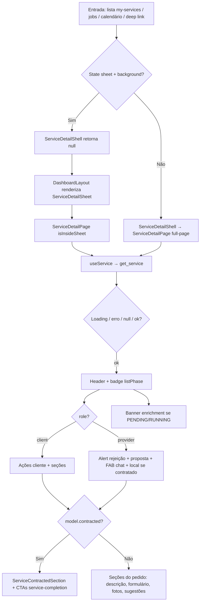

# Visualização de serviços (`view-services`)

Documentação baseada em `src/features/view-services/`, rota `/dashboard/services/:id`, consumo por `my-services` / `provider-jobs` / `provider-calendar`, e RPCs SQL `get_service` / `list_services` (migrations `20260705207000`–`20260705209000`, republicação `20260802170000`).

---

## 1. Resumo executivo

- **O que é:** módulo **agnóstico de papel** que unifica **lista** e **detalhe** de pedidos (`service_request_id`) em um contrato JSON estável (`ServiceModel`), via RPCs (sem PostgREST `.from()` para listagem/detalhe).
- **Problema que resolve:** evitar drift entre telas cliente/prestador e entre lista e detalhe; centralizar fase de produto (`list_phase`), badges e ações contextuais.
- **Quem usa:** **cliente** e **prestador** autenticados (rota sob `ProtectedRoute` `client` | `provider`); admin de plataforma tem acesso SQL (`is_platform_admin`), sem UI dedicada evidenciada.
- **Resultado esperado:** ver o pedido, status UI por fase/contrato, e executar ações permitidas (cancelar pedido em negociação, republicar, orçamentos, pagamento manual, conclusão, reagendar CTA, chat).

---

## 2. Objetivo de negócio

- **Finalidade:** superfície única de “o que é este pedido/serviço agora” para acompanhamento e operação pós-pedido.
- **Valor:** um shape (`ServiceModel`) + fases calculadas no SQL; UI condicionada por `profile.role` e `listPhase` / `contracted.status`.
- **Impacto se falhar:** lista Meus Serviços e detalhe ficam sem dados; ações de cancelamento/republicação/conclusão/pagamento no detalhe ficam indisponíveis.
- **Contexto:** alimenta `my-services` (lista), detalhe full-page ou sheet, e entry points de `provider-jobs` / calendário.

---

## 3. Localização na plataforma

| Superfície | Path / mecanismo | Evidência |
|------------|------------------|-----------|
| Detalhe (rota) | **`/dashboard/services/:id`** → lazy `ServiceDetailShell` | `src/router.tsx` |
| Lista (host) | **`/dashboard/services`** → `MyServicesRouteSlot` (`my-services`); dados via `useServicesList` / `list_services` | `my-services` + `view-services` |
| Sheet de detalhe | Mesma URL `:id` com `location.state.serviceDetailPresentation === "sheet"` + `background`; `ServiceDetailShell` retorna `null`; `DashboardLayout` monta `ServiceDetailSheet` | `ServiceDetailShell.tsx`, `useServiceDetailModal.ts`, `DashboardLayout.tsx` |
| Full-page / stack | `:id` **sem** state sheet (deep link, refresh, calendário) → `ServiceDetailPage` no outlet; mobile chrome **stack** “Detalhes do serviço” | `mobileNavigation.config.ts` |
| Calendário prestador | Navega para `:id` com `createProviderCalendarServiceDetailState` (**sem** `serviceDetailPresentation: "sheet"`) | `serviceDetailNavigation.types.ts` |
| Trabalhos | Sheet via `createProviderJobsServiceDetailState` (`returnTo: /dashboard/jobs`) | idem |
| Guards | Dashboard: `allowedRoles={['client','provider']}`; sem guard extra só em `:id` | `router.tsx` |

**Query / path params**

| Param | Efeito |
|-------|--------|
| `:id` | `service_request_id`; `useService` / `get_service` |
| `serviceRequestId` (lista, em `my-services`) | Modo foco: `listServices` chama `getServiceById` e devolve 1 item — evidência em `services.api.ts` |

**Legado vs atual:** docs/índices antigos citavam placeholder `ClientMyServicesDetailPlaceholder`. **Código atual** usa `ServiceDetailShell` + `ServiceDetailPage` (rota real). Ver §17 e pendências.

---

## 4. Perfis envolvidos

| Papel | Lista (`list_services`) | Detalhe (`get_service`) | UI no detalhe |
|-------|-------------------------|-------------------------|---------------|
| **Cliente** | Só `sr.client_id = viewer` | Dono do SR (ou admin) | Contagem de orçamentos; ações de orçamento/cancelar/republicar; chat contratado; pagamento manual; CTA **“Avaliar serviço”** (`ClientEvaluateServiceAction`) na seção contratada; cancelamento/reagendamento via `payments` / `service-reschedule` |
| **Prestador** | SR com **proposta própria** ou **contrato** onde `provider_id = viewer` (não inclui pool `match_provider_jobs`) | Mesmo critério de acesso (`service_viewer_has_access`) | Nome do solicitante **mascarado** (`view_services_mask_client_name`); alerta de rejeição; seção de proposta; FAB chat; local do serviço se contratado; CTA **“Marcar serviço como concluído”** (`ProviderMarkExecutedAction`) em `CONFIRMED`; settlement; cancel/reagendar |
| **Admin plataforma** | Incluído no escopo SQL | Acesso via `is_platform_admin()` | Sem UI admin dedicada evidenciada neste módulo |
| Visitante | N/A — RPCs exigem `auth.uid()` | N/A | Redirect login (dashboard) |

**Quem não usa como lista de oportunidade:** prestador no feed geográfico — isso é `provider-jobs` / matching, fora do escopo de `list_services`.

---

## 5. Fluxo funcional principal

---

## 6. Fluxos alternativos e exceções

| Cenário | Comportamento observado |
|---------|-------------------------|
| Sem permissão / id inexistente | RPC `get_service` → exceção; front: `EmptyState` “Serviço não encontrado…” se `data` null sem throw de rede; ou `ErrorState` se query lança |
| Erro de rede / RPC | `ErrorState` + retry (`refetch`) |
| Loading | `ServiceDetailSkeleton` |
| Aba **Disputas** na lista | Front **não** chama RPC: retorna `{ items: [], total_count: 0 }` (`statusTabId === "dispute"`) |
| Foco `serviceRequestId` na lista | Bypass filtros de fase; um único item via `get_service` |
| Fechar sheet | `navigate(-1)` restaura `background` |
| Prestador abre detalhe | `useRecordProviderOpportunityView` chama RPC `record_provider_opportunity_view` (falha só loga warn) |
| Offline ao iniciar chat | Toast “Você está offline…” (`useServiceDetailChatNavigation`) |
| Republicar sucesso | Toast + navigate para `/dashboard/services/{novoId}` |
| Cancelar pedido (negociação) | Dialog confirmação → `cancel_service_request` → toast sucesso/erro; invalida list/detail |

---

## 7. Regras de negócio

1. ID canônico do detalhe é **`service_request_id`** (path `:id`), não `contracted_services.id`.
2. Lista e detalhe usam o **mesmo** mapper `mapRpcServiceRow` → `ServiceModel`.
3. **Fase de produto** (`list_phase` / `listPhase`) é calculada no SQL (`derive_service_list_phase`), não reinventada no front para filtrar.
4. Prestador na listagem: apenas envolvimento com **proposta** ou **contrato** — **não** chat sozinho e **não** `match_provider_jobs` (evidência: CTE `scoped` em `list_services`).
5. Acesso ao detalhe: `service_viewer_has_access` — dono cliente, prestador com proposta ou contrato, ou admin.
6. Nome do cliente para prestador: mascarado no SQL (`view_services_mask_client_name`).
7. Contagem de propostas no payload: cliente vê todas do SR; prestador só as **próprias**.
8. Cancelar **pedido** (`Cancelar pedido`) só na UI quando cliente + `listPhase === negotiation` + **sem** `contracted` (`showClientNegotiationChats`).
9. Republicar só UI quando cliente + `listPhase === cancelled`; backend exige dono + SR/contrato cancelado + endereço ativo.
10. Aba Disputas: placeholder vazio no cliente da API TS (sem linhas).
11. Paginação: `page_size` clamp 1–100; default UI lista = 20 (`useServicesList`).
12. Sem embeds PostgREST na API TS de list/detail — só `supabase.rpc(...)`.

---

## 8. Campos e dados (shape `ServiceModel`)

| Campo / bloco | Origem RPC (resumo) | Uso UI |
|---------------|---------------------|--------|
| `id` | `service_request_id` | Rota, mutações |
| `listPhase` / `statusTabId` | `list_phase` | Badge, abas, ações |
| `title`, `description`, `descriptionPreview` | request | Header / card simples |
| `formData` / `formSchema` | request | `FormResponsesSummary` |
| `photoPaths` | request.photos | Galeria |
| `address` | address summary | Localização; mapa só prestador+contratado |
| `service` | platform_service | Ícone/cor/título |
| `proposalCount`, `hasPendingProposal`, counts de chat | negotiation | Badge “Aguardando decisão”; CTA orçamentos |
| `contracted` | contracted_services + payment_schedule_state, far_recapture_pending, reschedule | Seção contratada |
| `enrichmentStatus` / `enrichmentReady` | projeção enrichment em `get_service` / `list_services` | Banner “em processamento”; gate do CTA prestador (sem `get_service_completion_context` no detalhe) |
| `counterparty` / `counterpartyName` | papel-dependente | Prestador vê solicitante; cliente vê profissional se contratado |
| `myProposal`, `chatSummary` | negotiation (lista prestador/cliente conforme SQL) | Cards em `my-services` (fora desta feature de UI de lista) |
| Insights IA | urgency, tags, equipment, materials, … | `SimpleServiceInsightPanel` / sugestões |

---

## 9. Validações de front-end

| Validação | Onde |
|-----------|------|
| ID vazio em `getServiceById` / `cancelService` / republish | Retorno erro string (“ID do serviço é obrigatório”) |
| Idempotency key vazia no republish | Erro “Chave de idempotência é obrigatória” |
| CTA orçamentos desabilitado se `proposalCount <= 0` | `getServiceRequestBudgetActionState` (botão só se `!disabled` no detalhe) |
| Dialog obrigatório antes de cancelar pedido | `ServiceDetailClientActions` |
| Coordenadas ausentes | Botão “Abrir no mapa” disabled |

Não há formulário Zod próprio nesta feature para o detalhe; mutações de lifecycle/pagamento/reagendamento validam nos módulos donos.

---

## 10. Validações de back-end (RPC / acesso)

| RPC / helper | Regras evidenciadas |
|--------------|---------------------|
| `get_service` | `auth.uid()`; `p_service_request_id` not null; `service_viewer_has_access`; senão 42501 / not found |
| `list_services` | Auth + profile role; filtros opcionais; `cns_assert_list_response_size` no body |
| `service_viewer_has_access` | Admin **ou** client dono **ou** proposta do viewer **ou** contrato do viewer |
| `derive_service_list_phase` | Ver §11 |
| `cancel_service_request` | Chamado por `cancelService` com `p_idempotency_key` (UUID novo a cada call na API TS) — regras detalhadas no domínio chats/CNS |
| `republish_cancelled_service_request` | Só `client_id`; cancelado (SR ou CS); endereço ativo do ator; descrição/service_id; idempotency `view_services.republish_cancelled_service_request`; **enqueue enrichment** (não bootstrap matching) |
| `record_provider_opportunity_view` | Prestador no detalhe (best-effort no front) |
| Conclusão (`markServiceExecuted` / `confirmServiceCompleted`) | Ownership em **service-completion** (RPCs `service_completion_*`); UI via CTAs da Public API na `ServiceContractedSection` — **não** reexport de payments; checklist **não** inline no detalhe |

---

## 11. Status, estados e transições

### 11.1 Fase de lista (`ServiceListPhase`)

Calculada em `derive_service_list_phase`:

| Condição (resumo SQL) | Fase |
|------------------------|------|
| `sr.status = CANCELLED` | `cancelled` |
| `sr = COMPLETED` e `cs = CANCELLED` | `cancelled` |
| **Prestador:** CS dele `COMPLETED` | `completed` |
| **Prestador:** CS dele ativo (≠ CANCELLED) | `in_progress` |
| **Prestador:** `sr = OPEN` | `negotiation` |
| **Prestador:** demais | `cancelled` |
| **Cliente:** `sr = COMPLETED` e `cs = COMPLETED` | `completed` |
| **Cliente:** `sr = COMPLETED` (senão) | `in_progress` |
| **Cliente:** demais (tipicamente OPEN) | `negotiation` |

### 11.2 Labels / badges UI (`statusBadge.ts`)

| Fase | Label padrão | Variante badge |
|------|--------------|----------------|
| `negotiation` | “Em negociação”; se `hasPendingProposal` → “Aguardando decisão” | `warning`; se `proposalCount === 0` → `secondary` |
| `in_progress` | “Em andamento” | `default` |
| `completed` | “Concluído” | `success` |
| `cancelled` | “Cancelado” | `secondary` |

### 11.3 Abas (`STATUS_TABS`)

`all` | `negotiation` | `in_progress` | `completed` | `cancelled` | `dispute` (sempre vazia no front).

### 11.4 Status do contrato (`contracted.status` → label PT)

| Enum | Label UI (`getContractedServiceStatusLabel`) |
|------|-----------------------------------------------|
| `PENDING_PAYMENT` | Aguardando pagamento |
| `CONFIRMED` | Confirmado |
| `EXECUTED` | Executado |
| `COMPLETED` | Concluído |
| `CANCELLED` | Cancelado |
| outro | string crua |

### 11.5 Conclusão (UI via `service-completion`)

| Papel | Pré-condição | Superfície |
|-------|--------------|------------|
| Prestador (contratado) | Contrato `CONFIRMED` **e** `enrichmentReady` do `get_service` (sem prefetch do completion context) | Botão **“Marcar serviço como concluído”** na seção Serviço contratado (ao lado de cancelar/reagendar) → bottom sheet (mobile) ou dialog (desktop); ao abrir, `ProviderExecutedWizard` chama `get_service_completion_context` (draft + upload + EXECUTED) |
| Cliente | Contrato `EXECUTED` ou `COMPLETED` (só então busca contexto); CTA se `canConfirmWithRating` ou rating opcional pós auto-complete | Botão **“Avaliar serviço”** na mesma seção → sheet/dialog com stepper **2 etapas**: (1) revisar evidências/checklist congelado + checkbox obrigatório de declaração de execução (“Continuar para avaliação” disabled até marcar; se `auto_executed_without_checklist`, alerta sem lista vazia de critérios + copy suavizada); (2) avaliar prestador/serviço (`ClientConfirmRatingWizard` embutido); badge `executed_late` se atrasado |
| Ambos / cliente | Enrichment `PENDING`/`RUNNING` | `EnrichmentProcessingBanner` no detalhe/card — campos leves do modelo (`enrichmentStatus`/`enrichmentReady`); **não** usa `get_service_completion_context` ao abrir o detalhe |
| Cliente | Sem CTA avaliar, mas stub elegível | `DisputeStubEntry` **inline** na seção contratada (também no wizard Avaliar serviço): título “Abrir disputa”, botão **“Falar com o suporte”**; descrição sobre correção/devolução — URL/toast, sem FSM; superfície dispute-only **sem** checkbox de declaração |
| Sistema | Duas janelas ~24h distintas: (1) `auto_mark_executed_grace_hours` após fim do dia BRT da data agendada → auto-mark `CONFIRMED`→`EXECUTED` sem checklist; (2) `auto_complete_grace_hours` após `executed_at` → auto-complete `EXECUTED`→`COMPLETED` (`completed_by=system`); rating opcional depois |

Fotos de evidência: thumbnails com lightbox fullscreen (padrão galeria do pedido). Checklist/evidências via RPC `get_service_completion_context` **dentro** do sheet/wizard (não no load do detalhe). Paths de evidência precisam estar registrados antes do mark-executed.

Na **lista** Meus Serviços (`my-services`), cards `in_progress` podem mostrar highlight de follow-up (pós-data-fim com `CONFIRMED`, ou `EXECUTED`). **Prestador** `CONFIRMED` + past: primário **“Concluir serviço”** abre sheet/wizard no card (`CompletionFlowSheetDialog` + `ProviderExecutedWizard`; contexto RPC só ao abrir; disabled + tooltip se `!enrichmentReady`); secundário “Ver detalhes”. Cliente e demais ramos: CTA “Ver detalhes” — sem prefetch de contexto na lista. Ver [solicitacoes-do-cliente](../../my-services/features/solicitacoes-do-cliente.md) Anexo D.

Detalhe normativo: [conclusao-e-enrichment](../../service-completion/features/conclusao-e-enrichment.md).

---

## 12. Persistência

### Servidor

- Leitura: `service_requests`, `contracted_services`, propostas, endereços, etc. via RPCs.
- Mutações disparadas da feature: cancel SR, republish, opportunity view, initiate chat (chats); conclusão via **service-completion**.

### Cliente

| Mecanismo | Comportamento |
|-----------|---------------|
| React Query `["view-services","list"]` | Infinite query; `staleTime` 60s; sem refetch on focus |
| React Query `["view-services","detail", id]` | Detalhe; invalidate após cancel/republish/conclusão (`service-completion`) |
| Sem Preferences/draft próprio nesta feature | — |

---

## 13. Integrações

| Destino | Como |
|---------|------|
| **my-services** | Consome `useServicesList`, navega com `createClient/ProviderMyServicesServiceDetailState` (sheet) |
| **provider-jobs** | Sheet com `returnTo: /dashboard/jobs` |
| **provider-calendar** | Full-page (sem sheet) |
| **negotiation-proposals** | `ReceivedBudgetDetailsSheet`; composer/sumário no detalhe prestador; invalidate keys após mutações de proposta (evidência em outros módulos) |
| **chats** | Lista de conversas do cliente em negociação; botão chat contratado; FAB inicia/abre conversa |
| **payments** | `ManualPaymentRecovery`, `ContractedServiceCancelAction`, `PaymentDisputeStatus`, `ProviderSettlementStatus` |
| **service-completion** | `EnrichmentProcessingBanner`; **`ProviderMarkExecutedAction`** / **`ClientEvaluateServiceAction`** na `ServiceContractedSection` (wizards embutidos no sheet/dialog; stub disputa); só Public API |
| **service-reschedule** | `ContractedServiceRescheduleAction` + snapshot `reschedule` no modelo |
| **addresses** | `LocationPreviewMap` no local do prestador |
| **matching** | Republicação INSERT `OPEN` **enfileira enrichment**; matching bootstrap só após READY (não mais trigger no OPEN) |
| Analytics / Sentry | Evento `cancelled_service_republished`; breadcrumbs/metrics no republish |

---

## 14. Listagens, buscas, filtros, paginação, ordenação

| Aspecto | Comportamento |
|---------|---------------|
| RPC | `list_services(...)` |
| Página | `p_page`, `p_page_size` (1–100) |
| Fase | `p_list_phase` ← `statusTabIdToListPhase` (`all`/`dispute` → null / short-circuit) |
| Busca | `p_search` ILIKE título/descrição |
| Categoria | `p_category_title` (= título platform_services; front passa `categoryId` como título — nome de campo legado) |
| Cidade / bairro | `p_city_name`, `p_neighborhood` |
| Datas | `p_date_from` / `p_date_to` sobre `created_at` |
| Flags | `p_has_images`, `p_has_proposals` (escopo por papel) |
| Ordenação | `updated_at desc` |
| Infinite scroll | `useServicesList` PAGE_SIZE 20 + “carregar mais” no host |

**Card de lista “rico”:** vive em `my-services` (`ClientServiceListCard` / `ProviderServiceListCard`). Em `view-services`, o card genérico exportado é **`SimpleServiceCard`** (resumo + insights; uso ex. sidebar de chat).

---

## 15. Ações disponíveis

| Ação | Quem | Pré-condição UI | Resultado / erro |
|------|------|-----------------|------------------|
| Ver orçamento / Comparar / Histórico | Cliente | `proposalCount > 0` | Abre `ReceivedBudgetDetailsSheet` (mode compare se negotiation, senão history) |
| Cancelar pedido | Cliente | negotiation + sem contracted | RPC `cancel_service_request`; toast |
| Republicar novo pedido | Cliente | `listPhase === cancelled` | RPC republish; navega para novo id |
| Chat contratado | Cliente | `model.contracted` | `ServiceRequestContractedChatButton` |
| Lista conversas negociação | Cliente | negotiation sem contracted | `ServiceRequestConversationList` |
| Ajustar pagamento | Cliente | `showManualPayment` + elegibilidade schedule (`FAILED` / `FAILED_PERMANENT` etc. em payments) | `ManualPaymentRecovery` |
| Marcar executado | Prestador | contracted `CONFIRMED` + `enrichmentReady` (`get_service`); contexto ao abrir sheet | CTA “Marcar serviço como concluído” → sheet/dialog → RPC `service_completion_mark_executed` |
| Confirmar + avaliar | Cliente | contracted `EXECUTED`/`COMPLETED` + `canConfirmWithRating` (ou rating opcional) | CTA “Avaliar serviço” → sheet 2 etapas (review exige checkbox de declaração) → `service_completion_confirm_with_rating` (scores obrigatórios no caminho manual); badge `executed_late` se atrasado |
| Falar com o suporte (stub disputa) | Cliente | sem CTA avaliar elegível, tipicamente pós-rating / `EXECUTED`/`COMPLETED` | Banner título “Abrir disputa”, botão “Falar com o suporte” (wizard Avaliar serviço e/ou inline): URL suporte ou toast “Em breve” + analytics — sem FSM. Detalhe: [conclusao-e-enrichment](../../service-completion/features/conclusao-e-enrichment.md) §8 |
| Cancelar serviço contratado | Client/provider | flags + status no componente payments | `ContractedServiceCancelAction` |
| Reagendar (CTA) | Client/provider | role client\|provider + seção contratada | `ContractedServiceRescheduleAction` |
| Iniciar / ver negociação | Prestador | sempre no detalhe (FAB) | `initiateConversation` ou navega chat existente |
| Abrir no mapa | Prestador | contracted + coords | Google Maps |
| Editar/enviar proposta | Prestador | seção proposta + `canEdit…` | negotiation-proposals |

---

## 16. Dependências

| Tipo | Módulo / lib |
|------|----------------|
| Upstream dados | Pedido (`request-quote`), propostas, chats, payments, reschedule, **service-completion** |
| Downstream UI hosts | `my-services`, `provider-jobs`, `provider-calendar`, `DashboardLayout` (sheet) |
| Auth | `useAuth` / `profile.role` |
| UI shared | `EmptyState`, `ErrorState`, Sheet Radix |

---

## 17. Regras implícitas

1. **`ServiceDetailShell` vs placeholder legado:** a rota `:id` **não** é mais `DashboardFakePage` / `ClientMyServicesDetailPlaceholder`; shell real decide sheet (`return null`) vs página.
2. Sheet exige **ambos** `serviceDetailPresentation === "sheet"` **e** `background`; só `returnTo` (calendário) → página/stack.
3. `isInsideSheet` altera padding inferior do FAB (safe-area vs offset da bottom nav).
4. Contagem de orçamentos no header só para **cliente**.
5. `ServiceProviderLocationSection` só se prestador **e** `model.contracted`.
6. `farRecapturePending`: aviso discreto de reajuste de cobrança pós-reagendamento longe.
7. API `listServices` com foco ignora filtros de aba/fase.
8. Cancel da API TS gera **novo** UUID de idempotência a cada chamada (não reutiliza em retry de UI — evidência: `crypto.randomUUID()` inline).
9. Republicar **reutiliza** key no retry via `useRef` até sucesso.

---

## 18. Riscos

| Risco | Nota |
|-------|------|
| Deep link sem state sheet | Usuário cai em stack full-page; lista atrás some (esperado) |
| Doc transversal desatualizada | `docs/business/modulos/README.md` ainda cita placeholder em `:id` — **código já real** |
| Escopo prestador ≠ “viu no feed” | Sem proposta/contrato, `get_service` nega mesmo se viu oportunidade |
| Aba Disputas | Label existe; sempre vazia — expectativa de produto vs código |
| Nome do parâmetro `categoryId` | Na verdade filtra por **título** de categoria no RPC |

---

## 19. Evidências

- `src/features/view-services/**` (api, hooks, components, types, constants, utils, `index.ts`)
- `src/router.tsx` (`services/:id` → `ServiceDetailShell`)
- `src/layouts/DashboardLayout/DashboardLayout.tsx`, `mobileNavigation.config.ts`
- `src/features/my-services/hooks/useClientMyServicesPage.ts`, `useProviderMyServicesPage.ts`
- `supabase/migrations/20260705207000_rename_services_to_contracted_services.sql`
- `supabase/migrations/20260705208000_create_view_services_rpcs.sql`
- `supabase/migrations/20260705209000_fix_list_services_cte_scope.sql`
- `supabase/migrations/20260802170000_republish_cancelled_service_request.sql`
- `supabase/tests/view-services/` (pgTAP RPCs / republish)

---

## 20. Diferença cliente vs prestador (matriz rápida)

| Aspecto | Cliente | Prestador |
|---------|---------|-----------|
| Escopo lista | Seus SRs | Proposta ou contrato próprio |
| Counterparty | Prestador do contrato (se houver) | Cliente mascarado |
| Header | Contagem de orçamentos | “Solicitante: …” |
| Ações topo | Orçamentos, cancelar, republicar, chat CS | — (FAB separado) |
| Seção secundária | Conversas do pedido (negociação) | Proposta + alert rejeição |
| Local/mapa | Não nesta seção dedicada | Sim se contratado |
| Pagamento manual | Sim | Não (`showManualPayment={isClient}`) |
| Settlement | Não | `ProviderSettlementStatus` |
| Opportunity view | Não | Sim ao abrir detalhe |

---

## 21. `ServiceDetailShell` vs sheet vs página

| Modo | Condição | O que renderiza |
|------|----------|-----------------|
| **Sheet (modal routing)** | `state.serviceDetailPresentation === "sheet"` && `state.background` | Shell → `null`; layout → `ServiceDetailSheet` → `ServiceDetailPage` `isInsideSheet` |
| **Página (stack/full)** | Caso contrário na rota `:id` | `ServiceDetailPage` no outlet |
| **Placeholder legado** | Removido do router atual | Antes: `ClientMyServicesDetailPlaceholder` / fake — **não** usar como verdade atual |

Helpers de state: `createClientMyServicesServiceDetailState`, `createProviderMyServicesServiceDetailState`, `createProviderJobsServiceDetailState`, `createProviderCalendarServiceDetailState`.

---

## 22. Pendências

| ID | Item | Status |
|----|------|--------|
| VS-01 | Aba Disputas sem dados | Aberta (produto) |
| VS-02 | Índices transversais ainda mencionam `:id` como placeholder | Gap para worker transversal (`modulos/README.md`, mapa) — fora deste escopo de edição |
| VS-03 | Detalhe a partir do calendário sem sheet (intencional no código) | Documentado em provider-calendar; confirmar produto se quiser unificar |
| VS-04 | Regras finas de conclusão | Documentadas em [service-completion](../../service-completion/README.md); writers `service_completion_*` (não payments) |

---

## 23. Anexo — checklist QA (cenários)

- [ ] Cliente: lista → sheet detalhe → fechar volta lista
- [ ] Deep link `/dashboard/services/{id}` sem state → stack “Detalhes do serviço”
- [ ] Cliente negotiation: cancelar pedido (dialog) e comparar orçamentos
- [ ] Cliente cancelled: republicar → novo id
- [ ] Cliente contracted PENDING_PAYMENT elegível: “Ajustar pagamento”
- [ ] Prestador CONFIRMED: CTA “Marcar serviço como concluído” abre sheet/dialog com checklist (não inline); cliente EXECUTED: CTA “Avaliar serviço” com 2 etapas (review com checkbox de declaração; Continuar disabled até marcar); thumbnails de evidência + lightbox; badge atraso se `executed_late`
- [ ] Stub disputa: título “Abrir disputa”, botão “Falar com o suporte”; dispute-only sem checkbox de declaração
- [ ] Enrichment PENDING: banner “em processamento” no detalhe/card
- [ ] Prestador: FAB inicia chat; local/mapa com contrato
- [ ] Prestador sem proposta/contrato: detalhe negado / empty
- [ ] Aba Disputas: lista vazia
- [ ] Foco `?serviceRequestId=` na lista cliente: um item

---

## 24. Atualização de auditoria (2026-08-02)

Reescrita para o padrão 20+ seções do orquestrador: sheet vs página, diferença client/provider, status UI, ações (cancelar, reagendar CTA, pagamento), `ServiceDetailShell` vs placeholder legado, RPCs/listagens e consumo por `my-services`. Corrigida afirmação antiga de que **chat sozinho** entra no escopo da listagem prestador — **não** há evidência no SQL atual.

**2026-08-04:** conclusão cutover para `service-completion` (wizards, enrichment banner, RPCs `service_completion_*`); republish/enqueue enrichment sem bootstrap OPEN.

**2026-08-05:** alinhamento ao endurecimento SQL de conclusão (contexto full vs marketplace; evidências registradas no mark-executed) — normas em [service-completion](../../service-completion/README.md).

**2026-08-05 (UX):** conclusão/avaliação via CTAs na `ServiceContractedSection` + sheet/dialog (não wizards inline no detalhe); stepper cliente 2 etapas; galeria de evidências.

**2026-08-06:** banner e gate de conclusão no detalhe usam só `enrichmentStatus`/`enrichmentReady` de `get_service` (sem `get_service_completion_context` ao abrir); CTA prestador = `CONFIRMED` + `enrichmentReady`; contexto RPC no wizard; CTA cliente só em `EXECUTED`/`COMPLETED`. Cross-ref lista: prestador `CONFIRMED` + past pode concluir pelo card em `my-services` (ver Anexo D de solicitacoes-do-cliente).

**2026-08-06 (Avaliar serviço):** step de revisão com checkbox obrigatório de declaração de execução; stub de disputa com botão “Falar com o suporte” (título “Abrir disputa”). Normas em [conclusao-e-enrichment](../../service-completion/features/conclusao-e-enrichment.md).

**2026-08-06 (auto-mark):** duas janelas ~24h distintas documentadas em §11.5 — auto-mark CONFIRMED→EXECUTED sem checklist vs auto-complete EXECUTED→COMPLETED; UI Avaliar serviço com alerta `auto_executed_without_checklist`.
