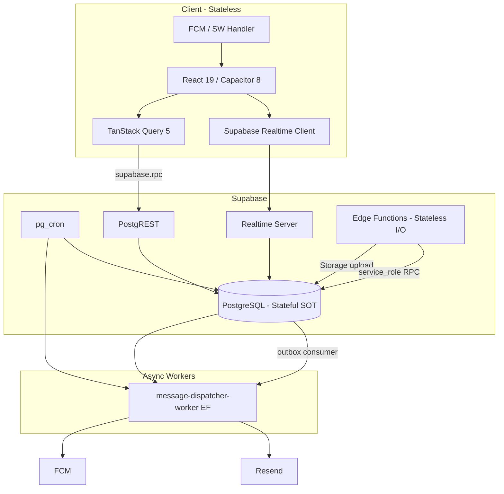
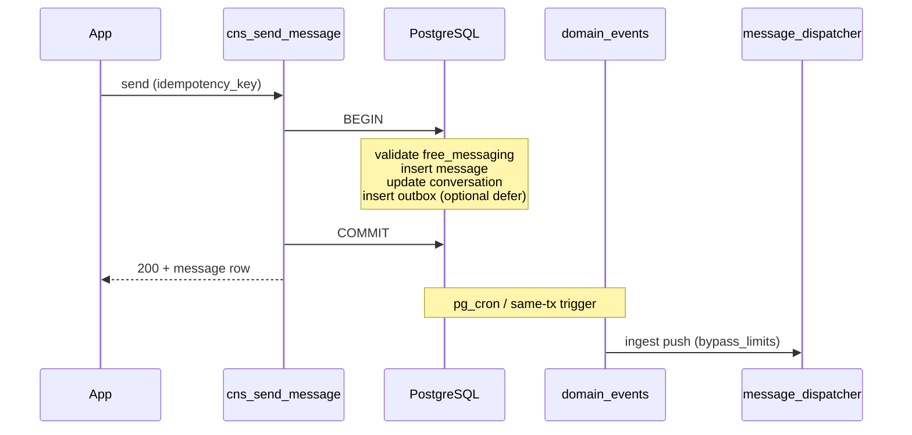
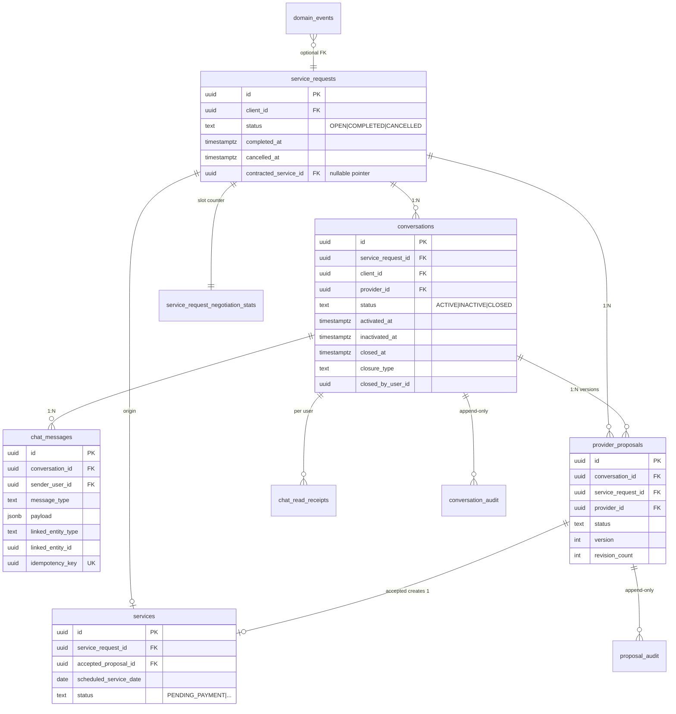
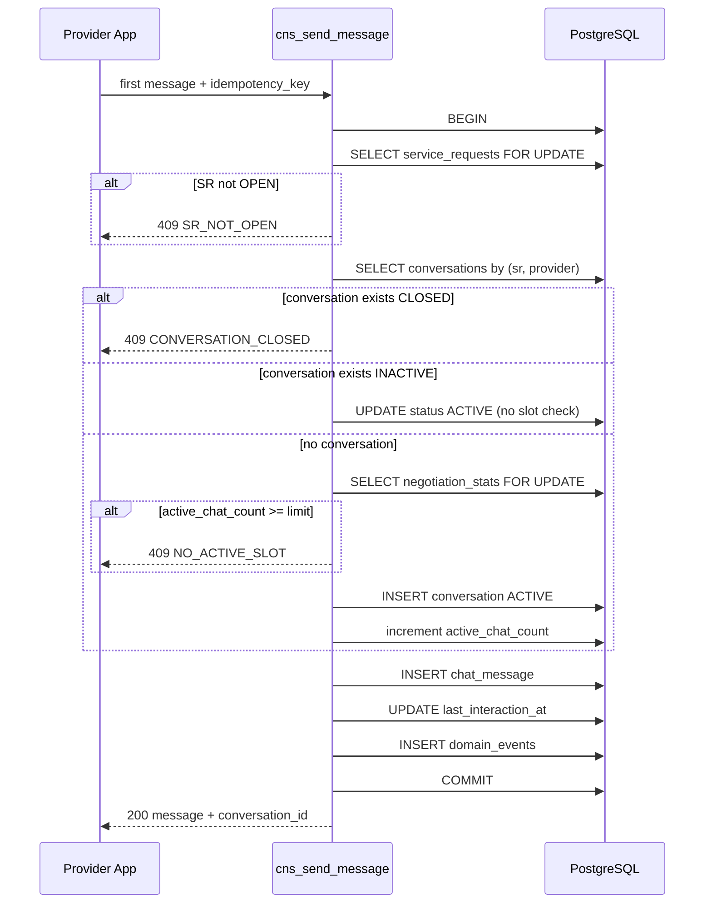
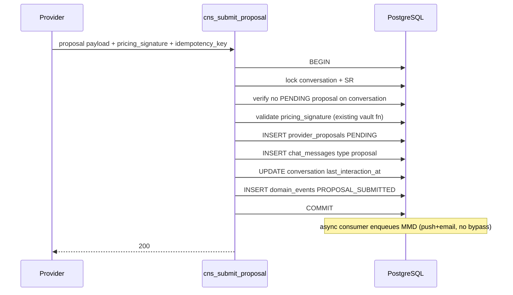
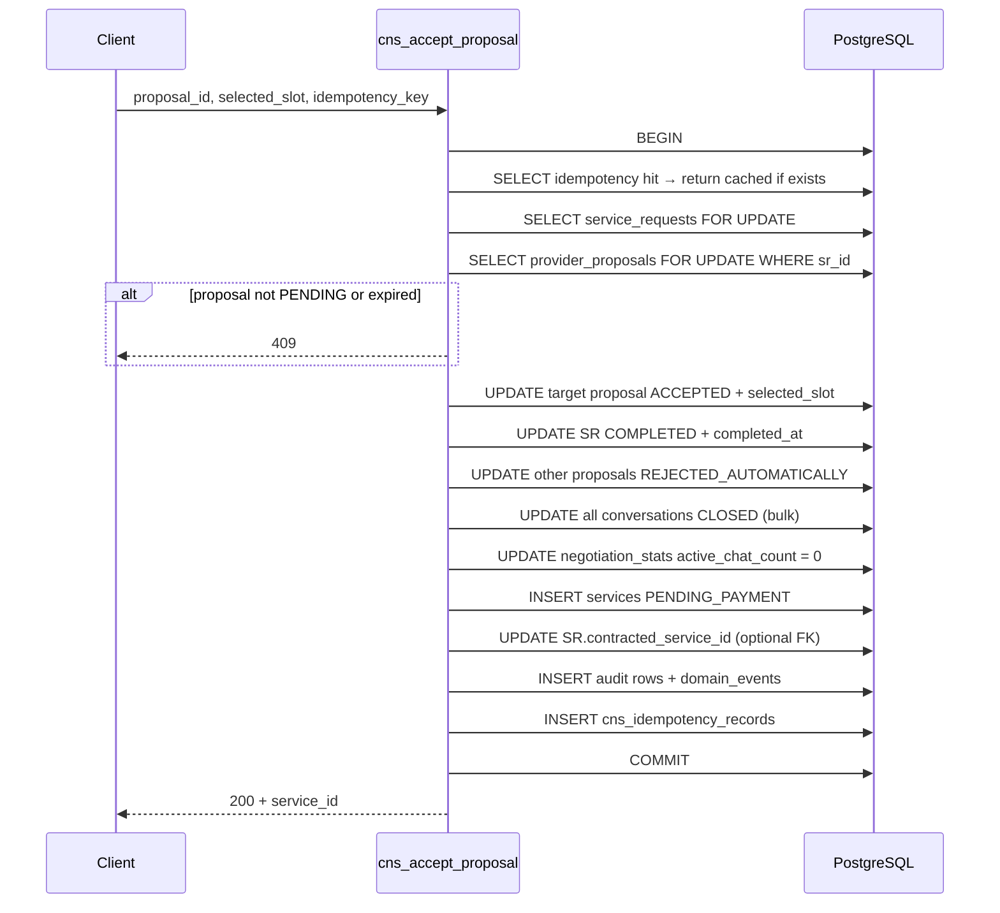
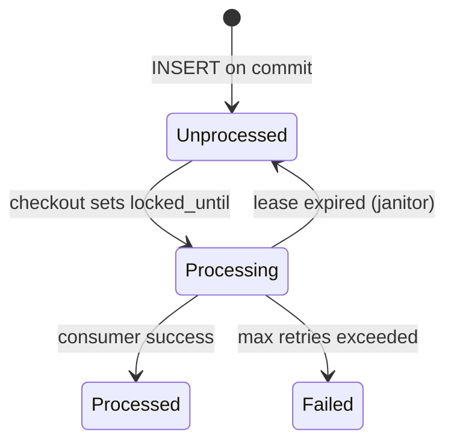

# Conversational Negotiation & Chat System (CNS) — Design Document

**Covers:** Requirements 1–35 · [`requirements.md`](./requirements.md) · [`technical-stack.md`](../technical-stack.md) · [`infrastructure-constraints.md`](../infrastructure-constraints.md) · [`scalability-requirements.md`](../scalability-requirements.md) · [`concurrency-requirements.md`](../concurrency-requirements.md)

**Status:** Architecture review draft — implementation kickoff  
**Normative language:** RFC 2119 (`MUST` / `SHALL` / `SHOULD` / `MAY`)  
**Last updated:** 2026-05-29

---

## Document control

| Item | Value |
|------|--------|
| **System name** | CNS (Chat & Negotiation System) |
| **Authority** | PostgreSQL 15+ (Supabase) — all workflow state |
| **Delivery** | `src/features/chats/` + `src/features/negotiation-proposals/` (split from `provider-jobs`) |
| **Out of scope** | `DISPATCH_*` matching (Req. 24); payment execution beyond `services.PENDING_PAYMENT` insert |
| **Legacy alignment** | Evolves `service_requests`, `provider_proposals`; adds `conversations`, `chat_messages`, `services` (contracted) |

### Schema evolution note (repository today → target)

The repository **today** implements quote flow without CNS tables:

| Artifact (today) | CNS target | Migration strategy |
|------------------|------------|-------------------|
| `service_requests.status` ∈ `{open, in_progress, closed, cancelled}` | `{OPEN, COMPLETED, CANCELLED}` | `ALTER` CHECK + data migration: `open`→`OPEN`, `cancelled`→`CANCELLED`, `closed`→`COMPLETED` only where linked accepted proposal exists, else manual review |
| `provider_proposals.status` ∈ `{submitted, accepted, rejected, withdrawn}` | CNS proposal FSM (§2) | Extend CHECK; map `submitted`→`PENDING`; add columns `conversation_id`, `revision_count`, `revision_reason`, `version`, `submitted_at`; deprecate direct PostgREST insert — **RPC-only** mutations |
| No `conversations` | New | Migration `YYYYMMDDHHMMSS_create_cns_conversations.sql` |
| No `services` (contracted) | New `public.services` | Distinct from `platform_services`; FK to `provider_proposals` |
| 48h proposal SLA (cron + trigger) | 24h (`PROPOSAL_CLIENT_RESPONSE_SLA_HOURS`) | `platform_constants` + replace `expire_stale_provider_proposals` with `cns_expire_pending_proposals` |
| MMD (`message_dispatcher` schema) | Producer from CNS RPCs | Templates `chat.new_message`, `proposal.*` registered in migration |

All **new** CNS RPCs SHALL be prefixed `cns_*` until cutover; legacy `create_provider_proposal` SHALL delegate to `cns_submit_proposal` internally.

---

# 1. Overall Architecture and Component Relationships

## 1.1 Problem decomposition

CNS is a **transactional negotiation orchestrator** anchored to `service_request_id`. It coordinates:

1. **Conversation lifecycle** (`ACTIVE` / `INACTIVE` / `CLOSED`) with **slot accounting** per SR.
2. **Message timeline** (append-only with dynamic cards referencing authoritative proposals).
3. **Proposal FSM** with **proposal-gated free messaging** (Req. 34).
4. **Atomic acceptance cascade** (Req. 7, 23) — single RPC, `FOR UPDATE` on SR.
5. **Async side effects** via **transactional outbox** (`domain_events`) → MMD ingest, analytics, future matching.

## 1.2 Runtime topology



## 1.3 Component responsibilities

| Component | Stateful? | Responsibility | MUST NOT |
|-----------|-----------|----------------|----------|
| **PostgreSQL RPCs** (`cns_*`) | Yes (data) | FSM, slots, idempotency, audit, outbox insert | Call external HTTP |
| **PostgREST** | No | Transport + RLS enforcement on reads | Own business rules |
| **Edge `chat-upload-media`** | No | Multipart → Storage; magic-byte validation; call `cns_attach_message_media` | Hold conversation state |
| **Edge `message-dispatcher-worker`** | No | Dequeue MMD, render templates, FCM/Resend | Transition CNS FSM |
| **pg_cron jobs** | No (scheduler) | Invoke `cns_evaluate_reciprocity_batch`, `cns_expire_pending_proposals`, `cns_domain_events_consume`, janitors | Long-running loops |
| **React feature `chats`** | Client cache only | UI, Realtime subscribe, optimistic send, push suppression | Call Supabase from components |
| **React feature `negotiation-proposals`** | Client cache only | Composer, accept/reject/revision modals | Duplicate proposal state |

## 1.4 Communication model

| Path | Sync/Async | Consistency | Delivery |
|------|------------|-------------|----------|
| `cns_send_message` | Sync RPC | Strong (commit before HTTP 200) | At-most-once per client action (debounce); server at-least-once with idempotency |
| Realtime `INSERT chat_messages` | Async push | Eventual (ms–s) | At-least-once; client dedupe by `id` |
| MMD push/email | Async queue | Eventual | At-least-once; dedupe `idempotency_key` |
| `domain_events` consumers | Async batch | Eventual | At-least-once; `SKIP LOCKED` |

## 1.5 Orchestration model

**Synchronous orchestration (in-DB):** `cns_accept_proposal`, `cns_cancel_service_request`, `cns_close_conversation`, `cns_submit_proposal` — single `BEGIN … COMMIT` per user intent.

**Asynchronous orchestration (outbox):** After commit, `domain_events` rows consumed by:

1. `cns_enqueue_notifications` (calls `message_dispatcher.message_dispatcher_ingest` via `SECURITY DEFINER` wrapper).
2. `cns_emit_analytics` (best-effort).
3. Future matching adapter (Req. 24) — **optional**, no-op today.

## 1.6 Transactional vs async boundaries



**Invariant G5 (concurrency):** MMD failure SHALL NOT roll back committed negotiation state.

## 1.7 Scaling strategy

| Dimension | Mechanism |
|-----------|-----------|
| Horizontal workers | `SKIP LOCKED` on `domain_events`, `chat_maintenance_queue`, MMD `message_dispatches` |
| Read scale | Paginated RPCs; partial indexes; no full-table Realtime |
| Hot SR | Slot counter on `service_request_negotiation_stats` (materialized per SR, updated in same TX as chat status) |
| Fanout | Max 4 `ACTIVE` chats/SR (configurable); push per message, not per SR |

## 1.8 Fault isolation

- Crash in Edge upload: client retries with same `idempotency_key`; orphaned Storage objects cleaned by `cns_janitor_orphan_media` (Req. 26).
- Stuck MMD: does not block chat send.
- Stuck cron batch: next run continues; per-row savepoints (Req. 25).

---

# 2. Data Models and Relationships

## 2.1 Entity-relationship model (authoritative)



## 2.2 Ownership semantics

| Entity | Owner (write) | Readers |
|--------|---------------|---------|
| `conversations` | Participants via RPC; status via RPC/cron | Participants + `admin` SELECT |
| `chat_messages` | Participants (`text`/`image`); system via `SECURITY DEFINER` | Same |
| `provider_proposals` | Provider participant via `cns_submit_proposal` | Client + provider of conversation + admin |
| `service_requests` | Client cancel; system via accept cascade | Per existing RLS + CNS rules |
| `services` | Created only inside `cns_accept_proposal` | Client + provider + admin |

## 2.3 Lifecycle semantics

| Table | Mutable state machine? | Append-only? |
|-------|------------------------|--------------|
| `conversations` | Yes (`status`) | Audit in `conversation_audit` |
| `chat_messages` | `delivery_status` only | Inserts immutable (no content edit v1) |
| `provider_proposals` | Yes | Audit in `proposal_audit`; prior versions `REVISED` |
| `chat_messages` (type `proposal`) | No — pointer only | Timeline slot fixed; card hydrates live proposal |
| `domain_events` | `processed_at` only | Insert-only until processed |
| `conversation_audit` | No | Yes |

## 2.4 Consistency semantics

- **Strong:** All FSM transitions listed in Req. 32 inside single RPC transactions.
- **Eventual:** Realtime visibility, push delivery, analytics, matching hooks.
- **Read-your-writes:** Client invalidates `['conversation', id]` query on RPC success.

## 2.5 Concurrency semantics

- **Slot acquisition:** `SELECT … FOR UPDATE` on `service_request_negotiation_stats` row (create if missing) before first-message chat creation.
- **Acceptance:** `FOR UPDATE` on `service_requests` + all non-terminal `provider_proposals` for SR.
- **Reciprocity job:** `FOR UPDATE SKIP LOCKED` on candidate `conversations` rows.

---

# 3. Table Schemas with Constraints

## 3.1 Enums (new types)

```sql
create type public.cns_conversation_status as enum ('ACTIVE', 'INACTIVE', 'CLOSED');
create type public.cns_closure_type as enum ('MANUAL', 'PROPOSAL_ACCEPTED_ELSEWHERE', 'SERVICE_REQUEST_CANCELLED');
create type public.cns_inactivation_reason as enum ('NO_RECIPROCITY');
create type public.cns_message_type as enum ('text', 'image', 'system', 'proposal', 'workflow_action');
create type public.cns_delivery_status as enum ('pending', 'sent', 'delivered', 'read', 'failed');
create type public.cns_proposal_status as enum (
  'PENDING', 'ACCEPTED', 'REJECTED', 'EXPIRED',
  'REVISION_REQUESTED', 'REVISED', 'REJECTED_AUTOMATICALLY'
);
create type public.cns_revision_reason as enum (
  'PRICE_TOO_HIGH', 'REDUCE_SCOPE', 'DATE_NOT_AVAILABLE',
  'CHANGE_TIMELINE', 'CLARIFY_DETAILS', 'OTHER'
);
create type public.cns_service_request_status as enum ('OPEN', 'COMPLETED', 'CANCELLED');
create type public.cns_contracted_service_status as enum ('PENDING_PAYMENT'); -- extend later for payments
```

**Mapping from legacy `provider_proposals.status`:** `submitted`→`PENDING`, `accepted`→`ACCEPTED`, `rejected`→`REJECTED`, `withdrawn`→`REVISED` (or archive row).

## 3.2 `public.conversations`

```sql
create table public.conversations (
  id uuid primary key default gen_random_uuid(),
  service_request_id uuid not null references public.service_requests(id) on delete restrict,
  client_id uuid not null references public.profiles(id) on delete restrict,
  provider_id uuid not null references public.profiles(id) on delete restrict,
  status public.cns_conversation_status not null default 'ACTIVE',
  activated_at timestamptz not null default now(),
  inactivated_at timestamptz,
  inactivation_reason public.cns_inactivation_reason,
  closed_at timestamptz,
  closure_type public.cns_closure_type,
  closed_by_user_id uuid references public.profiles(id),
  closure_reason text check (closure_reason is null or char_length(trim(closure_reason)) <= 2000),
  last_interaction_at timestamptz not null default now(),
  created_at timestamptz not null default now(),
  updated_at timestamptz not null default now(),
  constraint conversations_unique_pair unique (service_request_id, provider_id),
  constraint conversations_closed_fields check (
    (status <> 'CLOSED')
    or (closed_at is not null and closure_type is not null)
  ),
  constraint conversations_inactive_fields check (
    (status <> 'INACTIVE')
    or (inactivated_at is not null and inactivation_reason is not null)
  )
);

create index conversations_sr_status_idx on public.conversations (service_request_id, status);
create index conversations_last_interaction_idx on public.conversations (last_interaction_at desc);
create index conversations_provider_status_idx on public.conversations (provider_id, status, last_interaction_at desc);
create index conversations_client_status_idx on public.conversations (client_id, status, last_interaction_at desc);
create index conversations_reciprocity_poll_idx on public.conversations (status, last_interaction_at)
  where status = 'ACTIVE';
```

**Race prevention:** `UNIQUE (service_request_id, provider_id)` prevents duplicate chats (Req. 4, 14, 29).

## 3.3 `public.service_request_negotiation_stats`

Materialized counter to avoid `COUNT(*)` hot paths under slot contention.

```sql
create table public.service_request_negotiation_stats (
  service_request_id uuid primary key references public.service_requests(id) on delete cascade,
  active_chat_count int not null default 0 check (active_chat_count >= 0),
  version bigint not null default 0, -- optimistic bump for debugging
  updated_at timestamptz not null default now()
);
```

Updated **only** inside RPCs that transition `conversations.status` to/from `ACTIVE`.

## 3.4 `public.chat_messages`

```sql
create table public.chat_messages (
  id uuid primary key default gen_random_uuid(),
  conversation_id uuid not null references public.conversations(id) on delete restrict,
  sender_user_id uuid references public.profiles(id), -- null for system
  message_type public.cns_message_type not null,
  payload jsonb not null default '{}'::jsonb,
  linked_entity_type text check (linked_entity_type in ('proposal', 'service_request', 'workflow')),
  linked_entity_id uuid,
  idempotency_key uuid not null,
  delivery_status public.cns_delivery_status not null default 'sent',
  created_at timestamptz not null default now(),
  updated_at timestamptz not null default now(),
  constraint chat_messages_idempotency_unique unique (idempotency_key),
  constraint chat_messages_payload_size check (octet_length(payload::text) <= 65536),
  constraint chat_messages_linked_pair check (
    (linked_entity_type is null and linked_entity_id is null)
    or (linked_entity_type is not null and linked_entity_id is not null)
  )
);

create index chat_messages_conversation_created_idx
  on public.chat_messages (conversation_id, created_at desc, id desc);
create index chat_messages_conversation_cursor_idx
  on public.chat_messages (conversation_id, created_at asc, id asc);
```

**Keyset pagination index** supports `list_chat_messages(p_cursor_created_at, p_cursor_id, p_limit)`.

## 3.5 `public.chat_read_receipts`

```sql
create table public.chat_read_receipts (
  conversation_id uuid not null references public.conversations(id) on delete cascade,
  user_id uuid not null references public.profiles(id) on delete cascade,
  last_read_at timestamptz not null default now(),
  last_read_message_id uuid references public.chat_messages(id),
  primary key (conversation_id, user_id)
);
```

## 3.6 `public.provider_proposals` (evolved)

Add columns (retain pricing columns from existing schema):

```sql
alter table public.provider_proposals
  add column if not exists conversation_id uuid references public.conversations(id),
  add column if not exists version int not null default 1,
  add column if not exists revision_count int not null default 0 check (revision_count >= 0 and revision_count <= 2),
  add column if not exists revision_reason public.cns_revision_reason,
  add column if not exists revision_notes text check (revision_notes is null or char_length(trim(revision_notes)) <= 2000),
  add column if not exists submitted_at timestamptz,
  add column if not exists expired_at timestamptz,
  add column if not exists selected_slot jsonb; -- set on accept

-- Partial unique: one PENDING per conversation
create unique index provider_proposals_one_pending_per_conversation
  on public.provider_proposals (conversation_id)
  where status = 'PENDING';

create index provider_proposals_conversation_status_idx
  on public.provider_proposals (conversation_id, status);
```

## 3.7 `public.services` (contracted service — new)

```sql
create table public.services (
  id uuid primary key default gen_random_uuid(),
  service_request_id uuid not null references public.service_requests(id) on delete restrict,
  accepted_proposal_id uuid not null references public.provider_proposals(id) on delete restrict,
  client_id uuid not null references public.profiles(id),
  provider_id uuid not null references public.profiles(id),
  scheduled_service_date date not null,
  status public.cns_contracted_service_status not null default 'PENDING_PAYMENT',
  created_at timestamptz not null default now(),
  updated_at timestamptz not null default now(),
  constraint services_one_per_request unique (service_request_id),
  constraint services_one_per_proposal unique (accepted_proposal_id)
);
```

**Req. 23:** `UNIQUE(service_request_id)` guarantees no `COMPLETED` SR without exactly one contracted service row.

## 3.8 `public.domain_events` (transactional outbox)

```sql
create table public.domain_events (
  id uuid primary key default gen_random_uuid(),
  event_type text not null,
  aggregate_type text not null,
  aggregate_id uuid not null,
  service_request_id uuid references public.service_requests(id),
  conversation_id uuid references public.conversations(id),
  payload jsonb not null default '{}'::jsonb,
  created_at timestamptz not null default now(),
  processed_at timestamptz,
  locked_until timestamptz,
  locked_by text,
  retry_count int not null default 0,
  constraint domain_events_type_check check (event_type ~ '^[A-Z][A-Z0-9_]*$')
);

create index domain_events_unprocessed_idx
  on public.domain_events (created_at)
  where processed_at is null;

create index domain_events_stale_lease_idx
  on public.domain_events (locked_until)
  where processed_at is null and locked_until is not null;
```

Event types (normative): `CHAT_MESSAGE_SENT`, `PROPOSAL_SUBMITTED`, `PROPOSAL_ACCEPTED`, `PROPOSAL_REJECTED`, `PROPOSAL_EXPIRED`, `PROPOSAL_REVISION_REQUESTED`, `CONVERSATION_INACTIVATED`, `CONVERSATION_CLOSED`, `SLOT_RELEASED`, `SERVICE_REQUEST_COMPLETED`, `SERVICE_REQUEST_CANCELLED`, `NEGOTIATION_TERMINATED`.

## 3.9 `public.chat_maintenance_queue` (optional — Req. 27)

For heavy reciprocity backfill; **MAY** be omitted if cron RPC scans indexed `conversations` directly.

```sql
create table public.chat_maintenance_queue (
  id uuid primary key default gen_random_uuid(),
  job_type text not null check (job_type in ('reciprocity_check', 'reconcile_delivery')),
  conversation_id uuid not null references public.conversations(id) on delete cascade,
  status text not null default 'queued' check (status in ('queued', 'processing', 'done', 'failed')),
  locked_until timestamptz,
  locked_by text,
  created_at timestamptz not null default now(),
  unique (job_type, conversation_id)
);
```

## 3.10 `public.cns_idempotency_records`

Unified idempotency for RPC responses (Req. 14):

```sql
create table public.cns_idempotency_records (
  id uuid primary key default gen_random_uuid(),
  actor_user_id uuid not null references public.profiles(id),
  operation text not null,
  idempotency_key uuid not null,
  request_hash text,
  response_status int not null,
  response_body jsonb not null,
  created_at timestamptz not null default now(),
  constraint cns_idempotency_unique unique (actor_user_id, operation, idempotency_key)
);
```

## 3.11 Audit tables (append-only)

```sql
create table public.conversation_audit (
  id bigserial primary key,
  conversation_id uuid not null,
  from_status public.cns_conversation_status,
  to_status public.cns_conversation_status not null,
  actor_id uuid,
  metadata jsonb not null default '{}'::jsonb,
  created_at timestamptz not null default now()
);

create table public.proposal_audit (
  id bigserial primary key,
  proposal_id uuid not null,
  from_status public.cns_proposal_status,
  to_status public.cns_proposal_status not null,
  actor_id uuid,
  metadata jsonb not null default '{}'::jsonb,
  created_at timestamptz not null default now()
);
```

Triggers: `AFTER UPDATE OF status` on `conversations` / `provider_proposals` → insert audit **in same transaction**.

## 3.12 `platform_constants` seeds (Req. 33)

```sql
insert into public.platform_constants (key, value, description) values
  ('chats.max_active_slots_per_service_request', '4', 'Max ACTIVE conversations per service request'),
  ('chats.reciprocity_window_hours', '24', 'Bilateral message window before INACTIVE'),
  ('chats.proposal_response_sla_hours', '24', 'Client inaction SLA for PENDING proposals'),
  ('chats.max_active_slots_upper_bound', '50', 'Clamp for misconfiguration'),
  ('chats.message_rate_limit_per_minute', '30', 'Anti-spam per user per conversation')
on conflict (key) do update set value = excluded.value, description = excluded.description;
```

Helper:

```sql
create or replace function public.platform_constant_int(p_key text, p_default int)
returns int language sql stable as $$
  select coalesce(
    least(
      greatest((value #>> '{}')::int, 1),
      (select (value #>> '{}')::int from public.platform_constants where key = 'chats.max_active_slots_upper_bound'),
      50
    ),
    p_default
  )
  from public.platform_constants where key = p_key;
$$;
```

## 3.13 Storage

| Bucket | Path pattern | RLS |
|--------|--------------|-----|
| `chat-media` | `{conversation_id}/{upload_session_id}/{filename}` | Participant read; admin read |

`chat_media_upload_sessions` table: `id`, `conversation_id`, `uploader_id`, `status`, `expires_at` — binds Edge upload to RPC insert.

```sql
create table public.chat_media_upload_sessions (
  id uuid primary key default gen_random_uuid(),
  conversation_id uuid not null references public.conversations(id) on delete cascade,
  uploader_id uuid not null references public.profiles(id),
  status text not null default 'pending' check (status in ('pending', 'completed', 'expired')),
  expires_at timestamptz not null default (now() + interval '24 hours'),
  created_at timestamptz not null default now()
);
```

## 3.14 `public.chat_rate_limit_buckets`

Per Req. 3 anti-spam (30 msg/min/conversation/user). Sliding window in Postgres — **not** client-only.

```sql
create table public.chat_rate_limit_buckets (
  conversation_id uuid not null references public.conversations(id) on delete cascade,
  user_id uuid not null references public.profiles(id) on delete cascade,
  window_started_at timestamptz not null,
  message_count int not null default 1,
  primary key (conversation_id, user_id, window_started_at)
);
```

`cns_check_message_rate_limit` SHALL `INSERT … ON CONFLICT` or count rows in current minute window; on exceed → `RAISE` with `DETAIL = jsonb_build_object('retry_after_seconds', N)`.

## 3.15 `public.job_runs` (Req. 25)

```sql
create table public.job_runs (
  id bigserial primary key,
  job_name text not null,
  started_at timestamptz not null default now(),
  finished_at timestamptz,
  processed_count int not null default 0,
  transitioned_count int not null default 0,
  error_count int not null default 0,
  duration_ms int,
  metadata jsonb not null default '{}'::jsonb
);
create index job_runs_name_started_idx on public.job_runs (job_name, started_at desc);
```

Cron wrappers SHALL insert/update one row per invocation for ops dashboards (Req. 21, 25).

## 3.16 `service_requests` columns (evolution — Req. 2)

Add to existing table in migration:

```sql
alter table public.service_requests
  add column if not exists completed_at timestamptz,
  add column if not exists cancelled_at timestamptz,
  add column if not exists contracted_service_id uuid references public.services(id);
-- status CHECK migrated to cns_service_request_status
```

**MUST NOT** add `accepted_proposal_id` or `scheduled_service_date` to `service_requests` (Req. 15).

## 3.17 `workflow_action` messages (Req. 3, 16)

`message_type = 'workflow_action'` with `payload.action_key` (e.g. `revision_requested`, `chat_closed`). Renderer registry in `DynamicMessageRenderer` — **fallback** component for unknown keys (Req. 16 R16-AC04) MUST NOT crash timeline.

## 3.18 Product analytics events (Req. 21)

Server-side: domain event types feed analytics consumer. Client-side (post-confirm only): `negotiation_first_response_ms`, `time_to_proposal_ms`, `proposal_accepted`, `proposal_expired`, `revision_requested`, `closure_reason` — schema `v1` in `src/lib/analytics/events.ts`.

---

# 4. Runtime Execution Flows

## 4.1 First message / chat initiation (Req. 1, 4, 29)



**Reactivation (Req. 4, 29):** `INACTIVE` → `ACTIVE` on valid message **without** slot check. **New** `(sr, provider)` pair **requires** slot.

## 4.2 Send message (Req. 3, 34, 32)

**Preconditions evaluated in order:**

1. `auth.uid()` is participant (not admin write).
2. `conversations.status <> 'CLOSED'`.
3. `service_requests.status = 'OPEN'`.
4. `cns_chat_free_messaging_allowed(conversation_id)` (Req. 34) — see §4.2.1.
5. Rate limit: `cns_check_message_rate_limit` — sliding window in `chat_rate_limit_buckets` or `platform_constants` (429 + `retry_after_seconds`).

```sql
-- Req. 34 authoritative gate
create or replace function public.cns_chat_free_messaging_allowed(p_conversation_id uuid)
returns boolean language sql stable security definer set search_path = public as $$
  select not exists (
    select 1 from public.provider_proposals pp
    where pp.conversation_id = p_conversation_id
      and pp.status = 'PENDING'
  );
$$;
```

**`REVISION_REQUESTED`:** function returns `true` (no `PENDING` row). **After new submit:** `PENDING` blocks again.

## 4.3 Submit proposal (Req. 6, 34)



## 4.4 Accept proposal — atomic cascade (Req. 7, 23, 32)



**Concurrent accept (Req. 7, 14):** Second transaction blocks on `FOR UPDATE` SR; after first commit sees `status <> 'OPEN'` → `409 SR_ALREADY_COMPLETED`.

**Cancel vs accept (Req. 2):** `cns_cancel_service_request` also locks SR `FOR UPDATE`; one wins.

## 4.5 Reject / revision / expire (Req. 8–10, 9)

| Action | RPC | Free messaging after |
|--------|-----|----------------------|
| Client reject | `cns_reject_proposal` | Enabled (Req. 34) |
| Client request revision | `cns_request_proposal_revision` | Enabled while `REVISION_REQUESTED` |
| Provider new proposal after revision | `cns_submit_proposal` | Disabled (`PENDING`) |
| Provider decline revision | `cns_decline_revision_request` | Disabled (stay `PENDING`) |
| SLA expiry (cron) | `cns_expire_pending_proposals` | Enabled if chat not `CLOSED` |

**Revision limit (Req. 10):** `revision_count >= 2` → `409 REVISION_LIMIT_EXCEEDED`.

## 4.6 Reciprocity job (Req. 4, 25)

**Schedule:** `*/10 * * * *` (every 10 minutes) → `cns_evaluate_reciprocity_batch(p_batch_size := 500)`.

**Algorithm per claimed row:**

1. `SELECT id FROM conversations WHERE status = 'ACTIVE' AND last_interaction_at < now() - interval '1 hour' * platform_constant_int('chats.reciprocity_window_hours', 24) FOR UPDATE SKIP LOCKED LIMIT 500`.
2. For each: check bilateral messages in window via `EXISTS` on `chat_messages` grouped by sender role (client vs provider profile ids).
3. If unilateral: `UPDATE status = 'INACTIVE'`, decrement `active_chat_count`, set `inactivation_reason = 'NO_RECIPROCITY'`, emit `SLOT_RELEASED` + `CONVERSATION_INACTIVATED`.
4. **Conditional update:** `WHERE status = 'ACTIVE'` — `ROW_COUNT` 0 or 1 (Req. 14).

## 4.7 Proposal expiration job (Req. 9, 25)

`cns_expire_pending_proposals`: `UPDATE provider_proposals SET status = 'EXPIRED', expired_at = now() WHERE status = 'PENDING' AND submitted_at + sla < now()`.

Post-update trigger or in-RPC: if conversation has no other `PENDING`, free messaging enabled; optionally transition conversation to `INACTIVE` if no messages in reciprocity window.

## 4.8 Manual close (Req. 11)

`cns_close_conversation`: requires confirmation token in RPC args; sets `CLOSED`, `closure_type = MANUAL`; if was `ACTIVE`, decrement slot counter.

## 4.9 Realtime & reconciliation (Req. 13)

**Channel:** `realtime.topic('conversation:' || conversation_id)` subscribing to `chat_messages` INSERT and `provider_proposals` UPDATE (filtered by RLS).

**Client reconciliation:** On reconnect, `list_chat_messages(p_cursor := last_seen)` keyset: `(created_at, id) > cursor`.

**Optimistic UI:** Temporary `client_message_id` in payload; replaced on RPC success or marked failed with retry.

## 4.10 Notification dispatch (Req. 12)

**After commit** (domain event consumer or `PERFORM` in deferred trigger — **SHOULD** use consumer to keep RPC fast):

| Event | MMD channel | bypass_limits | idempotency_key |
|-------|-------------|---------------|-----------------|
| Chat message | `push` only | `true` | `chat_message:{id}:push` |
| Proposal submitted | `push`, `email` | `false` | `proposal:{id}:submitted:{channel}` |
| Revision / accept / close | per template | `false` | stable per event |

Wrapper `cns_mmd_ingest` calls `message_dispatcher.message_dispatcher_ingest` with **service_role** only.

## 4.11 Client push suppression (Req. 12)

`useActiveConversation()` in `src/features/chats/hooks/usePushNotificationSuppression.ts`:

- On FCM payload: if `appState === 'foreground'` AND `payload.conversation_id === activeConversationId` → **return early** (no toast).
- Realtime still updates timeline.
- **Web tab background (Req. 12 R12-AC11):** `document.visibilityState === 'hidden'` SHALL be treated as background → allow OS/browser notification even if route is `/chats/:id`.

## 4.12 Proposal SLA reminder (Req. 9 — R9-AC06 SHOULD)

When `submitted_at + SLA - 4h < now() < submitted_at + SLA` and status `PENDING`, consumer SHALL enqueue MMD template `proposal.expiring_soon` (`bypass_limits = false`). UI hook `useProposalCountdown` reads `submitted_at` + `platform_constants` SLA for countdown display (R9-AC07, checklist 129–130).

## 4.13 Accept / reject UI confirmation (Req. 7 — R7-AC01, R7-AC02)

Client MUST show summary modal with mandatory `selected_slot` picker before calling `cns_accept_proposal` (no second bilateral step — R7-AC02). `AcceptProposalDialog` in `negotiation-proposals` feature; blocks offline accept (Req. 30).

## 4.14 Revision history & comparison (Req. 10 — R10-AC12)

RPC `list_proposal_versions(p_conversation_id)` returns all `provider_proposals` rows for conversation ordered by `version`, including `REVISED` / `REJECTED` / `EXPIRED`, for expand/compare UI (checklist 86–88). Card shows “Revised” badge when `version > 1` (R10-AC11).

## 4.15 Service Request detail in header (Req. 5 — R5-AC02)

`get_conversation_detail` returns masked address (city/neighborhood only per business rules), service title, category, SR photo thumbnails — consumed by `ChatScreenHeader` Details sheet.

## 4.16 MMD unavailable (Req. 30 — R30-AC02)

If `cns_mmd_ingest` fails, domain event consumer logs `NOTIFICATION_SKIPPED` in `metadata`; **MUST NOT** fail `send_message` or accept TX. Retry via outbox consumer only.

---

# 5. APIs, RPCs and Contracts

## 5.1 RPC catalog (authenticated unless noted)

| RPC | Caller | Idempotency | Locks | Returns |
|-----|--------|-------------|-------|---------|
| `cns_send_message` | participant | required UUID | conversation, maybe stats | `{ message, conversation }` |
| `cns_initiate_conversation` | provider | required | SR, stats | `{ conversation }` — optional if folded into send |
| `cns_submit_proposal` | provider | required | conversation, SR | `{ proposal, timeline_message }` |
| `cns_accept_proposal` | client | required | SR, all proposals | `{ service, proposal }` |
| `cns_reject_proposal` | client | required | proposal | `{ proposal }` |
| `cns_request_proposal_revision` | client | required | proposal | `{ proposal }` |
| `cns_decline_revision_request` | provider | required | proposal | `{ proposal }` |
| `cns_close_conversation` | participant | required | conversation | `{ conversation }` |
| `cns_cancel_service_request` | client | required | SR | `{ service_request }` |
| `cns_mark_conversation_read` | participant | optional | receipt row | `{ last_read_at }` |
| `list_conversations` | authenticated | n/a | none | paginated JSON |
| `list_chat_messages` | participant | n/a | none | keyset paginated |
| `get_conversation_detail` | participant | n/a | none | header + SR summary |
| `get_proposal_for_timeline` | participant | n/a | none | full proposal for card hydration |
| `list_proposal_versions` | participant | n/a | none | revision history (Req. 10) |
| `get_conversation_detail` | participant | n/a | none | header + SR panel (Req. 5) |
| `cns_refresh_media_signed_urls` | participant | n/a | none | refresh expired Storage URLs (Req. 31) |

**Error contract (JSON in `RAISE EXCEPTION USING ERRCODE = 'P0001', MESSAGE = '...', DETAIL = jsonb`):**

| Code | HTTP mapping | When |
|------|--------------|------|
| `FREE_MESSAGING_DISABLED_PROPOSAL_PENDING` | 422 | Req. 34 |
| `NO_ACTIVE_SLOT` | 409 | Req. 4 |
| `SR_NOT_OPEN` | 409 | Req. 2 |
| `CONVERSATION_CLOSED` | 409 | Req. 3 |
| `REVISION_LIMIT_EXCEEDED` | 409 | Req. 10 |
| `PROPOSAL_EXPIRED` | 409 | Req. 9 |
| `RATE_LIMITED` | 429 | Req. 3 — include `retry_after_seconds` in DETAIL |

## 5.2 Edge Functions

### `chat-upload-media` (new)

- **Input:** `multipart/form-data`, JWT required, fields: `conversation_id`, `upload_session_id`, `file[]`.
- **Flow:** validate participant via RPC `cns_validate_upload_session` → Storage put → return paths.
- **Output:** `{ paths: string[] }`.
- **Timeout:** < 30s; max 5 images × 5MB (align request-quote limits).

### `message-dispatcher-worker` (existing)

Unchanged; consumes MMD queue only.

## 5.3 Frontend API layer (`src/features/chats/api/`)

```typescript
// chats.api.ts — illustrative
export async function sendMessage(input: SendMessageInput): Promise<ApiResult<ChatMessage>> {
  return supabase.rpc('cns_send_message', {
    p_conversation_id: input.conversationId,
    p_message_type: input.type,
    p_payload: input.payload,
    p_idempotency_key: input.idempotencyKey,
  });
}
```

**SHALL NOT** use `.from('chat_messages').insert()` from client.

## 5.4 Realtime contract

- **Topic:** `conversation:{uuid}`
- **Events:** `INSERT` on `chat_messages`; `UPDATE` on `provider_proposals` where `conversation_id` matches.
- **Presence (optional Req. 5):** channel `conversation:{id}:presence` with TTL 10s; payload `{ user_id, typing: boolean }`; throttle 1 event/2s/client.

## 5.5 MMD template variables (normative minimum)

```json
{
  "conversation_id": "uuid",
  "service_request_id": "uuid",
  "service_request_title": "string",
  "sender_display_name": "string",
  "message_preview": "string",
  "deep_link_path": "/chats/{conversation_id}"
}
```

---

# 6. Scheduling and Distributed Coordination

## 6.1 Scheduler inventory

| Job | Cron | RPC | Batch | Lease |
|-----|------|-----|-------|-------|
| Reciprocity | `*/10 * * * *` | `cns_evaluate_reciprocity_batch` | 500 | row `SKIP LOCKED` |
| Proposal expiry | `*/10 * * * *` | `cns_expire_pending_proposals` | 500 | conditional UPDATE |
| Domain events | `* * * * *` (1 min) | `cns_process_domain_events` | 100 | `locked_until` 30s |
| MMD (existing) | per migration | `message_dispatcher_checkout` | platform-defined | 30s |
| Orphan media | `0 3 * * *` | `cns_janitor_orphan_media` | n/a | n/a |
| Delivery reconcile | `*/5 * * * *` | `cns_reconcile_pending_deliveries` | 200 | optional |

## 6.2 Lease lifecycle (domain_events)



**Checkout SQL pattern:**

```sql
with claimed as (
  select id from public.domain_events
  where processed_at is null
    and (locked_until is null or locked_until < now())
  order by created_at
  for update skip locked
  limit p_batch
)
update public.domain_events e
set locked_until = now() + interval '30 seconds',
    locked_by = p_worker_id
from claimed c where e.id = c.id
returning e.*;
```

## 6.3 Double-processing prevention

| Work type | Mechanism |
|-----------|-----------|
| Domain event | `processed_at` set in same TX as side effect; unique business idempotency in MMD |
| Reciprocity | `WHERE status = 'ACTIVE'` on update |
| Proposal expiry | `WHERE status = 'PENDING'` |
| MMD | existing `idempotency_key` UNIQUE |

## 6.4 Orphan recovery (Req. 26, 27)

- **Worker death:** `locked_until < now()` → row eligible again.
- **Janitor RPC:** `cns_release_stale_leases` runs each minute before checkout.

---

# 7. Concurrency Control and Transaction Semantics

## 7.1 Isolation level

Default **Read Committed**. All CNS critical RPCs use explicit row locks — no reliance on serializable anomaly avoidance.

## 7.2 Lock matrix

| Operation | Mechanism | Purpose |
|-----------|-----------|---------|
| Slot increment/decrement | `FOR UPDATE` on `service_request_negotiation_stats` | Serialize slot acquisition |
| Accept / cancel SR | `FOR UPDATE` on `service_requests` | Single terminal transition |
| Competing accepts | SR lock + proposal validation | Req. 14 |
| Queue workers | `SKIP LOCKED` | Worker parallelism without blocking |
| Idempotency | `UNIQUE (actor, operation, key)` | Exactly-once **response** simulation |

## 7.3 Optimistic vs pessimistic

| Use pessimistic (`FOR UPDATE`) | Use optimistic (conditional UPDATE) |
|--------------------------------|-------------------------------------|
| Accept cascade | Reciprocity inactivation |
| Slot counter | Expire proposal |
| Cancel SR | Mark domain event processed |

## 7.4 Deadlock prevention

**Lock ordering norm:** Always acquire locks in order: `service_requests` → `service_request_negotiation_stats` → `conversations` → `provider_proposals` → `chat_messages`. Cron jobs lock conversations only — never SR then conversation in reverse order in same TX.

## 7.5 Delivery guarantees (summary)

| Effect | Guarantee |
|--------|-----------|
| Accept cascade | Exactly-once via idempotency + transaction |
| Chat message insert | Exactly-once per `idempotency_key` |
| Push notification | At-least-once (MMD) |
| Realtime | At-least-once |

---

# 8. Failure Handling and Recovery Semantics

## 8.1 Failure matrix

| Failure | Detection | Recovery | User impact |
|---------|-----------|----------|-------------|
| RPC timeout after commit | Idempotency replay returns original body | None | Success on retry |
| RPC rollback | No row | Client retry safe | Error toast |
| MMD down | `domain_events` unprocessed | Retry via cron | Message sent, no push |
| FCM invalid token | MMD `FAILED_TERMINAL` | Clear device token (scalability Req. 7) | Re-register push |
| Storage upload OK, DB fail | Orphan session | Janitor deletes objects > 24h | Retry upload |
| Realtime disconnect | Client timer | Cursor reconciliation | Brief gap |
| Cron partial batch failure | Per-row savepoint | Next batch | Delayed INACTIVE/EXPIRED |

## 8.2 Retry matrix

| Component | Retry | Backoff |
|-----------|-------|---------|
| Client send message | Manual + same idempotency key | User-driven |
| `domain_events` consumer | `retry_count`, max 5 | exponential: 30s, 2m, 10m, 30m, 2h |
| MMD | existing FSM | per message-dispatcher design |
| Edge upload | Client retry | immediate capped 3 |

## 8.3 Partial failure rules

- **SHALL NOT** partially close chats on accept — all in one TX (Req. 26).
- **MAY** partially process reciprocity batch — per-row savepoint (Req. 25).
- **SHALL NOT** rollback accept on email failure (Req. 12, G5).

## 8.4 Poison messages

Domain event exceeding `max_retries` → `processed_at = now()`, `payload.dead_letter = true`, alert metric `cns_domain_events_dead_letter_total`.

---

# 9. Scalability and Performance Strategy

## 9.1 Targets (from scalability requirements)

| Path | p95 target |
|------|------------|
| `list_conversations` page 20 | < 500ms |
| `list_chat_messages` page 20 | < 500ms |
| `cns_send_message` | < 500ms (excl. upload) |
| `cns_accept_proposal` | < 3s |

## 9.2 Query optimization

- **Denormalized** `last_interaction_at` on `conversations` — avoid `MAX(created_at)` subquery on list.
- **List RPC** returns preview from last message via lateral join limited 1 — not full history.
- **Proposal card hydration:** list includes `linked_entity_id` only; `get_proposal_for_timeline` on expand (Req. 22).

## 9.3 Polling strategy

| Context | Interval | Condition |
|---------|----------|-----------|
| Open chat, Realtime down | 15s | Req. 30 fallback |
| Conversation list | none (Realtime invalidation + staleTime 60s) | Req. 22 |
| Typing presence | 2s throttle | Req. 5 |

## 9.4 Hot partition mitigation

- UUID v4 conversation ids — spread writes.
- Batch cron uses `SKIP LOCKED` — multiple cron invocations safe (Req. 25).
- Partition `conversation_audit` / `proposal_audit` by month when > 10M rows (future).

## 9.5 Client scale

- `useInfiniteQuery` page size 20, max 100 (Req. 22).
- Virtualize timeline > 500 messages (`@tanstack/react-virtual`) — SHOULD.
- JSON payload cap 1MB per list response — enforce in RPC with column projection.

---

# 10. Observability and Auditability

## 10.1 Structured logging (Edge)

Fields: `correlation_id`, `conversation_id`, `service_request_id`, `idempotency_key`, `event_type`, `worker_id`.

## 10.2 Sentry (frontend)

Tags: `feature=chats`, `conversation_id`, `service_request_id`. **Scrub** message `payload.text` (Req. 31).

## 10.3 Metrics (recommended)

| Metric | Type | Alert |
|--------|------|-------|
| `cns_send_message_duration_ms` | histogram | p95 > 1s |
| `cns_accept_proposal_total` | counter | — |
| `cns_active_chats_per_sr` | gauge | — |
| `cns_reciprocity_transitions_total` | counter | — |
| `cns_proposal_expiry_lag_seconds` | gauge | > 1800 (Req. 21) |
| `cns_domain_events_backlog` | gauge | > 1000 |
| `cns_slot_rejection_total` | counter | spike |

## 10.4 Audit replay

`conversation_audit` ⋈ `proposal_audit` filtered by `service_request_id` via join on `conversations` — ordered `created_at` (Req. 21).

## 10.5 Analytics events (client, post-server-confirm)

`negotiation_message_sent`, `proposal_submitted`, `proposal_accepted`, `proposal_rejected`, `revision_requested`, `conversation_closed` — schema version `v1` in `src/lib/analytics/events.ts`.

---

# 11. Security and Operational Safety

## 11.1 Authorization layers

1. **RLS** — read path enforcement (Req. 35).
2. **RPC `SECURITY DEFINER`** — write path with explicit participant checks.
3. **Edge** — JWT validation before Storage.

## 11.2 RLS policies (normative)

**Helper functions:**

```sql
create or replace function public.is_platform_admin() returns boolean
language sql stable security invoker set search_path = public as $$
  select exists (
    select 1 from public.profiles
    where id = (select auth.uid()) and role = 'admin'
  );
$$;

create or replace function public.is_chat_participant(p_conversation_id uuid) returns boolean
language sql stable security invoker set search_path = public as $$
  select exists (
    select 1 from public.conversations c
    where c.id = p_conversation_id
      and (select auth.uid()) in (c.client_id, c.provider_id)
  );
$$;
```

**`chat_messages` SELECT:**

```sql
create policy chat_messages_select on public.chat_messages for select using (
  (select public.is_platform_admin())
  or (select public.is_chat_participant(conversation_id))
);
```

**Mutations:** `INSERT` denied for `authenticated` on `chat_messages`, `conversations`, `provider_proposals` — **RPC only** (defense in depth).

**Admin:** SELECT all; INSERT/UPDATE/DELETE denied on chat tables (Req. 35).

## 11.3 Anti-abuse

| Control | Layer |
|---------|-------|
| Message rate 30/min | RPC |
| Slot limit | RPC + stats |
| MMD quotas on proposal events | MMD ingest |
| Edge rate limit on upload | `checkRateLimit` |

## 11.4 Replay protection

Idempotency keys + MMD `UNIQUE(idempotency_key)` + signed pricing on proposals.

---

# 12. Requirement-to-Implementation Mapping

## 12.0 Coverage statement

| Source | Count | Mapped in |
|--------|-------|-----------|
| Requirements 1–35 (`GIVEN`/`WHEN`/`THEN` blocks) | **273** | §12.2 (`R{n}-AC{ii}`) |
| Operational Architecture Constraints | **18** | §12.3 (`OAC-{ii}`) |
| Requirement-level summary rows | **35** | §12.1 table below |
| Checklist items (`requirements-checklist.md`) | 192 | §12.1 + component design specs (§13.8) |

**Verdict:** Every normative acceptance block in [`requirements.md`](./requirements.md) has a dedicated row in §12.2. UI/a11y checklist items map to §13.8 and `docs/chats/*-design-spec.md` files.

## 12.1 Requirement-level summary (Requirements 1–35)

| Requirement | Acceptance Criteria (runtime behavior) | Implementation Section | Mechanism |
|-------------|----------------------------------------|------------------------|-----------|
| **1** E2E negotiation | First provider message creates `ACTIVE` conversation; SR stays `OPEN`; parallel chats per provider; cross-device same SOT | §4.1, §5.1 `cns_send_message` | `UNIQUE(sr, provider)` + slot check on new pair only |
| **2** SR lifecycle | `OPEN`/`COMPLETED`/`CANCELLED`; no chat on terminal SR; accept creates `services`; cancel closes all; concurrent cancel vs accept → one winner | §3.1 enum, §4.4, §4.5 `cns_cancel_service_request` | `FOR UPDATE` on SR; CHECK constraints |
| **3** Messaging & media | Persist text/image; fail on `CLOSED`; reactivate `INACTIVE`; paginated history; read receipts; rate limit 429 | §3.4, §4.2, §5.2 Edge upload | `cns_send_message` + `chat_read_receipts` + rate bucket |
| **4** Slots & reciprocity | Max ACTIVE slots from `platform_constants`; INACTIVE frees slot; bilateral 24h keeps ACTIVE; reactivate no slot; duplicate pair idempotent | §3.3, §4.1, §4.6, §3.12 | `service_request_negotiation_stats` + reciprocity cron |
| **5** Discovery | Long text/multi-image; SR details panel; optional system message; typing TTL ≤10s | §5.4 presence, §5.2 UI hooks | Realtime presence channel; no server state for typing |
| **6** Proposal creation | Validate pricing; `PENDING` disables free chat; timeline `proposal` message; no in-place edit | §4.3, §3.6 | `cns_submit_proposal` + partial unique index |
| **7** Accept cascade | Atomic: ACCEPTED, SR COMPLETED, other chats CLOSED, proposals REJECTED_AUTOMATICALLY, `services` insert; concurrent → 409 | §4.4 | Single RPC transaction + idempotency |
| **8** Rejection | `REJECTED`; free messaging re-enabled; optional manual close | §4.5 `cns_reject_proposal` | Status transition + `cns_chat_free_messaging_allowed` |
| **9** Expiration | 24h → `EXPIRED`; accept fails; free chat restored; optional INACTIVE; reminder notification SHOULD | §4.7, §6.1 cron | `cns_expire_pending_proposals` + `platform_constants` SLA |
| **10** Revisions (max 2) | `REVISION_REQUESTED` + reason enum; free chat on; new proposal → `PENDING`/`REVISED`; limit at 2 | §4.5, §3.1 `cns_revision_reason` | `revision_count` CHECK + RPC guards |
| **11** Manual close | Confirm → `CLOSED` irreversible; slot freed; new provider chat if slot available | §4.8 | `cns_close_conversation` |
| **12** MMD notifications | Chat → push only + `bypass_limits`; proposal → push/email + limits; dedupe key; foreground suppression | §4.10–4.11, §5.5 | `domain_events` → `cns_mmd_ingest`; client `usePushNotificationSuppression` |
| **13** Realtime & reconcile | Channel per conversation; cursor gap fill; optimistic replace; list reorder on `last_interaction_at` | §4.9, §5.4 | Supabase Realtime + `list_chat_messages` keyset |
| **14** Idempotency | Keys on create/send/accept/submit; concurrent accept serialized; cron conditional UPDATE | §3.10, §7.2 | `cns_idempotency_records` + UNIQUE constraints |
| **15** Schema SOT | `conversations`, `chat_messages`, proposals authoritative; SR without contract fields; `services` for contract | §2, §3 | Tables §3.2–3.7 |
| **16** Dynamic timeline cards | Hydrate from `proposals`; update on status Realtime; role-based CTAs; expansion preserves scroll | §5.1 `get_proposal_for_timeline`, frontend `DynamicProposalCard` | `linked_entity_id` + TanStack Query |
| **17** Chat list | Paginated `last_interaction_at DESC`; preview types; unread; empty state; desktop split | §5.1 `list_conversations`, `ChatListPage` | RPC + design spec components |
| **18** Chat screen | Header/layout; disabled input when `PENDING`; enabled on `REVISION_REQUESTED`; keyboard safe areas | `ChatScreen`, `useChatComposerState` | Hook reads `cns_chat_free_messaging_allowed` via query |
| **19** Action banner | Priority stack; dismiss session-only; CTAs wire to modals | `useChatActionBannerState` | Derived from proposal + conversation queries |
| **20** Visual states | ACTIVE/INACTIVE/CLOSED styling; proposal CTAs; WCAG non-color-only; toasts on critical actions | Components + Tailwind tokens | Design tokens in feature |
| **21** Observability | Audit on transitions; Sentry context; product metrics; SLA alert on expiry job lag | §10 | Audit triggers + metrics |
| **22** Scalability | Server pagination; indexes; payload <1MB; lazy proposal detail | §9, §3 indexes | Partial indexes + projection |
| **23** Service creation | `services` row with required FKs; rollback if insert fails; read contract from `services` | §3.7, §4.4 | Same TX as accept |
| **24** Matching (future) | CNS works without dispatch; emit `SLOT_RELEASED` / `NEGOTIATION_TERMINATED` optional | §3.8 `domain_events` | Consumer no-op until matching exists |
| **25** Scheduled jobs | 10 min cron; batch 500 `SKIP LOCKED`; per-row savepoint; skip terminal SR; metrics logged | §6.1, §4.6–4.7 | `pg_cron` + `job_runs` table |
| **26** Recovery | Idempotent retry; orphan media janitor; no partial accept; Realtime dedupe by id | §8, §4.9 | §8.1 matrix |
| **27** Leases | 30s `locked_until`; janitor requeue; accept status via idempotency query | §6.2 | `domain_events` + `chat_maintenance_queue` |
| **28** Domain events | Outbox in TX; consumer `SKIP LOCKED`; analytics best-effort; per-conversation ordering SHOULD | §3.8, §6.2 | `cns_process_domain_events` |
| **29** Re-entry | Reuse conversation id; `CLOSED` terminal; slot on new provider | §4.1 | Same as Req. 4 |
| **30** Degraded mode | 15s poll open chat only; send succeeds if MMD down; offline blocks accept | §9.3, §8 | `useConversationPollingFallback` |
| **31** Security | RLS deny non-participant; admin read-only; RPC revalidates; scrub Sentry; signed URLs refresh | §11 | RLS + RPC |
| **32** TX boundaries | Documented per operation | §4, §7 | Lock matrix §7.2 |
| **33** `platform_constants` | Seed slot=4; runtime read in TX; fallback 4; clamp >50; pgTAP override | §3.12 | `platform_constant_int()` |
| **34** Proposal-gated messaging | `send_message` rejects text/image on `PENDING`; allows on `REVISION_REQUESTED`; SQL function authoritative | §4.2.1 | `cns_chat_free_messaging_allowed` |
| **35** RLS | Admin global SELECT; client/provider participant scope; helpers + initplan | §11.2 | Policies on all CNS tables |

## 12.2 Full Acceptance Criteria Traceability Matrix

> **Coverage guarantee:** Maps **all 273** `GIVEN`/`WHEN`/`THEN` blocks in [`requirements.md`](./requirements.md) (IDs `R{n}-AC{ii}`) plus **18** Operational Architecture Constraints (`OAC-01`…`OAC-18`). UI-only criteria reference §13.8 and linked component design specs.

| AC ID | Req | GIVEN (summary) | WHEN (summary) | THEN (summary) | Design ref | Mechanism |
|-------|-----|-----------------|----------------|----------------|------------|-----------|
| R1-AC01 | 1 | um Service Request em status `OPEN` e um prestador que já possui visibilidade autorizada ao pedido (pré-condição; não exige matching progressivo) | o prestador envia a primeira mensagem textual ou com mídia | o sistema MUST criar exatamente um Chat vinculado ao par `(service_request_id, provider_id)`, definir `chat.status = ACTIVE`, registrar `activated_at`, e manter `service_request.st | §4–§13 | See §12.1; `cns_send_message` |
| R1-AC02 | 1 | múltiplos prestadores com visibilidade ao mesmo SR | cada um envia primeira mensagem em momentos diferentes | o sistema MUST permitir chats paralelos independentes, respeitando o limite de slots `ACTIVE` (Requirement 4). | §4–§13 | See §12.1; `cns_send_message` |
| R1-AC03 | 1 | um chat em negociação | nenhuma proposta foi aceita e o SR permanece `OPEN` | cliente e prestador MUST poder trocar mensagens de texto, imagens múltiplas e mensagens de sistema conforme Requirement 3. | §4–§13 | See §12.1; `cns_send_message` |
| R1-AC04 | 1 | fluxo descrito em [`platform-flow.mmd`](../platform-flow.mmd) fase Discovery | as partes trocam mensagens bilaterais | o sistema MUST permanecer na fase de descoberta até envio de proposta `PENDING` ou encerramento. | §4–§13 | See §12.1; `cns_send_message` |
| R1-AC05 | 1 | mobile e desktop | o usuário alterna dispositivos | o estado exibido MUST refletir a mesma fonte de verdade persistida (sem divergência de status por plataforma). | §4–§13 | See §12.1; `cns_send_message` |
| R1-AC06 | 1 | checklist item 6–10 (negociação pré-proposta, estados separados, encerramento auto/manual, reativação, paridade mobile/desktop) | qualquer transição do fluxo canônico ocorre | o comportamento MUST ser equivalente ao diagrama `platform-flow.mmd` e auditável. | §4–§13 | See §12.1; `cns_send_message` |
| R2-AC01 | 2 | tabela `service_requests` (ou equivalente) | persistido | `status` MUST ser restrito a `OPEN`, `COMPLETED`, `CANCELLED` via `CHECK` ou enum. | §4–§13 | See §12.1; SR RPCs |
| R2-AC02 | 2 | SR em `COMPLETED` | prestador tenta criar chat ou enviar primeira mensagem | o RPC MUST falhar com erro de negócio documentado e MUST NOT criar chat. | §4–§13 | See §12.1; SR RPCs |
| R2-AC03 | 2 | SR em `COMPLETED` por aceite de proposta | a transação de aceite commita | em `service_requests` MUST persistir apenas `status = COMPLETED` e `completed_at` (e opcionalmente `service_id` FK); MUST NOT persistir `accepted_proposal_id` nem `scheduled_servic | §4–§13 | See §12.1; SR RPCs |
| R2-AC04 | 2 | aceite de proposta na mesma transação | SR transiciona para `COMPLETED` | MUST existir insert em `services` com `accepted_proposal_id`, `scheduled_service_date` (data escolhida em `selected_slot`), `status = PENDING_PAYMENT`, e vínculos `service_request_ | §4–§13 | See §12.1; SR RPCs |
| R2-AC05 | 2 | cliente autenticado dono do SR | solicita cancelamento manual | SR MUST transicionar para `CANCELLED`, todos os chats para `CLOSED`, todas as propostas não terminais para `REJECTED` (ou `REJECTED_AUTOMATICALLY` conforme política única documenta | §4–§13 | See §12.1; SR RPCs |
| R2-AC06 | 2 | cancelamento em andamento | outra transação tenta aceitar proposta simultaneamente | exatamente uma MUST vencer; a outra MUST falhar com `409` sem estado parcial. | §4–§13 | See §12.1; SR RPCs |
| R2-AC07 | 2 | SR cancelado ou completado | subsistema de matching progressivo existir e estiver integrado | MAY publicar evento ou sinalizar `DISPATCH_STOPPED` (Requirement 24); na ausência de matching, CNS MUST encerrar chats/propostas apenas via suas próprias transações. | §4–§13 | See §12.1; SR RPCs |
| R2-AC08 | 2 | necessidade operacional de métricas | SR transiciona | timestamps `created_at`, `updated_at`, `completed_at`, `cancelled_at` MUST ser registrados e imutáveis após terminal. | §4–§13 | See §12.1; SR RPCs |
| R2-AC09 | 2 | checklist §2 itens 11–20 | implementado | cada item MUST possuir correspondência neste requirement ou em Requirement 9/10. | §4–§13 | See §12.1; SR RPCs |
| R3-AC01 | 3 | chat com `status IN (ACTIVE, INACTIVE)` e **mensagens livres permitidas** (sem proposta `PENDING` vigente — Requirement 34) | participante autorizado envia `message_type` `text` ou `image` | mensagem MUST ser persistida com `sender_user_id`, `message_type`, `payload` jsonb, `created_at` monotônico. | §4–§13 | See §12.1; `cns_send_message` |
| R3-AC02 | 3 | proposta `PENDING` vigente na conversa | cliente ou prestador tenta `send_message` com `text` ou `image` | RPC MUST falhar com erro de negócio documentado (ex.: `FREE_MESSAGING_DISABLED_PROPOSAL_PENDING`); UI MUST manter input desabilitado (Requirement 34). | §4–§13 | See §12.1; `cns_send_message` |
| R3-AC03 | 3 | chat `INACTIVE` | qualquer participante envia mensagem válida | chat MUST transicionar para `ACTIVE` antes ou na mesma transação de insert da mensagem, **sem** verificar disponibilidade de slot (checklist item 37). | §4–§13 | See §12.1; `cns_send_message` |
| R3-AC04 | 3 | chat `CLOSED` | tentativa de envio | MUST falhar; UI MUST exibir motivo de encerramento (`closure_reason`, `closed_by_role`). | §4–§13 | See §12.1; `cns_send_message` |
| R3-AC05 | 3 | tipos suportados inicialmente | `message_type` é `text`, `image`, `system`, `proposal`, `workflow_action` | renderer MUST rotear para componente adequado (Requirement 16). | §4–§13 | See §12.1; `cns_send_message` |
| R3-AC06 | 3 | envio de imagens | 1..N arquivos são anexados | upload MUST usar Storage com validação de tamanho/contagem alinhada a política de fotos; URLs MUST ser entregues via signed URL ou path RLS-protegido. | §4–§13 | See §12.1; `cns_send_message` |
| R3-AC07 | 3 | mensagem em voo | usuário aguarda confirmação | UI MUST exibir loading state; falha MUST permitir retry com mesma `idempotency_key` (checklist 47–48). | §4–§13 | See §12.1; `cns_send_message` |
| R3-AC08 | 3 | histórico longo | usuário abre conversa | mensagens MUST carregar paginadas (`list_chat_messages(p_cursor, p_limit)`), ordenação `created_at DESC` na RPC, exibição ASC no cliente. | §4–§13 | See §12.1; `cns_send_message` |
| R3-AC09 | 3 | `last_interaction_at` no chat | qualquer mensagem é confirmada | campo MUST atualizar para `max(created_at)` da conversa. | §4–§13 | See §12.1; `cns_send_message` |
| R3-AC10 | 3 | indicador unread | destinatário abre chat ou marca como lido | posição de leitura MUST persistir (`last_read_at` ou tabela `chat_read_receipts`) por usuário. | §4–§13 | See §12.1; `cns_send_message` |
| R3-AC11 | 3 | proteção anti-spam | taxa de mensagens excede limiar (ex.: 30/min por usuário por chat) | RPC MUST retornar `429` com `retry_after_seconds`. | §4–§13 | See §12.1; `cns_send_message` |
| R3-AC12 | 3 | checklist §3 itens 21–50 | verificados em QA | todos MUST passar nos cenários GIVEN/WHEN/THEN mapeados neste e nos Requirements 13–15 (UI). | §4–§13 | See §12.1; `cns_send_message` |
| R4-AC01 | 4 | contagem de chats com `status = ACTIVE` para um `service_request_id` | prestador **novo** (sem chat prévio) tenta enviar primeira mensagem | se contagem &gt;= valor de `chats.max_active_slots_per_service_request` em `platform_constants` (default **4**), RPC MUST rejeitar criação até slot disponível, exceto reativação de | §4–§13 | See §12.1; slots+cron |
| R4-AC02 | 4 | chat transiciona `ACTIVE` → `INACTIVE` por falta de reciprocidade | job de reciprocidade commita | slot MUST ser decrementado atomicamente; CNS MAY registrar evento `SLOT_RELEASED` para consumo futuro pelo matching (`platform-flow.mmd` `I` → `AP` é comportamento do matching, não | §4–§13 | See §12.1; slots+cron |
| R4-AC03 | 4 | reciprocidade definida como troca bilateral | na janela `RECIPROCITY_WINDOW_HOURS` (24h) existir ao menos uma mensagem do cliente e uma do prestador (ordem irrelevante) | chat MUST permanecer ou tornar-se `ACTIVE` na próxima avaliação. | §4–§13 | See §12.1; slots+cron |
| R4-AC04 | 4 | apenas mensagens unilaterais por &gt; 24h (ghosting prestador **ou** cliente — nós `AS`, `AT`) | job executa | chat MUST transicionar para `INACTIVE`, registrar `inactivated_at` e motivo `NO_RECIPROCITY`. | §4–§13 | See §12.1; slots+cron |
| R4-AC05 | 4 | chat `INACTIVE` visível no histórico | listado | MUST aparecer com indicação visual reduzida (Requirement 20, checklist 34–35). | §4–§13 | See §12.1; slots+cron |
| R4-AC06 | 4 | número de chats `ACTIVE` no SR &gt;= `chats.max_active_slots_per_service_request` (lido de `platform_constants`, default 4) | outro prestador **sem chat existente** tenta enviar primeira mensagem | RPC MUST rejeitar até slot disponível (invariante CNS); quando matching progressivo existir, o mesmo limite SHOULD ser lido da mesma chave para pausar batches (Requirement 24, 33). | §4–§13 | See §12.1; slots+cron |
| R4-AC07 | 4 | duplicata `(service_request_id, provider_id)` | prestador tenta criar segundo chat | MUST retornar chat existente (idempotente) e MUST NOT consumir slot adicional. | §4–§13 | See §12.1; slots+cron |
| R4-AC08 | 4 | SR com proposta aceita | prestador tenta iniciar novo chat | MUST falhar (checklist 56–57). | §4–§13 | See §12.1; slots+cron |
| R4-AC09 | 4 | checklist §4 itens 51–60 | testado sob concorrência de dois prestadores disputando último slot | apenas um MUST obter slot; o outro MUST receber erro previsível. | §4–§13 | See §12.1; slots+cron |
| R5-AC01 | 5 | chat `ACTIVE` sem proposta `PENDING` vigente | prestador envia perguntas | sistema MUST permitir mensagens longas/multiline e múltiplas imagens (checklist 61–68). | §4–§13 | See §12.1; UI detail panel |
| R5-AC02 | 5 | contexto do SR | participante abre detalhes pelo header | painel MUST exibir dados do pedido (categoria, endereço mascarado conforme política, fotos do SR) — design spec chat-screen §Details. | §4–§13 | See §12.1; UI detail panel |
| R5-AC03 | 5 | início de conversa | configurado em produto | sistema MAY inserir mensagem automática orientativa (tipo `system`) sugerindo perguntas estruturadas. | §4–§13 | See §12.1; UI detail panel |
| R5-AC04 | 5 | typing indicator | suportado via Realtime presence com TTL | MUST expirar em &lt;= 10s sem heartbeat e MUST NOT gerar tráfego &gt; 1 evento/2s por usuário. | §4–§13 | See §12.1; UI detail panel |
| R5-AC05 | 5 | revisões posteriores de proposta | cliente negocia alterações | histórico de mensagens MUST permanecer íntegro e contextualizar versões (checklist 66). | §4–§13 | See §12.1; UI detail panel |
| R5-AC06 | 5 | checklist §5 | validado | itens 61–70 MUST estar cobertos. | §4–§13 | See §12.1; UI detail panel |
| R6-AC01 | 6 | prestador autenticado participante do chat | submete proposta via composer (extraído de `ProviderProposalComposerDialog` para feature isolada) | RPC MUST validar: valor &gt; 0, descrição de escopo obrigatória, prazo estimado, `proposal_suggested_slots` jsonb array com 1–3 datas, observações opcionais, fotos opcionais. | §4–§13 | See §12.1; `cns_submit_proposal` |
| R6-AC02 | 6 | proposta enviada com sucesso | transação commita | `proposal.status = PENDING`, `version = 1` (ou `revision_number = 0`), timestamps `submitted_at`/`updated_at` registrados; **mensagens livres** no chat MUST ser desabilitadas na me | §4–§13 | See §12.1; `cns_submit_proposal` |
| R6-AC03 | 6 | proposta recém-`PENDING` | participantes visualizam o chat | área de input de mensagem livre MUST estar oculta ou desabilitada; interações MUST concentrar-se no card dinâmico da proposta. | §4–§13 | See §12.1; `cns_submit_proposal` |
| R6-AC04 | 6 | proposta já enviada | prestador tenta editar campos in-place | MUST falhar; alteração só via nova versão após fluxo de revisão ou reenvio pós-expiração (checklist 84). | §4–§13 | See §12.1; `cns_submit_proposal` |
| R6-AC05 | 6 | nova versão após revisão aceita pelo prestador | nova proposta é submetida | proposta anterior MUST transicionar para `REVISED`, nova linha ou nova versão com `PENDING`, `revision_count` incrementado (platform-flow `AI`–`AK`). | §4–§13 | See §12.1; `cns_submit_proposal` |
| R6-AC06 | 6 | UI de listagem de datas | cliente visualiza proposta | cada data sugerida MUST ser exibida distintamente (checklist 79–80). | §4–§13 | See §12.1; `cns_submit_proposal` |
| R6-AC07 | 6 | envio em andamento | rede falha | UI MUST suportar retry idempotente; estado local MUST NOT marcar sucesso sem confirmação server (concurrency Req. 3). | §4–§13 | See §12.1; `cns_submit_proposal` |
| R6-AC08 | 6 | mensagem dinâmica na timeline | proposta é criada | MUST inserir `chat_message` com `message_type = proposal`, `linked_entity_type = proposal`, `linked_entity_id` apontando para entidade autoritativa (Requirement 16). | §4–§13 | See §12.1; `cns_submit_proposal` |
| R6-AC09 | 6 | checklist §6 itens 71–90 | auditoria de requisitos | cobertura MUST ser 100%. | §4–§13 | See §12.1; `cns_submit_proposal` |
| R7-AC01 | 7 | proposta `PENDING` não expirada e SR `OPEN` | cliente inicia aceite | UI MUST exibir resumo completo e exigir seleção obrigatória de uma das datas em `proposal_suggested_slots` (checklist 91–93). | §4–§13 | See §12.1; `cns_accept_proposal` |
| R7-AC02 | 7 | confirmação explícita do cliente (sem etapa bilateral posterior — checklist 94) | RPC `accept_proposal` executa com `proposal_id`, `selected_slot`, `idempotency_key` | em uma transação atômica (`platform-flow.mmd` `O`–`BA`): (1) proposta alvo → `ACCEPTED`; (2) SR → `COMPLETED` com `completed_at`; (3) demais chats do SR → `CLOSED` (`PROPOSAL_ACCEP | §4–§13 | See §12.1; `cns_accept_proposal` |
| R7-AC03 | 7 | duas abas tentam aceitar propostas diferentes simultaneamente | ambas chamam RPC | exatamente uma MUST suceder; a outra MUST falhar com `409` (checklist 99). | §4–§13 | See §12.1; `cns_accept_proposal` |
| R7-AC04 | 7 | aceite bem-sucedido | outros prestadores visualizam chat | input de mensagem MUST estar desabilitado e mensagem de sistema MUST indicar encerramento (checklist 103). | §4–§13 | See §12.1; `cns_accept_proposal` |
| R7-AC05 | 7 | aceite | notificações são enfileiradas | MMD MUST receber eventos com `idempotency_key` derivada de `proposal_id` + event type para fechamento (checklist 102). | §4–§13 | See §12.1; `cns_accept_proposal` |
| R7-AC06 | 7 | proposta expirada | cliente tenta aceitar | MUST falhar (Requirement 9). | §4–§13 | See §12.1; `cns_accept_proposal` |
| R7-AC07 | 7 | checklist §7 | teste de integração pgTAP ou RPC | rollback de qualquer passo intermediário MUST ser impossível após commit. | §4–§13 | See §12.1; `cns_accept_proposal` |
| R8-AC01 | 8 | proposta `PENDING` | cliente recusa explicitamente | `proposal.status = REJECTED`, `rejected_at` persistido (`platform-flow.mmd` `U`). | §4–§13 | See §12.1; `cns_reject_proposal` |
| R8-AC02 | 8 | proposta `REJECTED` | ambas as partes desejam continuar | chat MAY permanecer `ACTIVE`/`INACTIVE`, **mensagens livres** MUST ser reabilitadas, e negociação retorna à fase Discovery (`V` → `F`) (Requirement 34). | §4–§13 | See §12.1; `cns_reject_proposal` |
| R8-AC03 | 8 | proposta `REJECTED` | cliente ou prestador escolhe encerrar | chat → `CLOSED` manual (`W`). | §4–§13 | See §12.1; `cns_reject_proposal` |
| R8-AC04 | 8 | recusa | mensagem dinâmica na timeline | componente MUST atualizar estado visual para Declined sem duplicar card (Requirement 16). | §4–§13 | See §12.1; `cns_reject_proposal` |
| R8-AC05 | 8 | checklist §10 implícito (rejeição entre expiração e revisão) | mapeado | comportamento MUST seguir `platform-flow.mmd` nó `N` → `U`. | §4–§13 | See §12.1; `cns_reject_proposal` |
| R9-AC01 | 9 | proposta `PENDING` com `submitted_at` | `now() - submitted_at >= PROPOSAL_CLIENT_RESPONSE_SLA_HOURS` (24h) sem ação do cliente | job MUST transicionar para `EXPIRED`, registrar `expired_at` (platform-flow `X`). | §4–§13 | See §12.1; expiry cron |
| R9-AC02 | 9 | proposta `EXPIRED` | cliente tenta aceitar | MUST falhar com erro claro (checklist 133). | §4–§13 | See §12.1; expiry cron |
| R9-AC03 | 9 | proposta expirada (`EXPIRED`) | transição commita | **mensagens livres** MUST ser reabilitadas se chat não estiver `CLOSED` (Requirement 34). | §4–§13 | See §12.1; expiry cron |
| R9-AC04 | 9 | proposta expirada | chat possui atividade de mensagem recente (&lt; 24h) | negociação MAY continuar em Discovery (`Y` → `F`); chat não é encerrado automaticamente (checklist 128). | §4–§13 | See §12.1; expiry cron |
| R9-AC05 | 9 | proposta expirada e chat sem atividade recente | job avalia | chat MAY transicionar para `INACTIVE` (`Y` → `I`). | §4–§13 | See §12.1; expiry cron |
| R9-AC06 | 9 | proposta `EXPIRED` | prestador reenvia proposta | nova proposta `PENDING` MUST ser permitida com novo `id`/`version` (checklist 132). | §4–§13 | See §12.1; expiry cron |
| R9-AC07 | 9 | proposta próxima do SLA | faltam &lt;= 4h | sistema SHOULD enfileirar notificação MMD de lembrete (se política de produto ativa) e UI MUST exibir countdown (checklist 129–130). | §4–§13 | See §12.1; expiry cron |
| R9-AC08 | 9 | expiração | UI renderiza card | estado visual desabilitado distinto de `PENDING` (checklist 134). | §4–§13 | See §12.1; expiry cron |
| R10-AC01 | 10 | proposta `PENDING` e `revision_count < 2` | cliente solicita revisão | proposta MUST → `REVISION_REQUESTED`, MUST persistir motivo em enum: `PRICE_TOO_HIGH`, `REDUCE_SCOPE`, `DATE_NOT_AVAILABLE`, `CHANGE_TIMELINE`, `CLARIFY_DETAILS`, `OTHER` + `custom | §4–§13 | See §12.1; revision RPCs |
| R10-AC02 | 10 | proposta em `REVISION_REQUESTED` | prestador ou cliente envia mensagem de texto/imagem | MUST ser permitido (negociação complementar à revisão), sujeito às demais regras do chat (`ACTIVE`/`INACTIVE`, anti-spam). | §4–§13 | See §12.1; revision RPCs |
| R10-AC03 | 10 | proposta em `REVISION_REQUESTED` | prestador envia **nova** proposta formal | nova versão MUST → `PENDING`, versão anterior → `REVISED`; mensagens livres MUST ser desabilitadas novamente (Requirement 34). | §4–§13 | See §12.1; revision RPCs |
| R10-AC04 | 10 | proposta em `REVISION_REQUESTED` | prestador **recusa** o pedido de revisão sem enviar nova proposta | proposta permanece `PENDING` (ou política única documentada); mensagens livres MUST permanecer desabilitadas até aceite, recusa, expiração ou nova transição explícita — cliente MAY | §4–§13 | See §12.1; revision RPCs |
| R10-AC05 | 10 | solicitação de novas datas | submetida | MUST ser tratada como revisão (checklist 111). | §4–§13 | See §12.1; revision RPCs |
| R10-AC06 | 10 | `revision_count >= 2` | cliente tenta nova revisão | MUST falhar; UI MUST oferecer apenas aceitar, recusar ou encerrar chat (`AB`–`AC`). | §4–§13 | See §12.1; revision RPCs |
| R10-AC07 | 10 | revisão permitida | UI exibe formulário | contador visual de revisões restantes MUST ser exibido (checklist 116). | §4–§13 | See §12.1; revision RPCs |
| R10-AC08 | 10 | `REVISION_REQUESTED` | prestador aceita revisão | prestador MUST poder enviar nova proposta; anterior → `REVISED`; nova → `PENDING`; `revision_count` incrementado (`AH`–`AK`). | §4–§13 | See §12.1; revision RPCs |
| R10-AC09 | 10 | `REVISION_REQUESTED` | prestador recusa revisão | cliente MUST poder aceitar proposta atual, recusar ou encerrar (`AL`). | §4–§13 | See §12.1; revision RPCs |
| R10-AC10 | 10 | nova proposta após revisão | entra em `PENDING` | SLA de 24h MUST reiniciar (`submitted_at` atualizado) — checklist 123. | §4–§13 | See §12.1; revision RPCs |
| R10-AC11 | 10 | histórico | cliente expande detalhes | versões anteriores MUST ser consultáveis (checklist 86–88, 121). | §4–§13 | See §12.1; revision RPCs |
| R10-AC12 | 10 | checklist §8 | validado | todos os caminhos `AA`–`AG` do platform-flow MUST ser cobertos. | §4–§13 | See §12.1; revision RPCs |
| R11-AC01 | 11 | chat `ACTIVE` ou `INACTIVE` | cliente ou prestador solicita encerramento manual | UI MUST exigir confirmação explícita (checklist 42). | §4–§13 | See §12.1; `cns_close_conversation` |
| R11-AC02 | 11 | confirmação | RPC executa | `status = CLOSED`, `closure_type = MANUAL`, `closed_by_user_id`, `closure_reason` opcional, `closed_at`; MUST NOT permitir reativação (checklist 43). | §4–§13 | See §12.1; `cns_close_conversation` |
| R11-AC03 | 11 | chat `CLOSED` manual | slot era consumido (`ACTIVE` anterior) | slot MUST ser liberado na mesma transação (`AN` → `AO`). | §4–§13 | See §12.1; `cns_close_conversation` |
| R11-AC04 | 11 | slot liberado após `INACTIVE` ou encerramento manual | outro prestador com visibilidade ao SR tenta primeira mensagem | CNS MUST permitir nova conversa se contagem `ACTIVE` &lt; limite configurado; retomada de batch de matching é opcional/futura (Requirement 24). | §4–§13 | See §12.1; `cns_close_conversation` |
| R11-AC05 | 11 | encerramento | UI lista conversas | estado `CLOSED` MUST ser claramente identificado (checklist 40, 151). | §4–§13 | See §12.1; `cns_close_conversation` |
| R12-AC01 | 12 | nova mensagem livre ou mídia confirmada em chat (`message_type` `text` ou `image`) | mensagem é persistida e destinatário deve ser alertado | produtor MUST chamar `message_dispatcher_ingest` (ou RPC wrapper) com: `p_channel = 'push'` **somente** (MUST NOT enfileirar `email` para mensagens de chat); `p_bypass_limits = tru | §4–§13 | See §12.1; MMD+suppression |
| R12-AC02 | 12 | ingestão de push de mensagem de chat com `p_bypass_limits = true` | `message_dispatcher_ingest` avalia quota diária de push (20/dia) e cooldown (20 min) | essas verificações MUST ser ignoradas para esse dispatch (comportamento documentado de `p_bypass_limits` na função `message_dispatcher_ingest`); MUST NOT marcar `FAILED_TERMINAL` p | §4–§13 | See §12.1; MMD+suppression |
| R12-AC03 | 12 | eventos críticos de **proposta ou lifecycle** (proposta recebida, revisão solicitada, aceite, encerramento de chat, lembrete de expiração de proposta) | transição commita | ingestão MMD MUST ocorrer **após commit** (desacoplamento), com `p_bypass_limits = false` salvo reagendamento por quiet hours já coberto pelo MMD; MAY usar `push` e `email` conform | §4–§13 | See §12.1; MMD+suppression |
| R12-AC04 | 12 | `idempotency_key` duplicada | segunda ingestão do mesmo evento | MUST NOT duplicar notificação entregue. | §4–§13 | See §12.1; MMD+suppression |
| R12-AC05 | 12 | falha FCM terminal | MMD marca `FAILED_TERMINAL` | token MUST ser invalidado conforme scalability Req. 7. | §4–§13 | See §12.1; MMD+suppression |
| R12-AC06 | 12 | checklist item 45 | verificado | integração MUST usar MMD exclusivamente, não envio ad-hoc FCM/Resend paralelo. | §4–§13 | See §12.1; MMD+suppression |
| R12-AC07 | 12 | usuário com app em **foreground** e tela de chat aberta para `conversation_id = X` | push FCM de **nova mensagem de chat** para `conversation_id = X` é recebido (Service Worker web ou Capacitor Push) | app MUST **suprimir** exibição de banner/toast/heads-up dessa notificação; MUST NOT duplicar alerta visual — a UI MUST atualizar via Realtime/histórico (Requirement 13). | §4–§13 | See §12.1; MMD+suppression |
| R12-AC08 | 12 | mesmo cenário com app em foreground mas usuário em **outra** tela (lista de chats, outro chat, home) | push de nova mensagem para `conversation_id = X` chega | app MAY exibir notificação in-app (banner/toast) ou badge conforme UX do produto; MUST NOT suprimir. | §4–§13 | See §12.1; MMD+suppression |
| R12-AC09 | 12 | app em **background** ou fechado | push de mensagem de chat chega | sistema operacional MUST exibir notificação push normalmente (sujeito a permissões do usuário). | §4–§13 | See §12.1; MMD+suppression |
| R12-AC10 | 12 | implementação da supressão | arquitetada | MUST rastrear `activeConversationId` (ou rota equivalente) no estado da aplicação; handler de push MUST comparar `conversation_id` do payload com conversa ativa **antes** de chamar | §4–§13 | See §12.1; MMD+suppression |
| R12-AC11 | 12 | push de **marco de proposta** (não mensagem de chat) | usuário está na tela do mesmo chat | supressão de banner MAY ser aplicada pela mesma regra se payload indicar `conversation_id` coincidente (SHOULD para consistência); Realtime MUST atualizar card da proposta. | §4–§13 | See §12.1; MMD+suppression |
| R12-AC12 | 12 | usuário na tela do chat mas **sem** foco na aba/app (web: tab em background) | definido comportamento | SHOULD tratar como background para push de mensagem (exibir notificação) — documentar em implementação mobile-first. | §4–§13 | See §12.1; MMD+suppression |
| R13-AC01 | 13 | usuário na tela do chat com Realtime conectado | nova mensagem do outro participante chega | timeline MUST atualizar via Realtime; push recebido simultaneamente MUST ser suprimido na UI conforme Requirement 12 (sem toast/banner duplicado). | §4–§13 | See §12.1; Realtime |
| R13-AC02 | 13 | Supabase Realtime habilitado | cliente assina canal | `channel` MUST ser `conversation:{conversation_id}` (ou equivalente), filtrando apenas inserts/updates autorizados por RLS. | §4–§13 | See §12.1; Realtime |
| R13-AC03 | 13 | mensagem enviada | persistida | metadata MUST suportar `delivery_status` (`pending`, `sent`, `delivered`, `read`) atualizável. | §4–§13 | See §12.1; Realtime |
| R13-AC04 | 13 | desconexão &gt; 5s | app reconecta | cliente MUST buscar mensagens com `created_at > last_seen_cursor` paginado, mesclando sem duplicar `id`. | §4–§13 | See §12.1; Realtime |
| R13-AC05 | 13 | envio otimista no UI | confirmação chega | mensagem temporária MUST ser substituída pela confirmada ou marcada falha com retry. | §4–§13 | See §12.1; Realtime |
| R13-AC06 | 13 | checklist chat-requirements-list 87, 13–14 | nova mensagem chega na lista | lista MUST reordenar por `last_interaction_at` e atualizar preview. | §4–§13 | See §12.1; Realtime |
| R13-AC07 | 13 | volume alto | &gt; 500 mensagens | cliente SHOULD ativar virtualização de lista (checklist dinâmico 105). | §4–§13 | See §12.1; Realtime |
| R14-AC01 | 14 | header ou body `Idempotency-Key` | `create_chat`, `send_message`, `accept_proposal`, `submit_proposal` são chamados | constraint `UNIQUE (idempotency_key)` ou `(user_id, idempotency_key, operation)` MUST garantir resposta repetível. | §4–§13 | See §12.1; idempotency |
| R14-AC02 | 14 | aceite concorrente | duas transações bloqueiam SR | segunda MUST falhar após primeira commitar. | §4–§13 | See §12.1; idempotency |
| R14-AC03 | 14 | política de concorrência global ([`concurrency-requirements.md`](../concurrency-requirements.md)) | implementado CNS | MUST NOT usar lock em memória na Edge; MUST NOT optimistic update em aceite. | §4–§13 | See §12.1; idempotency |
| R14-AC04 | 14 | fila de jobs de inatividade | dois workers processam mesmo chat | transição `ACTIVE`→`INACTIVE` MUST ser condicional `WHERE status = 'ACTIVE'`; linhas afetadas 0 ou 1. | §4–§13 | See §12.1; idempotency |
| R15-AC01 | 15 | tabela `conversations` (ou `chats`) | definida | MUST incluir: `id`, `service_request_id`, `client_id`, `provider_id`, `status`, `last_interaction_at`, timestamps de ciclo de vida, `UNIQUE(service_request_id, provider_id)`. | §4–§13 | See §12.1; schema |
| R15-AC02 | 15 | tabela `chat_messages` | definida | MUST incluir: `id`, `conversation_id`, `sender_user_id`, `message_type`, `payload jsonb`, `linked_entity_type`, `linked_entity_id`, `idempotency_key`, `created_at`, `updated_at` (d | §4–§13 | See §12.1; schema |
| R15-AC03 | 15 | tabela `proposals` com versionamento | consultada | MUST ser fonte autoritativa de preço, escopo, status; `chat_messages` MUST NOT duplicar dados autoritativos além de snapshot leve para render offline. | §4–§13 | See §12.1; schema |
| R15-AC04 | 15 | tabela `service_requests` | modelada | MUST restringir-se ao ciclo pré-contrato (pedido + negociação); MUST NOT incluir colunas `accepted_proposal_id` ou `scheduled_service_date`. | §4–§13 | See §12.1; schema |
| R15-AC05 | 15 | tabela `services` | modelada | MUST incluir `accepted_proposal_id` (FK → `proposals`), `scheduled_service_date` (timestamptz ou date), `service_request_id` (origem do pedido), `status`, `client_id`, `provider_id | §4–§13 | See §12.1; schema |
| R15-AC06 | 15 | políticas RLS do domínio CNS | implementadas | MUST seguir Requirement 35 (admin leitura global; client/provider somente chats em que participam). | §4–§13 | See §12.1; schema |
| R15-AC07 | 15 | auditoria | transição crítica ocorre | append em `chat_audit` / `proposal_audit` com `from_status`, `to_status`, `actor_id`, `metadata jsonb`. | §4–§13 | See §12.1; schema |
| R16-AC01 | 16 | `message_type = proposal` | renderizado | componente MUST hidratar da entidade `proposals` via `linked_entity_id` e re-renderizar em mudança de status Realtime (design spec dynamic message). | §4–§13 | See §12.1; DynamicProposalCard |
| R16-AC02 | 16 | transição para `ACCEPTED`, `REJECTED`, `EXPIRED`, `REVISION_REQUESTED` | estado muda | mesmo registro de mensagem MUST atualizar UI (evitar duplicata) salvo quando workflow exigir novo evento distinto. | §4–§13 | See §12.1; DynamicProposalCard |
| R16-AC03 | 16 | tipos iniciais | documentados | MUST suportar: proposal sent/updated/revision requested/accepted/rejected/expired/cancelled. | §4–§13 | See §12.1; DynamicProposalCard |
| R16-AC04 | 16 | tipo desconhecido | renderizado | fallback MUST NOT quebrar timeline (checklist 19–20). | §4–§13 | See §12.1; DynamicProposalCard |
| R16-AC05 | 16 | papel do visualizador | cliente vs prestador | CTAs MUST respeitar permissões (Accept/Reject/Request Revision vs Edit/Resend). | §4–§13 | See §12.1; DynamicProposalCard |
| R16-AC06 | 16 | expansão de detalhes | usuário expande card | scroll position MUST ser preservado (design spec §Expansion). | §4–§13 | See §12.1; DynamicProposalCard |
| R16-AC07 | 16 | entidade vinculada deletada ou inacessível | hidratação falha | fallback “Unable to load proposal information” MUST exibir. | §4–§13 | See §12.1; DynamicProposalCard |
| R16-AC08 | 16 | checklist dynamic §1–111 | auditoria | cobertura completa. | §4–§13 | See §12.1; DynamicProposalCard |
| R17-AC01 | 17 | usuário autenticado | abre lista de chats | RPC paginada MUST retornar conversas ordenadas por `last_interaction_at DESC` (page size 20). | §4–§13 | See §12.1; list UI |
| R17-AC02 | 17 | cada item (design `chat-list-item-component-design-spec.md`) | renderizado | MUST exibir: ícone do serviço, avatar da contraparte (cliente vê prestador e vice-versa), nome, nome do serviço, preview da última mensagem, timestamp. | §4–§13 | See §12.1; list UI |
| R17-AC03 | 17 | preview | última mensagem é imagem/sistema/proposta | MUST exibir indicador (`📷 Photo`, `Proposal submitted`, etc.). | §4–§13 | See §12.1; list UI |
| R17-AC04 | 17 | conversa não lida | `last_message_at > last_read_at` | item MUST exibir destaque unread (fundo/badge). | §4–§13 | See §12.1; list UI |
| R17-AC05 | 17 | textos longos | excedem largura | ellipsis em uma linha para nome, serviço e preview. | §4–§13 | See §12.1; list UI |
| R17-AC06 | 17 | item inteiro | toque/clique | MUST navegar para chat screen. | §4–§13 | See §12.1; list UI |
| R17-AC07 | 17 | zero conversas | lista carrega | empty state MUST exibir. | §4–§13 | See §12.1; list UI |
| R17-AC08 | 17 | desktop | layout amplo | sidebar persistente 320–420px com painel de conversa à direita (chat-requirements-list 70–74). | §4–§13 | See §12.1; list UI |
| R17-AC09 | 17 | checklist chat-requirements-list 1–15 | QA visual | conformidade com design spec. | §4–§13 | See §12.1; list UI |
| R18-AC01 | 18 | chat screen (design `chat-screen-component-design-spec.md`) | renderizada | layout MUST ter header fixo, área scrollável, input fixo inferior. | §4–§13 | See §12.1; ChatScreen |
| R18-AC02 | 18 | header | exibido | MUST conter: back, avatar circular, nome participante, nome do serviço, botão Details. | §4–§13 | See §12.1; ChatScreen |
| R18-AC03 | 18 | abertura da conversa | histórico carrega | scroll MUST posicionar na mensagem mais recente. | §4–§13 | See §12.1; ChatScreen |
| R18-AC04 | 18 | mensagens | agrupadas por remetente e proximidade temporal | avatar incoming MUST aparecer só no primeiro do grupo; bolhas distintas incoming/outgoing; separadores de data centrados. | §4–§13 | See §12.1; ChatScreen |
| R18-AC05 | 18 | input area | usuário digita multiline | campo expande até altura máxima segura; botão enviar circular desabilitado se vazio. | §4–§13 | See §12.1; ChatScreen |
| R18-AC06 | 18 | proposta `PENDING` vigente (Requirement 34) | chat screen renderiza | input de mensagem livre, botão de anexo e botão enviar MUST estar desabilitados ou substituídos por copy orientando uso do card da proposta; histórico de mensagens anteriores MUST  | §4–§13 | See §12.1; ChatScreen |
| R18-AC07 | 18 | proposta `REVISION_REQUESTED` | chat screen renderiza | input de mensagem livre MUST estar habilitado (sujeito a `ACTIVE`/`INACTIVE` e chat não `CLOSED`). | §4–§13 | See §12.1; ChatScreen |
| R18-AC08 | 18 | teclado virtual (Capacitor Keyboard) | abre | viewport MUST redimensionar; última mensagem e input MUST permanecer visíveis (regra `mobile-first-ux`). | §4–§13 | See §12.1; ChatScreen |
| R18-AC09 | 18 | safe areas | iOS notch ou gesture nav | padding `env(safe-area-inset-*)` MUST aplicar. | §4–§13 | See §12.1; ChatScreen |
| R18-AC10 | 18 | checklist chat-requirements-list 16–69 | teste em mobile-safari Playwright | MUST passar. | §4–§13 | See §12.1; ChatScreen |
| R19-AC01 | 19 | chat screen carregada | existe ação pendente prioritária | banner abaixo do header MUST exibir texto contextual + CTA primário + dismiss (design `chat-action-banner-component-design-spec.md`). | §4–§13 | See §12.1; ChatActionBanner |
| R19-AC02 | 19 | múltiplas condições | avaliadas | apenas a ação de maior prioridade MUST aparecer (ex.: revisão &gt; enviar proposta &gt; continuar conversa). | §4–§13 | See §12.1; ChatActionBanner |
| R19-AC03 | 19 | estados prestador sem proposta | critérios atendidos | CTA “Send Proposal” e copy orientativa (spec §Provider — Proposal Not Yet Sent). | §4–§13 | See §12.1; ChatActionBanner |
| R19-AC04 | 19 | `REVISION_REQUESTED` | prestador visualiza | CTA “Review Proposal” (spec §Provider — Revision Requested). | §4–§13 | See §12.1; ChatActionBanner |
| R19-AC05 | 19 | cliente com proposta `PENDING` | visualiza | CTA “View Proposal” (spec §Client — Proposal Received). | §4–§13 | See §12.1; ChatActionBanner |
| R19-AC06 | 19 | dismiss | usuário fecha banner | MUST ocultar apenas na sessão atual; ao reabrir chat, banner MUST reaparecer se condição persistir. | §4–§13 | See §12.1; ChatActionBanner |
| R19-AC07 | 19 | CTA acionado | tap | MUST abrir fluxo correto (modal proposta, painel de aceite, etc.). | §4–§13 | See §12.1; ChatActionBanner |
| R19-AC08 | 19 | acessibilidade | leitor de tela | botões MUST ter labels descritivos; contraste WCAG. | §4–§13 | See §12.1; ChatActionBanner |
| R20-AC01 | 20 | chat `ACTIVE`, `INACTIVE`, `CLOSED` | exibidos na lista e no header | destaque visual MUST seguir checklist §11 (149–151): ACTIVE destacado, INACTIVE reduzido, CLOSED identificado. | §4–§13 | See §12.1; a11y UI |
| R20-AC02 | 20 | proposta `PENDING`, `ACCEPTED`, `EXPIRED` | exibida | CTA principal, sucesso, ou desabilitado respectivamente (152–154). | §4–§13 | See §12.1; a11y UI |
| R20-AC03 | 20 | badges de status | renderizados | cor MUST NOT ser único indicador (WCAG — checklist 176). | §4–§13 | See §12.1; a11y UI |
| R20-AC04 | 20 | ação crítica (aceite, encerramento) | completa | toast ou feedback visual imediato MUST ocorrer (156). | §4–§13 | See §12.1; a11y UI |
| R20-AC05 | 20 | carregamento | dados async | skeletons MUST exibir (157). | §4–§13 | See §12.1; a11y UI |
| R20-AC06 | 20 | erro | falha de rede | error state acionável (159). | §4–§13 | See §12.1; a11y UI |
| R20-AC07 | 20 | checklist §12–13 (responsividade e acessibilidade 163–180) | validação | touch targets &gt;= 44px, foco visível desktop, suporte screen reader em mudanças de estado. | §4–§13 | See §12.1; a11y UI |
| R21-AC01 | 21 | qualquer transição de status em chat/proposta/SR | commita | audit log imutável MUST registrar actor, timestamps, from/to. | §4–§13 | See §12.1; observability |
| R21-AC02 | 21 | Sentry no frontend | erro em hook de chat | MUST incluir `conversation_id`, `service_request_id` em contexto. | §4–§13 | See §12.1; observability |
| R21-AC03 | 21 | métricas de produto (checklist §14) | eventos ocorrem | sistema MUST registrar: tempo até primeira resposta, tempo até proposta, taxa de aceite, revisão, expiração, motivos de encerramento (analytics events com schema versionado). | §4–§13 | See §12.1; observability |
| R21-AC04 | 21 | suporte operacional | consulta audit por `conversation_id` | resposta MUST permitir replay ordenado de transições (checklist 191). | §4–§13 | See §12.1; observability |
| R21-AC05 | 21 | SLA de proposta | monitorado | alerta SHOULD disparar se job de expiração atrasar &gt; 30 min (métrica operacional). | §4–§13 | See §12.1; observability |
| R22-AC01 | 22 | listagem de conversas e mensagens | implementadas | MUST seguir paginação server-side ([`scalability-requirements.md`](../scalability-requirements.md) Req. 1–2). | §4–§13 | See §12.1; scale |
| R22-AC02 | 22 | Realtime | configurado | MUST seguir Req. 9 (canal por conversa, reconciliação por cursor). | §4–§13 | See §12.1; scale |
| R22-AC03 | 22 | índices | migração criada | MUST existir índice em `(service_request_id, status)` para chats, `(conversation_id, created_at DESC)` para mensagens, `(service_request_id, status)` para propostas. | §4–§13 | See §12.1; scale |
| R22-AC04 | 22 | payload de lista | retornado | JSON MUST NOT exceder 1 MB; projeção mínima de colunas. | §4–§13 | See §12.1; scale |
| R22-AC05 | 22 | dynamic cards | hidratação | lazy load de detalhes expandidos SHOULD usar query separada. | §4–§13 | See §12.1; scale |
| R23-AC01 | 23 | aceite commitado (`Requirement 7`) | transação completa | registro em `services` MUST ser criado com `status = PENDING_PAYMENT`, `service_request_id`, `accepted_proposal_id`, `scheduled_service_date` (data escolhida pelo cliente no aceite | §4–§13 | See §12.1; `services` |
| R23-AC02 | 23 | consulta à data oficial do serviço ou à proposta contratada após aceite | implementada em API ou relatório | MUST ler de `services`, não de `service_requests` nem inferir apenas de `proposals.status = ACCEPTED`. | §4–§13 | See §12.1; `services` |
| R23-AC03 | 23 | falha na criação de `services` após aceite | detectada | transação de aceite MUST rollback — MUST NOT haver SR `COMPLETED` sem linha correspondente em `services` com `accepted_proposal_id` e `scheduled_service_date`. | §4–§13 | See §12.1; `services` |
| R23-AC04 | 23 | `platform-flow.mmd` nó `BA` | documentado | pagamentos detalhados ficam em `payment-system-plan.md` (fora de escopo CNS além da criação). | §4–§13 | See §12.1; `services` |
| R24-AC01 | 24 | CNS em produção sem subsistema `DISPATCH_*` | prestador com visibilidade ao SR envia primeira mensagem | todos os Requirements 1–23 e 25–33 MUST ser satisfeitos sem referência a estado de dispatch. | §4–§13 | See §12.1; domain_events |
| R24-AC02 | 24 | liberação de slot operacional (chat `INACTIVE` ou `CLOSED` manual) | transação CNS commita | CNS SHOULD append evento `SLOT_RELEASED` em `domain_events` (Requirement 28) com `service_request_id` e contagem atual de `ACTIVE`; matching futuro MAY consumir — CNS MUST NOT invo | §4–§13 | See §12.1; domain_events |
| R24-AC03 | 24 | aceite de proposta ou cancelamento de SR | transação commita | CNS MAY emitir `NEGOTIATION_TERMINATED` / equivalente para matching futuro parar exposição; encerramento de chats/propostas MUST permanecer responsabilidade exclusiva do RPC CNS. | §4–§13 | See §12.1; domain_events |
| R24-AC04 | 24 | matching progressivo implementado posteriormente | avalia pausa de batches por capacidade de chat | MUST ler `chats.max_active_slots_per_service_request` de `platform_constants` (mesma chave que Requirement 33), alinhado a matching Req. 5.14 (valor default 4, não 10). | §4–§13 | See §12.1; domain_events |
| R24-AC05 | 24 | matching progressivo implementado | &gt;= 4 propostas pendentes não rejeitadas OU proposta aceita | matching MAY transicionar para `DISPATCH_STOPPED` (matching Req. 5.15); CNS já MUST ter encerrado chats concorrentes no aceite (Requirement 7) independentemente. | §4–§13 | See §12.1; domain_events |
| R24-AC06 | 24 | matching progressivo implementado | feed do prestador é montado | ocultar/despriorizar SR com chat ou proposta existente MAY ser feito no matching (Req. 5.8), não no CNS. | §4–§13 | See §12.1; domain_events |
| R24-AC07 | 24 | [`platform-flow.mmd`](../platform-flow.mmd) nós `AP`–`AR` | documentação de produto é lida | MUST entender-se como fluxo **futuro** de exposição de prestadores, não como passo obrigatório do backlog atual do CNS. | §4–§13 | See §12.1; domain_events |
| R25-AC01 | 25 | job `chat_evaluate_reciprocity` agendado via `pg_cron` (intervalo 10 min recomendado) | executa | MUST processar chats `ACTIVE` em lotes de até 500 linhas por invocação com `FOR UPDATE SKIP LOCKED`, transicionando elegíveis para `INACTIVE`. | §4–§13 | See §12.1; cron |
| R25-AC02 | 25 | job `proposal_expire_pending` | executa | MUST transicionar propostas `PENDING` com `submitted_at + 24h < now()` para `EXPIRED` condicionalmente (`WHERE status = 'PENDING'`). | §4–§13 | See §12.1; cron |
| R25-AC03 | 25 | mesmo chat elegível para reciprocidade e expiração na mesma janela | jobs concorrentes rodam | ordem MUST NOT produzir estado inválido; cada RPC MUST ser independente e idempotente. | §4–§13 | See §12.1; cron |
| R25-AC04 | 25 | falha parcial no lote (ex.: 3 de 500 falham constraint) | transação por chat usa savepoint ou transação individual | falhas isoladas MUST NOT abortar lote inteiro (SHOULD usar processamento per-row em subtransação). | §4–§13 | See §12.1; cron |
| R25-AC05 | 25 | métricas operacionais | job termina | MUST registrar `processed_count`, `transitioned_count`, `duration_ms` em log estruturado ou tabela `job_runs`. | §4–§13 | See §12.1; cron |
| R25-AC06 | 25 | carga nacional (10⁵ chats) | job executa | MUST completar varredura em &lt; 15 min via índice `(status, last_interaction_at)` e paginação de candidatos. | §4–§13 | See §12.1; cron |
| R25-AC07 | 25 | SR `COMPLETED` ou `CANCELLED` | jobs avaliam chats do SR | MUST pular processamento de reciprocidade (chat já terminal ou encerrado). | §4–§13 | See §12.1; cron |
| R25-AC08 | 25 | checklist temporal (24h reciprocidade, 24h proposta) | validado em staging com relógio controlado | transições MUST ocorrer dentro de janela `scheduled_interval + 10 min` do SLA operacional. | §4–§13 | See §12.1; cron |
| R26-AC01 | 26 | mensagem com `delivery_status = pending` há &gt; 5 min sem confirmação | job de reconciliação executa | MUST marcar como `failed` ou reenfileirar envio conforme política; MUST NOT duplicar mensagem visível se `idempotency_key` já commitada. | §4–§13 | See §12.1; recovery |
| R26-AC02 | 26 | upload de imagem concluído em Storage mas insert de mensagem falhou | janitor executa | objetos órfãos MUST ser identificados por `upload_session_id` expirado (&gt; 24h) e MAY ser removidos após política de retenção. | §4–§13 | See §12.1; recovery |
| R26-AC03 | 26 | aceite de proposta com commit parcial impossível por design | qualquer sub-passo falha | transação inteira MUST rollback — nenhum chat parcialmente fechado. | §4–§13 | See §12.1; recovery |
| R26-AC04 | 26 | Realtime desconectado por &gt; 1 h | usuário retorna | full sync via paginação MUST reconciliar gap sem perda; mensagens duplicadas por `id` MUST ser deduplicadas no cliente. | §4–§13 | See §12.1; recovery |
| R26-AC05 | 26 | MMD falhou após aceite | operador reinsere manualmente | re-ingestão com mesma `idempotency_key` MUST NOT reprocessar efeito de negócio. | §4–§13 | See §12.1; recovery |
| R26-AC06 | 26 | crash de Edge durante upload | cliente retenta com mesma key | servidor MUST retornar mensagem existente ou completar insert pendente. | §4–§13 | See §12.1; recovery |
| R26-AC07 | 26 | `platform-flow.mmd` caminhos de retomada pós-`INACTIVE` | nova mensagem chega | estado MUST ser `ACTIVE` independentemente de falhas anteriores de job. | §4–§13 | See §12.1; recovery |
| R27-AC01 | 27 | fila interna `chat_maintenance_queue` (se adotada) | worker faz checkout | MUST definir `locked_until = now() + interval '30 seconds'` na mesma transação que marca `processing = true`. | §4–§13 | See §12.1; leases |
| R27-AC02 | 27 | worker morre com lease ativo | `locked_until &lt; now()` | janitor MUST retornar item a `queued` para reprocessamento. | §4–§13 | See §12.1; leases |
| R27-AC03 | 27 | RPC de longa duração (aceite) | excede timeout PostgREST | cliente MUST poder consultar status por `idempotency_key` (resposta idempotente do resultado commitado). | §4–§13 | See §12.1; leases |
| R27-AC04 | 27 | typing presence | TTL expira (10s) | indicador MUST desaparecer sem job adicional (expiração client-side + server TTL). | §4–§13 | See §12.1; leases |
| R27-AC05 | 27 | sessão de composição de proposta abandonada | &gt; 7 dias sem submit | rascunho local MAY ser expurgado pelo cliente; servidor MUST NOT depender de rascunho. | §4–§13 | See §12.1; leases |
| R28-AC01 | 28 | transação de aceite | commit bem-sucedido | eventos `PROPOSAL_ACCEPTED`, `SERVICE_REQUEST_COMPLETED`, `CHATS_CLOSED_BULK` MUST ser registrados em `domain_events` (outbox) na mesma transação ou via trigger `AFTER COMMIT` para | §4–§13 | See §12.1; outbox |
| R28-AC02 | 28 | consumidor de outbox | processa evento | MUST usar `SKIP LOCKED` e MUST marcar `processed_at` atomicamente. | §4–§13 | See §12.1; outbox |
| R28-AC03 | 28 | falha no consumidor de analytics | evento permanece não processado | negócio transacional MUST permanecer válido — analytics é best-effort (SHOULD). | §4–§13 | See §12.1; outbox |
| R28-AC04 | 28 | evento `SLOT_RELEASED` | subsistema de matching progressivo existir e consumir o evento | MAY disparar avaliação de `DISPATCH_PAUSED` → retomada de batches; na ausência de matching, o evento MAY ser ignorado sem impacto no CNS. | §4–§13 | See §12.1; outbox |
| R28-AC05 | 28 | ordenação de eventos por `conversation_id` | múltiplos eventos enfileirados | processamento MAY ser paralelo entre conversas; dentro da mesma conversa SHOULD preservar ordem por `created_at`. | §4–§13 | See §12.1; outbox |
| R28-AC06 | 28 | checklist observabilidade item 191 (replay) | suporte consulta `domain_events` por `service_request_id` | ordem causal MUST ser reconstruível. | §4–§13 | See §12.1; outbox |
| R29-AC01 | 29 | prestador com chat `INACTIVE` existente | envia nova mensagem | MUST reutilizar mesmo `conversation_id` e transicionar para `ACTIVE` (checklist 58). | §4–§13 | See §12.1; re-entry |
| R29-AC02 | 29 | prestador com chat `CLOSED` manual | tenta enviar mensagem | MUST falhar; chat `CLOSED` manual é terminal (produto: geralmente sem reabertura do mesmo par prestador+SR). | §4–§13 | See §12.1; re-entry |
| R29-AC03 | 29 | slot liberado após `INACTIVE` e outro prestador com visibilidade ao SR | envia primeira mensagem e há slot disponível | CNS MUST criar/reativar conversa conforme Requirement 4; exposição adicional via matching (`AP`–`AR`) é futura e opcional. | §4–§13 | See §12.1; re-entry |
| R29-AC04 | 29 | prestador com chat existente ou proposta `REJECTED` | continua negociação no mesmo chat | CNS MUST aplicar regras de mensagem/proposta; despriorização no feed é responsabilidade do módulo de listagem de jobs, não do CNS. | §4–§13 | See §12.1; re-entry |
| R29-AC05 | 29 | qualquer mecanismo de visibilidade ao SR (feed atual ou marketplace fallback futuro) | prestador inicia primeira mensagem | mesmas regras de slot e reciprocidade MUST aplicar, independentemente de como a visibilidade foi concedida. | §4–§13 | See §12.1; re-entry |
| R29-AC06 | 29 | tentativa de criar chat duplicado | `UNIQUE(service_request_id, provider_id)` violado | MUST retornar chat existente com HTTP 200 e corpo idempotente. | §4–§13 | See §12.1; re-entry |
| R30-AC01 | 30 | Realtime indisponível | usuário está em chat ativo | app MUST fazer polling de fallback a cada 15s (máx.) apenas na conversa aberta; listagem global MUST NOT pollar agressivamente. | §4–§13 | See §12.1; fallback |
| R30-AC02 | 30 | MMD indisponível | mensagem é enviada | persistência de mensagem MUST suceder; notificação é perdida com log `NOTIFICATION_SKIPPED` — MUST NOT falhar envio. | §4–§13 | See §12.1; fallback |
| R30-AC03 | 30 | hidratação de proposta falhou | card dinâmico renderiza | fallback estático com `linked_entity_id` e link “Tentar novamente” MUST exibir. | §4–§13 | See §12.1; fallback |
| R30-AC04 | 30 | Storage temporariamente indisponível | upload de imagem | UI MUST permitir retry; mensagem de texto MUST permanecer disponível. | §4–§13 | See §12.1; fallback |
| R30-AC05 | 30 | modo offline (`navigator.onLine === false`) | usuário tenta aceitar proposta | MUST bloquear com mensagem clara — aceite MUST NOT ser otimista (concurrency Req. 3). | §4–§13 | See §12.1; fallback |
| R30-AC06 | 30 | rate limit 429 em envio de mensagem | recebido | UI MUST exibir `retry_after` e desabilitar envio temporariamente. | §4–§13 | See §12.1; fallback |
| R31-AC01 | 31 | políticas RLS em `chat_messages`, `conversations` e tabelas relacionadas (Requirement 35) | usuário autenticado com `profiles.role` `client` ou `provider` **não** participante do chat consulta via PostgREST | zero linhas MUST retornar para `SELECT`; `INSERT`/`UPDATE`/`DELETE` MUST falhar em `WITH CHECK` / `USING`. | §4–§13 | See §12.1; RLS |
| R31-AC02 | 31 | usuário com `profiles.role = 'admin'` | consulta chats e mensagens | políticas RLS MUST permitir `SELECT` em todas as linhas do domínio CNS (Requirement 35); admin MUST NOT enviar mensagens ou aceitar propostas como se fosse participante salvo fluxo | §4–§13 | See §12.1; RLS |
| R31-AC03 | 31 | ação em card dinâmico (Accept) | RPC executa | MUST revalidar que `auth.uid()` é o `client_id` do SR. | §4–§13 | See §12.1; RLS |
| R31-AC04 | 31 | prestador A | tenta ler chat do prestador B no mesmo SR | MUST falhar. | §4–§13 | See §12.1; RLS |
| R31-AC05 | 31 | payload de mensagem com PII | logado em Sentry | MUST ser scrubbed (sem conteúdo de mensagem em breadcrumbs). | §4–§13 | See §12.1; RLS |
| R31-AC06 | 31 | signed URL de imagem | expira | MUST retornar 403; cliente MUST refrescar URL via RPC. | §4–§13 | See §12.1; RLS |
| R31-AC07 | 31 | dynamic message checklist §Permissions 88–91 | testado | todos MUST passar. | §4–§13 | See §12.1; RLS |
| R32-AC01 | 32 | operação `send_message` | executada | transação MUST incluir: validação `free_messaging_allowed` (Requirement 34); insert mensagem; atualizar `last_interaction_at`; opcionalmente `ACTIVE` se `INACTIVE`; sem alterar SR. | §4–§13 | See §12.1; TX map |
| R32-AC02 | 32 | operação `accept_proposal` | executada | transação MUST incluir: lock SR; validar proposta; proposta → `ACCEPTED`; SR → `COMPLETED` + `completed_at` (sem `accepted_proposal_id` / `scheduled_service_date` no SR); encerrame | §4–§13 | See §12.1; TX map |
| R32-AC03 | 32 | operação `submit_proposal` | executada | transação MUST incluir: insert/update proposta, insert mensagem timeline, atualizar chat `last_interaction_at`. | §4–§13 | See §12.1; TX map |
| R32-AC04 | 32 | duas transações competindo por slot | contador atinge o limite configurado em `platform_constants` (`chats.max_active_slots_per_service_request`) | lock em linha `service_request_dispatch_slots` (ou contagem materializada) MUST serializar. | §4–§13 | See §12.1; TX map |
| R32-AC05 | 32 | documentação de anti-padrões ([`concurrency-requirements.md`](../concurrency-requirements.md)) | revisão de código CNS | MUST NOT introduzir lock distribuído em Edge nem segunda fonte de verdade de status. | §4–§13 | See §12.1; TX map |
| R32-AC06 | 32 | isolamento Read Committed | aceite concorrente | `FOR UPDATE` no SR MUST prevenir double acceptance. | §4–§13 | See §12.1; TX map |
| R33-AC01 | 33 | tabela `public.platform_constants` (padrão já usado por MMD, ex.: `message_dispatcher.push_daily_limit`) | o subsistema CNS é implantado | MUST existir seed `on conflict do update` para a chave `chats.max_active_slots_per_service_request` com valor jsonb numérico **4** e `description` em inglês documentando o efeito ( | §4–§13 | See §12.1; constants |
| R33-AC02 | 33 | RPC `create_chat` / `initiate_chat` ou função auxiliar de slot | avalia elegibilidade de novo prestador | MUST ler o limite via `SELECT (value #>> '{}')::int FROM platform_constants WHERE key = 'chats.max_active_slots_per_service_request'` (ou helper SQL compartilhado `platform_constan | §4–§13 | See §12.1; constants |
| R33-AC03 | 33 | subsistema de matching progressivo implementado no futuro | pausa batches por capacidade de chat | MUST usar a **mesma chave** `chats.max_active_slots_per_service_request` — MUST NOT duplicar limite em segundo parâmetro divergente (integração opcional; ver Requirement 24). | §4–§13 | See §12.1; constants |
| R33-AC04 | 33 | operador atualiza `platform_constants.value` para `6` (via painel admin futuro ou SQL autorizado) | próxima transação de criação de chat executa **sem redeploy** | o novo limite MUST aplicar imediatamente; RPCs em cache de prepared statement MUST NOT cachear o valor entre invocações (leitura por query a cada transação). | §4–§13 | See §12.1; constants |
| R33-AC05 | 33 | valor ausente, nulo, não numérico ou &lt; 1 | RPC lê a constante | MUST aplicar fallback documentado **4** e MUST registrar warning em log/audit operacional (`INVALID_PLATFORM_CONSTANT_FALLBACK`). | §4–§13 | See §12.1; constants |
| R33-AC06 | 33 | valor &gt; 50 | RPC lê a constante | SHOULD clampar a 50 com warning (proteção contra configuração acidental) — limite superior configurável por segunda chave opcional `chats.max_active_slots_upper_bound` MAY ser adic | §4–§13 | See §12.1; constants |
| R33-AC07 | 33 | testes pgTAP do domínio chats | executados | MUST existir cenário com seed `4`, cenário com override temporário para `2`, e assertiva de que a 3ª criação de chat `ACTIVE` falha. | §4–§13 | See §12.1; constants |
| R33-AC08 | 33 | documentação de matching ([`matching-algorithm/requirements.md`](../matching-algorithm/requirements.md) Req. 5.14) ainda referenciando limite fixo **10** | matching progressivo for implementado | SHOULD ler `chats.max_active_slots_per_service_request` (default 4); até lá, apenas o CNS aplica o limite de slots. | §4–§13 | See §12.1; constants |
| R33-AC09 | 33 | checklist §4 item 51 (“limitar quantidade de chats ACTIVE”) | produto altera política | MUST ser suficiente atualizar `platform_constants` (e documentação de negócio), sem alterar código TypeScript/Deno. | §4–§13 | See §12.1; constants |
| R33-AC10 | 33 | constantes relacionadas futuras (`chats.reciprocity_window_hours`, `chats.proposal_response_sla_hours`) | parametrizadas | SHOULD seguir o mesmo padrão de chave prefixada `chats.*` em `platform_constants` para coesão operacional (MAY nesta fase; reciprocidade/SLA permanecem 24h hardcoded até migração e | §4–§13 | See §12.1; constants |
| R34-AC01 | 34 | prestador submete proposta e transação commita com `status = PENDING` | cliente ou prestador tenta enviar mensagem livre | RPC `send_message` MUST retornar erro de negócio (`FREE_MESSAGING_DISABLED_PROPOSAL_PENDING` ou equivalente) e MUST NOT persistir a mensagem. | §4–§13 | See §12.1; free messaging+banner |
| R34-AC02 | 34 | proposta `PENDING` vigente | UI do chat é exibida | input de texto, botão de anexo de imagem e botão enviar MUST estar desabilitados para **cliente e prestador**; MUST exibir texto de apoio indicando que a decisão ocorre na proposta | §4–§13 | See §12.1; free messaging+banner |
| R34-AC03 | 34 | proposta `PENDING` vigente | cliente usa CTAs do card dinâmico (aceitar, recusar, solicitar revisão) | fluxos MUST funcionar normalmente; isso não constitui mensagem livre. | §4–§13 | See §12.1; free messaging+banner |
| R34-AC04 | 34 | cliente solicita revisão com sucesso | proposta transiciona para `REVISION_REQUESTED` | mensagens livres MUST ser reabilitadas imediatamente para cliente e prestador, na mesma transação ou antes da resposta HTTP, desde que chat `≠ CLOSED` e SR `OPEN`. | §4–§13 | See §12.1; free messaging+banner |
| R34-AC05 | 34 | proposta em `REVISION_REQUESTED` | prestador e cliente trocam mensagens de texto/imagem | MUST ser permitido, inclusive para esclarecer escopo da revisão antes de nova proposta. | §4–§13 | See §12.1; free messaging+banner |
| R34-AC06 | 34 | proposta em `REVISION_REQUESTED` | prestador envia nova proposta formal | nova proposta MUST entrar em `PENDING` (versão anterior `REVISED`); mensagens livres MUST ser desabilitadas novamente. | §4–§13 | See §12.1; free messaging+banner |
| R34-AC07 | 34 | proposta em `REVISION_REQUESTED` | prestador recusa o pedido de revisão e proposta permanece `PENDING` para decisão do cliente | mensagens livres MUST permanecer desabilitadas (retorno ao canal somente-proposta). | §4–§13 | See §12.1; free messaging+banner |
| R34-AC08 | 34 | cliente recusa proposta (`REJECTED`) ou proposta expira (`EXPIRED`) e chat não está `CLOSED` | transição commita | mensagens livres MUST ser reabilitadas, permitindo retorno à fase Discovery (Requirements 8, 9). | §4–§13 | See §12.1; free messaging+banner |
| R34-AC09 | 34 | não existe proposta `PENDING` nem bloqueio por chat `CLOSED`/SR terminal | fase Discovery | mensagens livres MUST ser permitidas (comportamento atual do Requirement 3). | §4–§13 | See §12.1; free messaging+banner |
| R34-AC10 | 34 | duas abas: uma tenta enviar mensagem livre, outra aceita proposta | aceite commita primeiro | `send_message` na outra aba MUST falhar (chat encerrado ou SR `COMPLETED`); MUST NOT haver mensagem livre após aceite. | §4–§13 | See §12.1; free messaging+banner |
| R34-AC11 | 34 | função auxiliar `chat_free_messaging_allowed(p_conversation_id)` (ou derivada em RPC) | avaliada no servidor | MUST retornar `false` se existir proposta da conversa com `status = PENDING`; MUST retornar `true` se `REVISION_REQUESTED` (mesmo que ainda exista linha histórica `REVISED`); MUST  | §4–§13 | See §12.1; free messaging+banner |
| R34-AC12 | 34 | mensagem `system` gerada pela plataforma (ex.: “Proposal submitted”) | inserida por trigger ou RPC interno | MAY ser persistida mesmo com proposta `PENDING`; isso não reabre mensagens livres para usuários. | §4–§13 | See §12.1; free messaging+banner |
| R34-AC13 | 34 | prestador tenta enviar segunda proposta enquanto já existe `PENDING` | `submit_proposal` é chamado | MUST falhar (Requirement 6); mensagens livres MUST permanecer desabilitadas. | §4–§13 | See §12.1; free messaging+banner |
| R34-AC14 | 34 | testes pgTAP ou integração | cenários executados | MUST cobrir: (1) Discovery → envio livre OK; (2) após `PENDING` → `send_message` falha; (3) `REVISION_REQUESTED` → `send_message` OK; (4) nova `PENDING` → falha novamente; (5) `REJ | §4–§13 | See §12.1; free messaging+banner |
| R34-AC15 | 34 | proposta `PENDING` e mensagens livres desabilitadas | banner contextual é exibido (Requirement 19) | copy SHOULD orientar cliente a “Review proposal” e prestador a aguardar decisão, não a “Continue conversation” via input livre. | §4–§13 | See §12.1; free messaging+banner |
| R35-AC01 | 35 | usuário autenticado com `profiles.role = 'admin'` | executa `SELECT` em `conversations` e `chat_messages` via PostgREST com JWT `authenticated` | MUST retornar **todas** as linhas, **independentemente** de ser participante do chat. | §4–§13 | See §12.1; RLS |
| R35-AC02 | 35 | admin | executa `SELECT` em `proposals` do domínio CNS | MUST retornar todas as propostas (suporte, auditoria, moderação). | §4–§13 | See §12.1; RLS |
| R35-AC03 | 35 | admin | tenta `INSERT`/`UPDATE`/`DELETE` em `chat_messages` ou `conversations` como usuário comum (sem RPC de suporte dedicado) | política MUST **negar** na v1 (admin com acesso **somente leitura** em chats); escrita administrativa MAY existir apenas via RPC `SECURITY DEFINER` auditado em fase posterior. | §4–§13 | See §12.1; RLS |
| R35-AC04 | 35 | admin | acessa objeto Storage de imagem anexada ao chat | política de bucket MUST permitir **leitura**; escrita MUST seguir mesma restrição (leitura-only v1 salvo RPC). | §4–§13 | See §12.1; RLS |
| R35-AC05 | 35 | cliente participante (`conversations.client_id` = `(select auth.uid())` ou FK equivalente) | `SELECT` na própria conversa e mensagens | MUST permitir. | §4–§13 | See §12.1; RLS |
| R35-AC06 | 35 | cliente **não** participante | `SELECT`, `INSERT`, `UPDATE` ou `DELETE` em conversa/mensagem alheia | MUST negar (zero linhas em `SELECT`; falha em mutações). | §4–§13 | See §12.1; RLS |
| R35-AC07 | 35 | cliente participante, chat elegível (`≠ CLOSED`), SR `OPEN`, Requirement 34 | envia mensagem livre ou executa ação de proposta permitida ao cliente | políticas `WITH CHECK` MUST permitir **somente** na conversa em que é o cliente vinculado. | §4–§13 | See §12.1; RLS |
| R35-AC08 | 35 | prestador participante (`conversations.provider_id` vinculado ao prestador autenticado) | `SELECT` na própria conversa e mensagens | MUST permitir. | §4–§13 | See §12.1; RLS |
| R35-AC09 | 35 | prestador **não** participante (ex.: prestador B no mesmo SR que chat cliente↔prestador A) | tenta ler ou mutar conversa/mensagem | MUST negar. | §4–§13 | See §12.1; RLS |
| R35-AC10 | 35 | prestador participante | envia mensagem, mídia ou proposta (RPC/`INSERT` permitidos) | MUST permitir **somente** na conversa em que é o prestador vinculado; MUST NOT gravar em conversa de outro prestador. | §4–§13 | See §12.1; RLS |
| R35-AC11 | 35 | qualquer tabela nova do CNS | criada em migração | `ENABLE ROW LEVEL SECURITY` e políticas para `SELECT`/`INSERT`/`UPDATE`/`DELETE` MUST ser criadas na **mesma** migração; MUST NOT expor tabela sem RLS em produção. | §4–§13 | See §12.1; RLS |
| R35-AC12 | 35 | política `SELECT` em `chat_messages` | definida | SHOULD usar forma única: `(select public.is_platform_admin()) OR (select public.is_chat_participant(conversation_id))` — uma política permissiva por ação, com `OR`, em vez de polít | §4–§13 | See §12.1; RLS |
| R35-AC13 | 35 | expressões com `auth.uid()` | escritas | MUST usar `(select auth.uid())` (initplan). | §4–§13 | See §12.1; RLS |
| R35-AC14 | 35 | RPC `SECURITY DEFINER` (`send_message`, `accept_proposal`, etc.) | executada | MUST revalidar participação e papel **dentro** da função; RLS não substitui autorização de mutações críticas (defense in depth). | §4–§13 | See §12.1; RLS |
| R35-AC15 | 35 | cliente PostgREST com role `authenticated` | acessa CNS | MUST depender exclusivamente de RLS + RPC; MUST NOT usar `service_role` no bundle do app. | §4–§13 | See §12.1; RLS |
| R35-AC16 | 35 | suite pgTAP ou testes RLS (`supabase test db`) | executada para o domínio CNS | MUST incluir: (1) `admin` lê conversa entre usuários A e B sem ser participante; (2) prestador C não lê conversa A–B; (3) cliente participante lê/escreve na própria conversa; (4) c | §4–§13 | See §12.1; RLS |

## 12.3 Operational Architecture Constraints (OAC)

| OAC | Constraint | Design ref | Mechanism |
|-----|------------|------------|-----------|
| OAC-01 | **Execution Model**: Transições de Chat, Proposal e efeitos colaterais em SR MUST ser executadas exclusivamente via **RPC… | §1.3 | RPC-only FSM |
| OAC-02 | **Persistence Strategy**: Todo evento que altere slot, status ou versão de proposta MUST ser persistido antes de retornar suce… | §1.6 | Commit-before-200 |
| OAC-03 | **Concurrency Control**: Aceite de proposta MUST usar `SELECT … FOR UPDATE` na linha do SR e das propostas elegíveis na mesma… | §7 | `FOR UPDATE` accept |
| OAC-04 | **Idempotency**: Criação de chat, envio de mensagem, aceite e ingestão de notificação MUST aceitar `idempotency_key` … | §3.10 | UNIQUE keys |
| OAC-05 | **Retry Mechanisms**: Upload de mídia e envio de mensagem MAY retentar no cliente com a mesma `idempotency_key`; workers d… | §8.2 | Conditional cron UPDATE |
| OAC-06 | **Scheduling**: Reciprocidade e expiração de proposta MUST ser avaliadas por `pg_cron` (intervalo recomendado: 5–15 … | §6.1 | pg_cron |
| OAC-07 | **Resumable Execution**: Jobs internos do CNS (reciprocidade, expiração) MUST ser retomáveis via estado no Postgres; CNS MUST… | §6 | Postgres state |
| OAC-08 | **Restart Safety**: Crash após commit DB MUST NOT exigir compensação no cliente; crash antes do commit MUST permitir ret… | §8.1 | Idempotency cache |
| OAC-09 | **Fault Tolerance**: Falha de push/e-mail MUST NOT reverter transição de aceite já commitada (desacoplamento I/O — concur… | §8.3 | MMD decoupled |
| OAC-10 | **Isolation**: RLS MUST garantir isolamento entre participantes não relacionados e acesso administrativo de leitura… | §11 | RLS |
| OAC-11 | **Atomicity**: Aceite, cancelamento de SR e encerramento em massa de chats MUST ser uma única transação.… | §4.4 | Single TX accept |
| OAC-12 | **Ownership Semantics**: Apenas o participante do chat (cliente ou prestador vinculado) MAY enviar mensagens livres quando `f… | §2.2 | RPC role checks |
| OAC-13 | **Proposal-Gated Messaging**: Enquanto existir proposta `PENDING` na conversa, RPC `send_message` MUST rejeitar `message_type IN (… | §4.2.1 | `cns_chat_free_messaging_allowed` |
| OAC-14 | **Locking Semantics**: Slot counter MUST ser atualizado na mesma transação que transiciona chat para/de `ACTIVE`.… | §3.3 | Stats in same TX |
| OAC-15 | **Polling Constraints**: Listagens MUST NOT ser polled &lt; 5s em estado estável; Realtime é preferido para mensagens ativas.… | §9.3 | ≥5s stable poll |
| OAC-16 | **Orchestration Semantics**: Cascata pós-aceite é orquestrada pelo RPC `accept_proposal` (nome ilustrativo), não por corrente de … | §4.4 | `cns_accept_proposal` |
| OAC-17 | **Stateless Constraints**: Edge Functions MUST NOT cache estado de conversa entre invocações.… | §1.3 | No Edge state |
| OAC-18 | **Distributed Guarantees**: At-least-once em notificações e Realtime; exactly-once em efeitos financeiros e aceite via idempotên… | §7.5 | At-least-once + idempotent accept |
### High-risk paths (quick verification index)

| Scenario | AC ID | Verification |
|----------|-------|-------------|
| Two providers race for last slot | R4-AC08 | pgTAP concurrent sessions |
| Two tabs accept different proposals | R7-AC03 | Second `409` |
| Tab accept vs send message | R34-AC11 | `CONVERSATION_CLOSED` |
| Push while chat open | R12-AC07 | E2E FCM + suppression hook |
| MMD duplicate ingest | R12-AC05 | MMD UNIQUE idempotency |
| Reciprocity 24h | R4-AC04 | Cron + clock skew |
| Proposal SLA 24h | R9-AC01 | Cron expire |
| Offline accept blocked | R30-AC05 | Vitest `onLine` |
| Admin read-only write | R35-AC16 | pgTAP RLS |

---

# 13. Implementation Guidance

## 13.1 O que deve ficar no PostgreSQL

| Responsabilidade | Motivo |
|------------------|--------|
| Conversation / proposal FSM | ACID; concurrent acceptance; single SOT |
| Slot accounting (`service_request_negotiation_stats`) | Serializable counting under race |
| `cns_chat_free_messaging_allowed` | Authoritative Req. 34 — never trust UI alone |
| All `cns_*` RPCs | Infrastructure constraint: database-centric |
| `domain_events` outbox | Transactional coupling with state changes |
| `pg_cron` schedules | Durable scheduling without external orchestrator |
| RLS policies + helper functions | Tenant isolation at data layer |
| Audit append-only tables | Compliance + support replay |
| `list_*` paginated RPCs | Sargable filters; no client-side filter |
| MMD ingest invocation (`cns_mmd_ingest`) | Secrets + quota evaluation near data |
| Idempotency response cache | Survive PostgREST timeout after commit |
| Pricing signature validation | Existing vault HMAC — reuse in `cns_submit_proposal` |

## 13.2 O que deve ficar em Edge Functions

| Responsabilidade | Motivo |
|------------------|--------|
| `chat-upload-media` multipart | PostgREST cannot handle multipart efficiently |
| `message-dispatcher-worker` | Existing — HTTP to FCM/Resend |
| `message-dispatcher-ingest` (optional thin) | Service-role bridge if not calling RPC from DB consumer |
| Template HTML rendering (MMD) | CPU-bound; stateless Deno |
| Rate limit on upload endpoint | `platform_rate_limits` per IP/user |
| **NOT** state transitions | Violates infrastructure constraints |

## 13.3 O que deve ficar em Workers (pg_cron + DB consumers)

| Responsabilidade | Motivo |
|------------------|--------|
| Reciprocity evaluation | Long-running scan — DB batch |
| Proposal expiration | Time-driven — must survive restarts |
| `domain_events` consumption | `SKIP LOCKED` horizontal scale |
| Lease janitor | Orphan recovery |
| Orphan Storage cleanup | Batch delete with DB session reference |
| MMD checkout/delivery | Already implemented |

## 13.4 O que deve ficar em Filas / Event Bus

| Responsabilidade | Motivo |
|------------------|--------|
| Push/email delivery | `message_dispatcher.message_dispatches` FSM |
| Post-commit notifications | Decouple from user-facing RPC latency |
| Future matching reactions | Consume `SLOT_RELEASED` — optional |

**Note:** No Redis/SQS — Postgres tables **are** the queue (infrastructure constraints §6).

## 13.5 O que deve ficar no Frontend

| Responsabilidade | Motivo |
|------------------|--------|
| UI components (list, screen, banner, dynamic cards) | Presentation only |
| TanStack Query cache + Realtime invalidation | Offline-first reads |
| Optimistic message bubble | UX; reconciled on RPC response |
| Push suppression | Foreground context only client knows |
| Zod validation (forms) | Early feedback; server re-validates |
| Analytics events | Post-confirm only |
| Virtualized timeline | Client performance |
| **NOT** workflow state | No proposal status in localStorage as SOT |

## 13.6 O que deve ficar em Cache

| Data | TTL | Invalidation |
|------|-----|--------------|
| Conversation list | `staleTime` 60s | Realtime + mutation |
| Message pages | Per cursor | Realtime INSERT |
| Proposal detail (expanded card) | 60s | Realtime UPDATE on proposal |
| `platform_constants` (display-only) | 5 min | Rarely changes |

## 13.7 Transacional vs assíncrono vs append-only

| Operation | Transacional | Assíncrono | Append-only |
|-----------|--------------|------------|-------------|
| Send message | Yes | MMD after commit | `chat_messages` insert |
| Submit proposal | Yes | Notify after commit | timeline message |
| Accept | Yes | Notify after commit | audit rows |
| Reciprocity | Per-row TX | Cron-triggered | audit |
| Read receipt | Yes | — | upsert OK |
| Analytics | — | Yes | event log |

## 13.8 UI, checklist & design-spec binding (Req. 5, 17–20, 34)

| Requirement area | Design spec file | Implementation hook / component |
|------------------|------------------|--------------------------------|
| Chat list item | `chat-list-item-component-design-spec.md` | `ChatListItem` — preview types (R17-AC03), unread (R17-AC04), ellipsis (R17-AC05) |
| Chat screen | `chat-screen-component-design-spec.md` | `ChatScreen` — groups, date separators (R18-AC04), keyboard (R18-AC07), safe areas (R18-AC08) |
| Action banner | `chat-action-banner-component-design-spec.md` | `ChatActionBanner` — priority stack (R19-AC02), dismiss session (R19-AC05), Req. 34 copy (R34-AC16) |
| Dynamic cards | `chat-dynamic-action-message-component-design-spec.md` | `DynamicProposalCard` — hydrate (R16-AC01), unknown type fallback (R16-AC04) |
| Desktop layout | chat-requirements-list 70–74 | `ChatsLayout` — sidebar 320–420px + main panel (R17-AC08) |
| Visual / a11y | checklist §11–13 | Touch ≥44px, focus ring, non-color-only badges (R20-AC03), skeletons (R20-AC05) |

**Composer migration:** `ProviderProposalComposerDialog` → `src/features/negotiation-proposals/components/ProposalComposer.tsx` (Req. 6, checklist 71–72).

## 13.9 Feature module layout (normative)

```
src/features/chats/
  api/           # chats.api.ts, conversations.rpc.ts — only supabase.rpc
  hooks/         # useChatMessages, useConversationRealtime, usePushNotificationSuppression
  components/    # ChatList, ChatScreen, DynamicProposalCard, ChatActionBanner
  types/         # Zod schemas mirroring RPC JSON
  utils/         # cursor merge, preview formatters
  index.ts       # public exports

src/features/negotiation-proposals/
  api/           # submit, accept, reject, revision RPCs
  components/    # ProposalComposer (from ProviderProposalComposerDialog)
  hooks/
  index.ts
```

## 13.10 Migration & cutover plan

1. **Wave A:** Add tables/enums/helpers RLS read-only; backfill `conversations` from historical data if any.
2. **Wave B:** Deploy RPCs behind feature flag `VITE_ENABLE_CNS`.
3. **Wave C:** Migrate `provider_proposals.status` values; update client budgets RPCs to use `PENDING` semantics.
4. **Wave D:** Switch composer to `cns_submit_proposal`; deprecate direct `create_provider_proposal` from client.
5. **Wave E:** Align SR status enum; add `services` table; enable accept cascade.
6. **Wave F:** Register MMD templates; enable push suppression in client.

## 13.11 Test strategy

| Layer | Tool | Coverage |
|-------|------|----------|
| RPC / FSM | pgTAP `supabase/tests/chats/` | All status transitions, slots, idempotency, RLS |
| RLS | pgTAP role fixtures | Req. 35 matrix |
| MMD integration | existing dispatcher tests + CNS ingest wrapper | Req. 12 bypass |
| Frontend hooks | Vitest + MSW | Cursor merge, suppression logic |
| E2E | Playwright `mobile-safari` | Req. 18 keyboard, send/accept happy path |

---

## Appendix A — `cns_accept_proposal` pseudocode (implementation reference)

```sql
-- Illustrative core — full function in migration
perform cns_idempotency_begin('accept_proposal', p_idempotency_key);
select * into v_sr from service_requests where id = v_sr_id for update;
if v_sr.status <> 'OPEN' then raise exception 'SR_NOT_OPEN'; end if;
select * into v_pp from provider_proposals where id = p_proposal_id for update;
if v_pp.status <> 'PENDING' or v_pp.submitted_at + make_interval(hours => sla) < now() then
  raise exception 'PROPOSAL_NOT_ACCEPTABLE';
end if;
update provider_proposals set status = 'ACCEPTED', selected_slot = p_selected_slot where id = p_proposal_id;
update service_requests set status = 'COMPLETED', completed_at = now() where id = v_sr_id;
update provider_proposals set status = 'REJECTED_AUTOMATICALLY' where service_request_id = v_sr_id and id <> p_proposal_id and status = 'PENDING';
update conversations set status = 'CLOSED', closure_type = 'PROPOSAL_ACCEPTED_ELSEWHERE', closed_at = now() where service_request_id = v_sr_id and status <> 'CLOSED';
update service_request_negotiation_stats set active_chat_count = 0 where service_request_id = v_sr_id;
insert into services (...) values (...) returning id into v_service_id;
perform cns_record_domain_event('PROPOSAL_ACCEPTED', ...);
perform cns_idempotency_commit(...);
```

---

## Appendix B — Exactly-once simulation checklist

| Effect | Technique |
|--------|-----------|
| Duplicate message send | `chat_messages.idempotency_key` UNIQUE |
| Duplicate accept | `cns_idempotency_records` + SR terminal state guard |
| Duplicate push | MMD `idempotency_key` UNIQUE |
| Duplicate slot consumption | Stats updated only on `ACTIVE` transition with lock |
| Duplicate reciprocity INACTIVE | `UPDATE … WHERE status = 'ACTIVE'` |

---

## Appendix C — Related documents

| Document | Use |
|----------|-----|
| [`requirements.md`](./requirements.md) | Normative requirements |
| [`message-dispatcher/requirements.md`](../message-dispatcher/requirements.md) | MMD FSM |
| [`platform-flow.mmd`](../platform-flow.mmd) | Business flow reference |
| Component design specs in `docs/chats/*-design-spec.md` | UI binding |
| [`concurrency-requirements.md`](../concurrency-requirements.md) | G1–G8 principles |
| [`infrastructure-constraints.md`](../infrastructure-constraints.md) | RPC-first |

---

**End of design document.** This specification is the single source of truth for CNS implementation engineering review.
