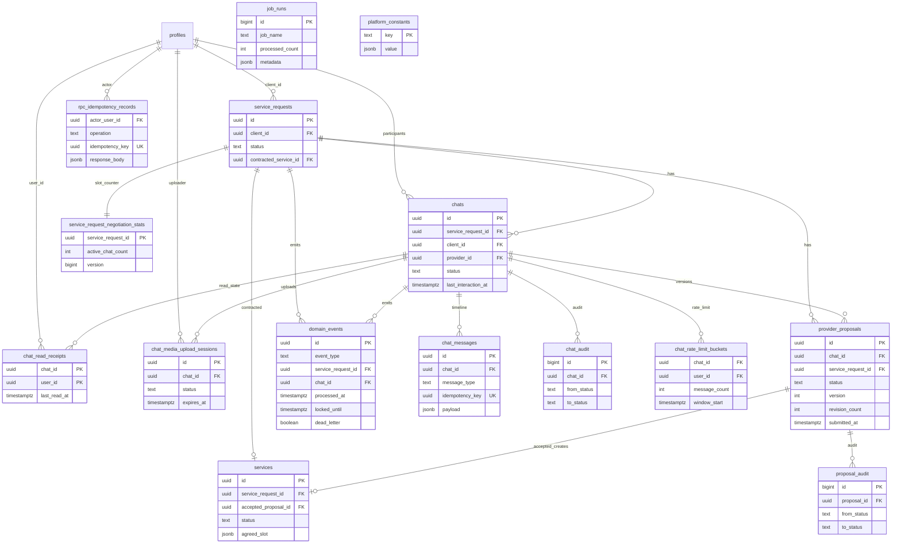

# CNS — Schema & Runtime Diagram

**Related:** [`design.md`](./design.md) §2.1 (core ER model), §3 (table schemas), §5–§6 (RPCs & cron)

Diagrama completo do CNS: **tabelas e FKs**, **RPCs**, **triggers**, **pg_cron jobs** e **pipeline assíncrono** (outbox → MMD/analytics). Schemas externos (`profiles`, `message_dispatcher`, Storage) aparecem como referências.

---

## Tabelas e foreign keys (modelo completo)

Estende o ER de [`design.md` §2.1](./design.md#21-entity-relationship-model-authoritative) com tabelas de suporte.

---

## RPCs, triggers, cron jobs & pipeline assíncrono

```mermaid
flowchart TB
  subgraph client ["Client & Edge (stateless)"]
    APP["React / Capacitor<br/>TanStack Query + Realtime"]
    EF_UP["Edge: chat-upload-media<br/>→ Storage chat-media bucket"]
    MMDW["Edge: message-dispatcher-worker<br/>→ FCM / Resend"]
  end

  subgraph rpc_sync ["Sync RPCs — single TX per user intent"]
    direction TB
    RPC_SEND["cns_send_message"]
    RPC_INIT["cns_initiate_conversation"]
    RPC_SUB["submit_proposal"]
    RPC_ACC["accept_proposal"]
    RPC_REJ["reject_proposal"]
    RPC_REV["request_proposal_revision"]
    RPC_DEC["decline_revision_request"]
    RPC_CLOSE["cns_close_conversation"]
    RPC_CANCEL["cancel_service_request"]
    RPC_READ["cns_mark_conversation_read"]
    RPC_LIST["list_* / get_* (read-only)"]
  end

  subgraph helpers ["Helper functions (called inside RPCs)"]
    H_FREE["cns_chat_free_messaging_allowed"]
    H_RATE["cns_check_message_rate_limit"]
    H_RECIP["cns_has_bilateral_reciprocity"]
    H_PART["is_chat_participant / is_platform_admin"]
    H_EVT["record_domain_event"]
    H_IDEM["idempotency_begin / idempotency_commit"]
    H_CONST["platform_constant_int"]
  end

  subgraph core ["Core tables (authoritative state)"]
    T_SR["service_requests"]
    T_STATS["service_request_negotiation_stats"]
    T_CHAT["chats"]
    T_MSG["chat_messages"]
    T_PP["provider_proposals"]
    T_SVC["services"]
    T_RR["chat_read_receipts"]
  end

  subgraph support ["Support tables"]
    T_EVT["domain_events<br/>(transactional outbox)"]
    T_IDEM["rpc_idempotency_records"]
    T_RL["chat_rate_limit_buckets"]
    T_UP["chat_media_upload_sessions"]
    T_JOB["job_runs"]
    T_CA["chat_audit"]
    T_PA["proposal_audit"]
    T_PC["platform_constants"]
  end

  subgraph triggers ["Triggers (same TX as mutating RPC/cron)"]
    TR_CHAT_AUD["chats_audit_status_change<br/>AFTER UPDATE OF status"]
    TR_PP_AUD["provider_proposals_audit_status_change<br/>AFTER UPDATE OF status"]
    TR_PP_SLA["provider_proposals_sync/enforce<br/>client_response_deadline"]
    TR_SR_CANCEL["service_requests_reject_submitted<br/>_proposals_on_cancel"]
    TR_UPD["*_updated_at<br/>(chats, messages, services, stats)"]
  end

  subgraph cron ["pg_cron scheduled jobs"]
    CR1["chat_evaluate_reciprocity<br/>*/10 min"]
    CR2["proposal_expire_pending<br/>*/10 min"]
    CR3["cns_process_domain_events<br/>*/1 min (design)"]
    CR4["cns_janitor_orphan_media<br/>daily 03:00 (design)"]
    CR5["cns_reconcile_pending_deliveries<br/>*/5 min (design)"]
  end

  subgraph cron_rpc ["Cron entrypoints → batch RPCs"]
    CR1 --> CR1_FN["cron_chat_evaluate_reciprocity"]
    CR1_FN --> FN_RECIP["cns_evaluate_reciprocity_batch(500)"]
    CR2 --> CR2_FN["cron_proposal_expire_pending"]
    CR2_FN --> FN_EXP["expire_pending_proposals(500)"]
    CR3 --> FN_EVT["cns_process_domain_events(100)"]
  end

  subgraph async ["Async consumers (after COMMIT)"]
    FN_EVT --> FN_REM["enqueue_proposal_expiring_soon_reminders"]
    FN_EVT --> FN_NTF["cns_enqueue_notifications"]
    FN_EVT --> FN_ANA["cns_emit_analytics"]
    FN_NTF --> FN_MMD["cns_mmd_ingest"]
    FN_REM --> FN_MMD
    FN_MMD --> MMD["message_dispatcher<br/>.message_dispatcher_ingest"]
    MMD --> MMDW
  end

  subgraph realtime ["Supabase Realtime publication"]
    RT_MSG["chat_messages INSERT"]
    RT_PP["provider_proposals UPDATE"]
  end

  APP -->|"supabase.rpc"| rpc_sync
  APP --> EF_UP
  EF_UP --> T_UP
  EF_UP --> T_MSG

  RPC_SEND --> H_FREE
  RPC_SEND --> H_RATE
  RPC_SEND --> H_EVT
  RPC_SEND --> H_PART
  RPC_SEND --> T_SR
  RPC_SEND --> T_STATS
  RPC_SEND --> T_CHAT
  RPC_SEND --> T_MSG
  RPC_SEND --> T_RL
  RPC_INIT --> T_SR
  RPC_INIT --> T_STATS
  RPC_INIT --> T_CHAT
  RPC_SUB --> T_PP
  RPC_SUB --> T_MSG
  RPC_SUB --> H_EVT
  RPC_ACC --> T_SR
  RPC_ACC --> T_PP
  RPC_ACC --> T_CHAT
  RPC_ACC --> T_SVC
  RPC_ACC --> T_STATS
  RPC_ACC --> H_IDEM
  RPC_ACC --> H_EVT
  RPC_REJ --> T_PP
  RPC_REJ --> H_EVT
  RPC_REV --> T_PP
  RPC_REV --> H_EVT
  RPC_DEC --> T_PP
  RPC_DEC --> H_EVT
  RPC_CLOSE --> T_CHAT
  RPC_CLOSE --> T_STATS
  RPC_CLOSE --> H_EVT
  RPC_CANCEL --> T_SR
  RPC_CANCEL --> T_CHAT
  RPC_CANCEL --> T_PP
  RPC_CANCEL --> H_EVT
  RPC_READ --> T_RR

  H_FREE --> T_PP
  H_RATE --> T_RL
  H_RATE --> T_PC
  H_RECIP --> T_MSG
  H_EVT --> T_EVT
  H_CONST --> T_PC

  FN_RECIP --> H_RECIP
  FN_RECIP --> T_CHAT
  FN_RECIP --> T_STATS
  FN_RECIP --> H_EVT
  FN_EXP --> T_PP
  FN_EXP --> H_EVT

  T_CHAT --> TR_CHAT_AUD --> T_CA
  T_PP --> TR_PP_AUD --> T_PA
  T_PP --> TR_PP_SLA
  T_SR --> TR_SR_CANCEL --> T_PP

  T_MSG --> RT_MSG --> APP
  T_PP --> RT_PP --> APP

  FN_EVT --> T_EVT
  FN_EVT --> T_JOB
  FN_RECIP --> T_JOB
  FN_EXP --> T_JOB

  T_EVT -.->|"cns_replay_domain_event"| FN_EVT

  style T_EVT fill:#e8f4fd,stroke:#2196F3
  style async fill:#fff8e1,stroke:#FFC107
  style cron fill:#f3e5f5,stroke:#9C27B0
  style triggers fill:#fce4ec,stroke:#E91E63
```

---

## Legenda

| Camada | Papel |
|--------|-------|
| **Sync RPCs** | Todas as transições de FSM (chat, proposta, SR) em um `BEGIN…COMMIT`; insere outbox via `record_domain_event` antes do commit. |
| **Triggers** | Audit append (`chat_audit`, `proposal_audit`), sync de SLA deadline, cascade de cancelamento de SR — nunca chamam HTTP externo. |
| **pg_cron** | Escaneia `chats` / `provider_proposals` / `domain_events` diretamente (sem fila interna v1); escreve telemetria em `job_runs`. |
| **Pipeline assíncrono** | `cns_process_domain_events` faz claim do outbox com `SKIP LOCKED` + lease de 30s; falhas MMD/analytics **não** revertem estado commitado (G5). |
| **RLS** | Todas as tabelas CNS usam `is_chat_participant` / `is_platform_admin`; mutações negadas ao client — **writes só via RPC**. |

**Nota:** os cron jobs `cns_process_domain_events`, `cns_janitor_orphan_media` e `cns_reconcile_pending_deliveries` estão marcados como *(design)* — ainda sem migration de registro no pg_cron (reciprocidade e expiry já registrados em `20260701103900_register_cron_batch_jobs.sql`).
