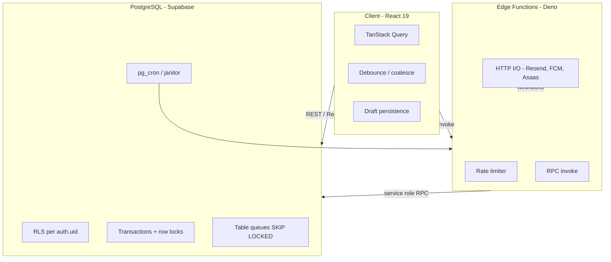

# Concurrency Requirements — Orbit (Prestway)

Requisitos transversais de **concorrência, paralelismo, consistência e idempotência** da plataforma Orbit. Complementa [`technical-stack.md`](./technical-stack.md).

---

## Context

Orbit é uma plataforma **mobile-first** (Web/PWA + Capacitor) com backend **Supabase** (PostgreSQL, Auth, Storage, Edge Functions). Vários atores e processos podem executar em paralelo:

- Múltiplas abas ou reinícios do app no mesmo usuário;
- Rajadas de eventos de auth (refresh, sign-in);
- Vários prestadores competindo por visibilidade e propostas no mesmo pedido;
- Workers horizontais (Edge Functions + `pg_cron`) consumindo filas no banco;
- Webhooks externos (Asaas, Resend, FCM) com entrega **at-least-once**.

O objetivo deste documento é definir **onde** a concorrência é permitida, **como** evitar condições de corrida prejudiciais e **quais garantias** cada camada deve oferecer — sem duplicar o detalhe de cada subsistema (ver documentos referenciados).

---

## Scope

| In scope | Out of scope |
|----------|----------------|
| Cliente React (TanStack Query, debounce, deduplicação in-flight) | Detalhe de UI/UX mobile (ver regras `platform-ux`, `mobile-first-ux`) |
| PostgreSQL (transações, locks, filas, RLS) | Políticas de negócio isoladas (ex.: texto de toasts) |
| Edge Functions (stateless, rate limit, I/O paralelo) | Infraestrutura Supabase/Vercel fora do repositório |
| Sistemas planeados: message dispatcher, dispatch progressivo, pagamentos | Implementação linha a linha de cada RPC (fica nos docs de domínio) |

---

## Architecture Overview

**Princípio central:** estado autoritativo e regras que exigem **atomicidade** ficam no **PostgreSQL**; Edge Functions são **conectores I/O** sem memória compartilhada entre invocações; o cliente trata **otimismo, cache e coalescência** de requisições, não orquestração distribuída.

---

## Assumptions

- Isolamento padrão do PostgreSQL: **Read Committed**; locks pessimistas em linha onde necessário (`FOR UPDATE`, opcionalmente `SKIP LOCKED`).
- Edge Functions são **stateless** e podem escalar horizontalmente; duas invocações nunca compartilham RAM.
- Cliente usa **JWT** do Supabase Auth; RLS restringe linhas por `auth.uid()` na maioria das tabelas de usuário.
- Identificadores estáveis: **UUID** (v4/v7) para entidades; **idempotency keys** obrigatórias em ingestão de filas e eventos de webhook quando aplicável.
- Processamento assíncrono crítico usa **filas em tabela** + lease (`locked_until`), não filas só em memória.
- TanStack Query é o mecanismo principal de cache e deduplicação de leituras no cliente (`staleTime` 60s, persistência IDB até 24h).
- Rate limiting de Edge Functions usa `platform_rate_limits` (`_shared/rateLimiter.ts`); falha de DB no limiter **fail-open** (permite requisição).

---

## Global Concurrency Principles

| # | Princípio | MUST / SHALL |
|---|-----------|--------------|
| G1 | **Single source of truth** | Estado de workflow (dispatch, pagamento, notificação) MUST persistir no Postgres; não em Edge nem no cliente. |
| G2 | **Locks no checkout** | Aquisição exclusiva de trabalho de fila MUST usar `SELECT … FOR UPDATE SKIP LOCKED` (ou equivalente transacional documentado no domínio). |
| G3 | **Leases com expiração** | Registros em `PROCESSING` MUST ter `locked_until`; expiração MUST permitir *orphan recovery* (re-queue ou retry). |
| G4 | **Idempotência na borda** | Ingestão API e webhooks MUST usar chaves únicas (`idempotency_key`, `asaas_event_id`, etc.) com `UNIQUE` constraint. |
| G5 | **Separação I/O vs transição** | Falha de envio push/e-mail HTTP MUST NOT reverter transição de batch/dispatch já persistida quando o domínio exigir desacoplamento (ver matching Req. 5.11–5.12). |
| G6 | **Serialização de cotas** | Rate limits por usuário/canal (push, e-mail, propostas) MUST ser avaliados em transação com lock na linha de agregação do usuário. |
| G7 | **Cliente: coalesce, não lock** | O app MUST deduplicar fetches simultâneos e debounce writes locais; MUST NOT simular locks distribuídos no browser. |
| G8 | **Paginação server-side** | Listagens crescentes MUST paginar e filtrar no servidor; concorrência de scroll infinito MUST usar `useInfiniteQuery` com `queryKey` estável por filtros. |

---

# Requirements

## Requirement 1: Client Request Coalescing and Debouncing

*User Story:* Como usuário do app, quero que ações rápidas repetidas (digitar, trocar de tela, eventos de auth) não disparem dezenas de gravações ou leituras redundantes.

### Acceptance Criteria

* GIVEN múltiplos componentes ou efeitos solicitam o perfil do mesmo `userId` no mesmo tick
* WHEN `fetchProfile` é chamado sem `forceRefresh`
* THEN o cliente MUST reutilizar a mesma `Promise` in-flight (padrão em `useProfileFetcher`) até conclusão ou troca de usuário.

* GIVEN alterações frequentes em formulários com persistência local (rascunho de orçamento, auto-save de conta)
* WHEN o usuário edita campos continuamente
* THEN gravações MUST ser debounced (ex.: **400 ms** rascunho request-quote, **1500 ms** auto-save minha conta / taxa de proposta) antes de I/O.

* GIVEN eventos Supabase Auth não iniciais (ex.: `TOKEN_REFRESHED` seguido de `SIGNED_IN`)
* WHEN o listener de auth dispara em rajada
* THEN o handler MUST debounce (**300 ms**, `useAuth`) exceto bootstrap inicial de sessão (sem debounce).

* GIVEN busca textual em listagens paginadas
* WHEN o usuário digita no filtro
* THEN o `queryKey` MUST atualizar apenas após debounce (~**400 ms**) para evitar storm de RPCs.

### Reference (implemented)

- `src/features/auth/hooks/useProfileFetcher.ts`
- `src/features/auth/hooks/useAuth.tsx` (`AUTH_DEBOUNCE_MS`)
- `src/features/request-quote/hooks/useRequestQuoteDraft.ts` (`PERSIST_DEBOUNCE_MS`)

---

## Requirement 2: TanStack Query Cache and Parallel Reads

*User Story:* Como engenheiro frontend, quero cache previsível e refetch controlado em ambiente offline-first e em testes E2E.

### Acceptance Criteria

* GIVEN ambiente de produção com cache habilitado
* WHEN queries são criadas com defaults globais
* THEN `staleTime` MUST ser **60 s**, `gcTime` MUST ser ≥ idade máxima do persist (**24 h**), e `refetchOnWindowFocus` MUST ser **false** (evita refetch storm ao voltar à aba).

* GIVEN `VITE_DISABLE_REACT_QUERY_CACHE=true` (testes/diagnóstico)
* WHEN o app inicia
* THEN cache em memória MUST ser desabilitado (`staleTime: 0`, `gcTime: 0`, refetch agressivo) sem quebrar bootstrap.

* GIVEN listagem com scroll infinito (`useInfiniteQuery`)
* WHEN filtros (`status`, `search`) mudam
* THEN `queryKey` MUST incluir todos os parâmetros de filtro; páginas anteriores MUST ser descartadas (nova query, não append inconsistente).

* GIVEN duas queries com a mesma `queryKey` montadas simultaneamente
* WHEN ambas estão ativas
* THEN TanStack Query MUST deduplicar a requisição de rede (comportamento padrão da biblioteca — não desabilitar sem motivo).

### Reference (implemented)

- `src/main.tsx`, `src/lib/queryClient/index.ts`

---

## Requirement 3: Offline-First and Eventual Consistency (Client)

*User Story:* Como usuário mobile com conectividade instável, quero ver dados em cache e rascunhos salvos sem perder trabalho; aceito consistência eventual com o servidor.

### Acceptance Criteria

* GIVEN `navigator.onLine === false` e cache persistido de perfil
* WHEN `fetchProfile` é invocado
* THEN o cliente MUST servir dados de `cachePersistGet` antes de falhar, sem chamada de rede.

* GIVEN React Query persistido em IndexedDB (`idb-keyval`)
* WHEN o app reinicia offline
* THEN dados dentro de `PERSISTED_CACHE_MAX_AGE_MS` (**24 h**) MAY ser hidratados; mutações pendentes MUST seguir política explícita do domínio (hoje: rascunhos locais; fila global de mutações é **roadmap** — ver `technical-stack.md`).

* GIVEN mutação falhou por rede
* WHEN o usuário permanece offline
* THEN a UI MUST comunicar erro/retry; MUST NOT assumir sucesso otimista sem confirmação server-side em fluxos financeiros ou aceite de proposta.

* GIVEN reconexão
* WHEN `refetchOnReconnect` está habilitado (modo cache desabilitado) ou query stale
* THEN o cliente SHOULD reconciliar com servidor (invalidação/refetch conforme hook).

---

## Requirement 4: PostgreSQL Transactional Concurrency

*User Story:* Como Principal Engineer, quero que regras críticas sob concorrência (cotas, checkout de fila, transição de estado) sejam corretas sob paralelismo real no banco.

### Acceptance Criteria

* GIVEN N workers ou RPCs concorrentes fazendo checkout de fila
* WHEN cada um executa o RPC de dequeue
* THEN cada transação MUST usar `FOR UPDATE SKIP LOCKED` (ou CTE equivalente) para que **nenhum** registro seja entregue a dois workers.

* GIVEN transição `QUEUED` → `PROCESSING` (message dispatcher) ou equivalente em outros domínios
* WHEN o checkout commita
* THEN `locked_until` MUST ser definido atomicamente na mesma transação (ex.: `now() + interval '30 seconds'`).

* GIVEN duas transações simultâneas avaliam cota restante (ex.: 1 push restante no dia)
* WHEN ambas passam pela checagem sem serialização
* THEN o sistema MUST serializar (lock em linha de contador/agregação do usuário) de modo que **apenas uma** prossiga e a outra MUST ir para `CANCELED` / `FAILED_TERMINAL` / re-agendamento — ver message dispatcher Req. 1.

* GIVEN mudança de estado + auditoria
* WHEN a máquina de estados avança
* THEN estado + linha de audit MUST commitar na **mesma** transação (trigger `AFTER UPDATE` ou RPC único).

* GIVEN políticas RLS
* WHEN duas sessões de usuários diferentes acessam a mesma tabela
* THEN concorrência inter-usuário MUST ser isolada por `auth.uid()`; funções `SECURITY DEFINER` MUST ser restritas a service role / RPCs documentados.

### Reference (specified)

- [`message-dispatcher/requirements.md`](./message-dispatcher/requirements.md) — Req. 3, 5, Operational Architecture Constraints
- [`matching-algorithm.md`](./matching-algorithm.md) — Req. 5.13, dispatch state atômico

---

## Requirement 5: Edge Functions — Stateless Horizontal Scale

*User Story:* Como operador, quero escalar invocações Deno sem coordenação em memória entre instâncias.

### Acceptance Criteria

* GIVEN duas invocações simultâneas da mesma Edge Function
* WHEN ambas processam trabalho de fila
* THEN MUST NOT depender de variáveis globais mutáveis para exclusão; exclusão MUST vir do Postgres (Req. 4).

* GIVEN `match-provider-jobs` após auth
* WHEN dados de UI complementares são necessários
* THEN queries independentes (RPC + offered services + neighborhoods) MAY executar em **paralelo** (`Promise.all`), desde que falha parcial seja tratada explicitamente na resposta.

* GIVEN função de criação de pedido ou IA
* WHEN a requisição entra
* THEN rate limit (`checkRateLimit`) MUST ser aplicado antes de trabalho caro; resposta `429` com `retryAfter` quando bloqueado.

* GIVEN crash/timeout da Edge após checkout no DB
* WHEN `locked_until` expira
* THEN job de janitor / cron MUST requeue ou marcar retry — estado MUST NOT ficar preso em `PROCESSING` indefinidamente.

* GIVEN compilação de template (HTML push/e-mail)
* WHEN variáveis são substituídas
* THEN MUST ocorrer na Edge (CPU), não no PL/pgSQL, após payload serializado sair do DB.

### Reference (implemented / planned)

- `supabase/functions/match-provider-jobs/index.ts`
- `supabase/functions/_shared/rateLimiter.ts`
- `supabase/functions/create-request-quote-order/index.ts`

---

## Requirement 6: Rate Limiting (Platform and Domain)

*User Story:* Como plataforma, quero limitar abuso de endpoints caros sem bloquear usuários legítimos por falha operacional do contador.

### Acceptance Criteria

* GIVEN Edge Function com `checkRateLimit` configurado
* WHEN contador em `platform_rate_limits` está abaixo do limite por janela de **60 s**
* THEN requisição MUST prosseguir e incrementar contador.

* GIVEN limite excedido na janela
* WHEN nova requisição chega
* THEN MUST retornar HTTP **429** com `retryAfter` em segundos.

* GIVEN erro de leitura/escrita em `platform_rate_limits` ou env ausente
* WHEN `checkRateLimit` executa
* THEN MUST **fail-open** (`allowed: true`) — documentado em `_shared/rateLimiter.ts`.

* GIVEN limites de produto (push/e-mail por usuário)
* WHEN avaliados no message dispatcher
* THEN MUST usar serialização transacional no DB, **não** apenas o rate limiter soft das Edge Functions.

| Camada | Escopo | Mecanismo |
|--------|--------|-----------|
| Edge | Por IP / `userId` / nome da função | `platform_rate_limits` |
| Postgres | Por usuário/canal/dia/cooldown | RPC + locks (message dispatcher) |
| Auth (Supabase) | Sign-in, OTP, etc. | `[auth.rate_limit]` em `config.toml` |

---

## Requirement 7: Idempotency and Duplicate Suppression

*User Story:* Como integrador ou webhook provider, quero que reenvios da mesma mensagem não dupliquem efeitos colaterais.

### Acceptance Criteria

* GIVEN ingestão de dispatch de notificação com `idempotency_key` duplicada
* WHEN segunda requisição chega
* THEN DB MUST rejeitar ou retornar sucesso sem side-effect (`UNIQUE` constraint) — message dispatcher Req. 5.

* GIVEN ausência de `idempotency_key` na ingestão obrigatória
* WHEN API valida payload
* THEN MUST retornar **400** sem persistir.

* GIVEN webhook Asaas com mesmo `asaas_event_id`
* WHEN handler processa segunda vez
* THEN MUST marcar duplicata (`is_duplicate = true`) e MUST NOT reprocessar transição de pagamento — `payment-system-plan.md` §23.5.

* GIVEN eventos fora de ordem (ex.: `PAYMENT_CONFIRMED` após `PAYMENT_RECEIVED`)
* WHEN máquina de estados já está em estado terminal ou avançado
* THEN transição regressiva MUST ser ignorada (skip seguro).

* GIVEN retry de worker após timeout
* WHEN mesma mensagem é reprocessada
* THEN efeito no provedor externo MUST ser seguro (mesmo `transaction_id` / chave de deduplicação no payload FCM/Resend quando aplicável).

---

## Requirement 8: Domain Queues and Scheduled Workers

*User Story:* Como operador, quero picos de notificações, dispatch e reconciliação financeira absorvidos por filas duráveis e workers idempotentes.

### Acceptance Criteria

| Domínio | Fila / estado | Concorrência | Doc |
|---------|---------------|--------------|-----|
| Message Dispatcher | Tabela + estados (`QUEUED`…`DELIVERED`) | `SKIP LOCKED`, lease, backoff, `pg_cron` | [message-dispatcher/requirements.md](./message-dispatcher/requirements.md) |
| Dispatch progressivo | `DISPATCH_*`, batches de 10 | Transições atômicas; notificação async | [matching-algorithm.md](./matching-algorithm.md) |
| Pagamentos | Webhooks + `service_payment_events` | `UNIQUE(asaas_event_id)`, webhooks 200 + log interno | [payment-system-plan.md](./payment-system-plan.md) |

* GIVEN `pg_cron` dispara N workers no mesmo slot
* WHEN todos chamam dequeue
* THEN throughput MUST escalar com N até limite de conexões/IO; correção MUST manter-se pela fila no DB.

* GIVEN janitor de leases
* WHEN `locked_until < now()` e estado `PROCESSING`
* THEN registro MUST voltar a `QUEUED` ou `FAILED_RETRYABLE` conforme política do domínio.

---

## Requirement 9: Competitive Writes (Marketplace)

*User Story:* Como cliente, quero que apenas uma proposta seja aceita e que limites de propostas ativas sejam respeitados sob carga.

### Acceptance Criteria

* GIVEN um `service_request` com 3 propostas ativas não rejeitadas
* WHEN quarto prestador tenta propor via regras do RPC
* THEN inserção MUST falhar na camada server (eligibility em `match_provider_jobs` / triggers).

* GIVEN aceite de proposta com pagamento (roadmap)
* WHEN dois fluxos de checkout disputam a mesma proposta
* THEN `UNIQUE(proposal_id)` em serviços/pagamentos e transições via webhook MUST garantir um único caminho válido.

* GIVEN dispatch com ≥ 4 propostas pendentes ou proposta aceita
* WHEN novo batch seria aberto
* THEN estado MUST ir para `DISPATCH_STOPPED` — matching Req. 5.15.

---

## Requirement 10: Observability Under Concurrency

*User Story:* Como suporte/SRE, quero rastrear execuções paralelas e falhas parciais sem misturar contexto de usuários.

### Acceptance Criteria

* GIVEN erro em query ou mutation React Query
* WHEN falha não tratada
* THEN MUST reportar ao Sentry com `queryKey` / contexto (`main.tsx` caches).

* GIVEN logs em Edge/lib
* WHEN evento é registrado
* THEN MUST usar `logger` estruturado (não `console`) com correlation id quando disponível (user id, dispatch id, `idempotency_key`).

* GIVEN auditoria de message dispatcher ou dispatch
* WHEN estado muda
* THEN histórico imutável MUST permitir reconstruir ordem de transições (timestamps monotônicos no audit).

---

# Delivery Guarantees Summary

| Camada | Modelo típico | Notas |
|--------|---------------|-------|
| Cliente → API REST | At-most-once por ação do usuário (debounce) | Retries manuais ou React Query retry |
| Edge → Postgres RPC | At-least-once invocação | Idempotência no RPC |
| Fila DB → Worker | At-least-once processamento | Lease + idempotency; expiração → at-most-once discard opcional |
| Webhook externo | At-least-once entrega | Dedup por `UNIQUE` event id |
| Push/Email provedor | At-least-once (FCM/Resend) | Rate limit + dedup de notificação por SR |

---

# Implementation Guidance

## Onde implementar cada preocupação

| Preocupação | PostgreSQL | Edge Functions | Cliente (React) |
|-------------|------------|----------------|-----------------|
| Exclusão de item de fila | `SKIP LOCKED`, lease | Dequeue via RPC apenas | — |
| Máquina de estados | RPC + triggers + CHECK | Reportar HTTP status → RPC | Exibir estado; não é fonte da verdade |
| Rate limit de produto | Locks + contadores 24h | — | — |
| Rate limit de endpoint | `platform_rate_limits` | `checkRateLimit` | — |
| Idempotency ingestão | `UNIQUE` constraints | Validar headers/body | Gerar UUID cliente |
| Webhook dedup | `UNIQUE(asaas_event_id)` | Handler 200 + log | — |
| Cache leitura | RPC paginado | — | TanStack Query + IDB |
| Rascunho / offline | — | — | Preferences + debounce |
| Dedup fetch perfil | — | — | in-flight Promise ref |
| Template rendering | — | Deno | — |
| Janitor leases | `pg_cron` + RPC | — | — |

## Anti-patterns (proibidos)

1. **Lock distribuído em memória na Edge** para coordenar workers.
2. **Filtrar/paginar listas grandes só no cliente** após `select *`.
3. **Duas fontes de verdade** para o mesmo estado (ex.: status de pagamento só no cliente).
4. **Optimistic update** em fluxo financeiro sem reconciliação com webhook.
5. **Ignorar `SKIP LOCKED`** e usar `SELECT` simples + update otimista para filas.
6. **Rate limit apenas no cliente** para regras de negócio (push diário, cooldown).
7. **Assumir exactly-once** com provedores externos (FCM, Resend, Asaas).

---

# Related Documents

| Documento | Relação |
|-----------|---------|
| [`technical-stack.md`](./technical-stack.md) | Stack, offline-first, comandos |
| `.cursor/rules/server-side-pagination-and-filtering.mdc` | Paginação e debounce de busca |

---

# Revision History

| Data | Nota |
|------|------|
| 2026-05-21 | Versão inicial — requisitos transversais alinhados ao código e docs existentes |
