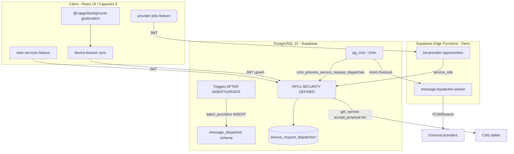
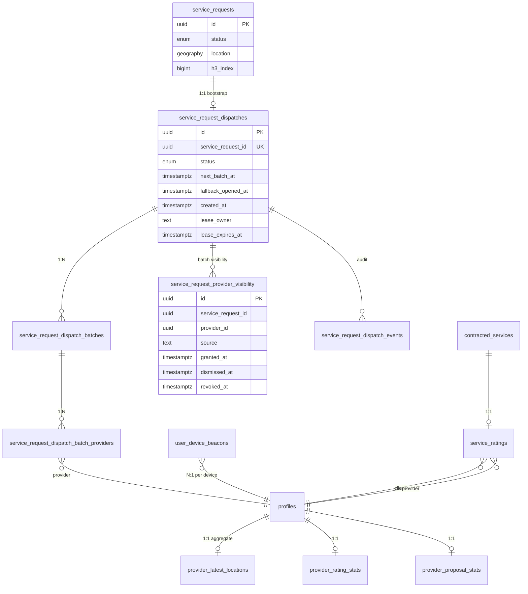
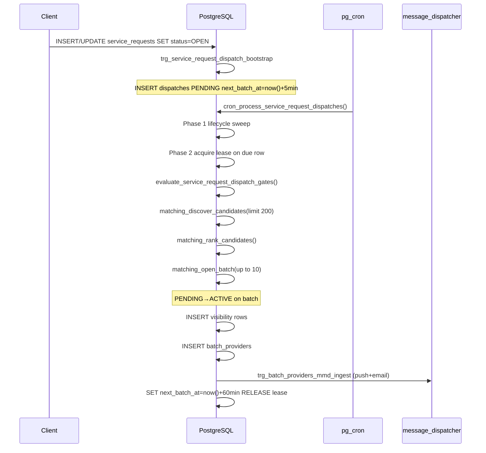
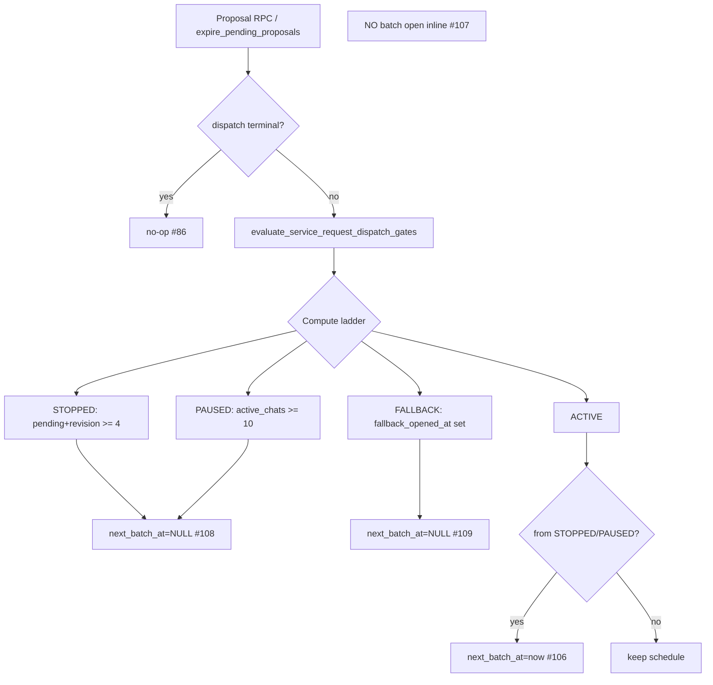
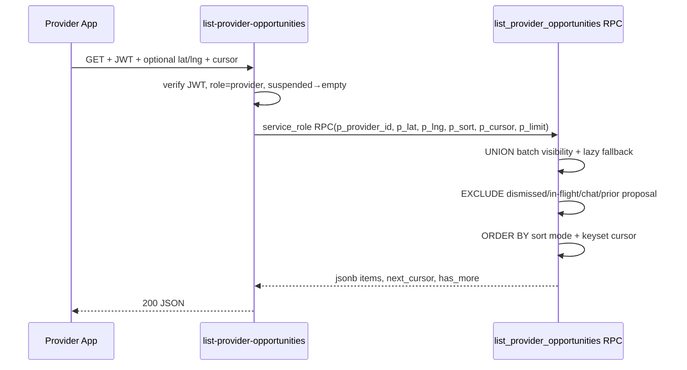

# Renovi Progressive Dispatch & Matching — Design Document

**Status:** Complete for implementation kickoff (2026-06-17)  
**Covers:** Requirements 1–13, 4A, 10A, 10B (200 acceptance criteria)  
**Sources:** [`requirements.md`](./requirements.md), [`CONTEXT.md`](./CONTEXT.md), ADRs [0001](./adr/0001-replace-open-feed-with-progressive-matching.md)–[0005](./adr/0005-service-ratings-and-provider-stats.md)  
**Baseline DB (local):** Legacy open feed (`match_provider_jobs`) live; dispatch/ratings/feed RPCs **not migrated** — this design specifies **net-new migrations only**.

---

## Document conventions

- **SHALL / MUST** — normative implementation requirement.
- **SHOULD** — strong recommendation; deviation requires ADR.
- **MAY** — optional optimization.
- **Txn boundary** — PostgreSQL transaction scope; all `SECURITY DEFINER` RPCs use `SET search_path = public, extensions`.
- **Delivery model:** at-least-once for cron/MMD/Edge; exactly-once *effect* via idempotency keys + UNIQUE constraints + lease ownership.
- **No migration edits:** all schema/RPC changes ship as **new** timestamped files under `supabase/migrations/`.

---

# 1. Overall Architecture and Component Relationships

## 1.1 Problem statement

Replace the **open-radius pull feed** (`match_provider_jobs`) with a **closed progressive dispatch orchestrator** that:

1. Persists per–Service Request dispatch FSM state.
2. Opens batches of up to 10 providers on a schedule (5 min bootstrap delay, 60 min interval, 48 h lifecycle).
3. Enforces CNS-aligned gates (`STOPPED` / `PAUSED` / `FALLBACK` / `ACTIVE`).
4. Delivers batch notifications through the existing **Message Dispatcher** (MMD) without blocking batch persistence.
5. Exposes a **visibility-gated feed** (`list_provider_opportunities`) with lazy fallback union.
6. Keeps **detail and CNS actions ungated** (`get_service`, propose/chat subject to CNS + `DISPATCH_STOPPED` proposal cap only).

## 1.2 Runtime topology



`*` — tables defined in this design; not yet in local DB.

## 1.3 Component responsibilities

| Component | Stateful? | Owns | MUST NOT |
|-----------|-----------|------|----------|
| **PostgreSQL** | Yes (authoritative) | Dispatch FSM, visibility, ranking, gates, leases, stats aggregates, MMD ingest rows, audit | HTTP to FCM/Resend |
| **pg_cron + job_runs** | Yes (schedule + telemetry) | Phase-1 lifecycle sweep, phase-2 batch/gate worker invocation | Business logic outside RPC |
| **Edge `list-provider-opportunities`** | No | JWT validation, provider role check, RPC proxy, response shaping | Matching logic, geo ranking |
| **Edge `message-dispatcher-worker`** | No | Template render, FCM/Resend HTTP, report status RPC | Dispatch state transitions |
| **Client `provider-jobs`** | Cache only | Feed UI, sort mode, cursor pagination, dismiss action, optional feed GPS | Visibility rules |
| **Client `view-services`** | Cache only | Detail UI, `useRecordProviderOpportunityView` on mount | Audit side effects in `get_service` |
| **Client device-beacon** | Device state | Background geo, permission UX, beacon upsert API | Batch eligibility |

## 1.4 Architectural invariants

| ID | Invariant | Enforcement |
|----|-----------|-------------|
| I1 | One dispatch row per SR | `UNIQUE(service_request_id)` on `service_request_dispatches` |
| I2 | One batch notification per (SR, batch#, provider, channel) | MMD `idempotency_key` UNIQUE |
| I3 | One `provider_viewed` audit per (SR, provider) | Partial UNIQUE index on `dispatch_events` (#93) — see §3.3b |
| I4 | One rating per `contracted_service` | `UNIQUE(contracted_service_id)` on `service_ratings` |
| I5 | One stats row per provider | `UNIQUE(provider_id)` on `provider_rating_stats`, `provider_proposal_stats` |
| I6 | Batch open side effects only in cron phase 2 | Code review + `evaluate_*` never calls `open_batch_*` (#107) |
| I7 | Terminal dispatch states immutable | `evaluate_service_request_dispatch_gates` early return (#86) |
| I8 | Feed visibility ≠ action authorization | Separate code paths: `list_provider_opportunities` vs CNS RPCs |

## 1.5 Sync vs async boundaries

| Operation | Model | Max latency | Consistency |
|-----------|-------|-------------|-------------|
| SR first `OPEN` → dispatch bootstrap | **Sync** (trigger, same txn as SR) | ms | Strong |
| Gate re-eval on proposal RPC | **Sync** (inline, same txn) | ms | Strong |
| Batch discovery + visibility + MMD ingest | **Sync txn** in cron worker; MMD **delivery async** | batch txn < 5s; push minutes | Strong for visibility; eventual for push |
| Push/e-mail delivery | **Async** (MMD worker) | seconds–hours | Eventual |
| Feed read | **Sync** RPC | p95 < 500ms | Read committed snapshot |
| Provider location sync | **Async** (client-driven upsert) | minutes | Eventual; freshness gate in discovery |
| Stats refresh | **Sync** (trigger, same txn as rating/proposal) | ms | Strong |

## 1.6 Trade-offs accepted

| Decision | Benefit | Cost |
|----------|---------|------|
| DB-centric orchestration (no Temporal/BullMQ) | ACID FSM, reuse MMD/cron patterns | Up to ~2 min delay batch open after gate clears (#106) |
| Lazy fallback (no bulk visibility INSERT) | No write amplification at pool exhaustion | Heavier feed query (runtime neighborhood join) |
| Lease on dispatch row (not SKIP LOCKED queue) | Simple 1:1 SR ownership | Phase-2 scans `next_batch_at` + PAUSED/STOPPED indexes |
| Hardcoded 20 km / pool 200 | Fewer misconfiguration vectors | Requires migration to tune |
| Cursor feed pagination | Stable under concurrent visibility | Opaque cursor encoding complexity |

## 1.7 Scaling strategy

- **Horizontal:** Multiple Supabase Edge invocations; **single-writer per dispatch row** via lease (not parallel batch open for same SR).
- **Vertical (PG):** H3 pre-filter + GIST on `provider_latest_locations.location`; partial indexes on `next_batch_at`, `status`.
- **Fan-out:** Batch size cap 10; MMD checkout obeys per-user quotas (5 email / 20 push per day).
- **Hot partition mitigation:** Cron phase-2 uses `FOR UPDATE SKIP LOCKED` when selecting due dispatch rows; batch limit per tick (e.g. 50 dispatches).

---

# 2. Data Models and Relationships

## 2.1 ERD (target state)



## 2.2 Entity semantics

| Entity | Mutable state machine? | Append-only audit? | Owner |
|--------|------------------------|--------------------|-------|
| `service_request_dispatches` | **Yes** — FSM + schedule + lease | No | Platform (RPC/trigger only) |
| `service_request_dispatch_batches` | Insert-only sequence | No | Child of dispatch |
| `service_request_dispatch_batch_providers` | Insert-only per batch | No | Triggers MMD ingest |
| `service_request_provider_visibility` | `dismissed_at`/`revoked_at` updates | No | Per (SR, provider) |
| `service_request_dispatch_events` | **Append-only** | **Yes** | Audit |
| `provider_latest_locations` | Upsert 1:1 | No | Derived from beacons |
| `service_ratings` | Update within 48h window | No | Client via RPC |
| `provider_*_stats` | Trigger-maintained | No | Derived |

## 2.3 Consistency semantics

- **Strong:** dispatch status + visibility grant + batch row + MMD ingest enqueue (single txn in `matching_open_batch`).
- **Eventual:** FCM/Resend delivery; provider location propagation beacon → `provider_latest_locations`.
- **Read-your-writes:** Client feed invalidates TanStack Query on dismiss; not guaranteed cross-device for feed (60s staleTime acceptable).

---

# 3. Table Schemas with Constraints

> **Migration policy:** Each subsection maps to a **new** migration file. Never alter shipped migrations.

## 3.1 Migration wave plan

| # | File (proposed prefix) | Contents |
|---|------------------------|----------|
| M1 | `*_matching_platform_constants_seeds.sql` | `platform_constant_numeric`; INSERT 22 `matching.*` keys (#98, #131) |
| M2 | `*_matching_profiles_operational_status.sql` | `operational_status` enum + column on `profiles` |
| M3 | `*_matching_beacon_location_columns.sql` | Extend `user_device_beacons` with location columns |
| M4 | `*_matching_provider_latest_locations.sql` | Table + trigger on beacon upsert |
| M5 | `*_matching_dispatch_enums_tables.sql` | Enums, 5 dispatch tables, indexes, RLS deny authenticated direct write |
| M6 | `*_matching_dispatch_bootstrap_trigger.sql` | SR first `OPEN` → dispatch row |
| M7 | `*_matching_rating_stats_schema.sql` | `service_ratings`, stats tables, bootstrap + refresh triggers |
| M8 | `*_matching_gate_helper.sql` | `evaluate_service_request_dispatch_gates` |
| M9 | `*_matching_discovery_ranking.sql` | Internal SQL functions: eligibility, ranking, tie-break |
| M10 | `*_matching_open_batch_and_cron.sql` | `matching_open_batch`, `cron_process_service_request_dispatches`, pg_cron job |
| M11 | `*_matching_mmd_batch_notification_trigger.sql` | AFTER INSERT on `batch_providers` → MMD ingest |
| M12 | `*_matching_feed_audit_rpcs.sql` | `list_provider_opportunities`, `dismiss_provider_opportunity`, `record_provider_opportunity_view` |
| M13 | `*_matching_rating_rpcs.sql` | `submit_service_rating`, `update_service_rating` |
| M14 | `*_matching_integrate_cns_dispatch.sql` | Patch `accept_proposal`, `cancel_service_request`, `expire_pending_proposals`, proposal RPCs for gates |
| M15 | `*_matching_drop_legacy_feed.sql` | `DROP FUNCTION match_provider_jobs`; deploy after client cutover |

## 3.2 `service_request_dispatches`

```sql
create type public.service_request_dispatch_status as enum (
  'DISPATCH_PENDING',
  'DISPATCH_ACTIVE',
  'DISPATCH_PAUSED',
  'DISPATCH_STOPPED',
  'DISPATCH_MATCHED',
  'DISPATCH_FALLBACK_OPEN_MARKET',
  'DISPATCH_CANCELLED',
  'DISPATCH_EXPIRED'
);

create table public.service_request_dispatches (
  id uuid primary key default gen_random_uuid(),
  service_request_id uuid not null references public.service_requests(id) on delete cascade,
  status public.service_request_dispatch_status not null default 'DISPATCH_PENDING',
  next_batch_at timestamptz,
  fallback_opened_at timestamptz,
  batch_sequence int not null default 0,  -- last opened batch number
  lease_owner text,
  lease_expires_at timestamptz,
  created_at timestamptz not null default now(),
  updated_at timestamptz not null default now(),
  constraint service_request_dispatches_sr_id_unique unique (service_request_id),
  constraint service_request_dispatches_fallback_requires_ts check (
    status <> 'DISPATCH_FALLBACK_OPEN_MARKET' or fallback_opened_at is not null
  )
);

create index service_request_dispatches_next_batch_at_idx
  on public.service_request_dispatches (next_batch_at)
  where next_batch_at is not null
    and status not in ('DISPATCH_MATCHED','DISPATCH_CANCELLED','DISPATCH_EXPIRED');

create index service_request_dispatches_gate_reeval_idx
  on public.service_request_dispatches (status, updated_at)
  where status in ('DISPATCH_PAUSED','DISPATCH_STOPPED');

create index service_request_dispatches_lifecycle_idx
  on public.service_request_dispatches (created_at)
  where status not in ('DISPATCH_MATCHED','DISPATCH_CANCELLED','DISPATCH_EXPIRED');
```

**Race prevention:** `UNIQUE(service_request_id)` prevents double bootstrap. Lease columns prevent concurrent phase-2 workers on same row.

## 3.3 `service_request_provider_visibility`

```sql
create table public.service_request_provider_visibility (
  id uuid primary key default gen_random_uuid(),
  service_request_id uuid not null references public.service_requests(id) on delete cascade,
  provider_id uuid not null references public.profiles(id) on delete cascade,
  source text not null check (source in ('batch','fallback_dismiss')),
  granted_at timestamptz,  -- null for fallback_dismiss-only rows
  dismissed_at timestamptz,
  revoked_at timestamptz,
  created_at timestamptz not null default now(),
  constraint srv_visibility_batch_granted check (
    source <> 'batch' or granted_at is not null
  )
);

-- Batch notification dedupe (#114)
create unique index service_request_provider_visibility_batch_unique
  on public.service_request_provider_visibility (service_request_id, provider_id)
  where source = 'batch' and revoked_at is null;

create index srv_visibility_feed_idx
  on public.service_request_provider_visibility (provider_id, granted_at desc)
  where revoked_at is null and dismissed_at is null and source = 'batch';
```

## 3.3a `service_request_dispatch_batches`

```sql
create table public.service_request_dispatch_batches (
  id uuid primary key default gen_random_uuid(),
  dispatch_id uuid not null references public.service_request_dispatches(id) on delete cascade,
  batch_number int not null,
  explored_h3_cells jsonb,  -- audit only (Req 2 AC5, Req 9)
  opened_at timestamptz not null default now(),
  created_at timestamptz not null default now(),
  constraint dispatch_batches_number_unique unique (dispatch_id, batch_number),
  constraint dispatch_batches_number_positive check (batch_number >= 1)
);

create index service_request_dispatch_batches_dispatch_idx
  on public.service_request_dispatch_batches (dispatch_id, batch_number desc);
```

**Semantics:** insert-only sequence; `batch_number` = `dispatches.batch_sequence` at open time. H3 cells explored during discovery for this batch persisted for audit — **SHALL NOT** affect future eligibility.

## 3.3b `service_request_dispatch_events`

```sql
create type public.service_request_dispatch_event_type as enum (
  'state_transition',
  'batch_opened',
  'pool_exhausted',
  'provider_viewed',
  'provider_declined',
  'dispatch_expired',
  'dispatch_paused',
  'dispatch_resumed'
);

create table public.service_request_dispatch_events (
  id uuid primary key default gen_random_uuid(),
  dispatch_id uuid not null references public.service_request_dispatches(id) on delete cascade,
  service_request_id uuid not null references public.service_requests(id) on delete cascade,
  provider_id uuid references public.profiles(id) on delete set null,
  event_type public.service_request_dispatch_event_type not null,
  payload jsonb not null default '{}'::jsonb,
  created_at timestamptz not null default now()
);

-- Idempotent provider_viewed (#93)
create unique index dispatch_events_provider_viewed_unique
  on public.service_request_dispatch_events (service_request_id, provider_id)
  where event_type = 'provider_viewed';

-- Idempotent provider_declined (#101) — one decline audit per provider/SR
create unique index dispatch_events_provider_declined_unique
  on public.service_request_dispatch_events (service_request_id, provider_id)
  where event_type = 'provider_declined';

create index dispatch_events_dispatch_id_idx
  on public.service_request_dispatch_events (dispatch_id, created_at desc);

create index dispatch_events_sr_provider_idx
  on public.service_request_dispatch_events (service_request_id, provider_id, event_type);
```

**Append-only:** no UPDATE/DELETE for `authenticated`. Retention policy (Req 8 AC8) — SHOULD partition by `created_at` monthly when > 10M rows.

## 3.4 `service_request_dispatch_batch_providers`

```sql
create table public.service_request_dispatch_batch_providers (
  id uuid primary key default gen_random_uuid(),
  batch_id uuid not null references public.service_request_dispatch_batches(id) on delete cascade,
  provider_id uuid not null references public.profiles(id) on delete cascade,
  ranking_score numeric(8,4) not null,
  score_components jsonb not null default '{}'::jsonb,  -- Req 4A AC7 audit decompose
  device_id uuid,  -- originating beacon device (#18)
  created_at timestamptz not null default now(),
  constraint batch_providers_unique unique (batch_id, provider_id)
);
```

## 3.5 `provider_latest_locations`

```sql
create table public.provider_latest_locations (
  provider_id uuid primary key references public.profiles(id) on delete cascade,
  location extensions.geography(point, 4326),
  h3_index bigint,
  device_id uuid,
  location_recorded_at timestamptz,
  location_accuracy_meters numeric,
  updated_at timestamptz not null default now()
);

create index provider_latest_locations_location_gist
  on public.provider_latest_locations using gist (location);

create index provider_latest_locations_h3_idx
  on public.provider_latest_locations (h3_index)
  where h3_index is not null;
```

## 3.6 `service_ratings` + stats (ADR 0005)

```sql
create table public.service_ratings (
  id uuid primary key default gen_random_uuid(),
  contracted_service_id uuid not null references public.contracted_services(id) on delete cascade,
  service_request_id uuid not null references public.service_requests(id),
  client_id uuid not null references public.profiles(id),
  provider_id uuid not null references public.profiles(id),
  score_quality smallint not null check (score_quality between 1 and 5),
  score_punctuality smallint not null check (score_punctuality between 1 and 5),
  score_communication smallint not null check (score_communication between 1 and 5),
  score_value smallint not null check (score_value between 1 and 5),
  overall_score numeric(4,2) not null,
  comment text,
  submitted_at timestamptz not null default now(),
  updated_at timestamptz not null default now(),
  constraint service_ratings_contracted_service_unique unique (contracted_service_id)
);

create table public.provider_rating_stats (
  provider_id uuid primary key references public.profiles(id) on delete cascade,
  rating_count int not null default 0,
  overall_avg numeric(4,2),
  ranking_quality_score numeric(4,2) not null default 5.0,
  updated_at timestamptz not null default now()
);

create table public.provider_proposal_stats (
  provider_id uuid primary key references public.profiles(id) on delete cascade,
  resolved_count int not null default 0,
  accepted_count int not null default 0,
  ranking_conversion_score numeric(4,4) not null default 0.5,
  updated_at timestamptz not null default now()
);
```

## 3.7 `user_device_beacons` extension (M3)

Add columns to existing table:

```sql
alter table public.user_device_beacons
  add column if not exists location_permission_granted boolean not null default false,
  add column if not exists location extensions.geography(point, 4326),
  add column if not exists location_accuracy_meters numeric,
  add column if not exists location_recorded_at timestamptz;
```

## 3.8 Index rationale summary

| Index | Serves |
|-------|--------|
| `next_batch_at` partial | Cron phase-2 due batch polling |
| `status IN (PAUSED,STOPPED)` partial | Gate-only re-eval pass (#104) |
| `created_at` partial (non-terminal) | Phase-1 lifecycle sweep |
| `visibility (provider_id, granted_at)` | Feed batch arm |
| `batch_providers (batch_id, provider_id)` UNIQUE | Idempotent batch membership |
| `provider_latest_locations` GIST + H3 | Discovery pre-filter (#126) |

---

# 4. Runtime Execution Flows

## 4.1 Service Request publication → first batch



**Txn boundaries:**

1. **Bootstrap trigger:** SR row + dispatch row — **one txn**.
2. **Batch open:** lease acquire → gates → discovery → visibility → batch rows → MMD ingest trigger — **one txn per dispatch**; failure rolls back entire batch (no partial visibility without batch row).

## 4.2 Gate re-evaluation (inline vs cron)



**Cron phase 2** repeats gate eval **before** discovery for due rows (#112) and gate-only pass for PAUSED/STOPPED (#104).

## 4.3 Pool exhaustion → fallback

When `matching_discover_candidates` returns 0 new providers:

1. `status := DISPATCH_FALLBACK_OPEN_MARKET`
2. `fallback_opened_at := now()` (if not already set)
3. `next_batch_at := NULL`
4. INSERT `dispatch_events` type `pool_exhausted`
5. **No** bulk visibility INSERT (#75)

Feed includes fallback-eligible providers at query time via neighborhood + service match.

## 4.4 Match / cancel terminal flows

**`accept_proposal` (extended in M14):**

```sql
-- Same transaction as existing CNS cascade:
-- 1. Validate proposal
-- 2. UPDATE dispatches SET status='DISPATCH_MATCHED'
-- 3. UPDATE visibility SET revoked_at=now() WHERE provider_id != winner
-- 4. message_dispatcher_cancel_pending_for_service_request(sr_id, template_prefix)
-- 5. Existing: SR status, close chats, contracted_service, etc.
```

**`cancel_service_request` (extended):** `DISPATCH_CANCELLED`, revoke feed visibility, cancel MMD pending.

## 4.5 Feed request path



## 4.6 Race conditions and mitigations

| Race | Scenario | Mitigation |
|------|----------|------------|
| R1 | Two cron workers same dispatch | Lease: `UPDATE ... WHERE lease_expires_at < now() OR lease_owner IS NULL` |
| R2 | Batch open during accept_proposal | `accept_proposal` locks dispatch row `FOR UPDATE`; cron SKIP if lease held |
| R3 | Duplicate MMD ingest on retry | `idempotency_key` UNIQUE in `message_dispatches` |
| R4 | Double dismiss | Idempotent: if `dismissed_at IS NOT NULL` → return OK (#101) |
| R5 | Double provider_viewed | Partial UNIQUE or `INSERT ... ON CONFLICT DO NOTHING` (#93) |
| R6 | Concurrent rating submit | `UNIQUE(contracted_service_id)` + RPC check (#128) |
| R7 | Gate eval vs batch open ordering | Gates **always** before discovery in phase 2 (#112) |
| R8 | Cursor skip/duplicate under concurrent revoke | Keyset on `(sort_key, service_request_id)`; stable sort; accept rare drift |

---

# 5. APIs, RPCs and Contracts

## 5.1 Public RPC catalog

| RPC | Caller | Auth | Idempotency | Locking |
|-----|--------|------|-------------|---------|
| `list_provider_opportunities(p_provider_id, p_lat, p_lng, p_sort_mode, p_cursor, p_limit)` | Edge | service_role (EF validates JWT) | cursor read-only | none |
| `dismiss_provider_opportunity(p_service_request_id)` | Client via EF or direct | authenticated provider | yes (#101) | `FOR UPDATE` visibility row |
| `record_provider_opportunity_view(p_service_request_id)` | Client direct | authenticated provider | yes (#93) | advisory or UNIQUE |
| `submit_service_rating(...)` | Client direct | authenticated client | reject duplicate (#128) | row lock on CS |
| `update_service_rating(...)` | Client direct | authenticated client | 48h window (#134) | row lock |
| `evaluate_service_request_dispatch_gates(p_sr_id)` | internal/CNS | service_role | status CAS | `FOR UPDATE` dispatch |
| `cron_process_service_request_dispatches()` | pg_cron | postgres | job_runs wrapper | SKIP LOCKED dispatches |

## 5.2 `list_provider_opportunities` response contract

```typescript
type ListProviderOpportunitiesResponse = {
  items: Array<{
    service_request_id: string;
    title: string;
    service_name: string;
    neighborhood: string;
    urgency: string;
    granted_at: string;       // visibility.granted_at or fallback_opened_at
    distance_km: number | null;
    active_chat_count_24h: number;
    source: 'batch' | 'fallback';
  }>;
  next_cursor: string | null;  // base64url(JSON sort keys)
  has_more: boolean;
};
```

**Cursor encoding:** `base64url(jsonb)` with `{ "sort": "...", "k1": ..., "sr_id": "..." }`. Invalid cursor → `400`. Sort change → client discards cursor.

## 5.3 Edge Function `list-provider-opportunities`

Mirror pattern from `match-provider-jobs/index.ts`:

1. Extract JWT → `auth.getUser()`
2. Load profile → reject if `role != 'provider'` or `operational_status = 'suspended'`
3. Parse query: `sort_mode`, `cursor`, `limit` (clamp 1–50), optional `lat`/`lng`
4. `supabaseAdmin.rpc('list_provider_opportunities', { p_provider_id: user.id, ... })`
5. Return JSON; **no** extra DB round-trips for enrichment (RPC returns display fields)

**Timeout:** target < 2s CPU; heavy work stays in RPC.

## 5.4 MMD batch notification contract

**Template:** `matching.new_opportunity`  
**Channels:** `push`, `email`  
**bypass_limits:** `false` (#6.2)  
**Idempotency key:**

```
dispatch:{service_request_id}:batch:{batch_sequence}:provider:{provider_id}:{channel}
```

**Variables:** `service_request_id`, `title`, `service_name`, `neighborhood`, `urgency`, `deep_link_path`  
**Trigger:** `AFTER INSERT ON service_request_dispatch_batch_providers FOR EACH ROW` → call `message_dispatcher.message_dispatcher_ingest(...)`.

## 5.5 Internal functions (not exposed to client)

| Function | Purpose |
|----------|---------|
| `matching_acquire_dispatch_lease(p_dispatch_id, p_owner, p_ttl_seconds)` | CAS lease update |
| `matching_discover_candidates(p_sr_id, p_limit int default 200)` | Eligibility + geo + exclusions |
| `matching_rank_candidates(p_sr_id, p_candidates uuid[])` | Score + tie-break #113 |
| `matching_open_batch(p_dispatch_id)` | Orchestrates discovery→rank→insert→schedule |
| `matching_refresh_provider_rating_stats(p_provider_id)` | Called by trigger |
| `matching_refresh_provider_proposal_stats(p_provider_id)` | Called by trigger |

---

# 6. Scheduling and Distributed Coordination

## 6.1 Scheduler model

**Driver:** `pg_cron` job `matching_process_service_request_dispatches` every `*/2 * * * *` (2 minutes).

**Wrapper:** `cron_process_service_request_dispatches()` using existing `job_run_begin` / `job_run_finish` pattern (see `20260701106100_create_job_run_helpers.sql`).

## 6.2 Two-phase worker algorithm

```sql
-- Phase 1: lifecycle (no lease required)
update service_request_dispatches d
set status = 'DISPATCH_EXPIRED', next_batch_at = null, updated_at = now()
where d.status not in ('DISPATCH_MATCHED','DISPATCH_CANCELLED','DISPATCH_EXPIRED')
  and d.created_at < now() - (platform_constant_int('matching.dispatch_lifecycle_hours',48) || ' hours')::interval;

-- Phase 2a: due batches (SKIP LOCKED)
for v_dispatch in
  select * from service_request_dispatches d
  where d.next_batch_at <= now()
    and d.status in ('DISPATCH_PENDING','DISPATCH_ACTIVE')
  order by d.next_batch_at
  for update skip locked
  limit 50
loop
  perform matching_process_dispatch_row(v_dispatch.id);
end loop;

-- Phase 2b: gate-only PAUSED/STOPPED (#104)
for v_dispatch in
  select * from service_request_dispatches d
  where d.status in ('DISPATCH_PAUSED','DISPATCH_STOPPED')
  order by d.updated_at
  for update skip locked
  limit 50
loop
  perform matching_acquire_dispatch_lease(...);
  perform evaluate_service_request_dispatch_gates(v_dispatch.service_request_id);
  perform matching_release_dispatch_lease(...);
end loop;
```

## 6.3 Lease lifecycle

| Event | `lease_owner` | `lease_expires_at` |
|-------|---------------|-------------------|
| Acquire | `matching_cron:{job_run_id}` | `now() + matching.dispatch_lease_seconds` (300) |
| Success | NULL | NULL |
| Failure after partial work | NULL | NULL (txn rollback) |
| Worker crash | stale | `< now()` → next tick re-acquires |

**Zombie prevention:** Lease TTL 5 min < cron period 2 min × 3 = safe recovery within 6 min worst case.

## 6.4 `next_batch_at` state machine (ADR 0004)

| Transition | `next_batch_at` |
|------------|-----------------|
| Bootstrap | `now() + 5 min` |
| Enter STOPPED/PAUSED | `NULL` |
| Enter/resume FALLBACK | `NULL` |
| Resume ACTIVE from gate | `now()` |
| After successful batch (ACTIVE) | `now() + 60 min` |

## 6.5 Duplicate notification prevention

1. Visibility UNIQUE prevents re-notification same provider (#114).
2. MMD idempotency key UNIQUE per channel.
3. Batch row UNIQUE `(batch_id, provider_id)`.

---

# 7. Concurrency Control and Transaction Semantics

## 7.1 Isolation level

Default **READ COMMITTED**. All multi-step workflows use explicit row locks.

## 7.2 Locking matrix

| Operation | Mechanism | Rationale |
|-----------|-----------|-----------|
| Cron dispatch processing | `FOR UPDATE SKIP LOCKED` on dispatch row | Horizontal worker scale |
| `accept_proposal` / cancel | `FOR UPDATE` dispatch + visibility | Prevent batch during terminal transition |
| MMD quota evaluation | `FOR UPDATE` on `message_dispatcher_user_limits` | Serialize last quota unit (MMD Req) |
| Gate evaluation | `FOR UPDATE` dispatch row | Consistent read of proposal/chat counts |
| Rating submit | `FOR UPDATE` contracted_service | Prevent double submit |
| Feed dismiss | `FOR UPDATE` visibility or insert dismiss row | Idempotent dismiss |

## 7.3 Compare-and-swap status transitions

```sql
update service_request_dispatches
set status = p_new_status, updated_at = now()
where id = p_id and status = p_expected_status;
-- GET DIAGNOSTICS: if not found, concurrent transition occurred → no-op or raise
```

Used in gate helper when order matters (e.g. only PENDING→ACTIVE on batch #1).

## 7.4 Advisory locks (optional)

`pg_advisory_xact_lock(hashtext(p_service_request_id::text))` inside `matching_open_batch` for belt-and-suspenders against lease bug — **SHOULD** include in M10 if load tests show double-batch.

## 7.5 Delivery guarantees

| Path | Guarantee | Simulation of exactly-once |
|------|-----------|----------------------------|
| Batch visibility grant | At-most-once per provider per SR | UNIQUE visibility |
| MMD ingest | At-least-once trigger fire | idempotency_key |
| Push delivery | At-least-once (FCM) | dedupe key + user sees one notification typically |
| Gate eval inline | Exactly-once per RPC call | transactional |

---

# 8. Failure Handling and Recovery Semantics

## 8.1 Failure matrix

| Failure | Detection | Recovery | User impact |
|---------|-----------|----------|-------------|
| Cron worker exception mid-batch | `job_runs` error + txn rollback | No partial batch; retry next 2 min tick | Delayed batch ≤2 min |
| Lease holder crash | `lease_expires_at < now()` | Next worker acquires | Delayed batch ≤5 min |
| MMD ingest failure in trigger | PG exception rolls back **entire batch txn** | Retry batch open | Delayed notification |
| MMD delivery failure (push) | Worker marks FAILED_RETRYABLE/TERMINAL | MMD backoff; visibility already granted (#12) | Provider sees feed |
| Push quota exhausted (#12) | MMD quota RPC | Skip push; email if quota; feed always | Reduced push |
| Discovery timeout | `statement_timeout` on RPC | `job_run_abort`; lease release | Retry next tick |
| Edge EF timeout | 504 to client | Client retry with same cursor | Idempotent read |
| Beacon sync failure | Client offline queue | Retry on reconnect | Stale location → neighborhood path |
| `expire_pending_proposals` partial | per-SR savepoints or all-or-nothing | CNS existing job_runs telemetry | Gate delay if gate hook fails → alert |

## 8.2 Retry semantics

| Component | Retry | Backoff |
|-----------|-------|---------|
| Cron batch open | Implicit next tick | 2 min cadence |
| MMD worker | Exponential per MMD spec | 1m, 5m, 15m… |
| Client feed | TanStack Query 1 retry | default |
| Client view audit | fire-and-forget; no client retry storm | RPC idempotent |

## 8.3 Poison message handling

- MMD terminal states (`no_push_targets`, quota exceeded) — **do not** block dispatch.
- Repeated cron failure on one SR (>10 consecutive `job_runs` errors) — **SHOULD** emit Sentry/log alert via `job_runs` metadata; manual ops inspect `dispatch_events`.

---

# 9. Scalability and Performance Strategy

## 9.1 Discovery query plan (20 km, pool 200)

1. Load SR `location`, `h3_index`, neighborhood_id, service_id.
2. Compute H3 ring k=1..N at resolution 7 until cell count reasonable OR skip to GIST if provider count low.
3. Filter `provider_latest_locations` WHERE `h3_index IN (...)` AND `ST_DWithin(location, sr.location, 20000)`.
4. Union neighborhood-only providers (no valid beacon) via `provider_service_area_neighborhoods`.
5. Apply eligibility: `operational_status=active`, load cap, offered service, not batch-visible, not suspended.
6. `ORDER BY ST_Distance` LIMIT **200** (hardcoded).
7. Pass to ranking function.

**Existing assets:** `service_requests.location` GIST index; `h3_index` on SR (sync trigger exists).

## 9.2 Feed query optimization

- Batch arm: index scan on `srv_visibility_feed_idx`.
- Fallback arm: semi-join `service_request_dispatches` WHERE `fallback_opened_at IS NOT NULL` AND status != EXPIRED + neighborhood match — limit to provider's neighborhoods first.
- Proposal/chat exclusion: `NOT EXISTS` semi-joins on `provider_proposals`, `chats` — ensure indexes on `(provider_id, service_request_id)` and `(service_request_id, status)`.

## 9.3 Cron batching limits

- Max 50 dispatches per phase-2 pass per tick — prevents long cron txn.
- Remaining due rows processed next tick (2 min).

## 9.4 Caching strategy

| Layer | Policy |
|-------|--------|
| Client feed | TanStack Query `staleTime: 60s`, cursor in queryKey |
| `provider_rating_stats` | No cache; small table, indexed PK |
| Platform constants | Read per RPC call via helper (cached in PG plan cache) |

## 9.5 Rate limiting

- MMD enforces push/email daily caps at ingest (transactional).
- Edge `list-provider-opportunities`: optional `checkRateLimit` 60 req/min/user (fail-open on DB error per infra constraints).

---

# 10. Observability and Auditability

## 10.1 Telemetry surfaces

| Signal | Source | Fields |
|--------|--------|--------|
| Cron health | `job_runs` | `job_name=matching_process_service_request_dispatches`, duration, error |
| Dispatch audit | `service_request_dispatch_events` | `event_type`, `payload`, `created_at` |
| Batch audit | `service_request_dispatch_batch_providers.score_components` | ranking decomposition |
| Notification audit | `message_dispatcher_audit` | correlation to idempotency_key |
| Client errors | Sentry | feature=provider-jobs, sort_mode, cursor present |

## 10.2 Correlation IDs

- `job_run_id` embedded in `lease_owner` for cron tracing.
- MMD idempotency_key encodes SR, batch, provider, channel.
- Edge passes `x-request-id` to logs (existing logger pattern).

## 10.3 Dashboards (recommended)

1. Active dispatches by status (gauge).
2. Batch open latency (`batch_opened` event ts - `next_batch_at` due ts).
3. Pool exhaustion rate (`pool_exhausted` / day).
4. MMD matching.new_opportunity delivery success ratio.
5. Cron phase-1 EXPIRED count per run.

## 10.4 Alerting thresholds

- `job_runs` error rate > 5% over 15 min for matching cron.
- p95 `list_provider_opportunities` > 800 ms.
- Dispatch rows with `lease_expires_at < now() - 10 min` AND lease_owner NOT NULL (stuck lease).

---

# 11. Security and Operational Safety

## 11.1 RLS policy model

| Table | authenticated | anon |
|-------|---------------|------|
| `service_request_dispatches` | **deny all** (RPC only) | deny |
| `service_request_provider_visibility` | deny direct | deny |
| `service_request_dispatch_events` | deny direct | deny |
| `provider_rating_stats` | SELECT all | SELECT all (#71) |
| `service_ratings` | SELECT own as client OR provider as provider | deny |
| `user_device_beacons` | INSERT/UPDATE/SELECT own | deny |
| `provider_latest_locations` | deny direct | deny |

## 11.2 RPC authorization checks

Every public RPC:

```sql
v_caller := auth.uid();
if v_caller is null then raise exception 'not authenticated'; end if;
-- role/scoped checks...
```

`list_provider_opportunities` via Edge: EF verifies JWT then calls with `p_provider_id := auth.uid()` — RPC **re-validates** caller matches param.

## 11.3 Anti-abuse

- Dismiss/view RPCs scoped to authenticated provider self.
- Feed empty for `suspended` providers (#13 AC7).
- No anon access to opportunities feed.
- Rating RPCs verify `client_id = auth.uid()` and CS ownership.

## 11.4 Replay protection

- Cursor tokens are not auth-bearing; JWT still required.
- Idempotent RPCs safe against replay (dismiss, view, rating update within window).

---

# 12. Requirement-to-Implementation Mapping

This section maps **all 200 acceptance criteria** (Req 1–13, 4A, 10A, 10B) to implementation sections and concrete mechanisms. Req 13 has no AC #13 in `requirements.md` (numbering skips 12 → 14).

### Dispatch phases (requirements overview → runtime)

| Phase | Requirements | Runtime owner |
|-------|--------------|---------------|
| 1 Eligibility Resolution | Req 1, 3 | `matching_discover_candidates` (§15.1) in cron phase 2 |
| 2 Operational Ranking | Req 4, 4A, 7 | `matching_rank_candidates` (§15.2) |
| 3 Batch Generation | Req 5, 10A | `matching_open_batch` (§4.1) |
| 4 Visibility | Req 5 AC4–9 | INSERT `service_request_provider_visibility` |
| 5 Notification Dispatch | Req 6 | MMD trigger on `batch_providers` (§15.5) |
| 6 Interaction Monitoring | Req 8, 11 | `dispatch_events` + CNS + view RPC |
| 7 Fallback Marketplace | Req 5 AC21–24 | lazy union in `list_provider_opportunities` (§15.3) |

### Full AC mapping (200 rows)

| Req | AC | Section | Mechanism |
|-----|-----|---------|-----------|
| 1 | 1 | §4.1 M6 | T-Bootstrap: `trg_service_request_dispatch_bootstrap` on SR first OPEN |
| 1 | 2 | §15.1 | T-Disc: `matching_discover_candidates` LIMIT 200 hardcoded |
| 1 | 3 | §15.1 | T-Disc: live join `profiles`, load, proposals at batch-open time |
| 1 | 4 | §3.5 M4 | T-Geo: read `provider_latest_locations` |
| 1 | 5 | §15.1 | T-Disc: `contracted_services` scheduled load subquery |
| 1 | 6 | §3.3 | T-Disc: NOT EXISTS batch visibility source=batch (#114) |
| 1 | 7 | §15.1 | T-Disc: eligibility filter chain Req 3 |
| 1 | 8 | §15.2 | T-Rank: `matching_rank_candidates` at batch open |
| 1 | 9 | §6.2 | T-Cron: re-run discovery each batch; no snapshot table |
| 2 | 1 | §3.2 M6 | T-Bootstrap: INSERT `service_request_dispatches` |
| 2 | 2 | §3.3 | T-Batch: persisted `service_request_provider_visibility` |
| 2 | 3 | §15.4 | T-Feed dismiss + `dispatch_events.provider_declined` audit |
| 2 | 4 | §3.3a | INSERT `service_request_dispatch_batches` per open |
| 2 | 5 | §3.3a | `explored_h3_cells jsonb` on batch row — audit only |
| 2 | 6 | §6.2 | T-Cron: `matching_open_batch` reads latest dispatch state |
| 2 | 7 | §8.1 | T-Cron: txn rollback safe; no in-memory continuity required |
| 3 | 1 | §15.1 | T-Disc: exclude existing batch visibility (#114) |
| 3 | 2 | §3.1 M2 | filter `profiles.operational_status = 'active'` |
| 3 | 3 | §15.1 | T-Disc: load cap via `platform_constant_int` lookforward/max |
| 3 | 4 | §15.1 | T-Disc: H3 pre-filter on `provider_latest_locations` res 7 |
| 3 | 5 | §15.1 | T-Disc: ST_DWithin 20km hardcoded for valid beacon |
| 3 | 6 | §15.1 | T-Disc: neighborhood exact match branch when no beacon |
| 3 | 7 | §15.1 | T-Disc: freshness `beacon_location_max_age_hours` |
| 3 | 8 | §15.1 | T-Disc: H3 coarse only; PostGIS refines |
| 3 | 9 | §15.1 | T-Disc: per-provider OR beacon OR neighborhood rule |
| 3 | 10 | §15.1 | T-Disc: ST_DWithin after H3 — not H3-only (#54 boundary) |
| 3 | 11 | §15.1 | T-Disc: join `provider_offered_services` |
| 3 | 12 | §15.1 | T-Disc: auxiliary capability tables as needed |
| 3 | 13 | §15.1 | T-Disc: ST_Distance for ordering pre-pool |
| 3 | 14 | §15.1 | T-Disc: ORDER BY distance ASC before LIMIT 200 |
| 3 | 15 | §15.1 | T-Disc: LIMIT 200 hardcoded |
| 3 | 16 | §15.1 | T-Disc: closest-first truncation before ranking |
| 3 | 17 | §15.1 | T-Disc: proximity pool preserves nearest 200 |
| 3 | 18 | §15.2 | T-Rank: handoff eligible uuid[] to ranking |
| 3 | 19 | §15.2 | T-Rank: proximity=0 + `no_beacon_score_penalty` multiplier |
| 4 | 1 | §15.2 | T-Rank: compute `ranking_score` per provider |
| 4 | 2 | §15.2 | T-Rank: proximity_norm × weight 0.40 |
| 4 | 3 | §15.2 | T-Rank: `provider_rating_stats.ranking_quality_score` × 0.35 |
| 4 | 4 | §15.2 | T-Rank: `inactivity_boost` secondary modifier (Req 7 AC1/3) |
| 4 | 5 | §15.2 | T-Rank: `provider_proposal_stats.ranking_conversion_score` × 0.25 |
| 4 | 6 | §15.2 | T-Rank: `exploration_boost` capped +10% |
| 4 | 7 | §15.2 | T-Rank: secondary modifiers capped — cannot override primary |
| 4 | 8 | §15.2 | T-Rank: exploration path for low-history eligible providers |
| 4 | 9 | §15.2 | T-Rank: ORDER BY score DESC |
| 4 | 10 | §11.1 | RLS: provider SELECT own received ratings |
| 4 | 11 | §11.1 | RLS: client SELECT WHERE client_id = auth.uid() (#125) |
| 4 | 12 | §15.6 M13 | T-Rating: RPC-only writes + 48h window + overall_score in RPC |
| 4 | 13 | §11.1 | RLS: public aggregates via `provider_rating_stats` only |
| 4 | 14 | §3.6 M7 | trigger bootstrap `provider_rating_stats` on provider create |
| 4 | 15 | §3.6 M7 | AFTER trigger refresh rating stats (#127) |
| 4 | 16 | §3.6 M7 | trigger bootstrap `provider_proposal_stats` (#130) |
| 4 | 17 | §3.6 M7 | AFTER trigger on terminal proposal transitions (#132) |
| 4A | 1 | §15.2 | T-Rank: normalize inputs 0..1 before compose |
| 4A | 2 | §15.2 | T-Rank: weights from `platform_constant_numeric` |
| 4A | 3 | §15.2 | T-Rank: primary = proximity+quality+conversion |
| 4A | 4 | §15.2 | T-Rank: cap secondary contribution |
| 4A | 5 | §15.2 | T-Rank: min quality/conversion threshold before exploration |
| 4A | 6 | §15.2 | T-Rank: tie-break exposure ASC then provider_id ASC |
| 4A | 7 | §3.4 | `score_components jsonb` persisted on batch_providers |
| 5 | 1 | §4.1 | T-Bootstrap delay + PENDING→ACTIVE on batch #1 txn |
| 5 | 2 | §4.1 | T-Batch: partial batch 1..batch_size-1 opens (#111) |
| 5 | 3 | §5.4 | T-MMD: notify only batch_providers of current batch |
| 5 | 4 | §4.1 | T-Batch: INSERT visibility source=batch granted_at=now() |
| 5 | 5 | §4.1 | T-Batch: no UPDATE revoke on prior visibility rows |
| 5 | 6 | §4.1 | T-Batch: cumulative visibility — no DELETE on re-batch |
| 5 | 7 | §15.3 | T-Feed: batch arm shows until revoked/matched |
| 5 | 8 | §15.3 | T-Feed: hide in-flight proposal/ACTIVE chat/any prior proposal (#95-96) |
| 5 | 9 | §4.1 | T-Batch: visibility model cumulative not TTL |
| 5 | 10 | §6.4 | T-Cron: next_batch_at gate + post-open +60min (#110) |
| 5 | 11 | §5.4 | T-MMD: ingest in txn; delivery async |
| 5 | 12 | §8.1 | T-MMD: delivery failure does not rollback batch txn |
| 5 | 13 | §4.1 | T-Batch: single txn open_batch |
| 5 | 14 | §13.7 | T-Gate: PAUSED when active_chats >= threshold; next_batch_at=NULL |
| 5 | 15 | §13.7 | T-Gate: resume ladder from PAUSED (#82,#85,#106,#109) |
| 5 | 16 | §13.7 | T-Gate: STOPPED when pending+revision >= cap; block proposals |
| 5 | 17 | §13.7 | T-Gate: resume ladder from STOPPED |
| 5 | 18 | §4.2 M14 | T-Gate: inline proposal RPCs + expire_pending + cron phase 2 |
| 5 | 19 | §15.7 M14 | T-CNS: accept_proposal inline DISPATCH_MATCHED + revoke visibility |
| 5 | 20 | §15.7 M14 | T-CNS: cancel_service_request inline DISPATCH_CANCELLED |
| 5 | 21 | §4.3 | T-Cron: zero candidates → FALLBACK + fallback_opened_at |
| 5 | 22 | §6.2 | T-Cron: recurring discovery while ACTIVE until exhausted |
| 5 | 23 | §6.2 | T-Cron: phase 1 lifecycle → EXPIRED (#103) |
| 5 | 24 | §15.3 | T-Feed: lazy fallback union when fallback_opened_at set |
| 5 | 25 | §15.3 | T-Feed: EXPIRED keeps persisted batch visibility (#66) |
| 5 | 26 | §15.7 | T-CNS: post-EXPIRED chat/proposal allowed while SR OPEN (#67) |
| 5 | 27 | §15.3 | T-Feed: EXPIRED excludes lazy-only fallback providers (#66) |
| 5 | 28 | §15.3 | T-Feed: no visibility → hidden |
| 5 | 29 | §13.7 | T-Gate: EXPIRED no-op; CNS-only caps (#86) |
| 5 | 30 | §6.2 | T-Cron: phase 1 in same job ~2min (#91) |
| 5 | 31 | §6.2 | T-Cron: phase 2a due batches + 2b PAUSED/STOPPED (#104) |
| 5 | 32 | §15.7 M14 | expire_pending_proposals inline gate per affected SR (#105) |
| 5 | 33 | §6.4 | T-Gate: resume ACTIVE sets next_batch_at=now() (#106) |
| 5 | 34 | §4.2 | T-Gate: inline never opens batch (#107) |
| 5 | 35 | §6.4 | T-Gate: enter STOPPED/PAUSED → next_batch_at=NULL (#108) |
| 5 | 36 | §6.4 | T-Gate/FALLBACK: next_batch_at=NULL (#109) |
| 5 | 37 | §6.4 | T-Cron: after batch open next_batch_at=now()+interval (#110) |
| 5 | 38 | §4.1 | T-Batch: partial batch same semantics (#111) |
| 5 | 39 | §6.2 | T-Cron: gates before discovery; skip open if not ACTIVE/PENDING (#112) |
| 6 | 1 | §5.4 M11 | T-MMD: ingest push+email per batch_provider row |
| 6 | 2 | §5.4 | T-MMD: bypass_limits=false |
| 6 | 3 | §5.4 | T-MMD: idempotency_key UNIQUE per channel |
| 6 | 4 | §8.1 | T-MMD: visibility granted even if push quota exhausted (#12) |
| 6 | 5 | §8.1 | T-MMD: terminal no_push_targets acceptable |
| 6 | 6 | §5.4 M11 | AFTER INSERT trigger on batch_providers |
| 6 | 7 | §15.5 | template matching.new_opportunity variables |
| 6 | 8 | §10 | MMD audit tables — no duplicate dispatch notification state |
| 7 | 1 | §15.2 | `inactivity_boost` secondary in score_components |
| 7 | 2 | §15.2 | `recent_completion_penalty` when completed in 14d window |
| 7 | 3 | §15.2 | `inactivity_boost` when last_completed > 30d |
| 7 | 4 | §15.2 | `recent_batch_penalty` from batch_providers history |
| 7 | 5 | §15.2 | `recent_batch_boost` if no batch in 30 min + min conversion |
| 7 | 6 | §15.2 | `exposure_penalty` from visibility count 24h |
| 7 | 7 | §15.2 | `last_batch_at` decay in ranking SQL |
| 7 | 8 | §15.2 | tie-break exposure ASC then provider_id (#113) |
| 7 | 9 | §15.2 | LEAST(exploration_boost, max_boost) cap |
| 8 | 1 | §3.4c | INSERT `dispatch_events` typed enum |
| 8 | 2 | §5.4 | batch_opened event + MMD audit correlation |
| 8 | 3 | §15.4 | provider_viewed via record_provider_opportunity_view |
| 8 | 4 | §15.4 | dismiss_provider_opportunity full path (#75 batch/fallback) |
| 8 | 5 | §3.4 | score_components + ranking_score snapshot |
| 8 | 6 | §3.4c | state_transition events in gate helper |
| 8 | 7 | §10 | job_runs + dispatch_events for cron/debug |
| 8 | 8 | §10 | SHOULD: future partition policy on dispatch_events |
| 9 | 1 | §3.5 | GIST on provider_latest_locations |
| 9 | 2 | §15.1 | H3 index + resolution from platform_constants |
| 9 | 3 | §15.1 | H3+GIST avoid seq scan |
| 9 | 4 | §9.1 | stateless discovery per dispatch — parallel SR isolation |
| 9 | 5 | §3.7 M4 | beacon trigger picks max location_recorded_at device |
| 10 | 1 | §15.1 | dynamic discovery each batch |
| 10 | 2 | §6 | next_batch_at async scheduling |
| 10 | 3 | §7.2 | lease per dispatch_id — SR isolation |
| 10 | 4 | §3.2 | persisted next_batch_at scheduling |
| 10 | 5 | §1.7 | pg_cron — no long-lived memory workers |
| 10 | 6 | §6.2 | SKIP LOCKED dispatch row acquisition |
| 10 | 7 | §8.2 | resume from persisted state after failure |
| 10A | 1 | §3.4 | UNIQUE batch_id+provider_id — idempotent batch membership |
| 10A | 2 | §7.2 | lease prevents overlapping batch open |
| 10A | 3 | §5.4 | MMD idempotency_key |
| 10A | 4 | §4.1 | atomic batch txn |
| 10A | 5 | §7.3 | CAS status update in gate helper |
| 10A | 6 | §6.3 | one lease_owner per dispatch |
| 10A | 7 | §7.2 | FOR UPDATE SKIP LOCKED + lease |
| 10A | 8 | §6.3 | lease_owner + lease_expires_at columns |
| 10A | 9 | §8.2 | expired lease recovery next cron tick |
| 10A | 10 | §8.2 | txn rollback → full batch retry |
| 10B | 1 | §3.2 | next_batch_at column |
| 10B | 2 | §6 | DB-backed schedule semantics |
| 10B | 3 | §6.2 | pg_cron */2 + job_runs + 2-phase worker |
| 10B | 4 | §6.2 | resume from dispatch row state |
| 10B | 5 | §7.2 | idempotent cron with locking |
| 10B | 6 | §6 | 2min cadence — no sub-minute polling |
| 11 | 1 | §13.11 | useRecordProviderOpportunityView on ServiceDetailPage/Sheet mount |
| 11 | 2 | §15.4 | record_provider_opportunity_view idempotent UNIQUE |
| 11 | 3 | §5.1 | get_service — no side effects |
| 11 | 4 | §3.6 | provider_proposal_stats trigger on terminal proposal |
| 12 | 1 | §13.11 | useProviderLocationTracking gated role===provider |
| 12 | 2 | §13.11 | client: no geo permission/background/beacon location write |
| 12 | 3 | §13.11 | client beacon sync FCM-only |
| 12 | 4 | §3.7 | user_device_beacons PK (profile_id, device_id) |
| 12 | 5 | §3.5 | provider_latest_locations aggregate |
| 12 | 6 | §13.11 | LocationPermissionDialog before OS prompt |
| 12 | 7 | §13.11 | decline → no OS prompt; permission_granted=false |
| 12 | 8 | §13.11 | confirm → requestPermission native/browser |
| 12 | 9 | §13.11 | sync persists location_permission_granted accurately |
| 12 | 10 | §13.11 | revoke detection → stop tracking + openSettings hint |
| 12 | 11 | §13.11 | @capgo/background-geolocation distanceFilter ~100m |
| 12 | 12 | §13.11 | browser geolocation foreground-only web/PWA |
| 12 | 13 | §13.11 | LOCATION_SYNC_DEBOUNCE_MS=30000 client throttle |
| 12 | 14 | §13.11 | stop tracking on logout in useAuth cleanup |
| 12 | 15 | §13.11 | SHOULD: pause tracking when suspended operational_status |
| 12 | 16 | §13.11 | deviceBeacon.api upsert location fields |
| 12 | 17 | §13.11 | no fabricated coords when permission false |
| 12 | 18 | §3.7 | updated_at on beacon upsert |
| 12 | 19 | §11.1 | RLS auth.uid()=profile_id on beacons |
| 12 | 20 | §15.1 | discovery uses provider_latest_locations + freshness |
| 12 | 21 | §15.1 | neighborhood path + no_beacon penalty |
| 12 | 22 | §15.1 | 20km — moderate accuracy acceptable |
| 12 | 23 | §13.11 | Android persistent notification + useLegacyBridge |
| 12 | 24 | §13.11 | @capacitor/http for background sync Android |
| 12 | 25 | §13.11 | iOS Info.plist NSLocation* + UIBackgroundModes location |
| 13 | 1 | §15.3 | T-Feed: UNION batch + lazy fallback + exclusions |
| 13 | 2 | §5.3 M15 | T-EF list-provider-opportunities; drop match_provider_jobs |
| 13 | 3 | §15.3 | sort nearest/newest/least_competitive + optional lat/lng |
| 13 | 4 | §15.3 | no GPS: default newest; nearest hidden |
| 13 | 5 | §15.3 | with GPS: default nearest |
| 13 | 6 | §15.3 | MATCHED/CANCELLED revoked hidden; EXPIRED batch persists |
| 13 | 7 | §5.3 | operational_status=suspended → empty json |
| 13 | 8 | §15.3 | cursor keyset pagination limit default 20 max 50 |
| 13 | 9 | §15.3 | keyset (sort_key, sr_id) stable ordering |
| 13 | 10 | §5.2 | response next_cursor + has_more |
| 13 | 11 | §15.3 | opaque cursor per sort_mode encoding |
| 13 | 12 | §15.3 | terminal proposal → permanent feed hide (#96) |
| 13 | 14 | §5.1 | get_service ungated for providers (#76) |
| 13 | 15 | §13.11 | useRecordProviderOpportunityView mount not gated on get_service |
| 13 | 16 | §15.7 M14 | create_provider_proposal: OPEN + STOPPED cap + CNS terminal rules |
| 13 | 17 | §15.7 M14 | initiate_conversation: OPEN + CNS slots only — no STOPPED gate |
| 13 | 18 | §1.4 I8 | only list_provider_opportunities requires visibility |
| 13 | 19 | §15.7 | DISPATCH_STOPPED rejects create_provider_proposal globally |
| 13 | 20 | §15.4 | dismissed_at feed-only; get_service/CNS allowed (#102) |
| 13 | 21 | §13.11 | DismissOpportunityButton on feed card only — provider-jobs/api |

# 13. Implementation Guidance

## 13.1 PostgreSQL

| Responsibility | Motivo |
|----------------|--------|
| Dispatch FSM + scheduling | ACID; survives Edge crash; pg_cron driver |
| Gate ladder evaluation | Must be consistent with proposal/chat counts in same txn as CNS mutations |
| Candidate discovery + PostGIS/H3 | CPU-bound; proximity to data; infra constraints §3 |
| Ranking + tie-break | Deterministic; audit via score_components |
| Visibility persistence | Authoritative feed gate |
| Lease + SKIP LOCKED | Multi-invocation cron safety without Redis |
| MMD ingest enqueue | Transactional outbox with existing MMD schema |
| Rating/stats aggregates | Trigger refresh avoids drift vs inline RPC |
| platform_constants reads | Single source; numeric helper for weights |
| Feed query + cursor | Complex joins; avoid shipping data to Edge |
| Audit events | Append-only operational reconstruction |

## 13.2 Edge Functions

| Responsibility | Motivo |
|----------------|--------|
| `list-provider-opportunities` | JWT validation pattern; mirrors legacy `match-provider-jobs` |
| `message-dispatcher-worker` | Existing; FCM/Resend I/O |
| Optional thin cron webhook | Only if pg_cron cannot call plpgsql directly (prefer direct SQL cron like CNS) |

## 13.3 Workers (pg_cron + plpgsql)

| Responsibility | Motivo |
|----------------|--------|
| `cron_process_service_request_dispatches` | Long-running orchestration; exceeds Edge CPU if batch fan-out large |
| `cron_proposal_expire_pending` (existing) | Extended with gate hook per SR (#105) |
| MMD checkout crons (existing) | Unchanged |

## 13.4 Queues / Event Bus

| Responsibility | Motivo |
|----------------|--------|
| `message_dispatcher.message_dispatches` | Existing table-queue; matching reuses |
| No Kafka/SQS | Infra constraint §11 |

## 13.5 Client

| Responsibility | Motivo |
|----------------|--------|
| Feed UI + infinite scroll | TanStack Query cursor |
| Sort mode + optional GPS | ADR 0002 navigation location |
| Dismiss action (feed only) | Product rule #117 |
| View audit hook on detail mount | #115–#116 |
| Background geolocation + beacon sync | Req 12 |
| No dispatch logic | Client is never source of truth |

## 13.6 Transactional vs async summary

| Must be transactional | Must be async |
|----------------------|---------------|
| Bootstrap, batch open, gates, visibility, MMD ingest row | FCM/Resend delivery |
| accept/cancel dispatch terminal | Beacon upload (client retry) |
| Rating submit + stats trigger | Feed refetch |
| dismiss/view idempotent writes | |

## 13.7 Core SQL: gate helper (sketch)

```sql
create or replace function public.evaluate_service_request_dispatch_gates(p_sr_id uuid)
returns void language plpgsql security definer set search_path = public as $$
declare
  v_d service_request_dispatches%rowtype;
  v_pending int;
  v_active_chats int;
  v_slot_cap int;
  v_pause_threshold int;
  v_chat_window_hours int;
  v_new_status service_request_dispatch_status;
begin
  select * into v_d from service_request_dispatches where service_request_id = p_sr_id for update;
  if not found then return; end if;
  if v_d.status in ('DISPATCH_MATCHED','DISPATCH_CANCELLED','DISPATCH_EXPIRED') then return; end if;

  v_slot_cap := platform_constant_int('chats.max_active_slots_per_service_request', 4);
  v_pause_threshold := platform_constant_int('matching.dispatch_pause_active_chat_threshold', 10);
  v_chat_window_hours := platform_constant_int('matching.dispatch_active_chat_window_hours', 24);

  select count(*) into v_pending from provider_proposals
  where service_request_id = p_sr_id and status in ('PENDING','REVISION_REQUESTED');

  select count(*) into v_active_chats from chats c
  where c.service_request_id = p_sr_id and c.status = 'ACTIVE'
    and c.last_interaction_at >= now() - (v_chat_window_hours || ' hours')::interval
    and exists (select 1 from chat_messages m where m.chat_id = c.id);

  if v_pending >= v_slot_cap then
    v_new_status := 'DISPATCH_STOPPED';
  elsif v_active_chats >= v_pause_threshold then
    v_new_status := 'DISPATCH_PAUSED';
  elsif v_d.fallback_opened_at is not null then
    v_new_status := 'DISPATCH_FALLBACK_OPEN_MARKET';
  else
    v_new_status := 'DISPATCH_ACTIVE';
  end if;

  if v_new_status is distinct from v_d.status then
    insert into service_request_dispatch_events (dispatch_id, service_request_id, event_type, payload)
    values (v_d.id, p_sr_id, 'state_transition', jsonb_build_object('from', v_d.status, 'to', v_new_status));
    update service_request_dispatches set
      status = v_new_status,
      next_batch_at = case
        when v_new_status in ('DISPATCH_STOPPED','DISPATCH_PAUSED','DISPATCH_FALLBACK_OPEN_MARKET') then null
        when v_new_status = 'DISPATCH_ACTIVE' and v_d.status in ('DISPATCH_STOPPED','DISPATCH_PAUSED') then now()
        else next_batch_at end,
      updated_at = now()
    where id = v_d.id;
  end if;
end; $$;
```

## 13.8 Core SQL: ranking composition

Full implementation: **§15.2**. Summary:

```sql
-- ranking_score =
--   (w_prox * proximity_norm + w_qual * quality + w_conv * conversion)
--   * (1 - no_beacon_penalty)  -- when no valid beacon
--   * (1 + exploration_boost)  -- capped
-- ORDER BY score DESC, exposure_count ASC, provider_id ASC
```

Weights read via `platform_constant_numeric`. Quality from `provider_rating_stats.ranking_quality_score` (5.0 if count < min). Conversion from `provider_proposal_stats.ranking_conversion_score` (0.5 if resolved < min).

## 13.9 Deployment sequence

1. Ship M1–M7 (schema + constants) — **dark** (no client change).
2. Ship M8–M11 (cron + gates + MMD) — dispatches accumulate; batches run.
3. Ship M12–M13 (feed + rating RPCs) + Edge `list-provider-opportunities`.
4. Ship client cutover (provider-jobs API swap, view hook).
5. Ship M14 (CNS integration).
6. Ship M15 (drop `match_provider_jobs` + remove legacy Edge).

**Feature flag:** optional `platform_constants` key `matching.enabled` default false until step 3 — **MAY** add in M1 if gradual rollout desired.

## 13.10 Testing strategy

| Layer | Tests |
|-------|-------|
| PG | pgTAP: gate ladder, next_batch_at rules, idempotent dismiss/view, visibility UNIQUE |
| PG | pgTAP: discovery exclusions, tie-break ordering |
| Deno | Edge auth rejection, suspended empty |
| Vitest | client hooks fire once on mount |
| E2E | feed cursor stability, dismiss hides card, detail still accessible |

---


## 13.11 Client implementation specification

All client code follows feature architecture: **components → hooks → `api/`**; no Supabase in components.

### Constants

| Constant | Value | Usage |
|----------|-------|-------|
| `LOCATION_SYNC_DEBOUNCE_MS` | 30000 | Beacon location upsert throttle (Req 12 AC13) |
| `FEED_DEFAULT_LIMIT` | 20 | `list_provider_opportunities` (Req 13 AC8) |
| `FEED_MAX_LIMIT` | 50 | RPC clamp |
| `LOCATION_PERMISSION_DIALOG_KEY` | `orbit.location_prompt_seen` | Capacitor Preferences — show explainer once |

### `src/features/device-beacon/` (extend)

| File | Responsibility |
|------|----------------|
| `api/deviceBeacon.api.ts` | Extend `upsertDeviceBeacon` with `location`, `location_accuracy_meters`, `location_recorded_at`, `location_permission_granted` |
| `hooks/useProviderLocationTracking.ts` | **New.** Gate `profile.role === 'provider'`; start/stop `@capgo/background-geolocation`; debounced sync; logout cleanup (Req 12 AC1–3, 11–14) |
| `hooks/useLocationPermissionDialog.ts` | **New.** Explainer before OS prompt (Req 12 AC6–10) |
| `utils/locationSync.ts` | **New.** Native: prefer `@capacitor/http` for background upsert (Req 12 AC24) |

**Capacitor config** (`capacitor.config.ts`): `android.useLegacyBridge: true` (Req 12 AC23).

### `src/features/provider-jobs/` (cutover)

| File | Change |
|------|--------|
| `api/providerJobs.api.ts` | Replace `match-provider-jobs` → Edge `list-provider-opportunities`; cursor + `sort_mode` + optional lat/lng |
| `api/dismissOpportunity.api.ts` | **New.** `dismiss_provider_opportunity` RPC |
| `hooks/useProviderOpportunities.ts` | **New.** `useInfiniteQuery`; `queryKey` includes sort + cursor params |
| `hooks/useProviderFeedLocation.ts` | **New.** Foreground GPS for feed sort only (ADR 0002) |
| `components/OpportunityFeedCard.tsx` | Add `DismissOpportunityButton` — feed only (#117) |
| `types/provider-jobs.types.ts` | Cursor response: `{ items, next_cursor, has_more }` |

**Remove:** offset pagination (`p_page`); **keep** routes and feature name.

### `src/features/view-services/` (audit)

| File | Change |
|------|--------|
| `api/opportunityView.api.ts` | **New.** `recordProviderOpportunityView(serviceRequestId)` |
| `hooks/useRecordProviderOpportunityView.ts` | **New.** `useEffect` on mount when `role=provider` && `serviceRequestId` — fire-and-forget, no await on `get_service` (#116) |
| `components/ServiceDetailPage.tsx` | Call `useRecordProviderOpportunityView(id)` |
| `components/ServiceDetailSheet.tsx` | Same hook when sheet opens with SR id |

```typescript
// useRecordProviderOpportunityView.ts — normative behavior
export function useRecordProviderOpportunityView(serviceRequestId: string | undefined) {
  const { profile } = useAuth();
  const recordedRef = useRef<string | null>(null);

  useEffect(() => {
    if (!serviceRequestId || profile?.role !== "provider") return;
    if (recordedRef.current === serviceRequestId) return;
    recordedRef.current = serviceRequestId;
    void recordProviderOpportunityView(serviceRequestId).catch((err) =>
      logger.warn("record_provider_opportunity_view_failed", { err, serviceRequestId }),
    );
  }, [serviceRequestId, profile?.role]);
}
```

### Edge `supabase/functions/list-provider-opportunities/index.ts`

Mirror `match-provider-jobs/index.ts`:

1. JWT → user
2. Profile role provider + `operational_status !== 'suspended'` → else empty feed
3. Body/query: `sort_mode`, `cursor`, `limit`, `lat?`, `lng?`
4. `supabaseAdmin.rpc('list_provider_opportunities', { p_provider_id: user.id, ... })`
5. Return JSON as-is

---

# 14. Operational Architecture Constraints (implementation binding)

Maps `requirements.md` § Operational Architecture Constraints to enforcement:

| Constraint | Enforcement |
|------------|-------------|
| No in-memory dispatch orchestrator | All FSM in PostgreSQL + pg_cron |
| Resumable execution | `service_request_dispatches` + lease + `job_runs` |
| Idempotent batches/notifications | UNIQUE constraints + MMD idempotency_key |
| Edge for external I/O only | MMD worker, thin list-provider-opportunities |
| Ranking/candidate resolution in DB | §15.1–15.2 SQL functions |
| Bounded Edge invocation | Cron batch limit 50/tick; discovery pool 200 |

---

# 15. LLD Appendices (complete SQL / RPC bodies)

## 15.1 `matching_discover_candidates`

Returns up to **200** provider UUIDs eligible for **new** batch on `p_service_request_id`. Hardcoded: **20 km**, pool **200**.

```sql
create or replace function public.matching_discover_candidates(
  p_service_request_id uuid,
  p_limit int default 200
)
returns table (
  provider_id uuid,
  distance_meters numeric,
  has_valid_beacon boolean,
  device_id uuid
)
language plpgsql stable security definer set search_path = public, extensions as $$
declare
  v_sr record;
  v_freshness_hours int;
  v_h3_res int;
begin
  p_limit := least(greatest(p_limit, 1), 200);

  select sr.id, sr.location, sr.h3_index, sr.service_id, ca.neighborhood_id
  into v_sr
  from service_requests sr
  join client_addresses ca on ca.id = sr.client_address_id
  where sr.id = p_service_request_id and sr.status = 'OPEN';

  if not found then return; end if;

  v_freshness_hours := platform_constant_int('matching.beacon_location_max_age_hours', 24);
  v_h3_res := platform_constant_int('matching.h3_resolution', 7);

  return query
  with excluded as (
    select v.provider_id
    from service_request_provider_visibility v
    where v.service_request_id = p_service_request_id
      and v.source = 'batch' and v.revoked_at is null
  ),
  load_cap as (
    select p.id as provider_id,
      count(cs.id) filter (
        where cs.status = 'PENDING_PAYMENT'
          and cs.scheduled_start_date is not null
          and cs.scheduled_end_date is not null
          and daterange(cs.scheduled_start_date, cs.scheduled_end_date, '[]')
              && daterange(current_date,
                  current_date + platform_constant_int('matching.provider_load_lookforward_days', 14),
                  '[]')
      ) as scheduled_load
    from profiles p
    left join contracted_services cs on cs.provider_id = p.id
    where p.role = 'provider' and p.operational_status = 'active'
    group by p.id
  ),
  beacon_eligible as (
    select pll.provider_id, pll.device_id,
      st_distance(pll.location, v_sr.location) as distance_meters,
      true as has_valid_beacon
    from provider_latest_locations pll
    join profiles p on p.id = pll.provider_id
    join provider_offered_services pos on pos.provider_id = p.id and pos.service_id = v_sr.service_id
    join load_cap lc on lc.provider_id = p.id
    where p.operational_status = 'active'
      and lc.scheduled_load < platform_constant_int('matching.provider_max_scheduled_load', 28)
      and pll.location is not null
      and pll.location_recorded_at >= now() - (v_freshness_hours || ' hours')::interval
      and st_dwithin(pll.location, v_sr.location, 20000)
      and pll.provider_id not in (select provider_id from excluded)
  ),
  neighborhood_eligible as (
    select p.id as provider_id, null::uuid as device_id,
      null::numeric as distance_meters, false as has_valid_beacon
    from profiles p
    join provider_offered_services pos on pos.provider_id = p.id and pos.service_id = v_sr.service_id
    join provider_service_area_neighborhoods psan on psan.provider_id = p.id
    join load_cap lc on lc.provider_id = p.id
    where p.operational_status = 'active'
      and lc.scheduled_load < platform_constant_int('matching.provider_max_scheduled_load', 28)
      and psan.neighborhood_id = v_sr.neighborhood_id
      and p.id not in (select provider_id from excluded)
      and p.id not in (select provider_id from beacon_eligible)
  ),
  combined as (
    select * from beacon_eligible
    union all
    select * from neighborhood_eligible
  )
  select c.provider_id, c.distance_meters, c.has_valid_beacon, c.device_id
  from combined c
  order by c.distance_meters nulls last, c.provider_id
  limit p_limit;
end;
$$;
```

## 15.2 `matching_rank_candidates` (Req 4, 4A, 7)

```sql
-- Returns ranked providers with score_components jsonb for audit (Req 4A AC7)
-- Secondary modifiers (Req 7):
--   inactivity_boost: +0.05 if last_completed > 30 days ago (AC3)
--   recent_completion_penalty: -0.10 if >=2 COMPLETED in 14d (AC2)
--   recent_batch_penalty: -0.05 per batch in last 24h (AC4,6,7)
--   recent_batch_boost: +0.05 if no batch in 30 min AND conversion >= 0.4 (AC5)
--   exposure_penalty: -0.02 * batch_visibility_count_24h (AC6)
-- exploration_boost: up to matching.ranking_exploration_max_boost (AC9)
-- Tie-break: exposure_count ASC, provider_id ASC (Req 7 AC8, #113)

create or replace function public.matching_rank_candidates(
  p_service_request_id uuid,
  p_candidates uuid[]
)
returns table (
  provider_id uuid,
  ranking_score numeric,
  score_components jsonb,
  device_id uuid
)
language sql stable security definer set search_path = public, extensions as $$
  with cfg as (
    select
      platform_constant_numeric('matching.ranking_weight_proximity', 0.40) as w_prox,
      platform_constant_numeric('matching.ranking_weight_quality', 0.35) as w_qual,
      platform_constant_numeric('matching.ranking_weight_conversion', 0.25) as w_conv,
      platform_constant_numeric('matching.no_beacon_score_penalty', 0.20) as no_beacon_pen,
      platform_constant_numeric('matching.ranking_exploration_max_boost', 0.10) as max_expl,
      platform_constant_int('matching.rating_min_count_for_ranking', 3) as min_ratings,
      platform_constant_int('matching.conversion_min_resolved_for_ranking', 3) as min_conv,
      platform_constant_int('matching.ranking_tiebreak_exposure_lookback_hours', 24) as exp_hours
  ),
  sr as (
    select location from service_requests where id = p_service_request_id
  ),
  base as (
    select
      c.provider_id,
      dc.device_id,
      dc.has_valid_beacon,
      dc.distance_meters,
      case when dc.has_valid_beacon and dc.distance_meters is not null
        then greatest(0, 1 - (dc.distance_meters / 20000.0))
        else 0 end as proximity_norm,
      coalesce(prs.ranking_quality_score, 5.0) as quality,
      coalesce(pps.ranking_conversion_score, 0.5) as conversion,
      (select count(*) from service_request_provider_visibility vis
        where vis.provider_id = c.provider_id and vis.source = 'batch'
          and vis.granted_at >= now() - (cfg.exp_hours || ' hours')::interval) as exposure_count,
      (select max(cs.completed_at) from contracted_services cs
        where cs.provider_id = c.provider_id and cs.status = 'COMPLETED') as last_completed_at,
      (select count(*) from contracted_services cs
        where cs.provider_id = c.provider_id and cs.status = 'COMPLETED'
          and cs.completed_at >= now() - interval '14 days') as recent_completions,
      (select max(bp.created_at) from service_request_dispatch_batch_providers bp
        where bp.provider_id = c.provider_id) as last_batch_at,
      (select count(*) from service_request_dispatch_batch_providers bp
        join service_request_dispatch_batches b on b.id = bp.batch_id
        where bp.provider_id = c.provider_id and bp.created_at >= now() - interval '24 hours') as batches_24h
    from unnest(p_candidates) as c(provider_id)
    cross join cfg
    left join matching_discover_candidates(p_service_request_id, 200) dc
      on dc.provider_id = c.provider_id
    left join provider_rating_stats prs on prs.provider_id = c.provider_id
    left join provider_proposal_stats pps on pps.provider_id = c.provider_id
  ),
  scored as (
    select
      b.*,
      (b.proximity_norm * cfg.w_prox + b.quality / 5.0 * cfg.w_qual + b.conversion * cfg.w_conv) as primary_score,
      case when b.last_completed_at is null or b.last_completed_at < now() - interval '30 days'
        then 0.05 else 0 end as inactivity_boost,
      case when b.recent_completions >= 2 then -0.10 else 0 end as recent_completion_penalty,
      case when b.last_batch_at is null or b.last_batch_at < now() - interval '30 minutes'
        then case when b.conversion >= 0.4 then 0.05 else 0 end else 0 end as recent_batch_boost,
      (-0.05 * b.batches_24h) as recent_batch_penalty,
      (-0.02 * b.exposure_count) as exposure_penalty,
      case when not b.has_valid_beacon then cfg.no_beacon_pen else 0 end as beacon_penalty_mult
    from base b cross join cfg
  )
  select
    s.provider_id,
    round((
      s.primary_score
      * (1 - s.beacon_penalty_mult)
      + s.inactivity_boost + s.recent_completion_penalty + s.recent_batch_boost
      + s.recent_batch_penalty + s.exposure_penalty
    )::numeric, 4) as ranking_score,
    jsonb_build_object(
      'proximity_norm', s.proximity_norm,
      'quality', s.quality,
      'conversion', s.conversion,
      'primary_score', s.primary_score,
      'inactivity_boost', s.inactivity_boost,
      'recent_completion_penalty', s.recent_completion_penalty,
      'recent_batch_boost', s.recent_batch_boost,
      'recent_batch_penalty', s.recent_batch_penalty,
      'exposure_penalty', s.exposure_penalty,
      'beacon_penalty_mult', s.beacon_penalty_mult,
      'exposure_count', s.exposure_count
    ) as score_components,
    s.device_id
  from scored s
  order by ranking_score desc, s.exposure_count asc, s.provider_id asc;
$$;
```

## 15.3 `list_provider_opportunities` (feed RPC)

**Signature:**

```sql
list_provider_opportunities(
  p_provider_id uuid,
  p_lat double precision default null,
  p_lng double precision default null,
  p_sort_mode text default 'newest',
  p_cursor text default null,
  p_limit int default 20
) returns jsonb
```

**Algorithm:**

1. If `profiles.operational_status = 'suspended'` → `{ items: [], has_more: false, next_cursor: null }`.
2. **Batch arm:** JOIN `service_request_provider_visibility` WHERE `provider_id = p_provider_id`, `source='batch'`, `revoked_at IS NULL`, `dismissed_at IS NULL`, dispatch not `MATCHED`/`CANCELLED`; if `EXPIRED` still include (#66).
3. **Fallback arm:** JOIN `service_request_dispatches` WHERE `fallback_opened_at IS NOT NULL` AND status != `EXPIRED`; neighborhood + service match; NOT EXISTS batch visibility; NOT EXISTS fallback dismiss row.
4. **Exclude** (Req 13 AC1, #95–96):
   - `EXISTS` proposal `PENDING`/`REVISION_REQUESTED` for provider+SR
   - `EXISTS` chat `ACTIVE` with message in window
   - `EXISTS` any prior `provider_proposals` row for provider+SR (any status)
5. **Sort:** decode cursor per mode (#59); keyset pagination.
6. **Return:** `{ items, next_cursor, has_more }`.

**Cursor encode/decode:**

```sql
-- encode: base64url(jsonb_build_object('sort', p_sort_mode, 'k1', ..., 'sr_id', ...))
-- decode: raise 22023 on invalid token
```

## 15.4 Audit & dismiss RPCs

### `record_provider_opportunity_view(p_service_request_id uuid)`

```sql
-- SECURITY DEFINER; v_caller must be provider
-- INSERT dispatch_events provider_viewed ON CONFLICT DO NOTHING (partial unique #93)
-- Always return { success: true }
```

### `dismiss_provider_opportunity(p_service_request_id uuid)`

```sql
-- 1. Resolve v_caller provider
-- 2. IF EXISTS visibility batch row → UPDATE dismissed_at = now()
-- 3. ELSIF fallback eligible (lazy check) → INSERT visibility (source='fallback_dismiss', dismissed_at=now())
-- 4. INSERT provider_declined event ON CONFLICT DO NOTHING (#101)
-- 5. Return { success: true } — no block on get_service (#102)
```

## 15.5 MMD template + batch notification trigger (M11)

**Template seed** (in M11 migration):

```sql
insert into message_dispatcher.message_templates (key, channel, subject, body, ...)
values
  ('matching.new_opportunity', 'push', null, '{{title}} — {{neighborhood}}', ...),
  ('matching.new_opportunity', 'email', 'Nova oportunidade: {{title}}', '...', ...)
on conflict (key, channel) do update ...;
```

**Trigger function** `trg_matching_batch_provider_notify`:

```sql
-- AFTER INSERT ON service_request_dispatch_batch_providers FOR EACH ROW
-- Resolve sr metadata; for channel in ('push','email'):
--   idempotency_key = format('dispatch:%s:batch:%s:provider:%s:%s', sr_id, batch_num, provider_id, channel)
--   message_dispatcher.message_dispatcher_ingest(..., bypass_limits := false)
```

## 15.6 Rating RPCs (M13)

### `submit_service_rating`

- Verify `contracted_services.status = COMPLETED` AND `client_id = auth.uid()` (#133)
- Reject if rating exists (#128)
- Compute `overall_score` from dimension weights (#121)
- INSERT `service_ratings`; stats via trigger (#127)

### `update_service_rating`

- Reject if `now() > submitted_at + interval '48 hours'` (#134)
- Same client ownership; recompute overall_score

## 15.7 CNS integration patch list (M14)

| RPC / job | Patch |
|-----------|-------|
| `create_provider_proposal` | End: `evaluate_service_request_dispatch_gates(sr_id)`; enforce `DISPATCH_STOPPED` → reject new proposal (#78) |
| `request_proposal_revision` / response flows | Gate eval inline |
| `accept_proposal` | Inline: `DISPATCH_MATCHED`, revoke visibility non-winners, cancel MMD pending (#64, #19) |
| `reject_proposal` / `reject_proposal_automatically` | Gate eval inline |
| `cancel_service_request` | Inline: `DISPATCH_CANCELLED`, revoke feed visibility, cancel MMD (#65, #20) |
| `expire_pending_proposals` | After expirations: `distinct service_request_id` → gate eval once each (#105, #32) |
| `initiate_conversation` | **No** STOPPED check — CNS slots only (#88, Req 13 AC17) |

**New helper:** `matching_cancel_pending_mmd_for_service_request(p_sr_id, p_template_prefix default 'matching.')` — cancels QUEUED/PROCESSING MMD rows for SR.

---

## Appendix A — Current vs target delta (local DB verified)

| Artifact | Current (local) | Target |
|----------|-----------------|--------|
| Feed RPC | `match_provider_jobs` | `list_provider_opportunities` |
| Edge | `match-provider-jobs` | `list-provider-opportunities` |
| Dispatch tables | none | 5 tables + enums |
| `matching.*` seeds | none | 22 keys |
| Beacon location | FCM only | + geography columns |
| MMD | live | + batch trigger |
| `expire_pending_proposals` | live | + gate hook |

---

## Appendix B — Related documents

- [`requirements.md`](./requirements.md) — normative requirements
- [`CONTEXT.md`](./CONTEXT.md) — decisions #1–#134
- [`../infrastructure-constraints.md`](../infrastructure-constraints.md) — RPC-first, no long Edge jobs
- [`../concurrency-requirements.md`](../concurrency-requirements.md) — SKIP LOCKED, leases, idempotency
- [`../message-dispatcher/requirements.md`](../message-dispatcher/requirements.md) — MMD FSM reused

---

**End of design document.**
