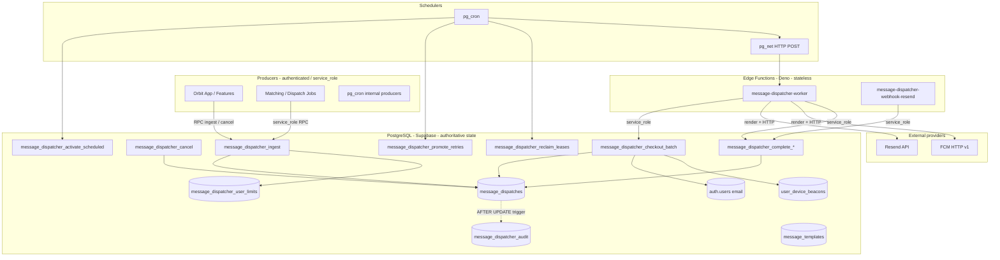
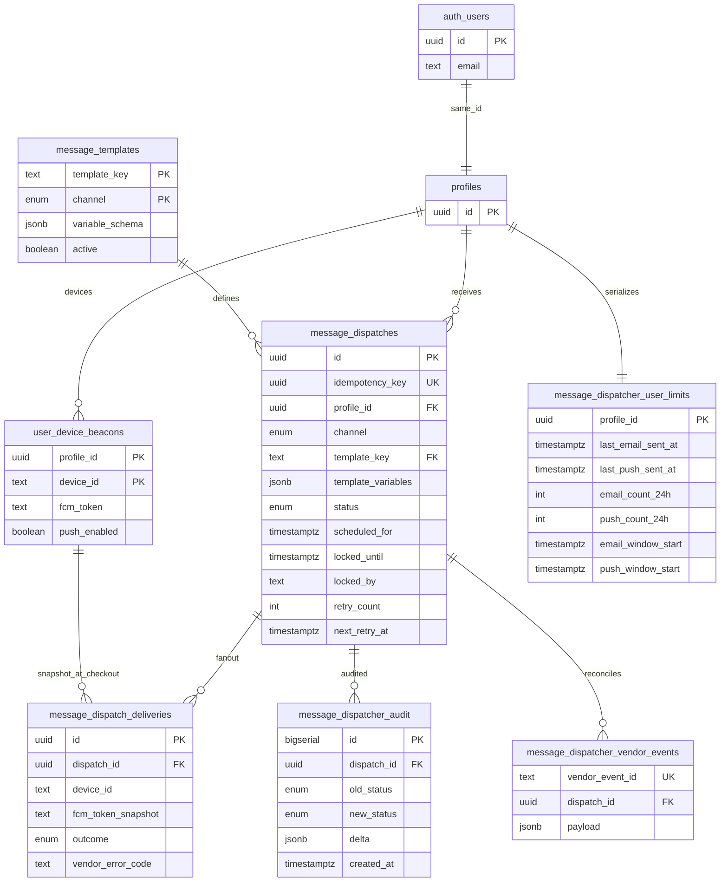
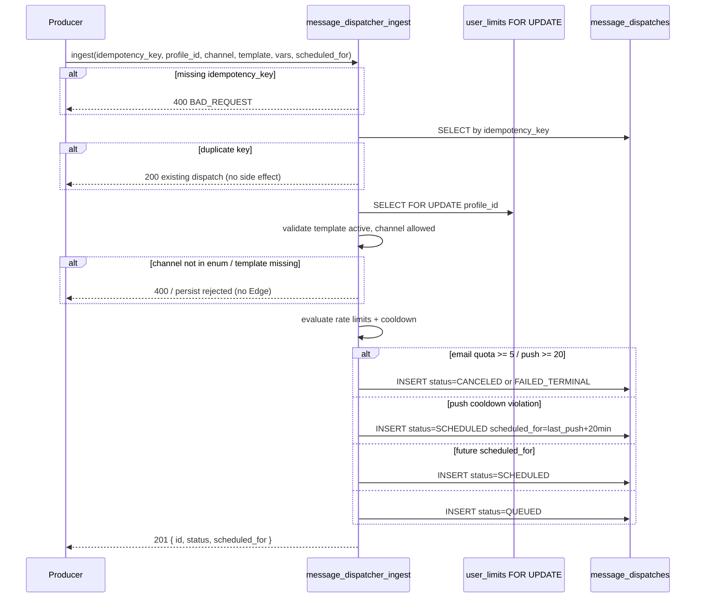
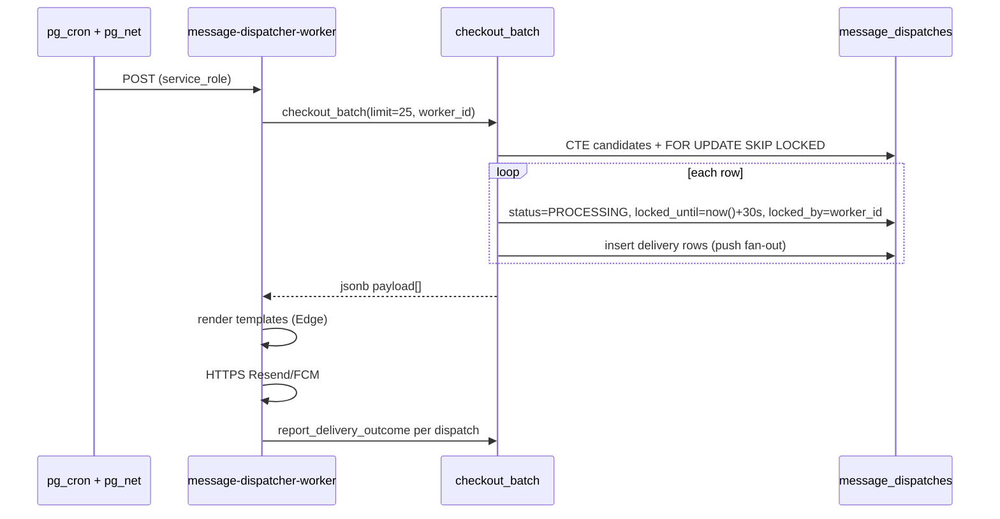
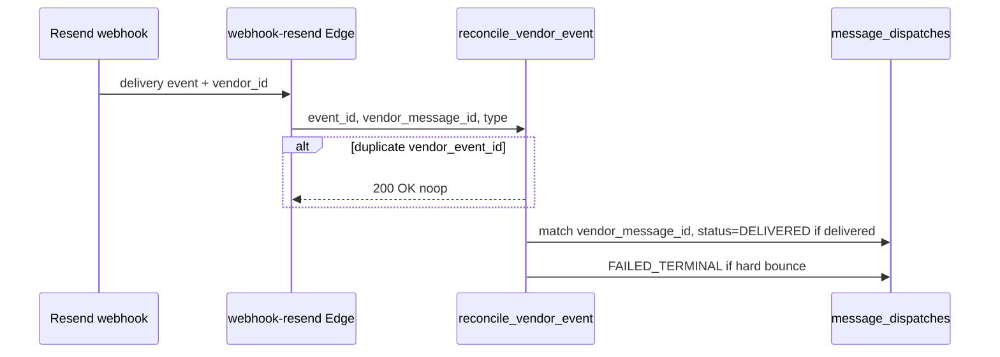
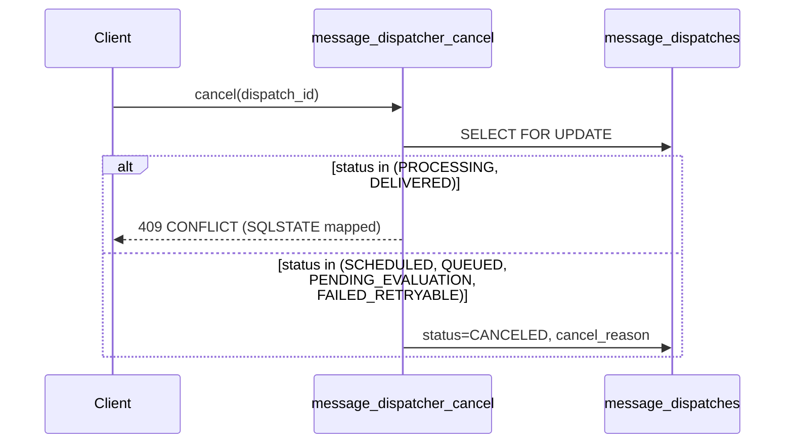
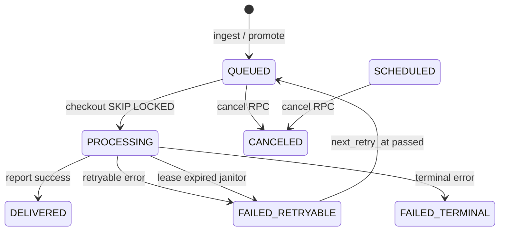

# Multichannel Message Dispatcher (MMD) — Design Document

**Covers:** Requirements 1–7 (Rate Limiting, Templates, Multi-Worker Orchestration, Scheduling/Cancellation, Idempotency, Observability, Failover/Backoff), Operational Architecture Constraints, Scalability Req. 4/7, Concurrency Req. 4–8, Infrastructure Constraints §6, dedicated schema `message_dispatcher`, delivery targets (`auth.users.email`, `public.user_device_beacons.fcm_token`).

**Status:** Implementation-ready architecture specification (HL + LL).  
**Stack:** Supabase PostgreSQL 15+, PL/pgSQL RPCs, `pg_cron`, `pg_net`, Deno Edge Functions, Resend, FCM.  
**Delivery model:** At-least-once processing with lease-bound at-most-once re-delivery; exactly-once *business effect* via idempotency keys and terminal state guards.

---

# 1. Overall Architecture and Component Relationships

## 1.1 Architectural thesis

MMD is a **database-centric transactional outbox** with an **explicit finite-state machine (FSM)** persisted in PostgreSQL. All atomic transitions, eligibility, rate limits, queue checkout, lease semantics, retry scheduling, and audit append occur inside **PL/pgSQL RPCs** under ACID transactions. Edge Functions are **stateless I/O adapters**: template rendering, HTTPS to Resend/FCM, HTTP status classification, and webhook ingress — they MUST NOT own workflow state.

This satisfies Infrastructure Constraints §1 (database-centric), Concurrency G1–G4, and Scalability Req. 4 (SKIP LOCKED + lease + janitor).

## 1.2 Runtime topology



## 1.3 Component inventory

| Component | Stateful? | Responsibility | Sync / Async |
|-----------|-------------|----------------|--------------|
| `message_dispatches` | Yes (FSM) | Canonical dispatch record + lease fields | Written synchronously in RPC txn |
| `message_dispatcher_user_limits` | Yes (counters) | Per-user/channel serialization anchor + cooldown timestamps | Locked `FOR UPDATE` during ingest |
| `message_dispatcher_audit` | Append-only | Immutable transition history | Trigger-synchronous with parent UPDATE |
| `message_templates` | Mostly immutable | Channel/template registry + JSON schema | Read in Edge after checkout payload |
| `message_dispatch_deliveries` | Yes (per target) | Per-device push outcomes (FCM fan-out) | Updated in same completion txn as parent when possible |
| PL/pgSQL RPCs | Stateless logic | All FSM transitions, queue ops, rate limits | Synchronous, transactional |
| `pg_cron` | Scheduler only | Activate scheduled, promote retries, reclaim leases, fire worker | Async tick |
| `pg_net` | Fire-and-forget HTTP | Invoke worker Edge with service JWT | Async |
| `message-dispatcher-worker` | Stateless | Checkout batch, compile templates, provider I/O, report RPC | Async worker invocation |
| `message-dispatcher-webhook-resend` | Stateless | Resend delivery/bounce events → reconcile RPC | Async webhook |
| Orbit client | Cache only | Optional cancel UI; never source of truth | Sync RPC to user-owned rows |

## 1.4 Communication model

| Path | Protocol | Auth | Idempotency |
|------|----------|------|-------------|
| Ingest | `POST /rest/v1/rpc/message_dispatcher_ingest` or Edge wrapper → RPC | `service_role` (internal) or `authenticated` + RLS-scoped insert policy | `idempotency_key` UNIQUE |
| Cancel | `POST /rest/v1/rpc/message_dispatcher_cancel` | `authenticated` (owner) or `service_role` | N/A (state guard) |
| Worker dequeue | RPC `message_dispatcher_checkout_batch` | `service_role` only | Batch lease per row |
| Worker result | RPC `message_dispatcher_report_delivery_outcome` | `service_role` only | `dispatch_id` + `attempt_no` UNIQUE on deliveries |
| Resend webhook | Edge → RPC `message_dispatcher_reconcile_vendor_event` | HMAC signature + `service_role` | `vendor_event_id` UNIQUE |

## 1.5 Transactional vs eventual boundaries

| Operation | Consistency | Notes |
|-----------|-------------|-------|
| Ingest + rate limit + FSM initial transition | **Strong (serializable intent via row lock)** | Single RPC transaction |
| `SCHEDULED` → `QUEUED` | **Strong** | Cron RPC batch |
| Checkout `QUEUED` → `PROCESSING` | **Strong** | `FOR UPDATE SKIP LOCKED` + lease |
| Edge HTTP to Resend/FCM | **Outside DB txn** | At-least-once provider semantics |
| `PROCESSING` → `DELIVERED` / `FAILED_*` | **Strong** | RPC after I/O; may lag provider reality → webhook reconciles |
| Audit row | **Strong** with parent UPDATE | Same transaction via trigger |
| Support dashboard queries on audit | **Read committed** | Index-backed; may lag milliseconds |

## 1.6 Orchestration model

Orchestration is **pull-based** over a Postgres queue, not push-based via external broker:

1. **Time-driven:** `pg_cron` advances `SCHEDULED`, `FAILED_RETRYABLE`, and expired `PROCESSING` rows.
2. **Work-driven:** `pg_cron` + `pg_net` invokes `message-dispatcher-worker` every **15s** (tunable; MUST stay ≥ 15s to avoid invocation storms per Scalability anti-patterns).
3. **Worker-driven:** Edge calls `message_dispatcher_checkout_batch(p_limit := 25)` (tunable ≤ 50 to respect Edge CPU budget).

No Edge Function polls the database in a loop; each invocation processes **one batch** and exits.

## 1.7 Scaling and fault isolation

| Dimension | Strategy |
|-----------|----------|
| Horizontal workers | N concurrent Edge invocations; correctness from `SKIP LOCKED`, not coordination |
| DB hot rows | Partial indexes per FSM status; avoid full table scan on queue |
| Audit growth | Monthly range partitions on `message_dispatcher_audit.created_at` (Phase: Growth) |
| Provider throttle | `FAILED_RETRYABLE` + exponential `next_retry_at`; global Edge rate limiter for abuse only |
| Blast radius | Worker failure only affects checked-out batch until lease expiry (30s default) |

## 1.8 Trade-offs (explicit)

| Decision | Benefit | Cost |
|----------|---------|------|
| Table queue vs Redis/SQS | Zero new infra; ACID with FSM | Polling + index tuning at very high QPS |
| PL/pgSQL FSM | Single round-trip; RLS proximity | Complex logic in SQL; requires migration discipline |
| Template render in Edge | Protects DB CPU (Infra §2) | Template injection surface → strict schema validation |
| Lease 30s | Fast orphan recovery | Slow provider calls need heartbeat extension RPC (optional Phase 2) |

---

# 2. Data Models and Relationships

## 2.0 Dedicated schema (`message_dispatcher`)

All **MMD-owned** tables, enums, triggers, and `SECURITY DEFINER` RPCs MUST live in the PostgreSQL schema **`message_dispatcher`**, not in `public`. This isolates the notification subsystem for grants, migrations, observability, and future extraction.

| Location | Contents |
|----------|----------|
| **`message_dispatcher`** | `message_dispatches`, `message_dispatch_deliveries`, `message_dispatcher_audit`, `message_dispatcher_user_limits`, `message_templates`, `message_dispatcher_vendor_events`, enums, FSM functions, cron-called RPCs |
| **`public`** | Platform domain tables consumed read-only by MMD (e.g. `profiles`, `user_device_beacons`) |
| **`auth`** | Supabase Auth (`auth.users`) — email recipient source |

**Cross-schema references:**

- `message_dispatcher.message_dispatches.profile_id` → `public.profiles (id)` (`profiles.id = auth.users.id`).
- Checkout reads `public.user_device_beacons` and `auth.users` inside RPCs with `SET search_path = message_dispatcher, public, auth`.

**API exposure:** Register schema `message_dispatcher` in Supabase API settings (or expose RPCs via thin `public` wrappers if PostgREST schema list is restricted). Client/features MUST call RPCs by name (`message_dispatcher_ingest`, etc.) with schema-qualified grants — never direct table writes from the app.

**Migrations:** First migration file MUST `CREATE SCHEMA IF NOT EXISTS message_dispatcher` and set default privileges for `service_role` / `postgres` only on MMD objects.

## 2.1 Entity-relationship model



## 2.2 Ownership semantics

| Entity | Owner | Mutable by |
|--------|-------|------------|
| `message_dispatches` | `profile_id` (recipient) | RPCs only (no direct client UPDATE on status) |
| `message_dispatcher_user_limits` | `profile_id` | Ingest RPC under `FOR UPDATE` |
| `message_dispatcher_audit` | System | Trigger only (no UPDATE/DELETE) |
| `message_dispatch_deliveries` | Parent dispatch | Worker completion RPC |
| `message_templates` | Platform ops | Migrations / admin RPC (future) |

## 2.3 Lifecycle semantics

**`message_dispatches`** is the **FSM authority** — status column is the only workflow field clients may observe (not mutate directly).

**`message_dispatcher_audit`** is **append-only** — captures every `status` change and material field deltas for Req. 6.

**`message_dispatch_deliveries`** is a **child state machine** for push fan-out (one row per `user_device_beacons` target at checkout time). Email channel uses zero or one logical delivery (Resend single recipient).

**`message_dispatcher_vendor_events`** is **idempotent ingress log** for webhooks (Req. 6, Concurrency Req. 7).

## 2.4 Mutable vs immutable

| Field / table | Mutable? | Rule |
|---------------|----------|------|
| `idempotency_key` | Immutable after insert | UNIQUE prevents replay |
| `template_variables` | Immutable after `QUEUED` | Prevents mid-flight tampering |
| `status` | Mutable via RPC only | CHECK + trigger validates transitions |
| `retry_count` | Increment only via failure RPC | Monotonic |
| Audit rows | Immutable | INSERT only |

## 2.5 Consistency semantics (summary)

- **Ingest:** Read Committed + `FOR UPDATE` on `message_dispatcher_user_limits` → serializes quota races (Req. 1 AC3).
- **Checkout:** Same transaction sets `PROCESSING` + `locked_until` → no other worker sees row in `QUEUED` (Req. 3).
- **Completion:** Parent + deliveries + audit in **one transaction** (Concurrency Req. 4).

## 2.6 Delivery targets (email and FCM)

Recipient addresses are **not** stored on `message_dispatches`. They are resolved at **checkout** (and snapshotted for push) from existing platform tables. Ingest only persists `profile_id`.

### Email (`channel = 'email'`)

| Source | Rule |
|--------|------|
| **Table** | `auth.users` |
| **Column** | `email` |
| **Join** | `auth.users.id = message_dispatches.profile_id` (same UUID as `public.profiles.id`) |

- Resolution runs inside `message_dispatcher_checkout_batch` (or a helper called from it) under `SECURITY DEFINER` with `search_path` including `auth`.
- The checkout payload returned to the Edge worker MUST include `recipient_email` (snapshot at checkout time).
- If `email` IS NULL or empty → do not call Resend; complete checkout txn with parent → `FAILED_TERMINAL`, `failure_code = 'no_email_on_file'`.
- Edge MUST send Resend `to:` using **only** `recipient_email` from the RPC payload — never a client-supplied address.

### Push (`channel = 'push'`)

| Source | Rule |
|--------|------|
| **Table** | `public.user_device_beacons` |
| **Column** | `fcm_token` (one row per installation) |
| **Join** | `user_device_beacons.profile_id = message_dispatches.profile_id` |

**Eligible rows at checkout** (all MUST hold):

```sql
select device_id, fcm_token
from public.user_device_beacons b
where b.profile_id = :profile_id
  and b.push_enabled = true
  and b.fcm_token is not null
  and trim(b.fcm_token) <> '';
```

- **Fan-out:** zero eligible devices → `FAILED_TERMINAL`, `failure_code = 'no_push_targets'` (no FCM call).
- **One row per device** in `message_dispatcher.message_dispatch_deliveries` with `fcm_token_snapshot` copied at checkout (immutable for retry dedup).
- Edge sends **one FCM HTTP request per delivery row**, using `fcm_token_snapshot` — not live beacon reads during I/O (token may change later; invalid token → terminal + beacon cleanup per §11.7).

### Responsibility split

| Step | Layer |
|------|--------|
| Resolve email / enumerate devices | PostgreSQL checkout RPC |
| Render template + HTTPS | Edge worker |
| Disable bad `fcm_token` | PostgreSQL completion RPC → `public.user_device_beacons` |

---

# 3. Table Schemas with Constraints

All definitions below are created inside schema **`message_dispatcher`** unless noted.

## 3.1 Enums

```sql
create schema if not exists message_dispatcher;

create type message_dispatcher.message_channel as enum ('email', 'push');

create type message_dispatcher.message_dispatch_status as enum (
  'PENDING_EVALUATION',
  'SCHEDULED',
  'CANCELED',
  'QUEUED',
  'PROCESSING',
  'DELIVERED',
  'FAILED_RETRYABLE',
  'FAILED_TERMINAL'
);

create type message_dispatcher.message_delivery_outcome as enum (
  'pending',
  'sent',
  'failed_retryable',
  'failed_terminal'
);
```

## 3.2 `message_templates`

```sql
create table message_dispatcher.message_templates (
  template_key text not null,
  channel message_dispatcher.message_channel not null,
  subject_template text,          -- push title / email subject
  body_template text not null,    -- push body / email html skeleton
  variable_schema jsonb not null default '{}'::jsonb,  -- JSON Schema subset
  active boolean not null default true,
  created_at timestamptz not null default now(),
  primary key (template_key, channel)
);

comment on table message_dispatcher.message_templates is
  'Registry of renderable templates; inactive or missing channel rejects at ingest.';
```

**Invariants:** Ingest MUST reject unknown `(template_key, channel)` pairs before Edge invocation (Req. 2 AC3 — e.g. `SMS`).

## 3.3 `message_dispatches`

```sql
create table message_dispatcher.message_dispatches (
  id uuid primary key default gen_random_uuid(),
  idempotency_key uuid not null,
  profile_id uuid not null references public.profiles (id) on delete cascade,
  channel message_dispatcher.message_channel not null,
  template_key text not null,
  template_variables jsonb not null default '{}'::jsonb,
  status message_dispatcher.message_dispatch_status not null default 'PENDING_EVALUATION',
  scheduled_for timestamptz not null default now(),
  locked_until timestamptz,
  locked_by text,
  retry_count integer not null default 0,
  max_retries integer not null default 3,
  next_retry_at timestamptz,
  cancel_reason text,
  failure_reason text,
  failure_code text,
  vendor_message_id text,
  correlation_id uuid not null default gen_random_uuid(),
  source_system text not null default 'orbit',
  metadata jsonb not null default '{}'::jsonb,
  created_at timestamptz not null default now(),
  updated_at timestamptz not null default now(),
  constraint message_dispatches_idempotency_key_unique unique (idempotency_key),
  constraint message_dispatches_retry_count_nonneg check (retry_count >= 0),
  constraint message_dispatches_max_retries_positive check (max_retries > 0),
  foreign key (template_key, channel)
    references message_dispatcher.message_templates (template_key, channel)
);

comment on column message_dispatcher.message_dispatches.locked_until is
  'Lease expiry; NULL when not in PROCESSING.';
comment on column message_dispatcher.message_dispatches.correlation_id is
  'Stable id for logs, FCM collapse_key, Resend idempotency header.';
```

### 3.3.1 FSM transition guard (trigger)

```sql
create or replace function message_dispatcher.message_dispatches_validate_transition()
returns trigger language plpgsql as $$
begin
  if tg_op = 'UPDATE' and old.status is distinct from new.status then
    if not message_dispatcher.message_dispatch_status_allowed(old.status, new.status) then
      raise exception 'invalid status transition: % -> %', old.status, new.status
        using errcode = 'P0001';
    end if;
  end if;
  return new;
end;
$$;
```

`message_dispatch_status_allowed()` is a **static transition matrix** in SQL (see §4.8).

### 3.3.2 Indexes (queue + support)

```sql
-- Worker polling: eligible QUEUED rows
create index message_dispatches_queued_poll_idx
  on message_dispatcher.message_dispatches (scheduled_for, created_at)
  where status = 'QUEUED';

-- Scheduler: due SCHEDULED
create index message_dispatches_scheduled_due_idx
  on message_dispatcher.message_dispatches (scheduled_for)
  where status = 'SCHEDULED';

-- Retry promoter
create index message_dispatches_retry_due_idx
  on message_dispatcher.message_dispatches (next_retry_at)
  where status = 'FAILED_RETRYABLE';

-- Janitor: stale PROCESSING
create index message_dispatches_stale_lease_idx
  on message_dispatcher.message_dispatches (locked_until)
  where status = 'PROCESSING';

-- Rate limit analytics / support
create index message_dispatches_profile_channel_created_idx
  on message_dispatcher.message_dispatches (profile_id, channel, created_at desc);

-- Idempotency already UNIQUE
```

**Duplicate prevention:** `idempotency_key` UNIQUE (Req. 5).  
**Stale checkout prevention:** partial index on `PROCESSING` + `locked_until` for janitor (Req. 3 AC3).

## 3.4 `message_dispatcher_user_limits`

Serialization anchor for Req. 1 — one row per profile (not per channel) to allow single lock for dual-channel ingest races.

```sql
create table message_dispatcher.message_dispatcher_user_limits (
  profile_id uuid primary key references public.profiles (id) on delete cascade,
  last_push_sent_at timestamptz,
  email_window_start timestamptz not null default now(),
  push_window_start timestamptz not null default now(),
  email_count_24h integer not null default 0,
  push_count_24h integer not null default 0
);
```

**Counter refresh:** On ingest, if `now() - window_start > 24h`, reset counter and window atomically in same txn.

**Quota counting (Req. 1 AC1):** For email evaluation, count rows in `message_dispatcher.message_dispatches` where `channel = 'email'` and `status in ('DELIVERED','QUEUED','PROCESSING','SCHEDULED')` and `created_at > now() - interval '24 hours'` and `coalesce(bypass_limits, false) = false` (same filter for push). **OR** use maintained counters incremented at ingest when entering those states — design uses **live COUNT** inside ingest txn after lock for correctness (counters are optimization cache only).

## 3.5 `message_dispatch_deliveries`

```sql
create table message_dispatcher.message_dispatch_deliveries (
  id uuid primary key default gen_random_uuid(),
  dispatch_id uuid not null references message_dispatcher.message_dispatches (id) on delete cascade,
  device_id text not null,
  fcm_token_snapshot text,
  outcome message_dispatcher.message_delivery_outcome not null default 'pending',
  vendor_error_code text,
  vendor_response jsonb,
  attempt_no integer not null default 1,
  created_at timestamptz not null default now(),
  updated_at timestamptz not null default now(),
  unique (dispatch_id, device_id, attempt_no)
);
```

Push checkout snapshots tokens from `public.user_device_beacons` (see §2.6) where `push_enabled = true` and `fcm_token is not null`.

## 3.6 `message_dispatcher_audit`

```sql
create table message_dispatcher.message_dispatcher_audit (
  id bigserial primary key,
  dispatch_id uuid not null references message_dispatcher.message_dispatches (id) on delete cascade,
  profile_id uuid not null,
  old_status message_dispatcher.message_dispatch_status,
  new_status message_dispatcher.message_dispatch_status not null,
  changed_by text not null default 'system',
  correlation_id uuid,
  delta jsonb not null default '{}'::jsonb,
  created_at timestamptz not null default now()
);

create index message_dispatcher_audit_dispatch_created_idx
  on message_dispatcher.message_dispatcher_audit (dispatch_id, created_at desc);

create index message_dispatcher_audit_profile_created_idx
  on message_dispatcher.message_dispatcher_audit (profile_id, created_at desc);
```

**Partitioning (Growth phase):** `PARTITION BY RANGE (created_at)` monthly; attach indexes per partition for Req. 6 AC3 (&lt;1s support queries).

### 3.6.1 Audit trigger

```sql
create or replace function message_dispatcher.message_dispatcher_audit_on_dispatch_update()
returns trigger language plpgsql security definer set search_path = message_dispatcher, public as $$
begin
  if tg_op = 'UPDATE' and (old.status is distinct from new.status
      or old.scheduled_for is distinct from new.scheduled_for
      or old.locked_until is distinct from new.locked_until) then
    insert into message_dispatcher.message_dispatcher_audit (
      dispatch_id, profile_id, old_status, new_status, correlation_id, delta, changed_by
    ) values (
      new.id,
      new.profile_id,
      old.status,
      new.status,
      new.correlation_id,
      jsonb_build_object(
        'scheduled_for', jsonb_build_object('old', old.scheduled_for, 'new', new.scheduled_for),
        'locked_until', jsonb_build_object('old', old.locked_until, 'new', new.locked_until),
        'retry_count', jsonb_build_object('old', old.retry_count, 'new', new.retry_count),
        'failure_code', new.failure_code,
        'metadata', new.metadata
      ),
      coalesce(current_setting('app.changed_by', true), 'system')
    );
  end if;
  return new;
end;
$$;
```

## 3.7 `message_dispatcher_vendor_events`

```sql
create table message_dispatcher.message_dispatcher_vendor_events (
  vendor_event_id text primary key,
  dispatch_id uuid references message_dispatcher.message_dispatches (id),
  vendor text not null check (vendor in ('resend', 'fcm')),
  event_type text not null,
  payload jsonb not null,
  processed_at timestamptz not null default now()
);
```

## 3.8 RLS

RLS applies to tables in schema **`message_dispatcher`**. `auth.users` and `public.user_device_beacons` keep their existing policies; MMD reads them only inside `SECURITY DEFINER` RPCs (never exposed to the client for dispatch I/O).

| Table (`message_dispatcher.*`) | Policy |
|--------------------------------|--------|
| `message_dispatches` | `SELECT` where `(select auth.uid()) = profile_id`; **no** direct INSERT/UPDATE for `authenticated` |
| `message_dispatcher_audit` | `SELECT` same scope |
| `message_dispatch_deliveries` | `SELECT` via join dispatch owner |
| `message_templates` | `SELECT` authenticated read-only |
| RPCs | `SECURITY DEFINER` with `search_path = message_dispatcher, public, auth`; ingest/checkout **service_role** only except `message_dispatcher_cancel` for owner |

---

# 4. Runtime Execution Flows

## 4.1 Ingestion & validation (Phase 1)



**Transaction boundary:** entire ingest is **one** `BEGIN … COMMIT`.  
**Race (Req. 1 AC3):** `FOR UPDATE` on `message_dispatcher_user_limits` forces sequential evaluation per profile.

## 4.2 Scheduled activation (Phase 3–4)

**Cron:** `message_dispatcher_activate_scheduled` every **60s**:

```sql
update message_dispatcher.message_dispatches d
set status = 'PENDING_EVALUATION', updated_at = now()
where d.status = 'SCHEDULED'
  and d.scheduled_for <= now();
```

Then call ingest evaluation subroutine **in same cron txn** for each activated row (or batch RPC `message_dispatcher_evaluate_pending`) transitioning to `QUEUED` or terminal — **MUST NOT** appear in worker poll while `SCHEDULED` and `scheduled_for > now()` (Req. 4 AC1).

## 4.3 Worker checkout (Phase 5)



**Checkout SQL core:**

```sql
with candidates as (
  select d.id
  from message_dispatcher.message_dispatches d
  where d.status = 'QUEUED'
    and d.scheduled_for <= now()
  order by d.scheduled_for, d.created_at
  for update skip locked
  limit p_limit
)
update message_dispatcher.message_dispatches d
set
  status = 'PROCESSING',
  locked_until = now() + interval '30 seconds',
  locked_by = p_worker_id,
  updated_at = now()
from candidates c
where d.id = c.id
returning d.*;
```

**Guarantee:** At-most-one worker owns a row while `locked_until > now()` and `status = PROCESSING`.

**Recipient resolution in the same checkout transaction** (after `PROCESSING` update, before `COMMIT`):

1. **`email`:** `SELECT u.email FROM auth.users u WHERE u.id = d.profile_id` → attach as `recipient_email` on the returned JSON item. On missing email → set dispatch `FAILED_TERMINAL`, skip Edge payload for that row.
2. **`push`:** `INSERT INTO message_dispatcher.message_dispatch_deliveries (dispatch_id, device_id, fcm_token_snapshot)` from eligible `public.user_device_beacons` rows (§2.6). On zero rows → `FAILED_TERMINAL` (`no_push_targets`).

The worker MUST NOT query `auth.users` or `user_device_beacons` directly; it only consumes the checkout RPC payload.

## 4.4 Delivery & compile (Phase 6)

| Channel | Edge steps | Provider idempotency |
|---------|------------|----------------------|
| `email` | Use `recipient_email` from checkout payload → validate vars → render HTML → Resend `to: recipient_email` | Header `Idempotency-Key: {correlation_id}` |
| `push` | For each `deliveries[]` entry, use `fcm_token_snapshot` → validate title/body → FCM HTTP v1 | `android.notification.tag` / `apns-collapse-id` = `chat_id` when present, else `correlation_id` |

**Timeout:** HTTP client timeout **25s** (below 30s lease; if exceeded, worker may die → janitor requeues).

**Optional lease extension (Phase 2):** if render+I/O expected &gt; 25s, call `message_dispatcher_extend_lease(dispatch_id, +30s)` mid-flight — not required for MVP.

## 4.5 Reconciliation (Phase 7)



## 4.6 Retry lifecycle (Phase 8)

**Classification (Edge → RPC):**

| HTTP / error class | RPC outcome | New status |
|--------------------|-------------|------------|
| 429, 502, 503, timeout | `report_failure(retryable=true)` | `FAILED_RETRYABLE` |
| 400 invalid token/email, 404 template | `retryable=false` | `FAILED_TERMINAL` |
| retry_count >= max_retries | force terminal | `FAILED_TERMINAL` |

**Backoff (Req. 7 AC1):**

```text
next_retry_at = now() + (power(2, retry_count) * interval '60 seconds')
```

After `next_retry_at`, cron `message_dispatcher_promote_retries`:

```sql
update message_dispatcher.message_dispatches
set status = 'QUEUED', locked_until = null, locked_by = null, updated_at = now()
where status = 'FAILED_RETRYABLE' and next_retry_at <= now();
```

## 4.7 Cancellation (Req. 4)



## 4.8 FSM transition matrix

| From \ To | PENDING | SCHEDULED | QUEUED | PROCESSING | DELIVERED | CANCELED | FAIL_RETR | FAIL_TERM |
|-----------|---------|-----------|--------|------------|-----------|----------|-----------|-----------|
| PENDING | - | ✓ | ✓ | - | - | ✓ | - | ✓ |
| SCHEDULED | - | - | ✓ | - | - | ✓ | - | ✓ |
| QUEUED | - | - | - | ✓ | - | ✓ | - | ✓ |
| PROCESSING | - | - | ✓* | - | ✓ | - | ✓ | ✓ |
| FAIL_RETR | - | - | ✓ | - | - | ✓ | - | ✓ |
| DELIVERED | - | - | - | - | - | - | - | - |
| CANCELED | - | - | - | - | - | - | - | - |
| FAIL_TERM | - | - | - | - | - | - | - | - |

\* `PROCESSING → QUEUED` only via **janitor** or explicit reclaim RPC, not worker success path.

## 4.9 Orphan recovery (janitor)

**Cron every 60s:** `message_dispatcher_reclaim_leases`:

```sql
update message_dispatcher.message_dispatches d
set
  status = case
    when d.retry_count >= d.max_retries then 'FAILED_TERMINAL'
    when d.retry_count < d.max_retries then 'FAILED_RETRYABLE'
  end,
  next_retry_at = case
    when d.retry_count < d.max_retries
      then now() + (power(2, d.retry_count) * interval '60 seconds')
    else null
  end,
  failure_code = coalesce(d.failure_code, 'lease_expired'),
  locked_until = null,
  locked_by = null,
  updated_at = now()
where d.status = 'PROCESSING'
  and d.locked_until < now();
```

Then `promote_retries` moves eligible `FAILED_RETRYABLE` → `QUEUED`.

**At-most-once discard:** If business later requires dropping after N orphan recoveries, increment `metadata->>'orphan_recoveries'` and terminal after threshold — **not** in MVP unless product asks.

## 4.10 Race condition catalog

| Race | Mitigation |
|------|------------|
| Double ingest same idempotency | `UNIQUE`; second call returns existing row |
| Two workers same message | `SKIP LOCKED` + status guard on completion RPC |
| Quota overrun parallel ingest | `FOR UPDATE` on `user_limits` |
| Cancel vs checkout | `FOR UPDATE` on cancel; checkout only `QUEUED` |
| Webhook vs worker DELIVERED | Completion RPC `WHERE status IN ('PROCESSING','DELIVERED')` idempotent upgrade |
| Stale worker completes after reclaim | Completion RPC checks `locked_by` OR `status=PROCESSING`; else no-op |

---

# 5. APIs, RPCs and Contracts

## 5.1 Public RPC: `message_dispatcher_ingest`

**Caller:** `service_role` (internal features, matching) or authenticated via thin Edge wrapper.  
**Auth:** Producers MUST NOT bypass rate limits.

```json
{
  "p_idempotency_key": "uuid",
  "p_profile_id": "uuid",
  "p_channel": "email | push",
  "p_template_key": "welcome_template",
  "p_template_variables": { "name": "Higor", "coupon": "RENOVI2026" },
  "p_scheduled_for": "2026-05-22T10:00:00Z",
  "p_source_system": "matching",
  "p_metadata": {}
}
```

**Returns:**

```json
{
  "dispatch_id": "uuid",
  "status": "QUEUED",
  "scheduled_for": "2026-05-22T10:00:00Z",
  "duplicate": false
}
```

| Condition | HTTP mapping (PostgREST) | Behavior |
|-----------|--------------------------|----------|
| Missing `p_idempotency_key` | 400 | No row inserted (Req. 5 AC2) |
| Duplicate idempotency | 200 | `{ duplicate: true, …existing }` (Req. 5 AC1) |
| Unknown template/channel | 400 | Rejection at evaluation (Req. 2 AC3) |
| Quota exceeded | 200/201 with `CANCELED` or `FAILED_TERMINAL` | Logged in `metadata.rate_limit` (Req. 1 AC1) |

## 5.2 Public RPC: `message_dispatcher_cancel`

**Caller:** `authenticated` where `auth.uid() = profile_id` OR `service_role`.

```json
{ "p_dispatch_id": "uuid", "p_reason": "user_opt_out" }
```

| Condition | Response |
|-----------|----------|
| `PROCESSING` / `DELIVERED` | 409 CONFLICT (Req. 4 AC3) |
| Cancelable states | 200 `{ status: "CANCELED" }` |

## 5.3 Service RPC: `message_dispatcher_checkout_batch`

```json
{
  "p_limit": 25,
  "p_worker_id": "edge-instance-uuid"
}
```

**Returns:** array of dispatch DTOs. Each item includes dispatch fields plus channel-specific targets resolved at checkout (§2.6):

```json
{
  "id": "uuid",
  "profile_id": "uuid",
  "channel": "email",
  "template_key": "welcome_template",
  "template_variables": { "name": "Higor" },
  "correlation_id": "uuid",
  "recipient_email": "user@example.com",
  "deliveries": []
}
```

```json
{
  "id": "uuid",
  "channel": "push",
  "correlation_id": "uuid",
  "recipient_email": null,
  "deliveries": [
    {
      "delivery_id": "uuid",
      "device_id": "capacitor-device-id",
      "fcm_token_snapshot": "fcm-registration-token"
    }
  ]
}
```

**Idempotency:** Re-invocation with same worker before lease expiry returns **empty batch** for already locked rows.

## 5.4 Service RPC: `message_dispatcher_report_delivery_outcome`

```json
{
  "p_dispatch_id": "uuid",
  "p_worker_id": "text",
  "p_channel": "email",
  "p_success": true,
  "p_vendor_message_id": "re_abc",
  "p_http_status": 200,
  "p_error_code": null,
  "p_error_body": null,
  "p_deliveries": [
    { "delivery_id": "uuid", "outcome": "sent", "vendor_error_code": null }
  ]
}
```

**Guards:**

- `WHERE id = p_dispatch_id AND status = 'PROCESSING' AND (locked_by = p_worker_id OR locked_until > now())`
- On success → `DELIVERED`, set `vendor_message_id`
- On retryable → `FAILED_RETRYABLE`, increment `retry_count`, set `next_retry_at`
- On terminal → `FAILED_TERMINAL`, persist `failure_reason`

## 5.5 Edge Function: `message-dispatcher-worker`

| Property | Value |
|----------|-------|
| `verify_jwt` | `false` (internal); validate `X-Dispatcher-Secret` or service role bearer from `pg_net` |
| Rate limit | `checkRateLimit` 120/min per deployment key (abuse only) |
| Batch size | Default 25, max 50 |
| Wall clock budget | &lt; 120s total; prefer &lt; 60s |

**Pseudo flow:**

1. Authenticate service role.
2. `checkout_batch`.
3. For each item: render → send → `report_delivery_outcome` (sequential per item to bound CPU; parallelize only if profiling allows).
4. Return `{ processed: n, succeeded: m, failed: k }`.

## 5.6 Edge Function: `message-dispatcher-webhook-resend`

| Property | Value |
|----------|-------|
| Auth | Resend signing secret |
| Body | Resend event payload |
| Action | `reconcile_vendor_event` |

## 5.7 REST surface (PostgREST)

| Endpoint | Method | Maps to |
|----------|--------|---------|
| `/rest/v1/rpc/message_dispatcher_ingest` | POST | Ingest |
| `/rest/v1/rpc/message_dispatcher_cancel` | POST | Cancel |
| `/rest/v1/message_dispatches?id=eq.{uuid}` | GET | User read own (RLS) |
| `/rest/v1/message_dispatcher_audit?dispatch_id=eq.{uuid}` | GET | Support read |

## 5.8 Event contracts (internal)

No external event bus in MVP. **Future:** `pg_notify` on `dispatch_status_changed` for realtime admin — MAY be added without changing FSM.

## 5.9 Dedupe semantics summary

| Layer | Key | Effect |
|-------|-----|--------|
| Ingest | `idempotency_key` | No second dispatch row |
| Resend | `correlation_id` header | Provider-side dedup |
| FCM | collapse key / tag | Collapse duplicate visible notifications |
| Webhook | `vendor_event_id` | No double audit/DELIVERED |
| Worker retry | `dispatch_id` + terminal status | Completion RPC no-op |

---

# 6. Scheduling and Distributed Coordination

## 6.1 Scheduling model

| Mechanism | Responsibility |
|-----------|----------------|
| `scheduled_for` column | Absolute fire time (Req. 4) |
| `message_dispatcher_activate_scheduled` | Moves due `SCHEDULED` → evaluation → `QUEUED` |
| `next_retry_at` | Retry scheduling for `FAILED_RETRYABLE` |
| `pg_cron` | Time wheel at 60s granularity (MVP) |

**Push cooldown (Req. 1 AC2):** On ingest, if `channel = push` and `now() < last_push_sent_at + 20 minutes`, set `scheduled_for = last_push_sent_at + 20 minutes` and `status = SCHEDULED` (not reject).

## 6.2 Worker coordination



## 6.3 Lease lifecycle

| Event | `locked_until` | `locked_by` |
|-------|----------------|-------------|
| Checkout | `now()+30s` | `worker_id` |
| Successful report | `NULL` | `NULL` |
| Failure report | `NULL` | `NULL` |
| Janitor reclaim | `NULL` | `NULL` |

**Heartbeat:** Not required MVP; lease duration MUST exceed p95 Edge I/O (Req. 3).

## 6.4 `pg_cron` schedule (reference)

| Job | Cron | RPC / action |
|-----|------|----------------|
| `mmd_activate_scheduled` | `* * * * *` | `message_dispatcher_activate_scheduled()` |
| `mmd_promote_retries` | `* * * * *` | `message_dispatcher_promote_retries()` |
| `mmd_reclaim_leases` | `* * * * *` | `message_dispatcher_reclaim_leases()` |
| `mmd_invoke_worker` | `*/1 * * * *` | `pg_net` POST to worker URL |
| `purge_stale_user_device_beacons` | existing | unrelated but supplies valid FCM targets |

## 6.5 Double-processing prevention

1. **Checkout:** `SKIP LOCKED` — physical row exclusion.  
2. **Completion:** status guard — logical exclusion.  
3. **Provider:** idempotency keys — external dedup (Req. 5 AC3).  
4. **Notification content:** `correlation_id` stable across retries.

## 6.6 Zombie execution prevention

Orphan `PROCESSING` → `FAILED_RETRYABLE` or `QUEUED` via janitor within **60s** of lease expiry worst-case (cron granularity + 30s lease).

---

# 7. Concurrency Control and Transaction Semantics

## 7.1 Isolation

Default **Read Committed** (Postgres). All FSM transitions use **single-statement transactions** in RPCs (`BEGIN` implicit in function) or explicit subtransactions only when calling nested helpers.

## 7.2 Locking matrix

| Operation | Mechanism | Why |
|-----------|-----------|-----|
| Ingest quota | `SELECT … FOR UPDATE` on `message_dispatcher_user_limits` | Req. 1 AC3 serialization |
| Checkout | `FOR UPDATE SKIP LOCKED` | Req. 3 multi-worker |
| Cancel | `FOR UPDATE` on dispatch row | Prevent cancel/checkout race |
| Promote scheduled | `FOR UPDATE SKIP LOCKED` batch | Avoid double activation |
| Template registry | No lock (read committed) | Rare writes |

**Advisory locks:** NOT used in MVP — row locks sufficient; avoids global serialization.

## 7.3 Optimistic vs pessimistic

| Pattern | Use |
|---------|-----|
| Pessimistic | Queue checkout, ingest quotas, cancel |
| Optimistic (CAS) | `UPDATE … WHERE status = expected` on completion | 

## 7.4 Exactly-once simulation

| Stage | Guarantee |
|-------|-----------|
| Business dispatch creation | Exactly-once per `idempotency_key` |
| Worker processing | At-least-once; lease limits duplicate concurrent |
| Provider send | At-least-once; dedup keys |
| User-visible notification | At-most-once ideal; at-least-once acceptable for engagement pushes with collapse key |

## 7.5 Deadlock prevention

Lock ordering: always acquire `user_limits` before inserting `message_dispatches`; never lock dispatches then limits. Cron jobs lock rows in `ORDER BY id` only.

## 7.6 Retry-safe operations

| Operation | Safe? |
|-----------|-------|
| `ingest` duplicate key | Yes — returns existing |
| `checkout` | Yes — SKIP LOCKED skips locked |
| `report_outcome` on terminal | Yes — no-op |
| Resend POST retry | Yes — same idempotency header |

---

# 8. Failure Handling and Recovery Semantics

## 8.1 Failure matrix

| Failure class | Detection | DB transition | Recovery |
|---------------|-----------|---------------|----------|
| Edge timeout mid-batch | Lease expiry | `FAILED_RETRYABLE` or re-`QUEUED` via janitor | Automatic |
| Resend 429/503 | HTTP status | `FAILED_RETRYABLE` + backoff | `promote_retries` |
| FCM invalid token | 400 + error code | `FAILED_TERMINAL` + deactivate beacon | Manual token refresh on client |
| Email hard bounce | Webhook | `FAILED_TERMINAL` | Support |
| DB unavailable on ingest | RPC error | None | Client retry with **same** idempotency key |
| pg_net worker invoke fail | Cron logs | Rows stay `QUEUED` | Next cron tick |
| Duplicate webhook | UNIQUE violation | No-op 200 | — |

## 8.2 Retry matrix

| retry_count | next_retry_at offset | Action after max |
|-------------|----------------------|------------------|
| 0 | 60s | — |
| 1 | 120s | — |
| 2 | 240s | — |
| 3 | — | `FAILED_TERMINAL` (Req. 7 AC3, max_retries=3) |

## 8.3 Poison messages

Persistent `FAILED_TERMINAL` with `failure_code` in (`invalid_token`, `template_render_error`, `hard_bounce`) — **no auto requeue**. Ops MAY add admin RPC `message_dispatcher_force_requeue` (out of scope MVP).

## 8.4 Partial failure (push fan-out)

If 3 devices: 2 succeed, 1 invalid token:

- Mark per-delivery `failed_terminal` for bad token; deactivate beacon via RPC `user_device_beacons_disable_push(device_id)`.
- Parent dispatch → `DELIVERED` if **any** success (product: notification reached user); metadata records partial failures.

Alternative (stricter): parent `DELIVERED` only if all succeed — **SHOULD** use partial success model for engagement.

## 8.5 Recovery workflows (operations)

1. **Stuck PROCESSING:** verify `locked_until`; wait janitor; if needed manual `reclaim_leases()`.
2. **Mass 503 from Resend:** expect `FAILED_RETRYABLE` backlog; monitor `next_retry_at` depth; temporarily increase cron promote frequency (ops).
3. **Audit gap:** if trigger disabled — halt workers; fix forward only (append correction row via migration, not UPDATE audit).

---

# 9. Scalability and Performance Strategy

## 9.1 Throughput model (Growth phase targets)

| Parameter | MVP | Growth |
|-----------|-----|--------|
| Ingest RPS | 50 sustained | 200 with connection pooler |
| Worker batches/min | 4 invocations × 25 = 100 msgs/min | Scale cron to 15s + multiple net calls |
| Audit writes | 1:1 with transitions | Partition monthly |

## 9.2 Bottlenecks

| Bottleneck | Mitigation |
|------------|------------|
| Hot `QUEUED` index | Partial index + `ORDER BY scheduled_for, created_at` |
| `user_limits` row lock | Short txn; only ingest |
| Edge CPU template render | Precompiled templates; limit variable size 8KB |
| Connection count | Supabase pooler; batch RPCs |
| FCM fan-out | Cap devices per dispatch at 10 (configurable) |

## 9.3 Polling strategy

Workers **do not poll** — cron pushes work. DB **internal** polling via `checkout` is index-only, `LIMIT` bounded.

## 9.4 Batching

- Checkout `p_limit` 25 default.  
- Cron activates scheduled in batches of 500 with `SKIP LOCKED`.

## 9.5 Backpressure

| Signal | Action |
|--------|--------|
| `FAILED_RETRYABLE` depth &gt; 10k | Alert; slow ingest for non-critical `source_system` |
| Edge 429 from platform | Reduce `mmd_invoke_worker` frequency |
| DB statement timeout | Lower batch size |

## 9.6 Caching

**No cache** of dispatch state in Edge (Req. Operational Architecture — stateless). Template registry MAY use in-memory cache per invocation only (read once per cold start).

## 9.7 Geo-distribution

Single-region Supabase (Brazil). FCM/Resend are global; latency accepted. No multi-master.

---

# 10. Observability and Auditability

## 10.1 Correlation

| ID | Scope |
|----|-------|
| `correlation_id` | End-to-end per dispatch (logs, Sentry, Resend) |
| `dispatch_id` | DB primary key |
| `idempotency_key` | Producer replay |
| `locked_by` | Worker instance |

Edge/worker logs MUST use structured `logger` with `{ correlation_id, dispatch_id, profile_id, channel, status }`.

## 10.2 Metrics (recommended)

| Metric | Type |
|--------|------|
| `mmd_ingest_total` | counter by channel, status |
| `mmd_checkout_latency_ms` | histogram |
| `mmd_delivery_success_total` | counter by channel |
| `mmd_retryable_failures` | counter |
| `mmd_lease_reclaims` | counter |
| `mmd_queue_depth` | gauge by status |

Implement via Supabase Logflare / external collector scraping cron stats table `message_dispatcher_stats` (optional materialized view).

## 10.3 Tracing

Sentry spans on Edge: `checkout`, `render`, `provider_http`, `report_outcome`.

## 10.4 Audit queries (Req. 6)

Support dashboard RPC `message_dispatcher_audit_timeline(p_dispatch_id)` returning ordered audit rows — index `dispatch_id, created_at desc` guarantees sub-second for single dispatch; profile+date uses `message_dispatcher_audit_profile_created_idx`.

## 10.5 Alerting

| Alert | Condition |
|-------|-----------|
| Queue lag | `count(*) where status=QUEUED and scheduled_for < now()-5m` &gt; 1000 |
| Terminal spike | `FAILED_TERMINAL` rate &gt; 5% of ingest over 15m |
| Janitor churn | `lease_expired` &gt; 100/min |

## 10.6 Dead-letter visibility

`FAILED_TERMINAL` rows ARE the dead-letter store (`failure_reason`, `failure_code`). No separate topic. Ops filter: `where status = 'FAILED_TERMINAL' and created_at > now()-1d`.

---

# 11. Security and Operational Safety

## 11.1 Authorization

| Action | Principal |
|--------|-----------|
| Ingest | `service_role` or trusted Edge on behalf of system |
| Cancel own | `authenticated` + `profile_id` match |
| Checkout / report | `service_role` only |
| Read dispatch/audit | Owner via RLS |
| Webhook | Signature-verified Edge |

## 11.2 RLS

Enabled on all user-visible tables. Initplan pattern: `(select auth.uid()) = profile_id`.

## 11.3 Replay protection

- Ingest: `idempotency_key` UNIQUE.  
- Webhook: `vendor_event_id` UNIQUE.  
- Worker: validate `locked_by`.

## 11.4 Abuse prevention

| Layer | Control |
|-------|---------|
| Product | Rate limits Req. 1 |
| Platform | `platform_rate_limits` on worker Edge (60s window) |
| Payload | `template_variables` max 8KB; schema validation |
| Channel | Enum rejects SMS at DB (Req. 2) |

## 11.5 Anti-corruption

Producers pass `template_key` + variables, not raw HTML. Edge renders only registered templates — prevents HTML injection from producer JSON.

## 11.6 Secrets

`RESEND_API_KEY`, `FCM_SERVICE_ACCOUNT`, `DISPATCHER_CRON_SECRET` — Edge env only. Never in client bundle.

## 11.7 FCM bad token hygiene (Scalability Req. 7)

On terminal token error, RPC:

```sql
update user_device_beacons
set push_enabled = false, fcm_token = null, updated_at = now()
where profile_id = $1 and device_id = $2;
```

---

# 12. Requirement-to-Implementation Mapping

| Requirement | Acceptance Criteria | Implementation Section | Mechanism |
|-------------|---------------------|------------------------|-----------|
| **Req. 1** Rate limiting | Email ≥5 in 24h → cancel/terminal | §4.1, §3.4, §7.2 | `message_dispatcher_ingest` counts `DELIVERED,QUEUED,PROCESSING,SCHEDULED` + `FOR UPDATE` on `user_limits` |
| **Req. 1** | Push cooldown 20min → reschedule | §6.1, §4.1 | `last_push_sent_at`; `SCHEDULED` with `scheduled_for = last+20m` |
| **Req. 1** | Concurrent quota 1 slot | §7.2 | `FOR UPDATE user_limits` serializes ingest |
| **Req. 2** Templates | Email render in Edge | §4.4, §5.6 | `message-dispatcher-worker` + `message_templates` |
| **Req. 2** | Push title/body validated | §4.4, §5.1 | JSON Schema on variables before FCM contract |
| **Req. 2** | Unknown channel SMS rejected | §3.2, §5.1 | `message_channel` enum + template FK |
| **Req. 3** Multi-worker | 5 workers unique checkout | §4.3, §6.5 | `FOR UPDATE SKIP LOCKED` |
| **Req. 3** | Lease atomic on checkout | §6.3, §3.3 | Same txn sets `PROCESSING`,`locked_until` |
| **Req. 3** | OOM → lease reclaim | §4.9, §6.6 | `message_dispatcher_reclaim_leases` cron |
| **Req. 4** Scheduling | Future `scheduled_for` → SCHEDULED | §4.2, §6.1 | Ingest + partial index excludes from poll |
| **Req. 4** | Cancel SCHEDULED → CANCELED + audit | §4.7, §3.6 | `message_dispatcher_cancel` + audit trigger |
| **Req. 4** | Cancel PROCESSING/DELIVERED → 409 | §4.7, §5.2 | FSM guard + exception mapping |
| **Req. 5** Idempotency | Duplicate key no side effect | §5.1, §3.3 | `UNIQUE(idempotency_key)` + return existing |
| **Req. 5** | Missing key → 400 | §5.1 | RPC validates NOT NULL |
| **Req. 5** | Worker retry uses stable id | §5.4, §5.9 | `correlation_id` in Resend/FCM |
| **Req. 6** Observability | State change → audit | §3.6, §10 | `AFTER UPDATE` trigger → `message_dispatcher_audit` |
| **Req. 6** | Resend webhook → DELIVERED | §4.5, §5.6 | `message_dispatcher_reconcile_vendor_event` |
| **Req. 6** | Audit query &lt;1s at scale | §9, §3.6 | Composite indexes + partitioning |
| **Req. 7** Failover | 429/503 → FAILED_RETRYABLE | §4.6, §8.2 | Edge classifies → `report_delivery_outcome` |
| **Req. 7** | 400 bad token → terminal | §8.1, §11.7 | Terminal + beacon disable |
| **Req. 7** | max_retries exceeded → terminal | §4.6, §8.2 | `retry_count >= max_retries` in report RPC |
| **Delivery targets** | Email to user / push to devices | §2.6, §4.3–4.4, §5.3 | `auth.users.email`; `public.user_device_beacons` → checkout payload |
| **Schema isolation** | MMD tables separate from `public` | §2.0, §3 | Schema `message_dispatcher` for all dispatcher-owned objects |

---

# 13. Implementation Guidance

## 13.1 Migration delivery order

1. `20260621100000_create_message_dispatcher_schema_enums_tables.sql` — `CREATE SCHEMA message_dispatcher`, enums, all MMD tables (§3), grants  
2. `20260621100100_create_message_dispatcher_fsm_functions.sql` — RPCs with `search_path = message_dispatcher, public, auth` (reads `auth.users.email`, `public.user_device_beacons`)  
3. `20260621100200_create_message_dispatcher_audit_triggers.sql`  
4. `20260621100300_create_message_dispatcher_cron_jobs.sql`  
5. Edge functions + `supabase/config.toml` entries  
6. Seed `message_templates` for MVP notifications  
7. `yarn generate-supabase-types`

## 13.2 O que deve ficar no PostgreSQL

| Responsabilidade | Motivo |
|------------------|--------|
| FSM transitions + guards | ACID; single source of truth (Infra §1) |
| Queue checkout `SKIP LOCKED` | Multi-worker exclusivity (Req. 3) |
| Rate limits + cooldown | Serializable quota (Req. 1, Concurrency G6) |
| Lease janitor + retry promotion | Orphan recovery without Edge state (Req. 3 AC3) |
| Audit append | Transactional with state change (Req. 6) |
| Idempotency UNIQUE | Ingest dedup (Req. 5) |
| Webhook dedup UNIQUE | At-least-once webhook (Concurrency Req. 7) |
| `pg_cron` scheduling | No external orchestrator (Infra §11) |
| Scheduled activation | Time-based eligibility (Req. 4) |
| Push device snapshot at checkout | Read `public.user_device_beacons.fcm_token`; insert `message_dispatch_deliveries` |
| Email recipient at checkout | Read `auth.users.email` by `profile_id`; pass `recipient_email` to Edge |

## 13.3 O que deve ficar em Edge Functions

| Responsabilidade | Motivo |
|------------------|--------|
| Resend / FCM HTTPS | Secrets + I/O (Infra §4) |
| Template rendering | CPU-bound; protect DB (Req. 2, Infra CPU limit) |
| HTTP status → retryable/terminal | Classification before RPC (Req. 7) |
| Resend webhook ingress | Signature validation + public URL |
| Soft rate limit (abuse) | `platform_rate_limits` — not product quotas |

## 13.4 O que deve ficar em Workers / invocação

| Responsabilidade | Motivo |
|------------------|--------|
| Batch pull via `pg_net` | Horizontal scale; short invocations |
| No long-running loop | Wall-clock / CPU limits (Infra §2) |

Worker == Edge function `message-dispatcher-worker` invoked by cron — **no separate Node worker** (Infra §11).

## 13.5 O que deve ficar em Filas / Event Bus

| Responsabilidade | Motivo |
|------------------|--------|
| `message_dispatches` WHERE `status=QUEUED` | Table-as-queue pattern (Scalability Req. 4) |
| N/A Redis/SQS | Explicitly out of scope (Infra §11) |

## 13.6 O que deve ficar no Frontend

| Responsabilidade | Motivo |
|------------------|--------|
| Generate `idempotency_key` UUID v4/v7 | Req. 5 client responsibility |
| Cancel UI → `message_dispatcher_cancel` | Req. 4 user intent |
| Read-only status / audit for support tools | Req. 6 dashboards |
| FCM token registration | Existing `public.user_device_beacons` sync (Capacitor / web); dispatcher only reads at checkout |

## 13.7 O que deve ficar em Cache

| Item | Rule |
|------|------|
| Dispatch state | **Never** cached client-side as authority |
| TanStack Query | MAY cache read-only dispatch status with `staleTime` 30s for UI |
| Template bodies | Edge per-invocation memory only |

## 13.8 Transacional vs assíncrono (checklist)

| Must be transactional | May be async/eventual |
|-----------------------|----------------------|
| Ingest + rate limit | Provider HTTP |
| Checkout lease | Webhook DELIVERED confirmation |
| Status + audit | Support dashboard refresh |
| Cancel | Push partial device failures display |
| Retry promotion | |

## 13.9 Append-only / immutable

| Artifact | Policy |
|----------|--------|
| `message_dispatcher_audit` | Append-only |
| `message_dispatcher_vendor_events` | Insert-only |
| `idempotency_key`, `correlation_id` | Immutable |
| Terminal `FAILED_TERMINAL` | No auto mutation |

---

# Appendix A: RPC catalog (service_role unless noted)

| Function | Purpose |
|----------|---------|
| `message_dispatcher_ingest` | Ingest + evaluate + insert |
| `message_dispatcher_cancel` | User/system cancel (authenticated) |
| `message_dispatcher_activate_scheduled` | Cron: due scheduled → evaluate |
| `message_dispatcher_promote_retries` | Cron: retry → queued |
| `message_dispatcher_reclaim_leases` | Cron: orphan processing |
| `message_dispatcher_checkout_batch` | Worker dequeue |
| `message_dispatcher_report_delivery_outcome` | Worker completion |
| `message_dispatcher_reconcile_vendor_event` | Webhook dedup |
| `message_dispatcher_audit_timeline` | Support read |

---

# Appendix B: Configuration defaults

```yaml
# platform_constants or env
mmd:
  email_daily_limit: 5
  push_daily_limit: 20
  push_cooldown_minutes: 20
  lease_seconds: 30
  max_retries: 3
  checkout_batch_size: 25
  backoff_base_seconds: 60
```

Store in `platform_constants` table (existing pattern) keys: `message_dispatcher.email_daily_limit`, etc.

---

# Appendix C: References

| Document | Path |
|----------|------|
| Requirements | `docs/message-dispatcher/requirements.md` |
| Infrastructure | `docs/infrastructure-constraints.md` |
| Scalability | `docs/scalability-requirements.md` |
| Concurrency | `docs/concurrency-requirements.md` |
| Technical stack | `docs/technical-stack.md` |
| Device tokens | `supabase/migrations/20260520100000_create_user_device_beacons.sql` |
| Edge rate limiter | `supabase/functions/_shared/rateLimiter.ts` |

---

**Document version:** 1.0.0  
**Last updated:** 2026-05-21  
**Authors:** Architecture (Staff review draft)  
**Next step:** Engineering review → migration PR → Edge worker PR → observability dashboard
