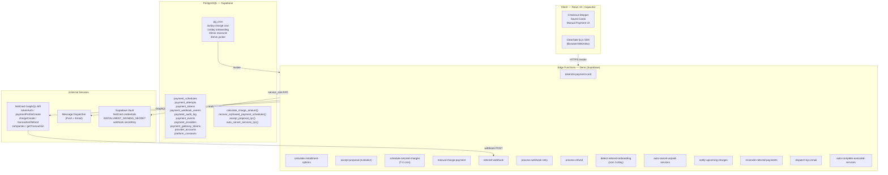
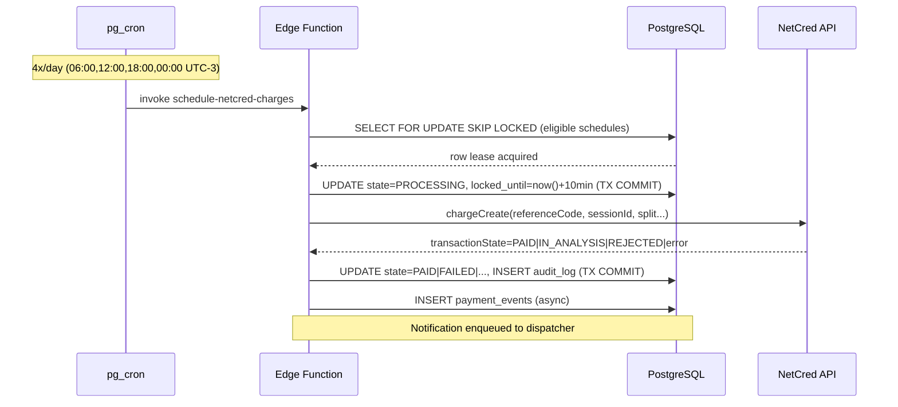
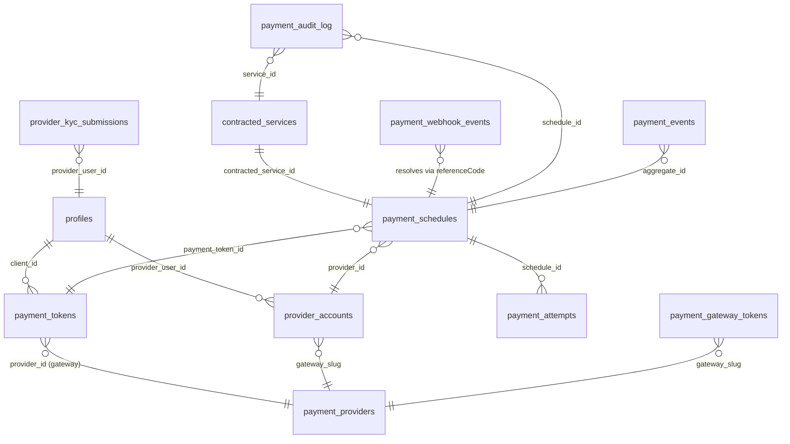
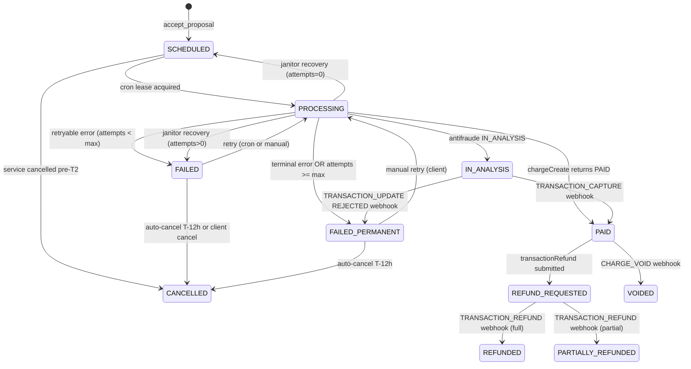
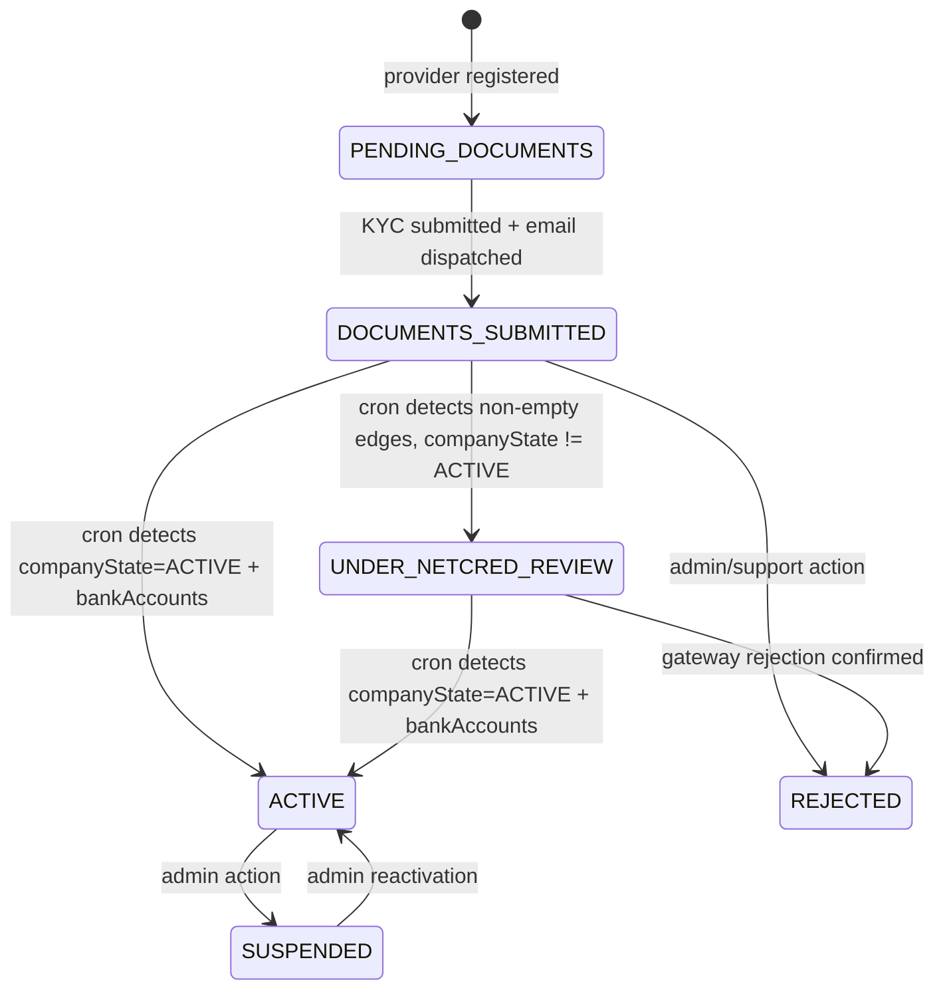
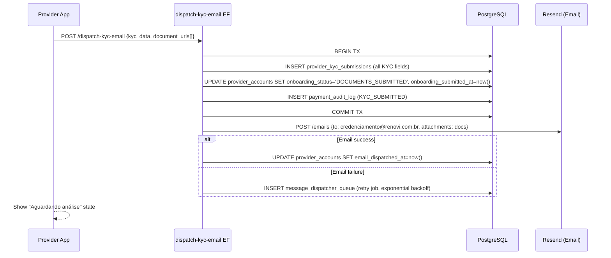
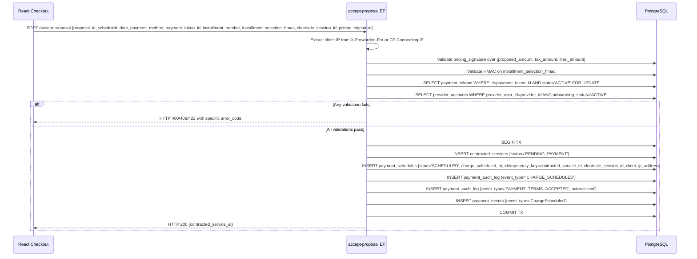
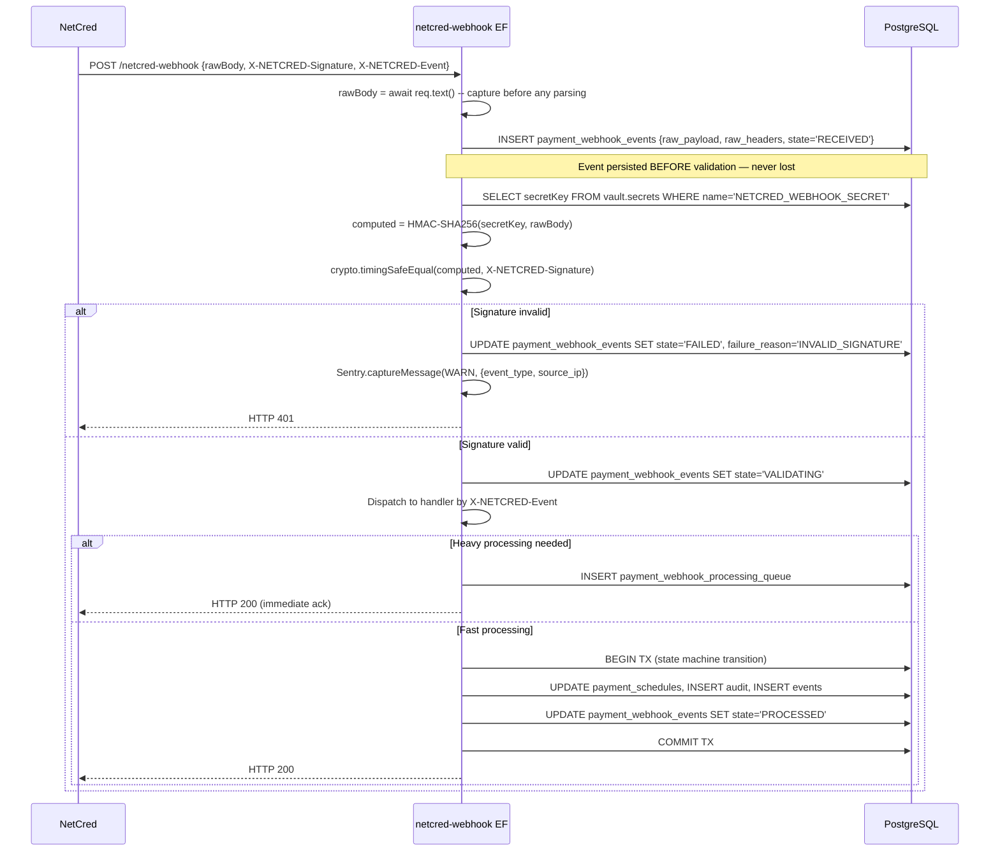
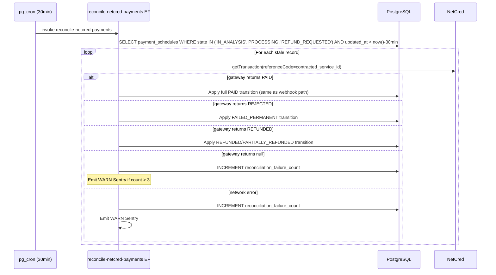
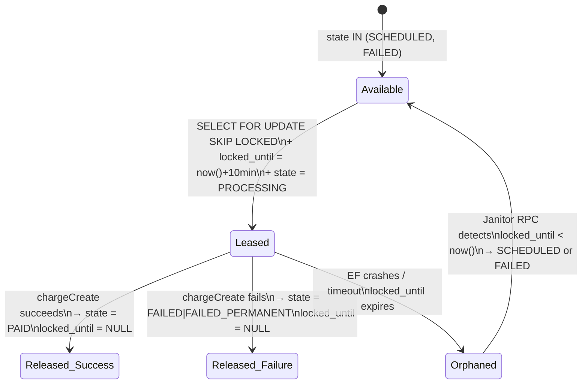

# Renovi Payment System — Design Document

> **Covers:** Requirements 1–33 (all acceptance criteria)
> **Version:** 1.0 — 2026-06-24
> **Status:** Engineering Review Ready
> **Authors:** Staff Engineering · Principal Architecture

---

# 1. Overall Architecture and Component Relationships

## 1.1 Architectural Intent

The Renovi Payment System is a **database-centric, event-driven orchestration layer** embedded within the Orbit marketplace. All authoritative state—payment schedule lifecycle, charge attempt history, webhook events, audit logs, and provider credentialing—lives in PostgreSQL. Edge Functions are thin I/O connectors: they authenticate requests, call external APIs (NetCred GraphQL, ClearSale, Resend, FCM), and delegate all state transitions to PostgreSQL RPCs. No Edge Function memory is authoritative between invocations.

The system enforces **exactly-once charge semantics** through a combination of:
- Row-level pessimistic locking (`SELECT … FOR UPDATE SKIP LOCKED`) for queue dequeueing
- Lease-based orphan recovery (janitor RPC via `pg_cron`)
- Gateway-level idempotency (`referenceCode = contracted_service_id`)
- Database UNIQUE constraints (`payment_schedules.idempotency_key`)

## 1.2 Runtime Topology



## 1.3 Component Responsibilities

| Component | Stateful? | Responsibility |
|---|---|---|
| `payment_schedules` table | Stateful | Authoritative charge queue; state machine source of truth |
| `payment_audit_log` table | Append-only | Immutable event log; dispute resolution backbone |
| `payment_webhook_events` table | Stateful | Raw event ingestion + dedup + retry state |
| `payment_attempts` table | Append-only | Per-attempt history; analytics and diagnostics |
| `provider_accounts` table | Stateful | Provider credentialing state machine |
| `platform_constants` table | Configuration | Configurable rates, limits; no code deployment needed |
| `schedule-netcred-charges` EF | Stateless | Queue consumer: dequeue → gateway → commit |
| `netcred-webhook` EF | Stateless | Ingestion: persist raw → validate → dispatch |
| `manual-charge-payment` EF | Stateless | Client-triggered charge with fresh ClearSale session |
| `calculate-installment-options` EF | Stateless | HMAC-signed fee computation |
| `tokenize-payment-card` EF | Stateless | PCI-safe tokenization connector |
| `NetCredAdapter` (TypeScript) | Stateless | Gateway translation; JWT refresh logic |
| React Checkout Stepper | Ephemeral | UI orchestration; ClearSale SDK injection |

## 1.4 Transactional vs Async Boundaries

| Operation | Boundary | Rationale |
|---|---|---|
| Lease acquisition + `state = PROCESSING` | **Synchronous, single DB TX** | Prevents concurrent workers from claiming same record |
| Final state commit (PAID/FAILED) + audit INSERT | **Synchronous, single DB TX** | Atomicity guarantee: state and audit always consistent |
| Notification enqueueing | **Async** (enqueue to dispatcher) | Notification failure MUST NOT revert payment state |
| Webhook raw persistence | **Synchronous, before validation** | Events logged even if processing fails |
| Webhook state reconciliation | **Synchronous, single DB TX** | State + audit commit atomically |
| `transactionRefund` submission | **Synchronous, sets REFUND_REQUESTED** | Confirmation via webhook is async |
| KYC email dispatch | **Async** (retried job queue) | Email failure MUST NOT block acceptance |
| Installment recalculation at charge time | **Synchronous, within cron TX** | Fee MUST be accurate at charge time using current rates |
| Service completion (EXECUTED→COMPLETED) | **Synchronous, single DB TX** | Status + audit atomic |
| Auto-completion (24h after EXECUTED) | **Async** (cron) | Client inaction must not block finalization |

## 1.5 Scheduling Topology



---

# 2. Data Models and Relationships

## 2.1 Entity Relationship Diagram



## 2.2 Entity Ownership and Lifecycle Semantics

| Entity | State Machine? | Immutable? | Owner | Lifecycle |
|---|---|---|---|---|
| `payment_schedules` | Yes (11 states) | No | Platform (cron) | Created at acceptance; terminal at PAID/CANCELLED/REFUNDED |
| `payment_attempts` | No | Yes (append-only) | Cron / client | INSERT per attempt; never updated |
| `payment_audit_log` | No | Yes (INSERT-only) | All actors | INSERT per state transition; no UPDATE/DELETE |
| `payment_tokens` | Yes (4 states) | No | Client | Created at tokenization; REVOKED on removal |
| `payment_webhook_events` | Yes (7 states) | Partially | Webhook handler | State progresses; raw_payload immutable |
| `provider_accounts` | Yes (6 states) | No | Cron / Admin | Created at KYC submission |
| `payment_events` | No | Yes | All transitions | Domain event log; analytics backbone |
| `payment_gateway_tokens` | No | No | Adapter | 1 row/gateway; upserted on refresh |
| `platform_constants` | No | No | Ops (DB update) | Read-only by functions |

## 2.3 State Machines

### Payment Schedule State Machine



### Provider Credentialing State Machine



---

# 3. Table Schemas with Constraints

## 3.1 `payment_providers`

```sql
CREATE TABLE payment_providers (
  id             UUID        PRIMARY KEY DEFAULT gen_random_uuid(),
  slug           TEXT        NOT NULL UNIQUE,       -- 'netcred', 'pagarme', etc.
  display_name   TEXT        NOT NULL,
  is_active      BOOLEAN     NOT NULL DEFAULT TRUE,
  supported_methods TEXT[]   NOT NULL DEFAULT '{}', -- ['CREDIT_CARD','PIX','BOLETO']
  api_base_url   TEXT        NOT NULL,
  webhook_handler_path TEXT  NOT NULL,
  created_at     TIMESTAMPTZ NOT NULL DEFAULT now()
);
-- Seed: INSERT INTO payment_providers (slug, display_name, ...)
-- VALUES ('netcred', 'NetCred Brasil', ...)
```

**Rationale:** Provider registry enables `gateway_slug`-based routing in charge execution without code changes. New adapter registration requires only an INSERT and a new TypeScript `PaymentProvider` implementation.

## 3.2 `payment_gateway_tokens`

```sql
CREATE TABLE payment_gateway_tokens (
  gateway_slug   TEXT        PRIMARY KEY REFERENCES payment_providers(slug),
  token          TEXT        NOT NULL,  -- encrypted at rest (Vault reference or pgcrypto)
  expires_at     TIMESTAMPTZ NOT NULL,
  refreshed_at   TIMESTAMPTZ NOT NULL DEFAULT now(),
  created_at     TIMESTAMPTZ NOT NULL DEFAULT now(),
  updated_at     TIMESTAMPTZ NOT NULL DEFAULT now()
);
-- One row per gateway. Accessed only via service_role (Edge Functions).
-- SELECT FOR UPDATE serializes concurrent refresh attempts.
```

**Invariant:** `expires_at - now() >= 60 minutes` at read time; otherwise refresh is triggered. The `FOR UPDATE` lock prevents thundering-herd refreshes when multiple workers start simultaneously.

## 3.3 `payment_tokens`

```sql
CREATE TABLE payment_tokens (
  id                          UUID        PRIMARY KEY DEFAULT gen_random_uuid(),
  client_id                   UUID        NOT NULL REFERENCES profiles(id),
  provider_id                 UUID        NOT NULL REFERENCES payment_providers(id),
  provider_payment_profile_id TEXT        NOT NULL,  -- NetCred paymentProfile.id
  card_number_masked          TEXT        NOT NULL,  -- '497010XXXXXX0048'
  card_brand                  TEXT        NOT NULL,  -- 'VCC','MASTER','ELO',...
  provider_card_token         TEXT        NOT NULL,  -- NetCred paymentProfile.token
  expiry_month                SMALLINT    NOT NULL CHECK (expiry_month BETWEEN 1 AND 12),
  expiry_year                 SMALLINT    NOT NULL,
  cardholder_name             TEXT        NOT NULL,
  billing_address             JSONB       NOT NULL,  -- {street,number,district,city,state,zipCode,additionalDetails}
  state                       TEXT        NOT NULL DEFAULT 'ACTIVE'
                              CHECK (state IN ('ACTIVE','EXPIRED','REVOKED','TOKENIZATION_FAILED')),
  created_at                  TIMESTAMPTZ NOT NULL DEFAULT now(),
  updated_at                  TIMESTAMPTZ NOT NULL DEFAULT now(),
  UNIQUE (client_id, provider_payment_profile_id)
);
-- PCI constraint: NO columns for raw PAN or CVV.
CREATE INDEX idx_payment_tokens_client_state ON payment_tokens(client_id, state);
-- RLS: only client (auth.uid() = client_id) can SELECT their own tokens.
```

**PCI Invariant:** The schema CHECK constraints plus RLS policies enforce PCI DSS data-at-rest scope limitation. `provider_payment_profile_id` and `provider_card_token` are gateway-issued opaque references.

## 3.4 `provider_accounts`

```sql
CREATE TABLE provider_accounts (
  id                        UUID        PRIMARY KEY DEFAULT gen_random_uuid(),
  provider_user_id          UUID        NOT NULL REFERENCES profiles(id),
  gateway_slug              TEXT        NOT NULL REFERENCES payment_providers(slug),
  document                  TEXT        NOT NULL,   -- CPF or CNPJ, digits only
  netcred_company_id        TEXT,                   -- populated on ACTIVE
  netcred_bank_account_id   TEXT,                   -- populated on ACTIVE
  onboarding_status         TEXT        NOT NULL DEFAULT 'PENDING_DOCUMENTS'
                            CHECK (onboarding_status IN (
                              'PENDING_DOCUMENTS','DOCUMENTS_SUBMITTED',
                              'UNDER_NETCRED_REVIEW','ACTIVE','REJECTED','SUSPENDED'
                            )),
  onboarding_submitted_at   TIMESTAMPTZ,
  onboarding_activated_at   TIMESTAMPTZ,
  created_at                TIMESTAMPTZ NOT NULL DEFAULT now(),
  updated_at                TIMESTAMPTZ NOT NULL DEFAULT now(),
  UNIQUE (provider_user_id, gateway_slug)
);
CREATE INDEX idx_provider_accounts_status ON provider_accounts(onboarding_status)
  WHERE onboarding_status IN ('DOCUMENTS_SUBMITTED','UNDER_NETCRED_REVIEW');
-- Partial index optimizes onboarding cron query.
```

**Invariant:** `netcred_company_id` and `netcred_bank_account_id` MUST both be non-NULL before `onboarding_status = 'ACTIVE'` can be committed. Enforced in the RPC, not just via CHECK constraint, because the values come from an external batch query.

## 3.5 `payment_schedules`

```sql
CREATE TABLE payment_schedules (
  id                          UUID        PRIMARY KEY DEFAULT gen_random_uuid(),
  contracted_service_id       UUID        NOT NULL REFERENCES contracted_services(id),
  client_id                   UUID        NOT NULL,
  provider_id                 UUID        NOT NULL,  -- service provider entity
  gateway_slug                TEXT        NOT NULL REFERENCES payment_providers(slug),
  payment_token_id            UUID        REFERENCES payment_tokens(id),
  installment_number          SMALLINT    NOT NULL CHECK (installment_number BETWEEN 1 AND 12),
  base_amount                 NUMERIC(12,2) NOT NULL CHECK (base_amount > 0),
  charge_scheduled_at         TIMESTAMPTZ NOT NULL,
  state                       TEXT        NOT NULL DEFAULT 'SCHEDULED'
                              CHECK (state IN (
                                'SCHEDULED','PROCESSING','PAID','IN_ANALYSIS',
                                'FAILED','FAILED_PERMANENT','CANCELLED','VOIDED',
                                'REFUND_REQUESTED','REFUNDED','PARTIALLY_REFUNDED','EXPIRED'
                              )),
  automatic_attempt_count     SMALLINT    NOT NULL DEFAULT 0,
  manual_attempt_count        SMALLINT    NOT NULL DEFAULT 0,
  max_attempts                SMALLINT    NOT NULL DEFAULT 3,
  locked_until                TIMESTAMPTZ,
  next_retry_at               TIMESTAMPTZ,
  idempotency_key             TEXT        NOT NULL UNIQUE,  -- = contracted_service_id
  clearsale_session_id        TEXT,                         -- UUID from ClearSale SDK at checkout
  client_ip_address           TEXT,                         -- IP at acceptance time
  upcoming_charge_notified_at TIMESTAMPTZ,                  -- 24h pre-charge notification sent
  is_disputed                 BOOLEAN     NOT NULL DEFAULT FALSE,
  needs_payment_method_update BOOLEAN     NOT NULL DEFAULT FALSE,
  provider_charge_id          TEXT,                         -- netcred_charge_id
  provider_transaction_id     TEXT,                         -- netcred_transaction_id
  paid_at                     TIMESTAMPTZ,
  failed_at                   TIMESTAMPTZ,
  failed_permanently_at       TIMESTAMPTZ,
  cancelled_at                TIMESTAMPTZ,
  refunded_at                 TIMESTAMPTZ,
  paid_amount                 NUMERIC(12,2),
  refunded_amount             NUMERIC(12,2),
  failure_code                TEXT,
  failure_reason              TEXT,
  cancellation_reason         TEXT,
  reconciliation_failure_count SMALLINT  NOT NULL DEFAULT 0,
  created_at                  TIMESTAMPTZ NOT NULL DEFAULT now(),
  updated_at                  TIMESTAMPTZ NOT NULL DEFAULT now()
);

-- Critical index for cron queue dequeue:
CREATE INDEX idx_payment_schedules_queue ON payment_schedules
  (charge_scheduled_at, state, locked_until, next_retry_at)
  WHERE state IN ('SCHEDULED','FAILED');

-- Idempotency: prevents duplicate schedule creation on accept_proposal retries
CREATE UNIQUE INDEX idx_payment_schedules_idempotency ON payment_schedules(idempotency_key);

-- Lookup by contracted_service_id (webhook reconciliation, cancellation)
CREATE INDEX idx_payment_schedules_service ON payment_schedules(contracted_service_id);

-- Reconciliation cron: stale intermediate states
CREATE INDEX idx_payment_schedules_stale ON payment_schedules(state, updated_at)
  WHERE state IN ('IN_ANALYSIS','PROCESSING','REFUND_REQUESTED');
```

**Concurrency invariants:**
- `locked_until` + `SKIP LOCKED` prevents double-processing
- `idempotency_key UNIQUE` prevents duplicate schedule on `accept_proposal` retry
- `automatic_attempt_count` increments atomically within the same TX as `state = PROCESSING`
- `max_attempts` is read from `platform_constants` at schedule creation and stored per row to survive constant updates

## 3.6 `payment_attempts`

```sql
CREATE TABLE payment_attempts (
  id                      UUID        PRIMARY KEY DEFAULT gen_random_uuid(),
  schedule_id             UUID        NOT NULL REFERENCES payment_schedules(id),
  attempt_number          SMALLINT    NOT NULL,
  initiator               TEXT        NOT NULL CHECK (initiator IN ('cron','client')),
  initiated_at            TIMESTAMPTZ NOT NULL DEFAULT now(),
  completed_at            TIMESTAMPTZ,
  outcome                 TEXT        CHECK (outcome IN (
                            'PAID','REJECTED','TIMEOUT','ERROR','IN_ANALYSIS','VOIDED'
                          )),
  provider_response_summary JSONB,
  failure_code            TEXT,
  failure_reason          TEXT,
  charge_amount           NUMERIC(12,2),
  gateway_latency_ms      INT,
  created_at              TIMESTAMPTZ NOT NULL DEFAULT now()
);
CREATE INDEX idx_payment_attempts_schedule ON payment_attempts(schedule_id, attempt_number);
-- Append-only: no UPDATE/DELETE permissions for application role.
```

## 3.7 `payment_webhook_events`

```sql
CREATE TABLE payment_webhook_events (
  id                TEXT        PRIMARY KEY DEFAULT gen_random_uuid()::text,
  gateway_slug      TEXT        NOT NULL,
  event_type        TEXT        NOT NULL,
  provider_event_id TEXT        NOT NULL,
  raw_payload       JSONB       NOT NULL,
  raw_headers       JSONB       NOT NULL,
  state             TEXT        NOT NULL DEFAULT 'RECEIVED'
                    CHECK (state IN (
                      'RECEIVED','VALIDATING','PROCESSING','PROCESSED',
                      'DUPLICATE','FAILED','DEAD_LETTER'
                    )),
  retry_count       SMALLINT    NOT NULL DEFAULT 0,
  next_retry_at     TIMESTAMPTZ,
  processed_at      TIMESTAMPTZ,
  failure_reason    TEXT,
  is_duplicate      BOOLEAN     NOT NULL DEFAULT FALSE,
  created_at        TIMESTAMPTZ NOT NULL DEFAULT now(),
  updated_at        TIMESTAMPTZ NOT NULL DEFAULT now(),
  UNIQUE (gateway_slug, event_type, provider_event_id)  -- deduplication constraint
);
CREATE INDEX idx_webhook_events_retry ON payment_webhook_events(state, next_retry_at)
  WHERE state = 'FAILED';
CREATE INDEX idx_webhook_events_dead_letter ON payment_webhook_events(state, created_at)
  WHERE state = 'DEAD_LETTER';
```

**Dedup semantics:** The UNIQUE constraint on `(gateway_slug, event_type, provider_event_id)` is the primary deduplication mechanism. On conflict, the handler sets `is_duplicate = true` and returns HTTP 200 without reprocessing.

## 3.8 `payment_audit_log`

```sql
CREATE TABLE payment_audit_log (
  id           UUID        PRIMARY KEY DEFAULT gen_random_uuid(),
  event_type   TEXT        NOT NULL,
  entity_type  TEXT        NOT NULL,   -- 'payment_schedule','payment_token','provider_account'
  entity_id    UUID        NOT NULL,
  service_id   UUID,                   -- contracted_services.id
  schedule_id  UUID,                   -- payment_schedules.id
  from_state   TEXT,
  to_state     TEXT,
  actor        TEXT        NOT NULL    -- 'cron','client','webhook','support','system'
               CHECK (actor IN ('cron','client','webhook','support','system')),
  actor_id     UUID,                   -- auth.uid() when applicable
  metadata     JSONB       NOT NULL DEFAULT '{}',
  created_at   TIMESTAMPTZ NOT NULL DEFAULT now()
  -- NO updated_at — INSERT-only; app role has INSERT+SELECT, no UPDATE/DELETE
);
CREATE INDEX idx_audit_log_service ON payment_audit_log(service_id, created_at);
CREATE INDEX idx_audit_log_schedule ON payment_audit_log(schedule_id, created_at);
-- Permissions: GRANT INSERT, SELECT ON payment_audit_log TO authenticated;
-- REVOKE UPDATE, DELETE ON payment_audit_log FROM authenticated;
```

**Immutability guarantee:** Application roles have INSERT and SELECT only. Audit records are inserted within the SAME database transaction as the state change, ensuring the log is always consistent with the actual state.

## 3.9 `payment_events` (Domain Event Log)

```sql
CREATE TABLE payment_events (
  id             UUID        PRIMARY KEY DEFAULT gen_random_uuid(),
  event_type     TEXT        NOT NULL,  -- 'ChargeSucceeded','ChargeFailed', etc.
  aggregate_type TEXT        NOT NULL,  -- 'payment_schedule','payment_token','provider_account'
  aggregate_id   UUID        NOT NULL,
  service_id     UUID,
  payload        JSONB       NOT NULL DEFAULT '{}',
  created_at     TIMESTAMPTZ NOT NULL DEFAULT now()
);
CREATE INDEX idx_payment_events_type ON payment_events(event_type, created_at);
CREATE INDEX idx_payment_events_service ON payment_events(service_id, created_at);
CREATE INDEX idx_payment_events_aggregate ON payment_events(aggregate_type, aggregate_id, created_at);
```

## 3.10 `platform_constants`

```sql
CREATE TABLE platform_constants (
  key         TEXT        PRIMARY KEY,
  value       TEXT        NOT NULL,
  description TEXT,
  updated_at  TIMESTAMPTZ NOT NULL DEFAULT now()
);

-- Required seed rows (Req 25):
INSERT INTO platform_constants (key, value, description) VALUES
  ('cc_visa_master_1x_rate',            '2.39',  'Visa/Master 1x fee rate %'),
  ('cc_visa_master_2_6x_rate',          '2.59',  'Visa/Master 2-6x fee rate %'),
  ('cc_visa_master_7_12x_rate',         '2.79',  'Visa/Master 7-12x fee rate %'),
  ('cc_elo_other_1x_rate',              '2.69',  'Elo/Other 1x fee rate %'),
  ('cc_elo_other_2_6x_rate',            '2.89',  'Elo/Other 2-6x fee rate %'),
  ('cc_elo_other_7_12x_rate',           '3.19',  'Elo/Other 7-12x fee rate %'),
  ('cc_fixed_processing_fee_brl',       '0.39',  'Fixed processing fee BRL'),
  ('max_charge_attempts',               '3',     'Max automatic cron retry attempts'),
  ('charge_retry_interval_minutes',     '30',    'Minutes between retryable failures'),
  ('payment_lease_duration_minutes',    '10',    'PROCESSING lock TTL minutes'),
  ('provider_onboarding_batch_size',    '50',    'Max providers per detect-netcred-onboarding batch'),
  ('auto_cancel_hours_before_service',  '12',    'T-12h auto-cancellation threshold hours'),
  ('scheduled_charge_hours_before_service', '48','T-2 charge scheduling offset hours'),
  ('installment_hmac_expires_minutes',  '10',    'HMAC payload TTL minutes'),
  ('reconciliation_poll_interval_minutes','30',  'Stale record reconciliation interval'),
  ('webhook_base_retry_interval_minutes','5',    'Exponential backoff base for webhook retry');
```

---

# 4. Runtime Execution Flows

## 4.1 Phase 1: Provider Credentialing — KYC Collection and Onboarding (Req 3, 4, 29)

### 4.1.1 KYC Submission Flow



**Blocking enforcement (Req 3 AC1):** The `match_provider_jobs` RPC contains a guard:
```sql
IF (SELECT onboarding_status FROM provider_accounts WHERE provider_user_id = auth.uid())
   != 'ACTIVE' THEN
  RETURN QUERY SELECT * FROM ... WHERE FALSE; -- empty result
END IF;
```
This enforcement is in the RPC (`SECURITY DEFINER`), not only client-side rendering.

**Email retry semantics (Req 3 AC5):** If Resend fails, the KYC submission state (`DOCUMENTS_SUBMITTED`) is preserved because it was committed before the email call. The email job is enqueued for exponential retry. The provider's app shows "submitting..." until `email_dispatched_at` is populated.

### 4.1.2 Onboarding Detection Cron (Req 4)

```mermaid
sequenceDiagram
    participant C as pg_cron (1x/day)
    participant EF as detect-netcred-onboarding EF
    participant PG as PostgreSQL
    participant NC as NetCred GraphQL API

    C->>EF: invoke detect-netcred-onboarding
    EF->>PG: SELECT provider_accounts WHERE onboarding_status IN ('DOCUMENTS_SUBMITTED','UNDER_NETCRED_REVIEW') LIMIT 50
    loop For each batch of 50
        EF->>NC: POST /graphql { query: ProviderOnboardingBatch (50 aliases) }
        NC-->>EF: { data: { provider_<doc>: { edges: [...] } } }
        loop For each alias response
            alt edges empty
                Note over EF: no-op; recheck next day
            else companyState = ACTIVE AND bankAccounts non-empty AND single edge
                EF->>PG: BEGIN TX
                EF->>PG: UPDATE provider_accounts SET onboarding_status='ACTIVE', netcred_company_id, netcred_bank_account_id, onboarding_activated_at=now()
                EF->>PG: INSERT payment_audit_log (PROVIDER_ACTIVATED)
                EF->>PG: INSERT payment_events (ProviderCredentialed)
                EF->>PG: COMMIT TX
                EF->>PG: Enqueue Push notification to provider (activation confirmed)
            else companyState != ACTIVE AND edges non-empty
                EF->>PG: UPDATE provider_accounts SET onboarding_status='UNDER_NETCRED_REVIEW'
            else multiple edges
                EF->>EF: Emit WARNING Sentry (manual review required); skip activation
            else companyState = ACTIVE AND bankAccounts empty
                EF->>PG: UPDATE provider_accounts SET onboarding_status='UNDER_NETCRED_REVIEW'
                EF->>EF: Emit WARNING (no bank account)
            end
        end
        Note over EF: inter-batch delay 2s (configurable)
    end
```

**Batch request structure:** One HTTP POST with up to 50 GraphQL aliases per request. Alias key = `provider_<document_digits_only>`. Document matching is done by comparing `companies.node.document` to local `provider_accounts.document`. MUST NOT issue one HTTP request per provider.

## 4.2 Phase 2–3: Client Profile Completion and Card Tokenization (Req 5, 6, 31)

### 4.2.1 Checkout Stepper Step Resolution

On stepper initialization, the frontend calls an RPC:
```sql
-- Returns flags for which steps are required
SELECT
  (cpf IS NULL) AS needs_cpf,
  (phone IS NULL) AS needs_phone,
  (NOT EXISTS (SELECT 1 FROM payment_tokens WHERE client_id = auth.uid() AND state = 'ACTIVE')) AS needs_card
FROM client_profiles_private
WHERE user_id = auth.uid();
```

Steps rendered in order: CPF (if needed) → Phone (if needed) → Card / Saved Card Selection → Installments → Confirmation.

### 4.2.2 ClearSale SDK Initialization (Req 31)

At card step component mount:
1. Generate `clearsaleSessionId = crypto.randomUUID()` — stored in stepper local state (NOT in React Query cache)
2. Inject ClearSale `fp.js` asynchronously:
   ```js
   (function (a, b, c, d, e, f, g) {
     a['CsdpObject'] = e; a[e] = a[e] || function () {
     (a[e].q = a[e].q || []).push(arguments)
     }, a[e].l = 1 * Date.now(); f = b.createElement(c),
     g = b.getElementsByTagName(c)[0]; f.async = 1; f.src = d;
     g.parentNode.insertBefore(f, g)
   })(window, document, 'script', '//device.clearsale.com.br/p/fp.js', 'csdp');
   csdp('app', import.meta.env.VITE_CLEARSALE_APP_KEY);
   csdp('sessionid', clearsaleSessionId);
   ```
3. SDK collects device data asynchronously and sends to ClearSale servers — no explicit send call needed for Browser/WebView SDK
4. `clearsaleSessionId` is stable for the checkout session and MUST NOT regenerate on re-renders
5. If the user abandons checkout and returns: a NEW UUID is generated on card step re-mount
6. If `fp.js` fails to load: log WARN, continue checkout (degraded ClearSale coverage, not blocked)

**Capacitor/Android:** Browser/WebView SDK applies identically inside Capacitor WebView. React Native SDK MUST NOT be used.

### 4.2.3 Card Tokenization Flow

```mermaid
sequenceDiagram
    participant UI as React Checkout Stepper
    participant EF as tokenize-payment-card EF
    participant PG as PostgreSQL
    participant NC as NetCred GraphQL

    UI->>EF: POST /tokenize-payment-card {cardData, cpf, phone, billingAddress, providerServiceId}
    Note over EF: Raw card data NEVER stored; transmitted only to NetCred
    EF->>NC: mutation paymentProfileCreate(customerInput{companyId=netcred_company_id, persist:false}, ccInput, billingAddressInput)
    NC-->>EF: {paymentProfile: {id, token, isActive, cardNumber, brand, ...}}
    alt isActive = true
        EF->>PG: INSERT payment_tokens {provider_payment_profile_id, card_number_masked, card_brand, provider_card_token, billing_address, state='ACTIVE'}
        EF-->>UI: {payment_token_id, card_number_masked, card_brand}
    else isActive = false OR errors
        EF-->>UI: HTTP 422 {errors[].message}
        Note over UI: No partial record created; user must retry
    end
```

**PCI compliance enforcement:**
- Raw card data (PAN, CVV) MUST NOT be logged, cached in React Query, stored in IndexedDB, or transmitted to any endpoint other than `tokenize-payment-card`
- The EF never logs card fields from the request body
- Only `provider_payment_profile_id`, `card_number_masked`, `card_brand`, `provider_card_token` are persisted
- `billingAddressInput` is ALWAYS included in production (ClearSale requirement); omission causes `PaymentProfile requires BillingAddress` gateway error

## 4.3 Phase 4: Installment Calculation and HMAC Signing (Req 7, 25, 27)

### 4.3.1 Fee Computation Formula

For installment `n` with `card_brand` and `base_amount` (from proposal's `proposed_amount`):

```
applicable_rate_pct = platform_constants[brand_range_key]
total_with_fees = ROUND((base_amount * (1 + applicable_rate_pct/100)) + cc_fixed_processing_fee_brl, 2)
installment_amount = ROUND(total_with_fees / n, 2)  -- banker's rounding (ROUND_HALF_EVEN)
```

Brand/range key resolution:
```
if brand IN ('VCC','MASTER') AND n = 1  → cc_visa_master_1x_rate
if brand IN ('VCC','MASTER') AND n IN (2..6)  → cc_visa_master_2_6x_rate
if brand IN ('VCC','MASTER') AND n IN (7..12) → cc_visa_master_7_12x_rate
if brand IN ('ELO', other)  AND n = 1  → cc_elo_other_1x_rate
... (analogous for other ranges)
```

**Same formula in Edge Function and `calculate_charge_amount()` PostgreSQL RPC.** At T-2, the cron uses the RPC (current `platform_constants`), NOT the HMAC payload, to compute the actual charged amount. Fee drift between checkout and charge time is expected and intentional.

### 4.3.2 HMAC Signing and Validation

```mermaid
sequenceDiagram
    participant UI as React Stepper
    participant EF as calculate-installment-options EF
    participant PG as PostgreSQL (Vault)

    UI->>EF: GET /calculate-installment-options?proposal_id&service_id&card_brand
    EF->>PG: SELECT value FROM platform_constants WHERE key LIKE 'cc_%'
    EF->>EF: compute installment_options[1..12]
    EF->>PG: SELECT secret FROM vault.secrets WHERE name='INSTALLMENT_SIGNING_SECRET'
    EF->>EF: payload = {proposal_id, service_id, base_amount, card_brand, installment_options, computed_at, expires_at=now()+10min}
    EF->>EF: hmac = HMAC-SHA256(INSTALLMENT_SIGNING_SECRET, JSON.stringify(payload))
    EF-->>UI: {installment_options, installment_selection_hmac: hmac, expires_at}

    UI->>UI: Client selects installment_number, taps Confirm
    UI->>EF: POST /accept-proposal {proposal_id, installment_number, installment_selection_hmac, ...}
    EF->>PG: SELECT secret FROM vault.secrets WHERE name='INSTALLMENT_SIGNING_SECRET'
    EF->>EF: recompute HMAC; crypto.timingSafeEqual(computed, submitted)
    alt HMAC valid AND not expired
        EF->>PG: proceed with accept_proposal_rpc()
    else HMAC mismatch
        EF-->>UI: HTTP 400 {error_code: 'INVALID_INSTALLMENT_SIGNATURE'}
    else expired (computed_at + 10min < now())
        EF-->>UI: HTTP 400 {error_code: 'INSTALLMENT_SIGNATURE_EXPIRED'}
        Note over UI: Re-open installment step; preserve card token and other stepper data
    end
```

## 4.4 Phase 5: Service Acceptance and Charge Scheduling (Req 8, 9)

### 4.4.1 accept_proposal Execution



**`charge_scheduled_at` computation:**
```
if scheduled_date - now() >= 48 hours:
  charge_scheduled_at = scheduled_date - interval '2 days'
else:  -- emergency scheduling
  charge_scheduled_at = now()
  payment_audit_log.metadata.emergency_scheduling = true
```

**Idempotency on retry:** The UNIQUE constraint on `idempotency_key` causes the second insert to fail with a conflict. The EF catches the conflict, selects the existing `contracted_services.id`, and returns HTTP 200 with that ID.

**PENDING_PAYMENT state:** `contracted_services.status = 'PENDING_PAYMENT'` means the provider does NOT see this service in their calendar. The service is visible to the client only.

## 4.5 Phase 6: T-2 Charge Execution Cron (Req 10, 11, 23)

### 4.5.1 Cron Eligibility Query

```sql
-- Executed by schedule-netcred-charges Edge Function
-- Step 1: Select and lock eligible schedules
WITH eligible AS (
  SELECT ps.id
  FROM payment_schedules ps
  JOIN contracted_services cs ON cs.id = ps.contracted_service_id
  JOIN provider_accounts pa ON pa.provider_user_id = ps.provider_id
                            AND pa.gateway_slug = ps.gateway_slug
  JOIN platform_constants pc ON pc.key = 'max_charge_attempts'
  WHERE ps.state IN ('SCHEDULED', 'FAILED')
    AND ps.automatic_attempt_count < ps.max_attempts
    AND ps.charge_scheduled_at::date <= CURRENT_DATE
    AND (ps.locked_until IS NULL OR ps.locked_until < now())
    AND (ps.next_retry_at IS NULL OR ps.next_retry_at <= now())
    AND cs.status NOT IN ('CANCELLED','COMPLETED')
    AND ps.payment_token_id IS NOT NULL
    AND pa.onboarding_status = 'ACTIVE'
  FOR UPDATE SKIP LOCKED
  LIMIT 10  -- batch size per invocation
)
UPDATE payment_schedules
SET state = 'PROCESSING',
    locked_until = now() + (
      SELECT value::integer FROM platform_constants WHERE key='payment_lease_duration_minutes'
    ) * interval '1 minute',
    automatic_attempt_count = automatic_attempt_count + 1,
    updated_at = now()
WHERE id IN (SELECT id FROM eligible)
RETURNING id, contracted_service_id, payment_token_id, installment_number,
          base_amount, gateway_slug, clearsale_session_id, client_ip_address,
          automatic_attempt_count;
```

**Critical:** This UPDATE is committed in its own transaction BEFORE any gateway call. The lease `locked_until` ensures that even if the EF crashes, the janitor will recover the record after TTL expiry.

### 4.5.2 Charge Execution Per Schedule

```mermaid
sequenceDiagram
    participant EF as schedule-netcred-charges
    participant PG as PostgreSQL
    participant NC as NetCred GraphQL

    Note over EF: For each acquired schedule (independent error boundary)
    EF->>PG: SELECT calculate_charge_amount(payment_token_id, base_amount, installment_number)
    PG-->>EF: charge_amount (computed with current platform_constants)
    EF->>EF: Assemble chargeCreate payload {companyId, paymentProfileId, amount, installmentNumber, referenceCode=contracted_service_id, orderInput.sessionId=clearsale_session_id, customerIpAddress, payoutRuleInput}
    EF->>NC: mutation chargeCreate(input)
    alt transactionState = 'PAID'
        EF->>PG: BEGIN TX
        EF->>PG: UPDATE payment_schedules SET state='PAID', locked_until=NULL, paid_at=now(), paid_amount, provider_charge_id, provider_transaction_id
        EF->>PG: UPDATE contracted_services SET status='CONFIRMED'
        EF->>PG: INSERT payment_attempts {outcome='PAID', initiator='cron'}
        EF->>PG: INSERT payment_audit_log {event_type='CHARGE_PAID'}
        EF->>PG: INSERT payment_events {ChargeSucceeded}
        EF->>PG: COMMIT TX
        EF->>PG: Enqueue Push+Email to client (success), Push to provider
    else transactionState = 'IN_ANALYSIS'
        EF->>PG: BEGIN TX
        EF->>PG: UPDATE payment_schedules SET state='IN_ANALYSIS', locked_until=NULL
        EF->>PG: INSERT payment_attempts {outcome='IN_ANALYSIS', initiator='cron'}
        EF->>PG: INSERT payment_audit_log, INSERT payment_events
        EF->>PG: COMMIT TX
        EF->>PG: Enqueue Push to client (in review)
    else transactionState = 'REJECTED' (terminal)
        EF->>PG: BEGIN TX
        EF->>PG: UPDATE payment_schedules SET state='FAILED_PERMANENT', locked_until=NULL, failed_permanently_at=now(), failure_code
        EF->>PG: INSERT payment_attempts {outcome='REJECTED', initiator='cron'}
        EF->>PG: INSERT payment_audit_log, INSERT payment_events
        EF->>PG: COMMIT TX
        EF->>PG: Enqueue Push+Email to client, Push to provider (FAILED_PERMANENT)
    else retryable error (network/5xx) AND attempts < max
        EF->>PG: BEGIN TX
        EF->>PG: UPDATE payment_schedules SET state='FAILED', locked_until=NULL, next_retry_at=now()+30min, failure_code
        EF->>PG: INSERT payment_attempts {outcome='ERROR', initiator='cron'}
        EF->>PG: INSERT payment_audit_log, INSERT payment_events
        EF->>PG: COMMIT TX
        EF->>PG: Enqueue failure notifications (1st failure: client+provider; subsequent: client only)
    else retryable error AND attempts >= max
        EF->>PG: BEGIN TX
        EF->>PG: UPDATE payment_schedules SET state='FAILED_PERMANENT', failed_permanently_at=now()
        EF->>PG: INSERT payment_attempts, INSERT payment_audit_log
        EF->>PG: COMMIT TX
        EF->>PG: Enqueue FAILED_PERMANENT notifications
    end
```

### 4.5.3 Timeout Recovery and referenceCode Reconciliation

On any retry where the previous attempt may have timed out (state was `PROCESSING` recovered by janitor to `FAILED`), the cron MUST:

1. Call `getTransaction(referenceCode = contracted_service_id)` FIRST
2. If gateway returns `PAID`: apply full PAID transition without issuing new `chargeCreate`
3. If gateway returns `null`: proceed with new `chargeCreate`
4. If gateway returns `referenceCode` conflict error: call `getTransaction` and reconcile

```typescript
async function executeCharge(schedule: PaymentSchedule): Promise<void> {
  const existing = await adapter.getTransaction({ referenceCode: schedule.contracted_service_id });
  if (existing?.transactionState === 'PAID') {
    await reconcileSuccess(schedule, existing);
    return;
  }
  const result = await adapter.createCharge({ ...chargeInput, referenceCode: schedule.contracted_service_id });
  if (result.error?.code === 'REFERENCE_CODE_CONFLICT') {
    const conflicting = await adapter.getTransaction({ referenceCode: schedule.contracted_service_id });
    await reconcileFromGatewayState(schedule, conflicting);
    return;
  }
  await commitChargeResult(schedule, result);
}
```

## 4.6 Phase 7: Retry and Recovery (Req 11, 23)

### Orphan Recovery — Janitor RPC

```sql
-- recover_orphaned_payment_schedules() — called via pg_cron every 30 min
CREATE OR REPLACE FUNCTION recover_orphaned_payment_schedules()
RETURNS void LANGUAGE plpgsql AS $$
BEGIN
  UPDATE payment_schedules
  SET state = CASE
    WHEN automatic_attempt_count = 0 THEN 'SCHEDULED'
    ELSE 'FAILED'
  END,
  locked_until = NULL,
  next_retry_at = CASE
    WHEN automatic_attempt_count > 0 THEN now() + interval '30 minutes'
    ELSE NULL
  END,
  updated_at = now()
  WHERE state = 'PROCESSING'
    AND locked_until < now();

  -- INSERT payment_audit_log for each recovered record
  INSERT INTO payment_audit_log (event_type, entity_type, entity_id, from_state, to_state, actor, metadata)
  SELECT 'ORPHAN_RECOVERED', 'payment_schedule', id,
         'PROCESSING',
         CASE WHEN automatic_attempt_count = 0 THEN 'SCHEDULED' ELSE 'FAILED' END,
         'system', jsonb_build_object('recovered_at', now(), 'locked_until_was', locked_until)
  FROM payment_schedules
  WHERE state IN ('SCHEDULED','FAILED') AND updated_at >= now() - interval '1 minute';
END;
$$;
```

### Error Classification Matrix

| Error Type | Examples | Classification | Action |
|---|---|---|---|
| `transactionState = REJECTED` | Card declined, fraud block | **Terminal** | → `FAILED_PERMANENT` immediately |
| `CPF_INVALID` | Invalid CPF check digits | **Terminal** | → `FAILED_PERMANENT` immediately |
| `BILLING_ADDRESS_MISSING` | ClearSale config issue | **Terminal** | → `FAILED_PERMANENT` immediately |
| `CARD_NOT_FOUND` | Token expired at gateway | **Terminal** | → `FAILED_PERMANENT` immediately |
| `referenceCode` conflict (unresolvable) | Data integrity issue | **Terminal** | → `FAILED_PERMANENT` + CRITICAL Sentry |
| Network timeout | HTTP timeout | **Retryable** | → `FAILED`, `next_retry_at = now()+30m` |
| HTTP 5xx / `INTERNAL_SERVER_ERROR` | Gateway downtime | **Retryable** | → `FAILED` |
| `tokenAuth` failure | JWT expired/invalid | **Retryable** | One auto-refresh; if retry fails → `FAILED` (no count increment) |

## 4.7 Phase 8: Webhook Processing (Req 16, 17, 18, 19)

### 4.7.1 Webhook Ingestion Flow



### 4.7.2 Webhook Event Dispatch Table

| `X-NETCRED-Event` | Handler Action | State Transition |
|---|---|---|
| `TRANSACTION_CAPTURE` (`PAID`) | Full PAID commit | `*` → `PAID`; `contracted_services` → `CONFIRMED` |
| `TRANSACTION_UPDATE` | Universal fallback; map `transactionState` | Varies by state |
| `TRANSACTION_REFUND` | Confirm refund amount | `REFUND_REQUESTED` → `REFUNDED` / `PARTIALLY_REFUNDED` |
| `CHARGE_VOID` | Set voided | `*` → `VOIDED` |
| `TRANSACTION_VOID` | Confirm void | `*` → `VOIDED` |
| `TRANSACTION_DISPUTE` | Set `is_disputed=true`; CRITICAL Sentry | No status change — manual ops resolution |
| `TRANSACTION_EXPIRED` | Set expired | `*` → `EXPIRED` |
| `PAYMENT_PROFILE_TOKENIZE` | Confirm/reject token | `payment_tokens.state` update |
| `PAYMENT_PROFILE_UPDATE` | Sync token metadata | `payment_tokens` update |
| `PAYMENT_PROFILE_DELETE` | Revoke token | `payment_tokens.state='REVOKED'`; flag schedule |
| `PAYMENT_PROFILE_EXPIRING` | Notify client | Enqueue update-card notification |
| `WEBHOOK_PING` | No-op | None |
| Unknown | Log WARN, return 200 | None |

**State machine regression guard (Req 17 AC3):** Before any transition, the handler checks:
```typescript
if (TERMINAL_STATES.includes(current_state) && !isValidTransition(current_state, target_state)) {
  // mark PROCESSED without state change; log warning
  return;
}
```
Terminal states: `PAID`, `REFUNDED`, `PARTIALLY_REFUNDED`, `VOIDED`, `CANCELLED`, `EXPIRED`.

### 4.7.3 Dead Letter Queue (Req 19)

Retry schedule with exponential backoff (`base=5min`):
- Attempt 1: `next_retry_at = failed_at + 5min`
- Attempt 2: `next_retry_at = failed_at + 10min`
- Attempt 3: `next_retry_at = failed_at + 20min`
- After attempt 3: `state = 'DEAD_LETTER'` → CRITICAL Sentry alert

Manual recovery: operator sets `state = 'RECEIVED'`, `retry_count = 0`. The `process-webhook-retry` cron picks it up. Idempotency constraints guarantee safe reprocessing.

## 4.8 Phase 9: Refund and Cancellation (Req 15)

### 4.8.1 Refund Amount Computation (ToS §2.2)

```typescript
function computeRefundAmount(
  chargeAmount: Decimal,
  baseAmount: Decimal,
  serviceScheduledAt: Date,
  cancellationInitiator: 'client' | 'provider'
): { refundAmount: Decimal; penaltyTier: string } {
  if (cancellationInitiator === 'provider') {
    // Full refund including card processing fees
    return { refundAmount: chargeAmount, penaltyTier: 'PROVIDER_FULL_REFUND' };
  }
  const hoursUntilService = differenceInHours(serviceScheduledAt, new Date());
  if (hoursUntilService > 48) {
    return { refundAmount: baseAmount, penaltyTier: 'FULL_REFUND' };         // 100% of base
  } else if (hoursUntilService >= 12) {
    return { refundAmount: baseAmount.mul('0.90'), penaltyTier: 'PENALTY_10' }; // 90% of base
  } else {
    return { refundAmount: baseAmount.mul('0.70'), penaltyTier: 'PENALTY_30' }; // 70% of base
  }
  // Card processing fees (charge_amount - base_amount) are always non-refundable
}
```

### 4.8.2 Pre-T2 Cancellation (no gateway call)

```sql
-- If payment_schedules.state IN ('SCHEDULED','FAILED','FAILED_PERMANENT')
BEGIN;
UPDATE contracted_services SET status='CANCELLED', cancellation_reason='CLIENT_INITIATED' WHERE id=:service_id;
UPDATE payment_schedules SET state='CANCELLED', cancelled_at=now(), cancellation_reason='CLIENT_INITIATED' WHERE id=:schedule_id;
INSERT INTO payment_audit_log (event_type, ...) VALUES ('PRE_CHARGE_CANCELLED', ...);
COMMIT;
-- No transactionRefund call; cron skips CANCELLED records
```

### 4.8.3 Post-Charge Cancellation (requires gateway call)

```mermaid
sequenceDiagram
    participant UI as Client App
    participant EF as process-refund EF
    participant PG as PostgreSQL
    participant NC as NetCred GraphQL

    UI->>EF: POST /process-refund {service_id, cancellation_reason}
    EF->>PG: SELECT payment_schedules WHERE contracted_service_id=service_id AND state='PAID' FOR UPDATE
    EF->>EF: computeRefundAmount(charge_amount, base_amount, service_scheduled_at, initiator)
    EF->>PG: BEGIN TX
    EF->>PG: UPDATE payment_schedules SET state='REFUND_REQUESTED'
    EF->>PG: UPDATE contracted_services SET status='CANCELLED', cancellation_reason
    EF->>PG: INSERT payment_audit_log (REFUND_SUBMITTED, refund_amount, penalty_tier)
    EF->>PG: COMMIT TX
    EF->>NC: mutation transactionRefund(transactionId=netcred_transaction_id, amount=refund_amount, refundReason='REQUESTED_BY_CUSTOMER')
    alt refund accepted
        EF->>PG: UPDATE payment_webhook_events... (webhook will finalize)
        EF-->>UI: HTTP 200 {refund_amount, expected_days: 30-60}
    else refund error (ALREADY_REFUNDED)
        EF->>EF: idempotent no-op; log info
        EF-->>UI: HTTP 200
    else refund error (other)
        EF->>EF: Sentry.captureException(CRITICAL)
        EF->>PG: INSERT payment_audit_log (REFUND_FAILED)
        EF-->>UI: HTTP 500 + support escalation link
    end
```

**Gateway split distribution:** The `isLiable: true` flag on both provider and Renovi `ruleItems` causes NetCred to distribute refunds proportionally between all liable accounts. No custom split logic needed in Renovi code.

## 4.9 Phase 10: Reconciliation Polling (Req 20)



## 4.10 Phase 11: Pre-Charge Notification (Req 33)

```sql
-- notify-upcoming-charges cron — 4x/day, offset from charge cron
SELECT ps.id, ps.client_id, ps.charge_scheduled_at, ps.base_amount, ps.installment_number
FROM payment_schedules ps
JOIN contracted_services cs ON cs.id = ps.contracted_service_id
WHERE ps.state = 'SCHEDULED'
  AND ps.upcoming_charge_notified_at IS NULL
  AND ps.charge_scheduled_at - now() <= interval '24 hours'
  AND ps.charge_scheduled_at > now()
  AND cs.status = 'PENDING_PAYMENT'
  AND cs.status NOT IN ('CANCELLED')
```

On selection: enqueue Push + Email to client (NOT provider). Then atomically:
```sql
UPDATE payment_schedules
SET upcoming_charge_notified_at = now(), updated_at = now()
WHERE id = :schedule_id
  AND upcoming_charge_notified_at IS NULL  -- guard against race
```

**Emergency scheduling exclusion (Req 33 AC4):** If `charge_scheduled_at ≈ now()` (emergency: original `service_scheduled_at - now() < 48h`), the 24h window will never trigger because charge will happen before the cron window. The checkout disclosure at acceptance is the notification substitute.

**Rescheduling reset:** `upcoming_charge_notified_at` is set to NULL in the rescheduling RPC, allowing the notification to fire again for the updated `charge_scheduled_at`.

## 4.11 Phase 12: Manual Payment Recovery (Req 13, 31)

```mermaid
sequenceDiagram
    participant UI as Client App (Service Detail)
    participant EF as manual-charge-payment EF
    participant PG as PostgreSQL
    participant NC as NetCred

    UI->>EF: POST /manual-charge-payment {schedule_id, clearsale_session_id, client_ip}
    EF->>PG: SELECT payment_schedules WHERE id=schedule_id FOR UPDATE
    EF->>EF: Validate state IN ('FAILED','FAILED_PERMANENT')
    EF->>EF: Validate service_scheduled_at - now() > 12 hours (T-12h gate)
    EF->>PG: BEGIN TX
    EF->>PG: UPDATE payment_schedules SET state='PROCESSING', locked_until=now()+10min, manual_attempt_count=manual_attempt_count+1, clearsale_session_id=:new_uuid, client_ip_address=:ip (fresh fingerprint)
    EF->>PG: INSERT payment_audit_log (MANUAL_PAYMENT_INITIATED)
    EF->>PG: COMMIT TX
    EF->>PG: SELECT calculate_charge_amount(...)
    EF->>NC: chargeCreate (identical to cron flow, with fresh clearsale_session_id)
    alt PAID
        EF->>PG: Commit PAID transition; CONFIRMED on contracted_services
        EF->>PG: Enqueue client+provider success notifications
    else FAILED_PERMANENT (terminal)
        EF->>PG: Commit FAILED_PERMANENT; offer new card flow to client
    else FAILED (retryable)
        EF->>PG: Commit FAILED; automatic_attempt_count remains unchanged (not incremented)
    end
```

**ClearSale refresh (Req 31):** Manual payment UI MUST initialize ClearSale SDK with a FRESH UUID on the payment confirmation screen. The `manual-charge-payment` EF updates `clearsale_session_id` before calling `chargeCreate`, so the manual charge carries a current device fingerprint.

**Concurrency guard:** If the cron races with a manual attempt on the same schedule, `SELECT FOR UPDATE` on the schedule row ensures only one proceeds. The loser receives a lock wait timeout and returns HTTP 409 with `error_code: 'PAYMENT_ALREADY_IN_PROGRESS'`.

## 4.12 Phase 13: Auto-Cancellation at T-12h (Req 14)

```sql
-- auto-cancel-unpaid-services RPC (called by cron 4x/day)
CREATE OR REPLACE FUNCTION auto_cancel_services_rpc()
RETURNS void LANGUAGE plpgsql SECURITY DEFINER AS $$
DECLARE
  v_service RECORD;
BEGIN
  FOR v_service IN (
    SELECT cs.id AS service_id, ps.id AS schedule_id, pa.onboarding_status
    FROM contracted_services cs
    JOIN payment_schedules ps ON ps.contracted_service_id = cs.id
    LEFT JOIN provider_accounts pa ON pa.provider_user_id = ps.provider_id
    WHERE cs.service_scheduled_at - now() <= interval '12 hours'
      AND ps.state NOT IN ('PAID','IN_ANALYSIS','CANCELLED','VOIDED','REFUNDED','PARTIALLY_REFUNDED','EXPIRED')
      AND cs.status NOT IN ('CANCELLED','COMPLETED')
  ) LOOP
    BEGIN
      -- Idempotent: skip if already CANCELLED
      IF (SELECT status FROM contracted_services WHERE id=v_service.service_id) = 'CANCELLED' THEN
        CONTINUE;
      END IF;

      UPDATE contracted_services
      SET status = 'CANCELLED',
          cancellation_reason = CASE
            WHEN v_service.onboarding_status = 'SUSPENDED' THEN 'PROVIDER_SUSPENDED'
            ELSE 'NON_PAYMENT'
          END
      WHERE id = v_service.service_id;

      UPDATE payment_schedules
      SET state = 'CANCELLED',
          cancelled_at = now(),
          cancellation_reason = CASE
            WHEN v_service.onboarding_status = 'SUSPENDED' THEN 'PROVIDER_SUSPENDED'
            ELSE 'NON_PAYMENT'
          END
      WHERE id = v_service.schedule_id;

      INSERT INTO payment_audit_log (event_type, entity_type, entity_id, service_id, schedule_id, actor, from_state, to_state)
      VALUES ('AUTO_CANCELLED', 'contracted_service', v_service.service_id, v_service.service_id, v_service.schedule_id, 'system', 'PENDING_PAYMENT', 'CANCELLED');

      -- Enqueue notifications (bypass priority)
      -- client: Push + Email explaining cancellation reason
      -- provider: Push informing service cancelled
    EXCEPTION WHEN OTHERS THEN
      -- Per-service error isolation; continue processing others
      PERFORM pg_notify('auto_cancel_error', v_service.service_id::text);
    END;
  END LOOP;
END;
$$;
```

**`IN_ANALYSIS` exemption (Req 14 AC4):** The WHERE clause explicitly excludes `ps.state = 'IN_ANALYSIS'`. Antifraude-in-progress records are never auto-cancelled.

## 4.13 Phase 14: Service Completion Flow (Req 32)

```sql
-- mark_service_executed(service_id UUID) — called by provider
CREATE OR REPLACE FUNCTION mark_service_executed(p_service_id UUID)
RETURNS void LANGUAGE plpgsql SECURITY DEFINER AS $$
DECLARE
  v_cs contracted_services%ROWTYPE;
BEGIN
  SELECT * INTO v_cs FROM contracted_services WHERE id = p_service_id;
  IF v_cs.status != 'CONFIRMED' THEN
    RAISE EXCEPTION 'INVALID_STATUS_TRANSITION' USING ERRCODE = 'P0001';
  END IF;
  IF v_cs.scheduled_date::date > CURRENT_DATE THEN
    RAISE EXCEPTION 'SERVICE_NOT_YET_DUE' USING ERRCODE = 'P0002';
  END IF;
  UPDATE contracted_services
  SET status = 'EXECUTED', executed_at = now() WHERE id = p_service_id;
  INSERT INTO payment_audit_log (event_type, entity_type, entity_id, service_id, actor)
  VALUES ('SERVICE_EXECUTED', 'contracted_service', p_service_id, p_service_id, 'provider');
  -- Enqueue Push to client: "Confirmar recebimento do serviço"
END;
$$;
```

**Auto-completion cron (Req 32 AC3):** Runs periodically (min 4x/day). Selects `EXECUTED` records where `executed_at + interval '24 hours' <= now()`. Commits `COMPLETED` with `completed_by = 'system'` atomically. Does not block on chargeback disputes (`is_disputed = true` is irrelevant to completion status).

---

# 5. APIs, RPCs, and Contracts

## 5.1 PaymentProvider Interface (Req 1)

```typescript
// src/features/payments/types/payment-provider.interface.ts
interface PaymentProvider {
  tokenizeCard(input: TokenizeCardInput): Promise<TokenizeCardResult>;
  createCharge(input: CreateChargeInput): Promise<CreateChargeResult>;
  voidCharge(input: VoidChargeInput): Promise<VoidChargeResult>;
  refundTransaction(input: RefundTransactionInput): Promise<RefundTransactionResult>;
  getTransaction(input: GetTransactionInput): Promise<GetTransactionResult | null>;
  processWebhookEvent(input: ProcessWebhookInput): Promise<ProcessWebhookResult>;
  getProviderCredentials(document: string): Promise<ProviderCredentials | null>;
  refreshAuthToken(): Promise<void>;
}

type CreateChargeInput = {
  referenceCode: string;  // contracted_service_id (UUID)
  amount: Decimal;
  paymentMethod: CreditCardCharge | PixCharge | BoletoCharge;  // discriminated union
  payoutRule: PayoutRuleInput;
  sessionId?: string;       // ClearSale
  customerIpAddress?: string;
};

type CreditCardCharge = {
  type: 'CREDIT_CARD';
  installmentNumber: number;
  paymentProfileId: string;
};
```

**Adapter routing:** `schedule-netcred-charges` resolves adapter by `payment_schedules.gateway_slug`:
```typescript
const adapter = AdapterRegistry.get(schedule.gateway_slug);  // returns NetCredAdapter
const result = await adapter.createCharge(chargeInput);
```

## 5.2 Edge Function Contracts

| Function | Method | Auth | Idempotency | Rate Limit |
|---|---|---|---|---|
| `tokenize-payment-card` | POST | JWT required | None (no side-effect if already tokenized; EF checks existing token) | Edge rate limit |
| `calculate-installment-options` | GET | JWT required | N/A (read-only) | Edge rate limit |
| `accept-proposal` | POST | JWT required | `idempotency_key = contracted_service_id` UNIQUE | Edge rate limit |
| `manual-charge-payment` | POST | JWT required | `FOR UPDATE` + schedule state check | Edge rate limit + T-12h check |
| `netcred-webhook` | POST | None (HMAC validation) | `(gateway_slug, event_type, provider_event_id)` UNIQUE | IP rate limit via `platform_rate_limits` |
| `detect-netcred-onboarding` | pg_cron | service_role | Per-provider state transition | N/A (cron) |
| `schedule-netcred-charges` | pg_cron | service_role | `SKIP LOCKED` + lease | N/A (cron) |

## 5.3 Critical PostgreSQL RPCs

| RPC | Security | Description |
|---|---|---|
| `calculate_charge_amount(token_id, base_amount, installment_n)` | SECURITY DEFINER | Returns `charge_amount` using current `platform_constants`; same formula as Edge Function |
| `recover_orphaned_payment_schedules()` | service_role | Detects `PROCESSING` records with expired leases; transitions to `SCHEDULED`/`FAILED` |
| `accept_proposal_rpc(...)` | SECURITY DEFINER | Atomic accept: contracted_services + payment_schedules + audit_log in one TX |
| `auto_cancel_services_rpc()` | service_role | T-12h auto-cancellation with per-service error isolation |
| `mark_service_executed(service_id)` | SECURITY DEFINER | Provider marks service as executed; validates date constraint |
| `match_provider_jobs(...)` | SECURITY DEFINER | Enforces `onboarding_status = 'ACTIVE'` gate; returns empty if not credentialed |

## 5.4 NetCred GraphQL Operations Used

| Operation | Type | When | Idempotency |
|---|---|---|---|
| `tokenAuth` | Mutation | JWT refresh (every 23h) | N/A |
| `paymentProfileCreate` | Mutation | Card tokenization | Check existing token before calling |
| `chargeCreate` | Mutation | T-2 cron | `referenceCode` enforced by gateway |
| `transactionRefund` | Mutation | Post-charge cancellation | ALREADY_REFUNDED handled gracefully |
| `chargeVoid` / `transactionVoid` | Mutation | Edge case reconciliation | N/A |
| `companies` | Query | Onboarding detection cron | N/A |
| `transactions(referenceCode)` | Query | Reconciliation, timeout recovery | N/A |

---

# 6. Scheduling and Distributed Coordination

## 6.1 pg_cron Schedule

| Job | Schedule | Edge Function | pg_cron Expression |
|---|---|---|---|
| Charge execution (T-2) | 4x/day (06:00, 12:00, 18:00, 00:00 UTC-3) | `schedule-netcred-charges` | `0 9,15,21,3 * * *` (UTC) |
| Auto-cancellation (T-12h) | 4x/day (same or offset) | `auto-cancel-unpaid-services` | `15 9,15,21,3 * * *` |
| Pre-charge notification | 4x/day (offset from charge) | `notify-upcoming-charges` | `30 9,15,21,3 * * *` |
| Onboarding detection | 1x/day | `detect-netcred-onboarding` | `0 10 * * *` |
| Reconciliation polling | Every 30 min | `reconcile-netcred-payments` | `*/30 * * * *` |
| Orphan recovery (janitor) | Every 30 min | RPC direct or `recover-payment-leases` EF | `*/30 * * * *` |
| Webhook retry | Every 5 min | `process-webhook-retry` | `*/5 * * * *` |
| Auto-complete executed | 1x/day | `auto-complete-executed-services` | `0 11 * * *` |

## 6.2 Lease Lifecycle



**Lease TTL calculation:** `payment_lease_duration_minutes = 10` (from `platform_constants`). This MUST exceed the maximum NetCred API response time + processing overhead. The default 10 minutes provides margin for network slowness while limiting orphan recovery delay.

## 6.3 JWT Token Cache Coordination (Req 2)

```mermaid
sequenceDiagram
    participant EF1 as EF Instance A
    participant EF2 as EF Instance B
    participant PG as PostgreSQL

    EF1->>PG: SELECT ... FROM payment_gateway_tokens WHERE gateway_slug='netcred' FOR UPDATE
    Note over PG: EF1 holds exclusive lock
    EF2->>PG: SELECT ... FROM payment_gateway_tokens WHERE gateway_slug='netcred' FOR UPDATE
    Note over PG: EF2 blocks — waits for EF1

    EF1->>EF1: Check: expires_at - now() < 60min → refresh needed
    EF1->>NC: tokenAuth(username, password)
    NC-->>EF1: {token, refreshExpiresIn}
    EF1->>PG: UPDATE payment_gateway_tokens SET token, expires_at=now()+24h, refreshed_at=now()
    EF1->>PG: COMMIT (releases lock)

    PG-->>EF2: Lock acquired; row updated by EF1
    EF2->>EF2: Check: expires_at - now() >= 60min → no refresh needed
    EF2->>PG: ROLLBACK (no change needed)
    Note over EF2: Uses token obtained by EF1
```

**Sandbox assertion (Req 2 AC5):** After `tokenAuth`, the adapter asserts `user.sandbox === false` in production. If `true`, it emits CRITICAL Sentry and aborts — preventing sandbox credentials from executing real charges.

---

# 7. Concurrency Control and Transaction Semantics

## 7.1 Isolation Levels

| Operation | Isolation Level | Locking | Rationale |
|---|---|---|---|
| Queue dequeue (`schedule-netcred-charges`) | Read Committed | `FOR UPDATE SKIP LOCKED` | Concurrent workers skip locked rows; no global lock |
| JWT refresh (`payment_gateway_tokens`) | Read Committed | `FOR UPDATE` (blocking) | Serialize concurrent refresh; all waiters reuse winner's token |
| `accept_proposal` | Read Committed | None (UNIQUE constraint as guard) | UNIQUE on `idempotency_key` prevents duplicate schedule |
| Manual payment + cron race | Read Committed | `FOR UPDATE` (blocking) | Second accessor waits or times out; returns 409 |
| Auto-cancellation | Read Committed | `FOR UPDATE` per service row | Per-row lock; parallel processing of different services |
| Webhook dedup | Read Committed | UNIQUE constraint | `ON CONFLICT DO NOTHING` + state check |

## 7.2 Where `SELECT FOR UPDATE` Is Required

| Use Case | Lock Type | Location |
|---|---|---|
| Queue dequeue | `FOR UPDATE SKIP LOCKED` | `schedule-netcred-charges` EF, `manual-charge-payment` EF |
| JWT refresh serialization | `FOR UPDATE` (blocking) | `NetCredAdapter.refreshAuthToken()` |
| Cancellation (pre-charge) | `FOR UPDATE` | `process-refund` EF (prevents concurrent refund + charge) |
| Token validation at `accept_proposal` | `FOR UPDATE` | `accept-proposal` EF (prevent token state change mid-accept) |

## 7.3 Race Conditions and Mitigations

| Race Condition | Scenario | Mitigation |
|---|---|---|
| Double charge | Two cron workers pick same schedule | `SKIP LOCKED` + `PROCESSING` state + `locked_until` |
| Duplicate accept_proposal | Client retries acceptance | `UNIQUE (idempotency_key)` → 200 with existing ID |
| Manual charge during cron | Both acquire FOR UPDATE | Second accessor gets lock wait timeout → 409 |
| Duplicate tokenAuth refresh | Two EFs refresh simultaneously | `FOR UPDATE` on `payment_gateway_tokens` row; one blocks |
| Auto-cancel during IN_ANALYSIS | Cron cancels mid-review | WHERE clause excludes `IN_ANALYSIS` from auto-cancel |
| Orphan recovery during delayed commit | Janitor recovers; EF commits late | Janitor only recovers after `locked_until < now()`; EF must commit within TTL |
| Duplicate webhook event | Gateway retries delivery | UNIQUE `(gateway_slug, event_type, provider_event_id)` |
| `referenceCode` conflict at gateway | Retry after timeout | Adapter calls `getTransaction` on conflict; no blind re-charge |

## 7.4 Atomicity Guarantees

Every state transition in the payment system adheres to the following atomicity contract:

```
BEGIN TX:
  UPDATE payment_schedules SET state = :new_state, ...
  INSERT payment_audit_log (event_type, from_state=:old_state, to_state=:new_state, ...)
  INSERT payment_events (event_type, ...)
COMMIT;
-- THEN (outside TX): enqueue notifications
```

Notifications are enqueued AFTER the transaction commits. If notification enqueueing fails, the payment state has already been persisted and is recoverable. This prevents the inverse scenario where a notification is sent but the state was not persisted.

---

# 8. Failure Handling and Recovery Semantics

## 8.1 Failure Matrix

| Failure Type | Detection | Recovery Path | State Impact |
|---|---|---|---|
| `chargeCreate` network timeout | HTTP timeout exception | Janitor → `FAILED`; next cron calls `getTransaction` first | `PROCESSING` → `FAILED` |
| Terminal gateway error | `transactionState=REJECTED` | Immediate `FAILED_PERMANENT`; manual client path | `PROCESSING` → `FAILED_PERMANENT` |
| Retryable error (attempts < max) | 5xx / network | `FAILED`; `next_retry_at = now()+30min` | `PROCESSING` → `FAILED` |
| Retryable error (attempts >= max) | Same | `FAILED_PERMANENT` | `PROCESSING` → `FAILED_PERMANENT` |
| EF crash during PROCESSING | `locked_until` expires | Janitor transitions to `SCHEDULED`/`FAILED` | `PROCESSING` → recovered |
| `tokenAuth` failure | Auth error from gateway | CRITICAL Sentry; schedule stays `FAILED` (no count increment) | Unchanged |
| Webhook HMAC failure | `timingSafeEqual` false | `FAILED` state on event; HTTP 401; WARN Sentry | Event not processed |
| Webhook processing exception | Any unhandled exception | `FAILED` on event; `retry_count++`; exponential backoff | Event retried |
| Webhook retry exhausted | `retry_count >= 3` | `DEAD_LETTER`; CRITICAL Sentry | Manual ops intervention |
| `transactionRefund` failure | Non-ALREADY_REFUNDED error | CRITICAL Sentry; `payment_audit_log` entry; support escalation | `REFUND_REQUESTED` remains |
| KYC email failure | Resend error | Enqueue retry job; provider sees "submitting..." | `DOCUMENTS_SUBMITTED` preserved |
| Duplicate `chargeCreate` (referenceCode) | Gateway error code | Call `getTransaction`; reconcile existing charge | No new charge |
| `IN_ANALYSIS` no webhook | Missed webhook | `reconcile-netcred-payments` cron polls `getTransaction` every 30min | `IN_ANALYSIS` → resolved |

## 8.2 Resume Semantics

The system is fully **resumable** at every failure point:

- **Cron restart:** Picks up all eligible records. Lease prevents double-processing if previous invocation is still alive.
- **Edge Function OOM/crash mid-TX:** Transaction is not committed (PostgreSQL rolls back automatically). Janitor recovers the lease after TTL.
- **Gateway partial response:** `referenceCode` uniqueness at gateway + `getTransaction` reconciliation prevents blind re-charging.
- **Database transaction failure:** All state changes are within atomic transactions. Partial updates are impossible.

## 8.3 Manual Operations Runbook

| Scenario | Operator Action |
|---|---|
| Dead-letter webhook requires reprocessing | Set `state='RECEIVED'`, `retry_count=0`; next webhook retry cron picks it up |
| Permanently failed payment requires force-cancel | Execute `auto_cancel_services_rpc()` manually or set schedule to `CANCELLED` via support RPC |
| Provider with multiple NetCred edges | Manual investigation; operator sets `onboarding_status='ACTIVE'` with correct IDs after review |
| Sandbox token in production | CRITICAL Sentry fires; operator must update Vault with production credentials |
| Stale REFUND_REQUESTED > 7 days | Trigger `reconcile-netcred-payments` manually or call `getTransaction` directly |

---

# 9. Scalability and Performance Strategy

## 9.1 Queue Throughput

The table-based queue with `SKIP LOCKED` scales horizontally with the number of parallel cron invocations. Each invocation processes up to 10 schedules per run (configurable batch size). At 4 cron runs/day, the system can process 40 schedules/day per single invocation. For higher volume:
- Increase cron frequency (up to 96x/day = every 15 minutes)
- Increase batch size per invocation (tunable via `platform_constants`)
- Each batch item is processed with its own Sentry span and independent error boundary

## 9.2 Index Strategy

| Query Pattern | Index |
|---|---|
| Cron queue dequeue (eligible schedules) | `(charge_scheduled_at, state, locked_until, next_retry_at)` partial WHERE state IN (...) |
| Cancellation / webhook lookup by service | `(contracted_service_id)` |
| Reconciliation (stale intermediate states) | `(state, updated_at)` partial WHERE state IN (...) |
| Audit log queries by service | `(service_id, created_at)` |
| Token management by client | `(client_id, state)` |
| Onboarding cron | `(onboarding_status)` partial WHERE IN ('DOCUMENTS_SUBMITTED','UNDER_NETCRED_REVIEW') |
| Webhook dedup | UNIQUE `(gateway_slug, event_type, provider_event_id)` |

## 9.3 `platform_constants` Read Strategy

Edge Functions read all relevant `platform_constants` at the start of each invocation. Since these change rarely (ops adjustments), no caching layer is needed — a single SELECT at startup is acceptable overhead. The values are used for the entire invocation lifetime. If a key is absent, the EF falls back to a hardcoded safe default and emits a WARN log.

## 9.4 Payment Audit Log Partitioning

At MVP scale (< 10^5 contracted services), no partitioning is needed. At growth scale, partition `payment_audit_log` by `created_at` monthly:
```sql
PARTITION BY RANGE (created_at);
CREATE TABLE payment_audit_log_2026_06 PARTITION OF payment_audit_log
  FOR VALUES FROM ('2026-06-01') TO ('2026-07-01');
```
Support queries remain fast with `(service_id, created_at)` composite index, even at 10^6+ rows.

## 9.5 Hot Partition Mitigation

The `payment_schedules` queue index is a partial index on `state IN ('SCHEDULED','FAILED')`. As schedules reach terminal states, they exit the index. This prevents the index from growing unboundedly and keeps dequeue queries fast regardless of historical schedule count.

---

# 10. Observability and Auditability

## 10.1 Sentry Instrumentation

| Event | Severity | Required Context |
|---|---|---|
| Charge attempt complete | Span | `service_id`, `schedule_id`, `attempt_number`, `gateway_latency_ms`, `transaction_state`, `charge_amount`, `gateway_slug` |
| Unhandled exception in payment EF | ERROR | `schedule_id`, `contracted_service_id`, `automatic_attempt_count`, `gateway_slug`, `error_code`, `current_state` |
| `FAILED_PERMANENT` transition | WARNING | All previous `failure_code` values in `extra` |
| Webhook `DEAD_LETTER` | CRITICAL | `event_type`, `provider_event_id`, `failure_reason` |
| `tokenAuth` failure | CRITICAL | `gateway_slug: 'netcred'`, `error_type: 'AUTH_FAILURE'` |
| Sandbox credentials in production | CRITICAL | Full context; halt execution |
| Auto-cancellation committed | WARNING | `service_id`, `schedule_id`, `last_failure_reason` |
| Provider multiple edges | WARNING | `document`, `edges_count` |
| Missing ClearSale session ID at charge | WARNING | `schedule_id`, `reason: 'MISSING_CLEARSALE_SESSION_ID'` |
| Orphan recovery | INFO | `schedule_id`, `recovered_to_state` |

## 10.2 Structured Logging

All payment Edge Functions use the shared `logger` utility with correlation IDs:
```typescript
logger.info('charge_attempt_started', {
  service_id: schedule.contracted_service_id,
  schedule_id: schedule.id,
  attempt_number: schedule.automatic_attempt_count,
  gateway_slug: schedule.gateway_slug,
  charge_amount: chargeAmount.toString(),
  initiator: 'cron'
});
```

**Correlation ID propagation:** Every charge execution thread carries `service_id` as the primary correlation key, present in Sentry tags, structured logs, and audit log entries.

## 10.3 Audit Log as Authoritative Lifecycle Record

The `payment_audit_log` provides a complete, immutable, chronologically ordered record of every payment lifecycle event. Key event types:

| `event_type` | When | Actor |
|---|---|---|
| `CHARGE_SCHEDULED` | accept_proposal succeeds | client |
| `PAYMENT_TERMS_ACCEPTED` | client passes card step | client |
| `CHARGE_ATTEMPT_STARTED` | cron acquires lease | cron |
| `CHARGE_PAID` | chargeCreate returns PAID | cron/webhook |
| `CHARGE_FAILED` | retryable failure | cron |
| `CHARGE_FAILED_PERMANENT` | permanent failure | cron |
| `IN_ANALYSIS_STARTED` | antifraude pending | cron |
| `MANUAL_PAYMENT_INITIATED` | client triggers manual | client |
| `REFUND_SUBMITTED` | transactionRefund called | client/provider |
| `REFUND_FAILED` | gateway refund error | webhook |
| `AUTO_CANCELLED` | T-12h cron fires | system |
| `ORPHAN_RECOVERED` | janitor fires | system |
| `WEBHOOK_PROCESSED` | webhook state machine | webhook |
| `PROVIDER_ACTIVATED` | onboarding cron detects | system |
| `SERVICE_EXECUTED` | provider marks executed | provider |
| `SERVICE_COMPLETED` | client confirms / auto | client/system |
| `CHARGE_RESCHEDULED` | rescheduling subsystem | system |
| `PAYMENT_METHOD_UPDATED` | client changes card | client |
| `PAYMENT_TERMS_ACCEPTED` | card step confirmed | client |

---

# 11. Security and Operational Safety

## 11.1 PCI DSS Controls (Req 24)

| Control | Implementation |
|---|---|
| No raw PAN/CVV at rest | `payment_tokens` schema has no PAN/CVV columns; CHECK constraints; audited columns |
| Raw card data in transit | Only `tokenize-payment-card` EF receives card data; transmitted immediately to NetCred; not logged |
| No card data in React Query cache | Card input state is managed in local component state only; cleared after EF call |
| No card data in IndexedDB | TanStack Query `gcTime: 0` for card input queries; never persisted |
| HMAC comparison | `crypto.timingSafeEqual` (constant-time); no early-exit string comparison |
| Webhook HMAC | `crypto.timingSafeEqual(HMAC(secret, rawBody), X-NETCRED-Signature)` |
| Secrets management | All credentials in Supabase Vault; accessed only by EFs with service_role |
| Secret rotation | `INSTALLMENT_SIGNING_SECRET` and `NETCRED_WEBHOOK_SECRET` rotatable via Vault without DB migration |

## 11.2 Row Level Security

| Table | Policy |
|---|---|
| `payment_tokens` | `auth.uid() = client_id` for SELECT; service_role unrestricted |
| `payment_schedules` | `auth.uid() IN (client_id, provider_id)` for SELECT; no client UPDATE (via RPC only) |
| `payment_audit_log` | `auth.uid() IN (actor_id, client_id related via service_id)` for SELECT; INSERT via SECURITY DEFINER RPC only |
| `provider_accounts` | `auth.uid() = provider_user_id` for SELECT; no direct UPDATE |
| `payment_gateway_tokens` | service_role only; no authenticated access |

## 11.3 Authorization Controls

| Operation | Enforced At |
|---|---|
| Client can only see own payment tokens | RLS on `payment_tokens` |
| Provider opportunity access gate | `match_provider_jobs` RPC (`SECURITY DEFINER`) |
| Manual payment only for own services | `manual-charge-payment` EF validates `auth.uid() = client_id` |
| Refund only for own services | `process-refund` EF validates service ownership |
| Provider mark-executed only for own services | `mark_service_executed` RPC validates provider ownership |
| Webhook endpoint HMAC | `netcred-webhook` EF validates `X-NETCRED-Signature` before any processing |

## 11.4 Anti-Abuse Mechanisms

| Mechanism | Implementation |
|---|---|
| Manual payment rate limiting | `platform_rate_limits` via `checkRateLimit` in `manual-charge-payment` EF |
| Webhook IP rate limiting | `platform_rate_limits` on `netcred-webhook` endpoint |
| T-12h manual payment gate | Server-side `service_scheduled_at - now() <= 12 hours` check; HTTP 409 |
| Installment HMAC tamper prevention | HMAC-SHA256 signed payload with 10-minute expiry |
| Pricing signature validation | `pricing_signature` on proposal verified before `accept_proposal` proceeds |
| Sandbox assertion | NetCredAdapter checks `user.sandbox === false` in production |

---

# 12. Requirement-to-Implementation Mapping

| Req | Description | Implementation Section | Primary Mechanism |
|---|---|---|---|
| 1 | PaymentProvider abstraction interface | §5.1, §4.5 | `PaymentProvider` interface; `NetCredAdapter`; `gateway_slug` routing |
| 2 | NetCred JWT token lifecycle | §6.3, §3.2 | `payment_gateway_tokens`; `SELECT FOR UPDATE`; Vault; sandbox assertion |
| 3 | Provider KYC collection | §4.1.1, §3.4 | `provider_accounts`; `dispatch-kyc-email` EF; atomic KYC submit + email queue |
| 4 | Onboarding detection cron | §4.1.2 | `detect-netcred-onboarding`; batch 50 aliases; atomic activation + notification |
| 5 | Client profile completion at checkout | §4.2.1, §4.2.2 | Conditional stepper steps; ClearSale SDK init; CPF/phone persistence |
| 6 | PCI card tokenization | §4.2.3, §3.3, §11.1 | `tokenize-payment-card` EF; `payment_tokens` schema; no PAN/CVV at rest |
| 7 | Installment calculation + HMAC | §4.3, §3.10 | `calculate-installment-options` EF; HMAC-SHA256; `expires_at = +10min`; `calculate_charge_amount()` RPC |
| 8 | accept_proposal evolution | §4.4.1 | Single atomic TX: contracted_services + payment_schedules + audit_log; HMAC + pricing_signature validation |
| 9 | Charge scheduling persistence | §4.4.1, §3.5 | `payment_schedules` with all charge-time preconditions; `charge_scheduled_at` computation; rescheduling RPC |
| 10 | T-2 charge execution cron | §4.5, §5.2 | `schedule-netcred-charges`; `SKIP LOCKED`; lease commit before gateway; per-schedule error boundary |
| 11 | Retry semantics + error classification | §4.6, §8.1 | Error matrix; `automatic_attempt_count`; `next_retry_at`; `FAILED_PERMANENT` on terminal error |
| 12 | Payment success/failure notifications | §4.5.2, §10.1 | Dispatcher enqueueing after TX commit; bypass priority; per-actor notification rules |
| 13 | Manual payment recovery flow | §4.11 | `manual-charge-payment` EF; fresh ClearSale session; `manual_attempt_count`; T-12h gate; UI button visibility |
| 14 | Auto-cancellation at T-12h | §4.12, §5.3 | `auto_cancel_services_rpc()`; `IN_ANALYSIS` exemption; `PROVIDER_SUSPENDED` cancellation reason; idempotent |
| 15 | Cancellation and refund rules | §4.8 | `computeRefundAmount()`; ToS §2.2 tiers; `transactionRefund`; `REFUND_REQUESTED` → webhook confirmation |
| 16 | Webhook ingestion + signature validation | §4.7.1 | `netcred-webhook` EF; persist raw BEFORE validation; `timingSafeEqual`; 401 on mismatch |
| 17 | Webhook idempotent processing | §4.7.2, §3.7 | UNIQUE `(gateway_slug, event_type, provider_event_id)`; `is_duplicate` flag; regression guard |
| 18 | Webhook event catalog + reconciliation | §4.7.2 | Per-event handler dispatch table; `TRANSACTION_UPDATE` universal fallback; DISPUTE → `is_disputed` |
| 19 | Webhook dead letter queue | §4.7.3 | Exponential backoff `5min×2^n`; `DEAD_LETTER` after 3 failures; CRITICAL Sentry; manual reset |
| 20 | Reconciliation polling | §4.9 | `reconcile-netcred-payments` every 30min; `getTransaction`; applies same transition as webhook path |
| 21 | Sentry integration | §10.1 | Transaction per invocation; spans for gateway calls; severity matrix; CRITICAL for AUTH_FAILURE |
| 22 | Structured audit logging | §10.3, §3.8 | `payment_audit_log` INSERT-only; same TX as state change; `actor` field; full lifecycle reconstructable |
| 23 | Concurrency control | §7, §4.5.1 | `SKIP LOCKED`; lease TTL; janitor RPC; `referenceCode` conflict → `getTransaction`; 409 on concurrent access |
| 24 | PCI DSS compliance | §11.1, §4.2.3 | No PAN/CVV columns; `timingSafeEqual`; Vault secrets; webhook rate limiting |
| 25 | Platform constants | §3.10, §5.3 | `platform_constants` table; fee formula in EF + RPC; fallback defaults on missing key |
| 26 | Payment data model | §3 (all) | Complete schema with constraints, indexes, FK relations as specified |
| 27 | Checkout trust + security UI | §4.3.2, §4.4.1 | Disclosure block; ToS link; installment display with total; charge timing disclosure |
| 28 | Saved card management | §3.3, §5.2 | `payment_tokens` REVOKED state; reuse `tokenize-payment-card` EF; linked schedule check before removal |
| 29 | Provider marketplace access gate | §4.1.1, §5.3 | `match_provider_jobs` RPC gate; chat initiation RPC gate; `accept_proposal` provider check; SUSPENDED = same as PENDING |
| 30 | Event-driven internal architecture | §3.9, §4.5.2 | `payment_events` table; domain events on every state transition; dispatcher decoupled; analytics derivation |
| 31 | ClearSale device fingerprint | §4.2.2, §4.11 | `fp.js` async init at card step mount; UUID stable per session; new UUID on re-entry; persisted in `payment_schedules.clearsale_session_id`; injected in chargeCreate |
| 32 | Service completion flow | §4.13 | `mark_service_executed()` RPC; date-only comparison; 24h auto-completion cron; chargeback doesn't block |
| 33 | Pre-charge client notification | §4.10 | `notify-upcoming-charges` cron; `upcoming_charge_notified_at` idempotency; emergency scheduling exclusion |

---

# 13. Implementation Guidance

## What belongs in PostgreSQL

| Responsibility | Mechanism |
|---|---|
| Payment schedule state machine (source of truth) | `payment_schedules` + CHECK constraints + AFTER UPDATE triggers |
| Charge attempt history | `payment_attempts` (append-only) |
| Webhook event log and deduplication | `payment_webhook_events` + UNIQUE constraint |
| Audit log (immutable) | `payment_audit_log` INSERT-only; REVOKE UPDATE/DELETE |
| Provider credentialing state | `provider_accounts` |
| Card token metadata (non-sensitive) | `payment_tokens` + RLS |
| Fee rate and limit configuration | `platform_constants` |
| Domain event log | `payment_events` |
| Gateway JWT token cache | `payment_gateway_tokens` + FOR UPDATE serialization |
| Webhook processing queue (heavy events) | `payment_webhook_processing_queue` |
| Fee and charge amount computation | RPC `calculate_charge_amount()` |
| Row-level lease acquisition | `SELECT FOR UPDATE SKIP LOCKED` inside RPCs |
| Orphaned lease recovery | RPC `recover_orphaned_payment_schedules()` via `pg_cron` |
| Cron scheduling | `pg_cron` extension |
| Idempotency constraint for schedule creation | UNIQUE `payment_schedules.idempotency_key` |
| Webhook deduplication | UNIQUE `(gateway_slug, event_type, provider_event_id)` |
| RLS enforcement for token access | RLS policies on `payment_tokens` |

## What belongs in Edge Functions

| Responsibility | Function |
|---|---|
| Card tokenization | `tokenize-payment-card` |
| Installment calculation + HMAC signing | `calculate-installment-options` |
| Scheduled charge execution (T-2) | `schedule-netcred-charges` |
| Manual charge execution | `manual-charge-payment` |
| Webhook ingestion + signature validation | `netcred-webhook` |
| Webhook retry processing | `process-webhook-retry` |
| Refund processing | `process-refund` |
| Provider onboarding detection | `detect-netcred-onboarding` |
| Auto-cancellation at T-12h | `auto-cancel-unpaid-services` |
| Pre-charge notification | `notify-upcoming-charges` |
| Reconciliation polling | `reconcile-netcred-payments` |
| Orphaned lease janitor | `recover-payment-leases` |
| KYC email dispatch | `dispatch-kyc-email` |
| Auto-complete executed services | `auto-complete-executed-services` |
| Shared NetCredAdapter + PaymentProvider | `_shared/payment/` |
| NetCred JWT refresh logic | `_shared/payment/netcred-auth.ts` |
| ClearSale sessionId capture and IP extraction | Within `accept-proposal` EF |

## What belongs in the Application Layer (`src/features/payments/`)

| Responsibility | Location |
|---|---|
| `PaymentProvider` interface | `types/payment-provider.interface.ts` |
| `NetCredAdapter` | `adapters/netcred/` |
| Future provider adapters | `adapters/<gateway_slug>/` |
| Checkout stepper (CPF→Phone→Card→Installments→Confirm) | `components/checkout-stepper/` |
| ClearSale SDK injection | `components/checkout-stepper/card-step.tsx` |
| Saved card management UI | `components/saved-cards/` |
| Trust disclosure component | `components/payment-trust-disclosure.tsx` |
| Installment selector | `components/installment-selector.tsx` |
| Manual payment recovery UI | `components/manual-payment-button.tsx` |
| Payment hooks | `hooks/` |
| Zod schemas | `types/` |
| Feature API layer (EF callers) | `api/` |
| Public API | `index.ts` |

## What belongs in the Frontend Only (Client-Side)

| Responsibility | Notes |
|---|---|
| ClearSale `fp.js` SDK injection | On card step mount; async; non-blocking |
| `clearsaleSessionId` UUID generation | `crypto.randomUUID()` on every card step mount |
| ClearSale SDK re-init on checkout re-entry | New UUID on every mount (ClearSale requirement) |
| ClearSale SDK init on manual payment retry | Fresh UUID per retry session |
| `VITE_CLEARSALE_APP_KEY` consumption | Non-secret; safe in browser bundle |

## What MUST be transactional vs. asynchronous

| Operation | Model | Rationale |
|---|---|---|
| Lease acquisition + `state = PROCESSING` | **Synchronous TX** | Prevents concurrent double-processing |
| Final state commit + audit INSERT | **Synchronous TX** | Atomicity: state and audit always consistent |
| Notification enqueueing | **Async** (enqueue only) | Notification failure MUST NOT revert payment state |
| Webhook raw persistence | **Synchronous, pre-validation** | Events logged even if processing fails |
| Webhook state reconciliation | **Synchronous TX** | State + audit commit atomically |
| `transactionRefund` submission | **Synchronous, sets REFUND_REQUESTED** | Confirmation is async via webhook |
| KYC email dispatch | **Async** (retry job queue) | Email failure MUST NOT block acceptance |
| Provider credentialing detection | **Async** (cron, 1x/day) | Inherently delayed; no blocking path exists |
| Installment recalculation at charge time | **Synchronous, within cron TX** | Fee MUST be accurate using current constants |
| Service completion (EXECUTED→COMPLETED) | **Synchronous TX** | Status + audit atomic |
| Auto-completion (24h after EXECUTED) | **Async** (cron) | Client inaction must not block finalization |

---

*Design document — Renovi Payment System v1.0 — 2026-06-24.*
*Synchronized with `payment-system-requirements.md` v1.0. Must be updated when: (a) a new payment provider adapter is introduced, (b) new payment methods (Pix, Boleto) are activated, (c) ToS §2.2 cancellation penalties are revised, (d) `platform_constants` fee schema is extended, (e) the NetCred webhook catalog is expanded, or (f) the pg_cron schedule is changed.*
