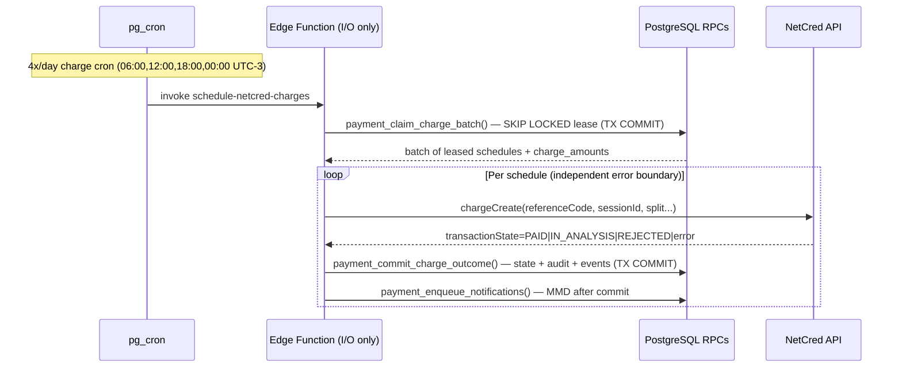
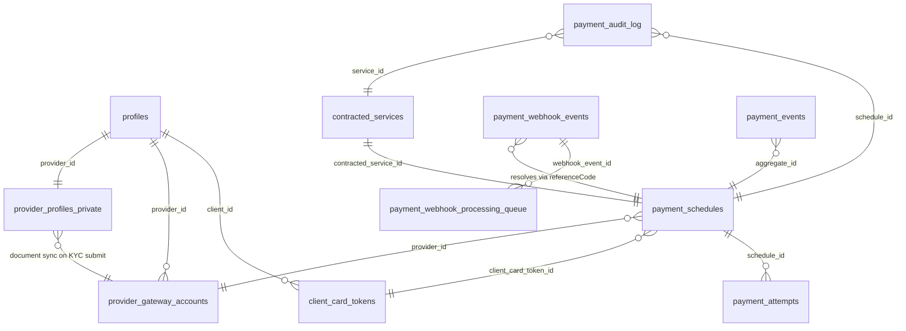
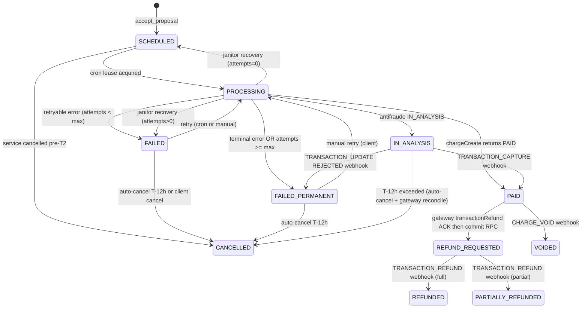
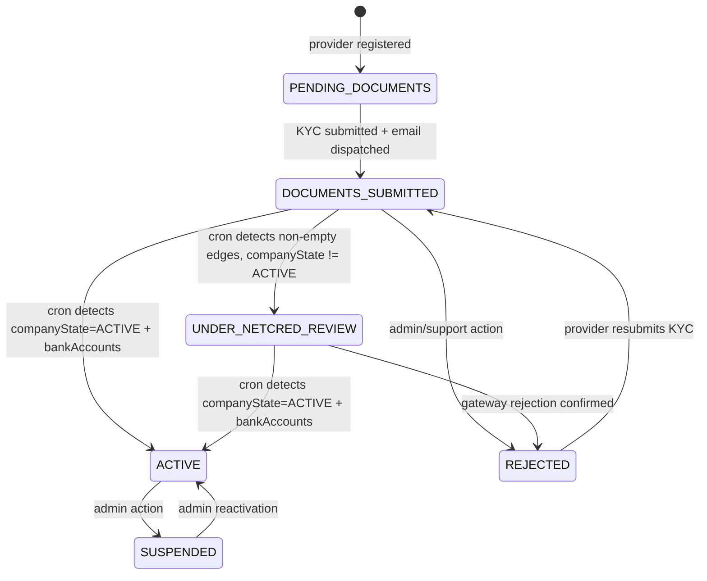
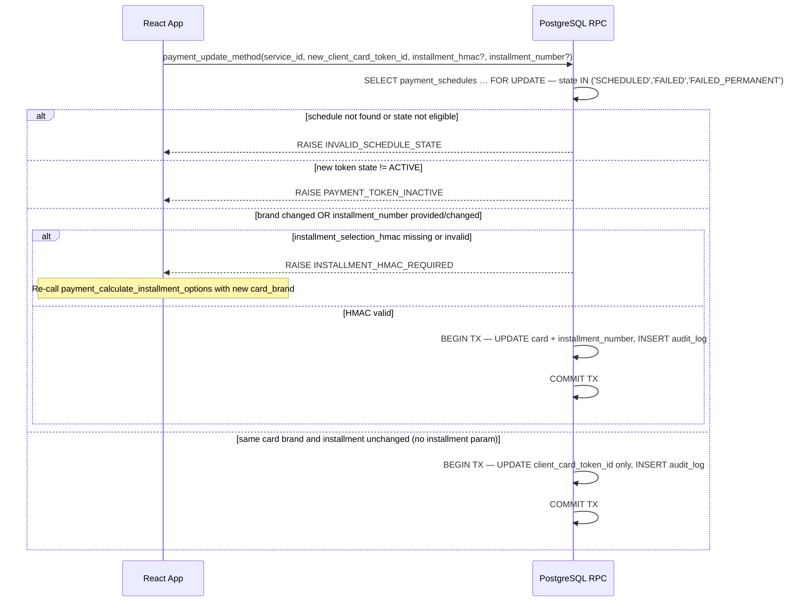
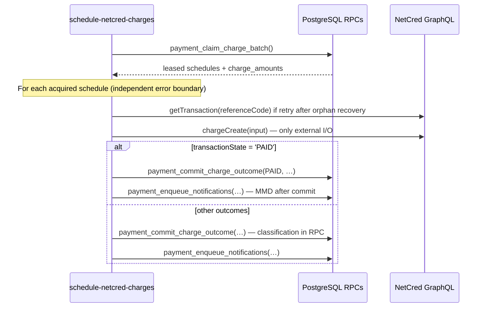
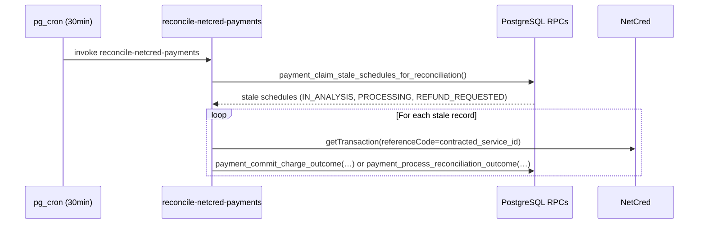
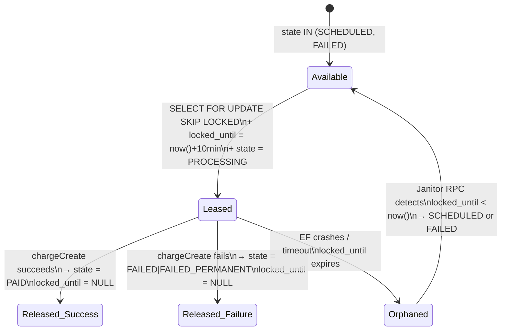

# Prestway Payment System — Design Document

> **Covers:** Requirements 1–33 (all acceptance criteria)
> **Version:** 2.11 — 2026-06-25 (domain decisions validated in grill session; split/commission model; notifications; T-12h/IN_ANALYSIS; see §1.7, [`CONTEXT.md`](./CONTEXT.md), [`ADR-0001`](../adr/0001-payment-split-commission-model.md))
> **Status:** Engineering Review Ready
> **Authors:** Staff Engineering · Principal Architecture
>
> **Aligned with:** [`infrastructure-constraints.md`](../infrastructure-constraints.md), [`concurrency-requirements.md`](../concurrency-requirements.md), [`scalability-requirements.md`](../scalability-requirements.md), [`technical-stack.md`](../technical-stack.md), [`CONTEXT.md`](./CONTEXT.md), [`ADR-0001`](../adr/0001-payment-split-commission-model.md)

---

# 1. Overall Architecture and Component Relationships

## 1.1 Architectural Intent

The Prestway Payment System is a **database-centric, event-driven orchestration layer** embedded within the Orbit marketplace. All authoritative state—payment schedule lifecycle, charge attempt history, webhook events, audit logs, and provider credentialing—lives in PostgreSQL.

**RPC-first rule (Orbit platform):** every operation that is primarily SQL (reads, writes, state machines, eligibility, HMAC validation with Vault secrets, cron batches, notification enqueue via MMD) MUST be implemented as **PostgreSQL RPCs** callable via `supabase.rpc()` or `pg_cron`. **Edge Functions exist only where strictly necessary:** PCI card transit, NetCred GraphQL I/O, webhook HTTP ingress with raw-body HMAC, or other external APIs that Postgres cannot call directly.

Edge Functions are **thin, stateless I/O connectors** — they MUST NOT own business logic, queues, leases, or state transitions. No Edge Function memory is authoritative between invocations.

**Single-gateway (Option A):** MVP uses **NetCred only**. There is **no `payment_providers` registry table**. Non-secret gateway metadata (slug, API base URL, supported methods) lives in **`supabase/functions/_shared/payment/constants.ts`** and Edge env; **NetCred credentials + webhook HMAC** live in **Edge Function secrets**; **installment/pricing HMAC secrets** live in **Supabase Vault** (RPC-only). See [`vault-secrets-runbook.md`](./vault-secrets-runbook.md). Rows store `gateway_slug payment_gateway_slug NOT NULL DEFAULT 'netcred'` — enough for webhook dedup and a future multi-gateway migration without redesigning charge semantics.

The system enforces **exactly-once charge semantics** through a combination of:
- Row-level pessimistic locking (`SELECT … FOR UPDATE SKIP LOCKED`) for queue dequeueing
- Lease-based orphan recovery (janitor RPC via `pg_cron`)
- Gateway-level idempotency (`referenceCode = contracted_service_id`)
- Database UNIQUE constraints (`payment_schedules.idempotency_key`)

## 1.2 Runtime Topology

```mermaid
graph TB
    subgraph client["Client — React 19 / Capacitor"]
        UI["Checkout Stepper\nSaved Cards\nManual Payment UI"]
        CS["ClearSale fp.js SDK\n(Browser/WebView)"]
    end

    subgraph ef["Edge Functions — Deno (external I/O only)"]
        EF_TOK["tokenize-payment-card\n(PCI → NetCred)"]
        EF_CHARGE["schedule-netcred-charges\n(claim RPC → NetCred → commit RPC)"]
        EF_MANUAL["manual-charge-payment\n(begin RPC → NetCred → commit RPC)"]
        EF_WH["netcred-webhook\n(ingress + HMAC → inline or enqueue)"]
        EF_REFUND["process-refund\n(prepare → NetCred → commit)"]
        EF_ONBOARD["detect-netcred-onboarding\n(NetCred batch query)"]
        EF_RECON["reconcile-netcred-payments\n(claim RPC → NetCred → commit RPC)"]
        EF_VOID["reconcile-inanalysis-auto-cancel-voids\n(claim RPC → NetCred void → commit RPC)"]
    end

    subgraph pg["PostgreSQL — Supabase (source of truth)"]
        TBL["payment_* tables\nprovider_gateway_accounts\nplatform_constants"]
        RPC["payment_calculate_installment_options()\naccept_proposal() — payment evolution\npayment_update_method()\npayment_claim_charge_batch / payment_commit_charge_outcome\npayment_process_webhook_event()\npayment_enqueue_webhook_processing()\npayment_cron_process_webhook_retry()\npayment_auto_cancel_services()\npayment_submit_provider_kyc()\npayment_recover_orphaned_schedules()"]
        CRON["pg_cron → payment_cron_*() wrappers\njob_runs telemetry\nMMD ingest via mmd_ingest_event()"]
    end

    subgraph ext["External Services"]
        NC["NetCred GraphQL API"]
        MMD["Message Dispatcher\n(mmd_ingest_event)"]
        VAULT["Supabase Vault\n(secrets read in RPC + EF)"]
    end

    client -->|supabase.rpc()| pg
    client -->|invoke — PCI only| EF_TOK
    CRON -->|payment_cron_*() SQL| pg
    CRON -->|invoke — NetCred I/O| ef
    ef -->|RPC| pg
    ef -->|GraphQL HTTP| NC
    NC -->|webhook POST| EF_WH
    pg -->|enqueue notifications| MMD
```

**Nine Edge Functions** (charge/webhook/onboarding/void I/O plus KYC credenciamento email). Everything else is RPC + `pg_cron`.

## 1.3 Component Responsibilities

| Component | Stateful? | Responsibility |
|---|---|---|
| `payment_schedules` table | Stateful | Authoritative charge queue; state machine source of truth |
| `payment_audit_log` table | Append-only | Immutable event log; dispute resolution backbone |
| `payment_webhook_events` table | Stateful | Raw event ingestion + dedup + retry state |
| `payment_webhook_processing_queue` table | Stateful | Async offload for heavy webhook reconciliation |
| `payment_attempts` table | Append-only | Per-attempt history; analytics and diagnostics |
| `provider_gateway_accounts` table | Stateful | Provider credentialing state machine |
| `platform_constants` table | Configuration | Configurable rates, limits; no code deployment needed |
| **PostgreSQL RPCs** | Stateless | All mutations, eligibility, HMAC (Vault), cron batches, webhook state machine, MMD enqueue |
| `payment_cron_*()` wrappers | Stateless | `pg_cron` entrypoints with `job_runs` telemetry (product crons) |
| `schedule-netcred-charges` EF | Stateless | **I/O only:** `payment_claim_charge_batch` RPC → NetCred `chargeCreate` loop → `payment_commit_charge_outcome` RPC |
| `netcred-webhook` EF | Stateless | **Ingress only:** persist raw body → HMAC validate → inline `payment_process_webhook_event` OR `payment_enqueue_webhook_processing` RPC |
| `manual-charge-payment` EF | Stateless | **I/O only:** `payment_begin_manual_attempt` RPC → NetCred → `payment_commit_charge_outcome` RPC |
| `tokenize-payment-card` EF | Stateless | **PCI only:** forward card to NetCred; persist token metadata via RPC |
| `NetCredAdapter` (TypeScript) | Stateless | Gateway translation; JWT refresh; used **only** by the payment EFs above |
| React Checkout Stepper | Ephemeral | UI orchestration; ClearSale SDK injection; calls RPCs via feature `api/` layer |

## 1.4 RPC vs Edge Function Decision Matrix

| Operation | Layer | Rationale |
|---|---|---|
| Installment options + HMAC signing | **RPC** `payment_calculate_installment_options` | Fee formula + Vault HMAC (same pattern as `generate_provider_pricing_signature`) |
| Accept proposal + schedule creation | **RPC** `accept_proposal` (payment evolution) | Atomic TX; `auth.uid()`; idempotency via `UNIQUE(idempotency_key)` |
| Update payment method | **RPC** `payment_update_method` | `FOR UPDATE` + audit; HMAC revalidation in SQL |
| KYC submission | **RPC** `payment_submit_provider_kyc` + **`dispatch-kyc-email` EF** | Persist KYC + private Storage paths in TX; EF downloads docs and emails attachments to NetCred |
| Auto-cancel T-12h | **RPC** `payment_cron_auto_cancel_unpaid_services` | Batch + per-row `EXCEPTION`; MMD enqueue after commit |
| Pre-charge notification | **RPC** `payment_cron_notify_upcoming_charges` | Claim + `upcoming_charge_notified_at` + MMD |
| Auto-complete executed | **Moved** → `service_completion_cron_auto_complete_executed` ([ADR-0004](../service-completion/adr/0004-completion-rpcs-outside-payments.md)) | Batch COMPLETED + MMD; **not** a payment product writer |
| Webhook retry / dead letter | **RPC** `payment_cron_process_webhook_retry` | Claim `payment_webhook_processing_queue` PENDING + `FAILED` events → `payment_process_webhook_event` |
| Orphan lease recovery | **RPC** `payment_cron_recover_orphaned_schedules()` → `payment_recover_orphaned_schedules()` | `pg_cron` wrapper + `job_runs`; no EF |
| Card tokenization | **EF** `tokenize-payment-card` | PCI: raw PAN/CVV must not touch Postgres |
| Charge / refund / reconcile | **EF** (thin) | NetCred GraphQL; DB work in claim/commit RPCs |
| Webhook HTTP ingress | **EF** `netcred-webhook` | External POST + raw-body HMAC before parsing |
| Onboarding detection | **EF** `detect-netcred-onboarding` | NetCred batch GraphQL (50 aliases) |

## 1.5 Transactional vs Async Boundaries

| Operation | Boundary | Rationale |
|---|---|---|
| Lease acquisition + `state = PROCESSING` | **Synchronous, single DB TX** | Prevents concurrent workers from claiming same record |
| Final state commit (PAID/FAILED) + audit INSERT | **Synchronous, single DB TX** | Atomicity guarantee: state and audit always consistent |
| Notification enqueueing | **Async** (enqueue to dispatcher) | Notification failure MUST NOT revert payment state |
| Webhook raw persistence | **Synchronous, before validation** | Events logged even if processing fails |
| Webhook state reconciliation | **Synchronous, single DB TX** | State + audit commit atomically |
| `transactionRefund` submission | **Synchronous gateway first; then RPC sets REFUND_REQUESTED + SUBMITTED** | Confirmation (`REFUNDED`) via webhook/reconcile is async |
| KYC email dispatch | **Async** (`dispatch-kyc-email` EF after RPC commit) | Email failure MUST NOT block `DOCUMENTS_SUBMITTED`; EF retries; `email_dispatched_at` set on success |
| Installment recalculation at charge time | **Synchronous, within cron TX** | Fee MUST be accurate at charge time using current rates |
| Service completion (EXECUTED→COMPLETED) | **Synchronous, single DB TX** | Status + audit atomic |
| Auto-completion (24h after EXECUTED) | **Async** (cron) | Client inaction must not block finalization |

## 1.6 Scheduling Topology



**All payment pg_cron jobs** invoke **`payment_cron_*()` wrappers only** (never batch RPCs or Edge Functions directly). Every wrapper records telemetry in `public.job_runs` per [`job-runs-cron-telemetry`](../.cursor/rules/job-runs-cron-telemetry.mdc).

```sql
-- Examples (scheduled via pg_cron — wrapper owns job_runs)
SELECT public.payment_cron_schedule_netcred_charges();
SELECT public.payment_cron_auto_cancel_unpaid_services();
SELECT public.payment_cron_notify_upcoming_charges();
-- auto-complete: SELECT public.service_completion_cron_auto_complete_executed(); (ADR-0004)
SELECT public.payment_cron_process_webhook_retry();
SELECT public.payment_cron_recover_orphaned_schedules();
SELECT public.payment_cron_detect_netcred_onboarding();
SELECT public.payment_cron_reconcile_netcred_payments();
```

## 1.7 Consolidated domain decisions (validated 2026-06-25)

Authoritative glossary: [`CONTEXT.md`](./CONTEXT.md). Split rationale: [`ADR-0001`](../adr/0001-payment-split-commission-model.md). This section removes ambiguity for implementers; if any older paragraph elsewhere contradicts §1.7, **§1.7 wins**.

### 1.7.1 Aggregates

| Aggregate | Table | Role |
|---|---|---|
| **Contracted Service** | `contracted_services` | Product lifecycle: `PENDING_PAYMENT` → `CONFIRMED` → `EXECUTED` → `COMPLETED` |
| **Payment Schedule** | `payment_schedules` | Charge orchestration: cron, leases, retries, webhooks, antifraude |

Two aggregates, 1:1, coupled only at atomic boundaries (`PAID`→`CONFIRMED`, cancel, refund). Payment states (`PROCESSING`, `IN_ANALYSIS`, `FAILED_PERMANENT`, …) MUST NOT be folded into `contracted_services.status`.

### 1.7.2 Provider visibility and confirmation

| Rule | Behavior |
|---|---|
| Calendar | Provider sees service **only** after `PAID` → `CONFIRMED` |
| `PENDING_PAYMENT` / `IN_ANALYSIS` | Client sees service; provider **does not** see calendar |
| At accept | Provider MAY receive push: *"Cliente aceitou sua proposta — aguardando confirmação do pagamento"* — **never** "trabalho confirmado" |
| At `PAID` | Push **"trabalho confirmado"** + calendar entry |
| Emergency (`<24h` to service after `PAID`) | Provider urgent push (MMD bypass priority) |

### 1.7.3 Scheduling anchor

- **Function:** `payment_service_execution_at(contracted_services)` — sole name in code and docs.
- **Formula:** `(scheduled_start_date + shift start) AT TIME ZONE 'America/Sao_Paulo'` — `morning`/`full_day` = 08:00, `afternoon` = 13:00.
- **Multi-day jobs:** anchor on `scheduled_start_date` only.
- **Shift times:** business reference for payment/refund windows — **not** physical arrival SLA.
- **EXECUTED self-serve:** `service_completion_mark_executed` (checklist + BRT temporal rules) — **not** `payment_mark_service_executed` (DROPped; ADR-0004). Payment/refund still use the timestamptz helper.

### 1.7.4 Money model and split ([`ADR-0001`](../adr/0001-payment-split-commission-model.md))

| Field | Meaning | Frozen at accept? |
|---|---|---|
| `base_amount` | Proposal price to client (ex.: R$ 1.000) | Yes |
| `commission_rate_pct` | From accepted proposal `tax_rate` (`× 100`, frozen at proposal) | Yes |
| `provider_payout` | From accepted proposal `final_amount` (ex.: R$ 850) | Yes |
| `charge_amount` | `base_amount` + card fees (ex.: R$ 1.030) | **No** — recalculated at T-2 (fee drift) |
| `paid_amount` | Captured total when `PAID` | Set at capture |

**NetCred split at `chargeCreate`:**

```
provider ruleItem:  FIXED_AMOUNT = provider_payout
prestway ruleItem:    PERCENTAGE 100% of (charge_amount − provider_payout)
both:               isLiable = true
```

**Example:** R$ 1.030 charge → provider R$ 850, Prestway gross R$ 180 → after MDR (~R$ 30) Prestway net ~R$ 150 (commission).

**Checkout disclosures (mandatory):** (1) card fees recalculated at charge date; (2) provider net receivable shown on proposal; (3) charge timing (T-2 or emergency).

### 1.7.5 Refunds (ToS §2.2)

- **`FULL_REFUND`** (client >48h) and provider-initiated cancel: `refund_amount = charge_amount` (includes card fees).
- **`PENALTY_10` / `PENALTY_30`**: computed on **`base_amount`** only; card fees (`charge_amount − base_amount`) are not refunded on penalty tiers.
- Gateway clawback proportional: provider share = `refunded_amount × (provider_payout / paid_amount)`.

### 1.7.6 Credentialing invariants

- **`REJECTED`:** terminal **pre-`ACTIVE` only**. An `ACTIVE` provider never transitions to `REJECTED`; post-activation sanction is **`SUSPENDED`**.
- **`accept_proposal`:** requires `onboarding_status = 'ACTIVE'`.
- **`SUSPENDED` + `PENDING_PAYMENT`:** cron skips charge; **immediate** client notification + voluntary cancel (no penalty); auto-cancel at T-12h with `PROVIDER_SUSPENDED`; reactivation does **not** auto-resume charge (ops unfreezes per case).

### 1.7.7 Time thresholds

| Threshold | Behavior |
|---|---|
| **T-2** | `charge_scheduled_at = payment_service_execution_at − 48h` (or `now()` if emergency) |
| **T-12h auto-cancel** | Unpaid schedules (`SCHEDULED`, `FAILED`, `FAILED_PERMANENT`, …) → `CANCELLED` / `NON_PAYMENT` |
| **`IN_ANALYSIS` before T-12h** | Auto-cancel **suspended**; client cancel **blocked** (`PAYMENT_IN_ANALYSIS`) |
| **`IN_ANALYSIS` after T-12h** | Auto-cancel + gateway reconcile (`chargeVoid` if not captured; webhook if captured) |
| **Pre-`PAID` client cancel** | Always allowed (no gateway), except blocked during `IN_ANALYSIS` until T-12h rule above |

### 1.7.8 Rescheduling

- **Pre-`PAID`:** recalculates `charge_scheduled_at`, T-12h, pre-charge notification.
- **Post-`PAID` near (`payment_service_execution_at ≤ paid_at + far_reschedule_recapture_threshold_days`, default 15):** allowed while `contracted_services.status = 'CONFIRMED'` only (not after `EXECUTED`); updates slot columns; **no new charge**; refund tiers use **new** `payment_service_execution_at`; provider notified by rescheduling subsystem. Threshold is anchored on `paid_at` (settlement clock), not `now()`.
- **Post-`PAID` far (`exec_at > paid_at + threshold`):** outcome `paid_far_recapture_required` — set `far_recapture_pending_at`, wake `process-far-reschedule-recapture` via `orbit_invoke_edge_function` (pg_net); safety-net cron reclaims orphans. Gateway **full refund first**, then atomic commit: old schedule → `REFUNDED` (`FAR_RESCHEDULE_RECAPTURE`), new `SCHEDULED` at T-2 (`supersedes_schedule_id`, cycle `idempotency_key`), CS → `PENDING_PAYMENT`. **Does not** cancel service or close chat. ClearSale session/IP copied to the new schedule; if charge fails weeks later, existing `FAILED` + manual payment path applies.

### 1.7.9 Notifications (MMD)

| Event | Client | Provider |
|---|---|---|
| `FAILED_PERMANENT` | Push + Email (bypass) | Push: *aceite recebido, pagamento não concluído, serviço não confirmado, sem ação* |
| Pre-charge reminder | Push + Email 24h before `charge_scheduled_at` | **No notification** |
| `TRANSACTION_DISPUTE` | Push neutral + badge "Chargeback em análise" | Same |
| Pre-`PAID` client cancel | Confirmation | Push: *cliente cancelou — serviço não confirmado* |
| `PAID` → `CONFIRMED` | Success | Confirmed + calendar (+ urgent if `<24h`) |

### 1.7.10 ClearSale, completion, settlement

- **ClearSale cron T-2:** reuse `clearsale_session_id` from accept (~48h). **Manual retry:** fresh SDK UUID required.
- **Bank settlement:** Netcred liquidates on its schedule (card often ≈ D+30); **not** gated by `EXECUTED`/`COMPLETED`. Persist real movements in `payment_settlement_movements` (§3.13). Provider UI prefers `settling_at` / `settled_at` from that table; fallback estimate remains `paid_at + 30 days` when no movement exists yet.
- **Chargeback:** `is_disputed = true`; service status unchanged; `COMPLETED` not blocked; ops resolves manually (MVP).

### 1.7.11 Payment history views

| Role | Primary columns |
|---|---|
| Client | `paid_amount`, `base_amount` (service value), refunds |
| Provider (capture) | `provider_payout` at capture, net after proportional refund |
| Provider (bank) | Settlement movements (`settling_at` / `settled_at` / `net_amount`) — Ganhos UI |
| Never | Provider sees `paid_amount`; client sees `provider_payout` as "service price" |

---


# 2. Data Models and Relationships

## 2.1 Entity Relationship Diagram



## 2.2 Entity Ownership and Lifecycle Semantics

| Entity | State Machine? | Immutable? | Owner | Lifecycle |
|---|---|---|---|---|
| `payment_schedules` | Yes (11 states) | No | Platform (cron) | Created at acceptance; terminal at PAID/CANCELLED/REFUNDED |
| `payment_attempts` | No | Yes (append-only) | Cron / client | INSERT per attempt; never updated |
| `payment_audit_log` | No | Yes (INSERT-only) | All actors | INSERT per state transition; no UPDATE/DELETE |
| `client_card_tokens` | Yes (4 states) | No | Client | Created at tokenization; REVOKED on removal |
| `payment_webhook_events` | Yes (7 states) | Partially | Webhook handler | State progresses; raw_payload immutable |
| `payment_webhook_processing_queue` | Yes (4 states) | No | Webhook worker (cron) | Enqueued for heavy reconciliation; drained by `payment_cron_process_webhook_retry` |
| `provider_gateway_accounts` | Yes (6 states) | No | Cron / Admin | Created at KYC submission; `document` synced from profile on submit |
| `provider_profiles_private` | No | No (overwrite) | Provider | KYC legal/bank/doc data; 1 row per provider; no submission history table |
| `payment_events` | No | Yes | All transitions | Domain event log; analytics backbone |
| `payment_gateway_tokens` | No | No | Adapter | 1 row/gateway; upserted on refresh |
| `platform_constants` | No | No | Ops (DB update) | Read-only by functions |

## 2.3 State Machines

### Payment Schedule State Machine



### Provider Credentialing State Machine



---

# 3. Table Schemas with Constraints

**Nine new payment tables** (`CREATE`): `payment_gateway_tokens`, `client_card_tokens`, `provider_gateway_accounts`, `payment_schedules`, `payment_attempts`, `payment_webhook_events`, `payment_webhook_processing_queue`, `payment_audit_log`, `payment_events` — plus seed rows in existing `platform_constants`.

**RLS (mandatory):** every new `payment_*` table MUST ship with **strong, least-privilege RLS** in the same migration as `CREATE TABLE`. Default posture is **deny-all**; grant only the minimum `SELECT` / `INSERT` / `UPDATE` / `DELETE` needed for the product to function. Direct client writes to payment state MUST be blocked — mutations go through `SECURITY DEFINER` RPCs with in-function authorization. Full rules: §11.2.

**Existing tables extended (ALTER):** `contracted_services` (payment lifecycle columns + enum values — **no** `service_scheduled_at`; scheduling anchor via `payment_service_execution_at()`, see §3.0), `provider_profiles_private` (KYC/banking/document columns — see §3.11), `platform_constants` (payment seed keys only). Provider mobile phone for KYC/email reuses **`profiles.phone`** (not duplicated in `provider_profiles_private`).

**Payment enum types** (migration `20260801030000_payment_schema_foundation.sql`, same pattern as CNS `create_cns_enums`):

| Type | Used on |
|---|---|
| `payment_gateway_slug` | `gateway_slug` columns (`netcred` at MVP) |
| `payment_schedule_state` | `payment_schedules.state` |
| `payment_client_card_token_state` | `client_card_tokens.state` |
| `payment_provider_onboarding_status` | `provider_gateway_accounts.onboarding_status` |
| `payment_attempt_initiator` | `payment_attempts.initiator` |
| `payment_attempt_outcome` | `payment_attempts.outcome` (nullable) |
| `payment_webhook_event_state` | `payment_webhook_events.state` |
| `payment_webhook_queue_state` | `payment_webhook_processing_queue.state` |
| `payment_audit_actor` | `payment_audit_log.actor` |

`payment_audit_log.from_state` / `to_state` remain **TEXT** (transition labels may differ by entity). Extend enums with `ALTER TYPE … ADD VALUE` when new states are added.

## 3.0 `contracted_services` — payment extensions (existing table)

**Do not add `service_scheduled_at`.** The CNS schema already persists the agreed slot at accept time:

| Column | Role |
|---|---|
| `scheduled_start_date` | First day of service execution (`DATE`, NOT NULL) |
| `scheduled_end_date` | Inclusive end date when `duration_unit = 'days'`; `NULL` for hourly jobs |
| `scheduled_shift` | `morning` \| `afternoon` \| `full_day` |
| `agreed_slot` | Immutable JSON snapshot of `p_selected_slot` at accept |

Payment timing (T-2 charge, T-12h auto-cancel, refund tiers, manual-payment gate) uses a **derived timestamptz**, not a duplicate column.

### `payment_service_execution_at(cs)` — canonical scheduling instant

```sql
-- Immutable helper: STABLE, pure function of contracted_services row
CREATE OR REPLACE FUNCTION public.payment_service_execution_at(p_cs public.contracted_services)
RETURNS timestamptz
LANGUAGE sql
STABLE
AS $$
  SELECT (
    p_cs.scheduled_start_date::timestamp
    + CASE p_cs.scheduled_shift
        WHEN 'morning'   THEN time '08:00'
        WHEN 'afternoon' THEN time '13:00'
        WHEN 'full_day'  THEN time '08:00'
      END
  ) AT TIME ZONE 'America/Sao_Paulo';
$$;
```

**Rules:**
- **Anchor date** is always `scheduled_start_date` (start of work), never `scheduled_end_date`.
- **Timezone** is `America/Sao_Paulo` for all payment comparisons (cron, T-12h, refund windows).
- **Reagendamento** updates `scheduled_start_date` / `scheduled_end_date` / `scheduled_shift`; all payment RPCs re-read `payment_service_execution_at(cs)` — no separate sync column.
- **EXECUTED self-serve** is owned by service-completion (`service_completion_mark_executed` — BRT date-only + checklist). Payment uses the timestamptz helper for hour-precision charge/refund thresholds. Do **not** reintroduce `payment_mark_service_executed`.

**New columns on `contracted_services` (payment migration only):**

```sql
ALTER TYPE public.contracted_service_status ADD VALUE IF NOT EXISTS 'CONFIRMED';
ALTER TYPE public.contracted_service_status ADD VALUE IF NOT EXISTS 'EXECUTED';

ALTER TABLE public.contracted_services
  ADD COLUMN IF NOT EXISTS cancellation_reason TEXT,
  ADD COLUMN IF NOT EXISTS executed_at           TIMESTAMPTZ,
  ADD COLUMN IF NOT EXISTS completed_at          TIMESTAMPTZ,
  ADD COLUMN IF NOT EXISTS completed_by          TEXT CHECK (completed_by IN ('client', 'system'));
```

## 3.1 Gateway configuration — single provider (Option A)

**No `payment_providers` table.** At MVP scale the platform integrates with **one PSP (NetCred)**. Splitting config between Vault (secrets) and code (non-secrets) avoids a one-row registry table and extra joins.

| Concern | Location | Notes |
|---|---|---|
| Gateway slug | `PAYMENT_GATEWAY_SLUG = 'netcred'` in `_shared/payment/constants.ts` | Copied into `gateway_slug` columns at INSERT |
| GraphQL API base URL | `NETCRED_API_BASE_URL` (Edge env / `.env.example`) | Not in Postgres |
| Webhook ingress path | `supabase/functions/netcred-webhook` + `config.toml` | Not in Postgres |
| Username / password / webhook secret | **Edge Function secrets** | `NETCRED_*`, `NETCRED_WEBHOOK_SECRET` (see [`vault-secrets-runbook.md`](./vault-secrets-runbook.md)) |
| Installment / pricing HMAC secrets | **Supabase Vault** | Read inside RPCs (`vault.decrypted_secrets`) |
| JWT cache (mutable) | `payment_gateway_tokens` | One row: `gateway_slug = 'netcred'` |
| Supported methods (MVP) | Constant `['CREDIT_CARD']` in TypeScript | Pix/Boleto = code change + migration when added |

**DB enforcement:** every table that carries `gateway_slug` uses type **`payment_gateway_slug`** (MVP value: `'netcred'`). FSM state columns use the enum types listed in §3 introduction — not `TEXT` + `CHECK` validators.

**Future second gateway:** requires `ALTER TYPE payment_gateway_slug ADD VALUE …` (or a registry table) + new adapter — not in MVP scope.

## 3.2 `payment_gateway_tokens`

```sql
CREATE TABLE payment_gateway_tokens (
  gateway_slug   payment_gateway_slug PRIMARY KEY DEFAULT 'netcred',
  token          TEXT        NOT NULL,  -- JWT from NetCred tokenAuth; not the Vault password
  expires_at     TIMESTAMPTZ NOT NULL,
  refreshed_at   TIMESTAMPTZ NOT NULL DEFAULT now(),
  created_at     TIMESTAMPTZ NOT NULL DEFAULT now(),
  updated_at     TIMESTAMPTZ NOT NULL DEFAULT now()
);
-- Single row (gateway_slug = 'netcred'). Accessed only via service_role (Edge Functions).
-- SELECT FOR UPDATE serializes concurrent refresh attempts.
-- Edge secrets hold NetCred username/password used to obtain this JWT.
```

**Invariant:** `expires_at - now() >= 60 minutes` at read time; otherwise refresh is triggered. The `FOR UPDATE` lock prevents thundering-herd refreshes when multiple workers start simultaneously.

## 3.3 `client_card_tokens`

```sql
CREATE TABLE client_card_tokens (
  id                          UUID        PRIMARY KEY DEFAULT gen_random_uuid(),
  client_id                   UUID        NOT NULL REFERENCES profiles(id),
  gateway_slug                payment_gateway_slug NOT NULL DEFAULT 'netcred',
  gateway_payment_profile_id TEXT        NOT NULL,  -- NetCred paymentProfile.id
  netcred_company_id          TEXT        NOT NULL,  -- companyId used at tokenization
  card_number_masked          TEXT        NOT NULL,  -- '497010XXXXXX0048'
  card_brand                  TEXT        NOT NULL,  -- 'VCC','MASTER','ELO',...
  gateway_card_token         TEXT        NOT NULL,  -- NetCred paymentProfile.token
  expiry_month                SMALLINT    NOT NULL CHECK (expiry_month BETWEEN 1 AND 12),
  expiry_year                 SMALLINT    NOT NULL CHECK (expiry_year >= extract(year FROM now())::smallint),
  cardholder_name             TEXT        NOT NULL,
  billing_address             JSONB       NOT NULL,  -- {street,number,district,city,state,zipCode,additionalDetails}
  state                       payment_client_card_token_state NOT NULL DEFAULT 'ACTIVE',
  created_at                  TIMESTAMPTZ NOT NULL DEFAULT now(),
  updated_at                  TIMESTAMPTZ NOT NULL DEFAULT now(),
  UNIQUE (client_id, gateway_payment_profile_id)
);
-- PCI constraint: NO columns for raw PAN or CVV.
CREATE INDEX idx_client_card_tokens_client_state ON client_card_tokens(client_id, state);
-- RLS on base table: (select auth.uid()) = client_id for SELECT; mutations via service_role only.
-- Invariant: accept/charge/update_method MUST reject when token.netcred_company_id
-- differs from Prestway platform company (Vault netcred_platform_company_id / Edge NETCRED_PLATFORM_COMPANY_ID).
-- ChargeCreate.companyId is the provider merchant (payout banks); cards tokenize under platform.
```

### `client_card_tokens_safe_v` (client read model)

**Product intent:** the authenticated client app MUST read saved cards from this view, **not** from `client_card_tokens` directly. The base table still holds `gateway_payment_profile_id`, `gateway_card_token`, `netcred_company_id`, and `billing_address` for charge RPCs and Edge Functions (`service_role`).

| Surface | Columns exposed | Must not expose |
|---|---|---|
| `client_card_tokens_safe_v` | id, client_id, gateway_slug, card_number_masked, card_brand, expiry_month, expiry_year, cardholder_name, state, created_at, updated_at | `gateway_payment_profile_id`, `gateway_card_token`, `billing_address`, `netcred_company_id` |
| `client_card_tokens` (base) | Full row | Client browser — `service_role` / tokenize EF / charge pipeline only |

```sql
CREATE VIEW public.client_card_tokens_safe_v
WITH (security_invoker = true) AS
SELECT
  cct.id,
  cct.client_id,
  cct.gateway_slug,
  cct.card_number_masked,
  cct.card_brand,
  cct.expiry_month,
  cct.expiry_year,
  cct.cardholder_name,
  cct.state,
  cct.created_at,
  cct.updated_at
FROM public.client_card_tokens cct;

COMMENT ON VIEW public.client_card_tokens_safe_v IS
  'Client-facing card token read model; excludes gateway refs, company id, and billing_address (PCI).';
```

**Frontend contract:** `src/features/payments/api/cards.api.ts` (`listActivePaymentTokens`, `fetchPaymentTokenById`) queries `client_card_tokens_safe_v`. Checkout stepper saved-card selection, card picker UI, and any client-side listing MUST use this API module — never `.from('client_card_tokens')` in hooks/components.

**RLS:** `security_invoker = true` — the view inherits `client_card_tokens_select_own` on the base table (`auth.uid() = client_id`).

**PCI Invariant:** The schema CHECK constraints plus RLS policies enforce PCI DSS data-at-rest scope limitation. `gateway_payment_profile_id`, `gateway_card_token`, and `netcred_company_id` are gateway-scoped references on the base table; they MUST NOT be returned to the client UI (no authenticated column GRANT; omitted from `safe_v`).

## 3.4 `provider_gateway_accounts`

```sql
CREATE TABLE provider_gateway_accounts (
  id                        UUID        PRIMARY KEY DEFAULT gen_random_uuid(),
  provider_id          UUID        NOT NULL REFERENCES profiles(id),
  gateway_slug              payment_gateway_slug NOT NULL DEFAULT 'netcred',
  document                  TEXT        NOT NULL,   -- CPF or CNPJ, digits only
  netcred_company_id        TEXT,                   -- populated on ACTIVE
  netcred_bank_account_id   TEXT,                   -- populated on ACTIVE
  onboarding_status         payment_provider_onboarding_status NOT NULL DEFAULT 'PENDING_DOCUMENTS',
  onboarding_submitted_at   TIMESTAMPTZ,
  onboarding_activated_at   TIMESTAMPTZ,
  email_dispatched_at       TIMESTAMPTZ,  -- set when KYC email confirmed sent
  created_at                TIMESTAMPTZ NOT NULL DEFAULT now(),
  updated_at                TIMESTAMPTZ NOT NULL DEFAULT now(),
  UNIQUE (provider_id, gateway_slug)  -- one NetCred account per provider at MVP
);
CREATE INDEX idx_provider_gateway_accounts_status ON provider_gateway_accounts(onboarding_status)
  WHERE onboarding_status IN ('DOCUMENTS_SUBMITTED','UNDER_NETCRED_REVIEW');
-- Partial index optimizes onboarding cron query.
```

**Invariant:** `netcred_company_id` and `netcred_bank_account_id` MUST both be non-NULL before `onboarding_status = 'ACTIVE'` can be committed. Enforced in the RPC, not just via CHECK constraint, because the values come from an external batch query.

## 3.5 `payment_schedules`

```sql
CREATE TABLE payment_schedules (
  id                          UUID        PRIMARY KEY DEFAULT gen_random_uuid(),
  contracted_service_id       UUID        NOT NULL REFERENCES contracted_services(id),
  client_id                   UUID        NOT NULL,
  provider_id                 UUID        NOT NULL,  -- service provider entity
  gateway_slug                payment_gateway_slug NOT NULL DEFAULT 'netcred',
  client_card_token_id            UUID        REFERENCES client_card_tokens(id),
  installment_number          SMALLINT    NOT NULL CHECK (installment_number BETWEEN 1 AND 12),
  base_amount                 NUMERIC(12,2) NOT NULL CHECK (base_amount > 0),
  commission_rate_pct         NUMERIC(5,2)  NOT NULL CHECK (commission_rate_pct >= 0),
  provider_payout             NUMERIC(12,2) NOT NULL CHECK (provider_payout > 0),
  charge_scheduled_at         TIMESTAMPTZ NOT NULL,
  state                       payment_schedule_state NOT NULL DEFAULT 'SCHEDULED',
  automatic_attempt_count     SMALLINT    NOT NULL DEFAULT 0,
  manual_attempt_count        SMALLINT    NOT NULL DEFAULT 0,
  max_attempts                SMALLINT    NOT NULL DEFAULT 3,
  locked_until                TIMESTAMPTZ,
  next_retry_at               TIMESTAMPTZ,
  idempotency_key             TEXT        NOT NULL UNIQUE,  -- = contracted_service_id
  clearsale_session_id        TEXT,                         -- UUID from ClearSale SDK at checkout
  client_ip_address           TEXT,                         -- IP at acceptance time
  upcoming_charge_notified_at TIMESTAMPTZ,                  -- 24h pre-charge notification sent
  is_disputed                 BOOLEAN     NOT NULL DEFAULT FALSE,
  needs_payment_method_update BOOLEAN     NOT NULL DEFAULT FALSE,
  gateway_charge_id          TEXT,                         -- netcred_charge_id
  gateway_transaction_id     TEXT,                         -- netcred_transaction_id
  paid_at                     TIMESTAMPTZ,
  failed_at                   TIMESTAMPTZ,
  failed_permanently_at       TIMESTAMPTZ,
  cancelled_at                TIMESTAMPTZ,
  refunded_at                 TIMESTAMPTZ,
  paid_amount                 NUMERIC(12,2),
  refunded_amount             NUMERIC(12,2),
  failure_code                TEXT,
  failure_reason              TEXT,
  cancellation_reason         TEXT,
  reconciliation_failure_count SMALLINT  NOT NULL DEFAULT 0,
  created_at                  TIMESTAMPTZ NOT NULL DEFAULT now(),
  updated_at                  TIMESTAMPTZ NOT NULL DEFAULT now()
);

-- Critical index for cron queue dequeue:
CREATE INDEX idx_payment_schedules_queue ON payment_schedules
  (charge_scheduled_at, state, locked_until, next_retry_at)
  WHERE state IN ('SCHEDULED','FAILED');

-- Idempotency: prevents duplicate schedule creation on accept_proposal retries
CREATE UNIQUE INDEX idx_payment_schedules_idempotency ON payment_schedules(idempotency_key);

-- Lookup by contracted_service_id (webhook reconciliation, cancellation)
CREATE INDEX idx_payment_schedules_service ON payment_schedules(contracted_service_id);

-- Reconciliation cron: stale intermediate states
CREATE INDEX idx_payment_schedules_stale ON payment_schedules(state, updated_at)
  WHERE state IN ('IN_ANALYSIS','PROCESSING','REFUND_REQUESTED');
```

**Concurrency invariants:**
- `locked_until` + `SKIP LOCKED` prevents double-processing
- `idempotency_key UNIQUE` prevents duplicate schedule on `accept_proposal` retry
- `automatic_attempt_count` increments atomically within the same TX as `state = PROCESSING`
- `max_attempts` is stored per row for informational reference; the **charge cron always evaluates eligibility against the CURRENT `platform_constants.max_charge_attempts`** value (not the stored row value), so existing `FAILED` schedules are reconsidered when the constant is updated (Req 11 AC7)

## 3.6 `payment_attempts`

```sql
CREATE TABLE payment_attempts (
  id                      UUID        PRIMARY KEY DEFAULT gen_random_uuid(),
  schedule_id             UUID        NOT NULL REFERENCES payment_schedules(id),
  attempt_number          SMALLINT    NOT NULL,
  initiator               payment_attempt_initiator NOT NULL,
  initiated_at            TIMESTAMPTZ NOT NULL DEFAULT now(),
  completed_at            TIMESTAMPTZ,
  outcome                 payment_attempt_outcome,
  provider_response_summary JSONB,
  failure_code            TEXT,
  failure_reason          TEXT,
  charge_amount           NUMERIC(12,2),
  gateway_latency_ms      INT,
  created_at              TIMESTAMPTZ NOT NULL DEFAULT now()
);
CREATE INDEX idx_payment_attempts_schedule ON payment_attempts(schedule_id, attempt_number);
-- Append-only: no UPDATE/DELETE permissions for application role.
```

## 3.7 `payment_webhook_events`

```sql
CREATE TABLE payment_webhook_events (
  id                TEXT        PRIMARY KEY DEFAULT gen_random_uuid()::text,
  gateway_slug      payment_gateway_slug NOT NULL,
  event_type        TEXT        NOT NULL,
  gateway_event_id TEXT        NOT NULL,
  raw_payload       JSONB       NOT NULL,
  raw_headers       JSONB       NOT NULL,
  state             payment_webhook_event_state NOT NULL DEFAULT 'RECEIVED',
  retry_count       SMALLINT    NOT NULL DEFAULT 0,
  next_retry_at     TIMESTAMPTZ,
  processed_at      TIMESTAMPTZ,
  failure_reason    TEXT,
  is_duplicate      BOOLEAN     NOT NULL DEFAULT FALSE,
  created_at        TIMESTAMPTZ NOT NULL DEFAULT now(),
  updated_at        TIMESTAMPTZ NOT NULL DEFAULT now(),
  UNIQUE (gateway_slug, event_type, gateway_event_id)  -- deduplication constraint
);
CREATE INDEX idx_webhook_events_retry ON payment_webhook_events(state, next_retry_at)
  WHERE state = 'FAILED';
CREATE INDEX idx_webhook_events_dead_letter ON payment_webhook_events(state, created_at)
  WHERE state = 'DEAD_LETTER';
```

**Dedup semantics:** The UNIQUE constraint on `(gateway_slug, event_type, gateway_event_id)` is the primary deduplication mechanism. On conflict, the handler sets `is_duplicate = true` and returns HTTP 200 without reprocessing.

## 3.8 `payment_webhook_processing_queue`

Heavy webhook reconciliation runs **outside** the Edge Function response window. After HMAC validation, the EF either calls `payment_process_webhook_event` inline (fast path) or `payment_enqueue_webhook_processing` (heavy path). The queue is drained by **`payment_cron_process_webhook_retry()`** every 5 minutes — same cron as dead-letter recovery on `payment_webhook_events`.

```sql
CREATE TABLE payment_webhook_processing_queue (
  id               UUID        PRIMARY KEY DEFAULT gen_random_uuid(),
  webhook_event_id TEXT        NOT NULL REFERENCES payment_webhook_events(id),
  gateway_slug     payment_gateway_slug NOT NULL DEFAULT 'netcred',
  event_type       TEXT        NOT NULL,
  scheduled_at     TIMESTAMPTZ NOT NULL DEFAULT now(),
  attempted_at     TIMESTAMPTZ,
  state            payment_webhook_queue_state NOT NULL DEFAULT 'PENDING',
  attempt_count    SMALLINT    NOT NULL DEFAULT 0,
  failure_reason   TEXT,
  created_at       TIMESTAMPTZ NOT NULL DEFAULT now(),
  UNIQUE (webhook_event_id)  -- at most one active queue row per event
);
CREATE INDEX idx_webhook_queue_pending
  ON payment_webhook_processing_queue(state, scheduled_at)
  WHERE state = 'PENDING';
-- Permissions: service_role only (cron + webhook EF via RPC).
```

**Routing rules (Req 16 AC5):**

| Path | When | EF action | Worker |
|---|---|---|---|
| **Fast (inline)** | Deterministic handler; schedule resolved from payload `referenceCode`; no external GraphQL | `payment_process_webhook_event(event_id)` in EF | N/A |
| **Heavy (queued)** | `TRANSACTION_UPDATE` fallback; schedule not found by reference; multi-step reconciliation; handler may call `getTransaction` | `payment_enqueue_webhook_processing(event_id)` → HTTP 200 | `payment_cron_process_webhook_retry` → `payment_claim_webhook_processing_batch()` |

**Fast-path event types (default inline):** `TRANSACTION_CAPTURE`, `TRANSACTION_REFUND`, `CHARGE_VOID`, `TRANSACTION_VOID`, `TRANSACTION_EXPIRED`, `TRANSACTION_DISPUTE`, `PAYMENT_PROFILE_*`, `WEBHOOK_PING`, unknown types (no-op).

**Heavy-path (always queued):** `TRANSACTION_UPDATE`.

On enqueue: parent event `state = 'VALIDATING'`; queue row `PENDING`. Worker sets queue `PROCESSING`, event `PROCESSING`, runs `payment_process_webhook_event`, then queue `PROCESSED` + event `PROCESSED` (or both `FAILED` with retry schedule).

## 3.9 `payment_audit_log`

```sql
CREATE TABLE payment_audit_log (
  id           UUID        PRIMARY KEY DEFAULT gen_random_uuid(),
  event_type   TEXT        NOT NULL,
  entity_type  TEXT        NOT NULL,   -- 'payment_schedule','client_card_token','provider_gateway_account'
  entity_id    UUID        NOT NULL,
  service_id   UUID,                   -- contracted_services.id
  schedule_id  UUID,                   -- payment_schedules.id
  from_state   TEXT,
  to_state     TEXT,
  actor        payment_audit_actor NOT NULL,
  actor_id     UUID,                   -- auth.uid() when applicable
  metadata     JSONB       NOT NULL DEFAULT '{}',
  created_at   TIMESTAMPTZ NOT NULL DEFAULT now()
  -- NO updated_at — INSERT-only; app role has INSERT+SELECT, no UPDATE/DELETE
);
CREATE INDEX idx_audit_log_service ON payment_audit_log(service_id, created_at);
CREATE INDEX idx_audit_log_schedule ON payment_audit_log(schedule_id, created_at);
-- Permissions: GRANT INSERT, SELECT ON payment_audit_log TO authenticated;
-- REVOKE UPDATE, DELETE ON payment_audit_log FROM authenticated;
```

**Immutability guarantee:** Application roles have INSERT and SELECT only. Audit records are inserted within the SAME database transaction as the state change, ensuring the log is always consistent with the actual state.

## 3.10 `payment_events` (Domain Event Log)

```sql
CREATE TABLE payment_events (
  id             UUID        PRIMARY KEY DEFAULT gen_random_uuid(),
  event_type     TEXT        NOT NULL,  -- 'ChargeSucceeded','ChargeFailed', etc.
  aggregate_type TEXT        NOT NULL,  -- 'payment_schedule','client_card_token','provider_gateway_account'
  aggregate_id   UUID        NOT NULL,
  service_id     UUID,
  payload        JSONB       NOT NULL DEFAULT '{}',
  created_at     TIMESTAMPTZ NOT NULL DEFAULT now()
);
CREATE INDEX idx_payment_events_type ON payment_events(event_type, created_at);
CREATE INDEX idx_payment_events_service ON payment_events(service_id, created_at);
CREATE INDEX idx_payment_events_aggregate ON payment_events(aggregate_type, aggregate_id, created_at);
```

## 3.11 Extend `provider_profiles_private` (existing table — KYC payload)

**No `provider_kyc_submissions` table.** KYC legal, banking, and document data live in the existing **`provider_profiles_private`** row (1:1 with `profiles.id` where `role = 'provider'`). Resubmission overwrites the row; audit trail is **`payment_audit_log`** (`KYC_SUBMITTED`), not a separate submissions history.

**Contact fields (reuse vs local):**

| Field | Source |
|---|---|
| Provider mobile phone | **`profiles.phone`** — read at submit/email time; updated by KYC form if collected |
| Legal representative phone (PJ only) | **`provider_profiles_private.legal_representative_phone`** |
| Full name, email | **`profiles.full_name`**, **`auth.users.email`** — not duplicated |

**Columns already present** (migration `20260318100002_create_provider_profiles_private.sql`): `entity_type` (`pf`/`pj`), `cpf`, `cnpj`, `razao_social`, `nome_fantasia`, `legal_representative_name`, `legal_representative_cpf`, `commercial_contact`.

**New columns (payment KYC migration):**

```sql
ALTER TABLE public.provider_profiles_private
  ADD COLUMN IF NOT EXISTS legal_representative_phone TEXT,
  ADD COLUMN IF NOT EXISTS bank_institution_code     TEXT,
  ADD COLUMN IF NOT EXISTS bank_branch               TEXT,
  ADD COLUMN IF NOT EXISTS bank_account              TEXT,
  ADD COLUMN IF NOT EXISTS pix_key                   TEXT,
  ADD COLUMN IF NOT EXISTS identity_doc_storage_path     TEXT,
  ADD COLUMN IF NOT EXISTS address_proof_storage_path    TEXT,  -- PF: personal; PJ: company
  ADD COLUMN IF NOT EXISTS corporate_charter_storage_path TEXT,  -- PJ only
  ADD COLUMN IF NOT EXISTS legal_rep_doc_storage_path    TEXT;  -- PJ only (also dual-mapped to identity_doc for PJ)
```

**Private Storage bucket `provider-kyc-documents`** (migration `20260801185000_create_provider_kyc_documents_storage.sql`):

| Concern | Rule |
|---|---|
| Visibility | `public = false` — no anonymous or signed public URLs in credenciamento email |
| Object path | `providers/{provider_id}/kyc/{document_key}/{filename}` |
| `document_key` | `identity`, `address-proof`, `corporate-charter`, `legal-rep-id` |
| Upload | Provider `authenticated` INSERT under own `providers/{auth.uid()}/kyc/…` prefix |
| Read | Provider own prefix **or** `is_platform_admin()` |
| Credenciamento email | **`dispatch-kyc-email` EF** (`service_role`) downloads objects and attaches bytes (MIME) — local Inbucket/Mailpit when `INBUCKET_SMTP_HOST` is set (same as MMD), otherwise Resend — **never** public links |
| RPC validation | `payment_submit_provider_kyc` stores paths only after `payment_assert_provider_kyc_storage_path` confirms object exists |

**RLS (unchanged pattern on `provider_profiles_private`, already in production):** provider SELECT/UPDATE own row; platform admin SELECT all; no client/anon access; **`payment_submit_provider_kyc()`** (`SECURITY DEFINER`) is the write path for KYC submit — updates `provider_profiles_private`, syncs `provider_gateway_accounts.document` from `cpf`/`cnpj`, sets `onboarding_status`, inserts audit. Document columns store **storage paths**, not HTTP URLs.

**Sync on submit:** `provider_gateway_accounts.document` = digits-only `cpf` (PF) or `cnpj` (PJ) from the same TX, used by `detect-netcred-onboarding` batch matching.

## 3.12 `platform_constants`

```sql
CREATE TABLE platform_constants (
  key         TEXT        PRIMARY KEY,
  value       TEXT        NOT NULL,
  description TEXT,
  updated_at  TIMESTAMPTZ NOT NULL DEFAULT now()
);

-- Required seed rows (Req 25):
INSERT INTO platform_constants (key, value, description) VALUES
  ('cc_visa_master_1x_rate',            '2.39',  'Visa/Master 1x fee rate %'),
  ('cc_visa_master_2_6x_rate',          '2.59',  'Visa/Master 2-6x fee rate %'),
  ('cc_visa_master_7_12x_rate',         '2.79',  'Visa/Master 7-12x fee rate %'),
  ('cc_elo_other_1x_rate',              '2.69',  'Elo/Other 1x fee rate %'),
  ('cc_elo_other_2_6x_rate',            '2.89',  'Elo/Other 2-6x fee rate %'),
  ('cc_elo_other_7_12x_rate',           '3.19',  'Elo/Other 7-12x fee rate %'),
  ('cc_fixed_processing_fee_brl',       '0.39',  'Fixed card processing fee BRL (NetCred PROCESSING)'),
  ('cc_risk_analysis_fee_brl',          '0.49',  'Fixed risk analysis fee BRL (NetCred RISK_ANALYSIS)'),
  ('max_charge_attempts',               '3',     'Max automatic cron retry attempts'),
  ('charge_retry_interval_minutes',     '30',    'Minutes between retryable failures'),
  ('payment_lease_duration_minutes',    '10',    'PROCESSING lock TTL minutes'),
  ('provider_onboarding_batch_size',    '50',    'Max providers per detect-netcred-onboarding batch'),
  ('auto_cancel_hours_before_service',  '12',    'T-12h auto-cancellation threshold hours'),
  ('scheduled_charge_hours_before_service', '48','T-2 charge scheduling offset hours'),
  ('installment_hmac_expires_minutes',  '10',    'HMAC payload TTL minutes'),
  ('reconciliation_poll_interval_minutes','30',  'Stale record reconciliation interval'),
  ('webhook_base_retry_interval_minutes','5',    'Exponential backoff base for webhook retry');
```

Provider commission at accept comes from the accepted proposal (`tax_rate`, `final_amount`), not a separate payment constant — see `prestway_tax_provider` at proposal creation (§1.7.4).

## 3.13 Payment history read models (client + provider views)

**Source of truth:** `payment_schedules` — one row per `contracted_service_id` (one charge lifecycle per accepted proposal). `payment_attempts` is operational diagnostics only; it MUST NOT power user-facing payment history.

**Product intent:** each role sees **realized** money movement only — not internal proposal/split amounts meant for the other party. Pending charges (`SCHEDULED`, `FAILED`, etc.) belong on service-detail / checkout UX, not on these history views.

| Role | Sees | Does not see |
|---|---|---|
| Client | `paid_amount`, `base_amount` (service value), `paid_at`, refunds | `provider_payout`, internal split |
| Provider | `provider_payout` at capture + net after refund | `paid_amount` (total charged to client card) |
| Platform admin | Both views (full row via underlying RLS) | N/A |

**Semantic notes:**

- **`paid_amount`** — total charged to the client's card (`base_amount` + card processing fees at charge time).
- **`base_amount`** — proposal price shown to the client (before card fees). Anchors ToS §2.2 refund tiers.
- **`provider_payout`** — exact provider `FIXED_AMOUNT` in the NetCred split at `chargeCreate`, frozen at `accept_proposal` (`base_amount − commission`). This is what the provider "received de fato" at **capture**, before proportional refund clawback.
- **`paid_at`** — gateway capture timestamp (`PAID`). **Not** bank settlement. Capture history (`provider_payment_receivables_v`) uses this; bank liquidation lives in `payment_settlement_movements` (§3.13 settlement).
- **`refunded_amount`** — refund amount for the client. Set to the **expected** ToS §2.2 amount when entering `REFUND_REQUESTED` (so history UI can show breakdown immediately); overwritten by the gateway-confirmed amount on `TRANSACTION_REFUND` / reconciliation. Clawback proportional (`isLiable`): provider share = `refunded_amount × (provider_payout / paid_amount)` when `paid_amount > 0`. `refunded_at` remains null until gateway confirmation.

### `client_payment_transactions_v`

Read-only projection for the client payment history screen. Exposes only post-capture states.

```sql
CREATE VIEW public.client_payment_transactions_v
WITH (security_invoker = true) AS
SELECT
  ps.id                          AS schedule_id,
  ps.contracted_service_id,
  ps.client_id,
  ps.paid_amount                 AS amount_paid,
  ps.base_amount                 AS service_amount,
  ps.installment_number,
  ps.paid_at,
  ps.refunded_amount,
  ps.refunded_at,
  ps.state,
  ps.is_disputed,
  ps.created_at
FROM public.payment_schedules ps
WHERE ps.paid_amount IS NOT NULL
  AND ps.state IN ('PAID', 'REFUNDED', 'PARTIALLY_REFUNDED', 'REFUND_REQUESTED');

COMMENT ON VIEW public.client_payment_transactions_v IS
  'Client payment history: paid_amount (total charged) and base_amount (service value). No provider_payout.';
```

**Display guidance (client):** UI SHOULD show `amount_paid` as the card charge. When `refunded_amount` is present (including `REFUND_REQUESTED`), strike through `amount_paid`, show net charged (`amount_paid − refunded_amount`), and show the refunded amount explicitly. Status label still comes from `state`.

**RLS:** `security_invoker = true` — policies on `payment_schedules` apply. Additional view policy (defense in depth):

```sql
CREATE POLICY client_payment_transactions_v_select
  ON public.client_payment_transactions_v
  FOR SELECT TO authenticated
  USING (
    (SELECT public.is_platform_admin())
    OR client_id = (SELECT auth.uid())
  );
```

**Frontend consumption:** `supabase.from('client_payment_transactions_v').select('*').order('paid_at', { ascending: false })` or equivalent feature `api/` layer. Paginated list RPC is optional later (same pattern as `list_services`).

### `provider_payment_receivables_v`

Read-only projection for the provider receivables history. Only rows where capture occurred.

```sql
CREATE VIEW public.provider_payment_receivables_v
WITH (security_invoker = true) AS
SELECT
  ps.id                          AS schedule_id,
  ps.contracted_service_id,
  ps.provider_id,
  ps.provider_payout             AS amount_received_at_capture,
  CASE
    WHEN ps.paid_amount IS NOT NULL AND ps.paid_amount > 0
      AND ps.refunded_amount IS NOT NULL AND ps.refunded_at IS NOT NULL
      THEN ps.provider_payout
           - (ps.refunded_amount * ps.provider_payout / ps.paid_amount)
    ELSE ps.provider_payout
  END                            AS net_amount_received,
  ps.paid_at                     AS received_at,
  ps.refunded_amount,
  ps.refunded_at,
  ps.state,
  ps.is_disputed,
  ps.created_at
FROM public.payment_schedules ps
WHERE ps.provider_payout IS NOT NULL
  AND ps.paid_amount IS NOT NULL
  AND ps.state IN ('PAID', 'REFUNDED', 'PARTIALLY_REFUNDED', 'REFUND_REQUESTED');

COMMENT ON VIEW public.provider_payment_receivables_v IS
  'Provider receivables: provider_payout at capture and net after proportional refund. received_at = paid_at (capture), not bank settlement (~D+30).';
```

**RLS:**

```sql
CREATE POLICY provider_payment_receivables_v_select
  ON public.provider_payment_receivables_v
  FOR SELECT TO authenticated
  USING (
    (SELECT public.is_platform_admin())
    OR provider_id = (SELECT auth.uid())
  );
```

**Display guidance:** UI SHOULD show `net_amount_received` and `received_at` as the primary columns. When `state = 'PARTIALLY_REFUNDED'`, show both gross capture and net. Disputes (`is_disputed = true`) MAY show a badge without changing historical amounts until webhook reconciliation updates `refunded_amount`.

### Indexes (supporting history queries)

Existing indexes on `payment_schedules` suffice for MVP:

- `(contracted_service_id)` — join to service context
- Partial index on queue states is unrelated; add if history list grows large:

```sql
CREATE INDEX idx_payment_schedules_client_paid_history
  ON public.payment_schedules (client_id, paid_at DESC)
  WHERE state IN ('PAID', 'REFUNDED', 'PARTIALLY_REFUNDED');

CREATE INDEX idx_payment_schedules_provider_paid_history
  ON public.payment_schedules (provider_id, paid_at DESC)
  WHERE state IN ('PAID', 'REFUNDED', 'PARTIALLY_REFUNDED');
```

### Out of scope for these **capture** views

- Pending / failed charges (`SCHEDULED`, `PROCESSING`, `FAILED`, `FAILED_PERMANENT`, `CANCELLED`, …) — use service detail + `payment_schedules` RLS directly if needed.
- Per-attempt charge log — `payment_attempts` (support/ops only).
- Bank payout / liquidation lines — **in scope** via `payment_settlement_movements` below (not columns on these capture views).
- Service title / SR context — optional `JOIN contracted_services` → `service_requests` in a paginated RPC; views stay thin for PostgREST.

### Bank settlement: `payment_settlement_movements`

**In scope.** One Netcred payout **movement** = one row. Linked to `payment_schedules` by:

`movements.transaction_id` → `payment_schedules.gateway_transaction_id`

(Primary ingest: (1) webhooks `PAYOUT_CREATE` / `PAYOUT_SETTLE` → `payment_webhook_handle_payout`; (2) after successful `TRANSACTION_CAPTURE` / `TRANSACTION_REFUND`, Edge `netcred-webhook` enriches via GraphQL `movements(transactionId)` → `payment_upsert_settlement_movements` — covers movements attached to **existing** payout lots that do not emit `PAYOUT_CREATE`. Secondary: Edge `sync-netcred-settlements` / cron `payment_cron_sync_netcred_settlements` for gaps.)

| Column (key) | Meaning |
|---|---|
| `gateway_movement_id` | Netcred `movements.id` — UNIQUE with `gateway_slug` |
| `gateway_transaction_id` | Join key to schedule |
| `payment_schedule_id` / `provider_id` | Resolved from schedule (provider denormalized for RLS) |
| `movement_status` | `PENDING` (forecast) \| `PAID_OUT` (bank settled) |
| `record_type` | `CREDIT` \| `DEBIT` (`DEBIT` → `is_refund_clawback`) |
| `movement_source` / `movement_type` | Netcred enums (see `payments-api.md` §10) |
| `settling_at` / `settled_at` | Forecast date / effective bank settlement |
| `gross_amount` / `net_amount` | Movement amounts |
| `bank_account_mask` | Masked destination only (CLS) |
| `raw_snapshot` | Ops-only JSON; **not** granted to `authenticated` |
| `sync_source` | `webhook` \| `graphql_reconcile` |

**Read model:** view `provider_settlement_movements_v` (`security_invoker`) — same CLS allowlist, no `raw_snapshot`. Provider UI (feature `provider-earnings` / Ganhos) lists via RPC `list_provider_settlement_movements(...)` → `{ items, total_count }`.

**RLS / CLS:** deny-by-default; no authenticated mutation; SELECT where `provider_id = auth.uid()` OR `is_platform_admin()`; column revoke on `raw_snapshot`; upsert only `service_role` / `payment_upsert_settlement_movements`.

**Migration checklist:**

```sql
GRANT SELECT ON public.client_payment_transactions_v TO authenticated;
GRANT SELECT ON public.provider_payment_receivables_v TO authenticated;
ALTER VIEW public.client_payment_transactions_v SET (security_invoker = true);
ALTER VIEW public.provider_payment_receivables_v SET (security_invoker = true);
ALTER VIEW public.client_payment_transactions_v ENABLE ROW LEVEL SECURITY;
ALTER VIEW public.provider_payment_receivables_v ENABLE ROW LEVEL SECURITY;
-- policies as above; REVOKE ALL from anon on both views
-- settlement: payment_settlement_movements + provider_settlement_movements_v
--   + payment_upsert_settlement_movements + list_provider_settlement_movements
```

---

# 4. Runtime Execution Flows

## 4.1 Phase 1: Provider Credentialing — KYC Collection and Onboarding (Req 3, 4, 29)

### 4.1.1 KYC Submission Flow

```mermaid
sequenceDiagram
    participant P as Provider App
    participant ST as Storage (private bucket)
    participant PG as PostgreSQL RPC
    participant EF as dispatch-kyc-email EF
    participant ML as Inbucket/Mailpit or Resend

    P->>ST: upload KYC files (providers/{id}/kyc/{document_key}/…)
    P->>PG: payment_submit_provider_kyc(bank fields, storage_paths[])
    PG->>PG: BEGIN TX — assert paths exist; UPDATE provider_profiles_private
    PG->>PG: UPDATE provider_gateway_accounts DOCUMENTS_SUBMITTED
    PG->>PG: INSERT payment_audit_log KYC_SUBMITTED
    PG->>PG: COMMIT TX
    PG-->>P: { provider_gateway_account_id, dispatch_kyc_email_required: true }
    P->>EF: POST dispatch-kyc-email (JWT)
    EF->>PG: SELECT provider_profiles_private + profiles (service_role)
    EF->>ST: download objects (service_role)
    EF->>ML: email credenciamento@prestway.com (or NETCRED_CREDENCIAMENTO_EMAIL) with MIME attachments (Inbucket when INBUCKET_SMTP_HOST set; else Resend; no public URLs)
    alt send success
        EF->>PG: payment_mark_kyc_credenciamento_email_dispatched(id)
    else send failure
        Note over EF: Retry; DOCUMENTS_SUBMITTED preserved
    end
    P-->>P: Show "Aguardando análise" state
```

**Split responsibility:** KYC persistence and `DOCUMENTS_SUBMITTED` transition are **fully transactional** in `payment_submit_provider_kyc`. Credenciamento email requires **Storage download + attachment I/O** (Inbucket/Mailpit when `INBUCKET_SMTP_HOST` is set, otherwise Resend), so it runs in **`dispatch-kyc-email` Edge Function** after commit (Req 3 AC5). **`KYC_SUBMITTED`** in `payment_audit_log` is the immutable record of each NetCred-bound submission.

**Blocking enforcement (Req 3 AC1):** The `match_provider_jobs` RPC contains a guard:
```sql
IF (SELECT onboarding_status FROM provider_gateway_accounts WHERE provider_id = auth.uid())
   != 'ACTIVE' THEN
  RETURN QUERY SELECT * FROM ... WHERE FALSE; -- empty result
END IF;
```
This enforcement is in the RPC (`SECURITY DEFINER`), not only client-side rendering. The same credentialing gate applies to `cns_initiate_conversation` (see Req 29).

> **Migration:** see §5.2 *Extended RPCs — migration source of truth* — dump `match_provider_jobs` and `cns_initiate_conversation` from local Postgres before writing migrations that touch them.

**Email retry semantics (Req 3 AC5):** If `dispatch-kyc-email` fails, `DOCUMENTS_SUBMITTED` is preserved because it was committed before the EF call. The app MAY retry the EF until `email_dispatched_at` is populated (`payment_mark_kyc_credenciamento_email_dispatched`).

### 4.1.2 Onboarding Detection Cron (Req 4)

```mermaid
sequenceDiagram
    participant C as pg_cron (1x/day)
    participant EF as detect-netcred-onboarding EF
    participant PG as PostgreSQL
    participant NC as NetCred GraphQL API

    C->>EF: invoke detect-netcred-onboarding
    EF->>PG: payment_list_gateway_accounts_for_onboarding(p_batch_size) RPC
    loop For each batch of 50
        EF->>NC: POST /graphql { query: ProviderOnboardingBatch (50 aliases) }
        NC-->>EF: { data: { provider_<doc>: { edges: [...] } } }
        loop For each alias response
            alt edges empty
                Note over EF: no-op; recheck next day
            else companyState = ACTIVE AND bankAccounts non-empty AND single edge
                EF->>PG: payment_activate_provider_from_netcred(…) RPC — TX + audit + MMD
            else companyState != ACTIVE AND edges non-empty
                EF->>PG: payment_update_provider_onboarding_status(UNDER_NETCRED_REVIEW) RPC
            else multiple edges
                EF->>EF: Emit WARNING Sentry (manual review required); skip activation
            else companyState = ACTIVE AND bankAccounts empty
                EF->>PG: payment_update_provider_onboarding_status(UNDER_NETCRED_REVIEW) RPC
            end
        end
        Note over EF: inter-batch delay 2s (configurable)
    end
```

**Batch request structure:** One HTTP POST with up to 50 GraphQL aliases per request. Alias key = `provider_<document_digits_only>`. Document matching is done by comparing `companies.node.document` to local `provider_gateway_accounts.document`. MUST NOT issue one HTTP request per provider.

## 4.2 Phase 2–3: Client Profile Completion and Card Tokenization (Req 5, 6, 31)

### 4.2.1 Checkout Stepper Step Resolution

On stepper initialization, the frontend calls an RPC:

```sql
-- payment_get_checkout_step_requirements() — SECURITY DEFINER, auth.uid() scoped
SELECT
  (cpf IS NULL) AS needs_cpf,
  (phone IS NULL) AS needs_phone,
  (NOT EXISTS (
    SELECT 1 FROM client_card_tokens
    WHERE client_id = (SELECT auth.uid()) AND state = 'ACTIVE'
  )) AS needs_card;
```

Steps rendered in order: CPF (if needed) → Phone (if needed) → Card / Saved Card Selection → Installments → Confirmation.

**Saved card listing:** load ACTIVE tokens via `client_card_tokens_safe_v` (see §3.3) through `listActiveClientCardTokens()` in the payments feature API — never `SELECT` from `client_card_tokens` in the browser.

### 4.2.2 ClearSale SDK Initialization (Req 31)

At card step component mount:
1. Generate `clearsaleSessionId = crypto.randomUUID()` — stored in stepper local state (NOT in React Query cache)
2. Inject ClearSale `fp.js` asynchronously:
   ```js
   (function (a, b, c, d, e, f, g) {
     a['CsdpObject'] = e; a[e] = a[e] || function () {
     (a[e].q = a[e].q || []).push(arguments)
     }, a[e].l = 1 * Date.now(); f = b.createElement(c),
     g = b.getElementsByTagName(c)[0]; f.async = 1; f.src = d;
     g.parentNode.insertBefore(f, g)
   })(window, document, 'script', '//device.clearsale.com.br/p/fp.js', 'csdp');
   csdp('app', import.meta.env.VITE_CLEARSALE_APP_KEY);
   csdp('sessionid', clearsaleSessionId);
   ```
3. SDK collects device data asynchronously and sends to ClearSale servers — no explicit send call needed for Browser/WebView SDK
4. `clearsaleSessionId` is stable for the checkout session and MUST NOT regenerate on re-renders
5. If the user abandons checkout and returns: a NEW UUID is generated on card step re-mount
6. If `fp.js` fails to load: log WARN, continue checkout (degraded ClearSale coverage, not blocked)

**Capacitor/Android:** Browser/WebView SDK applies identically inside Capacitor WebView. React Native SDK MUST NOT be used.

### 4.2.3 Card Tokenization Flow

```mermaid
sequenceDiagram
    participant UI as React Checkout Stepper
    participant EF as tokenize-payment-card EF
    participant PG as PostgreSQL
    participant NC as NetCred GraphQL

    UI->>EF: POST /tokenize-payment-card {cardData, …}
    Note over EF: Raw card data NEVER stored; transmitted only to NetCred
    EF->>NC: mutation paymentProfileCreate(…)
    NC-->>EF: {paymentProfile: {id, token, isActive, …}}
    alt isActive = true
        EF->>PG: payment_persist_client_card_token() RPC — INSERT client_card_tokens
        EF-->>UI: {client_card_token_id, card_number_masked, card_brand}
    else isActive = false OR errors
        EF-->>UI: HTTP 422 {errors[].message}
        Note over UI: No partial record created; user must retry
    end
```

**PCI compliance enforcement:**
- Raw card data (PAN, CVV) MUST NOT be logged, cached in React Query, stored in IndexedDB, or transmitted to any endpoint other than `tokenize-payment-card`
- The EF never logs card fields from the request body
- Only `gateway_payment_profile_id`, `netcred_company_id`, `card_number_masked`, `card_brand`, `gateway_card_token` are persisted (no PAN/CVV)
- `netcred_company_id` MUST equal the NetCred `customerInput.companyId` used for that tokenize call (always platform `NETCRED_PLATFORM_COMPANY_ID`); accept/charge reject mismatch vs platform company
- `billingAddressInput` is ALWAYS included in production (ClearSale requirement); omission causes `PaymentProfile requires BillingAddress` gateway error

## 4.3 Phase 4: Installment Calculation and HMAC Signing (Req 7, 25, 27)

### 4.3.1 Fee Computation Formula

For installment `n` with `card_brand` and `base_amount` (from proposal's `proposed_amount`):

```
applicable_rate_pct = platform_constants[brand_range_key]
total_with_fees = ROUND_HALF_EVEN((base_amount + cc_fixed_processing_fee_brl + cc_risk_analysis_fee_brl) / (1 - applicable_rate_pct/100), 2)
installment_amount = ROUND_HALF_EVEN(total_with_fees / n, 2)  -- banker's rounding (ROUND_HALF_EVEN)
```

Brand/range key resolution:
```
if brand IN ('VCC','MASTER') AND n = 1  → cc_visa_master_1x_rate
if brand IN ('VCC','MASTER') AND n IN (2..6)  → cc_visa_master_2_6x_rate
if brand IN ('VCC','MASTER') AND n IN (7..12) → cc_visa_master_7_12x_rate
if brand IN ('ELO', other)  AND n = 1  → cc_elo_other_1x_rate
... (analogous for other ranges)
```

**Same formula via shared SQL helpers `payment_cc_fee_rate_key()` and `payment_total_with_card_fees()`** — used by `payment_calculate_installment_options()` and `payment_calculate_charge_amount()`. At T-2, the cron uses `payment_calculate_charge_amount()` (current `platform_constants`), NOT the HMAC payload, to compute the actual charged amount. Fee drift between checkout and charge time is expected and intentional.

### 4.3.2 HMAC Signing and Validation

```mermaid
sequenceDiagram
    participant UI as React Stepper
    participant PG as PostgreSQL RPC
    participant V as Vault (via RPC)

    UI->>PG: payment_calculate_installment_options(proposal_id, service_id, card_brand)
    PG->>PG: SELECT platform_constants; compute installment_options[1..12]
    PG->>V: SELECT INSTALLMENT_SIGNING_SECRET from vault.decrypted_secrets
    PG->>PG: hmac = extensions.hmac(payload, secret) — same pattern as pricing_signature
    PG-->>UI: {installment_options, installment_selection_hmac, expires_at}

    UI->>UI: Client selects installment_number, taps Confirm
    UI->>PG: accept_proposal(…, installment_selection_hmac, …)
    PG->>PG: recompute HMAC; constant-time compare in SQL
    alt HMAC valid AND not expired
        PG->>PG: proceed — contracted_services + payment_schedules + audit (single TX)
    else HMAC mismatch
        PG-->>UI: RAISE INVALID_INSTALLMENT_SIGNATURE
    else expired
        PG-->>UI: RAISE INSTALLMENT_SIGNATURE_EXPIRED
    end
```

**No Edge Function.** Vault secrets are read inside `SECURITY DEFINER` RPCs (`SET search_path = public, vault, extensions`), following the existing `generate_provider_pricing_signature` pattern.

## 4.4 Phase 5: Service Acceptance and Charge Scheduling (Req 8, 9)

### 4.4.1 accept_proposal Execution

```mermaid
sequenceDiagram
    participant UI as React Checkout
    participant PG as PostgreSQL RPC

    UI->>PG: accept_proposal(proposal_id, p_selected_slot, client_card_token_id, installment_number, installment_selection_hmac, clearsale_session_id, pricing_signature, p_idempotency_key, p_client_ip)
    Note over PG: p_selected_slot → scheduled_start_date, scheduled_end_date, scheduled_shift (existing CNS path)
    Note over PG: p_client_ip from client/Capacitor; stored for ClearSale chargeCreate
    PG->>PG: Validate pricing_signature (Vault HMAC)
    PG->>PG: Validate installment_selection_hmac
    PG->>PG: SELECT client_card_tokens … FOR UPDATE; verify ACTIVE
    PG->>PG: SELECT provider_gateway_accounts … onboarding_status='ACTIVE'
    alt Any validation fails
        PG-->>UI: RAISE with specific error_code
    else All validations pass
        PG->>PG: BEGIN TX — INSERT contracted_services, payment_schedules, audit_log, payment_events
        PG->>PG: COMMIT TX
        PG-->>UI: {contracted_service_id}
    end
```

**No Edge Function.** Payment acceptance extends the existing `accept_proposal` RPC (chats domain) with payment schedule creation. The app calls via `acceptProposalWithPayment` in `src/features/negotiation-proposals/api/proposals.api.ts` (10-param overload); checkout uses unified `useAcceptProposalMutation` with optional `payment` payload in the same feature (`useProposalClientMutations.ts`). Checkout reads `pricing_signature` via `payment_get_proposal_checkout_context` RPC.

> **Migration:** see §5.2 *Extended RPCs — migration source of truth* — dump `accept_proposal` from local Postgres before writing the migration.

**`charge_scheduled_at` computation** (after `contracted_services` row exists with slot columns):

```
v_exec := payment_service_execution_at(contracted_services_row)
if v_exec - now() >= interval '48 hours':
  charge_scheduled_at = v_exec - interval '2 days'
else:  -- emergency scheduling
  charge_scheduled_at = now()
  payment_audit_log.metadata.emergency_scheduling = true
```

**Idempotency on retry:** The UNIQUE constraint on `idempotency_key` causes the second insert to fail with a conflict. The RPC catches the conflict, selects the existing `contracted_service_id`, and returns success with that ID (via `rpc_idempotency_records` when `p_idempotency_key` is supplied).

**PENDING_PAYMENT state:** `contracted_services.status = 'PENDING_PAYMENT'` means the provider does NOT see this service in their calendar. The service is visible to the client only. The provider MUST NOT receive "trabalho confirmado" notifications in this state — at most *"cliente aceitou — aguardando confirmação do pagamento"* (see §1.7.2).

**Commission and payout at accept** (same TX as schedule creation):

```
commission_rate_pct := ROUND(provider_proposals.tax_rate * 100, 2)  -- frozen on proposal
provider_payout     := provider_proposals.final_amount
```

Both `commission_rate_pct` and `provider_payout` are **immutable** until terminal schedule state. Card fees (`charge_amount`) are recalculated at T-2 only (§1.7.4).

### 4.4.2 `payment_update_method` RPC (Req 8 AC8)

Allows a client to update their payment method for a service already in `PENDING_PAYMENT` without re-executing the full `accept_proposal` flow.



**No Edge Function.** Rate limits for sensitive mutations SHOULD be enforced in-RPC via `platform_rate_limits` serialization (product-critical), not only at HTTP edge.

**Invariants:**
- `base_amount`, `provider_payout`, `commission_rate_pct`, and `charge_scheduled_at` MUST NOT change.
- When brand changes or `p_installment_number` is provided, installment HMAC MUST be revalidated for the selected installment.
- Manual recovery UI always re-selects card + installments and passes HMAC + `p_installment_number`.
- `payment_audit_log` MUST record `PAYMENT_METHOD_UPDATED` in the same TX as the update.
- `upcoming_charge_notified_at` is NOT reset — the client was already notified for the scheduled date.

## 4.5 Phase 6: T-2 Charge Execution Cron (Req 10, 11, 23)

### 4.5.1 Cron Eligibility — `payment_claim_charge_batch()` RPC

The dequeue, lease acquisition, and `automatic_attempt_count` increment are **entirely inside** `payment_claim_charge_batch(p_batch_size int DEFAULT 10)`. The Edge Function MUST NOT run eligibility SQL directly.

```sql
-- payment_claim_charge_batch() — SECURITY DEFINER, service_role + EF only
-- Returns leased rows with precomputed charge_amount via payment_calculate_charge_amount()
WITH eligible AS (
  SELECT ps.id
  FROM payment_schedules ps
  JOIN contracted_services cs ON cs.id = ps.contracted_service_id
  JOIN provider_gateway_accounts pa ON pa.provider_id = ps.provider_id
                            AND pa.gateway_slug = ps.gateway_slug
  JOIN platform_constants pc ON pc.key = 'max_charge_attempts'
  WHERE ps.state IN ('SCHEDULED', 'FAILED')
    AND ps.automatic_attempt_count < pc.value::int
    AND ps.charge_scheduled_at::date <= CURRENT_DATE
    AND (ps.locked_until IS NULL OR ps.locked_until < now())
    AND (ps.next_retry_at IS NULL OR ps.next_retry_at <= now())
    AND cs.status NOT IN ('CANCELLED','COMPLETED')
    AND ps.client_card_token_id IS NOT NULL
    AND pa.onboarding_status = 'ACTIVE'
  FOR UPDATE SKIP LOCKED
  LIMIT p_batch_size
)
UPDATE payment_schedules SET state = 'PROCESSING', locked_until = …, automatic_attempt_count = …
WHERE id IN (SELECT id FROM eligible)
RETURNING …, payment_calculate_charge_amount(client_card_token_id, base_amount, installment_number) AS charge_amount;
```

**Critical:** This UPDATE is committed in its own transaction BEFORE any gateway call. The lease `locked_until` ensures that even if the EF crashes, the janitor will recover the record after TTL expiry.

### 4.5.2 Charge Execution Per Schedule



**State transitions and audit INSERTs live in `payment_commit_charge_outcome()`**, not in the Edge Function. The EF only classifies NetCred HTTP responses and maps them to RPC parameters.

### 4.5.3 Timeout Recovery and referenceCode Reconciliation

On any retry where the previous attempt may have timed out (state was `PROCESSING` recovered by janitor to `FAILED`), the cron MUST:

1. Call `getTransaction(referenceCode = contracted_service_id)` FIRST
2. If gateway returns `PAID`: apply full PAID transition without issuing new `chargeCreate`
3. If gateway returns `null`: proceed with new `chargeCreate`
4. If gateway returns `referenceCode` conflict error: call `getTransaction` and reconcile

```typescript
async function executeCharge(schedule: PaymentSchedule): Promise<void> {
  const existing = await adapter.getTransaction({ referenceCode: schedule.contracted_service_id });
  if (existing?.transactionState === 'PAID') {
    await reconcileSuccess(schedule, existing);
    return;
  }
  const result = await adapter.createCharge({ ...chargeInput, referenceCode: schedule.contracted_service_id });
  if (result.error?.code === 'REFERENCE_CODE_CONFLICT') {
    const conflicting = await adapter.getTransaction({ referenceCode: schedule.contracted_service_id });
    await reconcileFromGatewayState(schedule, conflicting);
    return;
  }
  await commitChargeResult(schedule, result);
}
```

### 4.5.4 NetCred split payload (`buildPayoutRule`)

Split semantics: §1.7.4, [`ADR-0001`](../adr/0001-payment-split-commission-model.md). NetCred requires at least one `PERCENTAGE` rule item.

```typescript
// supabase/functions/_shared/payment/buildPayoutRule.ts
export function buildPayoutRule(
  providerAccount: ProviderAccountRecord,
  providerPayout: string,   // frozen payment_schedules.provider_payout
  chargeAmount: string,     // payment_calculate_charge_amount() at attempt time
): PayoutRuleInput {
  const charge = Number.parseFloat(chargeAmount);
  const payout = Number.parseFloat(providerPayout);
  const prestwayRemainder = Math.max(0, Math.round((charge - payout) * 100) / 100);

  return {
    providerAccount: { /* netcred ids */ },
    ruleItems: [
      {
        type: 'FIXED_AMOUNT',
        receiver: 'provider',
        amount: payout.toFixed(2),
        isLiable: true,
      },
      {
        type: 'PERCENTAGE',
        receiver: 'platform',
        proportion: '100.0', // 100% of (chargeAmount − providerPayout)
        isLiable: true,
      },
    ],
  };
}
```

**Example:** `chargeAmount = 1030.00`, `providerPayout = 850.00` → provider FIXED R$ 850; Prestway PERCENTAGE 100% of R$ 180 gross → ~R$ 150 net after MDR.

**Anti-pattern (forbidden):** two `FIXED_AMOUNT` items with no `PERCENTAGE` — rejected by NetCred API.

## 4.6 Phase 7: Retry and Recovery (Req 11, 23)

### Orphan Recovery — Janitor RPC

```sql
-- payment_recover_orphaned_schedules() — batch RPC; invoked only by payment_cron_recover_orphaned_schedules()
CREATE OR REPLACE FUNCTION public.payment_recover_orphaned_schedules()
RETURNS void LANGUAGE plpgsql AS $$
BEGIN
  UPDATE payment_schedules
  SET state = CASE
    WHEN automatic_attempt_count = 0 THEN 'SCHEDULED'
    ELSE 'FAILED'
  END,
  locked_until = NULL,
  next_retry_at = CASE
    WHEN automatic_attempt_count > 0 THEN now() + interval '30 minutes'
    ELSE NULL
  END,
  updated_at = now()
  WHERE state = 'PROCESSING'
    AND locked_until < now();

  -- INSERT payment_audit_log for each recovered record
  INSERT INTO payment_audit_log (event_type, entity_type, entity_id, from_state, to_state, actor, metadata)
  SELECT 'ORPHAN_RECOVERED', 'payment_schedule', id,
         'PROCESSING',
         CASE WHEN automatic_attempt_count = 0 THEN 'SCHEDULED' ELSE 'FAILED' END,
         'system', jsonb_build_object('recovered_at', now(), 'locked_until_was', locked_until)
  FROM payment_schedules
  WHERE state IN ('SCHEDULED','FAILED') AND updated_at >= now() - interval '1 minute';
END;
$$;
```

### Error Classification Matrix

| Error Type | Examples | Classification | Action |
|---|---|---|---|
| `transactionState = REJECTED` | Card declined, fraud block | **Terminal** | → `FAILED_PERMANENT` immediately |
| `CPF_INVALID` | Invalid CPF check digits | **Terminal** | → `FAILED_PERMANENT` immediately |
| `BILLING_ADDRESS_MISSING` | ClearSale config issue | **Terminal** | → `FAILED_PERMANENT` immediately |
| `CARD_NOT_FOUND` | Token expired at gateway | **Terminal** | → `FAILED_PERMANENT` immediately |
| `referenceCode` conflict (unresolvable) | Data integrity issue | **Terminal** | → `FAILED_PERMANENT` + CRITICAL Sentry |
| Network timeout | HTTP timeout | **Retryable** | → `FAILED`, `next_retry_at = now()+30m` |
| HTTP 5xx / `INTERNAL_SERVER_ERROR` | Gateway downtime | **Retryable** | → `FAILED` |
| `tokenAuth` failure | JWT expired/invalid | **Retryable** | One auto-refresh; if retry fails → `FAILED` (no count increment) |

## 4.7 Phase 8: Webhook Processing (Req 16, 17, 18, 19)

### 4.7.1 Webhook Ingestion Flow

NetCred requires HTTP 200 within seconds. The EF therefore **never blocks** on heavy reconciliation — it persists, validates HMAC, then either processes inline or enqueues.

```mermaid
sequenceDiagram
    participant NC as NetCred
    participant EF as netcred-webhook EF
    participant PG as PostgreSQL

    NC->>EF: POST /netcred-webhook {rawBody, X-NETCRED-Signature, X-NETCRED-Event}
    EF->>EF: rawBody = await req.text()  -- capture before any parsing
    EF->>PG: payment_ingest_webhook_event(raw_payload, raw_headers) — INSERT state='RECEIVED'
    Note over EF,PG: Event persisted BEFORE validation — never lost

    EF->>EF: HMAC-SHA256(NETCRED_WEBHOOK_SECRET, rawBody) — Edge env secret (ingress)
    EF->>EF: crypto.timingSafeEqual(computed, X-NETCRED-Signature)
    alt Signature invalid
        EF->>PG: mark_webhook_event_failed(event_id, 'INVALID_SIGNATURE')
        EF-->>NC: HTTP 401
    else Signature valid
        alt Duplicate (UNIQUE conflict)
            EF->>PG: mark_webhook_duplicate(event_id)
            EF-->>NC: HTTP 200
        else Fast-path event type
            EF->>PG: payment_process_webhook_event(event_id) — inline RPC
            alt RPC success
                EF-->>NC: HTTP 200
            else RPC exception (transient)
                EF->>PG: mark_webhook_event_failed + schedule retry
                EF-->>NC: HTTP 200 (ack; retry via payment_cron_process_webhook_retry)
            end
        else Heavy-path (TRANSACTION_UPDATE or unresolved schedule)
            EF->>PG: payment_enqueue_webhook_processing(event_id) — INSERT queue PENDING; event VALIDATING
            EF-->>NC: HTTP 200 (processing deferred to cron worker)
        end
    end
```

**Split responsibility:** the EF owns **HTTP ingress + raw-body HMAC** (secret cannot be validated client-side). Routing (inline vs queue), state transitions, regression guards, and audit commits are in PostgreSQL RPCs.

### 4.7.2 Async Queue Worker (same cron as dead letter)

Every 5 minutes, **`payment_cron_process_webhook_retry()`** runs two claim passes in one `job_runs` telemetry wrapper:

1. **`payment_claim_webhook_processing_batch()`** — `FOR UPDATE SKIP LOCKED` on `payment_webhook_processing_queue` where `state = 'PENDING'` and `scheduled_at <= now()`
2. Per queue row: set queue `PROCESSING`, event `PROCESSING`, call **`payment_process_webhook_event(webhook_event_id)`**
3. On success: queue `PROCESSED`, event `PROCESSED`
4. On failure: queue `FAILED`, event `FAILED`, `next_retry_at` with exponential backoff; re-enqueue or bump `attempt_count` (max 3 → dead letter on parent event)

Then the existing **`payment_claim_webhook_retry_batch()`** pass on `payment_webhook_events.state = 'FAILED'` (inline failures and exhausted queue retries).

**No `process-webhook-retry` Edge Function.**

### 4.7.3 Webhook Event Dispatch Table

| `X-NETCRED-Event` | Handler Action | State Transition |
|---|---|---|
| `TRANSACTION_CAPTURE` (`PAID`) | Full PAID commit | `*` → `PAID`; `contracted_services` → `CONFIRMED` |
| `TRANSACTION_UPDATE` | Universal fallback; map `transactionState` | Varies by state; **always queued** (§3.8) |
| `TRANSACTION_REFUND` | Confirm refund amount | `REFUND_REQUESTED` → `REFUNDED` / `PARTIALLY_REFUNDED` |
| `CHARGE_VOID` | Set voided | `*` → `VOIDED` |
| `TRANSACTION_VOID` | Confirm void | `*` → `VOIDED` |
| `TRANSACTION_DISPUTE` | Set `is_disputed=true`; CRITICAL Sentry; MMD push + UI badge both parties | No `contracted_services` status change — ops manual (MVP) |
| `TRANSACTION_EXPIRED` | Set expired | `*` → `EXPIRED` |
| `PAYMENT_PROFILE_TOKENIZE` | Confirm/reject token | `client_card_tokens.state` update |
| `PAYMENT_PROFILE_UPDATE` | Sync token metadata | `client_card_tokens` update |
| `PAYMENT_PROFILE_DELETE` | Revoke token | `client_card_tokens.state='REVOKED'`; flag schedule |
| `PAYMENT_PROFILE_EXPIRING` | Notify client | Enqueue update-card notification |
| `WEBHOOK_PING` | No-op | None |
| Unknown | Log WARN, return 200 | None |

**State machine regression guard (Req 17 AC3):** Implemented in `payment_process_webhook_event` PL/pgSQL — before any transition, terminal states are checked; invalid regressions mark `PROCESSED` without state change and log a warning via `RAISE LOG`.

### 4.7.4 Dead Letter Queue (Req 19)

Retry schedule with exponential backoff (`base=5min`), driven by **`payment_cron_process_webhook_retry()`** (pg_cron every 5 min, `job_runs` telemetry):

- **`payment_claim_webhook_processing_batch()`** — drain `payment_webhook_processing_queue` (`PENDING` → `PROCESSING`)
- **`payment_claim_webhook_retry_batch()`** — `FOR UPDATE SKIP LOCKED` on `payment_webhook_events.state = 'FAILED'`
- Per event: `payment_process_webhook_event(event_id)`
- Attempt 1: `next_retry_at = failed_at + 5min`; Attempt 2: +10min; Attempt 3: +20min
- After attempt 3: `state = 'DEAD_LETTER'` on `payment_webhook_events` → `RAISE LOG` at CRITICAL severity for ops alerting
- Persistent queue failure (`attempt_count >= 3` on queue row): queue stays `FAILED`; parent event escalates to dead letter

Manual recovery: operator sets event `state = 'RECEIVED'`, `retry_count = 0`, deletes or resets queue row. Next `payment_cron_process_webhook_retry` run picks it up.

## 4.8 Phase 9: Refund and Cancellation (Req 15)

### 4.8.1 Refund Amount Computation (ToS §2.2)

```typescript
function computeRefundAmount(
  chargeAmount: Decimal,
  baseAmount: Decimal,
  serviceScheduledAt: Date,
  cancellationInitiator: 'client' | 'provider'
): { refundAmount: Decimal; penaltyTier: string } {
  if (cancellationInitiator === 'provider') {
    // Full refund including card processing fees
    return { refundAmount: chargeAmount, penaltyTier: 'PROVIDER_FULL_REFUND' };
  }
  const hoursUntilService = differenceInHours(serviceScheduledAt, new Date());
  if (hoursUntilService > 48) {
    // 100% of amount paid (base + card fees)
    return { refundAmount: chargeAmount, penaltyTier: 'FULL_REFUND' };
  } else if (hoursUntilService >= 12) {
    return { refundAmount: baseAmount.mul('0.90'), penaltyTier: 'PENALTY_10' }; // 90% of base
  } else {
    return { refundAmount: baseAmount.mul('0.70'), penaltyTier: 'PENALTY_30' }; // 70% of base
  }
  // Card fees are refunded on FULL_REFUND / provider cancel; retained on PENALTY_* tiers
  // Clawback proportional on split: provider share uses provider_payout, not base_amount
}
```

### 4.8.2 Pre-T2 Cancellation (no gateway call)

```sql
-- If payment_schedules.state IN ('SCHEDULED','FAILED','FAILED_PERMANENT')
BEGIN;
UPDATE contracted_services SET status='CANCELLED', cancellation_reason='CLIENT_INITIATED' WHERE id=:service_id;
UPDATE payment_schedules SET state='CANCELLED', cancelled_at=now(), cancellation_reason='CLIENT_INITIATED' WHERE id=:schedule_id;
INSERT INTO payment_audit_log (event_type, ...) VALUES ('PRE_CHARGE_CANCELLED', ...);
COMMIT;
-- No transactionRefund call; cron skips CANCELLED records
```

### 4.8.3 Post-Charge Cancellation (requires gateway call) — Option A (gateway first)

**Invariant:** on the happy `PAID` path, either the gateway accepts the refund request (or returns `ALREADY_REFUNDED`) **and then** the DB cancels service/chat and marks `REFUND_REQUESTED` + `SUBMITTED`, **or** nothing irreversible changes (schedule stays `PAID`, service open). Gateway failure MUST NOT leave a cancelled service without a durable gateway submit.

```mermaid
sequenceDiagram
    participant UI as Client App
    participant EF as process-refund EF
    participant PG as PostgreSQL RPCs
    participant NC as NetCred GraphQL

    UI->>EF: POST /process-refund {service_id, cancellation_reason} — thin EF; auth validated
    EF->>PG: payment_prepare_refund_request(service_id, reason) — FOR UPDATE, computeRefundAmount; no cancel
    PG-->>EF: {refund_amount, netcred_transaction_id} — schedule still PAID
    EF->>NC: mutation transactionRefund(…) — external I/O only
    alt refund accepted or ALREADY_REFUNDED
        EF->>PG: payment_commit_refund_after_gateway(…) — REFUND_REQUESTED + SUBMITTED + CANCELLED service/chat
        Note over EF,PG: If commit fails after gateway ACK: payment_mark_refund_gateway_acked (PAID+SUBMITTED); reconcile/webhook complete cancel
        EF-->>UI: HTTP 200 {refund_amount, expected_days: 30-60}
    else other error
        Note over PG: zero irreversible DB mutations on PAID path
        EF-->>UI: HTTP 500 — client may retry
    end
```

**Refund amount / eligibility are RPC;** gateway I/O and ordering (prepare → NetCred → commit) are in the Edge Function. Domain cancel side effects are centralized in `payment_complete_refund_domain_side_effects` (also used by reconcile/webhook when service is still open).

**Gateway split distribution:** The `isLiable: true` flag on both provider and Prestway `ruleItems` causes NetCred to distribute refunds proportionally between all liable accounts. No custom split logic needed in Prestway code.

## 4.9 Phase 10: Reconciliation Polling (Req 20)



**Claim and commit in RPC;** only `getTransaction` is external I/O in the EF.

## 4.10 Phase 11: Pre-Charge Notification (Req 33)

Implemented as **`payment_cron_notify_upcoming_charges()`** — pg_cron 4×/day, `job_runs` telemetry. No Edge Function.

```sql
-- payment_claim_upcoming_charge_notifications() — inside cron wrapper
SELECT ps.id, ps.client_id, ps.charge_scheduled_at, ps.base_amount, ps.installment_number
FROM payment_schedules ps
JOIN contracted_services cs ON cs.id = ps.contracted_service_id
WHERE ps.state = 'SCHEDULED'
  AND ps.upcoming_charge_notified_at IS NULL
  AND ps.charge_scheduled_at - now() <= interval '24 hours'
  AND ps.charge_scheduled_at > now()
  AND cs.status = 'PENDING_PAYMENT'
FOR UPDATE SKIP LOCKED;

-- Per row: mmd_ingest_event(UPCOMING_CHARGE, client_id, …)
-- Then atomically:
UPDATE payment_schedules
SET upcoming_charge_notified_at = now()
WHERE id = :schedule_id AND upcoming_charge_notified_at IS NULL;
```

**Emergency scheduling exclusion (Req 33 AC4):** If `charge_scheduled_at ≈ now()` (emergency: `payment_service_execution_at(cs) - now() < 48h`), the 24h pre-charge window will never trigger because charge happens before the cron window. The checkout disclosure at acceptance is the notification substitute.

**Emergency provider notification (§1.7.2):** When `PAID → CONFIRMED` and `payment_service_execution_at(cs) - now() < 24 hours`, enqueue **urgent** provider push (MMD bypass priority) in addition to standard confirmation.

**Rescheduling reset:** When the rescheduling subsystem updates slot columns: pre-`PAID` recalculates `charge_scheduled_at` (§1.7.8); post-`PAID` near (≤ threshold) — no new charge, refund tiers use updated `payment_service_execution_at`; post-`PAID` far — full refund + new T-2 `SCHEDULED` cycle (§1.7.8). Allowed only while `contracted_services.status = 'CONFIRMED'`.

## 4.11 Phase 12: Manual Payment Recovery (Req 13, 31)

```mermaid
sequenceDiagram
    participant UI as Client App
    participant EF as manual-charge-payment EF
    participant PG as PostgreSQL RPCs
    participant NC as NetCred

    UI->>EF: POST /manual-charge-payment {schedule_id, clearsale_session_id, client_ip}
    EF->>PG: payment_begin_manual_attempt(schedule_id, clearsale_session_id, client_ip)
    Note over PG: FOR UPDATE; state IN (FAILED, FAILED_PERMANENT); T-12h gate
    PG-->>EF: leased schedule + charge_amount
    EF->>NC: chargeCreate (referenceCode = gateway_reference_code UUID)
    EF->>PG: payment_commit_charge_outcome(…)
    EF->>PG: payment_enqueue_notifications(…)
```

**Lease acquisition and T-12h gate are RPC;** EF only calls NetCred and maps the response.

**referenceCode for manual retries:** NetCred enforces uniqueness on `referenceCode` and expects a **UUID**. After a terminal `REJECTED` charge for `contracted_service_id`, a new `chargeCreate` with the same code only reconciles the old rejection (same `chargeId`) — card swaps would never create a new charge. On each manual lease, `payment_begin_manual_attempt` rotates `payment_schedules.gateway_reference_code` to `gen_random_uuid()`. Webhooks resolve the schedule via `gateway_reference_code` (fallback: `contracted_service_id` for legacy rows). Cron/automatic charges keep the initial `gateway_reference_code = contracted_service_id`.

**ClearSale refresh (Req 31):** Manual payment UI MUST initialize ClearSale SDK with a FRESH UUID on the payment confirmation screen. The `manual-charge-payment` EF updates `clearsale_session_id` before calling `chargeCreate`, so the manual charge carries a current device fingerprint.

**Concurrency guard:** If the cron races with a manual attempt on the same schedule, `SELECT FOR UPDATE` on the schedule row ensures only one proceeds. The loser receives a lock wait timeout and returns HTTP 409 with `error_code: 'PAYMENT_ALREADY_IN_PROGRESS'`.

## 4.12 Phase 13: Auto-Cancellation at T-12h (Req 14)

Two auto-cancel paths share `payment_auto_cancel_services()` (§1.7.7):

1. **Standard unpaid** — `state NOT IN ('PAID','CANCELLED','VOIDED','REFUNDED','PARTIALLY_REFUNDED','EXPIRED','IN_ANALYSIS')` when T-12h reached.
2. **`IN_ANALYSIS` overdue** — `state = 'IN_ANALYSIS'` when T-12h reached → cancel + invoke gateway reconcile (`chargeVoid` if not captured; honor webhook if already captured).

```sql
-- payment_cron_auto_cancel_unpaid_services() — pg_cron 4x/day, job_runs telemetry
-- Delegates to payment_auto_cancel_services() per service with per-row EXCEPTION isolation

CREATE OR REPLACE FUNCTION public.payment_auto_cancel_services()
RETURNS void LANGUAGE plpgsql SECURITY DEFINER AS $$
DECLARE
  v_service RECORD;
BEGIN
  FOR v_service IN (
    SELECT cs.id AS service_id, ps.id AS schedule_id, ps.state AS schedule_state,
           pa.onboarding_status
    FROM contracted_services cs
    JOIN payment_schedules ps ON ps.contracted_service_id = cs.id
    LEFT JOIN provider_gateway_accounts pa ON pa.provider_id = ps.provider_id
    WHERE payment_service_execution_at(cs) - now() <= interval '12 hours'
      AND cs.status NOT IN ('CANCELLED','COMPLETED')
      AND (
        -- Path 1: standard unpaid (excludes IN_ANALYSIS before T-12h — empty here because T-12h elapsed)
        ps.state NOT IN ('PAID','CANCELLED','VOIDED','REFUNDED','PARTIALLY_REFUNDED','EXPIRED')
        OR
        -- Path 2: IN_ANALYSIS overdue at T-12h
        ps.state = 'IN_ANALYSIS'
      )
  ) LOOP
    BEGIN
      IF (SELECT status FROM contracted_services WHERE id=v_service.service_id) = 'CANCELLED' THEN
        CONTINUE;
      END IF;

      UPDATE contracted_services
      SET status = 'CANCELLED',
          cancellation_reason = CASE
            WHEN v_service.onboarding_status = 'SUSPENDED' THEN 'PROVIDER_SUSPENDED'
            WHEN v_service.schedule_state = 'IN_ANALYSIS' THEN 'NON_PAYMENT'
            ELSE 'NON_PAYMENT'
          END
      WHERE id = v_service.service_id;

      UPDATE payment_schedules
      SET state = 'CANCELLED',
          cancelled_at = now(),
          cancellation_reason = CASE
            WHEN v_service.onboarding_status = 'SUSPENDED' THEN 'PROVIDER_SUSPENDED'
            WHEN v_service.schedule_state = 'IN_ANALYSIS' THEN 'NON_PAYMENT'
            ELSE 'NON_PAYMENT'
          END
      WHERE id = v_service.schedule_id;

      INSERT INTO payment_audit_log (event_type, entity_type, entity_id, service_id, schedule_id, actor, from_state, to_state)
      VALUES ('AUTO_CANCELLED', 'contracted_service', v_service.service_id, v_service.service_id, v_service.schedule_id, 'system', 'PENDING_PAYMENT', 'CANCELLED');

      -- If schedule_state = IN_ANALYSIS: enqueue gateway reconcile job (chargeVoid path via EF)
      -- MMD: client + provider notifications (bypass for IN_ANALYSIS overdue)
    EXCEPTION WHEN OTHERS THEN
      PERFORM pg_notify('auto_cancel_error', v_service.service_id::text);
    END;
  END LOOP;
END;
$$;
```

The batch RPC is invoked by `payment_cron_auto_cancel_unpaid_services()`. After each cancellation, the cron wrapper calls `payment_enqueue_notifications` via `mmd_ingest_event`. **No Edge Function** for SQL path; gateway void I/O uses thin EF when `IN_ANALYSIS` overdue.

**Before T-12h:** `IN_ANALYSIS` records are excluded from auto-cancel; client-initiated cancel returns `PAYMENT_IN_ANALYSIS` (409). **After T-12h:** `IN_ANALYSIS` is cancelled per Path 2 above.

## 4.13 Phase 14: Service Completion Flow (Req 32)

> **Superseded (service-completion / [ADR-0004](../service-completion/adr/0004-completion-rpcs-outside-payments.md)):**  
> Product writers are `service_completion_mark_executed`, `service_completion_confirm_with_rating`, and `service_completion_auto_complete_executed` (+ `service_completion_cron_auto_complete_executed`).  
> `payment_mark_service_executed`, `payment_confirm_service_completed`, and `payment_cron_auto_complete_*` are **DROPped**.  
> Normative contracts: [service-completion design §5.4–5.5](../service-completion/design.md). Payments retains NetCred/settlement and the Req 32 ACs that dispute MUST NOT block completion and D+30 disclosure is from `paid_at`.

```sql
-- HISTORICAL (DROPPED) — do not reintroduce as product API
-- payment_mark_service_executed(service_id UUID) — superseded by service_completion_mark_executed
```

**Auto-completion cron:** use `service_completion_cron_auto_complete_executed` / job_runs name `service_completion_cron_auto_complete_executed` (min 4×/day). Selects past-grace `EXECUTED` rows, commits `COMPLETED` with `completed_by = 'system'`, enqueues MMD. Chargeback disputes (`is_disputed = true`) still MUST NOT block completion.

---

# 5. APIs, RPCs, and Contracts

## 5.1 PaymentProvider Interface (Req 1)

```typescript
// src/features/payments/types/payment-provider.interface.ts
interface PaymentProvider {
  tokenizeCard(input: TokenizeCardInput): Promise<TokenizeCardResult>;
  createCharge(input: CreateChargeInput): Promise<CreateChargeResult>;
  voidCharge(input: VoidChargeInput): Promise<VoidChargeResult>;
  refundTransaction(input: RefundTransactionInput): Promise<RefundTransactionResult>;
  getTransaction(input: GetTransactionInput): Promise<GetTransactionResult | null>;
  processWebhookEvent(input: ProcessWebhookInput): Promise<ProcessWebhookResult>;
  getProviderCredentials(document: string): Promise<ProviderCredentials | null>;
  refreshAuthToken(): Promise<void>;
}

type CreateChargeInput = {
  referenceCode: string;  // contracted_service_id (UUID)
  amount: Decimal;
  paymentMethod: CreditCardCharge | PixCharge | BoletoCharge;  // discriminated union
  payoutRule: PayoutRuleInput;
  sessionId?: string;       // ClearSale
  customerIpAddress?: string;
};

type CreditCardCharge = {
  type: 'CREDIT_CARD';
  installmentNumber: number;
  paymentProfileId: string;
};
```

**Adapter (MVP):** The `PaymentProvider` interface remains in TypeScript for testability and clean Edge code, but **only `NetCredAdapter` is implemented**. Edge Functions import it directly — no DB registry lookup. All DB state changes go through RPCs.

## 5.2 PostgreSQL RPC Catalog

### RPC naming — `payment_` prefix (mandatory)

Every **new** PostgreSQL function introduced for the payment subsystem MUST be named `payment_<action>_<subject>(…)` (snake_case). This applies to client RPCs, batch RPCs, service_role helpers, operator tools, and **`payment_cron_*` pg_cron entrypoints**.

**Goals:** grep-friendly discovery (`\df payment_*`), clear ownership in `pg_proc`, no collision with CNS/matching/chat RPCs.

**Exceptions — do not rename (existing platform RPCs extended in-place):**

| RPC | Why unchanged | Payment change (summary) |
|---|---|---|
| `accept_proposal(…)` | CNS/chats RPC; payment schedule creation is an evolution inside the same function | Schedule + audit at acceptance; HMAC / pricing validation |
| `match_provider_jobs(…)` | Existing provider feed; payment gate added | Empty feed unless `onboarding_status = 'ACTIVE'` |
| `cns_initiate_conversation(…)` | Existing chat RPC; credentialing gate added | Block chat start unless provider credentialed |

### Extended RPCs — migration source of truth (mandatory)

> **⚠ Before authoring any migration that `CREATE OR REPLACE`s an extended RPC above:** inspect the **current function body in the local Supabase database** (the instance you have running via `supabase start` / `yarn db:reset`). Use that live definition as the base for the new migration — **not** snippets in this design doc, older migrations in `supabase/migrations/`, or pgTAP fixtures alone. Those sources drift as CNS, matching, and chats evolve in parallel; copying them risks shipping a stale or partial function body.

**Workflow:**

1. Reset or migrate local DB to the latest mainline schema (`yarn db:reset` or apply pending migrations).
2. Dump the authoritative body per RPC (handles overloads and signature changes):

```sql
SELECT pg_get_functiondef(p.oid)
FROM pg_proc p
JOIN pg_namespace n ON n.oid = p.pronamespace
WHERE n.nspname = 'public'
  AND p.proname IN ('accept_proposal', 'match_provider_jobs', 'cns_initiate_conversation')
ORDER BY p.proname, p.oid;
```

3. Paste the result into the new migration, apply payment deltas on top, and re-run `CREATE OR REPLACE`.
4. Diff the migration output against step (2) if another branch may have touched the same RPC.

**Applies to:** `accept_proposal`, `match_provider_jobs`, `cns_initiate_conversation` only. New `payment_*` RPCs are greenfield — no prior body to reconcile.

### RPC privileges — least privilege (mandatory)

Every new `payment_*` RPC MUST ship with explicit **`REVOKE` / `GRANT EXECUTE`** in the same migration as `CREATE OR REPLACE FUNCTION`. **Never** leave default `PUBLIC` execute grants.

| RPC kind | `GRANT EXECUTE` | `REVOKE` from |
|---|---|---|
| Client-facing (`authenticated`) | `authenticated` only | `PUBLIC`, `anon`, `postgres` (unless also cron) |
| Batch / webhook / reconcile (`service_role`) | `service_role` only | `PUBLIC`, `anon`, `authenticated` |
| `payment_cron_*()` wrappers | `postgres` only | `PUBLIC`, `anon`, `authenticated` |
| Operator / admin tools | `service_role` and/or platform-admin role pattern used elsewhere in Orbit | `PUBLIC`, `anon`; never blanket `authenticated` |

**Inside every `SECURITY DEFINER` RPC:** validate caller identity (`auth.uid()` scope, ownership, role) **before** any mutation; use `SET search_path = public` (+ `vault`, `extensions` when needed). Secrets and Vault reads stay in RPCs — never expose to client SQL.

**Patterns:**

| Kind | Pattern | Examples |
|---|---|---|
| Client / authenticated | `payment_<verb>_…` | `payment_calculate_installment_options`, `payment_update_method` |
| Batch / service_role | `payment_<verb>_…` | `payment_claim_charge_batch`, `payment_commit_charge_outcome` |
| Pure helpers (SQL) | `payment_<noun>_…` | `payment_calculate_charge_amount`, `payment_service_execution_at` |
| pg_cron wrapper | `payment_cron_<job>` | `payment_cron_process_webhook_retry` |
| Internal pg_net helper | `payment_<noun>_…` | `payment_cron_invoke_edge_function` (already prefixed) |

**Anti-patterns:** `auto_cancel_services_rpc`, `claim_payment_charge_batch`, `cron_auto_cancel_unpaid_services` (missing `payment_` prefix), `get_checkout_step_requirements` (no domain prefix), any new payment RPC without `payment_` prefix.

**Complete inventory (new payment RPCs — all prefixed):**

| Group | Functions |
|---|---|
| Client | `payment_get_checkout_step_requirements`, `payment_calculate_installment_options`, `payment_update_method`, `payment_submit_provider_kyc`, `payment_revoke_client_card_token` *(completion: use `service_completion_*` — ADR-0004; `payment_mark_service_executed` DROPped)* |
| Charge / webhook | `payment_persist_client_card_token`, `payment_claim_charge_batch`, `payment_begin_manual_attempt`, `payment_commit_charge_outcome`, `payment_enqueue_notifications`, `payment_ingest_webhook_event`, `payment_enqueue_webhook_processing`, `payment_process_webhook_event`, `payment_claim_webhook_processing_batch`, `payment_claim_webhook_retry_batch`, `payment_prepare_refund_request`, `payment_commit_refund_after_gateway`, `payment_mark_refund_gateway_acked`, `payment_complete_refund_domain_side_effects`, `payment_claim_stale_schedules_for_reconciliation`, `payment_process_reconciliation_outcome` |
| Onboarding | `payment_list_gateway_accounts_for_onboarding`, `payment_activate_provider_from_netcred`, `payment_update_provider_onboarding_status` |
| Batch / cron targets | `payment_auto_cancel_services`, `payment_notify_upcoming_charges_batch`, `payment_auto_complete_executed_services`, `payment_recover_orphaned_schedules`, `payment_claim_upcoming_charge_notifications` |
| Helpers | `payment_cc_fee_rate_key`, `payment_total_with_card_fees`, `payment_calculate_charge_amount`, `payment_service_execution_at`, `payment_reschedule_charge_date` |
| Operator | `payment_reset_dead_letter_event`, `payment_reconstruct_audit_lifecycle` |
| pg_cron wrappers | `payment_cron_schedule_netcred_charges`, `payment_cron_auto_cancel_unpaid_services`, `payment_cron_notify_upcoming_charges`, `payment_cron_process_webhook_retry`, `payment_cron_recover_orphaned_schedules`, `payment_cron_detect_netcred_onboarding`, `payment_cron_reconcile_netcred_payments` *(auto-complete moved to `service_completion_cron_auto_complete_executed`)* |
| Internal | `payment_cron_invoke_edge_function` |

### Client-facing (`authenticated`)

| RPC | Auth | Idempotency | Description |
|---|---|---|---|
| `payment_get_checkout_step_requirements()` | `auth.uid()` | N/A (read) | Returns `needs_cpf`, `needs_phone`, `needs_card` flags |
| `payment_calculate_installment_options(proposal_id, service_id, card_brand)` | `auth.uid()` | N/A (read) | Fee table + HMAC signature (Vault) |
| `accept_proposal(…)` | `auth.uid()` | `p_idempotency_key` + `UNIQUE(idempotency_key)` | Payment evolution: schedule + audit atomically (**existing RPC**) |
| `payment_update_method(service_id, client_card_token_id, hmac?, installment_number?)` | `auth.uid()` | `FOR UPDATE` on schedule | Post-acceptance card/installment update (manual recovery) |
| `service_completion_mark_executed` *(service-completion)* | provider scope | checklist + status + temporal | EXECUTED transition — **replaces** DROPped `payment_mark_service_executed` |
| `payment_submit_provider_kyc(…)` | `auth.uid()` | per provider | KYC persist + MMD enqueue |
| `payment_revoke_client_card_token(token_id)` | `auth.uid()` | schedule link check | REVOKED state |

### Charge / webhook (`service_role` — called from EFs or cron)

| RPC | Called by | Description |
|---|---|---|
| `payment_persist_client_card_token(…)` | `tokenize-payment-card` EF | INSERT `client_card_tokens` after NetCred success |
| `payment_claim_charge_batch(p_batch_size)` | `schedule-netcred-charges` EF | `SKIP LOCKED` lease + `charge_amount` |
| `payment_begin_manual_attempt(…)` | `manual-charge-payment` EF | Lease + T-12h gate |
| `payment_commit_charge_outcome(…)` | charge EFs + reconcile EF | Atomic state + audit + events |
| `payment_enqueue_notifications(…)` | charge EFs + cron wrappers | MMD ingest after commit |
| `payment_ingest_webhook_event(…)` | `netcred-webhook` EF | Raw persist before HMAC |
| `payment_enqueue_webhook_processing(event_id)` | `netcred-webhook` EF | INSERT `payment_webhook_processing_queue`; event → `VALIDATING` |
| `payment_process_webhook_event(event_id)` | webhook EF (inline) + retry cron | Full webhook state machine |
| `payment_claim_webhook_processing_batch()` | `payment_cron_process_webhook_retry` | `SKIP LOCKED` on queue `PENDING` |
| `payment_claim_webhook_retry_batch()` | `payment_cron_process_webhook_retry` | `SKIP LOCKED` on events `FAILED` |
| `payment_prepare_refund_request(…)` | `process-refund` EF | PAID path: validate + ToS amount; no cancel |
| `payment_commit_refund_after_gateway(…)` | `process-refund` EF | After gateway ACK: REFUND_REQUESTED + SUBMITTED + cancel service/chat |
| `payment_mark_refund_gateway_acked(…)` | `process-refund` EF | Crash recovery: PAID + SUBMITTED (no cancel yet) |
| `payment_complete_refund_domain_side_effects(…)` | commit / reconcile / webhook | Cancel service + close chat if still open |
| `payment_claim_stale_schedules_for_reconciliation()` | `reconcile-netcred-payments` EF | Stale intermediate states |
| `payment_process_reconciliation_outcome(…)` | `reconcile-netcred-payments` EF | Commit after `getTransaction` |
| `payment_list_gateway_accounts_for_onboarding(…)` | `detect-netcred-onboarding` EF | Batch credentialing poll |
| `payment_activate_provider_from_netcred(…)` | `detect-netcred-onboarding` EF | ACTIVE transition + audit |
| `payment_update_provider_onboarding_status(…)` | `detect-netcred-onboarding` EF | Intermediate onboarding states |

### Cron wrappers (`postgres` only — `pg_cron` entrypoints + **`job_runs` mandatory**)

**Invariant:** `pg_cron` MUST schedule `SELECT public.payment_cron_<job>();` only. Batch RPCs and Edge Functions MUST NOT be registered as pg_cron targets. See §6.1 and §6.4.

| Wrapper (`GRANT EXECUTE TO postgres`) | `cron.job.jobname` / `job_runs.job_name` | Schedule | Delegates to |
|---|---|---|---|
| `payment_cron_schedule_netcred_charges()` | `payment_schedule_netcred_charges` | 4×/day | `payment_cron_invoke_edge_function('schedule-netcred-charges')` |
| `payment_cron_auto_cancel_unpaid_services()` | `payment_auto_cancel_unpaid_services` | 4×/day | `payment_auto_cancel_services()` (SQL batch) |
| `payment_cron_notify_upcoming_charges()` | `payment_notify_upcoming_charges` | 4×/day | `payment_notify_upcoming_charges_batch()` (SQL batch) |
| `service_completion_cron_auto_complete_executed()` *(service-completion)* | `service_completion_auto_complete_executed` | 4×/day | DROPped: `payment_cron_auto_complete_executed_services` |
| `payment_cron_process_webhook_retry()` | `payment_process_webhook_retry` | every 5 min | `payment_claim_webhook_processing_batch()` + `payment_claim_webhook_retry_batch()` + `payment_process_webhook_event()` (SQL batch) |
| `payment_cron_recover_orphaned_schedules()` | `payment_recover_orphaned_schedules` | every 30 min | `payment_recover_orphaned_schedules()` (SQL batch) |
| `payment_cron_detect_netcred_onboarding()` | `payment_detect_netcred_onboarding` | 1×/day | `payment_cron_invoke_edge_function('detect-netcred-onboarding')` |
| `payment_cron_reconcile_netcred_payments()` | `payment_reconcile_netcred_payments` | every 30 min | `payment_cron_invoke_edge_function('reconcile-netcred-payments')` |

Batch RPCs accept `p_record_job_run boolean DEFAULT true` where applicable; **cron wrappers MUST pass `p_record_job_run := false`** so each pg_cron invocation produces exactly one `job_runs` row (no duplicate telemetry).

### Shared computation

| RPC | Description |
|---|---|
| `payment_calculate_charge_amount(client_card_token_id, base_amount, installment_n)` | Same fee formula as `payment_calculate_installment_options` |
| `payment_service_execution_at(contracted_services)` | Canonical service instant from `scheduled_start_date` + `scheduled_shift` |
| `payment_auto_cancel_services()` | Batch cancellation logic (called by `payment_cron_auto_cancel_unpaid_services`) |
| `payment_reschedule_charge_date(…)` | Recompute `charge_scheduled_at` after service reschedule (service_role) |
| `payment_reset_dead_letter_event(…)` | Operator webhook recovery (service_role / admin) |
| `payment_reconstruct_audit_lifecycle(service_id)` | Operator audit timeline (service_role / admin) |
| `match_provider_jobs(…)` | Existing gate: `onboarding_status = 'ACTIVE'` (**existing RPC**) |

**HMAC secrets** (`INSTALLMENT_SIGNING_SECRET`, pricing signature) are read via `vault.decrypted_secrets` inside `SECURITY DEFINER` RPCs (`SET search_path = public, vault, extensions`), matching `generate_provider_pricing_signature`.

## 5.3 Edge Function Contracts (strictly necessary — nine total)

| Function | Trigger | Auth | Role |
|---|---|---|---|
| `tokenize-payment-card` | Client POST | JWT | PCI → NetCred `paymentProfileCreate` → `payment_persist_client_card_token` RPC |
| `dispatch-kyc-email` | Client POST after KYC RPC | JWT (provider) | Load KYC row + **download private Storage objects** → email with **attachments** to default `credenciamento@prestway.com` (override env `NETCRED_CREDENCIAMENTO_EMAIL`; local Inbucket/Mailpit when `INBUCKET_SMTP_HOST` is set, otherwise Resend) → `payment_mark_kyc_credenciamento_email_dispatched` RPC |
| `schedule-netcred-charges` | pg_cron 4×/day via `payment_cron_schedule_netcred_charges()` | cron secret | `payment_claim_charge_batch` → NetCred loop → `payment_commit_charge_outcome` RPC |
| `manual-charge-payment` | Client POST | JWT + rate limit | `payment_begin_manual_attempt` → NetCred → `payment_commit_charge_outcome` RPC |
| `netcred-webhook` | NetCred POST | HMAC (no JWT) | Ingest + HMAC → inline `payment_process_webhook_event` OR `payment_enqueue_webhook_processing` RPC |
| `process-refund` | Client POST | JWT | PAID: `payment_prepare_refund_request` → NetCred `transactionRefund` → `payment_commit_refund_after_gateway` |
| `detect-netcred-onboarding` | pg_cron 1×/day via `payment_cron_detect_netcred_onboarding()` | cron secret | NetCred batch query → activation RPCs |
| `reconcile-netcred-payments` | pg_cron 30 min via `payment_cron_reconcile_netcred_payments()` | cron secret | `claim_stale_*` (incl. PAID+SUBMITTED) → `getTransaction` → commit / complete domain cancel |
| `reconcile-inanalysis-auto-cancel-voids` | pg_cron 30 min via `payment_cron_reconcile_inanalysis_auto_cancel_voids()` | cron secret | Claim IN_ANALYSIS void batch → NetCred void → commit RPC |

**Removed from v1.0 (now RPC):** `calculate-installment-options` (use `payment_calculate_installment_options` RPC), `accept-proposal` (payment path), `update-payment-method`, `process-webhook-retry`, `auto-cancel-unpaid-services`, `notify-upcoming-charges`, `auto-complete-executed-services`, `recover-payment-leases`.

## 5.4 NetCred GraphQL Operations Used

| Operation | Type | When | Idempotency |
|---|---|---|---|
| `tokenAuth` | Mutation | JWT refresh (every 23h) | N/A |
| `paymentProfileCreate` | Mutation | Card tokenization | Check existing token before calling |
| `chargeCreate` | Mutation | T-2 cron | `referenceCode` enforced by gateway |
| `transactionRefund` | Mutation | Post-charge cancellation | ALREADY_REFUNDED handled gracefully |
| `chargeVoid` / `transactionVoid` | Mutation | Edge case reconciliation | N/A |
| `companies` | Query | Onboarding detection cron | N/A |
| `transactions(referenceCode)` | Query | Reconciliation, timeout recovery | N/A |

---

# 6. Scheduling and Distributed Coordination

## 6.1 pg_cron Schedule

| Job | Schedule | pg_cron target (wrapper only) | pg_cron Expression |
|---|---|---|---|
| Charge execution (T-2) | 4×/day (06:00, 12:00, 18:00, 00:00 UTC-3) | `SELECT public.payment_cron_schedule_netcred_charges();` | `0 9,15,21,3 * * *` (UTC) |
| Auto-cancellation (T-12h) | 4×/day (offset) | `SELECT public.payment_cron_auto_cancel_unpaid_services();` | `15 9,15,21,3 * * *` |
| Pre-charge notification | 4×/day (offset) | `SELECT public.payment_cron_notify_upcoming_charges();` | `30 9,15,21,3 * * *` |
| Onboarding detection | 1×/day | `SELECT public.payment_cron_detect_netcred_onboarding();` | `0 10 * * *` |
| Reconciliation polling | Every 30 min | `SELECT public.payment_cron_reconcile_netcred_payments();` | `*/30 * * * *` |
| Orphan recovery (janitor) | Every 30 min | `SELECT public.payment_cron_recover_orphaned_schedules();` | `*/30 * * * *` |
| IN_ANALYSIS auto-cancel voids | Every 30 min | `SELECT public.payment_cron_reconcile_inanalysis_auto_cancel_voids();` | `*/30 * * * *` |
| Webhook retry + queue worker | Every 5 min | `SELECT public.payment_cron_process_webhook_retry();` | `*/5 * * * *` |
| Auto-complete executed | 4×/day | `SELECT public.service_completion_cron_auto_complete_executed();` | `45 9,15,21,3 * * *` |

**MUST:** every row above produces exactly one `public.job_runs` record per invocation via its wrapper (§6.4). Edge Functions invoked by wrappers additionally log to Sentry; that does **not** replace `job_runs`.

## 6.4 pg_cron telemetry — `job_runs` (mandatory)

Payment crons are **product/platform batch jobs** on `public.*` tables. They MUST follow the shared Orbit pattern in [`job-runs-cron-telemetry`](../.cursor/rules/job-runs-cron-telemetry.mdc) — same helpers as CNS, matching, and device-beacon crons:

- `public.job_run_begin(job_name, job_version)`
- `public.job_run_finish(job_run_id, started_at, processed_count, transitioned_count, error_count, metadata, fatal_error)`
- `public.job_run_abort_latest(job_name, error)` in the wrapper-level `EXCEPTION` block

Reference implementations: `cron_purge_stale_user_device_beacons`, `cron_cns_process_domain_events`, `cron_cns_prune_job_runs`.

### Standard wrapper shape

1. **`payment_cron_<job>()`** — `SECURITY DEFINER`, `SET search_path = public` (+ `extensions` when calling `pg_net`), **`GRANT EXECUTE TO postgres` only** (revoke from `authenticated`, `anon`, `public`).
2. **`v_job_name`** constant — MUST match `cron.job.jobname` and the string passed to `job_run_begin`.
3. **`job_run_begin`** before any batch work or EF invoke.
4. Delegate to batch RPC **or** `payment_cron_invoke_edge_function(slug)`.
5. **`job_run_finish`** with counts + `metadata` jsonb; **`job_run_abort_latest`** on wrapper failure.
6. **`pg_cron.schedule(..., $$select public.payment_cron_<...>();$$)`** — never schedule the inner batch RPC or EF URL directly.

Per-row failures inside batch loops use nested `EXCEPTION` handlers so one bad row does not abort the whole run; increment `error_count` and continue. Wrapper-level `job_run_abort_latest` closes stale rows from prior crashes only.

### SQL-batch wrappers (counts in `job_runs`)

| Wrapper | `processed_count` | `transitioned_count` | `error_count` | Typical `metadata` |
|---|---|---|---|---|
| `payment_cron_auto_cancel_unpaid_services` | services evaluated | services cancelled | per-row cancel failures | `{ "cancelled_ids": [...] }` (ids truncated if large) |
| `payment_cron_notify_upcoming_charges` | schedules claimed | notifications enqueued | MMD ingest failures | `{ "skipped_already_notified": n }` |
| `service_completion_cron_auto_complete_executed` | EXECUTED rows scanned | → COMPLETED transitions | per-row failures | `{ "completed_by": "system" }` *(moved from payments — ADR-0004)* |
| `payment_cron_process_webhook_retry` | queue rows + dead-letter events claimed | webhooks → PROCESSED | handler exceptions | `{ "queue_processed": n, "events_retried": n }` |
| `payment_cron_recover_orphaned_schedules` | orphaned leases found | → SCHEDULED + → FAILED | 0 (or per-row if extended) | `{ "recovered_to_scheduled": n, "recovered_to_failed": n }` |

### Edge-invoke wrappers (orchestration layer in `job_runs`)

Wrappers that call `payment_cron_invoke_edge_function` record **`processed_count = 0`** at the pg_cron layer (work completes inside the EF). They MUST still call `job_run_finish` with:

```json
{ "pg_net_request_id": 12345, "edge_function": "schedule-netcred-charges" }
```

| Wrapper | Edge Function slug |
|---|---|
| `payment_cron_schedule_netcred_charges` | `schedule-netcred-charges` |
| `payment_cron_detect_netcred_onboarding` | `detect-netcred-onboarding` |
| `payment_cron_reconcile_netcred_payments` | `reconcile-netcred-payments` |

Charge/onboarding/reconcile EFs SHOULD return a JSON summary (schedules processed, providers activated, etc.) and MAY persist aggregate counts via a dedicated RPC for ops dashboards — but **`job_runs` at pg_cron layer remains the authoritative “did the cron fire?” record**.

### Retention and ops

- Rows in `job_runs` are pruned by `cron_cns_prune_job_runs` (default **90 days**). Do not rely on unbounded growth.
- Ops dashboards / support: filter `job_runs` where `job_name LIKE 'payment_%'`.
- Failed runs: `finished_at IS NULL` (aborted) or `error_count > 0` or `metadata->>'fatal_error' IS NOT NULL`.

### Example — SQL-batch wrapper (janitor)

```sql
CREATE OR REPLACE FUNCTION public.payment_cron_recover_orphaned_schedules()
RETURNS void
LANGUAGE plpgsql
SECURITY DEFINER
SET search_path = public
AS $$
DECLARE
  v_job_name constant text := 'payment_recover_orphaned_schedules';
  v_job_run_id bigint;
  v_started_at timestamptz := clock_timestamp();
  v_recovered_count int;
  v_to_scheduled int;
  v_to_failed int;
BEGIN
  v_job_run_id := public.job_run_begin(v_job_name, 'v1');

  SELECT r.recovered_count, r.recovered_to_scheduled, r.recovered_to_failed
  INTO v_recovered_count, v_to_scheduled, v_to_failed
  FROM public.payment_recover_orphaned_schedules() AS r;

  PERFORM public.job_run_finish(
    v_job_run_id,
    v_started_at,
    v_recovered_count,
    v_to_scheduled + v_to_failed,
    0,
    jsonb_build_object(
      'recovered_to_scheduled', v_to_scheduled,
      'recovered_to_failed', v_to_failed
    )
  );
EXCEPTION
  WHEN OTHERS THEN
    PERFORM public.job_run_abort_latest(v_job_name, SQLERRM);
    RAISE;
END;
$$;

REVOKE ALL ON FUNCTION public.payment_cron_recover_orphaned_schedules() FROM PUBLIC, anon, authenticated;
GRANT EXECUTE ON FUNCTION public.payment_cron_recover_orphaned_schedules() TO postgres;

-- pg_cron registration (active flag managed by rollout tooling):
-- SELECT cron.schedule(
--   'payment_recover_orphaned_schedules',
--   '*/30 * * * *',
--   $$SELECT public.payment_cron_recover_orphaned_schedules();$$
-- );
```

### Anti-patterns (forbidden)

| Forbidden | Why |
|---|---|
| `cron.schedule(..., $$SELECT payment_recover_orphaned_schedules();$$)` | Skips `job_runs`; violates platform rule |
| `cron.schedule(..., net.http_post(.../functions/v1/...))` | Skips wrapper; no `job_run_begin` / `job_run_abort_latest` |
| Batch RPC writes its own `job_runs` when called from wrapper | Duplicate rows; use `p_record_job_run := false` |
| Payment cron without `job_run_abort_latest` | Stale `finished_at IS NULL` rows after wrapper crash |

## 6.2 Lease Lifecycle



**Lease TTL calculation:** `payment_lease_duration_minutes = 10` (from `platform_constants`). This MUST exceed the maximum NetCred API response time + processing overhead. The default 10 minutes provides margin for network slowness while limiting orphan recovery delay.

## 6.3 JWT Token Cache Coordination (Req 2)

```mermaid
sequenceDiagram
    participant EF1 as EF Instance A
    participant EF2 as EF Instance B
    participant PG as PostgreSQL

    EF1->>PG: SELECT ... FROM payment_gateway_tokens WHERE gateway_slug='netcred' FOR UPDATE
    Note over PG: EF1 holds exclusive lock
    EF2->>PG: SELECT ... FROM payment_gateway_tokens WHERE gateway_slug='netcred' FOR UPDATE
    Note over PG: EF2 blocks — waits for EF1

    EF1->>EF1: Check: expires_at - now() < 60min → refresh needed
    EF1->>NC: tokenAuth(username, password)
    NC-->>EF1: {token, refreshExpiresIn}
    EF1->>PG: UPDATE payment_gateway_tokens SET token, expires_at=now()+24h, refreshed_at=now()
    EF1->>PG: COMMIT (releases lock)

    PG-->>EF2: Lock acquired; row updated by EF1
    EF2->>EF2: Check: expires_at - now() >= 60min → no refresh needed
    EF2->>PG: ROLLBACK (no change needed)
    Note over EF2: Uses token obtained by EF1
```

**Sandbox assertion (Req 2 AC5):** After `tokenAuth`, the adapter asserts `user.sandbox === false` in production. If `true`, it emits CRITICAL Sentry and aborts — preventing sandbox credentials from executing real charges.

---

# 7. Concurrency Control and Transaction Semantics

## 7.1 Isolation Levels

| Operation | Isolation Level | Locking | Rationale |
|---|---|---|---|
| Queue dequeue (`payment_claim_*` RPCs) | Read Committed | `FOR UPDATE SKIP LOCKED` | Concurrent workers skip locked rows |
| JWT refresh (`payment_gateway_tokens`) | Read Committed | `FOR UPDATE` (blocking) | Serialize concurrent refresh; all waiters reuse winner's token |
| `accept_proposal` | Read Committed | None (UNIQUE constraint as guard) | UNIQUE on `idempotency_key` prevents duplicate schedule |
| Manual payment + cron race | Read Committed | `FOR UPDATE` (blocking) | Second accessor waits or times out; returns 409 |
| Auto-cancellation | Read Committed | `FOR UPDATE` per service row | Per-row lock; parallel processing of different services |
| Webhook dedup | Read Committed | UNIQUE constraint | `ON CONFLICT DO NOTHING` + state check |

## 7.2 Where `SELECT FOR UPDATE` Is Required

| Use Case | Lock Type | Location |
|---|---|---|
| Queue dequeue | `FOR UPDATE SKIP LOCKED` | `payment_claim_charge_batch()` RPC |
| JWT refresh serialization | `FOR UPDATE` (blocking) | `NetCredAdapter.refreshAuthToken()` (EF only) |
| Cancellation / refund prep | `FOR UPDATE` | `payment_prepare_refund_request()` / `payment_commit_refund_after_gateway()` RPCs |
| Token validation at accept | `FOR UPDATE` | `accept_proposal()` RPC |
| Manual payment + cron race | `FOR UPDATE` (blocking) | `payment_begin_manual_attempt()` RPC |

## 7.3 Race Conditions and Mitigations

| Race Condition | Scenario | Mitigation |
|---|---|---|
| Double charge | Two cron workers pick same schedule | `SKIP LOCKED` + `PROCESSING` state + `locked_until` |
| Duplicate accept_proposal | Client retries acceptance | `UNIQUE (idempotency_key)` → 200 with existing ID |
| Manual charge during cron | Both acquire FOR UPDATE | Second accessor gets lock wait timeout → 409 |
| Duplicate tokenAuth refresh | Two EFs refresh simultaneously | `FOR UPDATE` on `payment_gateway_tokens` row; one blocks |
| Auto-cancel during IN_ANALYSIS (before T-12h) | Cron cancels mid-review | Excluded until T-12h; client cancel blocked (409) |
| Auto-cancel IN_ANALYSIS (after T-12h) | Stuck antifraude | Path 2 in §4.12 + gateway reconcile |
| Orphan recovery during delayed commit | Janitor recovers; EF commits late | Janitor only recovers after `locked_until < now()`; EF must commit within TTL |
| Duplicate webhook event | Gateway retries delivery | UNIQUE `(gateway_slug, event_type, gateway_event_id)` |
| `referenceCode` conflict at gateway | Retry after timeout | Adapter calls `getTransaction` on conflict; no blind re-charge |

## 7.4 Atomicity Guarantees

Every state transition in the payment system adheres to the following atomicity contract:

```
BEGIN TX:
  UPDATE payment_schedules SET state = :new_state, ...
  INSERT payment_audit_log (event_type, from_state=:old_state, to_state=:new_state, ...)
  INSERT payment_events (event_type, ...)
COMMIT;
-- THEN (outside TX): enqueue notifications
```

Notifications are enqueued AFTER the transaction commits. If notification enqueueing fails, the payment state has already been persisted and is recoverable. This prevents the inverse scenario where a notification is sent but the state was not persisted.

---

# 8. Failure Handling and Recovery Semantics

## 8.1 Failure Matrix

| Failure Type | Detection | Recovery Path | State Impact |
|---|---|---|---|
| `chargeCreate` network timeout | HTTP timeout exception | Janitor → `FAILED`; next cron calls `getTransaction` first | `PROCESSING` → `FAILED` |
| Terminal gateway error | `transactionState=REJECTED` | Immediate `FAILED_PERMANENT`; manual client path | `PROCESSING` → `FAILED_PERMANENT` |
| Retryable error (attempts < max) | 5xx / network | `FAILED`; `next_retry_at = now()+30min` | `PROCESSING` → `FAILED` |
| Retryable error (attempts >= max) | Same | `FAILED_PERMANENT` | `PROCESSING` → `FAILED_PERMANENT` |
| EF crash during PROCESSING | `locked_until` expires | Janitor transitions to `SCHEDULED`/`FAILED` | `PROCESSING` → recovered |
| `tokenAuth` failure | Auth error from gateway | CRITICAL Sentry; schedule stays `FAILED` (no count increment) | Unchanged |
| Webhook HMAC failure | `timingSafeEqual` false | `FAILED` state on event; HTTP 401; WARN Sentry | Event not processed |
| Webhook processing exception | Any unhandled exception | `FAILED` on event; `retry_count++`; exponential backoff | Event retried |
| Webhook retry exhausted | `retry_count >= 3` | `DEAD_LETTER`; CRITICAL Sentry | Manual ops intervention |
| `transactionRefund` failure (PAID / Option A) | Non-ALREADY_REFUNDED error | CRITICAL Sentry; HTTP 500; client may retry | Schedule stays `PAID`; service **not** cancelled |
| Gateway ACK then commit crash | Commit RPC fails after NetCred success | `payment_mark_refund_gateway_acked` → PAID+SUBMITTED; reconcile/webhook complete cancel | Temporary `PAID`+`SUBMITTED` until domain side effects |
| KYC email failure | MMD ingest error | MMD retries; `DOCUMENTS_SUBMITTED` preserved | State unchanged |
| Duplicate `chargeCreate` (referenceCode) | Gateway error code | Call `getTransaction`; reconcile existing charge | No new charge |
| `IN_ANALYSIS` no webhook | Missed webhook | `reconcile-netcred-payments` cron polls `getTransaction` every 30min | `IN_ANALYSIS` → resolved |

## 8.2 Resume Semantics

The system is fully **resumable** at every failure point:

- **Cron restart:** Picks up all eligible records. Lease prevents double-processing if previous invocation is still alive.
- **Edge Function OOM/crash mid-TX:** Transaction is not committed (PostgreSQL rolls back automatically). Janitor recovers the lease after TTL.
- **Gateway partial response:** `referenceCode` uniqueness at gateway + `getTransaction` reconciliation prevents blind re-charging.
- **Database transaction failure:** All state changes are within atomic transactions. Partial updates are impossible.

## 8.3 Manual Operations Runbook

| Scenario | Operator Action |
|---|---|
| Dead-letter webhook requires reprocessing | Reset queue row; set event `state='RECEIVED'`, `retry_count=0`; next `payment_cron_process_webhook_retry` picks it up |
| Permanently failed payment requires force-cancel | Execute `payment_auto_cancel_services()` manually or set schedule to `CANCELLED` via support RPC |
| Provider with multiple NetCred edges | Manual investigation; operator sets `onboarding_status='ACTIVE'` with correct IDs after review |
| Sandbox token in production | CRITICAL Sentry fires; operator must update Vault with production credentials |
| Stale REFUND_REQUESTED > 7 days | Trigger `reconcile-netcred-payments` (completes cancel if gateway already REFUNDED) or call `getTransaction` directly |

---

# 9. Scalability and Performance Strategy

## 9.1 Queue Throughput

The table-based queue with `SKIP LOCKED` scales horizontally with the number of parallel cron invocations. Each invocation processes up to 10 schedules per run (configurable batch size). At 4 cron runs/day, the system can process 40 schedules/day per single invocation. For higher volume:
- Increase cron frequency (up to 96x/day = every 15 minutes)
- Increase batch size per invocation (tunable via `platform_constants`)
- Each batch item is processed with its own Sentry span and independent error boundary

## 9.2 Index Strategy

| Query Pattern | Index |
|---|---|
| Cron queue dequeue (eligible schedules) | `(charge_scheduled_at, state, locked_until, next_retry_at)` partial WHERE state IN (...) |
| Cancellation / webhook lookup by service | `(contracted_service_id)` |
| Reconciliation (stale intermediate states) | `(state, updated_at)` partial WHERE state IN (...) |
| Audit log queries by service | `(service_id, created_at)` |
| Client paid history list | `(client_id, paid_at DESC)` partial WHERE `state IN ('PAID','REFUNDED','PARTIALLY_REFUNDED')` (§3.13) |
| Provider receivables history list | `(provider_id, paid_at DESC)` partial WHERE `state IN ('PAID','REFUNDED','PARTIALLY_REFUNDED')` (§3.13) |
| Token management by client | `(client_id, state)` |
| Onboarding cron | `(onboarding_status)` partial WHERE IN ('DOCUMENTS_SUBMITTED','UNDER_NETCRED_REVIEW') |
| Webhook dedup | UNIQUE `(gateway_slug, event_type, gateway_event_id)` |

## 9.3 `platform_constants` Read Strategy

RPCs and cron wrappers read `platform_constants` at invocation start (single SELECT). Edge Functions that call NetCred read constants once per batch. If a key is absent, RPCs SHOULD `RAISE` with a clear error; EFs fall back to hardcoded safe defaults and emit WARN to Sentry.

## 9.4 Payment Audit Log Partitioning

At MVP scale (< 10^5 contracted services), no partitioning is needed. At growth scale, partition `payment_audit_log` by `created_at` monthly:
```sql
PARTITION BY RANGE (created_at);
CREATE TABLE payment_audit_log_2026_06 PARTITION OF payment_audit_log
  FOR VALUES FROM ('2026-06-01') TO ('2026-07-01');
```
Support queries remain fast with `(service_id, created_at)` composite index, even at 10^6+ rows.

## 9.5 Hot Partition Mitigation

The `payment_schedules` queue index is a partial index on `state IN ('SCHEDULED','FAILED')`. As schedules reach terminal states, they exit the index. This prevents the index from growing unboundedly and keeps dequeue queries fast regardless of historical schedule count.

---

# 10. Observability and Auditability

## 10.1 Sentry Instrumentation

| Event | Severity | Required Context |
|---|---|---|
| Charge attempt complete | Span | `service_id`, `schedule_id`, `attempt_number`, `gateway_latency_ms`, `transaction_state`, `charge_amount`, `gateway_slug` |
| Unhandled exception in payment EF | ERROR | `schedule_id`, `contracted_service_id`, `automatic_attempt_count`, `gateway_slug`, `error_code`, `current_state` |
| `FAILED_PERMANENT` transition | WARNING | All previous `failure_code` values in `extra` |
| Webhook `DEAD_LETTER` | CRITICAL | `event_type`, `gateway_event_id`, `failure_reason` |
| `tokenAuth` failure | CRITICAL | `gateway_slug: 'netcred'`, `error_type: 'AUTH_FAILURE'` |
| Sandbox credentials in production | CRITICAL | Full context; halt execution |
| Auto-cancellation committed | WARNING | `service_id`, `schedule_id`, `last_failure_reason` |
| Provider multiple edges | WARNING | `document`, `edges_count` |
| Missing ClearSale session ID at charge | WARNING | `schedule_id`, `reason: 'MISSING_CLEARSALE_SESSION_ID'` |
| Orphan recovery | INFO | `schedule_id`, `recovered_to_state` |

## 10.2 Structured Logging

All payment **Edge Functions** use the shared `logger` utility with correlation IDs. **Payment pg_cron wrappers** MUST log run-level outcomes in `public.job_runs` (§6.4); batch RPCs MAY additionally `RAISE LOG` per-row. Sentry spans inside EFs complement — but do not replace — `job_runs`.
```typescript
logger.info('charge_attempt_started', {
  service_id: schedule.contracted_service_id,
  schedule_id: schedule.id,
  attempt_number: schedule.automatic_attempt_count,
  gateway_slug: schedule.gateway_slug,
  charge_amount: chargeAmount.toString(),
  initiator: 'cron'
});
```

**Correlation ID propagation:** Every charge execution thread carries `service_id` as the primary correlation key, present in Sentry tags, structured logs, and audit log entries.

## 10.3 Audit Log as Authoritative Lifecycle Record

The `payment_audit_log` provides a complete, immutable, chronologically ordered record of every payment lifecycle event. Key event types:

| `event_type` | When | Actor |
|---|---|---|
| `CHARGE_SCHEDULED` | accept_proposal succeeds | client |
| `PAYMENT_TERMS_ACCEPTED` | client passes card step | client |
| `CHARGE_ATTEMPT_STARTED` | cron acquires lease | cron |
| `CHARGE_PAID` | chargeCreate returns PAID | cron/webhook |
| `CHARGE_FAILED` | retryable failure | cron |
| `CHARGE_FAILED_PERMANENT` | permanent failure | cron |
| `IN_ANALYSIS_STARTED` | antifraude pending | cron |
| `MANUAL_PAYMENT_INITIATED` | client triggers manual | client |
| `REFUND_SUBMITTED` | transactionRefund called | client/provider |
| `REFUND_FAILED` | gateway refund error | webhook |
| `AUTO_CANCELLED` | T-12h cron fires | system |
| `ORPHAN_RECOVERED` | janitor fires | system |
| `KYC_SUBMITTED` | `payment_submit_provider_kyc` commits NetCred-bound payload | client |
| `WEBHOOK_PROCESSED` | webhook state machine | webhook |
| `PROVIDER_ACTIVATED` | onboarding cron detects | system |
| `SERVICE_EXECUTED` | provider marks executed | provider |
| `SERVICE_COMPLETED` | client confirms / auto | client/system |
| `CHARGE_RESCHEDULED` | rescheduling subsystem | system |
| `PAYMENT_METHOD_UPDATED` | client changes card | client |
| `PAYMENT_TERMS_ACCEPTED` | card step confirmed | client |

---

# 11. Security and Operational Safety

## 11.1 PCI DSS Controls (Req 24)

| Control | Implementation |
|---|---|
| No raw PAN/CVV at rest | `client_card_tokens` schema has no PAN/CVV columns; CHECK constraints; audited columns |
| Raw card data in transit (CDE) | Browser → `tokenize-payment-card` Edge → NetCred GraphQL. **Orbit Edge is in PCI CDE for CHD transit** — it receives PAN/CVV briefly, forwards to the gateway, and must never log or persist them. Follow-on: NetCred hosted fields so PAN never hits Orbit (product/QSA). |
| CHD log hygiene | Deep recursive scrubbers in Edge `payment-logger` and client `sentryPiiScrubbing` (deny `cardData`, `securityCode`, CPF, phone, email, …) |
| Token ↔ company binding | Tokenize under Prestway platform company; `client_card_tokens.netcred_company_id` must match Vault/`NETCRED_PLATFORM_COMPANY_ID`; `chargeCreate.companyId` = provider merchant for payout banks |
| ClearSale SDK supply chain | `injectClearSaleSdk` pins SRI `integrity` + `crossOrigin=anonymous` for `fp.js` |
| No card data in React Query cache | Card input state is managed in local component state only; cleared after EF call |
| No card data in IndexedDB | TanStack Query `gcTime: 0` for card input queries; never persisted |
| HMAC comparison (installment, pricing) | `extensions.hmac` + constant-time compare in PL/pgSQL RPCs |
| Webhook HMAC | `crypto.timingSafeEqual` in `netcred-webhook` EF only (raw body ingress) |
| Secrets management | Vault: RPCs read signing secrets; Edge secrets: NetCred credentials + webhook HMAC |
| Secret rotation | `INSTALLMENT_SIGNING_SECRET` via Vault; `NETCRED_WEBHOOK_SECRET` via Edge Secrets — no DB migration |

**Do not claim out-of-PCI-scope** while Edge receives CHD. Data-at-rest scope is limited to tokenized references; data-in-transit scope includes the tokenize Edge Function until hosted-fields migration.

## 11.2 Row Level Security and RPC Privileges (mandatory)

Payment data is financial and PCI-adjacent. **Maximum security is the default.** Every migration that introduces payment tables or RPCs MUST implement **strong RLS** and **minimum necessary privileges** — not broad `GRANT ALL` or permissive “authenticated can do everything” policies.

### Security intent

1. **Deny by default** — `ALTER TABLE … ENABLE ROW LEVEL SECURITY`; no policy ⇒ no access for `authenticated` / `anon`.
2. **Least privilege** — each role (`authenticated`, `service_role`, `postgres`) gets only what it needs; nothing for `anon` on payment tables unless explicitly justified.
3. **No direct client mutations on authoritative state** — `payment_schedules`, webhooks, audit, and queue rows are written only via `SECURITY DEFINER` RPCs (or `service_role` from Edge Functions). Clients may **SELECT** own rows where product requires it; they MUST NOT `UPDATE` schedule state directly.
4. **Defense in depth** — RLS on tables **and** authorization checks inside RPCs **and** EF ownership validation where applicable. RLS alone is not sufficient for `SECURITY DEFINER` paths.
5. **Performance-safe policies** — follow Orbit [`supabase-rls-performance`](../.cursor/rules/supabase-rls-performance.mdc): wrap `auth.uid()` in `(select auth.uid())`, one permissive SELECT policy per table (combine conditions with `OR`).

### Checklist — every new payment table

| Requirement | Applies to |
|---|---|
| `ENABLE ROW LEVEL SECURITY` | All 9 new `payment_*` tables |
| Explicit policies per action (`SELECT`, `INSERT`, …) — no implicit allow | All 9 tables |
| `REVOKE ALL` from `anon` (and from `authenticated` on ops-only tables) | All 9 tables |
| Append-only tables: `INSERT` via RPC only; `REVOKE UPDATE, DELETE` from `authenticated` | `payment_audit_log`, `payment_attempts`, `payment_events` |
| Ops / platform tables: no `authenticated` access | `payment_gateway_tokens`, `payment_webhook_events`, `payment_webhook_processing_queue` |
| Views: `security_invoker = true` + policies; `REVOKE ALL` from `anon` | §3.13 history views |

### Checklist — every new payment RPC

| Requirement | Applies to |
|---|---|
| Explicit `REVOKE ALL … FROM PUBLIC` (and role-specific revokes) | All new `payment_*` RPCs |
| `GRANT EXECUTE` only to intended role(s) — see §5.2 *RPC privileges* | All new `payment_*` RPCs |
| `SECURITY DEFINER` + caller validation for any RPC callable by `authenticated` | Client RPCs |
| `service_role`-only RPCs not callable from browser (`supabase.rpc` as authenticated) | Batch, webhook, ingest, commit RPCs |
| Cron wrappers: `GRANT EXECUTE TO postgres` only | All `payment_cron_*()` |

### Policy matrix (reference — implement in migrations)

| Table / view | Policy |
|---|---|
| `client_card_tokens` | Base table: `SELECT` where `(select auth.uid()) = client_id`; no direct `INSERT`/`UPDATE` from client (tokenize EF + RPC); `service_role` bypass for EFs. **Browser app MUST NOT query this table** — use `client_card_tokens_safe_v`. |
| `client_card_tokens_safe_v` | Client read model (`security_invoker`); same RLS as base table; exposes masked card metadata only — no `gateway_payment_profile_id`, `gateway_card_token`, `billing_address`, or `netcred_company_id` (§3.3) |
| `payment_schedules` | `SELECT` where `(select auth.uid()) IN (client_id, provider_id)` or `is_platform_admin()`; **no** `UPDATE`/`INSERT` for `authenticated` — RPC only |
| `payment_attempts` | No `authenticated` access (ops/support via `service_role` or admin RPCs only) |
| `payment_webhook_events` | `service_role` only; no `authenticated` / `anon` |
| `payment_webhook_processing_queue` | `service_role` only; no `authenticated` / `anon` |
| `payment_audit_log` | Scoped `SELECT` (participant on related service or `is_platform_admin()`); `INSERT` via `SECURITY DEFINER` RPC only; `REVOKE UPDATE, DELETE` |
| `payment_events` | Same append-only pattern as audit log; domain analytics — no client write |
| `provider_gateway_accounts` | `SELECT` where `(select auth.uid()) = provider_id` or admin; no direct `UPDATE` — onboarding RPCs / EFs only |
| `provider_profiles_private` | Existing pattern unchanged; KYC writes via `payment_submit_provider_kyc` only |
| `payment_gateway_tokens` | `service_role` only; no `authenticated` access |
| `client_payment_transactions_v` | `SELECT` where client owns row or `is_platform_admin()`; `security_invoker` (§3.13) |
| `provider_payment_receivables_v` | `SELECT` where provider owns row or `is_platform_admin()`; `security_invoker` (§3.13) |

**pgTAP:** every payment migration that adds RLS MUST include policy tests (role cannot read/write rows it must not see). See Orbit `pgtap-tests` rule.

## 11.3 Authorization Controls

| Operation | Enforced At |
|---|---|
| Client can only see own payment tokens | RLS on `client_card_tokens`; **client UI reads `client_card_tokens_safe_v` only** (§3.3) |
| Client payment history | `client_payment_transactions_v` — `paid_amount` + `base_amount` (service value); no `provider_payout` (§3.13) |
| Provider receivables history | `provider_payment_receivables_v` — `provider_payout` / `net_amount_received`; no `paid_amount` (§3.13) |
| Provider opportunity access gate | `match_provider_jobs` RPC (`SECURITY DEFINER`) |
| Manual payment only for own services | `manual-charge-payment` EF validates `auth.uid() = client_id` |
| Refund only for own services | `process-refund` EF validates service ownership |
| Provider mark-executed only for own services | `service_completion_mark_executed` validates contracted provider ownership |
| Webhook endpoint HMAC | `netcred-webhook` EF validates `X-NETCRED-Signature` before any processing |

## 11.4 Anti-Abuse Mechanisms

| Mechanism | Implementation |
|---|---|
| Manual payment rate limiting | `platform_rate_limits` in `payment_begin_manual_attempt` RPC (product-critical) + EF soft limit |
| Webhook IP rate limiting | `platform_rate_limits` on `netcred-webhook` EF |
| T-12h manual payment gate | `payment_begin_manual_attempt` RPC — `payment_service_execution_at(cs) - now() <= 12 hours` |
| Installment HMAC tamper prevention | HMAC-SHA256 in `payment_calculate_installment_options` RPC; validated in `accept_proposal` RPC |
| Pricing signature validation | `pricing_signature` validated in `accept_proposal` RPC before schedule creation |
| Sandbox assertion | NetCredAdapter checks `user.sandbox === false` in production |

---

# 12. Requirement-to-Implementation Mapping

| Req | Description | Implementation Section | Primary Mechanism |
|---|---|---|---|
| 1 | PaymentProvider abstraction interface | §5.1, §4.5 | `NetCredAdapter` in `_shared/payment/`; Option A — no `payment_providers` table |
| 2 | NetCred JWT token lifecycle | §6.3, §3.2 | `payment_gateway_tokens`; `SELECT FOR UPDATE`; Vault; sandbox assertion |
| 3 | Provider KYC collection | §4.1.1, §3.4, §3.11 | `payment_submit_provider_kyc` RPC; data in `provider_profiles_private`; phone from `profiles`; audit `KYC_SUBMITTED` |
| 4 | Onboarding detection cron | §4.1.2 | `detect-netcred-onboarding` EF (NetCred I/O); activation via RPC |
| 5 | Client profile completion at checkout | §4.2.1, §4.2.2 | `payment_get_checkout_step_requirements` RPC; ClearSale SDK; CPF/phone persistence |
| 6 | PCI card tokenization | §4.2.3, §3.3, §11.1 | `tokenize-payment-card` EF; `client_card_tokens` schema; no PAN/CVV at rest |
| 7 | Installment calculation + HMAC | §4.3, §3.12 | `payment_calculate_installment_options` RPC; `payment_calculate_charge_amount()` RPC |
| 8 | accept_proposal evolution | §4.4.1, §4.4.2 | `accept_proposal` RPC + `payment_update_method` RPC |
| 9 | Charge scheduling persistence | §3.0, §4.4.1, §3.5 | `payment_schedules`; `charge_scheduled_at` from `payment_service_execution_at()`; rescheduling RPC |
| 10 | T-2 charge execution cron | §4.5, §5.3 | EF thin: `payment_claim_charge_batch` → NetCred → `payment_commit_charge_outcome` |
| 11 | Retry semantics + error classification | §4.6, §8.1 | Error matrix; `automatic_attempt_count`; `next_retry_at`; `FAILED_PERMANENT` on terminal error |
| 12 | Payment success/failure notifications | §4.5.2, §10.1 | `payment_enqueue_notifications` RPC → MMD after commit |
| 13 | Manual payment recovery flow | §4.11 | EF thin: `payment_begin_manual_attempt` RPC → NetCred; T-12h gate in RPC |
| 14 | Auto-cancellation at T-12h | §4.12, §5.2 | `payment_cron_auto_cancel_unpaid_services()` RPC |
| 15 | Cancellation and refund rules | §4.8 | `computeRefundAmount()`; ToS §2.2 tiers; gateway-first `transactionRefund` then commit; `REFUND_REQUESTED` → webhook confirmation |
| 16 | Webhook ingestion + signature validation | §4.7.1, §3.8 | EF ingress + HMAC; inline `payment_process_webhook_event` or `payment_enqueue_webhook_processing` RPC |
| 17 | Webhook idempotent processing | §4.7.3, §3.7 | UNIQUE `(gateway_slug, event_type, gateway_event_id)`; `is_duplicate` flag; regression guard |
| 18 | Webhook event catalog + reconciliation | §4.7.3, §4.7.2 | Per-event dispatch table; `TRANSACTION_UPDATE` queued; DISPUTE → `is_disputed` |
| 19 | Webhook dead letter queue | §4.7.4, §3.8 | `payment_webhook_processing_queue` + `payment_cron_process_webhook_retry()` RPC |
| 20 | Reconciliation polling | §4.9 | EF `getTransaction`; commit via RPC |
| 21 | Sentry integration | §10.1 | Transaction per invocation; spans for gateway calls; severity matrix; CRITICAL for AUTH_FAILURE |
| 22 | Structured audit logging | §10.3, §3.9 | `payment_audit_log` INSERT-only; same TX as state change; `actor` field; full lifecycle reconstructable |
| 23 | Concurrency control | §7, §4.5.1 | `SKIP LOCKED`; lease TTL; janitor RPC; `referenceCode` conflict → `getTransaction`; 409 on concurrent access |
| 24 | PCI DSS compliance | §11.1, §4.2.3 | No PAN/CVV columns; `timingSafeEqual`; Vault secrets; webhook rate limiting |
| 25 | Platform constants | §3.12, §5.2 | `platform_constants`; fee formula in RPCs only |
| 26 | Payment data model | §3 (all) | Complete schema with constraints, indexes, FK relations as specified |
| 27 | Checkout trust + security UI | §4.3.2, §4.4.1 | Disclosure block; ToS link; installment display with total; charge timing disclosure |
| 28 | Saved card management | §3.3, §5.2 | `client_card_tokens` REVOKED; `tokenize-payment-card` EF; `payment_revoke_client_card_token` RPC |
| 29 | Provider marketplace access gate | §4.1.1, §5.3 | `match_provider_jobs` RPC gate; chat initiation RPC gate; `accept_proposal` provider check; SUSPENDED = same as PENDING |
| 30 | Event-driven internal architecture | §3.10, §4.5.2 | `payment_events` table; domain events on every state transition; dispatcher decoupled; analytics derivation |
| 31 | ClearSale device fingerprint | §4.2.2, §4.11 | `fp.js` async init at card step mount; UUID stable per session; new UUID on re-entry; persisted in `payment_schedules.clearsale_session_id`; injected in chargeCreate |
| 32 | Service completion flow | §4.13 → [service-completion design](../service-completion/design.md) | `service_completion_*` writers; payments retain dispute-non-block + D+30 disclosure |
| 33 | Pre-charge client notification | §4.10 | `payment_cron_notify_upcoming_charges()` RPC |

---

# 13. Implementation Guidance

Per [`infrastructure-constraints.md`](../infrastructure-constraints.md): **start with RPC**; add Edge Function only when PCI, external API, or webhook HTTP ingress requires it.

## What belongs in PostgreSQL (default)

| Responsibility | Mechanism |
|---|---|
| Payment schedule state machine | `payment_schedules` + RPCs + CHECK constraints |
| Installment options + HMAC signing | `payment_calculate_installment_options()` RPC (Vault) |
| Accept proposal + schedule creation | `accept_proposal()` RPC (payment evolution) |
| Update payment method | `payment_update_method()` RPC |
| Provider KYC submit | `payment_submit_provider_kyc()` RPC — updates `provider_profiles_private` + `provider_gateway_accounts`; audit `KYC_SUBMITTED`; MMD enqueue |
| Charge lease / dequeue | `payment_claim_charge_batch()` RPC |
| Charge outcome commit | `payment_commit_charge_outcome()` RPC |
| Manual payment lease | `payment_begin_manual_attempt()` RPC |
| Webhook state machine | `payment_process_webhook_event()` RPC |
| Webhook async queue | `payment_enqueue_webhook_processing()` + `payment_webhook_processing_queue` |
| Webhook retry + queue cron | `payment_cron_process_webhook_retry()` — `payment_claim_webhook_processing_batch()` + `payment_claim_webhook_retry_batch()` |
| Auto-cancel / notify / auto-complete / orphan crons | `payment_cron_*()` wrappers → batch RPCs; **`job_runs` mandatory** (§6.4) |
| Charge / onboarding / reconcile crons | `payment_cron_*()` wrappers → `payment_cron_invoke_edge_function`; **`job_runs` mandatory** (§6.4) |
| Fee computation at charge time | `payment_calculate_charge_amount()` RPC |
| Notification enqueue (post-commit) | `payment_enqueue_notifications()` → MMD |
| Rate limits (product-critical) | `platform_rate_limits` inside RPCs |
| Idempotency | `UNIQUE` constraints + `rpc_idempotency_records` |
| Gateway slug (Option A) | `payment_gateway_slug` enum on payment tables; no registry table |
| Client / provider payment history | `client_payment_transactions_v`, `provider_payment_receivables_v` (§3.13); `security_invoker` + RLS |
| **RLS on all payment tables** | **Mandatory least-privilege policies in same migration as `CREATE TABLE`** (§11.2) |
| **RPC execute grants** | **Explicit `REVOKE`/`GRANT EXECUTE` per role; no `PUBLIC` grants** (§5.2, §11.2) |

## Gateway configuration (Option A — not in Postgres)

| Responsibility | Location |
|---|---|
| `PAYMENT_GATEWAY_SLUG`, supported methods | `_shared/payment/constants.ts` |
| NetCred API URL | Edge env `NETCRED_API_BASE_URL` |
| NetCred credentials, webhook secret | Edge Function secrets (`NETCRED_*`) |
| JWT runtime cache | `payment_gateway_tokens` (single row) |

## What belongs in Edge Functions (strictly necessary — nine)

| Responsibility | Function | Why EF is required |
|---|---|---|
| PCI card tokenization | `tokenize-payment-card` | Raw PAN/CVV must not touch Postgres |
| NetCred charge (cron) | `schedule-netcred-charges` | `chargeCreate` GraphQL |
| NetCred charge (manual) | `manual-charge-payment` | `chargeCreate` GraphQL |
| Webhook HTTP ingress | `netcred-webhook` | External POST + raw-body HMAC; fast inline or enqueue |
| NetCred refund | `process-refund` | `transactionRefund` GraphQL |
| NetCred onboarding poll | `detect-netcred-onboarding` | Batch GraphQL `companies` query |
| NetCred reconciliation poll | `reconcile-netcred-payments` | `getTransaction` GraphQL |
| IN_ANALYSIS void compensation | `reconcile-inanalysis-auto-cancel-voids` | NetCred void GraphQL after auto-cancel |
| KYC credenciamento email | `dispatch-kyc-email` | Private Storage download + MIME attachments (Inbucket/Mailpit if `INBUCKET_SMTP_HOST`, else Resend) |
| Shared NetCred adapter | `_shared/payment/` | JWT refresh; used only by EFs above |

**Edge Function pattern for charges/refunds/reconcile:**
```
RPC claim/begin → EF external I/O → RPC commit → RPC enqueue notifications (or MMD in cron wrapper)
```

## What belongs in the Application Layer (`src/features/payments/` + `src/features/provider-kyc/`)

**File naming (Orbit convention):** React components use PascalCase files and folders matching the exported component (`CheckoutStepper/CardStep.tsx`). Feature API modules use camelCase domain files (`checkout.api.ts`, `cards.api.ts`). Shared infra: `payments.rpc.ts`, `payments.edge.ts`, `paymentApiClient.ts`. Non-component helpers may use camelCase (`checkoutStepLabels.ts`).

**Feature boundary (app layer):** `payments` owns money movement (checkout, tokens, charges, payment history) and **Postgres/Edge KYC gateway** (`payment_*` RPCs, `dispatch-kyc-email`, `detect-netcred-onboarding`). **Provider KYC UI** (gate, status screens, wizard, BankPicker, upload client) lives in **`src/features/provider-kyc/`** — not under `payments/components`. Contracted-service lifecycle UI on the service detail page (mark executed, confirm completion, cancel) lives in `view-services` — even when RPCs use the `payment_*` prefix in Postgres.

### API layer layout — `payments` (aligned with `negotiation-proposals/api/`)

| Module | Responsibility | Transport |
|---|---|---|
| `payments.rpc.ts` | Registry of `payment_*` RPC names (incl. KYC submit/upload when still re-exported) | — |
| `payments.edge.ts` | Registry of payment Edge Function slugs (incl. `dispatch-kyc-email`) | — |
| `paymentApiClient.ts` | `invokePaymentRpc`, `invokePaymentEdgeFunction` (`supabase.functions.invoke`), error tracking | RPC + EF |
| `checkout.api.ts` | Step requirements, CPF/phone capture | RPC + table upsert / `profileApi` |
| `cards.api.ts` | Token list/read, tokenize, installments, revoke, update method on schedule | EF (`invoke`) + RPC (`payment_calculate_installment_options`, `payment_update_method`, revoke) + table read |
| `charges.api.ts` | Manual charge, schedule/context reads | EF + table read |
| `history.api.ts` | Client/provider payment history views | View read |
| `api/index.ts` | Re-exports + `paymentsApi` aggregate | — |

### API / UI — `provider-kyc` (credenciamento NetCred)

| Module / path | Responsibility | Transport |
|---|---|---|
| `api/providerKyc.rpc.ts` / `providerKycApiClient.ts` | RPC/Edge names + invoke helpers for KYC | RPC + EF |
| `api/kyc.api.ts` | Account read, upload Option A, submit + identity upsert, prefill `provider_profiles_private` | Storage + RPC + EF |
| `components/ProviderKycGate.tsx`, `ProviderKycForm.tsx`, `BankPicker.tsx`, `components/status/*` | Gate until `ACTIVE`, wizard, status UIs | — |
| `hooks/useProviderKycWizard.ts`, `useDispatchKyc.ts`, `useProviderPaymentAccount.ts` | Wizard, submit/dispatch, polling | via `api/` |

**Types:** `types/paymentApi.types.ts` (`PaymentsApiResult`, `PaymentsApiError`). **Errors:** `utils/paymentApiErrors.ts` (`mapPaymentRpcError`, `parsePaymentRpcDetailObject`).

**Hooks MUST import from `api/` domain modules (or the feature public API) — never call Supabase directly.**

| Responsibility | Location |
|---|---|
| Checkout stepper | `payments/components/CheckoutStepper/` |
| ClearSale SDK injection | `payments/components/CheckoutStepper/CardStep.tsx` |
| Saved card management UI | `payments/components/SavedCards/` |
| Manual payment recovery UI | `payments/components/ManualPaymentButton.tsx`, `ManualPaymentDialog.tsx` |
| Provider KYC blocking UI + wizard | `provider-kyc/components/ProviderKycGate.tsx`, `ProviderKycForm.tsx`, … |
| Payment history UI | `payments/components/PaymentHistory/` |
| Card tokenization (PCI invoke) | `payments/api/cards.api.ts` → `invokePaymentEdgeFunction('tokenize-payment-card')` |
| Installment options + HMAC | `payments/api/cards.api.ts` → `invokePaymentRpc(PAYMENT_RPC.calculateInstallmentOptions)` |
| Saved token read path | `payments/api/cards.api.ts` → `client_card_tokens` (migrate to `client_card_tokens_safe_v`) |
| Payment hooks | `payments/hooks/` — call `api/` only |
| Feature API layer | `payments/api/` — `invokePaymentRpc` / `invokePaymentEdgeFunction`; no raw `fetch` to `/functions/v1/` in domain modules |
| Public API | `payments/index.ts` — exports `paymentsApi` aggregate; KYC UI via `@/features/provider-kyc` |

## What belongs in `src/features/view-services/` (service detail integration)

| Responsibility | Location |
|---|---|
| Service completion actions (provider EXECUTED / client COMPLETED) | `components/ServiceCompletionActions.tsx` |
| Mark executed / confirm completion | `@/features/service-completion` Public API → `service_completion_mark_executed` / `service_completion_confirm_with_rating` (ADR-0004; view-services must not call DROPped `payment_*` writers) |
| Service cancellation | `api/services.api.ts` → `cancel_service_request` |
| Service detail hooks | `hooks/useMarkServiceExecuted.ts`, `useConfirmServiceCompleted.ts`, `useCancelService.ts` |
| Manual payment recovery slot | `ServiceContractedSection` consumes `ManualPaymentRecovery` from `@/features/payments` |

## What belongs in the Frontend Only (Client-Side)

| Responsibility | Notes |
|---|---|
| ClearSale `fp.js` SDK injection | On card step mount; async; non-blocking |
| `clearsaleSessionId` UUID generation | `crypto.randomUUID()` per card step mount |
| `p_client_ip` for `accept_proposal` | Best-effort client IP passed to RPC |
| `VITE_CLEARSALE_APP_KEY` | Non-secret; safe in browser bundle |

## What MUST be transactional vs. asynchronous

| Operation | Model | Rationale |
|---|---|---|
| Lease acquisition + `state = PROCESSING` | **Synchronous TX** (RPC) | Prevents concurrent double-processing |
| Final state commit + audit INSERT | **Synchronous TX** (RPC) | Atomicity: state and audit always consistent |
| Notification enqueueing | **Async** (MMD after RPC commit) | Notification failure MUST NOT revert payment state |
| Webhook raw persistence | **Synchronous** (RPC before HMAC in EF) | Events logged even if validation fails |
| Webhook state reconciliation (fast path) | **Synchronous TX** (RPC in EF) | Simple handlers; state + audit commit atomically |
| Webhook state reconciliation (heavy path) | **Async** (`payment_webhook_processing_queue` + `payment_cron_process_webhook_retry`) | NetCred timeout budget; `TRANSACTION_UPDATE` and unresolved schedules |
| `transactionRefund` submission | **EF calls NetCred first; RPC then sets REFUND_REQUESTED + SUBMITTED** (Option A) | Confirmation async via webhook/reconcile |
| KYC email | **Async** (`dispatch-kyc-email` EF after RPC commit) | Email failure MUST NOT block KYC state |
| Provider onboarding detection | **Async** (EF cron 1×/day) | External API; activation commit in RPC |
| Installment recalculation at charge time | **Synchronous** (`payment_calculate_charge_amount` in claim RPC) | Current rates at charge time |
| Service completion | **Synchronous TX** (RPC) | Status + audit atomic |
| Auto-completion (24h) | **Async** (`service_completion_cron_auto_complete_executed`) | Client inaction must not block |

---

*Design document — Prestway Payment System v2.10 — 2026-06-25 (RLS & least-privilege RPC model §11.2; extended RPC migration source-of-truth §5.2; payment history views §3.13; mandatory `job_runs` §6.4; **`payment_` RPC naming §5.2**).*
*Aligned with `payment-system-requirements.md` v1.0 and Orbit platform constraints (`infrastructure-constraints.md`, `concurrency-requirements.md`, `scalability-requirements.md`).*
*Must be updated when: (a) a new payment provider adapter is introduced, (b) new payment methods (Pix, Boleto) are activated, (c) ToS §2.2 cancellation penalties are revised, (d) `platform_constants` fee schema is extended, (e) the NetCred webhook catalog is expanded, (f) the pg_cron schedule is changed, (g) a new payment pg_cron job is added (requires `payment_cron_*` wrapper + `job_runs` per §6.4), (h) a new payment RPC is added (requires `payment_` prefix per §5.2), or (i) RLS or RPC grant patterns change (§11.2).*
