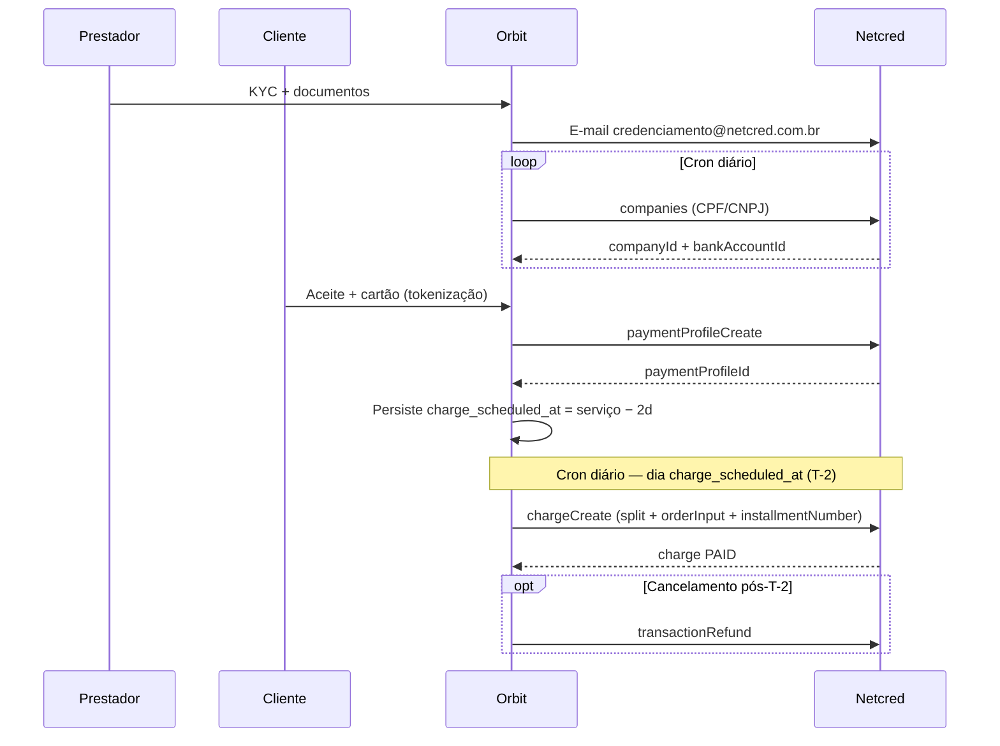

# Netcred — Fluxo de pagamentos Renovi

Guia de implementação: **somente** o que a Renovi usa na comunicação com a API Netcred (GraphQL).

Referência completa da API: [`docs/payments-api.md`](./payments-api.md) · Coleção Postman [API Netcred](https://go.postman.co/collection/55609940-a4b17641-251f-4c8e-a147-c3a5facc5715)

---

## Visão geral

| Aspecto | Valor |
|---------|-------|
| Protocolo | GraphQL (HTTP POST, JSON) |
| Autenticação | JWT — header `Authorization: JWT <token>` |
| Sandbox | `https://api.sandbox.netcredbrasil.com.br/graphql` |
| Produção | `https://api.netcredbrasil.com.br/graphql` |
| Validade do token | **24 horas** |

### Fluxo completo (ordem)

```
1. Prestador → KYC no app Renovi → e-mail à Netcred → cron detecta credenciamento
2. Cliente → tokenização do cartão (checkout / aceite do orçamento)
3. Aceite → tokenização + persistir `charge_scheduled_at` (T-2) — **sem** `chargeCreate` no aceite
4. Cron T-2 → `chargeCreate` (cobrança + split + parcelas) → `PAID`
5. Cancelamento pós-cobrança → `transactionRefund`
   (Cancelamento antes de T-2 → só domínio Renovi; cron não dispara cobrança)
```



### Mutations e queries usadas

| Operação | Tipo | Quando |
|----------|------|--------|
| `tokenAuth` | mutation | Obter JWT (a cada 24 h ou antes de expirar) |
| `companies` | query | Cron de credenciamento (batch por CPF/CNPJ) |
| `paymentProfileCreate` | mutation | Tokenizar cartão do cliente |
| `chargeCreate` | mutation | Cron T-2 — cobrar no dia `charge_scheduled_at` (com split e parcelas) |
| `transactionRefund` | mutation | Estorno após cobrança (`PAID`) |
| `chargeVoid` / `transactionVoid` | mutation | Edge case: cobrança criada mas ainda não `PAID` (ex.: falha/retry) |

---

## 1. Autenticação

Todas as operações (exceto `tokenAuth`) exigem o header JWT.

### Mutation

```graphql
mutation tokenAuth($username: String!, $password: String!) {
  tokenAuth(username: $username, password: $password) {
    token
    refreshExpiresIn
    errors { code field message }
    user {
      id
      username
      sandbox
      company { id }
    }
  }
}
```

### Input

| Campo | Obrigatório | Descrição |
|-------|-------------|-----------|
| `username` | Sim | Usuário fornecido pela Netcred |
| `password` | Sim | Senha fornecida pela Netcred |

### Resposta (sucesso)

| Campo | Uso Renovi |
|-------|------------|
| `token` | Enviar em `Authorization: JWT <token>` |
| `refreshExpiresIn` | Referência de expiração |
| `user.sandbox` | Confirmar ambiente (sandbox vs produção) |

### Erros conhecidos

| Situação | Comportamento |
|----------|---------------|
| Credenciais inválidas | `errors[]` em `tokenAuth`; sem `token` |
| Token expirado nas demais calls | HTTP 401 — renovar com `tokenAuth` |

### Implementação Renovi

- Credenciais em variáveis de ambiente (Edge Functions / backend).
- Cache do token com renovação antes de expirar (ex.: a cada 23 h).
- **Nunca** expor credenciais no app mobile/web.

---

## 2. Credenciamento de prestadores

### Acordo Renovi × Netcred

Não existe API de credenciamento. A Netcred aceita:

1. Link próprio da Netcred, ou  
2. E-mail com dados e documentos.

**Decisão Renovi:** o prestador faz **tudo no app**. A Renovi coleta KYC, envia e-mail formatado para **`credenciamento@netcred.com.br`** e detecta a conclusão via **cron diário** (consulta `companies` por CPF/CNPJ). Webhook de credenciamento está em desenvolvimento na Netcred — quando existir, complementar o cron.

### 2.1 Dados coletados no app (KYC)

Coleta **obrigatória** após o cadastro do prestador (tela bloqueante até concluir). Parte dos dados já existe em `profiles`, `client_profiles_private`, `provider_profiles_private`; o restante entra em campos/tabelas de onboarding.

#### Pessoa jurídica (CNPJ)

| Campo | Observação |
|-------|------------|
| Nome completo | Representante / contato |
| Razão social | |
| Nome fantasia | |
| CNPJ | Match no cron (`document`) |
| Anexo: estatuto, ato constitutivo e/ou contrato social | |
| Anexo: documento do representante legal (CPF/CNH) | Upload `legal-rep-id`; path dual-mapeado para `identity_doc_storage_path` e `legal_rep_doc_storage_path` |
| Anexo: comprovante de endereço da empresa | `address-proof` |
| Dados bancários: código do banco | |
| Agência (sem dígito) | |
| Conta corrente com dígito | |
| Chave PIX (opcional) | |
| Nome do representante legal | |
| CPF do representante legal | |
| Telefone do representante legal | |
| E-mail do representante legal | **Mesmo e-mail da conta Renovi** |

#### Pessoa física (CPF)

| Campo | Observação |
|-------|------------|
| Nome completo | |
| CPF | Match no cron (`document`) |
| Celular | |
| E-mail | |
| Anexo: documento (CPF/CNH) | |
| Anexo: comprovante de endereço | |
| Dados bancários: código do banco | |
| Agência (sem dígito) | |
| Conta corrente com dígito | |
| Chave PIX (opcional) | |

### 2.2 Envio do e-mail à Netcred

| Item | Valor |
|------|-------|
| Destino | `credenciamento@netcred.com.br` |
| Quando | Após prestador submeter KYC completo no app |
| Conteúdo | Template com todos os campos acima + anexos |
| Status local | `netcred_onboarding_status` → `submitted` |
| Timestamp | `netcred_onboarding_submitted_at` |

### 2.3 Cron de detecção (1× por dia)

Para prestadores com `netcred_onboarding_status` ∈ `{ pending, submitted }`:

1. Selecionar até **50** prestadores não credenciados.
2. Montar **uma única** query GraphQL com **até 50 aliases** `companies(document: …)` no **mesmo request HTTP** (evita rate limit — não disparar 50 requests separados).
3. Para cada `node` retornado: match `document` ↔ prestador local.
4. Persistir IDs e ativar prestador.
5. Se houver mais de 50 pendentes, repetir em batches sequenciais (intervalo entre requests ou próximo ciclo diário).

#### Query — batch de 50 documentos (1 request)

Para respeitar rate limit da Netcred, **nunca** consultar um documento por request HTTP. Agrupar até **50** prestadores por chamada usando **aliases GraphQL** — cada alias é um `companies(document: "…")` independente, mas tudo vai no **mesmo payload**:

```graphql
query ProviderOnboardingBatch {
  provider_03019758092: companies(document: "03019758092") {
    edges {
      node {
        id
        name
        legalName
        documentType
        document
        companyType
        companyState
        bankAccounts {
          edges {
            node {
              id
              holderDocument
              isActive
            }
          }
        }
      }
    }
  }
  provider_60679241000130: companies(document: "60679241000130") {
    edges {
      node {
        id
        name
        legalName
        documentType
        document
        companyType
        companyState
        bankAccounts {
          edges {
            node {
              id
              holderDocument
              isActive
            }
          }
        }
      }
    }
  }
  # … repetir o bloco acima para cada CPF/CNPJ do batch (máx. 50 aliases por request)
}
```

O job do cron monta a query com um alias por documento (`provider_<document>`), limitando a **50 aliases por request**. Prestadores excedentes entram no próximo request do mesmo ciclo (com pausa) ou no dia seguinte.

**Resposta do batch** — cada alias vira uma chave em `data`:

```json
{
  "data": {
    "provider_03019758092": { "edges": [] },
    "provider_60679241000130": {
      "edges": [{ "node": { "id": "1047", "document": "60679241000130", "companyState": "ACTIVE" } }]
    }
  }
}
```

`edges` vazio no alias = prestador ainda não credenciado na Netcred.

**Query unitária** (apenas debug ou 1 prestador):

```graphql
query ProviderOnboardingPoll($document: String!) {
  companies(document: $document) {
    edges {
      node {
        id
        name
        legalName
        documentType
        document
        companyType
        companyState
        bankAccounts {
          edges {
            node {
              id
              holderDocument
              isActive
            }
          }
        }
      }
    }
  }
}
```

**Exemplo de resposta (CNPJ credenciado):**

```json
{
  "data": {
    "companies": {
      "edges": [{
        "node": {
          "id": "1047",
          "name": "RENOVI",
          "legalName": "RENOVI",
          "documentType": "CNPJ",
          "document": "60679241000130",
          "companyType": "MARKETPLACE",
          "companyState": "ACTIVE",
          "bankAccounts": {
            "edges": [{
              "node": { "id": "2052", "holderDocument": "60679241000130", "isActive": true }
            }]
          }
        }
      }]
    }
  }
}
```

#### Regras do cron

| Regra | Detalhe |
|-------|---------|
| Frequência | **1× por dia** |
| Batch size | **Exatamente 1 request HTTP** com até **50** aliases `companies(document: …)` |
| Rate limit | Não fazer 1 request por prestador; sempre batch único de até 50 |
| Match | `companies.node.document` = CPF/CNPJ do prestador (somente dígitos) |
| `companyType` esperado | `MERCHANT` (EC do prestador) |
| `companyState` | Preferir `ACTIVE` antes de liberar pagamentos |
| Conta bancária | Usar `bankAccounts.edges[0].node.id` ativa; validar `holderDocument` quando necessário |

#### Persistência após credenciamento

| Campo local | Origem |
|-------------|--------|
| `netcred_company_id` | `companies.node.id` |
| `netcred_bank_account_id` | `bankAccounts.edges[].node.id` (conta do **prestador**) |
| `netcred_onboarding_status` | `active` |
| `netcred_onboarding_activated_at` | timestamp do cron |

#### Pré-requisito para oportunidades e cobrança

**Oportunidades / trabalhos (app prestador):**

- Enquanto `netcred_onboarding_status` ≠ `active`, o prestador **não vê** oportunidades nem trabalhos disponíveis.
- Exibir tela/mensagem fixa: credenciamento **pendente** — análise em andamento pela parceira de pagamentos (Netcred).
- Liberar listagem de oportunidades somente após credenciamento concluído (`active` + IDs persistidos).

**Cobrança com cartão (split):**

Prestador só participa de serviços pagos via cartão quando:

- `netcred_onboarding_status = active`
- `netcred_company_id` e `netcred_bank_account_id` preenchidos

### 2.4 Erros / ausência de resultado

| Situação | Ação Renovi |
|----------|-------------|
| `edges` vazio | Prestador ainda não credenciado — manter `submitted`; tentar no próximo dia |
| Vários `edges` com mesmo document | Log + revisão manual |
| `companyState` ≠ `ACTIVE` | Aguardar; não liberar cobrança |
| Sem `bankAccounts` | Aguardar; não liberar split |

---

## 3. Tokenização do cartão (`paymentProfileCreate`)

**Quando:** checkout / aceite do orçamento (antes da cobrança T-2).  
**Efeito:** salva cartão tokenizado; **não cobra**.

### Dados do cliente na Renovi

Campos exibidos no checkout **somente se ainda não existirem** em `profiles` / `client_profiles_private`. Se o usuário preencher no formulário, **persistir nas tabelas de perfil**; nas próximas tokenizações, reutilizar do banco — **não pedir de novo**.

| Campo | Fonte preferencial | Exibir no checkout se |
|-------|-------------------|------------------------|
| Nome | `profiles.full_name` | Campo ausente ou vazio |
| CPF | `client_profiles_private` | Campo ausente ou vazio |
| E-mail | `profiles` / auth | Campo ausente ou vazio |
| Telefone | perfil / cadastro | Campo ausente ou vazio |

Fluxo:

1. Montar `customerInput` a partir do perfil local.
2. Campos faltantes → exibir input obrigatório no checkout.
3. Após submit → `UPDATE` em `profiles` / `client_profiles_private`.
4. Chamar `paymentProfileCreate` com dados completos.

### Endereço de cobrança (`billingAddressInput`)

**Obrigatório** se ClearSale estiver habilitado na company (produção).

| Regra Renovi | Detalhe |
|--------------|---------|
| Primeiro cartão | Usar endereço do **primeiro serviço** em que o cliente cadastra o cartão |
| Cartões seguintes | Reutilizar billing address salvo localmente ou do perfil |

```jsonc
"billingAddressInput": {
  "street": "Rua Exemplo",
  "number": "123",
  "district": "Centro",
  "city": "Florianópolis",
  "state": "SC",
  "zipCode": "88000000",
  "additionalDetails": "Apto 101"
}
```

### Mutation

```graphql
mutation paymentProfileCreateCard($input: PaymentProfileCreateInput!) {
  paymentProfileCreate(input: $input) {
    errors { field message code }
    paymentProfile {
      id
      method
      isActive
      cardNumber
      expiryMonth
      expiryYear
      brand
      cardHolderName
      token
      rejectedReason
      customer { id name documentType document }
    }
  }
}
```

### Input (campos Renovi)

```jsonc
{
  "input": {
    "method": "CARD",
    "customerInput": {
      "companyId": 1234,
      "name": "Maria da Silva",
      "email": "maria@email.com",
      "documentType": "CPF",
      "document": "03019758092",
      "phone": "48991234567",
      "persist": false
    },
    "ccInput": {
      "cardNumber": "4970100000000048",
      "expiryMonth": 10,
      "expiryYear": 2027,
      "securityCode": "123",
      "cardHolderName": "Maria da Silva"
    },
    "billingAddressInput": { /* ver acima */ }
  }
}
```

| Campo | Obrigatório | Descrição |
|-------|-------------|-----------|
| `method` | Sim | `"CARD"` |
| `customerInput.companyId` | Sim | **`netcred_company_id` do prestador** do serviço |
| `customerInput.name` | Sim | Nome do pagador (= `cardHolderName`) |
| `customerInput.document` | Sim | CPF/CNPJ válido (somente dígitos) |
| `customerInput.documentType` | Sim | `CPF` ou `CNPJ` |
| `customerInput.email` | Recomendado | E-mail do cliente |
| `customerInput.phone` | Recomendado | Telefone |
| `customerInput.persist` | Sim | **`false`** — sempre reenviar dados completos |
| `ccInput.*` | Sim | PAN, validade, CVV, titular — **só nesta mutation** |
| `billingAddressInput` | Condicional | Obrigatório com ClearSale |

### Resposta (sucesso) — o que persistir

Persistir **somente** estes campos relacionados ao cartão (PCI):

| Campo Netcred | Coluna local sugerida | Descrição |
|---------------|----------------------|-----------|
| `paymentProfile.id` | `netcred_payment_profile_id` | ID do cartão na Netcred |
| `paymentProfile.cardNumber` | `card_number_masked` | Já mascarado pela Netcred (ex.: `497010XXXXXX0048`) |
| `paymentProfile.brand` | `card_brand` | Bandeira (ex.: `VCC`) |
| `paymentProfile.token` | `netcred_card_token` | Token interno Netcred |

Validar `paymentProfile.isActive === true` antes de seguir; **não** persistir se tokenização falhou.

Opcional para UI (não enviar à Netcred de novo): `expiryMonth`, `expiryYear`, `cardHolderName` — apenas exibição “•••• 0048”.

**Não persistir:** PAN completo, CVV, `customer.id` Netcred (reenviar `customerInput` com `persist: false` a cada tokenização).

### Erros conhecidos

| Código / mensagem | Causa | Ação |
|-------------------|-------|------|
| CPF inválido | `document` com dígitos verificadores incorretos | Validar CPF antes de enviar |
| `cardHolderName` ≠ nome do titular | Divergência com cadastro | Usar `profiles.full_name` |
| Cartão recusado (sandbox `4970100000000071`) | Teste de rejeição | Pedir outro cartão |
| Sem `billingAddress` + ClearSale ativo | Endereço omitido | Incluir `billingAddressInput` |
| `errors[]` + `paymentProfile: null` | Falha na tokenização | Exibir `errors[].message` |

### PCI

- Coletar PAN/CVV **somente no checkout** e enviar direto à Netcred na mutation.
- **Nunca** persistir número completo do cartão nem CVV.
- No banco Renovi: apenas `netcred_payment_profile_id`, `card_number_masked`, `card_brand`, `netcred_card_token` (ver tabela acima).

---

## 4. Cobrança T-2 (`chargeCreate`)

**Decisão Renovi:** **não usar `rrule`** na API Netcred. O campo existe na documentação da parceira, porém é **mutuamente exclusivo com `installmentNumber`** (parcelamento no cartão) — como a Renovi precisa de parcelas, o agendamento da cobrança fica **100% no domínio Renovi**, via **cron job**.

**Quando cobrar:** no dia **`charge_scheduled_at` = `service_scheduled_at − 2 dias`** (T-2).  
**Quem dispara:** worker/cron Renovi — **não** chamar `chargeCreate` no aceite do orçamento.  
**Efeito da mutation:** autorização + captura automática (`manualCapture: false`) → `transactionState: PAID` na mesma execução (ou `REJECTED` / `IN_ANALYSIS` se antifraude recusar).

### 4.1 No aceite do orçamento (antes do T-2)

| Ação | Fazer | Não fazer |
|------|-------|-----------|
| Tokenizar cartão | `paymentProfileCreate` | — |
| Persistir agendamento | `charge_scheduled_at`, `netcred_payment_profile_id`, `installment_number`, `reference_code` | — |
| Cobrar | — | **`chargeCreate`** (esperar o cron) |
| Agendar na Netcred | — | **`rrule`** (fora do escopo Renovi) |

### 4.2 Cron `schedule-netcred-charges`

Job diário (Edge Function + pg_cron ou equivalente) que dispara **`chargeCreate`** para serviços cuja cobrança vence **hoje**.

#### Seleção (query local)

Buscar serviços/propostas aceitas onde **todas** as condições forem verdadeiras:

| Critério | Campo / regra |
|----------|---------------|
| Data de cobrança | `charge_scheduled_at::date = CURRENT_DATE` (timezone do serviço — alinhar com `service_scheduled_at`) |
| Pagamento pendente | `payment_phase = 'pending_charge'` (ou equivalente) |
| Serviço ativo | Status não cancelado (ex.: `accepted`, `scheduled`) |
| Cartão | `netcred_payment_profile_id` preenchido |
| Prestador credenciado | `netcred_onboarding_status = active` + `netcred_company_id` + `netcred_bank_account_id` |
| Idempotência | `netcred_charge_id IS NULL` (ainda não cobrado) |

Calcular no aceite:

```
charge_scheduled_at = service_scheduled_at - interval '2 days'
```

Ex.: serviço **05/07/2026** → cron roda em **03/07/2026** e chama `chargeCreate`.

#### Execução por serviço

1. Montar payload `chargeCreate` (§4.5) com `installmentNumber` escolhido no aceite.
2. Chamar mutation com `referenceCode` = UUID do serviço (idempotência).
3. **Sucesso (`PAID`):** persistir `netcred_charge_id`, `netcred_transaction_id`, `payment_phase = 'paid'`, timestamps.
4. **`REJECTED`:** `payment_phase = 'charge_failed'`; notificar cliente; permitir novo cartão ou cancelamento.
5. **`IN_ANALYSIS` / `MANUAL_ANALYSIS`:** manter `payment_phase = 'in_analysis'`; webhook `TRANSACTION_UPDATE` fecha o ciclo.
6. **Erro de rede / 5xx:** retry com backoff; **não** duplicar cobrança — `referenceCode` impede segunda charge na Netcred se a primeira já criou.

#### Idempotência e retries

| Situação | Comportamento |
|----------|---------------|
| Cron reexecuta no mesmo dia | Se `netcred_charge_id` já existe → skip |
| `referenceCode` duplicado na API | Consultar cobrança existente; sincronizar IDs locais |
| Falha parcial (timeout após criar charge) | Reconciliar via webhook ou polling `transactions(referenceCode: …)` |

#### Cancelamento antes do T-2

Enquanto o cron **não** rodou, **não há cobrança na Netcred**. Cancelar o serviço na Renovi (`payment_phase = 'cancelled'`, status cancelado) — o cron **ignora** o registro. **Não** é necessário `chargeVoid`/`transactionVoid` neste cenário.

#### Frequência recomendada

| Opção | Detalhe |
|-------|---------|
| **1× ao dia** (madrugada) | Suficiente se `charge_scheduled_at` for sempre date-only |
| **2× ao dia** (opcional) | Retry de falhas transientes no mesmo T-2 |

Documentar timezone: usar o fuso do endereço do serviço ou UTC consistente em todo o pipeline.

### 4.3 IDs importantes

| ID | Origem | Uso |
|----|--------|-----|
| `companyId` | `netcred_company_id` do **prestador** | Identifica o EC (`MERCHANT`) da cobrança |
| `paymentProfileId` | Etapa 3 | Cartão tokenizado |
| `bankAccountId` (prestador) | Cron credenciamento | Split `PERCENTAGE` 100% |
| `bankAccountId` (Renovi) | Conta da plataforma na Netcred | Split `FIXED_AMOUNT` (taxa Renovi) |

> A cobrança roda na **company do prestador**, não na company marketplace da Renovi.

### 4.4 Split (modelo Renovi)

Comissão Renovi = **`FIXED_AMOUNT`** (valor acordado por serviço).  
Restante = **`PERCENTAGE` 100%** para a conta do prestador.

A Netcred exige **ao menos um** `ruleItem` `PERCENTAGE` somando **100.0** na regra.

```jsonc
"payoutRuleInput": {
  "name": "Split servico {service_id}",
  "isPrimary": false,
  "persist": false,
  "ruleItems": [
    {
      "splitType": "PERCENTAGE",
      "proportion": "100.0",
      "isLiable": false,
      "bankAccountId": 2053,
      "scheduleInput": {
        "scheduleType": "DAILY",
        "scheduleAnchor": 1,
        "automaticAdvance": false
      }
    },
    {
      "splitType": "FIXED_AMOUNT",
      "amount": "100.00",
      "isLiable": true,
      "bankAccountId": 2052,
      "scheduleInput": {
        "scheduleType": "DAILY",
        "scheduleAnchor": 1,
        "automaticAdvance": false
      }
    }
  ]
}
```

| `ruleItem` | Campo | Descrição |
|------------|-------|-----------|
| Prestador | `splitType: PERCENTAGE`, `proportion: "100.0"` | 100% do valor **após** descontar o fixo Renovi |
| Prestador | `bankAccountId` | `netcred_bank_account_id` do prestador |
| Prestador | `isLiable: false` | Chargeback proporcional fora desta parcela |
| Renovi | `splitType: FIXED_AMOUNT`, `amount` | Taxa fixa acordada (ex.: `"100.00"`) |
| Renovi | `bankAccountId` | Conta bancária da **Renovi** na Netcred |
| Renovi | `isLiable: true` | Renovi arca com chargeback/estorno sobre a comissão |

### 4.5 Mutation e payload

```graphql
mutation chargeCreateCardWithSplit($input: ChargeCreateInput!) {
  chargeCreate(input: $input) {
    errors { field message code }
    charge {
      id
      amount
      referenceCode
      chargeType
      chargeStatus
      transactions {
        edges {
          node {
            id
            transactionState
            amount
            paidAt
          }
        }
      }
    }
  }
}
```

### Input completo (referência — chamado pelo cron T-2)

> **Não incluir `rrule`.** Agendamento é responsabilidade do cron Renovi (§4.2).

```jsonc
{
  "input": {
    "companyId": 1048,
    "paymentProfileId": 403137,
    "amount": "1000.00",
    "installmentNumber": 10,
    "referenceCode": "uuid-do-servico",
    "billDaysInAdvance": 0,
    "manualCapture": false,
    "extraInfo": "Renovi · Pintura · …",
    "customerIpAddress": "189.0.0.1",
    "orderInput": {
      "sessionId": "uuid-clearsale-sessao",
      "referenceCode": "uuid-do-servico",
      "orderItems": [{
        "productInput": {
          "name": "Pintura — Sala",
          "amount": "1000.00",
          "description": "Serviço contratado via Renovi…",
          "category": "Serviços"
        }
      }]
    },
    "payoutRuleInput": { /* split acima */ }
  }
}
```

### Campos — referência

| Campo | Obrig. | Descrição |
|-------|--------|-----------|
| `companyId` | Sim | **`netcred_company_id` do prestador** |
| `paymentProfileId` | Sim | ID da tokenização (não reenviar cartão) |
| `amount` | Sim | Total cobrado do cliente (`"1000.00"`) |
| `installmentNumber` | Não | Parcelas no cartão do cliente (ex.: `10`); default `1`. **Não combinar com `rrule`** — Renovi não usa `rrule` |
| `referenceCode` | Sim | UUID do serviço — **idempotência** (repetir → erro) |
| `extraInfo` | Não | Resumo operacional — **máx. 150 caracteres** |
| `billDaysInAdvance` | Não | Default `0` |
| `manualCapture` | Não | **`false`** (default) — captura automática |
| `rrule` | **Não usar** | Exclusivo com parcelamento; agendamento via cron §4.2 |
| `customerIpAddress` | Recomendado | IP do cliente (ClearSale) |
| `orderInput` | Condicional | **Obrigatório** com ClearSale |
| `orderInput.sessionId` | Condicional | UUID da sessão ClearSale Behavior Analytics |
| `orderInput.referenceCode` | Não | UUID do serviço (carrinho antifraude) |
| `orderInput.orderItems` | Condicional | ≥ 1 item; `name`, `amount`, `category` |
| `productInput.description` | Não | **Máx. 150 caracteres** |
| `payoutRuleInput` | Sim* | *Obrigatório* para split customizado (Select Payout Rule habilitado) |

### Resposta (sucesso)

| Campo | Persistir | Notas |
|-------|-----------|-------|
| `charge.id` | `netcred_charge_id` | ID da **cobrança** |
| `charge.referenceCode` | `reference_code` | UUID do serviço |
| `transactions.edges[0].node.id` | `netcred_transaction_id` | ID da **transaction** — usar em refund |
| `transactions.edges[0].node.transactionState` | `payment_phase` | Esperado: **`PAID`** na resposta do cron (ou `IN_ANALYSIS` → webhook) |
| `charge.chargeStatus` | — | `ENDED` quando `PAID` |
| `charge.chargeType` | — | `SINGLE` (cobrança imediata na chamada do cron) |

> **`charge.id` ≠ `transaction.id`.** Estorno usa sempre `transaction.id`.

### 4.6 Erros conhecidos (`chargeCreate`)

| Código / mensagem | Causa | Ação |
|-------------------|-------|------|
| `PaymentProfile requires BillingAddress…` | ClearSale ativo; perfil sem endereço | Re-tokenizar com `billingAddressInput` |
| `Field 'sessionId' of required type 'String!' was not provided` | `orderInput` sem `sessionId` | Enviar `sessionId` ClearSale |
| `PAYOUT_RULE_SELECT_NOT_ENABLED` | Company sem Select Payout Rule | Solicitar habilitação à Netcred |
| `INTERNAL_SERVER_ERROR` | Instabilidade ou texto > 150 chars | Encurtar `extraInfo` / `description`; retry |
| `referenceCode` repetido | Idempotência | Consultar cobrança existente; não duplicar |
| `transactionState: REJECTED` | Cartão recusado / antifraude | Notificar cliente; novo cartão ou cancelar serviço |

---

## 5. Estorno (`transactionRefund`)

**Quando:** cancelamento ou disputa **após** cobrança T-2 com transaction `PAID`.  
**Não usar** para cobrança já totalmente estornada.

Disputas formalizadas podem exigir **e-mail à Netcred** além da API — ver [`payments-api.md` §4.14](./payments-api.md).

### Cancelamento antes do T-2

Enquanto o cron **não executou** `chargeCreate`, não existe cobrança na Netcred. Basta cancelar o serviço na Renovi — o cron não incluirá o registro (§4.2). `chargeVoid` / `transactionVoid` só se aplicam se a cobrança já foi criada e ainda não está `PAID` (caso raro de retry/reconciliação).

### Mutation

```graphql
mutation transactionRefund($input: TransactionRefundInput!) {
  transactionRefund(input: $input) {
    errors { field message code }
    transaction {
      id
      amount
      paidAmount
      refundedAmount
      transactionState
    }
  }
}
```

### Input

```json
{
  "input": {
    "transactionId": 444677,
    "refundReason": "REQUESTED_BY_CUSTOMER",
    "amount": "500.00"
  }
}
```

| Campo | Obrig. | Descrição |
|-------|--------|-----------|
| `transactionId` | Sim | **`netcred_transaction_id`** (não `charge.id`) |
| `refundReason` | Sim | Ver tabela abaixo |
| `amount` | Não | Default = saldo reembolsável; 2 casas decimais |

#### Valores de `refundReason`

| Valor | Uso |
|-------|-----|
| `REQUESTED_BY_CUSTOMER` | Cancelamento/disputa a favor do cliente (**padrão Renovi**) |
| `DUPLICATE` | Cobrança duplicada |
| `FRAUDULENT` | Fraude confirmada |
| `OTHER` | Outros motivos |

Campo informativo — não altera aprovação do estorno.

### Resposta (sucesso)

```json
{
  "data": {
    "transactionRefund": {
      "errors": [],
      "transaction": {
        "id": "444678",
        "amount": "500.00",
        "paidAmount": "500.00",
        "refundedAmount": "500.00",
        "transactionState": "REFUNDED"
      }
    }
  }
}
```

| Campo local | Valor |
|-------------|-------|
| `payment_phase` | `refunded` |
| `refunded_amount` | `transaction.refundedAmount` |
| `refund_confirmed_at` | timestamp (+ webhook `TRANSACTION_REFUND`) |

Estorno na fatura do cliente: **30–60 dias** (comunicar na UI de disputa).

### Erros conhecidos (`transactionRefund`)

| Código | Mensagem (exemplo) | Causa | Ação |
|--------|-------------------|-------|------|
| `TRANSACTION_DOES_NOT_EXIST` | `Transaction does not exist` | ID inválido ou `charge.id` no lugar de `transaction.id` | Usar `netcred_transaction_id` |
| `TRANSACTION_INVALID_REFUND_AMOUNT` | `…can't be higher than transaction refundable amount (0.00)` | Já estornado ou valor acima do saldo | Checar `REFUNDED`; idempotência |
| `VALIDATION_ERROR` | Variável | `refundReason` ausente/inválido | Validar input |
| `INTERNAL_SERVER_ERROR` | `Internal server error` | Falha gateway | Retry; suporte Netcred |

> HTTP 200 com `errors[]` e `transaction: null` = **falha** — não marcar como estornado.

---

## 6. Webhooks

Webhooks são a **fonte primária** de conciliação entre Netcred e o banco Renovi. O handler (Edge Function `netcred-webhook`) deve ser **idempotente** (deduplicar por `event` + `payload.id` + timestamp) e responder **200** rapidamente; processamento pesado em fila/worker se necessário.

Referência completa da API: [`payments-api.md` §10](./payments-api.md).

### 6.1 Cadastro

**Preferência Renovi:** cadastrar e manter webhooks **pelo painel administrativo da Netcred**, não via API em runtime. O painel é o canal operacional acordado com a parceira (sandbox e produção); reduz acoplamento e evita gerenciar `secretKey` / eventos por mutation no app.

Preencher no painel os mesmos parâmetros da tabela abaixo. Guardar a `secretKey` gerada no painel em secret do Supabase (validação de `X-NETCRED-Signature`).

**Alternativa (referência):** mutation `webhookCreate` — útil para homologação ou automação futura; ver [`payments-api.md` §10](./payments-api.md).

```graphql
mutation webhookCreate($input: WebhookCreateInput!) {
  webhookCreate(input: $input) {
    errors { field message code }
    webhook { id name targetUrl isActive secretKey }
  }
}
```

| Campo | Renovi |
|-------|--------|
| `targetUrl` | `https://<projeto>.supabase.co/functions/v1/netcred-webhook` (HTTPS obrigatório) |
| `companyId` | Company **MERCHANT** da Renovi (marketplace) ou por EC — alinhar com Netcred |
| `secretKey` | Gerada no painel (ou na mutation); armazenar em secret; validar `X-NETCRED-Signature` |
| `events` | Lista abaixo (§6.3) — inscrever todos os eventos usados na conciliação |
| `maskUserAgent` | `true` se firewall bloquear user-agent da Netcred |

**Teste de conectividade:** usar o ping do painel ou, via API, `webhookPing(webhookId)` (dispara `WEBHOOK_PING`).

### 6.2 Headers e validação

| Header | Uso |
|--------|-----|
| `Content-Type` | `application/json` |
| `X-NETCRED-Event` | Tipo do evento (ex.: `TRANSACTION_CAPTURE`) |
| `X-NETCRED-Domain` | Origem sandbox vs produção |
| `X-NETCRED-Signature` | `HMAC-SHA256(secretKey, rawBody)` — comparar com corpo **raw** (`NETCRED_WEBHOOK_SECRET` in Edge secrets) |

Rejeitar request se assinatura inválida. Logar `X-NETCRED-Event` + IDs do payload para auditoria.

### 6.3 Catálogo de eventos e conciliação Renovi

| Evento | Quando dispara | Payload | Uso / conciliação no banco Renovi |
|--------|----------------|---------|-----------------------------------|
| `ANY` | Qualquer evento inscrito | Variável | Atalho no cadastro; o header `X-NETCRED-Event` indica o tipo real — tratar como os demais |
| `WEBHOOK_PING` | `webhookPing` | Ping | Health check; não alterar dados de pagamento |
| `PAYMENT_PROFILE_TOKENIZE` | Tokenização concluída (sucesso ou falha) | `PaymentProfilePayload` | Confirmar `is_active`; atualizar `netcred_payment_profile_id`, `card_number_masked`, `card_brand`, `netcred_card_token`; se `is_active: false`, marcar cartão inválido e exibir `rejected_reason` |
| `PAYMENT_PROFILE_UPDATE` | Perfil alterado na Netcred | `PaymentProfilePayload` | Sincronizar `card_brand`, validade, `is_active`; desativar cartão local se `is_active: false` |
| `PAYMENT_PROFILE_DELETE` | Perfil desativado/removido | `PaymentProfilePayload` | Soft-delete ou `is_active = false` no cartão local; impedir uso em novas cobranças |
| `PAYMENT_PROFILE_EXPIRING` | Cartão expira em ~1 mês | `PaymentProfilePayload` | Notificar cliente para atualizar cartão antes do T-2 |
| `CHARGE_CREATE` | Cobrança criada pelo cron (`chargeCreate`) | `ChargePayload` | Persistir `netcred_charge_id`, `reference_code` ↔ serviço |
| `CHARGE_UPDATE` | Cobrança alterada (valor, datas, estado) | `ChargePayload` | Conciliar `charge_state`, datas de billing; alertar se divergir do agendamento Renovi |
| `CHARGE_VOID` | Cobrança cancelada antes da execução | `ChargePayload` | `payment_phase` → `voided`; serviço cancelado sem débito |
| `TRANSACTION_CREATE` | Transação filha criada na charge | `TransactionPayload` | Persistir `netcred_transaction_id`; ligar `charge.reference_code` ao serviço |
| `TRANSACTION_AUTHORIZE` | Autorização / emissão (antifraude) | `TransactionPayload` | `payment_phase` → `authorizing` ou `in_analysis`; aguardar captura |
| `TRANSACTION_CAPTURE` | Captura efetivada (T-2 cartão) | `TransactionPayload` | **`PAID`:** schedule → `paid`; depois enrich GraphQL `movements(transactionId)` → upsert settlements (movements em lote já existente **não** disparam `PAYOUT_CREATE`) |
| `TRANSACTION_UPDATE` | Qualquer mudança de estado | `TransactionPayload` | **Evento mais abrangente** — mapear `transaction_state` → `payment_phase` (`PAID`, `REJECTED`, `IN_ANALYSIS`, `SCHEDULED`, etc.); usar como fallback se `CAPTURE` não chegar |
| `TRANSACTION_EXPIRED` | Prazo da transação expirou | `TransactionPayload` | `payment_phase` → `expired`; solicitar novo cartão ou reagendar |
| `TRANSACTION_VOID` | Cancelamento da transação (pré ou pós-análise, conforme regra Netcred) | `TransactionPayload` | Confirmar cancelamento solicitado via `chargeVoid`/`transactionVoid`; `payment_phase` → `voided`; fechar ciclo sem depender só de e-mail |
| `TRANSACTION_REFUND` | Estorno processado | `TransactionPayload` | Confirmar refund no schedule; enrich GraphQL movements (DEBIT/clawback) → upsert; comunicar prazo 30–60 dias na fatura |
| `TRANSACTION_DISPUTE` | Chargeback / disputa iniciada | `TransactionPayload` | `is_disputed = true`; abrir fluxo de disputa Renovi; bloquear payout se aplicável |
| `PAYOUT_CREATE` | Lote de liquidação criado (previsão) | `PayoutPayload` | Upsert `payment_settlement_movements` a partir de `payload.movements[]` (`payment_webhook_handle_payout`); join `movements.transaction_id` → `payment_schedules.gateway_transaction_id` |
| `PAYOUT_SETTLE` | Lote liquidado / atualizado | `PayoutPayload` | Mesmo handler; avança `settled_at` / `movement_status` (`PAID_OUT` etc.) |

> **Nota:** Na documentação textual da coleção Postman aparece `TRANSACTION_EXPIRE`; em `webhookCreate` o valor correto é `TRANSACTION_EXPIRED`. A mesma coleção omite `PAYOUT_*` — eventos oficiais de liquidação estão na [doc Netcred](https://docs.netcredbrasil.com.br/) e em [`payments-api.md` §10](./payments-api.md) (`PayoutPayload` + enums).

> **Enrich na captura:** Netcred reusa lotes de payout por `(company, settling_at)`; movements novos frequentemente **não** disparam `PAYOUT_CREATE`. Por isso `netcred-webhook`, após `TRANSACTION_CAPTURE`/`TRANSACTION_REFUND`, busca movements via GraphQL e upserta (best-effort; falha não quebra o ACK).
>
> **Reconcile secundário:** Edge `sync-netcred-settlements` (cron `payment_cron_sync_netcred_settlements`) para gaps (enrich falhou / movements ainda indisponíveis) e reusa `payment_upsert_settlement_movements`.

### 6.4 Chaves de match (payload → linha local)

| Chave Netcred | Campo Renovi | Observação |
|---------------|--------------|------------|
| `charge.reference_code` | UUID do serviço / proposta | Idempotência principal |
| `transaction.id` | `netcred_transaction_id` / `gateway_transaction_id` | Refund, void, disputa; **join de settlement** |
| `movements.transaction_id` (PayoutPayload) | `payment_schedules.gateway_transaction_id` | Liquidação bancária → schedule |
| `movements.id` (PayoutPayload) | `payment_settlement_movements.gateway_movement_id` | Upsert idempotente |
| `charge.id` | `netcred_charge_id` | `chargeVoid` — **não** usar em `transactionRefund` |
| `payment_profile.id` | `netcred_payment_profile_id` | Tokenização e cartões salvos |

### 6.5 Máquina de estados → `payment_phase`

| `transaction_state` (payload) | Ação Renovi |
|-------------------------------|-------------|
| `SCHEDULED` | Não esperado no fluxo Renovi (sem `rrule`); tratar como estado transitório se aparecer |
| `IN_ANALYSIS` / `MANUAL_ANALYSIS` | Aguardar antifraude; UI “em análise” |
| `PAID` | Pagamento confirmado; liberar fluxo pós-pagamento |
| `REJECTED` | Falha na cobrança; notificar cliente |
| `VOIDED` | Cancelamento confirmado |
| `REFUNDED` / `PARTIALLY_REFUNDED` | Estorno confirmado |
| `EXPIRED` | Transação expirada |

Preferir atualizar a partir de `transaction_state` no payload; usar `operations[]` apenas para auditoria.

### 6.6 Handler idempotente (checklist)

1. Validar `X-NETCRED-Signature`.
2. Parsear JSON; ler `X-NETCRED-Event`.
3. Resolver serviço por `reference_code` ou `netcred_transaction_id`.
4. Se estado local já igual ao payload → **200 OK** (no-op).
5. Atualizar tabelas de pagamento/serviço em transação DB.
6. Registrar evento em `netcred_webhook_events` (opcional) para reconciliação e debug.
7. Retornar **200** mesmo em no-op; **4xx** só para assinatura inválida.

### 6.7 Reconciliação de segurança (polling)

Manter cron `reconcile-netcred-webhooks` consultando `transactions(referenceCode: …)` para serviços em estados intermediários (`scheduled`, `refund_requested`) quando webhook falhar ou atrasar. Webhook = primário; polling = backup.

### 6.8 Eventos recomendados no cadastro Renovi

Inscrever no mínimo:

`CHARGE_CREATE`, `CHARGE_UPDATE`, `CHARGE_VOID`, `TRANSACTION_CREATE`, `TRANSACTION_AUTHORIZE`, `TRANSACTION_CAPTURE`, `TRANSACTION_UPDATE`, `TRANSACTION_EXPIRED`, `TRANSACTION_VOID`, `TRANSACTION_REFUND`, `TRANSACTION_DISPUTE`, `PAYMENT_PROFILE_TOKENIZE`, `PAYMENT_PROFILE_UPDATE`, `PAYMENT_PROFILE_DELETE`, `PAYMENT_PROFILE_EXPIRING`

**Futuro:** webhook de credenciamento de prestador (Netcred em desenvolvimento) — hoje substituído pelo cron §2.3; quando disponível, atualizar `netcred_onboarding_status` via evento e manter cron como backup.

---

## 7. Sandbox vs produção

| Item | Sandbox | Produção |
|------|---------|----------|
| URL | `api.sandbox.netcredbrasil.com.br` | `api.netcredbrasil.com.br` |
| Credenciais | Usuário/senha sandbox | Usuário/senha produção |
| IDs (`companyId`, `bankAccountId`, …) | **Diferentes** — não reutilizar |
| Cartão aprovado | `4970100000000048` | Cartão real |
| Cartão rejeitado | `4970100000000071` | — |
| CPF antifraude OK | Termina em **1** | Regra real ClearSale |

---

## 8. Checklist de implementação

| # | Componente | API / ação |
|---|------------|------------|
| 1 | Auth service | `tokenAuth` + cache 24 h |
| 2 | Onboarding UI | KYC PF/PJ bloqueante |
| 3 | E-mail service | `credenciamento@netcred.com.br` |
| 4 | Cron diário | `companies(document)` — **1 request** com até 50 aliases GraphQL |
| 5 | Checkout | `paymentProfileCreate` + billing address; perfil condicional |
| 6 | Cron T-2 `schedule-netcred-charges` | Diário: `charge_scheduled_at = hoje` → `chargeCreate` + split + parcelas |
| 7 | Cancelamento | `transactionRefund` (pós-`PAID`) |
| 8 | Webhook handler | Todos os eventos §6.3 + reconciliação idempotente |
| 9 | Gate prestador | Bloquear oportunidades até `netcred_onboarding_status = active` |

---

*Baseado em [`docs/payments-api.md`](./payments-api.md) e alinhamentos Renovi × Netcred (2026-06). Homologação sandbox: tokenização, `chargeCreate` com split e `transactionRefund` (2026-06-23).*
