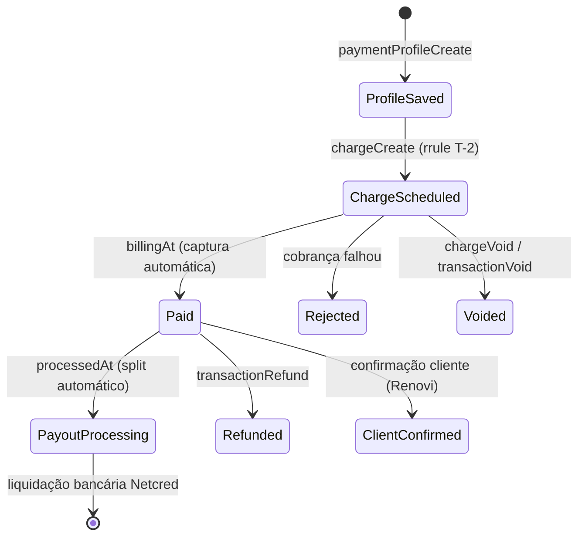
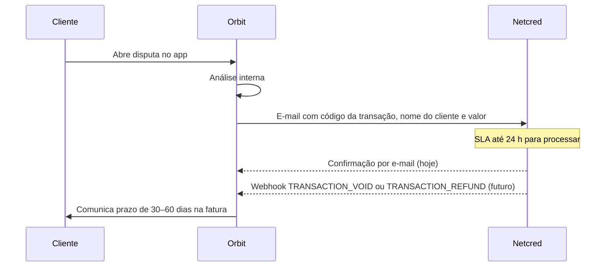

# API Netcred — Referência para Integração de Pagamentos

Documento derivado da coleção Postman **API Netcred** ([coleção](https://go.postman.co/collection/55609940-a4b17641-251f-4c8e-a147-c3a5facc5715)) e da documentação oficial em [docs.netcredbrasil.com.br](https://docs.netcredbrasil.com.br/).

**Schema real (introspection):** a coleção Postman cobre só um subconjunto. Snapshot autenticado do GraphQL sandbox — todas as queries/mutations/types — em [`netcred-graphql-introspection.md`](./netcred-graphql-introspection.md) + [`netcred-graphql-introspection.json`](./netcred-graphql-introspection.json) (inclui `movements` / `payouts` para liquidações).

Foco: **cartão com tokenização** → **cobrança agendada (T-2)** → **split/PayoutRule** → **liberação ao prestador (negociada com Netcred)** → **Pix** → **cancelamentos/estornos e disputas** → **webhooks**.

---

## 1. Visão geral

| Aspecto | Detalhe |
|---------|---------|
| Protocolo | **GraphQL** sobre HTTP POST |
| Formato | JSON |
| Autenticação | JWT (`Authorization: JWT <token>`) |
| Sandbox | `https://api.sandbox.netcredbrasil.com.br/graphql` |
| Produção | `https://api.netcredbrasil.com.br/graphql` |
| Documentação | [netcredbrasil.com.br](https://netcredbrasil.com.br/) |

A API unifica **boleto**, **cartão de crédito** e **PIX** no mesmo modelo de domínio. Toda cobrança gera uma ou mais **Transactions** (pagamentos efetivos).

### Objetos principais

| Objeto | Papel |
|--------|-------|
| **Company** | Estabelecimento (`MERCHANT`) — obrigatório em quase todas as chamadas via `companyId` |
| **Customer** | Pagador (CPF/CNPJ, nome, e-mail, telefone) |
| **PaymentProfile** | Perfil de pagamento — para cartão, armazena o **token** do cartão tokenizado |
| **Charge** | Cobrança (agrupamento de transações) |
| **Transaction** | Pagamento individual (boleto emitido, PIX gerado ou autorização/captura de cartão) |
| **PayoutRule** | Regra de **split** — define como o valor é dividido entre contas bancárias |
| **BankAccount** | Conta bancária de destino no split (criada previamente junto à Netcred) |

---

## 2. Autenticação

### Obter token JWT

```graphql
mutation tokenAuth($username: String!, $password: String!) {
  tokenAuth(username: $username, password: $password) {
    token
    refreshExpiresIn
    errors { code field message }
    user {
      id
      username
      sandbox
      company { id }
    }
  }
}
```

| Parâmetro | Obrigatório | Descrição |
|-----------|-------------|-----------|
| `username` | Sim | Usuário fornecido pela Netcred |
| `password` | Sim | Senha fornecida pela Netcred |

**Validade do token:** 24 horas. Renovar com nova chamada `tokenAuth`.

**Header em todas as demais requisições:**

```
Authorization: JWT <token>
```

### Obter `companyId`

```graphql
query {
  getCompanies {
    edges {
      node {
        id
        name
        companyType
        companyState
      }
    }
  }
}
```

Use o `id` da Company do tipo `MERCHANT` nas mutations de cobrança e perfil de pagamento.

---

## 3. Fluxo de negócio Renovi (4 etapas)

Modelo desejado para serviços agendados com **escrow** — o prestador só recebe após o cliente confirmar a execução:

| Etapa | Quando | O que acontece | Estado Renovi sugerido |
|-------|--------|----------------|------------------------|
| **1. Tokenização** | Checkout / aprovação do orçamento | Cliente informa cartão; Renovi chama `paymentProfileCreate` e persiste `payment_profile_id` | `payment_profile_saved` |
| **2. Cobrança T-2** | 2 dias antes da data agendada do serviço | Renovi cobra o cartão tokenizado (autorização + captura juntas); repasse ao prestador segue calendário Netcred | `charge_captured` |
| **3. Execução** | Data do serviço | Prestador executa; cliente valida no app | `service_completed_pending_release` |
| **4. Liberação** | Cliente confirma conclusão | Valor líquido do prestador é liquidado na conta bancária dele | `payout_released` |

```mermaid
sequenceDiagram
  participant C as Cliente
  participant R as Orbit
  participant N as Netcred
  participant P as Prestador

  C->>R: 1. Informa cartão no checkout
  R->>N: paymentProfileCreate
  N-->>R: paymentProfile.id (token)
  R->>R: Salva payment_profile_id

  Note over R,N: T-2 dias antes do serviço agendado
  R->>N: chargeCreate (paymentProfileId, payoutRule)
  N-->>R: transaction PAID (autorização + captura)
  Note over R,P: Split inicia liquidação; timing ao prestador conforme Netcred

  C->>R: 3. Confirma serviço concluído
  R->>R: Atualiza status do serviço (domínio Renovi)
  N->>P: 4. Liquidação bancária via PayoutRule (calendário Netcred)
```

> A seção **4** detalha como implementar cada etapa com os recursos disponíveis na API Netcred, incluindo limitações e decisões arquiteturais.

---

## 4. Modelo Escrow — cobrança T-2 e liberação ao prestador

Esta seção consolida tudo que a coleção Postman **API Netcred** oferece para o fluxo de escrow da Renovi.

### 4.1 O que a API Netcred oferece (e o que não oferece)

| Recurso na coleção | Suporta escrow Renovi? | Observação |
|--------------------|------------------------|------------|
| `paymentProfileCreate` + `token` | **Sim** — Etapa 1 | Tokenização PCI-safe; reutilizar via `paymentProfileId` |
| `chargeCreate` + `paymentProfileId` | **Sim** — Etapa 2 | Cobrança sem reenviar PAN/CVV |
| `rrule` (data futura) | **Sim** — agendar T-2 | Permite criar cobrança com `dueAt` = data de cobrança |
| `transactionBill` | **Sim** — antecipar cobrança | Força autorização antes de `billingAt` (casos excepcionais) |
| `manualCapture` + `transactionCapture` | **Não usado pela Renovi** | API permite separar autorização de captura; Renovi usa captura automática (`manualCapture: false`, default) |
| `PayoutRule` / split (`payoutRuleInput`) | **Parcial** | Define **para quem** vai o dinheiro após `PAID`, não **quando** liberar por evento |
| `scheduleInput.automaticAdvance` | **Não** | Controla antecipação bancária por calendário, não por confirmação do cliente |
| `contractId` (FINANCIER) | **Não** | Direciona recebíveis a financiador como garantia de crédito — caso de uso diferente |
| Escrow nativo (tipo Asaas `escrow/finish`) | **Não encontrado** | Não há mutation de “liberar escrow” na coleção |
| Alterar split após cobrança | **Não encontrado** | `PayoutRule` é definida na criação da `Charge` |
| Transferência manual prestador pós-pagamento | **Não encontrado** | Sem mutation de payout avulso na coleção |

**Conclusão:** a Netcred separa dois problemas distintos:

1. **Cobrança do cliente** — bem suportada (tokenização, agendamento T-2, captura automática).
2. **Liquidação ao prestador** — controlada por `PayoutRule` + calendário de liquidação (`processedAt` → `schedule`), **sem gatilho por evento de confirmação do cliente** documentado na API.

A Renovi precisa de **orquestração própria** para alinhar o passo 4 ao momento em que o cliente confirma o serviço.

### 4.1.1 Controles de liquidação documentados na coleção

Varredura completa da coleção Postman (pastas **Payout (Liquidação)**, **PayoutRules**, **Com Split de Pagamento**, **Marketplace**, mutations de cobrança e objetos `Charge`/`Transaction`). **Não existe** endpoint, flag ou mutation para *desativar liquidação automática* ou *liberar repasse sob demanda*.

#### O que existe (e o que cada um realmente faz)

| Mecanismo | O que parece fazer | O que realmente faz (segundo a documentação) |
|-----------|-------------------|---------------------------------------------|
| **`scheduleInput.automaticAdvance: false`** | “Não liquidar automaticamente” | **Não.** Apenas desliga a **antecipação** (adiantamento com taxa). A doc diz: *“Caso contrário, as datas **padrão de liquidação** serão utilizadas”* — ou seja, a liquidação **continua automática**, só segue o calendário padrão do cartão em vez de um calendário antecipado. Com `automaticAdvance: true`, `scheduleType`/`scheduleAnchor` definem **quando** antecipar (DAILY/WEEKLY/MONTHLY). |
| **`scheduleInput.automaticAdvance: true`** | Liquidar mais rápido | Antecipa a liquidação conforme `scheduleType` + `scheduleAnchor`, **com taxa de antecipação**. Não é um gatilho por evento externo. |
| **Omitir `payoutRuleInput` / `payoutRuleId`** | Evitar split / repasse | **Não.** Usa a `PayoutRule` **primária** (`isPrimary: true`) da empresa. Liquidação automática igualmente. |
| **`contractId`** (em vez de `payoutRule`) | Retenção / escrow | **Não.** Direciona recebíveis a um **FINANCIER** (garantia de operação de crédito). Mutuamente exclusivo com `payoutRule`. Não há doc de liberação posterior via API. |
| **`manualCapture: true`** + **`transactionCapture`** | Pré-autorizar e capturar depois | Existe na API Postman; **Renovi não utiliza**. Segura apenas a captura no cartão, não o repasse ao prestador. |
| **Boleto / PIX** | — | Doc explícita: *“liquidação é sempre em **D+1**”*; `automaticAdvance` **não tem efeito**. Sem controle documentado. |
| **`processedAt`** (campo da Transaction) | — | Data base para **geração das liquidações** — processo automático pós-`PAID`. |
| **`getPayoutRules` / `bankAccounts`** | — | Apenas **consulta** de regras e contas. Sem mutation de criar/liberar/suspender payout. |
| **Marketplace (`MARKETPLACE` + `MERCHANT`)** | Escrow entre ECs | Doc cobre `PaymentProfile` e `Customer` por marketplace/EC. **Nenhuma** mutation de retenção/liberação de repasse ao prestador. |

#### Mutations de payout ausentes na coleção

A pasta **Payout (Liquidação)** contém somente a documentação do objeto `PayoutRule`. Não há:

- `payoutCreate` / `payoutRelease` / `payoutHold` / `payoutSuspend`
- Atualização de `PayoutRule` após a cobrança
- Segunda cobrança ou transferência interna para “liberar” saldo retido
- Webhook específico de liquidação/repasse (só eventos de `Transaction` e `Charge`)

#### Única forma documentada de “reter” valor do prestador

**Split 100% para conta bancária da Renovi** na `payoutRuleInput` (`proportion: "100.0"` ou `FIXED_AMOUNT` total na conta da plataforma). O prestador só receberia via processo **fora da API documentada** (repasse manual, produto comercial não exposto na coleção, ou segunda operação acordada com a Netcred).

#### Implicação para o fluxo Renovi

| Camada | Controle disponível na API | Quem decide o timing |
|--------|---------------------------|----------------------|
| Débito no cartão do cliente | `chargeCreate` em T-2 (captura automática, default) | **Renovi** (data T-2) |
| Repasse bancário ao prestador | `PayoutRule` + calendário padrão ou antecipado | **Netcred** (automático após `PAID` + `processedAt`) |

Para escrow real do **repasse ao prestador**, a pergunta precisa ir ao suporte Netcred: existe produto marketplace com retenção de recebíveis não publicado na coleção Postman?

---

### 4.2 Arquitetura adotada: cobrança T-2 com captura automática

Fluxo Renovi com os endpoints documentados (**sem** `manualCapture: true`):

| Fase | Ação Netcred | Estado `transactionState` | Dinheiro |
|------|--------------|---------------------------|----------|
| Checkout | `paymentProfileCreate` | — | Nada cobrado |
| T-2 (automático ou cron) | `chargeCreate` (default: `manualCapture: false`) | `SCHEDULED` → `PAID`* | Cliente **debitado**; inicia geração de liquidações |
| Pós-`PAID` | Liquidação automática Netcred | — | Split enviado às contas do `PayoutRule` conforme `scheduleInput` |
| Cliente confirma serviço | *(domínio Renovi — sem mutation Netcred)* | — | Marca conclusão; disputa/estorno se necessário |

\* Com `rrule` futuro, a transaction nasce `SCHEDULED` + `chargeStatus: ONGOING` até o `billingAt`; na data T-2 passa direto a `PAID` (autorização + captura juntas). Sem `rrule` (cron no dia T-2), nasce e conclui `PAID` na mesma resposta.

**Decisão Renovi:** não usar captura manual. O cliente é cobrado em T-2; a confirmação posterior do serviço é controle operacional/disputa na Renovi, não gatilho de débito no cartão.

**Escrow do repasse ao prestador** continua dependente de negociação com a Netcred (§4.6.3) — a API não expõe liberação de split por evento de confirmação do cliente.

> A API também oferece `manualCapture: true` + `transactionCapture` (pré-autorização separada da captura). Documentado em **§6** apenas como referência da Netcred; **fora do escopo Renovi**.

---

### 4.3 Etapa 1 — Tokenização no checkout (sem cobrança)

Somente `paymentProfileCreate`. **Não** chamar `chargeCreate` neste momento.

```graphql
mutation paymentProfileCreateCard($input: PaymentProfileCreateInput!) {
  paymentProfileCreate(input: $input) {
    errors { field message code }
    paymentProfile {
      id
      method
      isActive
      cardNumber
      expiryMonth
      expiryYear
      brand
      cardHolderName
      token
      rejectedReason
      customer { id name documentType document }
    }
  }
}
```

Payload e regras validadas em sandbox: **§5**.

**Persistir na Renovi (`service_payments` ou tabela dedicada):**

| Campo | Origem |
|-------|--------|
| `netcred_payment_profile_id` | `paymentProfile.id` |
| `netcred_customer_id` | `paymentProfile.customer.id` |
| `card_brand` | `paymentProfile.brand` |
| `card_last_four` | últimos dígitos de `cardNumber` truncado |
| `service_scheduled_at` | data agendada do serviço (domínio Renovi) |
| `charge_scheduled_at` | `service_scheduled_at - 2 days` |

**Webhook:** `PAYMENT_PROFILE_TOKENIZE` — confirmar `is_active: true` antes de prosseguir.

---

### 4.4 Etapa 2 — Cobrança 2 dias antes do serviço

Duas estratégias equivalentes (escolher uma):

#### Estratégia A — `chargeCreate` no momento do agendamento com `rrule` (recomendada)

Ao aceitar a proposta / agendar o serviço, criar a cobrança com data futura:

> **Atenção (split):** o exemplo abaixo usa apenas `FIXED_AMOUNT` para ilustrar os valores de negócio Renovi. A documentação Netcred exige ao menos um `ruleItem` `PERCENTAGE` com soma 100.0 em toda `PayoutRule` (§8). Validar em homologação antes de usar este formato em produção.

```jsonc
{
  "input": { // Variável GraphQL ChargeCreateInput
    "companyId": 1014, // ID da Company MERCHANT
    "paymentProfileId": 12345, // ID do PaymentProfile tokenizado (etapa 1)
    "amount": "1500.00", // Valor da cobrança (string decimal, até 2 casas)
    "referenceCode": "renovi-service-{service_id}", // Idempotência — repetir na mesma empresa gera erro
    "billDaysInAdvance": 0, // Dias antes de dueAt para autorizar (0 = no próprio dueAt)
    "rrule": "DTSTART:20260608T000000Z RRULE:FREQ=DAILY;COUNT=1", // Agenda cobrança única; dueAt = DTSTART; mutuamente exclusivo com installmentNumber
    "payoutRuleInput": { // Split inline na cobrança (alternativa: payoutRuleId)
      "name": "Renovi escrow {service_id}", // Nome identificador da regra de split
      "persist": false, // Não persiste a regra para reuso futuro
      "ruleItems": [ // Destinos do valor líquido após PAID; toda PayoutRule exige ≥1 PERCENTAGE somando 100.0 (§8)
        {
          "splitType": "FIXED_AMOUNT", // Repasse por valor fixo (pode coexistir com PERCENTAGE na mesma regra)
          "amount": "225.00", // Valor fixo repassado para esta conta, se for possível
          "isLiable": true, // Arca com débitos de estorno/chargeback nesta parcela
          "bankAccountId": 10, // Conta bancária de destino (cadastrada previamente na Netcred)
          "scheduleInput": { // Calendário de liquidação (cartão)
            "scheduleType": "DAILY", // Tipo de agenda: DAILY, WEEKLY ou MONTHLY
            "scheduleAnchor": 1, // Dia relativo ao scheduleType (DAILY: dias após processamento)
            "automaticAdvance": false // Usa datas padrão de liquidação, sem antecipação com taxa
          }
        },
        {
          "splitType": "FIXED_AMOUNT",
          "amount": "1275.00", // Líquido do prestador (exemplo §4.7)
          "isLiable": false,
          "bankAccountId": 20, // Conta bancária do prestador
          "scheduleInput": {
            "scheduleType": "DAILY",
            "scheduleAnchor": 1,
            "automaticAdvance": false
          }
        }
      ]
    },
    "orderInput": { // Obrigatório quando análise de risco (ClearSale) está habilitada
      "orderItems": [{
        "productInput": {
          "name": "Serviço de reforma", // Nome do item para antifraude
          "amount": "1500.00", // Valor do item (deve refletir o serviço)
          "category": "Serviços" // Categoria do produto/serviço
        }
      }]
    }
  }
}
```

Onde `DTSTART` = **`service_scheduled_at - 2 dias`** (ex.: serviço em 10/06 → cobrança em 08/06).

- `chargeType` resultante: `RECURRING` (transação agendada).
- Em T-2, a Netcred autoriza e captura → `transactionState: PAID`, `chargeStatus: ENDED`.
- Webhook esperado: `TRANSACTION_CAPTURE` / `TRANSACTION_UPDATE`.

> `rrule` e `installmentNumber` são **mutuamente exclusivos**. Para cobrança única agendada, usar `rrule` com `COUNT=1`.

#### Estratégia B — Cron/worker Renovi em T-2

Job diário busca serviços com `charge_scheduled_at = hoje` e chama `chargeCreate` **sem** `rrule` (cobrança imediata):

- Mesmos parâmetros: `paymentProfileId`, `payoutRuleInput` (omitir `manualCapture` ou `false`).
- Transação nasce `SCHEDULED` e conclui `PAID` na hora (ou quase).
- Mais controle operacional; exige worker confiável e idempotência via `referenceCode`.

**Campos de agendamento relevantes (cartão):**

| Campo | Papel no fluxo T-2 |
|-------|-------------------|
| `rrule` / `DTSTART` | Define `dueAt` = data da cobrança |
| `billDaysInAdvance` | Dias antes de `dueAt` para autorizar (default `0` = no próprio `dueAt`) |
| `billingAt` | Data em que ocorrerá a autorização (retornado na `transaction`) |
| `dueAt` | Para cartão: data prevista de cobrança/captura (com captura automática, ocorre junto com a autorização) |

**Se a autorização falhar em T-2** (`REJECTED`): notificar cliente, permitir novo cartão (`paymentProfileCreate`) ou cancelar serviço (`chargeVoid` / `transactionVoid`).

---

### 4.5 Etapa 3 — Execução do serviço (domínio Renovi)

Nenhuma mutation Netcred obrigatória nesta fase. A Renovi:

- Atualiza `services.status` conforme fluxo operacional.
- Exibe ao cliente a ação “Confirmar conclusão do serviço”.
- Monitora `transactionState` — deve estar `PAID` desde T-2 (ou `IN_ANALYSIS` / `MANUAL_ANALYSIS` se ClearSale ainda processando).

**Cancelamento pós-cobrança:** se o serviço for cancelado após T-2 com transaction `PAID`, usar `transactionRefund` (**§11**). Se a cobrança ainda estiver `SCHEDULED` (T-2 futuro), usar `chargeVoid` ou `transactionVoid`.

---

### 4.6 Etapa 4 — Confirmação do cliente e repasse ao prestador

#### 4.6.1 Confirmação do cliente (domínio Renovi)

Quando o cliente confirma a conclusão do serviço, a Renovi **não** chama mutation Netcred de captura — o pagamento já está `PAID` desde T-2. A confirmação:

- Atualiza status do serviço e fecha o fluxo operacional.
- Abre janela de disputa conforme regras de produto.
- Em cancelamento/estorno pós-pagamento, dispara `transactionRefund` ou solicitação por e-mail à Netcred (**§4.14**).

#### 4.6.2 Split / PayoutRule — como repassar ao prestador

O split é configurado **na etapa 2** (`payoutRuleInput` ou `payoutRuleId`). Após `PAID`, a Netcred gera liquidações para cada `ruleItem`:

| `ruleItem` | Destino | Campo valor | Quando liquida |
|------------|---------|-------------|----------------|
| Comissão Renovi | `bankAccountId` da plataforma | `FIXED_AMOUNT` ou `PERCENTAGE` | Após `processedAt`, conforme `scheduleInput` |
| Líquido prestador | `bankAccountId` do prestador | restante | Idem |

**Requisitos para split de cartão para conta do prestador:**

- Conta bancária do prestador cadastrada previamente na Netcred (`getBankAccounts`).
- Para cartão: `cardPayoutAllowed: true` na `PayoutRule` — exige que o `holderDocument` da conta seja igual ao `document` do EC **ou** validar regras de marketplace com a Netcred.
- Empresa com **seleção de split habilitada** (configuração comercial Netcred).

**`automaticAdvance: false`** (recomendado): usa datas padrão de liquidação de cartão, sem taxa extra de antecipação. Ainda assim, a liquidação é **automática após `PAID`**, não espera evento Renovi.

#### 4.6.3 Gap: liberação condicionada à confirmação do cliente

A coleção **não documenta** como reter **somente a parcela do prestador** enquanto a Renovi já recebe a comissão, nem como disparar liquidação ao prestador apenas após confirmação.

**Opções para fechar o gap (validar com suporte Netcred):**

| Opção | Mecanismo | Prós | Contras |
|-------|-----------|------|---------|
| **A. Split padrão na cobrança T-2 (V1 Renovi)** | `payoutRuleInput` no `chargeCreate`; liquidação automática após `PAID` | Simples; usa API documentada; alinhado ao fluxo sem captura manual | Repasse ao prestador **não** espera confirmação do cliente |
| **B. Split 100% Renovi → repasse manual** | `payoutRule` com 100% na conta Renovi; prestador pago fora da API | Controle total do timing ao prestador | Sem endpoint na coleção para repasse automatizado ao prestador |
| **C. Marketplace (`MARKETPLACE` + `MERCHANT`)** | Renovi como marketplace; prestador como EC | Modelo natural para marketplace | Coleção não documenta liberação sob demanda por EC |
| **D. `contractId` (FINANCIER)** | Recebíveis direcionados a financiador | Garantia de crédito | Não é escrow de serviço; fluxo financeiro diferente |

**Recomendação V1:** Opção **A** — cobrança em T-2 com split `FIXED_AMOUNT` + `PERCENTAGE` (**§6**, **§8**). Negociar com a Netcred:

1. Se existe produto marketplace com **retenção de repasse ao EC** não documentado na coleção pública (escrow real do prestador).
2. Prazo de liquidação com `automaticAdvance: false` para contas de terceiros (prestador).
3. Política de estorno (`transactionRefund`) quando cliente disputa após T-2.

---

### 4.7 Modelo de split para Renovi (valores fixos)

Alinhado ao plano de pagamentos (`client_charge_amount` congelado no checkout):

```
client_charge_amount = proposed_amount + client_fee_amount   (o que o cliente paga)
provider_net_amount  = proposed_amount - provider_fee_amount (líquido do prestador)
platform_fee_amount  = client_charge_amount - provider_net_amount
```

Exemplo com `proposed_amount = 1500`, taxa prestador 15%, taxa cliente 5%:

| Parte | Valor | `ruleItem` desejado |
|-------|-------|---------------------|
| Líquido prestador | R$ 1.275,00 | `FIXED_AMOUNT: "1275.00"` → `bankAccountId` prestador |
| Comissão Renovi | R$ 225,00 | `FIXED_AMOUNT: "225.00"` → `bankAccountId` Renovi, `isLiable: true` |

A preferência por comissão fixa espelha o plano Asaas. O modelo **`FIXED_AMOUNT` (Renovi) + `PERCENTAGE` 100% (prestador)** foi validado em homologação (2026-06) — ver **§6** (payload) e **§8**. Regra com **somente** itens `FIXED_AMOUNT` (sem `PERCENTAGE`) continua inválida.

---

### 4.8 Estados e webhooks do fluxo escrow

| Momento | `transactionState` | Webhook Netcred | Ação Renovi |
|---------|-------------------|-----------------|-------------|
| Cobrança criada (T-2 agendado) | `SCHEDULED` | `CHARGE_CREATE`, `TRANSACTION_CREATE` | Persistir `charge_id`, `transaction_id` |
| Cobrança em T-2 | `PAID` | `TRANSACTION_CAPTURE`, `TRANSACTION_UPDATE` | Marcar `charge_captured`; notificar se falha |
| Análise antifraude | `IN_ANALYSIS` / `MANUAL_ANALYSIS` | `TRANSACTION_UPDATE` | Aguardar; SLA até ~2h / manual |
| Cliente confirma serviço | *(sem mudança Netcred)* | — | Atualizar status do serviço (domínio Renovi) |
| Cancelamento antes de T-2 | `VOIDED` | `TRANSACTION_VOID` / `CHARGE_VOID` | Serviço cancelado; cobrança não executada |
| Estorno pós-T-2 | `REFUNDED` / `PARTIALLY_REFUNDED` | `TRANSACTION_REFUND` | `transactionRefund` ou e-mail Netcred (**§4.14**) |
| Chargeback | `is_disputed: true` | `TRANSACTION_DISPUTE` | Fluxo de disputa Renovi |
| Disputa a favor do cliente (pós-e-mail) | `VOIDED` / `REFUNDED` / `PARTIALLY_REFUNDED` | `TRANSACTION_VOID` / `TRANSACTION_REFUND` | Confirmar estorno; informar cliente (30–60 dias na fatura) — ver **§4.14** |

---

### 4.9 Dados e jobs na Renovi

**Tabela/campos sugeridos em `service_payments`:**

| Campo | Descrição |
|-------|-----------|
| `netcred_payment_profile_id` | Token do cartão (etapa 1) |
| `netcred_charge_id` | Charge criada na etapa 2 |
| `netcred_transaction_id` | Transaction para refund/void |
| `netcred_payout_rule_snapshot` | JSON do split aplicado |
| `service_scheduled_at` | Data do serviço |
| `charge_scheduled_at` | T-2 |
| `payment_phase` | `profile_saved \| charge_scheduled \| captured \| payout_pending \| payout_done \| failed \| refunded` |
| `captured_at` | Quando chegou `PAID` (T-2 ou imediato) |
| `client_confirmed_at` | Timestamp da confirmação do cliente (domínio Renovi; não dispara captura) |

**Jobs:**

| Job | Cron | Ação |
|-----|------|------|
| `schedule-netcred-charges` | Diário | Estratégia B: `chargeCreate` para `charge_scheduled_at = today` |
| `reconcile-netcred-webhooks` | Horário | Polling de segurança em `transactions` |

---

### 4.10 Mutations do ciclo de vida escrow

| Evento Renovi | Mutation Netcred |
|---------------|------------------|
| Salvar cartão | `paymentProfileCreate` |
| Agendar/cobrar T-2 | `chargeCreate` (+ `rrule` ou imediato) |
| Antecipar cobrança agendada | `transactionBill` (se necessário) |
| Cancelar cobrança agendada (antes de T-2) | `chargeVoid` (transações `SCHEDULED`) |
| Cancelar transação agendada/autorizada | `transactionVoid` (`SCHEDULED` ou `BILLED`*) |
| Estorno pós-captura | `transactionRefund` |
| Remover cartão salvo | `paymentProfileVoid` |

\* `BILLED` só ocorre com `manualCapture: true` — **fora do escopo Renovi**; mantido como referência da API.

---

### 4.11 Diagrama completo de estados (cartão + escrow)



---

### 4.12 Pendências comerciais com a Netcred

| Item | Status | Observação |
|------|--------|------------|
| **Credenciamento de prestadores** | ✅ Alinhado | Sem API de onboarding; fluxo Renovi via e-mail + polling (ver **§4.13**) |
| **Liquidação/liberação sob evento manual** | ⏳ Pendente | Validar com Fernando: repasse ao prestador após confirmação de serviço concluído |
| **Webhook de credenciamento concluído** | 🔜 Em desenvolvimento (Netcred) | Hoje: cron de polling; futuro: substituir ou complementar com webhook |
| **SLA de liquidação** | ⏳ Confirmar | Com `automaticAdvance: false`, quantos dias até o prestador receber após `PAID`? |
| **Taxa de escrow** | ⏳ Confirmar | Equivalente aos R$ 9,90/mês do modelo Asaas no plano Renovi |
| **Cancelamento/estorno em disputa** | ✅ Alinhado | Solicitação por e-mail à Netcred; SLA 24 h; estorno na fatura 30–60 dias (ver **§4.14**) |
| **Webhook `TRANSACTION_VOID` / `TRANSACTION_REFUND`** | ✅ Confirmado (Netcred Dev) | Automatizar confirmação pós-cancelamento/estorno; homologar com fluxo por e-mail |
| **Parametrização de taxas (prestadores)** | ⏳ Pendente interno | Definir % da comissão Renovi e repassar à Netcred para configurar a operação |

Suporte Netcred: [WhatsApp +55 47 3227-0080](https://wa.me/+554732270080).

---

### 4.13 Credenciamento de prestadores (alinhamento Renovi × Netcred)

**Decisão (2026-06):** não existe API para credenciar prestadores. O processo nativo da Netcred hoje é:

1. **Link Netcred** — prestador acessa, preenche dados e envia documentação.
2. **E-mail** — envio manual de informações e documentos para a Netcred cadastrar.

A Renovi **centraliza toda a experiência no app**: o prestador não passa pelo fluxo da Netcred diretamente.

#### Fluxo acordado

```mermaid
sequenceDiagram
  participant P as Prestador
  participant R as Orbit
  participant N as Netcred

  P->>R: 1. Cadastro no app (dados, conta bancária, KYC, docs)
  R->>R: 2. Persiste status pending
  R->>N: 3. E-mail formatado solicitando credenciamento
  Note over N: Netcred processa cadastro (manual)
  loop Cron (prestadores pending)
    R->>N: 4. getCompanies / bankAccounts (busca por CPF/CNPJ)
    N-->>R: companyId + bankAccountId (quando disponível)
    R->>R: 5. Atualiza status → active; salva IDs
  end
  Note over R,N: Futuro: webhook de credenciamento concluído (Netcred em desenvolvimento)
```

| Etapa | Responsável | Ação |
|-------|-------------|------|
| **1. Coleta no app** | Renovi | Dados cadastrais, conta bancária, KYC e documentos exigidos |
| **2. Solicitação** | Renovi → Netcred | E-mail automático formatado com todos os dados coletados |
| **3. Processamento** | Netcred | Credenciamento manual (sem API) |
| **4. Detecção de conclusão** | Renovi (cron) | Consulta API para prestadores `pending`; busca por CPF/CNPJ |
| **5. Ativação** | Renovi | Persiste `netcred_company_id`, `netcred_bank_account_id`; status → `active` |

#### O que a API oferece para o passo 4

Não há mutation de criação de EC/conta. Apenas **consulta** após credenciamento concluído pela Netcred:

```graphql
query GetCompaniesForOnboardingPoll {
  companies(first: 200, orderBy: "legalName") {
    edges {
      node {
        id
        name
        legalName
        documentType
        document
        companyType
        companyState
      }
    }
  }
}
```

```graphql
query GetProviderBankAccount($companyId: String!, $holderDocument: String!) {
  bankAccounts(
    companyId: $companyId
    isActive: true
    holderDocument: $holderDocument
  ) {
    edges {
      node {
        id
        holderName
        holderDocument
        agency
        number
        accountType
        isActive
      }
    }
  }
}
```

**Usuário `MARKETPLACE`:** `getCompanies` retorna a Renovi e todos os `MERCHANT` (prestadores) abaixo. O cron compara `document` (CPF/CNPJ) com o cadastro local.

#### Dados a persistir (`provider_profiles_private` ou equivalente)

| Campo | Descrição |
|-------|-----------|
| `netcred_onboarding_status` | `pending` \| `submitted` \| `active` \| `rejected` |
| `netcred_company_id` | ID da `Company` tipo `MERCHANT` (preenchido após credenciamento) |
| `netcred_bank_account_id` | `bankAccountId` para split no `payoutRuleInput` |
| `netcred_onboarding_submitted_at` | Quando o e-mail foi enviado à Netcred |
| `netcred_onboarding_activated_at` | Quando o cron encontrou o credenciamento |

#### Job de polling

| Job | Cron sugerido | Ação |
|-----|---------------|------|
| `poll-netcred-provider-onboarding` | A cada 1–4 h | Para cada prestador `pending`/`submitted`: `getCompanies` → match por `document` → `bankAccounts` → atualizar IDs e status |

**Futuro:** quando a Netcred disponibilizar webhook de credenciamento concluído, priorizar o evento e manter o cron apenas como reconciliação de segurança.

#### Pré-requisito para cobrança com split

O prestador precisa estar com `netcred_onboarding_status = active` e ter `netcred_company_id` + `netcred_bank_account_id` **antes** de aceitar serviços com pagamento via cartão/PIX com split. Caso contrário, a cobrança não pode referenciar o `bankAccountId` do prestador.

---

### 4.14 Cancelamentos, estornos e disputas (alinhamento Renovi × Netcred)

**Decisão (2026-06):** reunião com a Netcred para alinhar o fluxo de cancelamentos e estornos da plataforma, em especial quando há **disputa aberta pelo cliente** e a Renovi decide a favor dele.

#### Dois caminhos de cancelamento/estorno

| Cenário | Canal Renovi → Netcred | Mutations API (quando aplicável) |
|---------|------------------------|----------------------------------|
| Cancelamento antes de T-2 (cobrança ainda `SCHEDULED`) | API GraphQL | `chargeVoid`, `transactionVoid` |
| Estorno pós-captura (cancelamento após T-2 / serviço `PAID`) | API GraphQL | `transactionRefund` (**§11.1**) |
| **Disputa decidida a favor do cliente** | **E-mail** para a Netcred | Não usar mutation diretamente neste fluxo |

#### Fluxo de disputa — cancelamento por e-mail

Quando houver disputa aberta pelo cliente e a Renovi decidir a favor dele, o cancelamento da transação deve ser **solicitado à Netcred por e-mail**, informando:

| Campo | Descrição |
|-------|-----------|
| Código da transação | ID/código da `Transaction` na Netcred |
| Nome do cliente | Nome do pagador |
| Valor a cancelar | Pode ser **total ou parcial**; na maioria dos casos Renovi a tendência é estorno **integral** |



#### SLAs e prazos

| Etapa | Prazo | Observação |
|-------|-------|------------|
| Processamento Netcred após recebimento do e-mail | **Até 24 horas** | SLA informado pela Netcred |
| Estorno visível na fatura do cliente | **30 a 60 dias** | Depende da operadora/bandeira; **comunicar ao cliente durante o fluxo de disputa** |

#### Confirmação do cancelamento

| Canal | Status | Uso Renovi |
|-------|--------|------------|
| E-mail da Netcred | ✅ Hoje | Confirmação manual; operador ou processo interno atualiza o status |
| Webhook | ✅ Confirmado pela Netcred | Automatizar confirmação na plataforma (ver abaixo) |

A Netcred confirmou com a equipe de Dev que, para cancelamento/estorno de transação, **dois eventos de webhook** serão disparados (conforme o tipo da operação):

| Evento webhook (`X-NETCRED-Event`) | Significado |
|------------------------------------|-------------|
| `TRANSACTION_VOID` | Cancelamento da transação |
| `TRANSACTION_REFUND` | Estorno da transação |

> Incluir `TRANSACTION_VOID` e `TRANSACTION_REFUND` no cadastro do webhook (`webhookCreate`) e tratar idempotentemente no handler — ver **§10**.

**Próximo passo:** validar em homologação se esses eventos cobrem o retorno do fluxo iniciado por e-mail (disputa) com a mesma confiabilidade da confirmação por e-mail; em caso positivo, priorizar o webhook e manter o e-mail apenas como reconciliação.

#### Parametrização de taxas da operação

Pendência **interna Renovi** antes de repassar à Netcred:

1. Definir o **percentual de taxa** aplicado aos prestadores (comissão da plataforma).
2. Enviar os parâmetros acordados à Netcred para **configuração na operação** (split, MDR, `isLiable`, etc.).

Relacionado ao split em **§8** e à pendência **Taxa de escrow / comissão** em **§4.12**.

#### Implicações para o produto (disputas)

- Exibir ao cliente, ao encerrar disputa a favor dele, que o estorno pode levar **30–60 dias** para aparecer na fatura.
- Persistir estado intermediário (ex.: `refund_requested_at`, `refund_confirmed_at`) entre o envio do e-mail e a confirmação (webhook ou reconciliação).
- Não marcar o pagamento como estornado na Renovi até receber `TRANSACTION_VOID` / `TRANSACTION_REFUND` ou confirmação explícita da Netcred.

---

## 5. Tokenização de cartão (PaymentProfile)

A tokenização **não expõe o PAN completo** no sistema da Renovi após a criação. O gateway retorna um **PaymentProfile** com `id` e `token` interno para cobranças futuras.

### Mutation

```graphql
mutation paymentProfileCreateCard($input: PaymentProfileCreateInput!) {
  paymentProfileCreate(input: $input) {
    errors { field message code }
    paymentProfile {
      id
      method
      isActive
      cardNumber      # truncado, ex.: 497010XXXXXX0048
      expiryMonth
      expiryYear
      brand
      cardHolderName
      token           # token para reutilização
      rejectedReason
      customer { id name documentType document }
    }
  }
}
```

### Input de exemplo (validado em sandbox, 2026-06)

```jsonc
{
  "input": { // Variável GraphQL PaymentProfileCreateInput
    "method": "CARD", // Método do perfil de pagamento
    "customerInput": { // Dados do pagador (Customer) — enviar em toda tokenização (ver §5)
      "companyId": 1047, // ID da Company MERCHANT (obter via getCompanies)
      "name": "Maria da Silva",
      "email": "cliente@renovi.com.br",
      "documentType": "CPF", // CPF ou CNPJ
      "document": "03019758092", // Apenas dígitos; deve ser CPF válido (ver §5)
      "phone": "48991234567",
      "persist": false // Obrigatório na Renovi — não reutilizar Customer persistido na Netcred
    },
    "ccInput": { // Dados do cartão (enviar apenas nesta mutation; não reutilizar em chargeCreate)
      "cardNumber": "4970100000000048", // Cartão aprovado no sandbox
      "expiryMonth": 10, // Mês de validade (1–12)
      "expiryYear": 2027, // Ano de validade
      "securityCode": "123", // CVV
      "cardHolderName": "Maria da Silva" // Deve coincidir com o nome do titular na Renovi (ver §5)
    }
  }
}
```

### Regras Renovi (validado em sandbox)

| Regra | Detalhe |
|-------|---------|
| **`customerInput.persist: false`** | Sempre enviar `customerInput` completo em cada `paymentProfileCreate`. Não depender de `customerId` de chamadas anteriores na Netcred. |
| **CPF válido** | O `document` deve ser um CPF/CNPJ válido (dígitos verificadores corretos). CPFs fictícios do `supabase/seed.sql` (ex.: `504.432.630-51`) **falham** na Netcred — usar CPFs válidos nos seeds de clientes usados em testes de pagamento (ex.: `03019758092` para Maria da Silva). |
| **`cardHolderName` = nome do titular** | `ccInput.cardHolderName` deve ser o mesmo nome do titular da conta Renovi (`profiles.full_name` / nome exibido no checkout), não um alias arbitrário. |
| **`companyId`** | ID da Company `MERCHANT` retornado por `getCompanies` no ambiente correto (sandbox vs produção). |

### Resposta de sucesso (exemplo sandbox)

```json
{
  "data": {
    "paymentProfileCreate": {
      "errors": [],
      "paymentProfile": {
        "id": "403137",
        "method": "CARD",
        "isActive": true,
        "cardNumber": "497010XXXXXX0048",
        "expiryMonth": "10",
        "expiryYear": "2027",
        "brand": "VCC",
        "cardHolderName": "Maria da Silva",
        "token": "f084400e0d9e4a3788bb44aaa8d980dd",
        "rejectedReason": "",
        "customer": {
          "id": "401298",
          "name": "Maria da Silva",
          "documentType": "CPF",
          "document": "03019758092"
        }
      }
    }
  }
}
```

Confirmar `isActive: true` e `errors: []` antes de prosseguir. IDs (`paymentProfile.id`, `customer.id`) variam por ambiente e chamada.

### Parâmetros `customerInput`

| Campo | Obrigatório | Descrição |
|-------|-------------|-----------|
| `companyId` | Sim | ID da Company `MERCHANT` |
| `name` | Sim | Nome do pagador (deve alinhar com `cardHolderName`) |
| `email` | Não* | E-mail do pagador (*recomendado) |
| `documentType` | Sim | `CPF` ou `CNPJ` |
| `document` | Sim | CPF/CNPJ apenas dígitos; deve ser válido |
| `phone` | Não* | Telefone (*recomendado) |
| `persist` | Sim | **`false`** na Renovi — reenviar dados do cliente a cada tokenização |

### Parâmetros `ccInput`

| Campo | Obrigatório | Descrição |
|-------|-------------|-----------|
| `cardNumber` | Sim | Número do cartão |
| `expiryMonth` | Sim | Mês de validade (1–12) |
| `expiryYear` | Sim | Ano de validade (ex.: 2027) |
| `securityCode` | Sim | CVV |
| `cardHolderName` | Sim | Nome impresso no cartão |

### Idempotência / deduplicação

Um PaymentProfile de cartão é único pela combinação:

- `cardNumber` (truncado)
- `expiryMonth` / `expiryYear`
- documento do `customer`

Se já existir, a API **retorna o perfil existente** em vez de criar outro.

### Endereço de cobrança

Obrigatório (`billingAddressInput` ou `billingAddressId`) **somente se a empresa tiver análise de risco (ClearSale) habilitada**. Sem endereço, `chargeCreate` com o `paymentProfileId` falha — ver **§6.4**.

### Desativar perfil

```graphql
mutation paymentProfileVoid($input: PaymentProfileVoidInput!) {
  paymentProfileVoid(input: $input) {
    errors { field message code }
    paymentProfile { id isActive token }
  }
}
```

Parâmetro: `paymentProfileId`.

### Webhook associado

`PAYMENT_PROFILE_TOKENIZE` — disparado quando a tokenização conclui (sucesso ou falha). Verificar `is_active` e `rejected_reason`.

---

## 6. Cobrança com cartão tokenizado

Após tokenizar, use **`paymentProfileId`** na cobrança — **não** reenvie `ccInput`.

> **Fluxo Renovi:** etapa 1 = tokenização no fechamento do orçamento (**§5**); etapa 2 = `chargeCreate` em T-2 (**§6.1**). Captura automática (default; **não** usar `manualCapture: true`) conforme **§4**.

### Mutation (validada em sandbox, 2026-06)

Campos de **resposta** adotados pela Renovi: **§6.5**.

```graphql
mutation chargeCreateCardWithSplit($input: ChargeCreateInput!) {
  chargeCreate(input: $input) {
    errors { field message code }
    charge {
      id
      amount
      referenceCode
      chargeType
      chargeStatus
      manualCapture
      paymentProfile { id token cardNumber }
      transactions {
        edges {
          node {
            id
            transactionState
            amount
            billingAt
            dueAt
            paidAt
            cardInfo { cardNumber brand }
          }
        }
      }
    }
  }
}
```

### Cobrança com sucesso em sandbox (2026-06-23)

Primeira `chargeCreate` bem-sucedida com split (`PERCENTAGE` + `FIXED_AMOUNT`), ClearSale e cartão tokenizado. Company **`1048`** (Select Payout Rule habilitado); `paymentProfileId` **`403137`**.

**Request:**

```jsonc
{
  "input": {
    "companyId": 1048,
    "paymentProfileId": 403137,
    "amount": "1000.00",
    "installmentNumber": 1,
    "referenceCode": "c4a81f63-2d9e-4b1c-8e7a-1f0d9c8b7a6e",
    "billDaysInAdvance": 0,
    "extraInfo": "Renovi · Pintura · Pintura de sala e corredor · R$ 1.850,00 · agendado 05/07/2026 (tarde) · prestador Maria Oliveira",
    "manualCapture": false,
    "customerIpAddress": "189.0.0.1",
    "orderInput": {
      "sessionId": "b03ac6b0-9824-40b3-acf5-c760b4e4c502",
      "referenceCode": "c4a81f63-2d9e-4b1c-8e7a-1f0d9c8b7a6e",
      "orderItems": [{
        "productInput": {
          "name": "Pintura — Sala e corredor",
          "amount": "1000.00",
          "description": "Serviço de pintura contratado via Renovi: preparação e pintura de sala e corredor (aprox. 28 m²).",
          "category": "Serviços"
        }
      }]
    },
    "payoutRuleInput": {
      "name": "Split servico R$1000",
      "isPrimary": false,
      "persist": false,
      "ruleItems": [
        {
          "splitType": "PERCENTAGE",
          "proportion": "100.0",
          "isLiable": false,
          "bankAccountId": 2053,
          "scheduleInput": {
            "scheduleType": "DAILY",
            "scheduleAnchor": 1,
            "automaticAdvance": false
          }
        },
        {
          "splitType": "FIXED_AMOUNT",
          "amount": "100.0",
          "isLiable": true,
          "bankAccountId": 2052,
          "scheduleInput": {
            "scheduleType": "DAILY",
            "scheduleAnchor": 1,
            "automaticAdvance": false
          }
        }
      ]
    }
  }
}
```

**Response:**

```json
{
  "data": {
    "chargeCreate": {
      "errors": [],
      "charge": {
        "id": "417417",
        "amount": "1000.00",
        "referenceCode": "c4a81f63-2d9e-4b1c-8e7a-1f0d9c8b7a6e",
        "chargeType": "SINGLE",
        "chargeStatus": "ENDED",
        "manualCapture": false,
        "paymentProfile": {
          "id": "403137",
          "token": "f084400e0d9e4a3788bb44aaa8d980dd",
          "cardNumber": "497010XXXXXX0048"
        },
        "transactions": {
          "edges": [{
            "node": {
              "id": "444676",
              "transactionState": "PAID",
              "amount": "1000.00",
              "billingAt": "2026-06-23",
              "dueAt": "2026-06-23",
              "paidAt": "2026-06-23T20:58:34.683685+00:00",
              "cardInfo": {
                "cardNumber": "497010XXXXXX0048",
                "brand": "VCC"
              }
            }
          }]
        }
      }
    }
  }
}
```

**Persistir na Renovi após sucesso:**

| Campo local | Origem |
|-------------|--------|
| `netcred_charge_id` | `charge.id` (`417417`) |
| `netcred_transaction_id` | `transactions.edges[0].node.id` (`444676`) — usar em `transactionRefund` (**§11.1**), não confundir com `charge.id` |
| `reference_code` | `charge.referenceCode` |
| `payment_phase` | `captured` (T-2 ou imediato, com `PAID`) |

Com captura automática (default da API; omitir `manualCapture` ou `false`), autorização e captura ocorrem na mesma operação → `transactionState: PAID` e `chargeStatus: ENDED`.

### Limites de tamanho de texto

> **`extraInfo` e `orderInput.orderItems[].productInput.description` não podem exceder 150 caracteres** cada um. Textos maiores podem causar `INTERNAL_SERVER_ERROR` sem mensagem de negócio clara.

| Campo | Limite | Uso Renovi |
|-------|--------|------------|
| `extraInfo` | **≤ 150 caracteres** | Resumo operacional (serviço, valor, data, prestador) — truncar ou resumir na camada de API |
| `productInput.description` | **≤ 150 caracteres** | Descrição do item para ClearSale — detalhes longos ficam no domínio Renovi, não na API |

Na implementação, validar/truncar antes de chamar `chargeCreate` (ex.: util compartilhado com limite documentado).

### Payload de referência (sandbox)

```jsonc
{
  "input": {
    "companyId": 1048, // Company com Select Payout Rule habilitado (getCompanies)
    "paymentProfileId": 403137, // Etapa 1 — paymentProfileCreate (§5); precisa billingAddress se ClearSale ativo
    "amount": "1000.00", // Valor total cobrado do cliente
    "installmentNumber": 1, // Parcelas no cartão (1 = à vista); mutuamente exclusivo com rrule
    "referenceCode": "c4a81f63-2d9e-4b1c-8e7a-1f0d9c8b7a6e", // UUID do serviço — idempotência (§6.2)
    "billDaysInAdvance": 0,
    "extraInfo": "Renovi · Pintura · …", // ≤ 150 caracteres (§6)
    "customerIpAddress": "189.0.0.1",
    "orderInput": {
      "sessionId": "b03ac6b0-9824-40b3-acf5-c760b4e4c502", // UUID ClearSale (§6.3)
      "referenceCode": "c4a81f63-2d9e-4b1c-8e7a-1f0d9c8b7a6e", // mesmo UUID do serviço (carrinho)
      "orderItems": [{
        "productInput": {
          "name": "Pintura — Sala e corredor",
          "amount": "1000.00",
          "description": "Serviço de pintura…", // ≤ 150 caracteres (§6)
          "category": "Serviços"
        }
      }]
    },
    "payoutRuleInput": {
      "name": "Split servico R$1000",
      "isPrimary": false,
      "persist": false,
      "ruleItems": [
        {
          "splitType": "PERCENTAGE",
          "proportion": "100.0",
          "isLiable": false,
          "bankAccountId": 2053,
          "scheduleInput": { "scheduleType": "DAILY", "scheduleAnchor": 1, "automaticAdvance": false }
        },
        {
          "splitType": "FIXED_AMOUNT",
          "amount": "100.0",
          "isLiable": true,
          "bankAccountId": 2052,
          "scheduleInput": { "scheduleType": "DAILY", "scheduleAnchor": 1, "automaticAdvance": false }
        }
      ]
    }
  }
}
```

> Company `1047` retornou `PAYOUT_RULE_SELECT_NOT_ENABLED`; cobrança com split só funcionou após habilitação na company **`1048`**.

> **Teste sem split customizado:** omitir `payoutRuleInput` inteiro se a company não tiver **Select Payout Rule** habilitado — a Netcred usa a `PayoutRule` primária da empresa.

### Campos do payload (`chargeCreate`)

| Campo | Obrigatório | Significado Renovi |
|-------|-------------|-------------------|
| `companyId` | Sim | EC `MERCHANT` do prestador/marketplace (`getCompanies`) |
| `paymentProfileId` | Sim* | Cartão tokenizado na etapa 1; não reenviar PAN/CVV |
| `amount` | Sim | Valor que o cliente paga (string `"1000.00"`) |
| `installmentNumber` | Não | Default `1`; parcelas no cartão |
| `referenceCode` | Recomendado | UUID do serviço — idempotência e webhooks (**§6.2**) |
| `extraInfo` | Não | Texto operacional; **máx. 150 caracteres** |
| `billDaysInAdvance` | Não | Com `rrule` (T-2), dias antes de `dueAt` para autorizar |
| `rrule` | Não | Agenda cobrança única em T-2 (estratégia A em **§4.4**); exclusivo com `installmentNumber` |
| `customerIpAddress` | Não* | IP real do cliente no checkout/cobrança (*recomendado com ClearSale) |
| `orderInput` | Condicional | Carrinho antifraude — obrigatório com ClearSale (**§6.3**) |
| `payoutRuleInput` | Condicional | Split inline — exige serviço comercial Netcred (**§6.4**) |

\* `paymentProfileId` ou `paymentProfileInput` (este último reenvia cartão — evitar após tokenização).

### Input — cobrança com token + split (referência genérica)

```jsonc
{
  "input": { // Variável GraphQL ChargeCreateInput
    "companyId": 1013, // ID da Company MERCHANT
    "paymentProfileId": 99, // ID do PaymentProfile tokenizado (não reenviar ccInput)
    "amount": "1500.00", // Valor da cobrança (string decimal, até 2 casas)
    "installmentNumber": 1, // Parcelas no cartão (default: 1); mutuamente exclusivo com rrule
    "referenceCode": "renovi-proposal-uuid-aqui", // Idempotência — repetir na mesma empresa gera erro
    "billDaysInAdvance": 0, // Dias antes de dueAt para autorizar (0 = no próprio dueAt)
    "extraInfo": "Serviço Renovi - proposta XYZ",
    "payoutRuleInput": { // Split inline (mutuamente exclusivo com payoutRuleId e contractId)
      "name": "Split Renovi + Prestador", // Nome identificador da regra de split
      "isPrimary": false, // Não marca como regra primária da empresa
      "persist": true, // Persiste a regra para reuso via payoutRuleId
      "ruleItems": [ // Itens PERCENTAGE obrigatórios (≥1) e devem somar 100.0 (§8)
        {
          "splitType": "PERCENTAGE", // Repasse por percentual do valor líquido
          "proportion": "15.0", // Percentual repassado (comissão Renovi)
          "isLiable": true, // Arca com débitos de estorno/chargeback nesta parcela
          "bankAccountId": 10, // Conta bancária da plataforma
          "scheduleInput": { // Calendário de liquidação (cartão)
            "scheduleType": "DAILY", // Tipo de agenda: DAILY, WEEKLY ou MONTHLY
            "scheduleAnchor": 1, // Dia relativo ao scheduleType (DAILY: dias após processamento)
            "automaticAdvance": false // Usa datas padrão de liquidação, sem antecipação com taxa
          }
        },
        {
          "splitType": "PERCENTAGE",
          "proportion": "85.0", // Percentual repassado (líquido do prestador)
          "isLiable": false,
          "bankAccountId": 20, // Conta bancária do prestador
          "scheduleInput": {
            "scheduleType": "DAILY",
            "scheduleAnchor": 1,
            "automaticAdvance": false
          }
        }
      ]
    },
    "orderInput": { // Obrigatório quando análise de risco (ClearSale) está habilitada
      "sessionId": "clearsale-session-id", // ID de sessão ClearSale Behavior Analytics
      "orderItems": [{
        "productInput": {
          "name": "Serviço de reforma", // Nome do item para antifraude
          "amount": "1500.00", // Valor do item (deve refletir o serviço)
          "description": "Descrição do serviço", // Descrição detalhada para antifraude
          "category": "Serviços" // Categoria do produto/serviço
        }
      }]
    }
  }
}
```

### Parâmetros principais de `chargeCreate` (cartão)

| Campo | Obrigatório | Descrição |
|-------|-------------|-----------|
| `companyId` | Sim | ID da Company `MERCHANT` |
| `amount` | Sim | Valor decimal com até 2 casas (string `"10.25"`) |
| `paymentProfileId` | Sim* | ID do perfil tokenizado (*ou `paymentProfileInput`) |
| `installmentNumber` | Não | Parcelas no cartão (default: 1) |
| `referenceCode` | Recomendado | **Idempotência** — repetir na mesma empresa gera erro |
| `payoutRuleId` | Não** | ID de split pré-existente |
| `payoutRuleInput` | Não** | Split inline na cobrança |
| `contractId` | Não** | Alternativa a payout (financiador) |
| `orderInput` | Condicional | Obrigatório com análise de risco habilitada |
| `customerIpAddress` | Não | IP do pagador (antifraude) |
| `extraInfo` | Não | Máx. **150 caracteres** |
| `orderInput.orderItems[].productInput.description` | Condicional* | Máx. **150 caracteres** (*quando `orderInput` enviado) |

** Mutuamente exclusivos: `payoutRuleId`, `payoutRuleInput`, `contractId`. Se nenhum for enviado, usa o split padrão da empresa.

### Captura manual (API Netcred — Renovi não utiliza)

A coleção Postman documenta `manualCapture: true` + `transactionCapture` para separar autorização (`BILLED`) de captura (`PAID`). **A Renovi não adota esse fluxo** — usa captura automática em T-2 (§4.2).

Referência da API, caso necessário em homologação futura:

```graphql
mutation transactionCapture($input: TransactionCaptureInput!) {
  transactionCapture(input: $input) {
    errors { code message field }
    transaction { id amount transactionState }
  }
}
```

Com `manualCapture: true`: transação vai para `BILLED`; `transactionCapture` leva a `PAID`. Default (`manualCapture: false` ou omitido): autorização + captura automáticas na criação — **padrão Renovi**.

### 6.1 Fluxo Renovi em duas etapas (orçamento → cobrança T-2)

| Etapa | Quando | Mutation | O que acontece |
|-------|--------|----------|----------------|
| **1. Salvar cartão** | Cliente fecha/aceita orçamento no checkout | `paymentProfileCreate` (**§5**) | Tokeniza cartão; **não cobra**; persiste `netcred_payment_profile_id` |
| **2. Cobrar** | 2 dias antes da data agendada do serviço (`service_scheduled_at - 2d`) | `chargeCreate` (esta seção) | Autoriza **e captura** no cartão tokenizado → `PAID` |

```
Cliente fecha orçamento          T-2 (2 dias antes)              Dia do serviço
        │                                │                            │
        ▼                                ▼                            ▼
 paymentProfileCreate              chargeCreate                  prestador executa
 (token + billingAddress)     (paymentProfileId + orderInput)   cliente confirma
        │                                │                            │
   payment_profile_saved              charge_captured           status Renovi
        │                         (PAID — captura automática)   (sem mutation Netcred)
```

**Estratégias para etapa 2 (T-2):**

| Estratégia | Como | Quando chamar |
|------------|------|----------------|
| **A — `rrule`** (recomendada) | `chargeCreate` com `rrule` ao agendar o serviço; `DTSTART` = T-2 | No aceite da proposta |
| **B — cron** | `chargeCreate` sem `rrule` no dia T-2 | Worker diário Renovi |

**Dados a persistir entre etapas:**

| Após etapa 1 | Após etapa 2 |
|--------------|--------------|
| `netcred_payment_profile_id` | `netcred_charge_id` |
| `netcred_customer_id` | `netcred_transaction_id` |
| `card_brand`, `card_last_four` | `referenceCode`, `payment_phase` |

### 6.2 `referenceCode` — dois níveis distintos

| Campo | Nível | Significado | Exemplo Renovi |
|-------|-------|-------------|----------------|
| `input.referenceCode` | **Charge** | Idempotência da cobrança na Netcred; repetir na mesma empresa → erro | UUID do serviço, ex.: `c4a81f63-2d9e-4b1c-8e7a-1f0d9c8b7a6e` |
| `orderInput.referenceCode` | **Carrinho** (ClearSale) | ID externo do pedido/carrinho para antifraude | Pode ser o **mesmo UUID** do serviço na prática Renovi |

Não confundir os dois. O da Charge é o usado em polling/webhooks (`transactions(referenceCode: …)`).

### 6.3 ClearSale (análise de risco)

Habilitada na company → exige dados em **duas** camadas:

| Momento | Onde | Campos |
|---------|------|--------|
| **Etapa 1 — tokenização** | `paymentProfileCreate` | `billingAddressInput` (ou `billingAddressId`) |
| **Etapa 2 — cobrança** | `chargeCreate` → `orderInput` | `sessionId` (**obrigatório** `String!`), `orderItems` (≥1 item) |

#### `orderInput.sessionId`

- Identificador da **sessão do usuário** no checkout, gerado pelo [ClearSale Behavior Analytics](https://api.clearsale.com.br/docs/behavior-analytics).
- O **mesmo** `sessionId` coletado pelo SDK deve ser enviado na API.
- Formato: preferir o gerado pelo SDK; se custom, usar **GUID/UUID** único.
- Se o usuário **sair e voltar** ao checkout, gerar **novo** `sessionId`.

**Implementação Renovi (produção):**

1. Solicitar `app_id` ClearSale à Netcred.
2. No checkout (etapa 1), carregar o script/SDK Behavior Analytics.
3. Ao tokenizar, já enviar `billingAddressInput` no `paymentProfileCreate`.
4. Persistir `sessionId` (e opcionalmente `orderInput.referenceCode`) vinculados ao serviço/proposta.
5. Na cobrança T-2 (etapa 2), enviar `orderInput` com `sessionId` e `orderItems` do serviço.

> **Pendência T-2 + ClearSale:** entre o fechamento do orçamento e T-2 podem passar dias/semanas. Validar com a Netcred se é necessário **nova coleta** Behavior Analytics na etapa 2 (novo `sessionId`) ou se o da etapa 1 permanece válido. Até confirmação, no Postman sandbox usar placeholder em `sessionId`.

**Sandbox (Postman):** `sessionId` arbitrário (ex.: `"sandbox-test-session-001"`) passa na validação GraphQL; antifraude real exige SDK integrado.

Estados intermediários da transação: `IN_ANALYSIS`, `MANUAL_ANALYSIS` — tabela completa em **§6.5** e **§9**.

### 6.4 Erros conhecidos em homologação (`chargeCreate`)

Registro dos erros encontrados em sandbox (companies `1047`/`1048`, 2026-06) na mutation **`chargeCreate`**. Expandir conforme novos casos.

| Mensagem / código | Tipo | Causa | Ação |
|-----------------|------|-------|------|
| `PaymentProfile requires BillingAddress when Risk Analysis is enabled for Company` | Negócio | ClearSale ativo e `PaymentProfile` sem endereço de cobrança | Incluir `billingAddressInput` no `paymentProfileCreate` (**§5**) e re-tokenizar; perfis antigos sem endereço não servem para `chargeCreate` |
| `Field 'sessionId' of required type 'String!' was not provided` (`VALIDATION_ERROR`) | GraphQL | `orderInput` sem `sessionId` com ClearSale habilitado | Enviar `orderInput.sessionId` (**§6.3**) |
| `This company does not have Select Payout Rule Service enabled` (`PAYOUT_RULE_SELECT_NOT_ENABLED`) | Comercial | Company sem serviço **Select Payout Rule** | Pedir habilitação à Netcred; **ou** omitir `payoutRuleInput`/`payoutRuleId` (usa split primário da empresa) |
| `INTERNAL_SERVER_ERROR` | Infra / gateway | Falha não tratada no lado Netcred; causas observadas: payload válido mas instável, ou **`extraInfo` / `productInput.description` > 150 caracteres** | Encurtar textos; não repetir em loop; registrar `referenceCode` e payload; retry após minutos; se persistir, chamado à Netcred |
| `referenceCode` repetido (idempotência) | Negócio | Mesmo `input.referenceCode` na mesma empresa | Usar novo código (`renovi-service-{id}` único) ou consultar cobrança existente |

**Respostas com `errors[]` e `charge: null`:** a mutation retornou HTTP 200, mas a operação falhou — inspecionar `errors[].code` e `errors[].message`; não assumir sucesso.

**Exemplo — `INTERNAL_SERVER_ERROR`:**

```json
{
  "data": {
    "chargeCreate": {
      "errors": [{ "field": null, "message": "Internal server error", "code": "INTERNAL_SERVER_ERROR" }],
      "charge": null
    }
  }
}
```

---

### 6.5 Retorno de `chargeCreate` (campos Renovi)

Mutation e campos de resposta adotados pela Renovi para persistência, UI e reconciliação com webhooks. Fonte: objetos **Charge**, **Transaction** e **PaymentProfile** na collection Postman **API Netcred**.

#### Mutation de resposta

```graphql
mutation chargeCreateCardWithSplit($input: ChargeCreateInput!) {
  chargeCreate(input: $input) {
    errors {
      field
      message
      code
    }
    charge {
      id
      uuid
      amount
      referenceCode
      chargeType
      chargeStatus
      manualCapture
      installmentNumber
      method
      billingCyclesPaid
      billingCyclesProcessed
      billingCycleTotal
      voidAt
      voidReason
      paymentProfile {
        id
        token
        cardNumber
      }
      transactions {
        edges {
          node {
            id
            uuid
            rejectedReason
            installmentNumber
            voidAt
            voidReason
            isDisputed
            attempts
            transactionState
            amount
            paidAmount
            billedAt
            billingAt
            processedAt
            dueAt
            paidAt
            cardInfo {
              cardNumber
              brand
            }
          }
        }
      }
    }
  }
}
```

`errors: []` e `charge` preenchido indicam sucesso. Caso contrário, `charge` vem `null` — ver **§6.4**.

#### `errors[]`

| Campo | Significado | Uso Renovi |
|-------|-------------|------------|
| `code` | Código machine-readable (`PAYOUT_RULE_SELECT_NOT_ENABLED`, `INTERNAL_SERVER_ERROR`, …) | Tratamento programático, logs, métricas |
| `message` | Descrição legível do erro | Toast, suporte, debug |
| `field` | Campo do input relacionado (pode ser `null`) | Destacar campo inválido no formulário/API |

#### `charge`

| Campo | Significado | Uso Renovi |
|-------|-------------|------------|
| `id` | ID único da cobrança na Netcred | `netcred_charge_id` |
| `uuid` | Mesmo registro em formato UUID | Correlação alternativa / auditoria |
| `amount` | Valor total da cobrança | Exibir e validar contra `service_payments.amount` |
| `referenceCode` | Idempotência definida pela Renovi (UUID do serviço) | Polling, webhooks, deduplicação |
| `chargeType` | `SINGLE` = cobrança imediata; `RECURRING` = tem transação agendada (`rrule` / T-2) | Saber se T-2 já disparou ou está agendado |
| `chargeStatus` | `ONGOING` = transações pendentes; `ENDED` = todas finais; `VOIDED` = cancelada | Máquina de estados do serviço |
| `manualCapture` | `false` ou omitido (Renovi) | Captura automática em T-2 |
| `installmentNumber` | Parcelas no cartão (Renovi: `1`) | Exibir “à vista” |
| `method` | Método de pagamento (`CARD` para cartão) | Filtro / validação |
| `billingCycleTotal` | Total de transações desta charge | Cobranças recorrentes / múltiplas parcelas |
| `billingCyclesPaid` | Transações em estado `PAID` | Progresso de pagamento |
| `billingCyclesProcessed` | Transações já processadas (≠ `SCHEDULED`) | Acompanhar ciclo de cobrança |
| `voidAt` | Data/hora do cancelamento da charge (se cancelada) | Histórico / disputa |
| `voidReason` | Motivo do cancelamento da charge | Histórico / suporte |

#### `charge.paymentProfile`

| Campo | Significado | Uso Renovi |
|-------|-------------|------------|
| `id` | ID do perfil tokenizado usado na cobrança | Validar contra `netcred_payment_profile_id` da etapa 1 |
| `token` | Token interno do cartão na Netcred | Auditoria (não reexpor ao cliente) |
| `cardNumber` | PAN truncado (ex.: `497010XXXXXX0048`) | UI “cartão •••• 0048” |

#### `charge.transactions.edges[].node`

Cada `node` é um pagamento efetivo (autorização/captura de cartão). Na Renovi com cobrança única, usar `edges[0].node`.

| Campo | Significado | Uso Renovi |
|-------|-------------|------------|
| `id` | ID único da **Transaction** (pagamento) | `netcred_transaction_id` — **`transactionRefund`**, `transactionVoid` (**não** confundir com `charge.id`) |
| `uuid` | UUID da transação | Correlação alternativa |
| `transactionState` | Estado atual do pagamento — ver tabela abaixo | `payment_phase`, webhooks, UI de status |
| `amount` | Valor nominal da transação | Conferir com `charge.amount` |
| `paidAmount` | Valor efetivamente pago/capturado | Pode diferir em boleto/PIX; cartão geralmente igual a `amount` |
| `billingAt` | Data **prevista** de autorização/emissão | T-2: quando deve autorizar |
| `billedAt` | Data/hora em que **ocorreu** a autorização | `authorized_at` (estado `BILLED`) |
| `dueAt` | Data **prevista** de captura (cartão) | Alinhado ao agendamento / T-2 |
| `paidAt` | Data/hora do pagamento/captura efetiva | `captured_at` (estado `PAID`) |
| `processedAt` | Data/hora de processamento — base das **liquidações** (split) | Início do calendário de repasse ao prestador |
| `rejectedReason` | Motivo da recusa (limite, antifraude, etc.) | Notificar cliente; fluxo de novo cartão |
| `installmentNumber` | Parcela no cartão | Renovi: `1` |
| `voidAt` / `voidReason` | Cancelamento da transação | Cancelamento antes de T-2 ou estorno |
| `isDisputed` | Chargeback/disputa em andamento | Fluxo de disputa (**§4.14**) |
| `attempts` | Tentativas de autorização | Debug de falhas intermitentes |

#### `transaction.cardInfo`

| Campo | Significado | Uso Renovi |
|-------|-------------|------------|
| `cardNumber` | PAN truncado no momento da transação | Confirmação na UI / recibo |
| `brand` | Bandeira no arranjo Netcred (ex.: `VCC` = Visa crédito) | `card_brand` |

#### `transactionState` (cartão — Renovi)

Referência completa da máquina de estados: **§9**. Resumo com implicação no fluxo Renovi:

| `transactionState` | Significado | Implicação Renovi |
|--------------------|-------------|-------------------|
| `SCHEDULED` | Agendada; cobrança em `billingAt` | Cobrança T-2 com `rrule` ainda não executou |
| `BILLED` | Autorizada, não capturada | Só com `manualCapture: true` (API; **Renovi não usa**) |
| `IN_ANALYSIS` | ClearSale analisando (até ~2h) | UI “pagamento em análise”; não liberar serviço ainda |
| `MANUAL_ANALYSIS` | Análise manual Netcred | Aguardar; pode virar `PAID` ou `REJECTED` |
| `REJECTED` | Recusada na autorização | Notificar cliente; `paymentProfileCreate` ou cancelar serviço |
| `PAID` | Capturada/paga | Débito efetivo; split inicia após `processedAt` |
| `VOIDED` | Cancelada | Pré-auth liberada ou serviço cancelado |
| `EXPIRED` | Vencida (equivalente a cancelada) | Mais comum em boleto/PIX |
| `PARTIALLY_REFUNDED` | Estorno parcial | Pós-disputa / cancelamento parcial |
| `REFUNDED` | Estorno total | Pós-disputa / cancelamento |

**Exemplo sandbox (captura automática, fluxo Renovi):** `transactionState: PAID`, `chargeStatus: ENDED`, `chargeType: SINGLE` (imediato) ou `RECURRING` → `PAID` em T-2 (agendado).

#### Persistência mínima após sucesso

| Campo Netcred | Campo local sugerido |
|---------------|----------------------|
| `charge.id` | `netcred_charge_id` |
| `charge.referenceCode` | `reference_code` |
| `transactions.edges[0].node.id` | `netcred_transaction_id` |
| `transactions.edges[0].node.transactionState` | derivar `payment_phase` |
| `transactions.edges[0].node.paidAt` | `captured_at` |

> **`charge.id` ≠ `transaction.id`:** após `chargeCreate`, `charge.id` identifica a cobrança (`chargeVoid`); `transactions.edges[0].node.id` identifica o pagamento (`transactionRefund`, `transactionVoid`). Usar o ID errado em `transactionRefund` retorna `TRANSACTION_DOES_NOT_EXIST` — ver **§11.1**.
| `paymentProfile.id` | validar `netcred_payment_profile_id` |

---

## 7. Cobrança PIX

### Criar cobrança PIX

Mesma mutation `chargeCreate`, com `paymentProfileInput.method: "PIX"`.

```jsonc
{
  "input": { // Variável GraphQL ChargeCreateInput
    "companyId": 1014, // ID da Company MERCHANT
    "amount": "125.37", // Valor da cobrança (string decimal, até 2 casas)
    "referenceCode": "renovi-pix-uuid", // Idempotência — repetir na mesma empresa gera erro
    "paymentProfileInput": { // Cria perfil PIX inline (alternativa: paymentProfileId de perfil prévio)
      "method": "PIX",
      "billingAddressInput": { // Endereço de cobrança do pagador
        "street": "Rua Exemplo",
        "number": "100",
        "district": "Centro",
        "city": "Joinville",
        "state": "SC",
        "zipCode": "89201420"
      },
      "customerInput": { // Dados do pagador (Customer)
        "name": "Cliente",
        "email": "cliente@email.com",
        "documentType": "CPF", // CPF ou CNPJ
        "document": "12235241913",
        "phone": "47999999999",
        "persist": true
      }
    },
    "pixConditionInput": {
      "interestType": "DAYS",
      "interestValueType": "PERCENT",
      "interestValue": "5",
      "fineValueType": "VALUE",
      "fineValue": "10",
      "persist": false
    },
    "payoutRuleId": 99, // ID de PayoutRule persistida (alternativa: payoutRuleInput inline)
    "extraInfo": "Pagamento serviço Renovi"
  }
}
```

### Resposta relevante

Na `transaction` retornada, usar:

- `pixInfo.pixCopyPaste` — código copia e cola (gerar QR com biblioteca local)
- `pixInfo.pix_type` — `WITH_DUE_DATE` (cobrança com vencimento) ou `IMMEDIATE` (via ChargeLink)
- `dueAt` — data de vencimento
- `transactionState` — evolui até `PAID` após pagamento

### Split em PIX

`payoutRuleInput` / `payoutRuleId` funcionam igual ao cartão. Porém, **antecipação (`scheduleInput.automaticAdvance`) não tem efeito em PIX e boleto** — liquidação é D+1.

### Perfil PIX prévio (opcional)

`paymentProfileCreate` com `method: PIX` — mesmo padrão de endereço + customer. Reutilizar via `paymentProfileId` em cobranças futuras.

---

## 8. Split de pagamento (PayoutRule)

O split define **para quais contas bancárias** o valor líquido é direcionado após o processamento.

### Regras importantes

| Regra | Detalhe |
|-------|---------|
| Habilitação | Empresa precisa ter **seleção de split habilitada** pela Netcred |
| Contas | `bankAccountId` deve existir previamente (solicitar cadastro à Netcred) |
| **Obrigatoriedade de `PERCENTAGE`** | Toda `PayoutRule` deve ter **pelo menos um** `ruleItem` com `splitType: PERCENTAGE` (fonte: objeto `PayoutRule` na coleção Postman, pasta **Objetos → Payout (Liquidação)**) |
| Soma percentual | A soma dos `proportion` de **todos** os itens `PERCENTAGE` deve ser **100.0** |
| `isLiable` | Define quem arca com débitos (taxas de aluguel, estornos) — MDR/antecipação são descontados independentemente |
| Cartão + terceiros | Para split de cartão para conta de terceiro, `cardPayoutAllowed` na regra deve ser `true` (titular da conta = documento do EC) |
| Reutilização | `payoutRuleId` para regra persistida; `payoutRuleInput` para regra ad-hoc (`persist: true` salva para reuso) |
| **Select Payout Rule** | Enviar `payoutRuleInput` ou `payoutRuleId` exige serviço comercial habilitado na company; senão → `PAYOUT_RULE_SELECT_NOT_ENABLED` (**§6.4**) |

> **Composição `PERCENTAGE` + `FIXED_AMOUNT` (validado 2026-06):** confirmado em homologação que uma regra pode ter **um** item `PERCENTAGE` (ex.: `"100.0"` → prestador recebe o percentual do líquido após o fixo) **e** **um** item `FIXED_AMOUNT` (ex.: `"100.00"` → comissão fixa Renovi). Regra com **apenas** `FIXED_AMOUNT` (sem nenhum `PERCENTAGE`) continua inválida pela documentação do objeto `PayoutRule`.

### Tipos de split (`ruleItems`)

| `splitType` | Campo valor | Descrição |
|-------------|-------------|-----------|
| `PERCENTAGE` | `proportion` | Percentual repassado (ex.: `"85.0"`). **Obrigatório** em toda regra; ver regra acima |
| `FIXED_AMOUNT` | `amount` | Valor fixo repassado **se for possível** (ex.: `"50.00"`) — pode coexistir com itens `PERCENTAGE` na mesma regra |

### Schedule (antecipação — cartão)

| Campo | Valores | Descrição |
|-------|---------|-----------|
| `automaticAdvance` | boolean | `true` = antecipa liquidação (com taxa) |
| `scheduleType` | `DAILY`, `WEEKLY`, `MONTHLY` | Tipo de agenda |
| `scheduleAnchor` | 1–31 ou 0–6 | Dia relativo ao tipo (DAILY: dias após processamento; WEEKLY: 0=seg … 6=dom) |

### Consultar splits existentes

```graphql
query {
  getPayoutRules(companyId: 1014) {
    edges {
      node {
        id
        name
        isPrimary
        isActive
        ruleItems {
          splitType
          proportion
          amount
          isLiable
          bankAccount { id holderName }
        }
      }
    }
  }
}
```

### Modelo sugerido para Renovi (marketplace)

**Opção A — comissão fixa + restante percentual** (validado sandbox, §6 payload):

| Destino | `splitType` | Valor | `isLiable` | Conta |
|---------|-------------|-------|------------|-------|
| Prestador | `PERCENTAGE` | `"100.0"` | `false` | `bankAccountId` do prestador |
| Renovi | `FIXED_AMOUNT` | `"100.00"` (ex.) | `true` | `bankAccountId` da plataforma |

Sobre R$ 1.000 com comissão R$ 100: `FIXED_AMOUNT` R$ 100 para Renovi + `PERCENTAGE` 100% do restante para o prestador.

**Opção B — tudo percentual** (alternativa documentada):

| Destino | `proportion` | `isLiable` | Observação |
|---------|--------------|------------|------------|
| Conta Renovi (comissão) | ex. `"10.0"` | `true` | Arca com chargeback/estorno proporcional |
| Conta prestador | ex. `"90.0"` | `false` | Líquido do prestador |

Valores exatos devem refletir a regra de negócio em `docs/payment-system/` (comissão fixa vs percentual).

---

## 9. Máquina de estados

### Charge (`chargeStatus`)

| Estado | Significado |
|--------|-------------|
| `ONGOING` | Ainda há transações pendentes |
| `ENDED` | Todas as transações em estado final |
| `VOIDED` | Cobrança cancelada |

### Transaction (`transactionState`)

| Estado | Significado | Métodos |
|--------|-------------|---------|
| `SCHEDULED` | Agendada; emissão/autorização em `billingAt` | Todos |
| `BILLED` | Emitida (boleto/PIX) ou autorizada (cartão) | Todos |
| `IN_ANALYSIS` | Análise de risco automática (até ~2h) | Cartão |
| `MANUAL_ANALYSIS` | Análise manual Netcred | Cartão |
| `REJECTED` | Recusada na autorização | Cartão |
| `PAID` | Paga / capturada | Todos |
| `EXPIRED` | Vencida (equivalente a cancelada) | Boleto, PIX |
| `VOIDED` | Cancelada | Todos |
| `PARTIALLY_REFUNDED` | Estorno parcial | Cartão, PIX online |
| `REFUNDED` | Estorno total | Cartão, PIX online |

### Fluxo cartão (captura automática)

```
SCHEDULED → BILLED (autorização) → PAID (captura automática)
         ↘ REJECTED
         ↘ IN_ANALYSIS → PAID | REJECTED
```

### Fluxo PIX

```
SCHEDULED → BILLED (QR gerado) → PAID (pagamento confirmado)
         ↘ EXPIRED
         ↘ VOIDED
```

### Eventos de confirmação para a Renovi

| Método | Webhook principal | `transaction_state` alvo |
|--------|-------------------|--------------------------|
| Cartão 1x | `TRANSACTION_UPDATE` ou `TRANSACTION_CAPTURE` | `PAID` |
| Cartão (análise risco) | `TRANSACTION_AUTHORIZE` → `TRANSACTION_UPDATE` | `PAID` ou `REJECTED` |
| PIX | `TRANSACTION_UPDATE` | `PAID` |

---

## 10. Webhooks

### Configuração

```graphql
mutation webhookCreate($input: WebhookCreateInput!) {
  webhookCreate(input: $input) {
    errors { field message code }
    webhook {
      id
      name
      targetUrl
      isActive
      secretKey
      company { name }
    }
  }
}
```

```jsonc
{
  "input": { // Variável GraphQL WebhookCreateInput
    "name": "renovi-payments", // Nome identificador do webhook
    "targetUrl": "https://<projeto>.supabase.co/functions/v1/netcred-webhook", // Endpoint HTTPS de destino (SSL obrigatório)
    "companyId": 1014, // ID da Company MERCHANT
    "isActive": true, // Webhook ativo para receber eventos
    "secretKey": "chave-secreta-forte", // Chave para validar assinatura X-NETCRED-Signature
    "maskUserAgent": true, // Simula user-agent de navegador se firewall bloquear
    "events": [ // Eventos inscritos (ver catálogo §10)
      "TRANSACTION_UPDATE", // Atualização geral de transação (inclui PIX/boleto pagos)
      "TRANSACTION_CAPTURE", // Captura de cartão
      "TRANSACTION_VOID", // Cancelamento de transação
      "TRANSACTION_REFUND", // Estorno
      "PAYMENT_PROFILE_TOKENIZE", // Tokenização concluída
      "CHARGE_CREATE" // Cobrança criada
    ]
  }
}
```

| Parâmetro | Descrição |
|-----------|-----------|
| `targetUrl` | Endpoint HTTPS (obrigatório SSL) |
| `secretKey` | Usada para validar assinatura HMAC |
| `events` | Um ou mais eventos (ver tabela abaixo) |
| `maskUserAgent` | Simula user-agent de navegador se firewall bloquear |

**Testar conectividade:** `webhookPing(webhookId)`.

**Remover:** `webhookDelete(webhookId)`.

### Headers em todo webhook recebido

| Header | Exemplo | Descrição |
|--------|---------|-----------|
| `Content-Type` | `application/json` | Corpo JSON |
| `X-NETCRED-Event` | `TRANSACTION_UPDATE` | Tipo do evento |
| `X-NETCRED-Domain` | `https://api.sandbox.netcredbrasil.com.br` | Origem (sandbox ou produção) |
| `X-NETCRED-Signature` | `87e99e04...` | HMAC-SHA256 hex digest do corpo com `secretKey` |

### Validação de assinatura

1. Ler corpo raw da requisição (bytes exatos).
2. Calcular `HMAC-SHA256(secretKey, rawBody)` onde `secretKey` = Edge secret `NETCRED_WEBHOOK_SECRET` (não Vault).
3. Comparar com `X-NETCRED-Signature` (constant-time).
4. Rejeitar se divergir (HTTP 401).

### Catálogo completo de eventos

| Evento | Quando dispara | Payload |
|--------|----------------|---------|
| `ANY` | Qualquer evento (header indica o real) | Variável |
| `CHARGE_CREATE` | Cobrança criada | `ChargePayload` |
| `CHARGE_UPDATE` | Cobrança atualizada | `ChargePayload` |
| `CHARGE_VOID` | Cobrança cancelada | `ChargePayload` |
| `TRANSACTION_CREATE` | Transação criada | `TransactionPayload` |
| `TRANSACTION_AUTHORIZE` | Emissão/autorização | `TransactionPayload` |
| `TRANSACTION_CAPTURE` | Captura (cartão) | `TransactionPayload` |
| `TRANSACTION_UPDATE` | Atualização geral (inclui pagamento PIX/boleto) | `TransactionPayload` |
| `TRANSACTION_EXPIRED` | Transação expirada | `TransactionPayload` |
| `TRANSACTION_VOID` | Transação cancelada | `TransactionPayload` |
| `TRANSACTION_REFUND` | Estorno | `TransactionPayload` |
| `TRANSACTION_DISPUTE` | Chargeback iniciado | `TransactionPayload` |

> **Cancelamento/estorno (disputas):** a Netcred confirmou (2026-06) que `TRANSACTION_VOID` indica cancelamento e `TRANSACTION_REFUND` indica estorno — usar para automatizar a confirmação hoje feita por e-mail após solicitação de cancelamento em disputas (ver **§4.14**). Em disputas decididas a favor do cliente, a solicitação à Netcred é por **e-mail** (código da transação, nome do cliente, valor); o webhook deve refletir o processamento efetivo.
| `PAYMENT_PROFILE_TOKENIZE` | Tokenização concluída (sucesso ou falha) | `PaymentProfilePayload` |
| `PAYMENT_PROFILE_UPDATE` | Perfil atualizado | `PaymentProfilePayload` |
| `PAYMENT_PROFILE_DELETE` | Perfil desativado | `PaymentProfilePayload` |
| `PAYMENT_PROFILE_EXPIRING` | Cartão expira em ~1 mês | `PaymentProfilePayload` |
| `WEBHOOK_PING` | Teste via `webhookPing` | Ping |

> **Nota:** Na descrição textual da coleção aparece `TRANSACTION_EXPIRE`; no cadastro de webhook (`webhookCreate`) o valor aceito é `TRANSACTION_EXPIRED`.

### Payload `TransactionPayload` (campos principais)

```jsonc
{
  "id": 123456, // ID da Transaction
  "uuid": "f6412196-35fb-4716-b308-0e2cfea7c970", // UUID da Transaction
  "transaction_state": "PAID", // Estado atual (ver máquina de estados §9)
  "amount": "10.00", // Valor da transação
  "refunded_amount": "0.00", // Valor já estornado
  "paid_amount": "10.00", // Valor efetivamente pago
  "installment_number": 1, // Número da parcela
  "company": 99, // ID da Company
  "method": "CARD", // Método de pagamento (CARD, PIX, BILLET, etc.)
  "capture_medium": "ONLINE",
  "billing_at": "2023-05-26", // Data prevista de autorização/emissão
  "billed_at": "2023-05-26T03:47:20.628345Z", // Data/hora da autorização ou emissão
  "due_at": "2023-05-28", // Data de vencimento ou captura prevista
  "paid_at": "2023-05-26T04:00:00Z", // Data/hora do pagamento ou captura
  "attempts": 1,
  "is_disputed": false, // Indica chargeback/disputa em andamento
  "charge": { // Cobrança pai
    "id": 44892, // ID da Charge
    "reference_code": "renovi-proposal-uuid", // Código de referência (idempotência Renovi)
    "charge_link_id": null
  },
  "pix_info": null, // Preenchido quando method = PIX (ver tabela abaixo)
  "billet_info": null, // Preenchido quando method = boleto
  "operations": [{ // Histórico de operações na transação
    "operation_type": "CAPTURE", // Tipo: AUTHORIZE, CAPTURE, VOID, REFUND, etc. (§10)
    "operation_status": "SUCCESS", // SUCCESS, REJECTED ou FAILURE
    "operation_date": "2023-05-26T04:00:00Z" // Data/hora da operação
  }],
  "payment_profile": { // Perfil de pagamento usado na cobrança
    "id": 161258,
    "method": "CARD",
    "is_active": true // false indica perfil inválido ou tokenização falha
  }
}
```

`pix_info` (quando `method: PIX`):

| Campo | Descrição |
|-------|-----------|
| `pix_copy_paste` | Código copia e cola |
| `e2eid` | ID Bacen (após pagamento) |
| `pix_type` | `WITH_DUE_DATE`, `IMMEDIATE`, etc. |
| `expires_at` | Expiração (tipo `IMMEDIATE`) |

### Payload `PaymentProfilePayload` (tokenização)

```jsonc
{
  "id": 12125, // ID do PaymentProfile (usar como paymentProfileId em chargeCreate)
  "method": "CARD",
  "is_active": true, // false + rejected_reason preenchido = tokenização falhou
  "card_number": "497010XXXXXX0048", // PAN truncado
  "expiry_month": "8",
  "expiry_year": "2027",
  "brand": "VCC", // Bandeira do cartão
  "card_holder_name": "Titular",
  "rejected_reason": "", // Motivo da rejeição quando is_active = false
  "company": 99, // ID da Company
  "customer": 22125 // ID do Customer (pagador)
}
```

Se `is_active: false` e `rejected_reason` preenchido → tokenização falhou.

### Payload `ChargePayload`

Inclui `id`, `reference_code`, `charge_type` (`SINGLE` | `RECURRING`), `charge_status`, `installment_number`, `payment_profile`, `rrule` e array `transactions` com `TransactionPayload` aninhados.

### Tipos de `operations` em Transaction

| `operation_type` | Significado |
|------------------|-------------|
| `AUTHORIZE` | Autorização cartão |
| `CAPTURE` | Captura |
| `VOID` | Cancelamento |
| `TOKENIZE` | Tokenização |
| `EMISSION` | Emissão boleto/PIX |
| `REFUND` | Estorno |
| `RISK_ANALYSIS` | Análise antifraude |
| `UPDATE` | Atualização |
| `IMPORT` | Importação |

| `operation_status` | Significado |
|--------------------|-------------|
| `SUCCESS` | Concluído com sucesso |
| `REJECTED` | Concluído mas recusado (ex.: sem limite) |
| `FAILURE` | Falha no gateway |

---

## 11. Outras mutations úteis

| Mutation | Uso |
|----------|-----|
| `chargeVoid` | Cancela charge `ONGOING` (transações `SCHEDULED`) |
| `transactionVoid` | Cancela transação `SCHEDULED` ou `BILLED` |
| `transactionRefund` | Estorno parcial/total (`PAID` ou `PARTIALLY_REFUNDED`) — detalhes **§11.1** |
| `transactionCapture` | Captura manual (`BILLED` → `PAID`) — **API only; Renovi não utiliza** |
| `transactionBill` | Antecipa emissão/autorização |
| `transactionUpdate` | Atualiza dados da transação |
| `customerCreate` | Cria pagador isoladamente |

### 11.1 `transactionRefund` — estorno pós-captura

Estorna valor de uma **Transaction** com `PAID` ou `PARTIALLY_REFUNDED`. Cartão online e PIX online (não POS). Pode haver **vários estornos** na mesma transaction (parciais), até esgotar o saldo reembolsável.

Fonte: request Postman `transactionRefund` (coleção **API Netcred**).

#### Charge vs Transaction — qual ID usar?

| ID | Origem no `chargeCreate` | Exemplo sandbox | Usar em |
|----|--------------------------|-----------------|---------|
| **Charge** | `charge.id` | `417418` | `chargeVoid` |
| **Transaction** | `charge.transactions.edges[0].node.id` | **`444677`** | **`transactionRefund`**, `transactionVoid` |

> Erro comum: passar `charge.id` em `transactionId` → `TRANSACTION_DOES_NOT_EXIST`.

#### Mutation

```graphql
mutation transactionRefund($input: TransactionRefundInput!) {
  transactionRefund(input: $input) {
    errors { field message code }
    transaction {
      id
      amount
      paidAmount
      refundedAmount
      transactionState
    }
  }
}
```

#### Input

| Campo | Obrigatório | Descrição |
|-------|-------------|-----------|
| `transactionId` | Sim | ID da **Transaction** (`node.id`), **não** o `charge.id` |
| `refundReason` | Sim | `DUPLICATE`, `FRAUDULENT`, `REQUESTED_BY_CUSTOMER`, `OTHER` (informativo) |
| `amount` | Não | Default = saldo reembolsável; string decimal com 2 casas |

#### Sucesso em sandbox (2026-06-23)

Cobrança original: `charge.id` **417418**, `transactions.edges[0].node.id` **444677**, R$ 500,00, `PAID`.

**Request:**

```json
{
  "input": {
    "transactionId": 444677,
    "refundReason": "REQUESTED_BY_CUSTOMER",
    "amount": "500.00"
  }
}
```

**Response:**

```json
{
  "data": {
    "transactionRefund": {
      "errors": [],
      "transaction": {
        "id": "444678",
        "amount": "500.00",
        "paidAmount": "500.00",
        "refundedAmount": "500.00",
        "transactionState": "REFUNDED"
      }
    }
  }
}
```

**Persistir na Renovi após sucesso:**

| Campo local | Origem / valor |
|-------------|----------------|
| `payment_phase` | `refunded` |
| `refunded_amount` | `transaction.refundedAmount` (`500.00`) |
| `refund_confirmed_at` | timestamp local (complementar webhook `TRANSACTION_REFUND`) |

#### Erros conhecidos (`transactionRefund`)

| Código | Mensagem (exemplo) | Causa | Ação |
|--------|-------------------|-------|------|
| `TRANSACTION_DOES_NOT_EXIST` | `Transaction does not exist` | `transactionId` inválido ou **`charge.id` usado no lugar de `transaction.id`** | Usar `transactions.edges[0].node.id` do `chargeCreate`; conferir `netcred_transaction_id` |
| `TRANSACTION_INVALID_REFUND_AMOUNT` | `Refunded amount (500.00) can't be higher than transaction refundable amount (0.00)` | Estorno total ou parcial **maior que o saldo reembolsável** — típico quando a transaction já está `REFUNDED` ou já houve estorno do valor integral | Consultar `transactionState` / `refundedAmount` antes de chamar; tratar idempotentemente se já estornado |
| *(outros)* | Variam | Transaction não `PAID`/`PARTIALLY_REFUNDED`, company/JWT incorretos | Ver estado em query `transactions`; validar credenciais |

**Exemplo — `TRANSACTION_DOES_NOT_EXIST` (ID da charge):**

```json
{
  "input": {
    "transactionId": 417418,
    "refundReason": "REQUESTED_BY_CUSTOMER",
    "amount": "500.00"
  }
}
```

```json
{
  "data": {
    "transactionRefund": {
      "errors": [{
        "field": null,
        "message": "Transaction does not exist",
        "code": "TRANSACTION_DOES_NOT_EXIST"
      }],
      "transaction": null
    }
  }
}
```

**Exemplo — `TRANSACTION_INVALID_REFUND_AMOUNT` (estorno repetido):**

```json
{
  "data": {
    "transactionRefund": {
      "errors": [{
        "field": null,
        "message": "Refunded amount (500.00) can't be higher than transaction refundable amount (0.00)",
        "code": "TRANSACTION_INVALID_REFUND_AMOUNT"
      }],
      "transaction": null
    }
  }
}
```

> **Respostas com `errors[]` e `transaction: null`:** HTTP 200, operação falhou — não marcar como estornado na Renovi.

---

## 12. Consultas (polling)

```graphql
query {
  transactions(
    companyId: 1014
    referenceCode: "renovi-proposal-uuid"
    first: 10
  ) {
    edges {
      node {
        id
        transactionState
        amount
        paidAmount
        paidAt
        method
        charge { id referenceCode }
      }
    }
  }
}
```

Paginação: `first` (máx. 200), `offset`, `orderBy` (ex.: `"-due_at"`).

---

## 13. Sandbox vs produção

### URLs

| Ambiente | Base URL |
|----------|----------|
| Sandbox | `https://api.sandbox.netcredbrasil.com.br` |
| Produção | `https://api.netcredbrasil.com.br` |

### Dados de teste (sandbox)

| Cenário | Valor |
|---------|-------|
| Cartão aprovado | `4970100000000048` |
| Cartão rejeitado | `4970100000000071` |
| Antifraude aprovado | CPF/CNPJ terminando em **1** |
| Antifraude rejeitado | CPF/CNPJ terminando em **diferente de 1** |

**Limitações sandbox:** não simula pagamento real de boleto/PIX.

### Migração para produção

1. Trocar credenciais (`username` / `password`) — ambientes isolados.
2. Trocar todos os IDs (`companyId`, `bankAccountId`, `payoutRuleId`, etc.).
3. Trocar URL (remover `sandbox` do host).
4. Reconfigurar webhooks com `targetUrl` de produção.

---

## 14. Implicações para implementação na Renovi

Ver **seção 4** para o fluxo completo (tokenização → cobrança T-2 → confirmação do serviço → repasse via split).

### Camada de API (`src/features/payments/api/`)

| Função | Mutation/Query Netcred | Fase escrow |
|--------|------------------------|-------------|
| `authenticate()` | `tokenAuth` | — |
| `getCompanies()` | `getCompanies` | Credenciamento (polling) |
| `getBankAccounts()` | `bankAccounts` | Credenciamento (polling) |
| `createCardPaymentProfile()` | `paymentProfileCreate` | Etapa 1 |
| `voidPaymentProfile()` | `paymentProfileVoid` | — |
| `createScheduledCardCharge()` | `chargeCreate` + `rrule` + `payoutRuleInput` | Etapa 2 |
| `billTransaction()` | `transactionBill` | Opcional (antecipar T-2) |
| `voidTransaction()` | `transactionVoid` | Cancelar cobrança `SCHEDULED` (antes de T-2) |
| `createPixCharge()` | `chargeCreate` + PIX | Fluxo alternativo |
| `voidCharge()` | `chargeVoid` | Cancelar cobrança `SCHEDULED` |
| `refundTransaction()` | `transactionRefund` | Pós-captura |
| `getTransaction()` | `transactions` query | Reconciliação |

**Tokenização (`createCardPaymentProfile`):** `customerInput.persist: false` em toda chamada; `document` com CPF válido do perfil local; `cardHolderName` igual ao `full_name` do cliente. Payload e resposta de sandbox em **§5**.

### Edge Function webhook

- Endpoint dedicado (ex.: `netcred-webhook`).
- Validar `X-NETCRED-Signature`.
- Tratar idempotentemente por `transaction.id` + `transaction_state`.
- Mapear `reference_code` → `service_payments`.
- **`PAID`** → marcar `payment_phase` → `captured` (T-2 ou imediato).
- **`REJECTED` / `VOIDED` / `EXPIRED`** → fluxo de falha / reagendamento.
- **`TRANSACTION_VOID`** → cancelamento confirmado; atualizar `payment_phase` e status do serviço.
- **`TRANSACTION_REFUND`** → estorno confirmado; registrar `refund_confirmed_at`; comunicar ao cliente prazo de 30–60 dias na fatura se ainda não exibido.

### Disputas — cancelamento e estorno

Ver **§4.14**. Resumo de implementação:

| Componente | Responsabilidade |
|------------|------------------|
| Fluxo de disputa (feature) | Ao decidir a favor do cliente, disparar e-mail à Netcred com código da transação, nome e valor (total ou parcial) |
| Edge Function / serviço de e-mail | Template formatado para solicitação de cancelamento/estorno à Netcred |
| Handler `netcred-webhook` | Tratar `TRANSACTION_VOID` e `TRANSACTION_REFUND` para fechar o ciclo sem depender só do e-mail de confirmação |
| UI de disputa | Informar SLA Netcred (até 24 h) e prazo na fatura do cartão (30–60 dias) |

### Confirmação do cliente

`useConfirmServiceCompletion` (ou equivalente) atualiza o status do serviço no domínio Renovi — **não** chama `transactionCapture` nem nova cobrança. Estorno pós-confirmação: `transactionRefund` ou fluxo por e-mail (**§4.14**).

### Dados a persistir localmente

Ver também tabela em **§4.9**.

| Campo Netcred | Uso Renovi |
|---------------|------------|
| `paymentProfile.id` | Cartão tokenizado (etapa 1) |
| `charge.id` | Cobrança agendada (etapa 2) |
| `transaction.id` | Refund, void (cancelamento antes de T-2) |
| `referenceCode` | Idempotência (`renovi-service-{id}`) |
| `payoutRule` snapshot | Split Renovi + prestador |
| `service_scheduled_at` / `charge_scheduled_at` | Agendamento T-2 |
| `payment_phase` | Máquina de estados escrow Renovi |

### Credenciamento de prestadores

Ver **§4.13**. Resumo de implementação:

| Componente | Responsabilidade |
|------------|------------------|
| Feature `provider-onboarding` (ou equivalente) | Formulário no app: dados cadastrais, conta bancária, KYC, upload de documentos |
| Edge Function / serviço de e-mail | Monta e envia e-mail formatado à Netcred com payload do credenciamento |
| Cron `poll-netcred-provider-onboarding` | `getCompanies` + match CPF/CNPJ → `bankAccounts` → atualiza `netcred_*` no perfil do prestador |
| Guard de pagamento | Bloquear checkout/split se `netcred_onboarding_status !== 'active'` |

### Segurança PCI

- **Nunca** persistir PAN, CVV ou dados completos do cartão.
- Coletar dados do cartão apenas no checkout e enviar direto à Netcred via `paymentProfileCreate`.
- Armazenar somente `paymentProfileId` e metadados truncados (`cardNumber` mascarado, `brand`).

---

## 15. Referências

- Coleção Postman: [API Netcred](https://go.postman.co/collection/55609940-a4b17641-251f-4c8e-a147-c3a5facc5715)
- Environment sandbox: `Sandbox - Netcred` (`url`, `username`, `password`, `token`)
- Documentação Netcred: [docs.netcredbrasil.com.br](https://docs.netcredbrasil.com.br/)
- Plano de pagamentos Renovi: `docs/payment-system/payment-system-plan.md`
- Suporte Netcred: WhatsApp +55 47 3227-0080

---

*Gerado em 2026-06-09. Atualizado com fluxo Renovi (cobrança T-2 com captura automática), credenciamento de prestadores (alinhamento Renovi × Netcred, 2026-06), cancelamentos/estornos e disputas (alinhamento Renovi × Netcred, 2026-06), `transactionRefund` validado em sandbox (2026-06-23) e mapeamento da coleção Postman API Netcred.*
