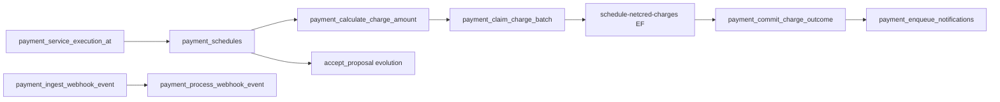

# Implementation Tasks — Renovi Payment System

> **Source of truth:** [`design.md`](./design.md) (v2.11) + [`payment-system-requirements.md`](./payment-system-requirements.md) (Req 1–33)
> **Generated:** engineering execution plan for squad linearization
> **Architecture:** RPC-first PostgreSQL orchestration + seven Edge Functions (PCI/external I/O only)

---

## Execution Strategy

### Implementation strategy

The payment subsystem SHALL be delivered **incrementally by operational boundary**, not by user-story alone. PostgreSQL owns authoritative state, leases, HMAC validation (Vault), webhook state machines, batch crons (`payment_cron_*` → `job_runs`), and MMD enqueue. Edge Functions remain **thin I/O connectors** — no queues, leases, or state transitions in Deno memory.

**Mandatory engineering gates (every task):**

1. **Migration safety:** new files in `supabase/migrations/` MUST use timestamps **after** the current mainline latest (`20260723120000_*` at plan authoring). Never edit applied migrations.
2. **Extended RPC safety:** before touching `accept_proposal`, `match_provider_jobs`, or `cns_initiate_conversation`, dump live bodies from local Postgres (`pg_get_functiondef`) — design.md §5.2.
3. **Same-migration invariants:** CREATE TABLE + RLS + indexes + REVOKE/GRANT in one migration; CREATE RPC + EXECUTE grants in one migration.
4. **Cron invariant:** pg_cron schedules **`SELECT public.payment_cron_*()`** only — never batch RPCs or EF URLs directly (§6.4).
5. **Project patterns:** feature code under `src/features/payments/`; tests via `yarn test:run` / `yarn test:deno` / pgTAP; Node **24.13** via nvm.

### Execution order (phases)

| Order | Phase | Unblocks |
|---|---|---|
| 1 | Foundation | Scheduling helper, constants, enum extensions |
| 2 | Persistence | All `payment_*` tables + RLS + views |
| 3 | Core transactional logic | Fee RPCs, KYC, accept_proposal evolution, update_method |
| 4 | Scheduling | claim/commit/begin_manual, lease janitor |
| 5 | Async orchestration | Webhook ingest/process/queue |
| 6 | Workers | pg_cron wrappers + job_runs |
| 7 | APIs | Seven Edge Functions + NetCredAdapter |
| 8 | Observability | Sentry, audit, payment_events |
| 9 | Recovery | Reconcile, dead letter, operator RPCs |
| 10 | Reliability | Auto-cancel, notify, auto-complete batches |
| 11 | Security | Rate limits, Vault, PCI verification |
| 12 | Performance | Index validation, partitioning (optional) |
| 13 | Verification | pgTAP, Deno, Vitest, E2E, failure injection |
| 14 | Rollout | Feature flags, shadow mode, cron enablement |

### Transactional dependency graph (critical path)



**Tasks that MUST land before any production charge:** Tasks 3, 4, 9, 17, 18, 25, 28, 29, 31, 51, 59, 61–65, 82, 92, 100.

### Rollout strategy

1. **Phase A (schema only):** Deploy migrations Tasks 2–16 with crons **unscheduled**.
2. **Phase B (RPC + EF in staging):** Enable Deno tests + pgTAP; run shadow claim (Task 101).
3. **Phase C (read paths):** Checkout UI + tokenize against sandbox NetCred.
4. **Phase D (async workers):** Enable `payment_cron_recover_orphaned_schedules`, `payment_cron_process_webhook_retry`, `payment_cron_reconcile_netcred_payments`.
5. **Phase E (money movement):** Enable `payment_cron_schedule_netcred_charges` with monitoring.
6. **Phase F (business batches):** auto-cancel, notify, auto-complete, onboarding detection.

### Validation strategy

- **Unit:** fee formula parity between `payment_calculate_installment_options` and `payment_calculate_charge_amount` (Task 92).
- **Concurrency:** parallel `payment_claim_charge_batch` sessions (Task 92, 99).
- **Idempotency:** webhook UNIQUE + accept_proposal idempotency_key (Tasks 98, 92).
- **Failure injection:** orphan lease, duplicate webhook, referenceCode conflict (Tasks 97, 98, 93).

### Recovery strategy

- **Orphan leases:** `payment_cron_recover_orphaned_schedules` every 30m (Task 56).
- **Webhook failures:** exponential backoff → DEAD_LETTER → operator reset RPC (Tasks 55, 49, 105).
- **Gateway timeout:** `getTransaction` before re-charge (Tasks 65, 93).
- **Rollback:** unschedule pg_cron jobs; EF deploy previous version; forward-only DB migrations (Task 103).

### Risk isolation

- Keep **notification failures** out of payment TX (async MMD only).
- Keep **PCI** isolated to `tokenize-payment-card` EF.
- **IN_ANALYSIS** blocks client cancel before T-12h; separate path at T-12h (Tasks 44, 87).
- **Provider SUSPENDED** skips charge + dedicated cancel reason (Tasks 44, 88).

---


# Phase 1: Database Foundation

## 1. [x] Establish payment implementation baseline and migration sequencing policy

Description:
Create the engineering baseline document section in repo workflow: verify current DB state (`yarn db:reset`), list existing payment-adjacent objects (`contracted_services`, `platform_constants`, `provider_profiles_private`, `accept_proposal`), and define migration naming convention `20260801000000_payment_*` sequential blocks. This task SHALL NOT ship product code — it unblocks all subsequent migrations.

**Orbit project standards (MUST on every task):**
- Follow feature-based architecture: `src/features/payments/` with `api/`, `hooks/`, `components/`, `types/`, `index.ts` public API.
- All backend mutations via PostgreSQL RPCs (`payment_*` prefix) or the seven Edge Functions listed in `design.md` §5.3 — no business logic in components/hooks.
- Before `CREATE OR REPLACE` on extended RPCs (`accept_proposal`, `match_provider_jobs`, `cns_initiate_conversation`): run `yarn db:reset` (or apply latest migrations), dump live bodies via `pg_get_functiondef`, then apply deltas — **never** copy from design snippets alone (design.md §5.2).
- New migrations MUST use timestamp **after** the latest file in `supabase/migrations/` (currently `20260723120000_*`); increment sequentially per migration file.
- Ship RLS + explicit `REVOKE`/`GRANT EXECUTE` in the **same migration** as table/RPC creation (design.md §11.2).
- pg_cron MUST schedule `payment_cron_*()` wrappers only; each wrapper MUST record `job_runs` telemetry (`.cursor/rules/job-runs-cron-telemetry.mdc`).
- Comments in code: English only; UI strings: PT-BR.
- Run `yarn test:run`, `yarn test:deno`, and pgTAP where applicable before marking task complete.

Responsibilities:
- Inventory live Postgres definitions for extended RPCs
- Document rollback strategy per phase
- Align squad ownership boundaries (DB vs EF vs frontend)

Implementation Details:
- Run `SELECT pg_get_functiondef` for `accept_proposal`, `match_provider_jobs`, `cns_initiate_conversation` after latest migration
- Confirm `contracted_service_status` enum values in local DB
- Record latest migration timestamp baseline

Deliverables:
- `docs/payment-system/IMPLEMENTATION_BASELINE.md` checklist (optional internal note in PR description)
- Verified function dumps stored in migration PR artifacts

Dependencies:
- None — first task

Runtime Guarantees:
- No runtime change
- Migration ordering deterministic

Failure Handling:
- N/A

Observability:
- Baseline captured in PR

Security Considerations:
- No secrets in dumps

Performance Considerations:
- N/A

Requirements covered:
26, All

Acceptance Criteria covered:
Pre-implementation gate

## 2. [x] Migration: extend `contracted_service_status` enum and payment lifecycle columns on `contracted_services`

Description:
Ship ALTER migration adding `CONFIRMED`, `EXECUTED` enum values (if not present) and columns `cancellation_reason`, `executed_at`, `completed_at`, `completed_by` per design.md §3.0. MUST NOT add `service_scheduled_at`.

**Orbit project standards (MUST on every task):**
- Follow feature-based architecture: `src/features/payments/` with `api/`, `hooks/`, `components/`, `types/`, `index.ts` public API.
- All backend mutations via PostgreSQL RPCs (`payment_*` prefix) or the seven Edge Functions listed in `design.md` §5.3 — no business logic in components/hooks.
- Before `CREATE OR REPLACE` on extended RPCs (`accept_proposal`, `match_provider_jobs`, `cns_initiate_conversation`): run `yarn db:reset` (or apply latest migrations), dump live bodies via `pg_get_functiondef`, then apply deltas — **never** copy from design snippets alone (design.md §5.2).
- New migrations MUST use timestamp **after** the latest file in `supabase/migrations/` (currently `20260723120000_*`); increment sequentially per migration file.
- Ship RLS + explicit `REVOKE`/`GRANT EXECUTE` in the **same migration** as table/RPC creation (design.md §11.2).
- pg_cron MUST schedule `payment_cron_*()` wrappers only; each wrapper MUST record `job_runs` telemetry (`.cursor/rules/job-runs-cron-telemetry.mdc`).
- Comments in code: English only; UI strings: PT-BR.
- Run `yarn test:run`, `yarn test:deno`, and pgTAP where applicable before marking task complete.

Responsibilities:
- Extend enum safely with `ADD VALUE IF NOT EXISTS`
- Add CHECK on `completed_by`
- Preserve existing CNS columns (`scheduled_start_date`, `scheduled_end_date`, `scheduled_shift`, `agreed_slot`)

Implementation Details:
- Single migration file after `20260723120000_*`
- Backfill NOT required — new columns nullable
- Verify no breaking change to existing CNS RPCs reading status

Deliverables:
- Migration SQL
- pgTAP smoke: enum values exist

Dependencies:
- Task 1

Runtime Guarantees:
- Existing rows unchanged
- New statuses available for payment flows

Failure Handling:
- Migration reversible via forward-only enum (document limitation)

Observability:
- Log migration apply in CI

Security Considerations:
- RLS on `contracted_services` unchanged unless required

Performance Considerations:
- No new hot indexes on large table without need

Requirements covered:
9, 32, 26

Acceptance Criteria covered:
9.3; 32.1; 26.1

## 3. [x] Migration: implement `payment_service_execution_at(contracted_services)` helper function

Description:
Create STABLE SQL function computing canonical service instant from `scheduled_start_date` + `scheduled_shift` in `America/Sao_Paulo` per design.md §3.0. This function SHALL be the sole scheduling anchor for T-2, T-12h, refund tiers, and manual-payment gates.

**Orbit project standards (MUST on every task):**
- Follow feature-based architecture: `src/features/payments/` with `api/`, `hooks/`, `components/`, `types/`, `index.ts` public API.
- All backend mutations via PostgreSQL RPCs (`payment_*` prefix) or the seven Edge Functions listed in `design.md` §5.3 — no business logic in components/hooks.
- Before `CREATE OR REPLACE` on extended RPCs (`accept_proposal`, `match_provider_jobs`, `cns_initiate_conversation`): run `yarn db:reset` (or apply latest migrations), dump live bodies via `pg_get_functiondef`, then apply deltas — **never** copy from design snippets alone (design.md §5.2).
- New migrations MUST use timestamp **after** the latest file in `supabase/migrations/` (currently `20260723120000_*`); increment sequentially per migration file.
- Ship RLS + explicit `REVOKE`/`GRANT EXECUTE` in the **same migration** as table/RPC creation (design.md §11.2).
- pg_cron MUST schedule `payment_cron_*()` wrappers only; each wrapper MUST record `job_runs` telemetry (`.cursor/rules/job-runs-cron-telemetry.mdc`).
- Comments in code: English only; UI strings: PT-BR.
- Run `yarn test:run`, `yarn test:deno`, and pgTAP where applicable before marking task complete.

Responsibilities:
- Implement shift→time mapping (morning/full_day 08:00, afternoon 13:00)
- Mark function IMMUTABLE/STABLE appropriately
- Grant EXECUTE to roles needing read helpers

Implementation Details:
- `CREATE OR REPLACE FUNCTION public.payment_service_execution_at(...)`
- Unit test via pgTAP comparing edge dates and DST boundaries
- Document anchor uses `scheduled_start_date` only

Deliverables:
- Migration SQL
- pgTAP tests for shift combinations

Dependencies:
- Task 2

Runtime Guarantees:
- Deterministic output for same row snapshot
- Timezone consistent across crons

Failure Handling:
- Function replace safe

Observability:
- N/A

Security Considerations:
- No PII in function

Performance Considerations:
- STABLE allows planner caching per statement

Requirements covered:
9, 14, 15, 33

Acceptance Criteria covered:
9.3; 14.1; 15.1; 33.5

## 4. [x] Migration: seed payment keys in `platform_constants`

Description:
Insert all payment-related `platform_constants` rows per design.md §3.12 / Req 25 including fee rates, retry limits, lease duration, onboarding batch size, HMAC TTL, reconciliation interval, webhook retry base, and `platform_commission_rate_pct`.

**Orbit project standards (MUST on every task):**
- Follow feature-based architecture: `src/features/payments/` with `api/`, `hooks/`, `components/`, `types/`, `index.ts` public API.
- All backend mutations via PostgreSQL RPCs (`payment_*` prefix) or the seven Edge Functions listed in `design.md` §5.3 — no business logic in components/hooks.
- Before `CREATE OR REPLACE` on extended RPCs (`accept_proposal`, `match_provider_jobs`, `cns_initiate_conversation`): run `yarn db:reset` (or apply latest migrations), dump live bodies via `pg_get_functiondef`, then apply deltas — **never** copy from design snippets alone (design.md §5.2).
- New migrations MUST use timestamp **after** the latest file in `supabase/migrations/` (currently `20260723120000_*`); increment sequentially per migration file.
- Ship RLS + explicit `REVOKE`/`GRANT EXECUTE` in the **same migration** as table/RPC creation (design.md §11.2).
- pg_cron MUST schedule `payment_cron_*()` wrappers only; each wrapper MUST record `job_runs` telemetry (`.cursor/rules/job-runs-cron-telemetry.mdc`).
- Comments in code: English only; UI strings: PT-BR.
- Run `yarn test:run`, `yarn test:deno`, and pgTAP where applicable before marking task complete.

Responsibilities:
- Use `INSERT ... ON CONFLICT DO UPDATE` or idempotent seed pattern
- Validate NUMERIC parsing in downstream RPCs
- Document fallback defaults when key missing (WARN log)

Implementation Details:
- Seed migration separate from table creates if `platform_constants` already exists
- Keys listed in Req 25 AC2–AC3

Deliverables:
- Migration SQL
- Seed verification query

Dependencies:
- Task 1

Runtime Guarantees:
- Constants readable immediately post-migration
- Missing key fallback SHALL NOT throw

Failure Handling:
- Re-run migration idempotent

Observability:
- WARN log on fallback read

Security Considerations:
- Constants readable by authenticated via existing RLS pattern

Performance Considerations:
- Single-row PK lookups — no perf concern

Requirements covered:
7, 10, 11, 14, 25

Acceptance Criteria covered:
25.1; 25.2; 25.3; 25.4

## 5. [x] Migration: create shared payment enums and `payment_*` schema foundation

Description:
Create PostgreSQL **ENUM types** for payment FSM vocabulary (gateway slug, schedule state, card token state, onboarding status, attempt initiator/outcome, webhook states, audit actor) in `20260801030000_payment_schema_foundation.sql` — same pattern as CNS `create_cns_enums`. Table CREATE migrations use these types on state/status columns.

**Orbit project standards (MUST on every task):**
- Follow feature-based architecture: `src/features/payments/` with `api/`, `hooks/`, `components/`, `types/`, `index.ts` public API.
- All backend mutations via PostgreSQL RPCs (`payment_*` prefix) or the seven Edge Functions listed in `design.md` §5.3 — no business logic in components/hooks.
- Before `CREATE OR REPLACE` on extended RPCs (`accept_proposal`, `match_provider_jobs`, `cns_initiate_conversation`): run `yarn db:reset` (or apply latest migrations), dump live bodies via `pg_get_functiondef`, then apply deltas — **never** copy from design snippets alone (design.md §5.2).
- New migrations MUST use timestamp **after** the latest file in `supabase/migrations/` (currently `20260723120000_*`); increment sequentially per migration file.
- Ship RLS + explicit `REVOKE`/`GRANT EXECUTE` in the **same migration** as table/RPC creation (design.md §11.2).
- pg_cron MUST schedule `payment_cron_*()` wrappers only; each wrapper MUST record `job_runs` telemetry (`.cursor/rules/job-runs-cron-telemetry.mdc`).
- Comments in code: English only; UI strings: PT-BR.
- Run `yarn test:run`, `yarn test:deno`, and pgTAP where applicable before marking task complete.

Responsibilities:
- Align state literals with design.md §2.3 state machines
- Nine `payment_*` enum types in foundation migration; no IMMUTABLE validator functions

Implementation Details:
- Foundation migration precedes table CREATE migrations
- Coordinate with Supabase type generation (`yarn generate-supabase-types`)

Deliverables:
- Migration SQL
- Updated `database.types.ts` after generate

Dependencies:
- Task 4

Runtime Guarantees:
- State vocabulary consistent across tables

Failure Handling:
- Forward-only

Observability:
- N/A

Security Considerations:
- N/A

Performance Considerations:
- N/A

Requirements covered:
26

Acceptance Criteria covered:
26.4; 26.7

# Phase 2: Persistence Layer

## 6. [x] Migration: CREATE `payment_gateway_tokens` with constraints, indexes, and RLS policies

Description:
Implement table `payment_gateway_tokens` exactly per design.md §3.2 including all columns, CHECK constraints, partial indexes, UNIQUE constraints, and mandatory deny-by-default RLS in the same migration. Direct client mutations to payment state MUST be blocked.

**Orbit project standards (MUST on every task):**
- Follow feature-based architecture: `src/features/payments/` with `api/`, `hooks/`, `components/`, `types/`, `index.ts` public API.
- All backend mutations via PostgreSQL RPCs (`payment_*` prefix) or the seven Edge Functions listed in `design.md` §5.3 — no business logic in components/hooks.
- Before `CREATE OR REPLACE` on extended RPCs (`accept_proposal`, `match_provider_jobs`, `cns_initiate_conversation`): run `yarn db:reset` (or apply latest migrations), dump live bodies via `pg_get_functiondef`, then apply deltas — **never** copy from design snippets alone (design.md §5.2).
- New migrations MUST use timestamp **after** the latest file in `supabase/migrations/` (currently `20260723120000_*`); increment sequentially per migration file.
- Ship RLS + explicit `REVOKE`/`GRANT EXECUTE` in the **same migration** as table/RPC creation (design.md §11.2).
- pg_cron MUST schedule `payment_cron_*()` wrappers only; each wrapper MUST record `job_runs` telemetry (`.cursor/rules/job-runs-cron-telemetry.mdc`).
- Comments in code: English only; UI strings: PT-BR.
- Run `yarn test:run`, `yarn test:deno`, and pgTAP where applicable before marking task complete.

Responsibilities:
- CREATE TABLE `payment_gateway_tokens` with gateway_slug CHECK (= 'netcred') where applicable
- CREATE indexes listed in design
- ENABLE RLS; policies per §11.2 matrix
- REVOKE direct INSERT/UPDATE from authenticated where mutations are RPC-only

Implementation Details:
- Timestamp after prior payment migration
- pgTAP: RLS enabled, policy count > 0
- Run `yarn generate-supabase-types`
- Verify no PUBLIC grants on table

Deliverables:
- Migration `*_create_payment_gateway_tokens.sql`
- RLS policies
- pgTAP RLS tests
- Indexes

Dependencies:
- Task 2

Runtime Guarantees:
- Append-only tables reject UPDATE/DELETE via grants
- FK integrity enforced

Failure Handling:
- Migration failure rolls back entire file

Observability:
- Audit table creation in migration log

Security Considerations:
- Least-privilege RLS
- service_role only where required

Performance Considerations:
- Partial indexes for cron/eligibility queries

Requirements covered:
2

Acceptance Criteria covered:
26.2

## 7. [x] Migration: CREATE `client_card_tokens` with constraints, indexes, and RLS policies

Description:
Implement table `client_card_tokens` exactly per design.md §3.3 including all columns, CHECK constraints, partial indexes, UNIQUE constraints, and mandatory deny-by-default RLS in the same migration. Direct client mutations to payment state MUST be blocked.

**Orbit project standards (MUST on every task):**
- Follow feature-based architecture: `src/features/payments/` with `api/`, `hooks/`, `components/`, `types/`, `index.ts` public API.
- All backend mutations via PostgreSQL RPCs (`payment_*` prefix) or the seven Edge Functions listed in `design.md` §5.3 — no business logic in components/hooks.
- Before `CREATE OR REPLACE` on extended RPCs (`accept_proposal`, `match_provider_jobs`, `cns_initiate_conversation`): run `yarn db:reset` (or apply latest migrations), dump live bodies via `pg_get_functiondef`, then apply deltas — **never** copy from design snippets alone (design.md §5.2).
- New migrations MUST use timestamp **after** the latest file in `supabase/migrations/` (currently `20260723120000_*`); increment sequentially per migration file.
- Ship RLS + explicit `REVOKE`/`GRANT EXECUTE` in the **same migration** as table/RPC creation (design.md §11.2).
- pg_cron MUST schedule `payment_cron_*()` wrappers only; each wrapper MUST record `job_runs` telemetry (`.cursor/rules/job-runs-cron-telemetry.mdc`).
- Comments in code: English only; UI strings: PT-BR.
- Run `yarn test:run`, `yarn test:deno`, and pgTAP where applicable before marking task complete.

Responsibilities:
- CREATE TABLE `client_card_tokens` with gateway_slug CHECK (= 'netcred') where applicable
- CREATE VIEW `client_card_tokens_safe_v` (§3.3) — client app reads this view only; excludes `gateway_card_token` and `billing_address`
- CREATE indexes listed in design
- ENABLE RLS; policies per §11.2 matrix
- REVOKE direct INSERT/UPDATE from authenticated where mutations are RPC-only

Implementation Details:
- Timestamp after prior payment migration
- pgTAP: RLS enabled, policy count > 0
- Run `yarn generate-supabase-types`
- Verify no PUBLIC grants on table

Deliverables:
- Migration `*_create_client_card_tokens.sql`
- View `client_card_tokens_safe_v` + `cards.api.ts` client read path (currently reads `client_card_tokens`; switch view in a follow-up task)
- RLS policies
- pgTAP RLS tests
- Indexes

Dependencies:
- Task 6

Runtime Guarantees:
- Append-only tables reject UPDATE/DELETE via grants
- FK integrity enforced

Failure Handling:
- Migration failure rolls back entire file

Observability:
- Audit table creation in migration log

Security Considerations:
- Least-privilege RLS
- service_role only where required

Performance Considerations:
- Partial indexes for cron/eligibility queries

Requirements covered:
6, 24

Acceptance Criteria covered:
26.3; 24.2

## 8. [x] Migration: CREATE `provider_gateway_accounts` with constraints, indexes, and RLS policies

Description:
Implement table `provider_gateway_accounts` exactly per design.md §3.4 including all columns, CHECK constraints, partial indexes, UNIQUE constraints, and mandatory deny-by-default RLS in the same migration. Direct client mutations to payment state MUST be blocked.

**Orbit project standards (MUST on every task):**
- Follow feature-based architecture: `src/features/payments/` with `api/`, `hooks/`, `components/`, `types/`, `index.ts` public API.
- All backend mutations via PostgreSQL RPCs (`payment_*` prefix) or the seven Edge Functions listed in `design.md` §5.3 — no business logic in components/hooks.
- Before `CREATE OR REPLACE` on extended RPCs (`accept_proposal`, `match_provider_jobs`, `cns_initiate_conversation`): run `yarn db:reset` (or apply latest migrations), dump live bodies via `pg_get_functiondef`, then apply deltas — **never** copy from design snippets alone (design.md §5.2).
- New migrations MUST use timestamp **after** the latest file in `supabase/migrations/` (currently `20260723120000_*`); increment sequentially per migration file.
- Ship RLS + explicit `REVOKE`/`GRANT EXECUTE` in the **same migration** as table/RPC creation (design.md §11.2).
- pg_cron MUST schedule `payment_cron_*()` wrappers only; each wrapper MUST record `job_runs` telemetry (`.cursor/rules/job-runs-cron-telemetry.mdc`).
- Comments in code: English only; UI strings: PT-BR.
- Run `yarn test:run`, `yarn test:deno`, and pgTAP where applicable before marking task complete.

Responsibilities:
- CREATE TABLE `provider_gateway_accounts` with gateway_slug CHECK (= 'netcred') where applicable
- CREATE indexes listed in design
- ENABLE RLS; policies per §11.2 matrix
- REVOKE direct INSERT/UPDATE from authenticated where mutations are RPC-only

Implementation Details:
- Timestamp after prior payment migration
- pgTAP: RLS enabled, policy count > 0
- Run `yarn generate-supabase-types`
- Verify no PUBLIC grants on table

Deliverables:
- Migration `*_create_provider_gateway_accounts.sql`
- RLS policies
- pgTAP RLS tests
- Indexes

Dependencies:
- Task 7

Runtime Guarantees:
- Append-only tables reject UPDATE/DELETE via grants
- FK integrity enforced

Failure Handling:
- Migration failure rolls back entire file

Observability:
- Audit table creation in migration log

Security Considerations:
- Least-privilege RLS
- service_role only where required

Performance Considerations:
- Partial indexes for cron/eligibility queries

Requirements covered:
3, 4, 29

Acceptance Criteria covered:
26.8; 3.1; 29.1

## 9. [x] Migration: CREATE `payment_schedules` with constraints, indexes, and RLS policies

Description:
Implement table `payment_schedules` exactly per design.md §3.5 including all columns, CHECK constraints, partial indexes, UNIQUE constraints, and mandatory deny-by-default RLS in the same migration. Direct client mutations to payment state MUST be blocked.

**Orbit project standards (MUST on every task):**
- Follow feature-based architecture: `src/features/payments/` with `api/`, `hooks/`, `components/`, `types/`, `index.ts` public API.
- All backend mutations via PostgreSQL RPCs (`payment_*` prefix) or the seven Edge Functions listed in `design.md` §5.3 — no business logic in components/hooks.
- Before `CREATE OR REPLACE` on extended RPCs (`accept_proposal`, `match_provider_jobs`, `cns_initiate_conversation`): run `yarn db:reset` (or apply latest migrations), dump live bodies via `pg_get_functiondef`, then apply deltas — **never** copy from design snippets alone (design.md §5.2).
- New migrations MUST use timestamp **after** the latest file in `supabase/migrations/` (currently `20260723120000_*`); increment sequentially per migration file.
- Ship RLS + explicit `REVOKE`/`GRANT EXECUTE` in the **same migration** as table/RPC creation (design.md §11.2).
- pg_cron MUST schedule `payment_cron_*()` wrappers only; each wrapper MUST record `job_runs` telemetry (`.cursor/rules/job-runs-cron-telemetry.mdc`).
- Comments in code: English only; UI strings: PT-BR.
- Run `yarn test:run`, `yarn test:deno`, and pgTAP where applicable before marking task complete.

Responsibilities:
- CREATE TABLE `payment_schedules` with gateway_slug CHECK (= 'netcred') where applicable
- CREATE indexes listed in design
- ENABLE RLS; policies per §11.2 matrix
- REVOKE direct INSERT/UPDATE from authenticated where mutations are RPC-only

Implementation Details:
- Timestamp after prior payment migration
- pgTAP: RLS enabled, policy count > 0
- Run `yarn generate-supabase-types`
- Verify no PUBLIC grants on table

Deliverables:
- Migration `*_create_payment_schedules.sql`
- RLS policies
- pgTAP RLS tests
- Indexes

Dependencies:
- Task 7
- Task 8
- Task 3

Runtime Guarantees:
- Append-only tables reject UPDATE/DELETE via grants
- FK integrity enforced

Failure Handling:
- Migration failure rolls back entire file

Observability:
- Audit table creation in migration log

Security Considerations:
- Least-privilege RLS
- service_role only where required

Performance Considerations:
- Partial indexes for cron/eligibility queries

Requirements covered:
8, 9, 10, 23

Acceptance Criteria covered:
26.4; 9.1; 10.1

## 10. [x] Migration: CREATE `payment_attempts` with constraints, indexes, and RLS policies

Description:
Implement table `payment_attempts` exactly per design.md §3.6 including all columns, CHECK constraints, partial indexes, UNIQUE constraints, and mandatory deny-by-default RLS in the same migration. Direct client mutations to payment state MUST be blocked.

**Orbit project standards (MUST on every task):**
- Follow feature-based architecture: `src/features/payments/` with `api/`, `hooks/`, `components/`, `types/`, `index.ts` public API.
- All backend mutations via PostgreSQL RPCs (`payment_*` prefix) or the seven Edge Functions listed in `design.md` §5.3 — no business logic in components/hooks.
- Before `CREATE OR REPLACE` on extended RPCs (`accept_proposal`, `match_provider_jobs`, `cns_initiate_conversation`): run `yarn db:reset` (or apply latest migrations), dump live bodies via `pg_get_functiondef`, then apply deltas — **never** copy from design snippets alone (design.md §5.2).
- New migrations MUST use timestamp **after** the latest file in `supabase/migrations/` (currently `20260723120000_*`); increment sequentially per migration file.
- Ship RLS + explicit `REVOKE`/`GRANT EXECUTE` in the **same migration** as table/RPC creation (design.md §11.2).
- pg_cron MUST schedule `payment_cron_*()` wrappers only; each wrapper MUST record `job_runs` telemetry (`.cursor/rules/job-runs-cron-telemetry.mdc`).
- Comments in code: English only; UI strings: PT-BR.
- Run `yarn test:run`, `yarn test:deno`, and pgTAP where applicable before marking task complete.

Responsibilities:
- CREATE TABLE `payment_attempts` with gateway_slug CHECK (= 'netcred') where applicable
- CREATE indexes listed in design
- ENABLE RLS; policies per §11.2 matrix
- REVOKE direct INSERT/UPDATE from authenticated where mutations are RPC-only

Implementation Details:
- Timestamp after prior payment migration
- pgTAP: RLS enabled, policy count > 0
- Run `yarn generate-supabase-types`
- Verify no PUBLIC grants on table

Deliverables:
- Migration `*_create_payment_attempts.sql`
- RLS policies
- pgTAP RLS tests
- Indexes

Dependencies:
- Task 9

Runtime Guarantees:
- Append-only tables reject UPDATE/DELETE via grants
- FK integrity enforced

Failure Handling:
- Migration failure rolls back entire file

Observability:
- Audit table creation in migration log

Security Considerations:
- Least-privilege RLS
- service_role only where required

Performance Considerations:
- Partial indexes for cron/eligibility queries

Requirements covered:
10, 11, 22

Acceptance Criteria covered:
26.5; 10.2

## 11. [x] Migration: CREATE `payment_webhook_events` with constraints, indexes, and RLS policies

Description:
Implement table `payment_webhook_events` exactly per design.md §3.7 including all columns, CHECK constraints, partial indexes, UNIQUE constraints, and mandatory deny-by-default RLS in the same migration. Direct client mutations to payment state MUST be blocked.

**Orbit project standards (MUST on every task):**
- Follow feature-based architecture: `src/features/payments/` with `api/`, `hooks/`, `components/`, `types/`, `index.ts` public API.
- All backend mutations via PostgreSQL RPCs (`payment_*` prefix) or the seven Edge Functions listed in `design.md` §5.3 — no business logic in components/hooks.
- Before `CREATE OR REPLACE` on extended RPCs (`accept_proposal`, `match_provider_jobs`, `cns_initiate_conversation`): run `yarn db:reset` (or apply latest migrations), dump live bodies via `pg_get_functiondef`, then apply deltas — **never** copy from design snippets alone (design.md §5.2).
- New migrations MUST use timestamp **after** the latest file in `supabase/migrations/` (currently `20260723120000_*`); increment sequentially per migration file.
- Ship RLS + explicit `REVOKE`/`GRANT EXECUTE` in the **same migration** as table/RPC creation (design.md §11.2).
- pg_cron MUST schedule `payment_cron_*()` wrappers only; each wrapper MUST record `job_runs` telemetry (`.cursor/rules/job-runs-cron-telemetry.mdc`).
- Comments in code: English only; UI strings: PT-BR.
- Run `yarn test:run`, `yarn test:deno`, and pgTAP where applicable before marking task complete.

Responsibilities:
- CREATE TABLE `payment_webhook_events` with gateway_slug CHECK (= 'netcred') where applicable
- CREATE indexes listed in design
- ENABLE RLS; policies per §11.2 matrix
- REVOKE direct INSERT/UPDATE from authenticated where mutations are RPC-only

Implementation Details:
- Timestamp after prior payment migration
- pgTAP: RLS enabled, policy count > 0
- Run `yarn generate-supabase-types`
- Verify no PUBLIC grants on table

Deliverables:
- Migration `*_create_payment_webhook_events.sql`
- RLS policies
- pgTAP RLS tests
- Indexes

Dependencies:
- Task 9

Runtime Guarantees:
- Append-only tables reject UPDATE/DELETE via grants
- FK integrity enforced

Failure Handling:
- Migration failure rolls back entire file

Observability:
- Audit table creation in migration log

Security Considerations:
- Least-privilege RLS
- service_role only where required

Performance Considerations:
- Partial indexes for cron/eligibility queries

Requirements covered:
16, 17, 18, 19

Acceptance Criteria covered:
26.6; 16.1; 17.1

## 12. [x] Migration: CREATE `payment_webhook_processing_queue` with constraints, indexes, and RLS policies

Description:
Implement table `payment_webhook_processing_queue` exactly per design.md §3.8 including all columns, CHECK constraints, partial indexes, UNIQUE constraints, and mandatory deny-by-default RLS in the same migration. Direct client mutations to payment state MUST be blocked.

**Orbit project standards (MUST on every task):**
- Follow feature-based architecture: `src/features/payments/` with `api/`, `hooks/`, `components/`, `types/`, `index.ts` public API.
- All backend mutations via PostgreSQL RPCs (`payment_*` prefix) or the seven Edge Functions listed in `design.md` §5.3 — no business logic in components/hooks.
- Before `CREATE OR REPLACE` on extended RPCs (`accept_proposal`, `match_provider_jobs`, `cns_initiate_conversation`): run `yarn db:reset` (or apply latest migrations), dump live bodies via `pg_get_functiondef`, then apply deltas — **never** copy from design snippets alone (design.md §5.2).
- New migrations MUST use timestamp **after** the latest file in `supabase/migrations/` (currently `20260723120000_*`); increment sequentially per migration file.
- Ship RLS + explicit `REVOKE`/`GRANT EXECUTE` in the **same migration** as table/RPC creation (design.md §11.2).
- pg_cron MUST schedule `payment_cron_*()` wrappers only; each wrapper MUST record `job_runs` telemetry (`.cursor/rules/job-runs-cron-telemetry.mdc`).
- Comments in code: English only; UI strings: PT-BR.
- Run `yarn test:run`, `yarn test:deno`, and pgTAP where applicable before marking task complete.

Responsibilities:
- CREATE TABLE `payment_webhook_processing_queue` with gateway_slug CHECK (= 'netcred') where applicable
- CREATE indexes listed in design
- ENABLE RLS; policies per §11.2 matrix
- REVOKE direct INSERT/UPDATE from authenticated where mutations are RPC-only

Implementation Details:
- Timestamp after prior payment migration
- pgTAP: RLS enabled, policy count > 0
- Run `yarn generate-supabase-types`
- Verify no PUBLIC grants on table

Deliverables:
- Migration `*_create_payment_webhook_processing_queue.sql`
- RLS policies
- pgTAP RLS tests
- Indexes

Dependencies:
- Task 11

Runtime Guarantees:
- Append-only tables reject UPDATE/DELETE via grants
- FK integrity enforced

Failure Handling:
- Migration failure rolls back entire file

Observability:
- Audit table creation in migration log

Security Considerations:
- Least-privilege RLS
- service_role only where required

Performance Considerations:
- Partial indexes for cron/eligibility queries

Requirements covered:
16, 19

Acceptance Criteria covered:
19.1

## 13. [x] Migration: CREATE `payment_audit_log` with constraints, indexes, and RLS policies

Description:
Implement table `payment_audit_log` exactly per design.md §3.9 including all columns, CHECK constraints, partial indexes, UNIQUE constraints, and mandatory deny-by-default RLS in the same migration. Direct client mutations to payment state MUST be blocked.

**Orbit project standards (MUST on every task):**
- Follow feature-based architecture: `src/features/payments/` with `api/`, `hooks/`, `components/`, `types/`, `index.ts` public API.
- All backend mutations via PostgreSQL RPCs (`payment_*` prefix) or the seven Edge Functions listed in `design.md` §5.3 — no business logic in components/hooks.
- Before `CREATE OR REPLACE` on extended RPCs (`accept_proposal`, `match_provider_jobs`, `cns_initiate_conversation`): run `yarn db:reset` (or apply latest migrations), dump live bodies via `pg_get_functiondef`, then apply deltas — **never** copy from design snippets alone (design.md §5.2).
- New migrations MUST use timestamp **after** the latest file in `supabase/migrations/` (currently `20260723120000_*`); increment sequentially per migration file.
- Ship RLS + explicit `REVOKE`/`GRANT EXECUTE` in the **same migration** as table/RPC creation (design.md §11.2).
- pg_cron MUST schedule `payment_cron_*()` wrappers only; each wrapper MUST record `job_runs` telemetry (`.cursor/rules/job-runs-cron-telemetry.mdc`).
- Comments in code: English only; UI strings: PT-BR.
- Run `yarn test:run`, `yarn test:deno`, and pgTAP where applicable before marking task complete.

Responsibilities:
- CREATE TABLE `payment_audit_log` with gateway_slug CHECK (= 'netcred') where applicable
- CREATE indexes listed in design
- ENABLE RLS; policies per §11.2 matrix
- REVOKE direct INSERT/UPDATE from authenticated where mutations are RPC-only

Implementation Details:
- Timestamp after prior payment migration
- pgTAP: RLS enabled, policy count > 0
- Run `yarn generate-supabase-types`
- Verify no PUBLIC grants on table

Deliverables:
- Migration `*_create_payment_audit_log.sql`
- RLS policies
- pgTAP RLS tests
- Indexes

Dependencies:
- Task 9

Runtime Guarantees:
- Append-only tables reject UPDATE/DELETE via grants
- FK integrity enforced

Failure Handling:
- Migration failure rolls back entire file

Observability:
- Audit table creation in migration log

Security Considerations:
- Least-privilege RLS
- service_role only where required

Performance Considerations:
- Partial indexes for cron/eligibility queries

Requirements covered:
22, 30

Acceptance Criteria covered:
26.7; 22.1

## 14. [x] Migration: CREATE `payment_events` with constraints, indexes, and RLS policies

Description:
Implement table `payment_events` exactly per design.md §3.10 including all columns, CHECK constraints, partial indexes, UNIQUE constraints, and mandatory deny-by-default RLS in the same migration. Direct client mutations to payment state MUST be blocked.

**Orbit project standards (MUST on every task):**
- Follow feature-based architecture: `src/features/payments/` with `api/`, `hooks/`, `components/`, `types/`, `index.ts` public API.
- All backend mutations via PostgreSQL RPCs (`payment_*` prefix) or the seven Edge Functions listed in `design.md` §5.3 — no business logic in components/hooks.
- Before `CREATE OR REPLACE` on extended RPCs (`accept_proposal`, `match_provider_jobs`, `cns_initiate_conversation`): run `yarn db:reset` (or apply latest migrations), dump live bodies via `pg_get_functiondef`, then apply deltas — **never** copy from design snippets alone (design.md §5.2).
- New migrations MUST use timestamp **after** the latest file in `supabase/migrations/` (currently `20260723120000_*`); increment sequentially per migration file.
- Ship RLS + explicit `REVOKE`/`GRANT EXECUTE` in the **same migration** as table/RPC creation (design.md §11.2).
- pg_cron MUST schedule `payment_cron_*()` wrappers only; each wrapper MUST record `job_runs` telemetry (`.cursor/rules/job-runs-cron-telemetry.mdc`).
- Comments in code: English only; UI strings: PT-BR.
- Run `yarn test:run`, `yarn test:deno`, and pgTAP where applicable before marking task complete.

Responsibilities:
- CREATE TABLE `payment_events` with gateway_slug CHECK (= 'netcred') where applicable
- CREATE indexes listed in design
- ENABLE RLS; policies per §11.2 matrix
- REVOKE direct INSERT/UPDATE from authenticated where mutations are RPC-only

Implementation Details:
- Timestamp after prior payment migration
- pgTAP: RLS enabled, policy count > 0
- Run `yarn generate-supabase-types`
- Verify no PUBLIC grants on table

Deliverables:
- Migration `*_create_payment_events.sql`
- RLS policies
- pgTAP RLS tests
- Indexes

Dependencies:
- Task 9

Runtime Guarantees:
- Append-only tables reject UPDATE/DELETE via grants
- FK integrity enforced

Failure Handling:
- Migration failure rolls back entire file

Observability:
- Audit table creation in migration log

Security Considerations:
- Least-privilege RLS
- service_role only where required

Performance Considerations:
- Partial indexes for cron/eligibility queries

Requirements covered:
30

Acceptance Criteria covered:
30.1

## 15. [x] Migration: extend `provider_profiles_private` with KYC/banking/document columns

Description:
ALTER existing `provider_profiles_private` adding payment KYC columns per design.md §3.11. MUST NOT create `provider_kyc_submissions` table. Phone for KYC reuses `profiles.phone`.

**Orbit project standards (MUST on every task):**
- Follow feature-based architecture: `src/features/payments/` with `api/`, `hooks/`, `components/`, `types/`, `index.ts` public API.
- All backend mutations via PostgreSQL RPCs (`payment_*` prefix) or the seven Edge Functions listed in `design.md` §5.3 — no business logic in components/hooks.
- Before `CREATE OR REPLACE` on extended RPCs (`accept_proposal`, `match_provider_jobs`, `cns_initiate_conversation`): run `yarn db:reset` (or apply latest migrations), dump live bodies via `pg_get_functiondef`, then apply deltas — **never** copy from design snippets alone (design.md §5.2).
- New migrations MUST use timestamp **after** the latest file in `supabase/migrations/` (currently `20260723120000_*`); increment sequentially per migration file.
- Ship RLS + explicit `REVOKE`/`GRANT EXECUTE` in the **same migration** as table/RPC creation (design.md §11.2).
- pg_cron MUST schedule `payment_cron_*()` wrappers only; each wrapper MUST record `job_runs` telemetry (`.cursor/rules/job-runs-cron-telemetry.mdc`).
- Comments in code: English only; UI strings: PT-BR.
- Run `yarn test:run`, `yarn test:deno`, and pgTAP where applicable before marking task complete.

Responsibilities:
- Add legal_rep phone, bank fields, document URLs
- Preserve existing RLS pattern
- Private storage bucket paths documented

Implementation Details:
- Same migration or follow-on to provider_gateway_accounts
- Align with `payment_submit_provider_kyc` upcoming RPC

Deliverables:
- ALTER migration
- Storage policy alignment note

Dependencies:
- Task 8

Runtime Guarantees:
- 1 row per provider overwrite semantics

Failure Handling:
- Column add non-breaking

Observability:
- N/A

Security Considerations:
- Provider-only SELECT/UPDATE own row

Performance Considerations:
- N/A

Requirements covered:
3, 26

Acceptance Criteria covered:
3.2; 3.3; 26.8

## 16. [x] Migration: create payment history views `client_payment_transactions_v` and `provider_payment_receivables_v`

Description:
Implement read models per design.md §3.13 with `security_invoker = true`, column visibility rules (client sees paid_amount/base_amount; provider sees provider_payout net), and supporting indexes.

**Orbit project standards (MUST on every task):**
- Follow feature-based architecture: `src/features/payments/` with `api/`, `hooks/`, `components/`, `types/`, `index.ts` public API.
- All backend mutations via PostgreSQL RPCs (`payment_*` prefix) or the seven Edge Functions listed in `design.md` §5.3 — no business logic in components/hooks.
- Before `CREATE OR REPLACE` on extended RPCs (`accept_proposal`, `match_provider_jobs`, `cns_initiate_conversation`): run `yarn db:reset` (or apply latest migrations), dump live bodies via `pg_get_functiondef`, then apply deltas — **never** copy from design snippets alone (design.md §5.2).
- New migrations MUST use timestamp **after** the latest file in `supabase/migrations/` (currently `20260723120000_*`); increment sequentially per migration file.
- Ship RLS + explicit `REVOKE`/`GRANT EXECUTE` in the **same migration** as table/RPC creation (design.md §11.2).
- pg_cron MUST schedule `payment_cron_*()` wrappers only; each wrapper MUST record `job_runs` telemetry (`.cursor/rules/job-runs-cron-telemetry.mdc`).
- Comments in code: English only; UI strings: PT-BR.
- Run `yarn test:run`, `yarn test:deno`, and pgTAP where applicable before marking task complete.

Responsibilities:
- Views MUST NOT expose cross-role financial fields
- Filter to realized money movement (PAID+ states)
- RLS on underlying tables applies via invoker

Implementation Details:
- CREATE VIEW with documented column semantics
- GRANT SELECT to authenticated
- pgTAP visibility tests per role

Deliverables:
- Two view migrations or single file
- Index migrations §3.13

Dependencies:
- Tasks 9
- 13

Runtime Guarantees:
- Read-only; no mutation path

Failure Handling:
- View replace idempotent

Observability:
- Role-scoped columns

Security Considerations:
- Index-backed joins to payment_schedules

Performance Considerations:
- 26
- 27

Requirements covered:
26.9, 1.7.11

Acceptance Criteria covered:
See mapped requirements above

# Phase 3: Core Transactional Logic

## 17. [x] Implement RPC `payment_calculate_charge_amount`

Description:
Pure fee computation RPC mirroring installment formula; ROUND_HALF_UP; reads platform_constants; used at claim and charge time. SECURITY DEFINER with explicit REVOKE/GRANT EXECUTE per design.md §5.2. SET search_path includes vault/extensions when secrets needed.

**Orbit project standards (MUST on every task):**
- Follow feature-based architecture: `src/features/payments/` with `api/`, `hooks/`, `components/`, `types/`, `index.ts` public API.
- All backend mutations via PostgreSQL RPCs (`payment_*` prefix) or the seven Edge Functions listed in `design.md` §5.3 — no business logic in components/hooks.
- Before `CREATE OR REPLACE` on extended RPCs (`accept_proposal`, `match_provider_jobs`, `cns_initiate_conversation`): run `yarn db:reset` (or apply latest migrations), dump live bodies via `pg_get_functiondef`, then apply deltas — **never** copy from design snippets alone (design.md §5.2).
- New migrations MUST use timestamp **after** the latest file in `supabase/migrations/` (currently `20260723120000_*`); increment sequentially per migration file.
- Ship RLS + explicit `REVOKE`/`GRANT EXECUTE` in the **same migration** as table/RPC creation (design.md §11.2).
- pg_cron MUST schedule `payment_cron_*()` wrappers only; each wrapper MUST record `job_runs` telemetry (`.cursor/rules/job-runs-cron-telemetry.mdc`).
- Comments in code: English only; UI strings: PT-BR.
- Run `yarn test:run`, `yarn test:deno`, and pgTAP where applicable before marking task complete.

Responsibilities:
- Implement `payment_calculate_charge_amount` body per design.md §4–5
- Authorize caller (auth.uid() or service_role)
- Insert audit/events in same TX when mutating

Implementation Details:
- Dump no extended RPC unless this replaces greenfield function
- pgTAP tests for auth failures and happy path
- Errcodes mapped to API error_code

Deliverables:
- Migration SQL
- RPC `payment_calculate_charge_amount`
- pgTAP
- Types regenerate

Dependencies:
- Task 9
- Task 10

Runtime Guarantees:
- Atomic TX for mutations
- Idempotency where specified

Failure Handling:
- RAISE mapped errors; no partial commits

Observability:
- Structured RAISE LOG for ops

Security Considerations:
- SECURITY DEFINER + in-function auth

Performance Considerations:
- FOR UPDATE / index-friendly WHERE clauses

Requirements covered:
7, 25

Acceptance Criteria covered:
7.6; 25.5

## 18. [x] Implement RPC `payment_calculate_installment_options`

Description:
Client RPC: fee table 1-12, HMAC via Vault INSTALLMENT_SIGNING_SECRET, expires_at TTL from platform_constants. SECURITY DEFINER with explicit REVOKE/GRANT EXECUTE per design.md §5.2. SET search_path includes vault/extensions when secrets needed.

**Orbit project standards (MUST on every task):**
- Follow feature-based architecture: `src/features/payments/` with `api/`, `hooks/`, `components/`, `types/`, `index.ts` public API.
- All backend mutations via PostgreSQL RPCs (`payment_*` prefix) or the seven Edge Functions listed in `design.md` §5.3 — no business logic in components/hooks.
- Before `CREATE OR REPLACE` on extended RPCs (`accept_proposal`, `match_provider_jobs`, `cns_initiate_conversation`): run `yarn db:reset` (or apply latest migrations), dump live bodies via `pg_get_functiondef`, then apply deltas — **never** copy from design snippets alone (design.md §5.2).
- New migrations MUST use timestamp **after** the latest file in `supabase/migrations/` (currently `20260723120000_*`); increment sequentially per migration file.
- Ship RLS + explicit `REVOKE`/`GRANT EXECUTE` in the **same migration** as table/RPC creation (design.md §11.2).
- pg_cron MUST schedule `payment_cron_*()` wrappers only; each wrapper MUST record `job_runs` telemetry (`.cursor/rules/job-runs-cron-telemetry.mdc`).
- Comments in code: English only; UI strings: PT-BR.
- Run `yarn test:run`, `yarn test:deno`, and pgTAP where applicable before marking task complete.

Responsibilities:
- Implement `payment_calculate_installment_options` body per design.md §4–5
- Authorize caller (auth.uid() or service_role)
- Insert audit/events in same TX when mutating

Implementation Details:
- Dump no extended RPC unless this replaces greenfield function
- pgTAP tests for auth failures and happy path
- Errcodes mapped to API error_code

Deliverables:
- Migration SQL
- RPC `payment_calculate_installment_options`
- pgTAP
- Types regenerate

Dependencies:
- Task 7
- Task 8
- Task 27

Runtime Guarantees:
- Atomic TX for mutations
- Idempotency where specified

Failure Handling:
- RAISE mapped errors; no partial commits

Observability:
- Structured RAISE LOG for ops

Security Considerations:
- SECURITY DEFINER + in-function auth

Performance Considerations:
- FOR UPDATE / index-friendly WHERE clauses

Requirements covered:
17, 4

Acceptance Criteria covered:
7.1; 7.4; 7.5; 8.1

## 19. [x] Implement RPC `payment_get_checkout_step_requirements`

Description:
Returns needs_cpf, needs_phone, needs_card for stepper. SECURITY DEFINER with explicit REVOKE/GRANT EXECUTE per design.md §5.2. SET search_path includes vault/extensions when secrets needed.

**Orbit project standards (MUST on every task):**
- Follow feature-based architecture: `src/features/payments/` with `api/`, `hooks/`, `components/`, `types/`, `index.ts` public API.
- All backend mutations via PostgreSQL RPCs (`payment_*` prefix) or the seven Edge Functions listed in `design.md` §5.3 — no business logic in components/hooks.
- Before `CREATE OR REPLACE` on extended RPCs (`accept_proposal`, `match_provider_jobs`, `cns_initiate_conversation`): run `yarn db:reset` (or apply latest migrations), dump live bodies via `pg_get_functiondef`, then apply deltas — **never** copy from design snippets alone (design.md §5.2).
- New migrations MUST use timestamp **after** the latest file in `supabase/migrations/` (currently `20260723120000_*`); increment sequentially per migration file.
- Ship RLS + explicit `REVOKE`/`GRANT EXECUTE` in the **same migration** as table/RPC creation (design.md §11.2).
- pg_cron MUST schedule `payment_cron_*()` wrappers only; each wrapper MUST record `job_runs` telemetry (`.cursor/rules/job-runs-cron-telemetry.mdc`).
- Comments in code: English only; UI strings: PT-BR.
- Run `yarn test:run`, `yarn test:deno`, and pgTAP where applicable before marking task complete.

Responsibilities:
- Implement `payment_get_checkout_step_requirements` body per design.md §4–5
- Authorize caller (auth.uid() or service_role)
- Insert audit/events in same TX when mutating

Implementation Details:
- Dump no extended RPC unless this replaces greenfield function
- pgTAP tests for auth failures and happy path
- Errcodes mapped to API error_code

Deliverables:
- Migration SQL
- RPC `payment_get_checkout_step_requirements`
- pgTAP
- Types regenerate

Dependencies:
- Task 5

Runtime Guarantees:
- Atomic TX for mutations
- Idempotency where specified

Failure Handling:
- RAISE mapped errors; no partial commits

Observability:
- Structured RAISE LOG for ops

Security Considerations:
- SECURITY DEFINER + in-function auth

Performance Considerations:
- FOR UPDATE / index-friendly WHERE clauses

Requirements covered:
7

Acceptance Criteria covered:
5.1

## 20. [x] Implement RPC `payment_persist_client_card_token`

Description:
service_role RPC called by tokenize EF; INSERT client_card_tokens ACTIVE only. SECURITY DEFINER with explicit REVOKE/GRANT EXECUTE per design.md §5.2. SET search_path includes vault/extensions when secrets needed.

**Orbit project standards (MUST on every task):**
- Follow feature-based architecture: `src/features/payments/` with `api/`, `hooks/`, `components/`, `types/`, `index.ts` public API.
- All backend mutations via PostgreSQL RPCs (`payment_*` prefix) or the seven Edge Functions listed in `design.md` §5.3 — no business logic in components/hooks.
- Before `CREATE OR REPLACE` on extended RPCs (`accept_proposal`, `match_provider_jobs`, `cns_initiate_conversation`): run `yarn db:reset` (or apply latest migrations), dump live bodies via `pg_get_functiondef`, then apply deltas — **never** copy from design snippets alone (design.md §5.2).
- New migrations MUST use timestamp **after** the latest file in `supabase/migrations/` (currently `20260723120000_*`); increment sequentially per migration file.
- Ship RLS + explicit `REVOKE`/`GRANT EXECUTE` in the **same migration** as table/RPC creation (design.md §11.2).
- pg_cron MUST schedule `payment_cron_*()` wrappers only; each wrapper MUST record `job_runs` telemetry (`.cursor/rules/job-runs-cron-telemetry.mdc`).
- Comments in code: English only; UI strings: PT-BR.
- Run `yarn test:run`, `yarn test:deno`, and pgTAP where applicable before marking task complete.

Responsibilities:
- Implement `payment_persist_client_card_token` body per design.md §4–5
- Authorize caller (auth.uid() or service_role)
- Insert audit/events in same TX when mutating

Implementation Details:
- Dump no extended RPC unless this replaces greenfield function
- pgTAP tests for auth failures and happy path
- Errcodes mapped to API error_code

Deliverables:
- Migration SQL
- RPC `payment_persist_client_card_token`
- pgTAP
- Types regenerate

Dependencies:
- Task 6

Runtime Guarantees:
- Atomic TX for mutations
- Idempotency where specified

Failure Handling:
- RAISE mapped errors; no partial commits

Observability:
- Structured RAISE LOG for ops

Security Considerations:
- SECURITY DEFINER + in-function auth

Performance Considerations:
- FOR UPDATE / index-friendly WHERE clauses

Requirements covered:
7

Acceptance Criteria covered:
6.3

## 21. [x] Implement RPC `payment_submit_provider_kyc`

Description:
Atomic KYC persist: provider_profiles_private **storage paths**, provider_gateway_accounts DOCUMENTS_SUBMITTED, audit KYC_SUBMITTED. Credenciamento email via **`dispatch-kyc-email` EF** (attachments, not public URLs). SECURITY DEFINER with explicit REVOKE/GRANT EXECUTE per design.md §5.2.

**Orbit project standards (MUST on every task):**
- Follow feature-based architecture: `src/features/payments/` with `api/`, `hooks/`, `components/`, `types/`, `index.ts` public API.
- All backend mutations via PostgreSQL RPCs (`payment_*` prefix) or the seven Edge Functions listed in `design.md` §5.3 — no business logic in components/hooks.
- Before `CREATE OR REPLACE` on extended RPCs (`accept_proposal`, `match_provider_jobs`, `cns_initiate_conversation`): run `yarn db:reset` (or apply latest migrations), dump live bodies via `pg_get_functiondef`, then apply deltas — **never** copy from design snippets alone (design.md §5.2).
- New migrations MUST use timestamp **after** the latest file in `supabase/migrations/` (currently `20260723120000_*`); increment sequentially per migration file.
- Ship RLS + explicit `REVOKE`/`GRANT EXECUTE` in the **same migration** as table/RPC creation (design.md §11.2).
- pg_cron MUST schedule `payment_cron_*()` wrappers only; each wrapper MUST record `job_runs` telemetry (`.cursor/rules/job-runs-cron-telemetry.mdc`).
- Comments in code: English only; UI strings: PT-BR.
- Run `yarn test:run`, `yarn test:deno`, and pgTAP where applicable before marking task complete.

Responsibilities:
- Implement `payment_submit_provider_kyc` body per design.md §4–5
- Authorize caller (auth.uid() or service_role)
- Insert audit/events in same TX when mutating

Implementation Details:
- Dump no extended RPC unless this replaces greenfield function
- pgTAP tests for auth failures and happy path
- Errcodes mapped to API error_code

Deliverables:
- Migration SQL
- RPC `payment_submit_provider_kyc`
- pgTAP
- Types regenerate

Dependencies:
- Task 3

Runtime Guarantees:
- Atomic TX for mutations
- Idempotency where specified

Failure Handling:
- RAISE mapped errors; no partial commits

Observability:
- Structured RAISE LOG for ops

Security Considerations:
- SECURITY DEFINER + in-function auth

Performance Considerations:
- FOR UPDATE / index-friendly WHERE clauses

Requirements covered:
8, 15

Acceptance Criteria covered:
3.4; 3.5

## 22. [x] Implement RPC `payment_revoke_client_card_token`

Description:
Client RPC: REVOKED state; block if linked SCHEDULED/FAILED without replacement. SECURITY DEFINER with explicit REVOKE/GRANT EXECUTE per design.md §5.2. SET search_path includes vault/extensions when secrets needed.

**Orbit project standards (MUST on every task):**
- Follow feature-based architecture: `src/features/payments/` with `api/`, `hooks/`, `components/`, `types/`, `index.ts` public API.
- All backend mutations via PostgreSQL RPCs (`payment_*` prefix) or the seven Edge Functions listed in `design.md` §5.3 — no business logic in components/hooks.
- Before `CREATE OR REPLACE` on extended RPCs (`accept_proposal`, `match_provider_jobs`, `cns_initiate_conversation`): run `yarn db:reset` (or apply latest migrations), dump live bodies via `pg_get_functiondef`, then apply deltas — **never** copy from design snippets alone (design.md §5.2).
- New migrations MUST use timestamp **after** the latest file in `supabase/migrations/` (currently `20260723120000_*`); increment sequentially per migration file.
- Ship RLS + explicit `REVOKE`/`GRANT EXECUTE` in the **same migration** as table/RPC creation (design.md §11.2).
- pg_cron MUST schedule `payment_cron_*()` wrappers only; each wrapper MUST record `job_runs` telemetry (`.cursor/rules/job-runs-cron-telemetry.mdc`).
- Comments in code: English only; UI strings: PT-BR.
- Run `yarn test:run`, `yarn test:deno`, and pgTAP where applicable before marking task complete.

Responsibilities:
- Implement `payment_revoke_client_card_token` body per design.md §4–5
- Authorize caller (auth.uid() or service_role)
- Insert audit/events in same TX when mutating

Implementation Details:
- Dump no extended RPC unless this replaces greenfield function
- pgTAP tests for auth failures and happy path
- Errcodes mapped to API error_code

Deliverables:
- Migration SQL
- RPC `payment_revoke_client_card_token`
- pgTAP
- Types regenerate

Dependencies:
- Task 28

Runtime Guarantees:
- Atomic TX for mutations
- Idempotency where specified

Failure Handling:
- RAISE mapped errors; no partial commits

Observability:
- Structured RAISE LOG for ops

Security Considerations:
- SECURITY DEFINER + in-function auth

Performance Considerations:
- FOR UPDATE / index-friendly WHERE clauses

Requirements covered:
7, 9

Acceptance Criteria covered:
28.3; 28.4

## 23. [x] Implement RPC `payment_update_method`

Description:
FOR UPDATE schedule; HMAC revalidation on brand change; audit PAYMENT_METHOD_UPDATED. SECURITY DEFINER with explicit REVOKE/GRANT EXECUTE per design.md §5.2. SET search_path includes vault/extensions when secrets needed.

**Orbit project standards (MUST on every task):**
- Follow feature-based architecture: `src/features/payments/` with `api/`, `hooks/`, `components/`, `types/`, `index.ts` public API.
- All backend mutations via PostgreSQL RPCs (`payment_*` prefix) or the seven Edge Functions listed in `design.md` §5.3 — no business logic in components/hooks.
- Before `CREATE OR REPLACE` on extended RPCs (`accept_proposal`, `match_provider_jobs`, `cns_initiate_conversation`): run `yarn db:reset` (or apply latest migrations), dump live bodies via `pg_get_functiondef`, then apply deltas — **never** copy from design snippets alone (design.md §5.2).
- New migrations MUST use timestamp **after** the latest file in `supabase/migrations/` (currently `20260723120000_*`); increment sequentially per migration file.
- Ship RLS + explicit `REVOKE`/`GRANT EXECUTE` in the **same migration** as table/RPC creation (design.md §11.2).
- pg_cron MUST schedule `payment_cron_*()` wrappers only; each wrapper MUST record `job_runs` telemetry (`.cursor/rules/job-runs-cron-telemetry.mdc`).
- Comments in code: English only; UI strings: PT-BR.
- Run `yarn test:run`, `yarn test:deno`, and pgTAP where applicable before marking task complete.

Responsibilities:
- Implement `payment_update_method` body per design.md §4–5
- Authorize caller (auth.uid() or service_role)
- Insert audit/events in same TX when mutating

Implementation Details:
- Dump no extended RPC unless this replaces greenfield function
- pgTAP tests for auth failures and happy path
- Errcodes mapped to API error_code

Deliverables:
- Migration SQL
- RPC `payment_update_method`
- pgTAP
- Types regenerate

Dependencies:
- Task 8

Runtime Guarantees:
- Atomic TX for mutations
- Idempotency where specified

Failure Handling:
- RAISE mapped errors; no partial commits

Observability:
- Structured RAISE LOG for ops

Security Considerations:
- SECURITY DEFINER + in-function auth

Performance Considerations:
- FOR UPDATE / index-friendly WHERE clauses

Requirements covered:
9, 18

Acceptance Criteria covered:
8.7; 8.8

## 24. [x] Implement RPC `payment_reschedule_charge_date`

Description:
service_role: recompute charge_scheduled_at on service reschedule; reset upcoming_charge_notified_at; audit CHARGE_RESCHEDULED. SECURITY DEFINER with explicit REVOKE/GRANT EXECUTE per design.md §5.2. SET search_path includes vault/extensions when secrets needed.

**Orbit project standards (MUST on every task):**
- Follow feature-based architecture: `src/features/payments/` with `api/`, `hooks/`, `components/`, `types/`, `index.ts` public API.
- All backend mutations via PostgreSQL RPCs (`payment_*` prefix) or the seven Edge Functions listed in `design.md` §5.3 — no business logic in components/hooks.
- Before `CREATE OR REPLACE` on extended RPCs (`accept_proposal`, `match_provider_jobs`, `cns_initiate_conversation`): run `yarn db:reset` (or apply latest migrations), dump live bodies via `pg_get_functiondef`, then apply deltas — **never** copy from design snippets alone (design.md §5.2).
- New migrations MUST use timestamp **after** the latest file in `supabase/migrations/` (currently `20260723120000_*`); increment sequentially per migration file.
- Ship RLS + explicit `REVOKE`/`GRANT EXECUTE` in the **same migration** as table/RPC creation (design.md §11.2).
- pg_cron MUST schedule `payment_cron_*()` wrappers only; each wrapper MUST record `job_runs` telemetry (`.cursor/rules/job-runs-cron-telemetry.mdc`).
- Comments in code: English only; UI strings: PT-BR.
- Run `yarn test:run`, `yarn test:deno`, and pgTAP where applicable before marking task complete.

Responsibilities:
- Implement `payment_reschedule_charge_date` body per design.md §4–5
- Authorize caller (auth.uid() or service_role)
- Insert audit/events in same TX when mutating

Implementation Details:
- Dump no extended RPC unless this replaces greenfield function
- pgTAP tests for auth failures and happy path
- Errcodes mapped to API error_code

Deliverables:
- Migration SQL
- RPC `payment_reschedule_charge_date`
- pgTAP
- Types regenerate

Dependencies:
- Task 9

Runtime Guarantees:
- Atomic TX for mutations
- Idempotency where specified

Failure Handling:
- RAISE mapped errors; no partial commits

Observability:
- Structured RAISE LOG for ops

Security Considerations:
- SECURITY DEFINER + in-function auth

Performance Considerations:
- FOR UPDATE / index-friendly WHERE clauses

Requirements covered:
3, 9

Acceptance Criteria covered:
9.3; 9.4

## 25. [x] Extend RPC `accept_proposal` with payment schedule creation (dump-first migration)

Description:
Evolve existing CNS `accept_proposal` to validate pricing_signature + installment_selection_hmac (Vault), verify provider ACTIVE + token ACTIVE, create contracted_services PENDING_PAYMENT + payment_schedules SCHEDULED in single TX, compute charge_scheduled_at via payment_service_execution_at, idempotency via UNIQUE idempotency_key / rpc_idempotency_records.

**Orbit project standards (MUST on every task):**
- Follow feature-based architecture: `src/features/payments/` with `api/`, `hooks/`, `components/`, `types/`, `index.ts` public API.
- All backend mutations via PostgreSQL RPCs (`payment_*` prefix) or the seven Edge Functions listed in `design.md` §5.3 — no business logic in components/hooks.
- Before `CREATE OR REPLACE` on extended RPCs (`accept_proposal`, `match_provider_jobs`, `cns_initiate_conversation`): run `yarn db:reset` (or apply latest migrations), dump live bodies via `pg_get_functiondef`, then apply deltas — **never** copy from design snippets alone (design.md §5.2).
- New migrations MUST use timestamp **after** the latest file in `supabase/migrations/` (currently `20260723120000_*`); increment sequentially per migration file.
- Ship RLS + explicit `REVOKE`/`GRANT EXECUTE` in the **same migration** as table/RPC creation (design.md §11.2).
- pg_cron MUST schedule `payment_cron_*()` wrappers only; each wrapper MUST record `job_runs` telemetry (`.cursor/rules/job-runs-cron-telemetry.mdc`).
- Comments in code: English only; UI strings: PT-BR.
- Run `yarn test:run`, `yarn test:deno`, and pgTAP where applicable before marking task complete.

Responsibilities:
- MANDATORY: dump live accept_proposal from local DB before editing
- Include clearsale_session_id, client_ip_address, frozen commission/payout
- Insert payment_audit_log CHARGE_SCHEDULED + payment_events ChargeScheduled

Implementation Details:
- pg_get_functiondef baseline in PR
- pgTAP: idempotent retry returns same service id
- pgTAP: invalid HMAC rejects
- pgTAP: PROVIDER_NOT_CREDENTIALED

Deliverables:
- Migration SQL
- Extended accept_proposal
- pgTAP suite
- Feature api wrapper in payments/api

Dependencies:
- Tasks 3
- 9
- 18
- 8

Runtime Guarantees:
- Single TX acceptance + schedule
- Idempotent on duplicate key

Failure Handling:
- Conflict → return existing contracted_service_id HTTP 200 semantics via RPC

Observability:
- Audit row same TX

Security Considerations:
- auth.uid() client scope; provider credential check

Performance Considerations:
- Minimal locking: validate token FOR UPDATE

Requirements covered:
8, 9, 29, 31

Acceptance Criteria covered:
8.1–8.6; 9.1; 29.3; 31.6

## 26. [x] Extend RPC `match_provider_jobs` with onboarding gate (dump-first migration)

Description:
Add guard: if provider_gateway_accounts.onboarding_status != ACTIVE (including SUSPENDED), return empty feed. Enforcement MUST be in SECURITY DEFINER RPC, not UI-only.

**Orbit project standards (MUST on every task):**
- Follow feature-based architecture: `src/features/payments/` with `api/`, `hooks/`, `components/`, `types/`, `index.ts` public API.
- All backend mutations via PostgreSQL RPCs (`payment_*` prefix) or the seven Edge Functions listed in `design.md` §5.3 — no business logic in components/hooks.
- Before `CREATE OR REPLACE` on extended RPCs (`accept_proposal`, `match_provider_jobs`, `cns_initiate_conversation`): run `yarn db:reset` (or apply latest migrations), dump live bodies via `pg_get_functiondef`, then apply deltas — **never** copy from design snippets alone (design.md §5.2).
- New migrations MUST use timestamp **after** the latest file in `supabase/migrations/` (currently `20260723120000_*`); increment sequentially per migration file.
- Ship RLS + explicit `REVOKE`/`GRANT EXECUTE` in the **same migration** as table/RPC creation (design.md §11.2).
- pg_cron MUST schedule `payment_cron_*()` wrappers only; each wrapper MUST record `job_runs` telemetry (`.cursor/rules/job-runs-cron-telemetry.mdc`).
- Comments in code: English only; UI strings: PT-BR.
- Run `yarn test:run`, `yarn test:deno`, and pgTAP where applicable before marking task complete.

Responsibilities:
- Dump live function first per §5.2
- SUSPENDED treated same as non-ACTIVE for feed
- Existing matching logic preserved

Implementation Details:
- pgTAP: non-ACTIVE provider gets zero rows
- pgTAP: ACTIVE provider unchanged behavior

Deliverables:
- Migration SQL
- pgTAP

Dependencies:
- Task 8

Runtime Guarantees:
- Empty result set — no error leak

Failure Handling:
- N/A

Observability:
- N/A

Security Considerations:
- No extra join without index — use provider_id

Performance Considerations:
- 3
- 29

Requirements covered:
3.5, 29.1, 29.5

Acceptance Criteria covered:
See mapped requirements above

## 27. [x] Extend RPC `cns_initiate_conversation` with credentialing gate (dump-first migration)

Description:
Deny chat initiation unless provider onboarding_status = ACTIVE; raise PROVIDER_NOT_CREDENTIALED; no thread created.

**Orbit project standards (MUST on every task):**
- Follow feature-based architecture: `src/features/payments/` with `api/`, `hooks/`, `components/`, `types/`, `index.ts` public API.
- All backend mutations via PostgreSQL RPCs (`payment_*` prefix) or the seven Edge Functions listed in `design.md` §5.3 — no business logic in components/hooks.
- Before `CREATE OR REPLACE` on extended RPCs (`accept_proposal`, `match_provider_jobs`, `cns_initiate_conversation`): run `yarn db:reset` (or apply latest migrations), dump live bodies via `pg_get_functiondef`, then apply deltas — **never** copy from design snippets alone (design.md §5.2).
- New migrations MUST use timestamp **after** the latest file in `supabase/migrations/` (currently `20260723120000_*`); increment sequentially per migration file.
- Ship RLS + explicit `REVOKE`/`GRANT EXECUTE` in the **same migration** as table/RPC creation (design.md §11.2).
- pg_cron MUST schedule `payment_cron_*()` wrappers only; each wrapper MUST record `job_runs` telemetry (`.cursor/rules/job-runs-cron-telemetry.mdc`).
- Comments in code: English only; UI strings: PT-BR.
- Run `yarn test:run`, `yarn test:deno`, and pgTAP where applicable before marking task complete.

Responsibilities:
- Dump live function first
- SUSPENDED denial with same error family

Implementation Details:
- pgTAP denial cases
- E2E chat gate test later

Deliverables:
- Migration SQL
- pgTAP

Dependencies:
- Task 8
- Task 26

Runtime Guarantees:
- Fail-closed on non-ACTIVE

Failure Handling:
- N/A

Observability:
- N/A

Security Considerations:
- N/A

Performance Considerations:
- 3
- 29

Requirements covered:
3.6, 29.2, 29.5

Acceptance Criteria covered:
See mapped requirements above

# Phase 4: Scheduling Engine

## 28. [x] Implement RPC `payment_claim_charge_batch`

Description:
SKIP LOCKED lease; increment automatic_attempt_count atomically; return charge_amount via payment_calculate_charge_amount; eligibility filters per Req 10. service_role-only unless noted. Follow error classification matrix design.md §4.6.

**Orbit project standards (MUST on every task):**
- Follow feature-based architecture: `src/features/payments/` with `api/`, `hooks/`, `components/`, `types/`, `index.ts` public API.
- All backend mutations via PostgreSQL RPCs (`payment_*` prefix) or the seven Edge Functions listed in `design.md` §5.3 — no business logic in components/hooks.
- Before `CREATE OR REPLACE` on extended RPCs (`accept_proposal`, `match_provider_jobs`, `cns_initiate_conversation`): run `yarn db:reset` (or apply latest migrations), dump live bodies via `pg_get_functiondef`, then apply deltas — **never** copy from design snippets alone (design.md §5.2).
- New migrations MUST use timestamp **after** the latest file in `supabase/migrations/` (currently `20260723120000_*`); increment sequentially per migration file.
- Ship RLS + explicit `REVOKE`/`GRANT EXECUTE` in the **same migration** as table/RPC creation (design.md §11.2).
- pg_cron MUST schedule `payment_cron_*()` wrappers only; each wrapper MUST record `job_runs` telemetry (`.cursor/rules/job-runs-cron-telemetry.mdc`).
- Comments in code: English only; UI strings: PT-BR.
- Run `yarn test:run`, `yarn test:deno`, and pgTAP where applicable before marking task complete.

Responsibilities:
- Transactional semantics per design §7
- Explicit GRANT to service_role / postgres as applicable

Implementation Details:
- pgTAP concurrency tests for claim/begin
- pgTAP outcome transitions

Deliverables:
- Migration
- RPC `payment_claim_charge_batch`
- pgTAP

Dependencies:
- Task 9
- Task 17

Runtime Guarantees:
- Lease + state atomicity
- Notifications after commit (enqueue RPC)

Failure Handling:
- Per-row exception isolation in batch callers

Observability:
- job_runs at wrapper layer not here

Security Considerations:
- service_role only

Performance Considerations:
- SKIP LOCKED batch limits

Requirements covered:
10, 11, 23

Acceptance Criteria covered:
10.1; 10.2; 23.1

## 29. [x] Implement RPC `payment_commit_charge_outcome`

Description:
Classify outcomes PAID/IN_ANALYSIS/FAILED/FAILED_PERMANENT; update contracted_services on PAID; insert payment_attempts + audit + payment_events; terminal errors skip attempt increment rules per matrix. service_role-only unless noted. Follow error classification matrix design.md §4.6.

**Orbit project standards (MUST on every task):**
- Follow feature-based architecture: `src/features/payments/` with `api/`, `hooks/`, `components/`, `types/`, `index.ts` public API.
- All backend mutations via PostgreSQL RPCs (`payment_*` prefix) or the seven Edge Functions listed in `design.md` §5.3 — no business logic in components/hooks.
- Before `CREATE OR REPLACE` on extended RPCs (`accept_proposal`, `match_provider_jobs`, `cns_initiate_conversation`): run `yarn db:reset` (or apply latest migrations), dump live bodies via `pg_get_functiondef`, then apply deltas — **never** copy from design snippets alone (design.md §5.2).
- New migrations MUST use timestamp **after** the latest file in `supabase/migrations/` (currently `20260723120000_*`); increment sequentially per migration file.
- Ship RLS + explicit `REVOKE`/`GRANT EXECUTE` in the **same migration** as table/RPC creation (design.md §11.2).
- pg_cron MUST schedule `payment_cron_*()` wrappers only; each wrapper MUST record `job_runs` telemetry (`.cursor/rules/job-runs-cron-telemetry.mdc`).
- Comments in code: English only; UI strings: PT-BR.
- Run `yarn test:run`, `yarn test:deno`, and pgTAP where applicable before marking task complete.

Responsibilities:
- Transactional semantics per design §7
- Explicit GRANT to service_role / postgres as applicable

Implementation Details:
- pgTAP concurrency tests for claim/begin
- pgTAP outcome transitions

Deliverables:
- Migration
- RPC `payment_commit_charge_outcome`
- pgTAP

Dependencies:
- Task 28
- Task 10

Runtime Guarantees:
- Lease + state atomicity
- Notifications after commit (enqueue RPC)

Failure Handling:
- Per-row exception isolation in batch callers

Observability:
- job_runs at wrapper layer not here

Security Considerations:
- service_role only

Performance Considerations:
- SKIP LOCKED batch limits

Requirements covered:
10, 11, 12, 22, 30

Acceptance Criteria covered:
10.3–10.7; 11.3

## 30. [x] Implement RPC `payment_begin_manual_attempt`

Description:
Manual lease + T-12h gate + clearsale_session_id/client_ip update; manual_attempt_count++; concurrency 409 PAYMENT_ALREADY_IN_PROGRESS. service_role-only unless noted. Follow error classification matrix design.md §4.6.

**Orbit project standards (MUST on every task):**
- Follow feature-based architecture: `src/features/payments/` with `api/`, `hooks/`, `components/`, `types/`, `index.ts` public API.
- All backend mutations via PostgreSQL RPCs (`payment_*` prefix) or the seven Edge Functions listed in `design.md` §5.3 — no business logic in components/hooks.
- Before `CREATE OR REPLACE` on extended RPCs (`accept_proposal`, `match_provider_jobs`, `cns_initiate_conversation`): run `yarn db:reset` (or apply latest migrations), dump live bodies via `pg_get_functiondef`, then apply deltas — **never** copy from design snippets alone (design.md §5.2).
- New migrations MUST use timestamp **after** the latest file in `supabase/migrations/` (currently `20260723120000_*`); increment sequentially per migration file.
- Ship RLS + explicit `REVOKE`/`GRANT EXECUTE` in the **same migration** as table/RPC creation (design.md §11.2).
- pg_cron MUST schedule `payment_cron_*()` wrappers only; each wrapper MUST record `job_runs` telemetry (`.cursor/rules/job-runs-cron-telemetry.mdc`).
- Comments in code: English only; UI strings: PT-BR.
- Run `yarn test:run`, `yarn test:deno`, and pgTAP where applicable before marking task complete.

Responsibilities:
- Transactional semantics per design §7
- Explicit GRANT to service_role / postgres as applicable

Implementation Details:
- pgTAP concurrency tests for claim/begin
- pgTAP outcome transitions

Deliverables:
- Migration
- RPC `payment_begin_manual_attempt`
- pgTAP

Dependencies:
- Task 9
- Task 28

Runtime Guarantees:
- Lease + state atomicity
- Notifications after commit (enqueue RPC)

Failure Handling:
- Per-row exception isolation in batch callers

Observability:
- job_runs at wrapper layer not here

Security Considerations:
- service_role only

Performance Considerations:
- SKIP LOCKED batch limits

Requirements covered:
11, 13, 23, 31

Acceptance Criteria covered:
13.3; 23.4; 31.8

## 31. [x] Implement RPC `payment_enqueue_notifications`

Description:
Post-commit MMD ingest for payment notification matrix §1.7.9; decoupled from state TX. service_role-only unless noted. Follow error classification matrix design.md §4.6.

**Orbit project standards (MUST on every task):**
- Follow feature-based architecture: `src/features/payments/` with `api/`, `hooks/`, `components/`, `types/`, `index.ts` public API.
- All backend mutations via PostgreSQL RPCs (`payment_*` prefix) or the seven Edge Functions listed in `design.md` §5.3 — no business logic in components/hooks.
- Before `CREATE OR REPLACE` on extended RPCs (`accept_proposal`, `match_provider_jobs`, `cns_initiate_conversation`): run `yarn db:reset` (or apply latest migrations), dump live bodies via `pg_get_functiondef`, then apply deltas — **never** copy from design snippets alone (design.md §5.2).
- New migrations MUST use timestamp **after** the latest file in `supabase/migrations/` (currently `20260723120000_*`); increment sequentially per migration file.
- Ship RLS + explicit `REVOKE`/`GRANT EXECUTE` in the **same migration** as table/RPC creation (design.md §11.2).
- pg_cron MUST schedule `payment_cron_*()` wrappers only; each wrapper MUST record `job_runs` telemetry (`.cursor/rules/job-runs-cron-telemetry.mdc`).
- Comments in code: English only; UI strings: PT-BR.
- Run `yarn test:run`, `yarn test:deno`, and pgTAP where applicable before marking task complete.

Responsibilities:
- Transactional semantics per design §7
- Explicit GRANT to service_role / postgres as applicable

Implementation Details:
- pgTAP concurrency tests for claim/begin
- pgTAP outcome transitions

Deliverables:
- Migration
- RPC `payment_enqueue_notifications`
- pgTAP

Dependencies:
- Task 29

Runtime Guarantees:
- Lease + state atomicity
- Notifications after commit (enqueue RPC)

Failure Handling:
- Per-row exception isolation in batch callers

Observability:
- job_runs at wrapper layer not here

Security Considerations:
- service_role only

Performance Considerations:
- SKIP LOCKED batch limits

Requirements covered:
12, 33

Acceptance Criteria covered:
12.1; 12.3

## 32. [x] Implement RPC `payment_recover_orphaned_schedules`

Description:
Janitor: PROCESSING + expired locked_until → SCHEDULED or FAILED; audit ORPHAN_RECOVERED. service_role-only unless noted. Follow error classification matrix design.md §4.6.

**Orbit project standards (MUST on every task):**
- Follow feature-based architecture: `src/features/payments/` with `api/`, `hooks/`, `components/`, `types/`, `index.ts` public API.
- All backend mutations via PostgreSQL RPCs (`payment_*` prefix) or the seven Edge Functions listed in `design.md` §5.3 — no business logic in components/hooks.
- Before `CREATE OR REPLACE` on extended RPCs (`accept_proposal`, `match_provider_jobs`, `cns_initiate_conversation`): run `yarn db:reset` (or apply latest migrations), dump live bodies via `pg_get_functiondef`, then apply deltas — **never** copy from design snippets alone (design.md §5.2).
- New migrations MUST use timestamp **after** the latest file in `supabase/migrations/` (currently `20260723120000_*`); increment sequentially per migration file.
- Ship RLS + explicit `REVOKE`/`GRANT EXECUTE` in the **same migration** as table/RPC creation (design.md §11.2).
- pg_cron MUST schedule `payment_cron_*()` wrappers only; each wrapper MUST record `job_runs` telemetry (`.cursor/rules/job-runs-cron-telemetry.mdc`).
- Comments in code: English only; UI strings: PT-BR.
- Run `yarn test:run`, `yarn test:deno`, and pgTAP where applicable before marking task complete.

Responsibilities:
- Transactional semantics per design §7
- Explicit GRANT to service_role / postgres as applicable

Implementation Details:
- pgTAP concurrency tests for claim/begin
- pgTAP outcome transitions

Deliverables:
- Migration
- RPC `payment_recover_orphaned_schedules`
- pgTAP

Dependencies:
- Task 9

Runtime Guarantees:
- Lease + state atomicity
- Notifications after commit (enqueue RPC)

Failure Handling:
- Per-row exception isolation in batch callers

Observability:
- job_runs at wrapper layer not here

Security Considerations:
- service_role only

Performance Considerations:
- SKIP LOCKED batch limits

Requirements covered:
11, 23

Acceptance Criteria covered:
23.2

# Phase 5: Webhook & Async Orchestration

## 33. [x] Implement RPC `payment_ingest_webhook_event`

Description:
INSERT RECEIVED before HMAC; raw payload immutable.

**Orbit project standards (MUST on every task):**
- Follow feature-based architecture: `src/features/payments/` with `api/`, `hooks/`, `components/`, `types/`, `index.ts` public API.
- All backend mutations via PostgreSQL RPCs (`payment_*` prefix) or the seven Edge Functions listed in `design.md` §5.3 — no business logic in components/hooks.
- Before `CREATE OR REPLACE` on extended RPCs (`accept_proposal`, `match_provider_jobs`, `cns_initiate_conversation`): run `yarn db:reset` (or apply latest migrations), dump live bodies via `pg_get_functiondef`, then apply deltas — **never** copy from design snippets alone (design.md §5.2).
- New migrations MUST use timestamp **after** the latest file in `supabase/migrations/` (currently `20260723120000_*`); increment sequentially per migration file.
- Ship RLS + explicit `REVOKE`/`GRANT EXECUTE` in the **same migration** as table/RPC creation (design.md §11.2).
- pg_cron MUST schedule `payment_cron_*()` wrappers only; each wrapper MUST record `job_runs` telemetry (`.cursor/rules/job-runs-cron-telemetry.mdc`).
- Comments in code: English only; UI strings: PT-BR.
- Run `yarn test:run`, `yarn test:deno`, and pgTAP where applicable before marking task complete.

Responsibilities:
- Implement per design §4.7–4.9
- Audit + events in same TX as state change

Implementation Details:
- pgTAP handler matrix spot checks
- Dead letter escalation paths

Deliverables:
- Migration
- RPC
- pgTAP

Dependencies:
- Task 11

Runtime Guarantees:
- Webhook idempotency UNIQUE constraint
- Regression-safe transitions

Failure Handling:
- Retry backoff on FAILED
- DEAD_LETTER after 3 attempts

Observability:
- Sentry hooks in EF layer for CRITICAL

Security Considerations:
- service_role / webhook EF only

Performance Considerations:
- Batch claim limits

Requirements covered:
16

Acceptance Criteria covered:
16.1

## 34. [x] Implement RPC `payment_enqueue_webhook_processing`

Description:
Queue PENDING; parent VALIDATING; UNIQUE webhook_event_id.

**Orbit project standards (MUST on every task):**
- Follow feature-based architecture: `src/features/payments/` with `api/`, `hooks/`, `components/`, `types/`, `index.ts` public API.
- All backend mutations via PostgreSQL RPCs (`payment_*` prefix) or the seven Edge Functions listed in `design.md` §5.3 — no business logic in components/hooks.
- Before `CREATE OR REPLACE` on extended RPCs (`accept_proposal`, `match_provider_jobs`, `cns_initiate_conversation`): run `yarn db:reset` (or apply latest migrations), dump live bodies via `pg_get_functiondef`, then apply deltas — **never** copy from design snippets alone (design.md §5.2).
- New migrations MUST use timestamp **after** the latest file in `supabase/migrations/` (currently `20260723120000_*`); increment sequentially per migration file.
- Ship RLS + explicit `REVOKE`/`GRANT EXECUTE` in the **same migration** as table/RPC creation (design.md §11.2).
- pg_cron MUST schedule `payment_cron_*()` wrappers only; each wrapper MUST record `job_runs` telemetry (`.cursor/rules/job-runs-cron-telemetry.mdc`).
- Comments in code: English only; UI strings: PT-BR.
- Run `yarn test:run`, `yarn test:deno`, and pgTAP where applicable before marking task complete.

Responsibilities:
- Implement per design §4.7–4.9
- Audit + events in same TX as state change

Implementation Details:
- pgTAP handler matrix spot checks
- Dead letter escalation paths

Deliverables:
- Migration
- RPC
- pgTAP

Dependencies:
- Task 11
- Task 12

Runtime Guarantees:
- Webhook idempotency UNIQUE constraint
- Regression-safe transitions

Failure Handling:
- Retry backoff on FAILED
- DEAD_LETTER after 3 attempts

Observability:
- Sentry hooks in EF layer for CRITICAL

Security Considerations:
- service_role / webhook EF only

Performance Considerations:
- Batch claim limits

Requirements covered:
16, 19

Acceptance Criteria covered:
16.5

## 35. [x] Implement RPC `payment_process_webhook_event`

Description:
Full dispatch table §4.7.3; regression guard; idempotent duplicates.

**Orbit project standards (MUST on every task):**
- Follow feature-based architecture: `src/features/payments/` with `api/`, `hooks/`, `components/`, `types/`, `index.ts` public API.
- All backend mutations via PostgreSQL RPCs (`payment_*` prefix) or the seven Edge Functions listed in `design.md` §5.3 — no business logic in components/hooks.
- Before `CREATE OR REPLACE` on extended RPCs (`accept_proposal`, `match_provider_jobs`, `cns_initiate_conversation`): run `yarn db:reset` (or apply latest migrations), dump live bodies via `pg_get_functiondef`, then apply deltas — **never** copy from design snippets alone (design.md §5.2).
- New migrations MUST use timestamp **after** the latest file in `supabase/migrations/` (currently `20260723120000_*`); increment sequentially per migration file.
- Ship RLS + explicit `REVOKE`/`GRANT EXECUTE` in the **same migration** as table/RPC creation (design.md §11.2).
- pg_cron MUST schedule `payment_cron_*()` wrappers only; each wrapper MUST record `job_runs` telemetry (`.cursor/rules/job-runs-cron-telemetry.mdc`).
- Comments in code: English only; UI strings: PT-BR.
- Run `yarn test:run`, `yarn test:deno`, and pgTAP where applicable before marking task complete.

Responsibilities:
- Implement per design §4.7–4.9
- Audit + events in same TX as state change

Implementation Details:
- pgTAP handler matrix spot checks
- Dead letter escalation paths

Deliverables:
- Migration
- RPC
- pgTAP

Dependencies:
- Task 11
- Task 9

Runtime Guarantees:
- Webhook idempotency UNIQUE constraint
- Regression-safe transitions

Failure Handling:
- Retry backoff on FAILED
- DEAD_LETTER after 3 attempts

Observability:
- Sentry hooks in EF layer for CRITICAL

Security Considerations:
- service_role / webhook EF only

Performance Considerations:
- Batch claim limits

Requirements covered:
17, 18, 19

Acceptance Criteria covered:
17.2; 18.1

## 36. [x] Implement RPC `payment_claim_webhook_processing_batch`

Description:
SKIP LOCKED on queue PENDING.

**Orbit project standards (MUST on every task):**
- Follow feature-based architecture: `src/features/payments/` with `api/`, `hooks/`, `components/`, `types/`, `index.ts` public API.
- All backend mutations via PostgreSQL RPCs (`payment_*` prefix) or the seven Edge Functions listed in `design.md` §5.3 — no business logic in components/hooks.
- Before `CREATE OR REPLACE` on extended RPCs (`accept_proposal`, `match_provider_jobs`, `cns_initiate_conversation`): run `yarn db:reset` (or apply latest migrations), dump live bodies via `pg_get_functiondef`, then apply deltas — **never** copy from design snippets alone (design.md §5.2).
- New migrations MUST use timestamp **after** the latest file in `supabase/migrations/` (currently `20260723120000_*`); increment sequentially per migration file.
- Ship RLS + explicit `REVOKE`/`GRANT EXECUTE` in the **same migration** as table/RPC creation (design.md §11.2).
- pg_cron MUST schedule `payment_cron_*()` wrappers only; each wrapper MUST record `job_runs` telemetry (`.cursor/rules/job-runs-cron-telemetry.mdc`).
- Comments in code: English only; UI strings: PT-BR.
- Run `yarn test:run`, `yarn test:deno`, and pgTAP where applicable before marking task complete.

Responsibilities:
- Implement per design §4.7–4.9
- Audit + events in same TX as state change

Implementation Details:
- pgTAP handler matrix spot checks
- Dead letter escalation paths

Deliverables:
- Migration
- RPC
- pgTAP

Dependencies:
- Task 12

Runtime Guarantees:
- Webhook idempotency UNIQUE constraint
- Regression-safe transitions

Failure Handling:
- Retry backoff on FAILED
- DEAD_LETTER after 3 attempts

Observability:
- Sentry hooks in EF layer for CRITICAL

Security Considerations:
- service_role / webhook EF only

Performance Considerations:
- Batch claim limits

Requirements covered:
19

Acceptance Criteria covered:
19.1

## 37. [x] Implement RPC `payment_claim_webhook_retry_batch`

Description:
SKIP LOCKED on events FAILED.

**Orbit project standards (MUST on every task):**
- Follow feature-based architecture: `src/features/payments/` with `api/`, `hooks/`, `components/`, `types/`, `index.ts` public API.
- All backend mutations via PostgreSQL RPCs (`payment_*` prefix) or the seven Edge Functions listed in `design.md` §5.3 — no business logic in components/hooks.
- Before `CREATE OR REPLACE` on extended RPCs (`accept_proposal`, `match_provider_jobs`, `cns_initiate_conversation`): run `yarn db:reset` (or apply latest migrations), dump live bodies via `pg_get_functiondef`, then apply deltas — **never** copy from design snippets alone (design.md §5.2).
- New migrations MUST use timestamp **after** the latest file in `supabase/migrations/` (currently `20260723120000_*`); increment sequentially per migration file.
- Ship RLS + explicit `REVOKE`/`GRANT EXECUTE` in the **same migration** as table/RPC creation (design.md §11.2).
- pg_cron MUST schedule `payment_cron_*()` wrappers only; each wrapper MUST record `job_runs` telemetry (`.cursor/rules/job-runs-cron-telemetry.mdc`).
- Comments in code: English only; UI strings: PT-BR.
- Run `yarn test:run`, `yarn test:deno`, and pgTAP where applicable before marking task complete.

Responsibilities:
- Implement per design §4.7–4.9
- Audit + events in same TX as state change

Implementation Details:
- pgTAP handler matrix spot checks
- Dead letter escalation paths

Deliverables:
- Migration
- RPC
- pgTAP

Dependencies:
- Task 11

Runtime Guarantees:
- Webhook idempotency UNIQUE constraint
- Regression-safe transitions

Failure Handling:
- Retry backoff on FAILED
- DEAD_LETTER after 3 attempts

Observability:
- Sentry hooks in EF layer for CRITICAL

Security Considerations:
- service_role / webhook EF only

Performance Considerations:
- Batch claim limits

Requirements covered:
19

Acceptance Criteria covered:
19.2

## 38. [x] Implement RPC `payment_begin_refund_request`

Description:
computeRefundAmount in SQL; REFUND_REQUESTED + cancel service TX.

**Orbit project standards (MUST on every task):**
- Follow feature-based architecture: `src/features/payments/` with `api/`, `hooks/`, `components/`, `types/`, `index.ts` public API.
- All backend mutations via PostgreSQL RPCs (`payment_*` prefix) or the seven Edge Functions listed in `design.md` §5.3 — no business logic in components/hooks.
- Before `CREATE OR REPLACE` on extended RPCs (`accept_proposal`, `match_provider_jobs`, `cns_initiate_conversation`): run `yarn db:reset` (or apply latest migrations), dump live bodies via `pg_get_functiondef`, then apply deltas — **never** copy from design snippets alone (design.md §5.2).
- New migrations MUST use timestamp **after** the latest file in `supabase/migrations/` (currently `20260723120000_*`); increment sequentially per migration file.
- Ship RLS + explicit `REVOKE`/`GRANT EXECUTE` in the **same migration** as table/RPC creation (design.md §11.2).
- pg_cron MUST schedule `payment_cron_*()` wrappers only; each wrapper MUST record `job_runs` telemetry (`.cursor/rules/job-runs-cron-telemetry.mdc`).
- Comments in code: English only; UI strings: PT-BR.
- Run `yarn test:run`, `yarn test:deno`, and pgTAP where applicable before marking task complete.

Responsibilities:
- Implement per design §4.7–4.9
- Audit + events in same TX as state change

Implementation Details:
- pgTAP handler matrix spot checks
- Dead letter escalation paths

Deliverables:
- Migration
- RPC
- pgTAP

Dependencies:
- Task 9

Runtime Guarantees:
- Webhook idempotency UNIQUE constraint
- Regression-safe transitions

Failure Handling:
- Retry backoff on FAILED
- DEAD_LETTER after 3 attempts

Observability:
- Sentry hooks in EF layer for CRITICAL

Security Considerations:
- service_role / webhook EF only

Performance Considerations:
- Batch claim limits

Requirements covered:
15

Acceptance Criteria covered:
15.1–15.3

## 39. [x] Implement RPC `payment_claim_stale_schedules_for_reconciliation`

Description:
Stale IN_ANALYSIS/PROCESSING/REFUND_REQUESTED > 30min.

**Orbit project standards (MUST on every task):**
- Follow feature-based architecture: `src/features/payments/` with `api/`, `hooks/`, `components/`, `types/`, `index.ts` public API.
- All backend mutations via PostgreSQL RPCs (`payment_*` prefix) or the seven Edge Functions listed in `design.md` §5.3 — no business logic in components/hooks.
- Before `CREATE OR REPLACE` on extended RPCs (`accept_proposal`, `match_provider_jobs`, `cns_initiate_conversation`): run `yarn db:reset` (or apply latest migrations), dump live bodies via `pg_get_functiondef`, then apply deltas — **never** copy from design snippets alone (design.md §5.2).
- New migrations MUST use timestamp **after** the latest file in `supabase/migrations/` (currently `20260723120000_*`); increment sequentially per migration file.
- Ship RLS + explicit `REVOKE`/`GRANT EXECUTE` in the **same migration** as table/RPC creation (design.md §11.2).
- pg_cron MUST schedule `payment_cron_*()` wrappers only; each wrapper MUST record `job_runs` telemetry (`.cursor/rules/job-runs-cron-telemetry.mdc`).
- Comments in code: English only; UI strings: PT-BR.
- Run `yarn test:run`, `yarn test:deno`, and pgTAP where applicable before marking task complete.

Responsibilities:
- Implement per design §4.7–4.9
- Audit + events in same TX as state change

Implementation Details:
- pgTAP handler matrix spot checks
- Dead letter escalation paths

Deliverables:
- Migration
- RPC
- pgTAP

Dependencies:
- Task 9

Runtime Guarantees:
- Webhook idempotency UNIQUE constraint
- Regression-safe transitions

Failure Handling:
- Retry backoff on FAILED
- DEAD_LETTER after 3 attempts

Observability:
- Sentry hooks in EF layer for CRITICAL

Security Considerations:
- service_role / webhook EF only

Performance Considerations:
- Batch claim limits

Requirements covered:
20

Acceptance Criteria covered:
20.1

## 40. [x] Implement RPC `payment_process_reconciliation_outcome`

Description:
Commit getTransaction results.

**Orbit project standards (MUST on every task):**
- Follow feature-based architecture: `src/features/payments/` with `api/`, `hooks/`, `components/`, `types/`, `index.ts` public API.
- All backend mutations via PostgreSQL RPCs (`payment_*` prefix) or the seven Edge Functions listed in `design.md` §5.3 — no business logic in components/hooks.
- Before `CREATE OR REPLACE` on extended RPCs (`accept_proposal`, `match_provider_jobs`, `cns_initiate_conversation`): run `yarn db:reset` (or apply latest migrations), dump live bodies via `pg_get_functiondef`, then apply deltas — **never** copy from design snippets alone (design.md §5.2).
- New migrations MUST use timestamp **after** the latest file in `supabase/migrations/` (currently `20260723120000_*`); increment sequentially per migration file.
- Ship RLS + explicit `REVOKE`/`GRANT EXECUTE` in the **same migration** as table/RPC creation (design.md §11.2).
- pg_cron MUST schedule `payment_cron_*()` wrappers only; each wrapper MUST record `job_runs` telemetry (`.cursor/rules/job-runs-cron-telemetry.mdc`).
- Comments in code: English only; UI strings: PT-BR.
- Run `yarn test:run`, `yarn test:deno`, and pgTAP where applicable before marking task complete.

Responsibilities:
- Implement per design §4.7–4.9
- Audit + events in same TX as state change

Implementation Details:
- pgTAP handler matrix spot checks
- Dead letter escalation paths

Deliverables:
- Migration
- RPC
- pgTAP

Dependencies:
- Task 29

Runtime Guarantees:
- Webhook idempotency UNIQUE constraint
- Regression-safe transitions

Failure Handling:
- Retry backoff on FAILED
- DEAD_LETTER after 3 attempts

Observability:
- Sentry hooks in EF layer for CRITICAL

Security Considerations:
- service_role / webhook EF only

Performance Considerations:
- Batch claim limits

Requirements covered:
20

Acceptance Criteria covered:
20.2

## 41. [x] Implement RPC `payment_list_gateway_accounts_for_onboarding`

Description:
Batch select DOCUMENTS_SUBMITTED/UNDER_NETCRED_REVIEW limit platform_constants batch size.

**Orbit project standards (MUST on every task):**
- Follow feature-based architecture: `src/features/payments/` with `api/`, `hooks/`, `components/`, `types/`, `index.ts` public API.
- All backend mutations via PostgreSQL RPCs (`payment_*` prefix) or the seven Edge Functions listed in `design.md` §5.3 — no business logic in components/hooks.
- Before `CREATE OR REPLACE` on extended RPCs (`accept_proposal`, `match_provider_jobs`, `cns_initiate_conversation`): run `yarn db:reset` (or apply latest migrations), dump live bodies via `pg_get_functiondef`, then apply deltas — **never** copy from design snippets alone (design.md §5.2).
- New migrations MUST use timestamp **after** the latest file in `supabase/migrations/` (currently `20260723120000_*`); increment sequentially per migration file.
- Ship RLS + explicit `REVOKE`/`GRANT EXECUTE` in the **same migration** as table/RPC creation (design.md §11.2).
- pg_cron MUST schedule `payment_cron_*()` wrappers only; each wrapper MUST record `job_runs` telemetry (`.cursor/rules/job-runs-cron-telemetry.mdc`).
- Comments in code: English only; UI strings: PT-BR.
- Run `yarn test:run`, `yarn test:deno`, and pgTAP where applicable before marking task complete.

Responsibilities:
- Validate single edge / bankAccounts non-empty before ACTIVE in caller EF
- Atomic commit in RPC

Implementation Details:
- pgTAP activation invariants

Deliverables:
- Migration
- RPC

Dependencies:
- Task 8

Runtime Guarantees:
- No partial ACTIVE without bank account ids

Failure Handling:
- Skip duplicate edges — manual review

Observability:
- WARNING logs

Security Considerations:
- service_role

Performance Considerations:
- Partial index on onboarding_status

Requirements covered:
4

Acceptance Criteria covered:
4.1

## 42. [x] Implement RPC `payment_activate_provider_from_netcred`

Description:
TX: ACTIVE + netcred ids + audit + MMD push.

**Orbit project standards (MUST on every task):**
- Follow feature-based architecture: `src/features/payments/` with `api/`, `hooks/`, `components/`, `types/`, `index.ts` public API.
- All backend mutations via PostgreSQL RPCs (`payment_*` prefix) or the seven Edge Functions listed in `design.md` §5.3 — no business logic in components/hooks.
- Before `CREATE OR REPLACE` on extended RPCs (`accept_proposal`, `match_provider_jobs`, `cns_initiate_conversation`): run `yarn db:reset` (or apply latest migrations), dump live bodies via `pg_get_functiondef`, then apply deltas — **never** copy from design snippets alone (design.md §5.2).
- New migrations MUST use timestamp **after** the latest file in `supabase/migrations/` (currently `20260723120000_*`); increment sequentially per migration file.
- Ship RLS + explicit `REVOKE`/`GRANT EXECUTE` in the **same migration** as table/RPC creation (design.md §11.2).
- pg_cron MUST schedule `payment_cron_*()` wrappers only; each wrapper MUST record `job_runs` telemetry (`.cursor/rules/job-runs-cron-telemetry.mdc`).
- Comments in code: English only; UI strings: PT-BR.
- Run `yarn test:run`, `yarn test:deno`, and pgTAP where applicable before marking task complete.

Responsibilities:
- Validate single edge / bankAccounts non-empty before ACTIVE in caller EF
- Atomic commit in RPC

Implementation Details:
- pgTAP activation invariants

Deliverables:
- Migration
- RPC

Dependencies:
- Task 8

Runtime Guarantees:
- No partial ACTIVE without bank account ids

Failure Handling:
- Skip duplicate edges — manual review

Observability:
- WARNING logs

Security Considerations:
- service_role

Performance Considerations:
- Partial index on onboarding_status

Requirements covered:
4

Acceptance Criteria covered:
4.2

## 43. [x] Implement RPC `payment_update_provider_onboarding_status`

Description:
Intermediate states; no netcred ids on UNDER_NETCRED_REVIEW.

**Orbit project standards (MUST on every task):**
- Follow feature-based architecture: `src/features/payments/` with `api/`, `hooks/`, `components/`, `types/`, `index.ts` public API.
- All backend mutations via PostgreSQL RPCs (`payment_*` prefix) or the seven Edge Functions listed in `design.md` §5.3 — no business logic in components/hooks.
- Before `CREATE OR REPLACE` on extended RPCs (`accept_proposal`, `match_provider_jobs`, `cns_initiate_conversation`): run `yarn db:reset` (or apply latest migrations), dump live bodies via `pg_get_functiondef`, then apply deltas — **never** copy from design snippets alone (design.md §5.2).
- New migrations MUST use timestamp **after** the latest file in `supabase/migrations/` (currently `20260723120000_*`); increment sequentially per migration file.
- Ship RLS + explicit `REVOKE`/`GRANT EXECUTE` in the **same migration** as table/RPC creation (design.md §11.2).
- pg_cron MUST schedule `payment_cron_*()` wrappers only; each wrapper MUST record `job_runs` telemetry (`.cursor/rules/job-runs-cron-telemetry.mdc`).
- Comments in code: English only; UI strings: PT-BR.
- Run `yarn test:run`, `yarn test:deno`, and pgTAP where applicable before marking task complete.

Responsibilities:
- Validate single edge / bankAccounts non-empty before ACTIVE in caller EF
- Atomic commit in RPC

Implementation Details:
- pgTAP activation invariants

Deliverables:
- Migration
- RPC

Dependencies:
- Task 8

Runtime Guarantees:
- No partial ACTIVE without bank account ids

Failure Handling:
- Skip duplicate edges — manual review

Observability:
- WARNING logs

Security Considerations:
- service_role

Performance Considerations:
- Partial index on onboarding_status

Requirements covered:
4

Acceptance Criteria covered:
4.4; 4.5

# Phase 6: Batch Processors & Cron Targets

## 44. [x] Implement RPC `payment_auto_cancel_services`

Description:
T-12h batch with IN_ANALYSIS path; PROVIDER_SUSPENDED reason; per-row EXCEPTION.

**Orbit project standards (MUST on every task):**
- Follow feature-based architecture: `src/features/payments/` with `api/`, `hooks/`, `components/`, `types/`, `index.ts` public API.
- All backend mutations via PostgreSQL RPCs (`payment_*` prefix) or the seven Edge Functions listed in `design.md` §5.3 — no business logic in components/hooks.
- Before `CREATE OR REPLACE` on extended RPCs (`accept_proposal`, `match_provider_jobs`, `cns_initiate_conversation`): run `yarn db:reset` (or apply latest migrations), dump live bodies via `pg_get_functiondef`, then apply deltas — **never** copy from design snippets alone (design.md §5.2).
- New migrations MUST use timestamp **after** the latest file in `supabase/migrations/` (currently `20260723120000_*`); increment sequentially per migration file.
- Ship RLS + explicit `REVOKE`/`GRANT EXECUTE` in the **same migration** as table/RPC creation (design.md §11.2).
- pg_cron MUST schedule `payment_cron_*()` wrappers only; each wrapper MUST record `job_runs` telemetry (`.cursor/rules/job-runs-cron-telemetry.mdc`).
- Comments in code: English only; UI strings: PT-BR.
- Run `yarn test:run`, `yarn test:deno`, and pgTAP where applicable before marking task complete.

Responsibilities:
- p_record_job_run := false when called from cron wrapper
- MMD enqueue after commit where required

Implementation Details:
- pgTAP batch idempotency
- pgTAP auto-cancel IN_ANALYSIS rules

Deliverables:
- Migration
- RPC
- pgTAP

Dependencies:
- Task 3
- Task 9

Runtime Guarantees:
- Idempotent auto-cancel on already CANCELLED
- Notification dedupe via upcoming_charge_notified_at

Failure Handling:
- Per-row EXCEPTION continues batch

Observability:
- job_runs at wrapper

Security Considerations:
- Role-appropriate GRANT

Performance Considerations:
- FOR UPDATE SKIP LOCKED

Requirements covered:
14

Acceptance Criteria covered:
14.1–14.7

## 45. [x] Implement RPC `payment_notify_upcoming_charges_batch`

Description:
Claim 24h pre-charge; set upcoming_charge_notified_at atomically.

**Orbit project standards (MUST on every task):**
- Follow feature-based architecture: `src/features/payments/` with `api/`, `hooks/`, `components/`, `types/`, `index.ts` public API.
- All backend mutations via PostgreSQL RPCs (`payment_*` prefix) or the seven Edge Functions listed in `design.md` §5.3 — no business logic in components/hooks.
- Before `CREATE OR REPLACE` on extended RPCs (`accept_proposal`, `match_provider_jobs`, `cns_initiate_conversation`): run `yarn db:reset` (or apply latest migrations), dump live bodies via `pg_get_functiondef`, then apply deltas — **never** copy from design snippets alone (design.md §5.2).
- New migrations MUST use timestamp **after** the latest file in `supabase/migrations/` (currently `20260723120000_*`); increment sequentially per migration file.
- Ship RLS + explicit `REVOKE`/`GRANT EXECUTE` in the **same migration** as table/RPC creation (design.md §11.2).
- pg_cron MUST schedule `payment_cron_*()` wrappers only; each wrapper MUST record `job_runs` telemetry (`.cursor/rules/job-runs-cron-telemetry.mdc`).
- Comments in code: English only; UI strings: PT-BR.
- Run `yarn test:run`, `yarn test:deno`, and pgTAP where applicable before marking task complete.

Responsibilities:
- p_record_job_run := false when called from cron wrapper
- MMD enqueue after commit where required

Implementation Details:
- pgTAP batch idempotency
- pgTAP auto-cancel IN_ANALYSIS rules

Deliverables:
- Migration
- RPC
- pgTAP

Dependencies:
- Task 9

Runtime Guarantees:
- Idempotent auto-cancel on already CANCELLED
- Notification dedupe via upcoming_charge_notified_at

Failure Handling:
- Per-row EXCEPTION continues batch

Observability:
- job_runs at wrapper

Security Considerations:
- Role-appropriate GRANT

Performance Considerations:
- FOR UPDATE SKIP LOCKED

Requirements covered:
33

Acceptance Criteria covered:
33.1–33.3

## 46. [x] Implement RPC `payment_claim_upcoming_charge_notifications`

Description:
SKIP LOCKED helper used by notify batch.

**Orbit project standards (MUST on every task):**
- Follow feature-based architecture: `src/features/payments/` with `api/`, `hooks/`, `components/`, `types/`, `index.ts` public API.
- All backend mutations via PostgreSQL RPCs (`payment_*` prefix) or the seven Edge Functions listed in `design.md` §5.3 — no business logic in components/hooks.
- Before `CREATE OR REPLACE` on extended RPCs (`accept_proposal`, `match_provider_jobs`, `cns_initiate_conversation`): run `yarn db:reset` (or apply latest migrations), dump live bodies via `pg_get_functiondef`, then apply deltas — **never** copy from design snippets alone (design.md §5.2).
- New migrations MUST use timestamp **after** the latest file in `supabase/migrations/` (currently `20260723120000_*`); increment sequentially per migration file.
- Ship RLS + explicit `REVOKE`/`GRANT EXECUTE` in the **same migration** as table/RPC creation (design.md §11.2).
- pg_cron MUST schedule `payment_cron_*()` wrappers only; each wrapper MUST record `job_runs` telemetry (`.cursor/rules/job-runs-cron-telemetry.mdc`).
- Comments in code: English only; UI strings: PT-BR.
- Run `yarn test:run`, `yarn test:deno`, and pgTAP where applicable before marking task complete.

Responsibilities:
- p_record_job_run := false when called from cron wrapper
- MMD enqueue after commit where required

Implementation Details:
- pgTAP batch idempotency
- pgTAP auto-cancel IN_ANALYSIS rules

Deliverables:
- Migration
- RPC
- pgTAP

Dependencies:
- Task 9

Runtime Guarantees:
- Idempotent auto-cancel on already CANCELLED
- Notification dedupe via upcoming_charge_notified_at

Failure Handling:
- Per-row EXCEPTION continues batch

Observability:
- job_runs at wrapper

Security Considerations:
- Role-appropriate GRANT

Performance Considerations:
- FOR UPDATE SKIP LOCKED

Requirements covered:
33

Acceptance Criteria covered:
33.1

## 47. [x] Implement RPC `payment_auto_complete_executed_services`

Description:
EXECUTED + 24h → COMPLETED system.

**Orbit project standards (MUST on every task):**
- Follow feature-based architecture: `src/features/payments/` with `api/`, `hooks/`, `components/`, `types/`, `index.ts` public API.
- All backend mutations via PostgreSQL RPCs (`payment_*` prefix) or the seven Edge Functions listed in `design.md` §5.3 — no business logic in components/hooks.
- Before `CREATE OR REPLACE` on extended RPCs (`accept_proposal`, `match_provider_jobs`, `cns_initiate_conversation`): run `yarn db:reset` (or apply latest migrations), dump live bodies via `pg_get_functiondef`, then apply deltas — **never** copy from design snippets alone (design.md §5.2).
- New migrations MUST use timestamp **after** the latest file in `supabase/migrations/` (currently `20260723120000_*`); increment sequentially per migration file.
- Ship RLS + explicit `REVOKE`/`GRANT EXECUTE` in the **same migration** as table/RPC creation (design.md §11.2).
- pg_cron MUST schedule `payment_cron_*()` wrappers only; each wrapper MUST record `job_runs` telemetry (`.cursor/rules/job-runs-cron-telemetry.mdc`).
- Comments in code: English only; UI strings: PT-BR.
- Run `yarn test:run`, `yarn test:deno`, and pgTAP where applicable before marking task complete.

Responsibilities:
- p_record_job_run := false when called from cron wrapper
- MMD enqueue after commit where required

Implementation Details:
- pgTAP batch idempotency
- pgTAP auto-cancel IN_ANALYSIS rules

Deliverables:
- Migration
- RPC
- pgTAP

Dependencies:
- Task 2

Runtime Guarantees:
- Idempotent auto-cancel on already CANCELLED
- Notification dedupe via upcoming_charge_notified_at

Failure Handling:
- Per-row EXCEPTION continues batch

Observability:
- job_runs at wrapper

Security Considerations:
- Role-appropriate GRANT

Performance Considerations:
- FOR UPDATE SKIP LOCKED

Requirements covered:
32

Acceptance Criteria covered:
32.3

## 48. [x] Implement RPC `payment_mark_service_executed`

Description:
Provider RPC: CONFIRMED→EXECUTED date gate.

**Orbit project standards (MUST on every task):**
- Follow feature-based architecture: `src/features/payments/` with `api/`, `hooks/`, `components/`, `types/`, `index.ts` public API.
- All backend mutations via PostgreSQL RPCs (`payment_*` prefix) or the seven Edge Functions listed in `design.md` §5.3 — no business logic in components/hooks.
- Before `CREATE OR REPLACE` on extended RPCs (`accept_proposal`, `match_provider_jobs`, `cns_initiate_conversation`): run `yarn db:reset` (or apply latest migrations), dump live bodies via `pg_get_functiondef`, then apply deltas — **never** copy from design snippets alone (design.md §5.2).
- New migrations MUST use timestamp **after** the latest file in `supabase/migrations/` (currently `20260723120000_*`); increment sequentially per migration file.
- Ship RLS + explicit `REVOKE`/`GRANT EXECUTE` in the **same migration** as table/RPC creation (design.md §11.2).
- pg_cron MUST schedule `payment_cron_*()` wrappers only; each wrapper MUST record `job_runs` telemetry (`.cursor/rules/job-runs-cron-telemetry.mdc`).
- Comments in code: English only; UI strings: PT-BR.
- Run `yarn test:run`, `yarn test:deno`, and pgTAP where applicable before marking task complete.

Responsibilities:
- p_record_job_run := false when called from cron wrapper
- MMD enqueue after commit where required

Implementation Details:
- pgTAP batch idempotency
- pgTAP auto-cancel IN_ANALYSIS rules

Deliverables:
- Migration
- RPC
- pgTAP

Dependencies:
- Task 2
- Task 9

Runtime Guarantees:
- Idempotent auto-cancel on already CANCELLED
- Notification dedupe via upcoming_charge_notified_at

Failure Handling:
- Per-row EXCEPTION continues batch

Observability:
- job_runs at wrapper

Security Considerations:
- Role-appropriate GRANT

Performance Considerations:
- FOR UPDATE SKIP LOCKED

Requirements covered:
32

Acceptance Criteria covered:
32.1; 32.6

## 49. [x] Implement RPC `payment_reset_dead_letter_event`

Description:
Operator recovery tool.

**Orbit project standards (MUST on every task):**
- Follow feature-based architecture: `src/features/payments/` with `api/`, `hooks/`, `components/`, `types/`, `index.ts` public API.
- All backend mutations via PostgreSQL RPCs (`payment_*` prefix) or the seven Edge Functions listed in `design.md` §5.3 — no business logic in components/hooks.
- Before `CREATE OR REPLACE` on extended RPCs (`accept_proposal`, `match_provider_jobs`, `cns_initiate_conversation`): run `yarn db:reset` (or apply latest migrations), dump live bodies via `pg_get_functiondef`, then apply deltas — **never** copy from design snippets alone (design.md §5.2).
- New migrations MUST use timestamp **after** the latest file in `supabase/migrations/` (currently `20260723120000_*`); increment sequentially per migration file.
- Ship RLS + explicit `REVOKE`/`GRANT EXECUTE` in the **same migration** as table/RPC creation (design.md §11.2).
- pg_cron MUST schedule `payment_cron_*()` wrappers only; each wrapper MUST record `job_runs` telemetry (`.cursor/rules/job-runs-cron-telemetry.mdc`).
- Comments in code: English only; UI strings: PT-BR.
- Run `yarn test:run`, `yarn test:deno`, and pgTAP where applicable before marking task complete.

Responsibilities:
- p_record_job_run := false when called from cron wrapper
- MMD enqueue after commit where required

Implementation Details:
- pgTAP batch idempotency
- pgTAP auto-cancel IN_ANALYSIS rules

Deliverables:
- Migration
- RPC
- pgTAP

Dependencies:
- Task 11

Runtime Guarantees:
- Idempotent auto-cancel on already CANCELLED
- Notification dedupe via upcoming_charge_notified_at

Failure Handling:
- Per-row EXCEPTION continues batch

Observability:
- job_runs at wrapper

Security Considerations:
- Role-appropriate GRANT

Performance Considerations:
- FOR UPDATE SKIP LOCKED

Requirements covered:
19

Acceptance Criteria covered:
19.4

## 50. [x] Implement RPC `payment_reconstruct_audit_lifecycle`

Description:
Operator audit timeline RPC.

**Orbit project standards (MUST on every task):**
- Follow feature-based architecture: `src/features/payments/` with `api/`, `hooks/`, `components/`, `types/`, `index.ts` public API.
- All backend mutations via PostgreSQL RPCs (`payment_*` prefix) or the seven Edge Functions listed in `design.md` §5.3 — no business logic in components/hooks.
- Before `CREATE OR REPLACE` on extended RPCs (`accept_proposal`, `match_provider_jobs`, `cns_initiate_conversation`): run `yarn db:reset` (or apply latest migrations), dump live bodies via `pg_get_functiondef`, then apply deltas — **never** copy from design snippets alone (design.md §5.2).
- New migrations MUST use timestamp **after** the latest file in `supabase/migrations/` (currently `20260723120000_*`); increment sequentially per migration file.
- Ship RLS + explicit `REVOKE`/`GRANT EXECUTE` in the **same migration** as table/RPC creation (design.md §11.2).
- pg_cron MUST schedule `payment_cron_*()` wrappers only; each wrapper MUST record `job_runs` telemetry (`.cursor/rules/job-runs-cron-telemetry.mdc`).
- Comments in code: English only; UI strings: PT-BR.
- Run `yarn test:run`, `yarn test:deno`, and pgTAP where applicable before marking task complete.

Responsibilities:
- p_record_job_run := false when called from cron wrapper
- MMD enqueue after commit where required

Implementation Details:
- pgTAP batch idempotency
- pgTAP auto-cancel IN_ANALYSIS rules

Deliverables:
- Migration
- RPC
- pgTAP

Dependencies:
- Task 13

Runtime Guarantees:
- Idempotent auto-cancel on already CANCELLED
- Notification dedupe via upcoming_charge_notified_at

Failure Handling:
- Per-row EXCEPTION continues batch

Observability:
- job_runs at wrapper

Security Considerations:
- Role-appropriate GRANT

Performance Considerations:
- FOR UPDATE SKIP LOCKED

Requirements covered:
22

Acceptance Criteria covered:
22.4

# Phase 7: pg_cron Wrappers & Distributed Coordination

## 51. [x] Implement pg_cron wrapper `payment_cron_schedule_netcred_charges` with job_runs telemetry

Description:
SECURITY DEFINER wrapper: job_run_begin → delegate payment_cron_invoke_edge_function('schedule-netcred-charges') → job_run_finish; GRANT EXECUTE TO postgres ONLY; register pg_cron schedule `0 9,15,21,3 * * *` (disabled until rollout phase).

**Orbit project standards (MUST on every task):**
- Follow feature-based architecture: `src/features/payments/` with `api/`, `hooks/`, `components/`, `types/`, `index.ts` public API.
- All backend mutations via PostgreSQL RPCs (`payment_*` prefix) or the seven Edge Functions listed in `design.md` §5.3 — no business logic in components/hooks.
- Before `CREATE OR REPLACE` on extended RPCs (`accept_proposal`, `match_provider_jobs`, `cns_initiate_conversation`): run `yarn db:reset` (or apply latest migrations), dump live bodies via `pg_get_functiondef`, then apply deltas — **never** copy from design snippets alone (design.md §5.2).
- New migrations MUST use timestamp **after** the latest file in `supabase/migrations/` (currently `20260723120000_*`); increment sequentially per migration file.
- Ship RLS + explicit `REVOKE`/`GRANT EXECUTE` in the **same migration** as table/RPC creation (design.md §11.2).
- pg_cron MUST schedule `payment_cron_*()` wrappers only; each wrapper MUST record `job_runs` telemetry (`.cursor/rules/job-runs-cron-telemetry.mdc`).
- Comments in code: English only; UI strings: PT-BR.
- Run `yarn test:run`, `yarn test:deno`, and pgTAP where applicable before marking task complete.

Responsibilities:
- v_job_name matches cron.job.jobname
- EXCEPTION → job_run_abort_latest
- Pass p_record_job_run := false to inner batch RPCs

Implementation Details:
- Follow example design.md §6.4
- Anti-patterns forbidden table compliance

Deliverables:
- Migration
- Wrapper `payment_cron_schedule_netcred_charges`
- pg_cron schedule SQL (commented until rollout)

Dependencies:
- Task 28

Runtime Guarantees:
- Exactly one job_runs row per pg_cron fire

Failure Handling:
- Wrapper crash → abort_latest

Observability:
- job_name LIKE 'payment_%' filterable

Security Considerations:
- postgres role only

Performance Considerations:
- N/A

Requirements covered:
10, 14, 19, 20, 33

Acceptance Criteria covered:
6.4 telemetry ACs

## 52. [x] Implement pg_cron wrapper `payment_cron_auto_cancel_unpaid_services` with job_runs telemetry

Description:
SECURITY DEFINER wrapper: job_run_begin → delegate payment_auto_cancel_services() → job_run_finish; GRANT EXECUTE TO postgres ONLY; register pg_cron schedule `15 9,15,21,3 * * *` (disabled until rollout phase).

**Orbit project standards (MUST on every task):**
- Follow feature-based architecture: `src/features/payments/` with `api/`, `hooks/`, `components/`, `types/`, `index.ts` public API.
- All backend mutations via PostgreSQL RPCs (`payment_*` prefix) or the seven Edge Functions listed in `design.md` §5.3 — no business logic in components/hooks.
- Before `CREATE OR REPLACE` on extended RPCs (`accept_proposal`, `match_provider_jobs`, `cns_initiate_conversation`): run `yarn db:reset` (or apply latest migrations), dump live bodies via `pg_get_functiondef`, then apply deltas — **never** copy from design snippets alone (design.md §5.2).
- New migrations MUST use timestamp **after** the latest file in `supabase/migrations/` (currently `20260723120000_*`); increment sequentially per migration file.
- Ship RLS + explicit `REVOKE`/`GRANT EXECUTE` in the **same migration** as table/RPC creation (design.md §11.2).
- pg_cron MUST schedule `payment_cron_*()` wrappers only; each wrapper MUST record `job_runs` telemetry (`.cursor/rules/job-runs-cron-telemetry.mdc`).
- Comments in code: English only; UI strings: PT-BR.
- Run `yarn test:run`, `yarn test:deno`, and pgTAP where applicable before marking task complete.

Responsibilities:
- v_job_name matches cron.job.jobname
- EXCEPTION → job_run_abort_latest
- Pass p_record_job_run := false to inner batch RPCs

Implementation Details:
- Follow example design.md §6.4
- Anti-patterns forbidden table compliance

Deliverables:
- Migration
- Wrapper `payment_cron_auto_cancel_unpaid_services`
- pg_cron schedule SQL (commented until rollout)

Dependencies:
- Task 44

Runtime Guarantees:
- Exactly one job_runs row per pg_cron fire

Failure Handling:
- Wrapper crash → abort_latest

Observability:
- job_name LIKE 'payment_%' filterable

Security Considerations:
- postgres role only

Performance Considerations:
- N/A

Requirements covered:
10, 14, 19, 20, 33

Acceptance Criteria covered:
6.4 telemetry ACs

## 53. [x] Implement pg_cron wrapper `payment_cron_notify_upcoming_charges` with job_runs telemetry

Description:
SECURITY DEFINER wrapper: job_run_begin → delegate payment_notify_upcoming_charges_batch() → job_run_finish; GRANT EXECUTE TO postgres ONLY; register pg_cron schedule `30 9,15,21,3 * * *` (disabled until rollout phase).

**Orbit project standards (MUST on every task):**
- Follow feature-based architecture: `src/features/payments/` with `api/`, `hooks/`, `components/`, `types/`, `index.ts` public API.
- All backend mutations via PostgreSQL RPCs (`payment_*` prefix) or the seven Edge Functions listed in `design.md` §5.3 — no business logic in components/hooks.
- Before `CREATE OR REPLACE` on extended RPCs (`accept_proposal`, `match_provider_jobs`, `cns_initiate_conversation`): run `yarn db:reset` (or apply latest migrations), dump live bodies via `pg_get_functiondef`, then apply deltas — **never** copy from design snippets alone (design.md §5.2).
- New migrations MUST use timestamp **after** the latest file in `supabase/migrations/` (currently `20260723120000_*`); increment sequentially per migration file.
- Ship RLS + explicit `REVOKE`/`GRANT EXECUTE` in the **same migration** as table/RPC creation (design.md §11.2).
- pg_cron MUST schedule `payment_cron_*()` wrappers only; each wrapper MUST record `job_runs` telemetry (`.cursor/rules/job-runs-cron-telemetry.mdc`).
- Comments in code: English only; UI strings: PT-BR.
- Run `yarn test:run`, `yarn test:deno`, and pgTAP where applicable before marking task complete.

Responsibilities:
- v_job_name matches cron.job.jobname
- EXCEPTION → job_run_abort_latest
- Pass p_record_job_run := false to inner batch RPCs

Implementation Details:
- Follow example design.md §6.4
- Anti-patterns forbidden table compliance

Deliverables:
- Migration
- Wrapper `payment_cron_notify_upcoming_charges`
- pg_cron schedule SQL (commented until rollout)

Dependencies:
- Task 45

Runtime Guarantees:
- Exactly one job_runs row per pg_cron fire

Failure Handling:
- Wrapper crash → abort_latest

Observability:
- job_name LIKE 'payment_%' filterable

Security Considerations:
- postgres role only

Performance Considerations:
- N/A

Requirements covered:
10, 14, 19, 20, 33

Acceptance Criteria covered:
6.4 telemetry ACs

## 54. [x] Implement pg_cron wrapper `payment_cron_auto_complete_executed_services` with job_runs telemetry

Description:
SECURITY DEFINER wrapper: job_run_begin → delegate payment_auto_complete_executed_services() → job_run_finish; GRANT EXECUTE TO postgres ONLY; register pg_cron schedule `45 9,15,21,3 * * *` (disabled until rollout phase).

**Orbit project standards (MUST on every task):**
- Follow feature-based architecture: `src/features/payments/` with `api/`, `hooks/`, `components/`, `types/`, `index.ts` public API.
- All backend mutations via PostgreSQL RPCs (`payment_*` prefix) or the seven Edge Functions listed in `design.md` §5.3 — no business logic in components/hooks.
- Before `CREATE OR REPLACE` on extended RPCs (`accept_proposal`, `match_provider_jobs`, `cns_initiate_conversation`): run `yarn db:reset` (or apply latest migrations), dump live bodies via `pg_get_functiondef`, then apply deltas — **never** copy from design snippets alone (design.md §5.2).
- New migrations MUST use timestamp **after** the latest file in `supabase/migrations/` (currently `20260723120000_*`); increment sequentially per migration file.
- Ship RLS + explicit `REVOKE`/`GRANT EXECUTE` in the **same migration** as table/RPC creation (design.md §11.2).
- pg_cron MUST schedule `payment_cron_*()` wrappers only; each wrapper MUST record `job_runs` telemetry (`.cursor/rules/job-runs-cron-telemetry.mdc`).
- Comments in code: English only; UI strings: PT-BR.
- Run `yarn test:run`, `yarn test:deno`, and pgTAP where applicable before marking task complete.

Responsibilities:
- v_job_name matches cron.job.jobname
- EXCEPTION → job_run_abort_latest
- Pass p_record_job_run := false to inner batch RPCs

Implementation Details:
- Follow example design.md §6.4
- Anti-patterns forbidden table compliance

Deliverables:
- Migration
- Wrapper `payment_cron_auto_complete_executed_services`
- pg_cron schedule SQL (commented until rollout)

Dependencies:
- Task 47

Runtime Guarantees:
- Exactly one job_runs row per pg_cron fire

Failure Handling:
- Wrapper crash → abort_latest

Observability:
- job_name LIKE 'payment_%' filterable

Security Considerations:
- postgres role only

Performance Considerations:
- N/A

Requirements covered:
10, 14, 19, 20, 33

Acceptance Criteria covered:
6.4 telemetry ACs

## 55. [x] Implement pg_cron wrapper `payment_cron_process_webhook_retry` with job_runs telemetry

Description:
SECURITY DEFINER wrapper: job_run_begin → delegate claim queue + claim failed events + process → job_run_finish; GRANT EXECUTE TO postgres ONLY; register pg_cron schedule `*/5 * * * *` (disabled until rollout phase).

**Orbit project standards (MUST on every task):**
- Follow feature-based architecture: `src/features/payments/` with `api/`, `hooks/`, `components/`, `types/`, `index.ts` public API.
- All backend mutations via PostgreSQL RPCs (`payment_*` prefix) or the seven Edge Functions listed in `design.md` §5.3 — no business logic in components/hooks.
- Before `CREATE OR REPLACE` on extended RPCs (`accept_proposal`, `match_provider_jobs`, `cns_initiate_conversation`): run `yarn db:reset` (or apply latest migrations), dump live bodies via `pg_get_functiondef`, then apply deltas — **never** copy from design snippets alone (design.md §5.2).
- New migrations MUST use timestamp **after** the latest file in `supabase/migrations/` (currently `20260723120000_*`); increment sequentially per migration file.
- Ship RLS + explicit `REVOKE`/`GRANT EXECUTE` in the **same migration** as table/RPC creation (design.md §11.2).
- pg_cron MUST schedule `payment_cron_*()` wrappers only; each wrapper MUST record `job_runs` telemetry (`.cursor/rules/job-runs-cron-telemetry.mdc`).
- Comments in code: English only; UI strings: PT-BR.
- Run `yarn test:run`, `yarn test:deno`, and pgTAP where applicable before marking task complete.

Responsibilities:
- v_job_name matches cron.job.jobname
- EXCEPTION → job_run_abort_latest
- Pass p_record_job_run := false to inner batch RPCs

Implementation Details:
- Follow example design.md §6.4
- Anti-patterns forbidden table compliance

Deliverables:
- Migration
- Wrapper `payment_cron_process_webhook_retry`
- pg_cron schedule SQL (commented until rollout)

Dependencies:
- Task 36
- Task 37
- Task 35

Runtime Guarantees:
- Exactly one job_runs row per pg_cron fire

Failure Handling:
- Wrapper crash → abort_latest

Observability:
- job_name LIKE 'payment_%' filterable

Security Considerations:
- postgres role only

Performance Considerations:
- N/A

Requirements covered:
10, 14, 19, 20, 33

Acceptance Criteria covered:
6.4 telemetry ACs

## 56. [x] Implement pg_cron wrapper `payment_cron_recover_orphaned_schedules` with job_runs telemetry

Description:
SECURITY DEFINER wrapper: job_run_begin → delegate payment_recover_orphaned_schedules() → job_run_finish; GRANT EXECUTE TO postgres ONLY; register pg_cron schedule `*/30 * * * *` (disabled until rollout phase).

**Orbit project standards (MUST on every task):**
- Follow feature-based architecture: `src/features/payments/` with `api/`, `hooks/`, `components/`, `types/`, `index.ts` public API.
- All backend mutations via PostgreSQL RPCs (`payment_*` prefix) or the seven Edge Functions listed in `design.md` §5.3 — no business logic in components/hooks.
- Before `CREATE OR REPLACE` on extended RPCs (`accept_proposal`, `match_provider_jobs`, `cns_initiate_conversation`): run `yarn db:reset` (or apply latest migrations), dump live bodies via `pg_get_functiondef`, then apply deltas — **never** copy from design snippets alone (design.md §5.2).
- New migrations MUST use timestamp **after** the latest file in `supabase/migrations/` (currently `20260723120000_*`); increment sequentially per migration file.
- Ship RLS + explicit `REVOKE`/`GRANT EXECUTE` in the **same migration** as table/RPC creation (design.md §11.2).
- pg_cron MUST schedule `payment_cron_*()` wrappers only; each wrapper MUST record `job_runs` telemetry (`.cursor/rules/job-runs-cron-telemetry.mdc`).
- Comments in code: English only; UI strings: PT-BR.
- Run `yarn test:run`, `yarn test:deno`, and pgTAP where applicable before marking task complete.

Responsibilities:
- v_job_name matches cron.job.jobname
- EXCEPTION → job_run_abort_latest
- Pass p_record_job_run := false to inner batch RPCs

Implementation Details:
- Follow example design.md §6.4
- Anti-patterns forbidden table compliance

Deliverables:
- Migration
- Wrapper `payment_cron_recover_orphaned_schedules`
- pg_cron schedule SQL (commented until rollout)

Dependencies:
- Task 32

Runtime Guarantees:
- Exactly one job_runs row per pg_cron fire

Failure Handling:
- Wrapper crash → abort_latest

Observability:
- job_name LIKE 'payment_%' filterable

Security Considerations:
- postgres role only

Performance Considerations:
- N/A

Requirements covered:
10, 14, 19, 20, 33

Acceptance Criteria covered:
6.4 telemetry ACs

## 57. [x] Implement pg_cron wrapper `payment_cron_detect_netcred_onboarding` with job_runs telemetry

Description:
SECURITY DEFINER wrapper: job_run_begin → delegate invoke detect-netcred-onboarding EF → job_run_finish; GRANT EXECUTE TO postgres ONLY; register pg_cron schedule `0 10 * * *` (disabled until rollout phase).

**Orbit project standards (MUST on every task):**
- Follow feature-based architecture: `src/features/payments/` with `api/`, `hooks/`, `components/`, `types/`, `index.ts` public API.
- All backend mutations via PostgreSQL RPCs (`payment_*` prefix) or the seven Edge Functions listed in `design.md` §5.3 — no business logic in components/hooks.
- Before `CREATE OR REPLACE` on extended RPCs (`accept_proposal`, `match_provider_jobs`, `cns_initiate_conversation`): run `yarn db:reset` (or apply latest migrations), dump live bodies via `pg_get_functiondef`, then apply deltas — **never** copy from design snippets alone (design.md §5.2).
- New migrations MUST use timestamp **after** the latest file in `supabase/migrations/` (currently `20260723120000_*`); increment sequentially per migration file.
- Ship RLS + explicit `REVOKE`/`GRANT EXECUTE` in the **same migration** as table/RPC creation (design.md §11.2).
- pg_cron MUST schedule `payment_cron_*()` wrappers only; each wrapper MUST record `job_runs` telemetry (`.cursor/rules/job-runs-cron-telemetry.mdc`).
- Comments in code: English only; UI strings: PT-BR.
- Run `yarn test:run`, `yarn test:deno`, and pgTAP where applicable before marking task complete.

Responsibilities:
- v_job_name matches cron.job.jobname
- EXCEPTION → job_run_abort_latest
- Pass p_record_job_run := false to inner batch RPCs

Implementation Details:
- Follow example design.md §6.4
- Anti-patterns forbidden table compliance

Deliverables:
- Migration
- Wrapper `payment_cron_detect_netcred_onboarding`
- pg_cron schedule SQL (commented until rollout)

Dependencies:
- Task 41

Runtime Guarantees:
- Exactly one job_runs row per pg_cron fire

Failure Handling:
- Wrapper crash → abort_latest

Observability:
- job_name LIKE 'payment_%' filterable

Security Considerations:
- postgres role only

Performance Considerations:
- N/A

Requirements covered:
10, 14, 19, 20, 33

Acceptance Criteria covered:
6.4 telemetry ACs

## 58. [x] Implement pg_cron wrapper `payment_cron_reconcile_netcred_payments` with job_runs telemetry

Description:
SECURITY DEFINER wrapper: job_run_begin → delegate invoke reconcile-netcred-payments EF → job_run_finish; GRANT EXECUTE TO postgres ONLY; register pg_cron schedule `*/30 * * * *` (disabled until rollout phase).

**Orbit project standards (MUST on every task):**
- Follow feature-based architecture: `src/features/payments/` with `api/`, `hooks/`, `components/`, `types/`, `index.ts` public API.
- All backend mutations via PostgreSQL RPCs (`payment_*` prefix) or the seven Edge Functions listed in `design.md` §5.3 — no business logic in components/hooks.
- Before `CREATE OR REPLACE` on extended RPCs (`accept_proposal`, `match_provider_jobs`, `cns_initiate_conversation`): run `yarn db:reset` (or apply latest migrations), dump live bodies via `pg_get_functiondef`, then apply deltas — **never** copy from design snippets alone (design.md §5.2).
- New migrations MUST use timestamp **after** the latest file in `supabase/migrations/` (currently `20260723120000_*`); increment sequentially per migration file.
- Ship RLS + explicit `REVOKE`/`GRANT EXECUTE` in the **same migration** as table/RPC creation (design.md §11.2).
- pg_cron MUST schedule `payment_cron_*()` wrappers only; each wrapper MUST record `job_runs` telemetry (`.cursor/rules/job-runs-cron-telemetry.mdc`).
- Comments in code: English only; UI strings: PT-BR.
- Run `yarn test:run`, `yarn test:deno`, and pgTAP where applicable before marking task complete.

Responsibilities:
- v_job_name matches cron.job.jobname
- EXCEPTION → job_run_abort_latest
- Pass p_record_job_run := false to inner batch RPCs

Implementation Details:
- Follow example design.md §6.4
- Anti-patterns forbidden table compliance

Deliverables:
- Migration
- Wrapper `payment_cron_reconcile_netcred_payments`
- pg_cron schedule SQL (commented until rollout)

Dependencies:
- Task 39

Runtime Guarantees:
- Exactly one job_runs row per pg_cron fire

Failure Handling:
- Wrapper crash → abort_latest

Observability:
- job_name LIKE 'payment_%' filterable

Security Considerations:
- postgres role only

Performance Considerations:
- N/A

Requirements covered:
10, 14, 19, 20, 33

Acceptance Criteria covered:
6.4 telemetry ACs

## 59. [x] Implement pg_cron wrapper `payment_cron_invoke_edge_function` with job_runs telemetry

Description:
SECURITY DEFINER wrapper: job_run_begin → delegate Internal pg_net helper with job_runs metadata. → job_run_finish; GRANT EXECUTE TO postgres ONLY; register pg_cron schedule `N/A` (disabled until rollout phase).

**Orbit project standards (MUST on every task):**
- Follow feature-based architecture: `src/features/payments/` with `api/`, `hooks/`, `components/`, `types/`, `index.ts` public API.
- All backend mutations via PostgreSQL RPCs (`payment_*` prefix) or the seven Edge Functions listed in `design.md` §5.3 — no business logic in components/hooks.
- Before `CREATE OR REPLACE` on extended RPCs (`accept_proposal`, `match_provider_jobs`, `cns_initiate_conversation`): run `yarn db:reset` (or apply latest migrations), dump live bodies via `pg_get_functiondef`, then apply deltas — **never** copy from design snippets alone (design.md §5.2).
- New migrations MUST use timestamp **after** the latest file in `supabase/migrations/` (currently `20260723120000_*`); increment sequentially per migration file.
- Ship RLS + explicit `REVOKE`/`GRANT EXECUTE` in the **same migration** as table/RPC creation (design.md §11.2).
- pg_cron MUST schedule `payment_cron_*()` wrappers only; each wrapper MUST record `job_runs` telemetry (`.cursor/rules/job-runs-cron-telemetry.mdc`).
- Comments in code: English only; UI strings: PT-BR.
- Run `yarn test:run`, `yarn test:deno`, and pgTAP where applicable before marking task complete.

Responsibilities:
- v_job_name matches cron.job.jobname
- EXCEPTION → job_run_abort_latest
- Pass p_record_job_run := false to inner batch RPCs

Implementation Details:
- Follow example design.md §6.4
- Anti-patterns forbidden table compliance

Deliverables:
- Migration
- Wrapper `payment_cron_invoke_edge_function`
- pg_cron schedule SQL (commented until rollout)

Dependencies:
- Task 59 for EF invoke wrappers

Runtime Guarantees:
- Exactly one job_runs row per pg_cron fire

Failure Handling:
- Wrapper crash → abort_latest

Observability:
- job_name LIKE 'payment_%' filterable

Security Considerations:
- postgres role only

Performance Considerations:
- N/A

Requirements covered:
10, 14, 19, 20, 33

Acceptance Criteria covered:
6.4 telemetry ACs

# Phase 8: Edge Functions & Gateway Adapter

## 60. [x] Scaffold `src/features/payments` and `_shared/payment` module layout

Description:
Create feature public API, types, constants.ts Option A gateway config, folder structure per design §13.

**Orbit project standards (MUST on every task):**
- Follow feature-based architecture: `src/features/payments/` with `api/`, `hooks/`, `components/`, `types/`, `index.ts` public API.
- All backend mutations via PostgreSQL RPCs (`payment_*` prefix) or the seven Edge Functions listed in `design.md` §5.3 — no business logic in components/hooks.
- Before `CREATE OR REPLACE` on extended RPCs (`accept_proposal`, `match_provider_jobs`, `cns_initiate_conversation`): run `yarn db:reset` (or apply latest migrations), dump live bodies via `pg_get_functiondef`, then apply deltas — **never** copy from design snippets alone (design.md §5.2).
- New migrations MUST use timestamp **after** the latest file in `supabase/migrations/` (currently `20260723120000_*`); increment sequentially per migration file.
- Ship RLS + explicit `REVOKE`/`GRANT EXECUTE` in the **same migration** as table/RPC creation (design.md §11.2).
- pg_cron MUST schedule `payment_cron_*()` wrappers only; each wrapper MUST record `job_runs` telemetry (`.cursor/rules/job-runs-cron-telemetry.mdc`).
- Comments in code: English only; UI strings: PT-BR.
- Run `yarn test:run`, `yarn test:deno`, and pgTAP where applicable before marking task complete.

Responsibilities:
- Deno tests in supabase/functions
- Sentry transaction per invocation
- No business state in EF memory

Implementation Details:
- Register in supabase/config.toml
- Vault secrets via env
- Invoke RPCs only for DB mutations

Deliverables:
- EF source
- Deno unit tests
- _shared modules

Dependencies:


Runtime Guarantees:
- Stateless EF
- Idempotent adapter operations

Failure Handling:
- Independent per-schedule error boundaries in charge EF

Observability:
- Sentry spans gateway_latency_ms

Security Considerations:
- PCI: no card logging
- Webhook rate limits

Performance Considerations:
- Batch size limits
- Inter-batch 2s delay onboarding

Requirements covered:
1

Acceptance Criteria covered:
1.1

## 61. [x] Implement `PaymentProvider` interface and `NetCredAdapter` core

Description:
tokenizeCard, createCharge, getTransaction, refund, void, refreshAuthToken with ProviderAuthError single retry.

**Orbit project standards (MUST on every task):**
- Follow feature-based architecture: `src/features/payments/` with `api/`, `hooks/`, `components/`, `types/`, `index.ts` public API.
- All backend mutations via PostgreSQL RPCs (`payment_*` prefix) or the seven Edge Functions listed in `design.md` §5.3 — no business logic in components/hooks.
- Before `CREATE OR REPLACE` on extended RPCs (`accept_proposal`, `match_provider_jobs`, `cns_initiate_conversation`): run `yarn db:reset` (or apply latest migrations), dump live bodies via `pg_get_functiondef`, then apply deltas — **never** copy from design snippets alone (design.md §5.2).
- New migrations MUST use timestamp **after** the latest file in `supabase/migrations/` (currently `20260723120000_*`); increment sequentially per migration file.
- Ship RLS + explicit `REVOKE`/`GRANT EXECUTE` in the **same migration** as table/RPC creation (design.md §11.2).
- pg_cron MUST schedule `payment_cron_*()` wrappers only; each wrapper MUST record `job_runs` telemetry (`.cursor/rules/job-runs-cron-telemetry.mdc`).
- Comments in code: English only; UI strings: PT-BR.
- Run `yarn test:run`, `yarn test:deno`, and pgTAP where applicable before marking task complete.

Responsibilities:
- Deno tests in supabase/functions
- Sentry transaction per invocation
- No business state in EF memory

Implementation Details:
- Register in supabase/config.toml
- Vault secrets via env
- Invoke RPCs only for DB mutations

Deliverables:
- EF source
- Deno unit tests
- _shared modules

Dependencies:
- Task 60

Runtime Guarantees:
- Stateless EF
- Idempotent adapter operations

Failure Handling:
- Independent per-schedule error boundaries in charge EF

Observability:
- Sentry spans gateway_latency_ms

Security Considerations:
- PCI: no card logging
- Webhook rate limits

Performance Considerations:
- Batch size limits
- Inter-batch 2s delay onboarding

Requirements covered:
1, 2

Acceptance Criteria covered:
1.1–1.6

## 62. [x] Implement NetCred JWT cache with SELECT FOR UPDATE in adapter

Description:
payment_gateway_tokens read/refresh; 60min threshold; sandbox assertion CRITICAL.

**Orbit project standards (MUST on every task):**
- Follow feature-based architecture: `src/features/payments/` with `api/`, `hooks/`, `components/`, `types/`, `index.ts` public API.
- All backend mutations via PostgreSQL RPCs (`payment_*` prefix) or the seven Edge Functions listed in `design.md` §5.3 — no business logic in components/hooks.
- Before `CREATE OR REPLACE` on extended RPCs (`accept_proposal`, `match_provider_jobs`, `cns_initiate_conversation`): run `yarn db:reset` (or apply latest migrations), dump live bodies via `pg_get_functiondef`, then apply deltas — **never** copy from design snippets alone (design.md §5.2).
- New migrations MUST use timestamp **after** the latest file in `supabase/migrations/` (currently `20260723120000_*`); increment sequentially per migration file.
- Ship RLS + explicit `REVOKE`/`GRANT EXECUTE` in the **same migration** as table/RPC creation (design.md §11.2).
- pg_cron MUST schedule `payment_cron_*()` wrappers only; each wrapper MUST record `job_runs` telemetry (`.cursor/rules/job-runs-cron-telemetry.mdc`).
- Comments in code: English only; UI strings: PT-BR.
- Run `yarn test:run`, `yarn test:deno`, and pgTAP where applicable before marking task complete.

Responsibilities:
- Deno tests in supabase/functions
- Sentry transaction per invocation
- No business state in EF memory

Implementation Details:
- Register in supabase/config.toml
- Vault secrets via env
- Invoke RPCs only for DB mutations

Deliverables:
- EF source
- Deno unit tests
- _shared modules

Dependencies:
- Task 6
- Task 61

Runtime Guarantees:
- Stateless EF
- Idempotent adapter operations

Failure Handling:
- Independent per-schedule error boundaries in charge EF

Observability:
- Sentry spans gateway_latency_ms

Security Considerations:
- PCI: no card logging
- Webhook rate limits

Performance Considerations:
- Batch size limits
- Inter-batch 2s delay onboarding

Requirements covered:
2

Acceptance Criteria covered:
2.1–2.5

## 63. [x] Implement `buildPayoutRule` split helper (ADR-0001)

Description:
FIXED provider + PERCENTAGE renovi remainder.

**Orbit project standards (MUST on every task):**
- Follow feature-based architecture: `src/features/payments/` with `api/`, `hooks/`, `components/`, `types/`, `index.ts` public API.
- All backend mutations via PostgreSQL RPCs (`payment_*` prefix) or the seven Edge Functions listed in `design.md` §5.3 — no business logic in components/hooks.
- Before `CREATE OR REPLACE` on extended RPCs (`accept_proposal`, `match_provider_jobs`, `cns_initiate_conversation`): run `yarn db:reset` (or apply latest migrations), dump live bodies via `pg_get_functiondef`, then apply deltas — **never** copy from design snippets alone (design.md §5.2).
- New migrations MUST use timestamp **after** the latest file in `supabase/migrations/` (currently `20260723120000_*`); increment sequentially per migration file.
- Ship RLS + explicit `REVOKE`/`GRANT EXECUTE` in the **same migration** as table/RPC creation (design.md §11.2).
- pg_cron MUST schedule `payment_cron_*()` wrappers only; each wrapper MUST record `job_runs` telemetry (`.cursor/rules/job-runs-cron-telemetry.mdc`).
- Comments in code: English only; UI strings: PT-BR.
- Run `yarn test:run`, `yarn test:deno`, and pgTAP where applicable before marking task complete.

Responsibilities:
- Deno tests in supabase/functions
- Sentry transaction per invocation
- No business state in EF memory

Implementation Details:
- Register in supabase/config.toml
- Vault secrets via env
- Invoke RPCs only for DB mutations

Deliverables:
- EF source
- Deno unit tests
- _shared modules

Dependencies:
- Task 61

Runtime Guarantees:
- Stateless EF
- Idempotent adapter operations

Failure Handling:
- Independent per-schedule error boundaries in charge EF

Observability:
- Sentry spans gateway_latency_ms

Security Considerations:
- PCI: no card logging
- Webhook rate limits

Performance Considerations:
- Batch size limits
- Inter-batch 2s delay onboarding

Requirements covered:
10

Acceptance Criteria covered:
10.2; 1.7.4

## 64. [x] Edge Function `tokenize-payment-card`

Description:
PCI path → paymentProfileCreate → payment_persist_client_card_token RPC.

**Orbit project standards (MUST on every task):**
- Follow feature-based architecture: `src/features/payments/` with `api/`, `hooks/`, `components/`, `types/`, `index.ts` public API.
- All backend mutations via PostgreSQL RPCs (`payment_*` prefix) or the seven Edge Functions listed in `design.md` §5.3 — no business logic in components/hooks.
- Before `CREATE OR REPLACE` on extended RPCs (`accept_proposal`, `match_provider_jobs`, `cns_initiate_conversation`): run `yarn db:reset` (or apply latest migrations), dump live bodies via `pg_get_functiondef`, then apply deltas — **never** copy from design snippets alone (design.md §5.2).
- New migrations MUST use timestamp **after** the latest file in `supabase/migrations/` (currently `20260723120000_*`); increment sequentially per migration file.
- Ship RLS + explicit `REVOKE`/`GRANT EXECUTE` in the **same migration** as table/RPC creation (design.md §11.2).
- pg_cron MUST schedule `payment_cron_*()` wrappers only; each wrapper MUST record `job_runs` telemetry (`.cursor/rules/job-runs-cron-telemetry.mdc`).
- Comments in code: English only; UI strings: PT-BR.
- Run `yarn test:run`, `yarn test:deno`, and pgTAP where applicable before marking task complete.

Responsibilities:
- Deno tests in supabase/functions
- Sentry transaction per invocation
- No business state in EF memory

Implementation Details:
- Register in supabase/config.toml
- Vault secrets via env
- Invoke RPCs only for DB mutations

Deliverables:
- EF source
- Deno unit tests
- _shared modules

Dependencies:
- Task 20
- Task 61

Runtime Guarantees:
- Stateless EF
- Idempotent adapter operations

Failure Handling:
- Independent per-schedule error boundaries in charge EF

Observability:
- Sentry spans gateway_latency_ms

Security Considerations:
- PCI: no card logging
- Webhook rate limits

Performance Considerations:
- Batch size limits
- Inter-batch 2s delay onboarding

Requirements covered:
6, 24

Acceptance Criteria covered:
6.1–6.4

## 65. [x] Edge Function `schedule-netcred-charges`

Description:
claim → loop chargeCreate → commit → enqueue notifications; timeout getTransaction first.

**Orbit project standards (MUST on every task):**
- Follow feature-based architecture: `src/features/payments/` with `api/`, `hooks/`, `components/`, `types/`, `index.ts` public API.
- All backend mutations via PostgreSQL RPCs (`payment_*` prefix) or the seven Edge Functions listed in `design.md` §5.3 — no business logic in components/hooks.
- Before `CREATE OR REPLACE` on extended RPCs (`accept_proposal`, `match_provider_jobs`, `cns_initiate_conversation`): run `yarn db:reset` (or apply latest migrations), dump live bodies via `pg_get_functiondef`, then apply deltas — **never** copy from design snippets alone (design.md §5.2).
- New migrations MUST use timestamp **after** the latest file in `supabase/migrations/` (currently `20260723120000_*`); increment sequentially per migration file.
- Ship RLS + explicit `REVOKE`/`GRANT EXECUTE` in the **same migration** as table/RPC creation (design.md §11.2).
- pg_cron MUST schedule `payment_cron_*()` wrappers only; each wrapper MUST record `job_runs` telemetry (`.cursor/rules/job-runs-cron-telemetry.mdc`).
- Comments in code: English only; UI strings: PT-BR.
- Run `yarn test:run`, `yarn test:deno`, and pgTAP where applicable before marking task complete.

Responsibilities:
- Deno tests in supabase/functions
- Sentry transaction per invocation
- No business state in EF memory

Implementation Details:
- Register in supabase/config.toml
- Vault secrets via env
- Invoke RPCs only for DB mutations

Deliverables:
- EF source
- Deno unit tests
- _shared modules

Dependencies:
- Task 28
- Task 29
- Task 31
- Task 61
- Task 63

Runtime Guarantees:
- Stateless EF
- Idempotent adapter operations

Failure Handling:
- Independent per-schedule error boundaries in charge EF

Observability:
- Sentry spans gateway_latency_ms

Security Considerations:
- PCI: no card logging
- Webhook rate limits

Performance Considerations:
- Batch size limits
- Inter-batch 2s delay onboarding

Requirements covered:
10, 11, 23

Acceptance Criteria covered:
10.1–10.8

## 66. [x] Edge Function `manual-charge-payment`

Description:
begin_manual_attempt → chargeCreate → commit; fresh ClearSale session.

**Orbit project standards (MUST on every task):**
- Follow feature-based architecture: `src/features/payments/` with `api/`, `hooks/`, `components/`, `types/`, `index.ts` public API.
- All backend mutations via PostgreSQL RPCs (`payment_*` prefix) or the seven Edge Functions listed in `design.md` §5.3 — no business logic in components/hooks.
- Before `CREATE OR REPLACE` on extended RPCs (`accept_proposal`, `match_provider_jobs`, `cns_initiate_conversation`): run `yarn db:reset` (or apply latest migrations), dump live bodies via `pg_get_functiondef`, then apply deltas — **never** copy from design snippets alone (design.md §5.2).
- New migrations MUST use timestamp **after** the latest file in `supabase/migrations/` (currently `20260723120000_*`); increment sequentially per migration file.
- Ship RLS + explicit `REVOKE`/`GRANT EXECUTE` in the **same migration** as table/RPC creation (design.md §11.2).
- pg_cron MUST schedule `payment_cron_*()` wrappers only; each wrapper MUST record `job_runs` telemetry (`.cursor/rules/job-runs-cron-telemetry.mdc`).
- Comments in code: English only; UI strings: PT-BR.
- Run `yarn test:run`, `yarn test:deno`, and pgTAP where applicable before marking task complete.

Responsibilities:
- Deno tests in supabase/functions
- Sentry transaction per invocation
- No business state in EF memory

Implementation Details:
- Register in supabase/config.toml
- Vault secrets via env
- Invoke RPCs only for DB mutations

Deliverables:
- EF source
- Deno unit tests
- _shared modules

Dependencies:
- Task 30
- Task 61

Runtime Guarantees:
- Stateless EF
- Idempotent adapter operations

Failure Handling:
- Independent per-schedule error boundaries in charge EF

Observability:
- Sentry spans gateway_latency_ms

Security Considerations:
- PCI: no card logging
- Webhook rate limits

Performance Considerations:
- Batch size limits
- Inter-batch 2s delay onboarding

Requirements covered:
13, 31

Acceptance Criteria covered:
13.2–13.5

## 67. [x] Edge Function `netcred-webhook`

Description:
Raw ingest RPC → HMAC timingSafeEqual → inline or enqueue.

**Orbit project standards (MUST on every task):**
- Follow feature-based architecture: `src/features/payments/` with `api/`, `hooks/`, `components/`, `types/`, `index.ts` public API.
- All backend mutations via PostgreSQL RPCs (`payment_*` prefix) or the seven Edge Functions listed in `design.md` §5.3 — no business logic in components/hooks.
- Before `CREATE OR REPLACE` on extended RPCs (`accept_proposal`, `match_provider_jobs`, `cns_initiate_conversation`): run `yarn db:reset` (or apply latest migrations), dump live bodies via `pg_get_functiondef`, then apply deltas — **never** copy from design snippets alone (design.md §5.2).
- New migrations MUST use timestamp **after** the latest file in `supabase/migrations/` (currently `20260723120000_*`); increment sequentially per migration file.
- Ship RLS + explicit `REVOKE`/`GRANT EXECUTE` in the **same migration** as table/RPC creation (design.md §11.2).
- pg_cron MUST schedule `payment_cron_*()` wrappers only; each wrapper MUST record `job_runs` telemetry (`.cursor/rules/job-runs-cron-telemetry.mdc`).
- Comments in code: English only; UI strings: PT-BR.
- Run `yarn test:run`, `yarn test:deno`, and pgTAP where applicable before marking task complete.

Responsibilities:
- Deno tests in supabase/functions
- Sentry transaction per invocation
- No business state in EF memory

Implementation Details:
- Register in supabase/config.toml
- Vault secrets via env
- Invoke RPCs only for DB mutations

Deliverables:
- EF source
- Deno unit tests
- _shared modules

Dependencies:
- Task 33
- Task 34
- Task 35

Runtime Guarantees:
- Stateless EF
- Idempotent adapter operations

Failure Handling:
- Independent per-schedule error boundaries in charge EF

Observability:
- Sentry spans gateway_latency_ms

Security Considerations:
- PCI: no card logging
- Webhook rate limits

Performance Considerations:
- Batch size limits
- Inter-batch 2s delay onboarding

Requirements covered:
16, 17

Acceptance Criteria covered:
16.1–16.5

## 68. [x] Edge Function `process-refund`

Description:
begin_refund_request → transactionRefund.

**Orbit project standards (MUST on every task):**
- Follow feature-based architecture: `src/features/payments/` with `api/`, `hooks/`, `components/`, `types/`, `index.ts` public API.
- All backend mutations via PostgreSQL RPCs (`payment_*` prefix) or the seven Edge Functions listed in `design.md` §5.3 — no business logic in components/hooks.
- Before `CREATE OR REPLACE` on extended RPCs (`accept_proposal`, `match_provider_jobs`, `cns_initiate_conversation`): run `yarn db:reset` (or apply latest migrations), dump live bodies via `pg_get_functiondef`, then apply deltas — **never** copy from design snippets alone (design.md §5.2).
- New migrations MUST use timestamp **after** the latest file in `supabase/migrations/` (currently `20260723120000_*`); increment sequentially per migration file.
- Ship RLS + explicit `REVOKE`/`GRANT EXECUTE` in the **same migration** as table/RPC creation (design.md §11.2).
- pg_cron MUST schedule `payment_cron_*()` wrappers only; each wrapper MUST record `job_runs` telemetry (`.cursor/rules/job-runs-cron-telemetry.mdc`).
- Comments in code: English only; UI strings: PT-BR.
- Run `yarn test:run`, `yarn test:deno`, and pgTAP where applicable before marking task complete.

Responsibilities:
- Deno tests in supabase/functions
- Sentry transaction per invocation
- No business state in EF memory

Implementation Details:
- Register in supabase/config.toml
- Vault secrets via env
- Invoke RPCs only for DB mutations

Deliverables:
- EF source
- Deno unit tests
- _shared modules

Dependencies:
- Task 38
- Task 61

Runtime Guarantees:
- Stateless EF
- Idempotent adapter operations

Failure Handling:
- Independent per-schedule error boundaries in charge EF

Observability:
- Sentry spans gateway_latency_ms

Security Considerations:
- PCI: no card logging
- Webhook rate limits

Performance Considerations:
- Batch size limits
- Inter-batch 2s delay onboarding

Requirements covered:
15

Acceptance Criteria covered:
15.1; 15.9

## 69. [x] Edge Function `detect-netcred-onboarding`

Description:
Batch GraphQL 50 aliases; activation RPCs.

**Orbit project standards (MUST on every task):**
- Follow feature-based architecture: `src/features/payments/` with `api/`, `hooks/`, `components/`, `types/`, `index.ts` public API.
- All backend mutations via PostgreSQL RPCs (`payment_*` prefix) or the seven Edge Functions listed in `design.md` §5.3 — no business logic in components/hooks.
- Before `CREATE OR REPLACE` on extended RPCs (`accept_proposal`, `match_provider_jobs`, `cns_initiate_conversation`): run `yarn db:reset` (or apply latest migrations), dump live bodies via `pg_get_functiondef`, then apply deltas — **never** copy from design snippets alone (design.md §5.2).
- New migrations MUST use timestamp **after** the latest file in `supabase/migrations/` (currently `20260723120000_*`); increment sequentially per migration file.
- Ship RLS + explicit `REVOKE`/`GRANT EXECUTE` in the **same migration** as table/RPC creation (design.md §11.2).
- pg_cron MUST schedule `payment_cron_*()` wrappers only; each wrapper MUST record `job_runs` telemetry (`.cursor/rules/job-runs-cron-telemetry.mdc`).
- Comments in code: English only; UI strings: PT-BR.
- Run `yarn test:run`, `yarn test:deno`, and pgTAP where applicable before marking task complete.

Responsibilities:
- Deno tests in supabase/functions
- Sentry transaction per invocation
- No business state in EF memory

Implementation Details:
- Register in supabase/config.toml
- Vault secrets via env
- Invoke RPCs only for DB mutations

Deliverables:
- EF source
- Deno unit tests
- _shared modules

Dependencies:
- Task 41
- Task 42
- Task 43
- Task 61

Runtime Guarantees:
- Stateless EF
- Idempotent adapter operations

Failure Handling:
- Independent per-schedule error boundaries in charge EF

Observability:
- Sentry spans gateway_latency_ms

Security Considerations:
- PCI: no card logging
- Webhook rate limits

Performance Considerations:
- Batch size limits
- Inter-batch 2s delay onboarding

Requirements covered:
4

Acceptance Criteria covered:
4.1–4.7

## 70. [x] Edge Function `reconcile-netcred-payments`

Description:
claim stale → getTransaction → commit.

**Orbit project standards (MUST on every task):**
- Follow feature-based architecture: `src/features/payments/` with `api/`, `hooks/`, `components/`, `types/`, `index.ts` public API.
- All backend mutations via PostgreSQL RPCs (`payment_*` prefix) or the seven Edge Functions listed in `design.md` §5.3 — no business logic in components/hooks.
- Before `CREATE OR REPLACE` on extended RPCs (`accept_proposal`, `match_provider_jobs`, `cns_initiate_conversation`): run `yarn db:reset` (or apply latest migrations), dump live bodies via `pg_get_functiondef`, then apply deltas — **never** copy from design snippets alone (design.md §5.2).
- New migrations MUST use timestamp **after** the latest file in `supabase/migrations/` (currently `20260723120000_*`); increment sequentially per migration file.
- Ship RLS + explicit `REVOKE`/`GRANT EXECUTE` in the **same migration** as table/RPC creation (design.md §11.2).
- pg_cron MUST schedule `payment_cron_*()` wrappers only; each wrapper MUST record `job_runs` telemetry (`.cursor/rules/job-runs-cron-telemetry.mdc`).
- Comments in code: English only; UI strings: PT-BR.
- Run `yarn test:run`, `yarn test:deno`, and pgTAP where applicable before marking task complete.

Responsibilities:
- Deno tests in supabase/functions
- Sentry transaction per invocation
- No business state in EF memory

Implementation Details:
- Register in supabase/config.toml
- Vault secrets via env
- Invoke RPCs only for DB mutations

Deliverables:
- EF source
- Deno unit tests
- _shared modules

Dependencies:
- Task 39
- Task 40
- Task 61

Runtime Guarantees:
- Stateless EF
- Idempotent adapter operations

Failure Handling:
- Independent per-schedule error boundaries in charge EF

Observability:
- Sentry spans gateway_latency_ms

Security Considerations:
- PCI: no card logging
- Webhook rate limits

Performance Considerations:
- Batch size limits
- Inter-batch 2s delay onboarding

Requirements covered:
20

Acceptance Criteria covered:
20.1–20.4

# Phase 9: Application Layer & Checkout UX

## 71. [x] Checkout stepper: step resolution RPC integration

Description:
payment_get_checkout_step_requirements; ordered steps CPF→phone→card→installments→confirm.

**Orbit project standards (MUST on every task):**
- Follow feature-based architecture: `src/features/payments/` with `api/`, `hooks/`, `components/`, `types/`, `index.ts` public API.
- All backend mutations via PostgreSQL RPCs (`payment_*` prefix) or the seven Edge Functions listed in `design.md` §5.3 — no business logic in components/hooks.
- Before `CREATE OR REPLACE` on extended RPCs (`accept_proposal`, `match_provider_jobs`, `cns_initiate_conversation`): run `yarn db:reset` (or apply latest migrations), dump live bodies via `pg_get_functiondef`, then apply deltas — **never** copy from design snippets alone (design.md §5.2).
- New migrations MUST use timestamp **after** the latest file in `supabase/migrations/` (currently `20260723120000_*`); increment sequentially per migration file.
- Ship RLS + explicit `REVOKE`/`GRANT EXECUTE` in the **same migration** as table/RPC creation (design.md §11.2).
- pg_cron MUST schedule `payment_cron_*()` wrappers only; each wrapper MUST record `job_runs` telemetry (`.cursor/rules/job-runs-cron-telemetry.mdc`).
- Comments in code: English only; UI strings: PT-BR.
- Run `yarn test:run`, `yarn test:deno`, and pgTAP where applicable before marking task complete.

Responsibilities:
- Hooks call api/ only
- Mobile-first UX per platform-ux rule

Implementation Details:
- Feature index.ts exports
- Vitest component/hook tests

Deliverables:
- React components
- hooks
- api modules

Dependencies:
- Task 19

Runtime Guarantees:
- No supabase client in components

Failure Handling:
- User-visible error codes mapped

Observability:
- Analytics events if applicable

Security Considerations:
- No PCI data in state/cache

Performance Considerations:
- Lazy load ClearSale script

Requirements covered:
5

Acceptance Criteria covered:
5.1–5.3

## 72. [x] Checkout stepper: CPF and phone collection steps

Description:
Client/server validation; persist via RPC/edge as designed.

**Orbit project standards (MUST on every task):**
- Follow feature-based architecture: `src/features/payments/` with `api/`, `hooks/`, `components/`, `types/`, `index.ts` public API.
- All backend mutations via PostgreSQL RPCs (`payment_*` prefix) or the seven Edge Functions listed in `design.md` §5.3 — no business logic in components/hooks.
- Before `CREATE OR REPLACE` on extended RPCs (`accept_proposal`, `match_provider_jobs`, `cns_initiate_conversation`): run `yarn db:reset` (or apply latest migrations), dump live bodies via `pg_get_functiondef`, then apply deltas — **never** copy from design snippets alone (design.md §5.2).
- New migrations MUST use timestamp **after** the latest file in `supabase/migrations/` (currently `20260723120000_*`); increment sequentially per migration file.
- Ship RLS + explicit `REVOKE`/`GRANT EXECUTE` in the **same migration** as table/RPC creation (design.md §11.2).
- pg_cron MUST schedule `payment_cron_*()` wrappers only; each wrapper MUST record `job_runs` telemetry (`.cursor/rules/job-runs-cron-telemetry.mdc`).
- Comments in code: English only; UI strings: PT-BR.
- Run `yarn test:run`, `yarn test:deno`, and pgTAP where applicable before marking task complete.

Responsibilities:
- Hooks call api/ only
- Mobile-first UX per platform-ux rule

Implementation Details:
- Feature index.ts exports
- Vitest component/hook tests

Deliverables:
- React components
- hooks
- api modules

Dependencies:
- Task 71

Runtime Guarantees:
- No supabase client in components

Failure Handling:
- User-visible error codes mapped

Observability:
- Analytics events if applicable

Security Considerations:
- No PCI data in state/cache

Performance Considerations:
- Lazy load ClearSale script

Requirements covered:
5

Acceptance Criteria covered:
5.2; 5.3

## 73. [x] Checkout stepper: ClearSale fp.js integration

Description:
UUID stable per session; async loader; Capacitor WebView.

**Orbit project standards (MUST on every task):**
- Follow feature-based architecture: `src/features/payments/` with `api/`, `hooks/`, `components/`, `types/`, `index.ts` public API.
- All backend mutations via PostgreSQL RPCs (`payment_*` prefix) or the seven Edge Functions listed in `design.md` §5.3 — no business logic in components/hooks.
- Before `CREATE OR REPLACE` on extended RPCs (`accept_proposal`, `match_provider_jobs`, `cns_initiate_conversation`): run `yarn db:reset` (or apply latest migrations), dump live bodies via `pg_get_functiondef`, then apply deltas — **never** copy from design snippets alone (design.md §5.2).
- New migrations MUST use timestamp **after** the latest file in `supabase/migrations/` (currently `20260723120000_*`); increment sequentially per migration file.
- Ship RLS + explicit `REVOKE`/`GRANT EXECUTE` in the **same migration** as table/RPC creation (design.md §11.2).
- pg_cron MUST schedule `payment_cron_*()` wrappers only; each wrapper MUST record `job_runs` telemetry (`.cursor/rules/job-runs-cron-telemetry.mdc`).
- Comments in code: English only; UI strings: PT-BR.
- Run `yarn test:run`, `yarn test:deno`, and pgTAP where applicable before marking task complete.

Responsibilities:
- Hooks call api/ only
- Mobile-first UX per platform-ux rule

Implementation Details:
- Feature index.ts exports
- Vitest component/hook tests

Deliverables:
- React components
- hooks
- api modules

Dependencies:
- Task 71

Runtime Guarantees:
- No supabase client in components

Failure Handling:
- User-visible error codes mapped

Observability:
- Analytics events if applicable

Security Considerations:
- No PCI data in state/cache

Performance Considerations:
- Lazy load ClearSale script

Requirements covered:
31

Acceptance Criteria covered:
31.1–31.4

## 74. [x] Checkout stepper: card form and saved card selection

Description:
Reuse components; tokenize EF invoke; billing address required.

**Orbit project standards (MUST on every task):**
- Follow feature-based architecture: `src/features/payments/` with `api/`, `hooks/`, `components/`, `types/`, `index.ts` public API.
- All backend mutations via PostgreSQL RPCs (`payment_*` prefix) or the seven Edge Functions listed in `design.md` §5.3 — no business logic in components/hooks.
- Before `CREATE OR REPLACE` on extended RPCs (`accept_proposal`, `match_provider_jobs`, `cns_initiate_conversation`): run `yarn db:reset` (or apply latest migrations), dump live bodies via `pg_get_functiondef`, then apply deltas — **never** copy from design snippets alone (design.md §5.2).
- New migrations MUST use timestamp **after** the latest file in `supabase/migrations/` (currently `20260723120000_*`); increment sequentially per migration file.
- Ship RLS + explicit `REVOKE`/`GRANT EXECUTE` in the **same migration** as table/RPC creation (design.md §11.2).
- pg_cron MUST schedule `payment_cron_*()` wrappers only; each wrapper MUST record `job_runs` telemetry (`.cursor/rules/job-runs-cron-telemetry.mdc`).
- Comments in code: English only; UI strings: PT-BR.
- Run `yarn test:run`, `yarn test:deno`, and pgTAP where applicable before marking task complete.

Responsibilities:
- Hooks call api/ only
- Mobile-first UX per platform-ux rule

Implementation Details:
- Feature index.ts exports
- Vitest component/hook tests
- `components/CheckoutStepper/CardForm.tsx`, `SavedCardSelector.tsx`; `api/cards.api.ts` (`tokenizePaymentCard` → `tokenize-payment-card` EF)

Deliverables:
- React components
- hooks
- api modules

Dependencies:
- Task 64
- Task 71

Runtime Guarantees:
- No supabase client in components

Failure Handling:
- User-visible error codes mapped

Observability:
- Analytics events if applicable

Security Considerations:
- No PCI data in state/cache

Performance Considerations:
- Lazy load ClearSale script

Requirements covered:
5, 6, 28

Acceptance Criteria covered:
5.4–5.7; 6.1

## 75. [x] Checkout stepper: installment selection UI

Description:
payment_calculate_installment_options RPC; disclosure totals Req 27.

**Orbit project standards (MUST on every task):**
- Follow feature-based architecture: `src/features/payments/` with `api/`, `hooks/`, `components/`, `types/`, `index.ts` public API.
- All backend mutations via PostgreSQL RPCs (`payment_*` prefix) or the seven Edge Functions listed in `design.md` §5.3 — no business logic in components/hooks.
- Before `CREATE OR REPLACE` on extended RPCs (`accept_proposal`, `match_provider_jobs`, `cns_initiate_conversation`): run `yarn db:reset` (or apply latest migrations), dump live bodies via `pg_get_functiondef`, then apply deltas — **never** copy from design snippets alone (design.md §5.2).
- New migrations MUST use timestamp **after** the latest file in `supabase/migrations/` (currently `20260723120000_*`); increment sequentially per migration file.
- Ship RLS + explicit `REVOKE`/`GRANT EXECUTE` in the **same migration** as table/RPC creation (design.md §11.2).
- pg_cron MUST schedule `payment_cron_*()` wrappers only; each wrapper MUST record `job_runs` telemetry (`.cursor/rules/job-runs-cron-telemetry.mdc`).
- Comments in code: English only; UI strings: PT-BR.
- Run `yarn test:run`, `yarn test:deno`, and pgTAP where applicable before marking task complete.

Responsibilities:
- Hooks call api/ only
- Mobile-first UX per platform-ux rule

Implementation Details:
- Feature index.ts exports
- Vitest component/hook tests

Deliverables:
- React components
- hooks
- api modules

Dependencies:
- Task 18
- Task 74

Runtime Guarantees:
- No supabase client in components

Failure Handling:
- User-visible error codes mapped

Observability:
- Analytics events if applicable

Security Considerations:
- No PCI data in state/cache

Performance Considerations:
- Lazy load ClearSale script

Requirements covered:
7, 27

Acceptance Criteria covered:
7.1; 27.3

## 76. [x] Checkout stepper: confirmation disclosures and accept_proposal submit

Description:
Charge timing disclosure; ToS block; PAYMENT_TERMS_ACCEPTED audit via server.

**Implementation note (2026-06-26):** `ConfirmationStep` submits via `useAcceptProposalWithPayment` (`negotiation-proposals`) → `accept_proposal` RPC (10 params). `AcceptProposalDialog` routes credentialed providers through `CheckoutStepper` in chat and budget flows. **Follow-up:** task **131** — consolidate with `useAcceptProposalMutation` (invalidations, analytics, single public hook).

**Orbit project standards (MUST on every task):**
- Follow feature-based architecture: `src/features/payments/` with `api/`, `hooks/`, `components/`, `types/`, `index.ts` public API.
- All backend mutations via PostgreSQL RPCs (`payment_*` prefix) or the seven Edge Functions listed in `design.md` §5.3 — no business logic in components/hooks.
- Before `CREATE OR REPLACE` on extended RPCs (`accept_proposal`, `match_provider_jobs`, `cns_initiate_conversation`): run `yarn db:reset` (or apply latest migrations), dump live bodies via `pg_get_functiondef`, then apply deltas — **never** copy from design snippets alone (design.md §5.2).
- New migrations MUST use timestamp **after** the latest file in `supabase/migrations/` (currently `20260723120000_*`); increment sequentially per migration file.
- Ship RLS + explicit `REVOKE`/`GRANT EXECUTE` in the **same migration** as table/RPC creation (design.md §11.2).
- pg_cron MUST schedule `payment_cron_*()` wrappers only; each wrapper MUST record `job_runs` telemetry (`.cursor/rules/job-runs-cron-telemetry.mdc`).
- Comments in code: English only; UI strings: PT-BR.
- Run `yarn test:run`, `yarn test:deno`, and pgTAP where applicable before marking task complete.

Responsibilities:
- Hooks call api/ only
- Mobile-first UX per platform-ux rule

Implementation Details:
- Feature index.ts exports
- Vitest component/hook tests

Deliverables:
- React components
- hooks
- api modules

Dependencies:
- Task 25
- Task 75

Runtime Guarantees:
- No supabase client in components

Failure Handling:
- User-visible error codes mapped

Observability:
- Analytics events if applicable

Security Considerations:
- No PCI data in state/cache

Performance Considerations:
- Lazy load ClearSale script

Requirements covered:
8, 27, 31

Acceptance Criteria covered:
8.1; 27.1; 27.4; 31.6

## 77. [x] Provider KYC onboarding blocking UI

Description:
Blocking screen; payment_submit_provider_kyc.

**Orbit project standards (MUST on every task):**
- Follow feature-based architecture: `src/features/payments/` with `api/`, `hooks/`, `components/`, `types/`, `index.ts` public API.
- All backend mutations via PostgreSQL RPCs (`payment_*` prefix) or the seven Edge Functions listed in `design.md` §5.3 — no business logic in components/hooks.
- Before `CREATE OR REPLACE` on extended RPCs (`accept_proposal`, `match_provider_jobs`, `cns_initiate_conversation`): run `yarn db:reset` (or apply latest migrations), dump live bodies via `pg_get_functiondef`, then apply deltas — **never** copy from design snippets alone (design.md §5.2).
- New migrations MUST use timestamp **after** the latest file in `supabase/migrations/` (currently `20260723120000_*`); increment sequentially per migration file.
- Ship RLS + explicit `REVOKE`/`GRANT EXECUTE` in the **same migration** as table/RPC creation (design.md §11.2).
- pg_cron MUST schedule `payment_cron_*()` wrappers only; each wrapper MUST record `job_runs` telemetry (`.cursor/rules/job-runs-cron-telemetry.mdc`).
- Comments in code: English only; UI strings: PT-BR.
- Run `yarn test:run`, `yarn test:deno`, and pgTAP where applicable before marking task complete.

Responsibilities:
- Hooks call api/ only
- Mobile-first UX per platform-ux rule

Implementation Details:
- Feature index.ts exports
- Vitest component/hook tests

Deliverables:
- React components
- hooks
- api modules

Dependencies:
- Task 21

Runtime Guarantees:
- No supabase client in components

Failure Handling:
- User-visible error codes mapped

Observability:
- Analytics events if applicable

Security Considerations:
- No PCI data in state/cache

Performance Considerations:
- Lazy load ClearSale script

Requirements covered:
3

Acceptance Criteria covered:
3.1; 3.2

## 78. [x] Saved cards profile management UI

Description:
List/revoke/add via shared card component.

**Orbit project standards (MUST on every task):**
- Follow feature-based architecture: `src/features/payments/` with `api/`, `hooks/`, `components/`, `types/`, `index.ts` public API.
- All backend mutations via PostgreSQL RPCs (`payment_*` prefix) or the seven Edge Functions listed in `design.md` §5.3 — no business logic in components/hooks.
- Before `CREATE OR REPLACE` on extended RPCs (`accept_proposal`, `match_provider_jobs`, `cns_initiate_conversation`): run `yarn db:reset` (or apply latest migrations), dump live bodies via `pg_get_functiondef`, then apply deltas — **never** copy from design snippets alone (design.md §5.2).
- New migrations MUST use timestamp **after** the latest file in `supabase/migrations/` (currently `20260723120000_*`); increment sequentially per migration file.
- Ship RLS + explicit `REVOKE`/`GRANT EXECUTE` in the **same migration** as table/RPC creation (design.md §11.2).
- pg_cron MUST schedule `payment_cron_*()` wrappers only; each wrapper MUST record `job_runs` telemetry (`.cursor/rules/job-runs-cron-telemetry.mdc`).
- Comments in code: English only; UI strings: PT-BR.
- Run `yarn test:run`, `yarn test:deno`, and pgTAP where applicable before marking task complete.

Responsibilities:
- Hooks call api/ only
- Mobile-first UX per platform-ux rule

Implementation Details:
- Feature index.ts exports
- Vitest component/hook tests

Deliverables:
- React components
- hooks
- api modules

Dependencies:
- Task 22
- Task 64

Runtime Guarantees:
- No supabase client in components

Failure Handling:
- User-visible error codes mapped

Observability:
- Analytics events if applicable

Security Considerations:
- No PCI data in state/cache

Performance Considerations:
- Lazy load ClearSale script

Requirements covered:
28

Acceptance Criteria covered:
28.1–28.4

## 79. [x] Manual payment recovery UI (`Efetuar Pagamento`)

Description:
Gate on FAILED/FAILED_PERMANENT; ClearSale refresh; manual-charge EF.

**Orbit project standards (MUST on every task):**
- Follow feature-based architecture: `src/features/payments/` with `api/`, `hooks/`, `components/`, `types/`, `index.ts` public API.
- All backend mutations via PostgreSQL RPCs (`payment_*` prefix) or the seven Edge Functions listed in `design.md` §5.3 — no business logic in components/hooks.
- Before `CREATE OR REPLACE` on extended RPCs (`accept_proposal`, `match_provider_jobs`, `cns_initiate_conversation`): run `yarn db:reset` (or apply latest migrations), dump live bodies via `pg_get_functiondef`, then apply deltas — **never** copy from design snippets alone (design.md §5.2).
- New migrations MUST use timestamp **after** the latest file in `supabase/migrations/` (currently `20260723120000_*`); increment sequentially per migration file.
- Ship RLS + explicit `REVOKE`/`GRANT EXECUTE` in the **same migration** as table/RPC creation (design.md §11.2).
- pg_cron MUST schedule `payment_cron_*()` wrappers only; each wrapper MUST record `job_runs` telemetry (`.cursor/rules/job-runs-cron-telemetry.mdc`).
- Comments in code: English only; UI strings: PT-BR.
- Run `yarn test:run`, `yarn test:deno`, and pgTAP where applicable before marking task complete.

Responsibilities:
- Hooks call api/ only
- Mobile-first UX per platform-ux rule

Implementation Details:
- Feature index.ts exports
- Vitest component/hook tests

Deliverables:
- React components
- hooks
- api modules

Dependencies:
- Task 66
- Task 30

Runtime Guarantees:
- No supabase client in components

Failure Handling:
- User-visible error codes mapped

Observability:
- Analytics events if applicable

Security Considerations:
- No PCI data in state/cache

Performance Considerations:
- Lazy load ClearSale script

Requirements covered:
13, 31

Acceptance Criteria covered:
13.1–13.5

## 80. [x] Service completion UI (provider execute + client confirm)

Description:
payment_mark_service_executed RPC hooks.

**Orbit project standards (MUST on every task):**
- Follow feature-based architecture: `src/features/payments/` with `api/`, `hooks/`, `components/`, `types/`, `index.ts` public API.
- All backend mutations via PostgreSQL RPCs (`payment_*` prefix) or the seven Edge Functions listed in `design.md` §5.3 — no business logic in components/hooks.
- Before `CREATE OR REPLACE` on extended RPCs (`accept_proposal`, `match_provider_jobs`, `cns_initiate_conversation`): run `yarn db:reset` (or apply latest migrations), dump live bodies via `pg_get_functiondef`, then apply deltas — **never** copy from design snippets alone (design.md §5.2).
- New migrations MUST use timestamp **after** the latest file in `supabase/migrations/` (currently `20260723120000_*`); increment sequentially per migration file.
- Ship RLS + explicit `REVOKE`/`GRANT EXECUTE` in the **same migration** as table/RPC creation (design.md §11.2).
- pg_cron MUST schedule `payment_cron_*()` wrappers only; each wrapper MUST record `job_runs` telemetry (`.cursor/rules/job-runs-cron-telemetry.mdc`).
- Comments in code: English only; UI strings: PT-BR.
- Run `yarn test:run`, `yarn test:deno`, and pgTAP where applicable before marking task complete.

Responsibilities:
- Hooks call api/ only
- Mobile-first UX per platform-ux rule

Implementation Details:
- Feature index.ts exports (`view-services/index.ts` for UI; RPC wrappers in `view-services/api/`)
- Vitest component/hook tests
- `view-services/components/ServiceCompletionActions.tsx`; `view-services/api/markServiceExecuted.api.ts`, `confirmServiceCompleted.api.ts` (RPCs `payment_mark_service_executed`, `payment_confirm_service_completed`)

Deliverables:
- React components
- hooks
- api modules

Dependencies:
- Task 48

Runtime Guarantees:
- No supabase client in components

Failure Handling:
- User-visible error codes mapped

Observability:
- Analytics events if applicable

Security Considerations:
- No PCI data in state/cache

Performance Considerations:
- Lazy load ClearSale script

Requirements covered:
32

Acceptance Criteria covered:
32.1–32.2

## 81. [x] Payment history views consumption in client/provider apps

Description:
Query views with role-appropriate columns.

**Orbit project standards (MUST on every task):**
- Follow feature-based architecture: `src/features/payments/` with `api/`, `hooks/`, `components/`, `types/`, `index.ts` public API.
- All backend mutations via PostgreSQL RPCs (`payment_*` prefix) or the seven Edge Functions listed in `design.md` §5.3 — no business logic in components/hooks.
- Before `CREATE OR REPLACE` on extended RPCs (`accept_proposal`, `match_provider_jobs`, `cns_initiate_conversation`): run `yarn db:reset` (or apply latest migrations), dump live bodies via `pg_get_functiondef`, then apply deltas — **never** copy from design snippets alone (design.md §5.2).
- New migrations MUST use timestamp **after** the latest file in `supabase/migrations/` (currently `20260723120000_*`); increment sequentially per migration file.
- Ship RLS + explicit `REVOKE`/`GRANT EXECUTE` in the **same migration** as table/RPC creation (design.md §11.2).
- pg_cron MUST schedule `payment_cron_*()` wrappers only; each wrapper MUST record `job_runs` telemetry (`.cursor/rules/job-runs-cron-telemetry.mdc`).
- Comments in code: English only; UI strings: PT-BR.
- Run `yarn test:run`, `yarn test:deno`, and pgTAP where applicable before marking task complete.

Responsibilities:
- Hooks call api/ only
- Mobile-first UX per platform-ux rule

Implementation Details:
- Feature index.ts exports
- Vitest component/hook tests

Deliverables:
- React components
- hooks
- api modules

Dependencies:
- Task 16

Runtime Guarantees:
- No supabase client in components

Failure Handling:
- User-visible error codes mapped

Observability:
- Analytics events if applicable

Security Considerations:
- No PCI data in state/cache

Performance Considerations:
- Lazy load ClearSale script

Requirements covered:
26

Acceptance Criteria covered:
1.7.11

# Phase 10: Observability & Auditability

## 82. [x] Sentry instrumentation matrix for payment EFs and CRITICAL alerts

Description:
Implement §10.1 severity matrix: AUTH_FAILURE, DEAD_LETTER, FAILED_PERMANENT WARNING, auto-cancel WARNING.

**Orbit project standards (MUST on every task):**
- Follow feature-based architecture: `src/features/payments/` with `api/`, `hooks/`, `components/`, `types/`, `index.ts` public API.
- All backend mutations via PostgreSQL RPCs (`payment_*` prefix) or the seven Edge Functions listed in `design.md` §5.3 — no business logic in components/hooks.
- Before `CREATE OR REPLACE` on extended RPCs (`accept_proposal`, `match_provider_jobs`, `cns_initiate_conversation`): run `yarn db:reset` (or apply latest migrations), dump live bodies via `pg_get_functiondef`, then apply deltas — **never** copy from design snippets alone (design.md §5.2).
- New migrations MUST use timestamp **after** the latest file in `supabase/migrations/` (currently `20260723120000_*`); increment sequentially per migration file.
- Ship RLS + explicit `REVOKE`/`GRANT EXECUTE` in the **same migration** as table/RPC creation (design.md §11.2).
- pg_cron MUST schedule `payment_cron_*()` wrappers only; each wrapper MUST record `job_runs` telemetry (`.cursor/rules/job-runs-cron-telemetry.mdc`).
- Comments in code: English only; UI strings: PT-BR.
- Run `yarn test:run`, `yarn test:deno`, and pgTAP where applicable before marking task complete.

Responsibilities:
- Follow design.md §8–§11
- Coordinate with SRE for alert routing

Implementation Details:
- Tests/docs/migrations as listed in deliverables

Deliverables:
- Artifacts per task title

Dependencies:
- Task 60
- Task 64
- Task 65
- Task 66
- Task 67
- Task 68
- Task 69
- Task 70

Runtime Guarantees:
- Operational safety preserved

Failure Handling:
- Graceful degradation paths documented

Observability:
- Metrics and Sentry dashboards

Security Considerations:
- RLS and rate limits verified

Performance Considerations:
- Index and batch tuning

Requirements covered:
21

Acceptance Criteria covered:
21.1–21.7

## 83. [x] Structured logging conventions for payment RPCs

Description:
RAISE LOG json context; correlation via schedule_id/service_id.

**Orbit project standards (MUST on every task):**
- Follow feature-based architecture: `src/features/payments/` with `api/`, `hooks/`, `components/`, `types/`, `index.ts` public API.
- All backend mutations via PostgreSQL RPCs (`payment_*` prefix) or the seven Edge Functions listed in `design.md` §5.3 — no business logic in components/hooks.
- Before `CREATE OR REPLACE` on extended RPCs (`accept_proposal`, `match_provider_jobs`, `cns_initiate_conversation`): run `yarn db:reset` (or apply latest migrations), dump live bodies via `pg_get_functiondef`, then apply deltas — **never** copy from design snippets alone (design.md §5.2).
- New migrations MUST use timestamp **after** the latest file in `supabase/migrations/` (currently `20260723120000_*`); increment sequentially per migration file.
- Ship RLS + explicit `REVOKE`/`GRANT EXECUTE` in the **same migration** as table/RPC creation (design.md §11.2).
- pg_cron MUST schedule `payment_cron_*()` wrappers only; each wrapper MUST record `job_runs` telemetry (`.cursor/rules/job-runs-cron-telemetry.mdc`).
- Comments in code: English only; UI strings: PT-BR.
- Run `yarn test:run`, `yarn test:deno`, and pgTAP where applicable before marking task complete.

Responsibilities:
- Follow design.md §8–§11
- Coordinate with SRE for alert routing

Implementation Details:
- Tests/docs/migrations as listed in deliverables

Deliverables:
- Artifacts per task title

Dependencies:
- Task 13

Runtime Guarantees:
- Operational safety preserved

Failure Handling:
- Graceful degradation paths documented

Observability:
- Metrics and Sentry dashboards

Security Considerations:
- RLS and rate limits verified

Performance Considerations:
- Index and batch tuning

Requirements covered:
22

Acceptance Criteria covered:
22.1

## 84. [x] payment_audit_log INSERT triggers enforcement

Description:
Deny UPDATE/DELETE; optional trigger prevent mutation.

**Orbit project standards (MUST on every task):**
- Follow feature-based architecture: `src/features/payments/` with `api/`, `hooks/`, `components/`, `types/`, `index.ts` public API.
- All backend mutations via PostgreSQL RPCs (`payment_*` prefix) or the seven Edge Functions listed in `design.md` §5.3 — no business logic in components/hooks.
- Before `CREATE OR REPLACE` on extended RPCs (`accept_proposal`, `match_provider_jobs`, `cns_initiate_conversation`): run `yarn db:reset` (or apply latest migrations), dump live bodies via `pg_get_functiondef`, then apply deltas — **never** copy from design snippets alone (design.md §5.2).
- New migrations MUST use timestamp **after** the latest file in `supabase/migrations/` (currently `20260723120000_*`); increment sequentially per migration file.
- Ship RLS + explicit `REVOKE`/`GRANT EXECUTE` in the **same migration** as table/RPC creation (design.md §11.2).
- pg_cron MUST schedule `payment_cron_*()` wrappers only; each wrapper MUST record `job_runs` telemetry (`.cursor/rules/job-runs-cron-telemetry.mdc`).
- Comments in code: English only; UI strings: PT-BR.
- Run `yarn test:run`, `yarn test:deno`, and pgTAP where applicable before marking task complete.

Responsibilities:
- Follow design.md §8–§11
- Coordinate with SRE for alert routing

Implementation Details:
- Tests/docs/migrations as listed in deliverables

Deliverables:
- Artifacts per task title

Dependencies:
- Task 13

Runtime Guarantees:
- Operational safety preserved

Failure Handling:
- Graceful degradation paths documented

Observability:
- Metrics and Sentry dashboards

Security Considerations:
- RLS and rate limits verified

Performance Considerations:
- Index and batch tuning

Requirements covered:
22

Acceptance Criteria covered:
22.5

## 85. [x] payment_events emission on all domain transitions

Description:
ChargeScheduled, ChargeSucceeded, etc. per Req 30 catalog.

**Orbit project standards (MUST on every task):**
- Follow feature-based architecture: `src/features/payments/` with `api/`, `hooks/`, `components/`, `types/`, `index.ts` public API.
- All backend mutations via PostgreSQL RPCs (`payment_*` prefix) or the seven Edge Functions listed in `design.md` §5.3 — no business logic in components/hooks.
- Before `CREATE OR REPLACE` on extended RPCs (`accept_proposal`, `match_provider_jobs`, `cns_initiate_conversation`): run `yarn db:reset` (or apply latest migrations), dump live bodies via `pg_get_functiondef`, then apply deltas — **never** copy from design snippets alone (design.md §5.2).
- New migrations MUST use timestamp **after** the latest file in `supabase/migrations/` (currently `20260723120000_*`); increment sequentially per migration file.
- Ship RLS + explicit `REVOKE`/`GRANT EXECUTE` in the **same migration** as table/RPC creation (design.md §11.2).
- pg_cron MUST schedule `payment_cron_*()` wrappers only; each wrapper MUST record `job_runs` telemetry (`.cursor/rules/job-runs-cron-telemetry.mdc`).
- Comments in code: English only; UI strings: PT-BR.
- Run `yarn test:run`, `yarn test:deno`, and pgTAP where applicable before marking task complete.

Responsibilities:
- Follow design.md §8–§11
- Coordinate with SRE for alert routing

Implementation Details:
- Tests/docs/migrations as listed in deliverables

Deliverables:
- Artifacts per task title

Dependencies:
- Task 29
- Task 35

Runtime Guarantees:
- Operational safety preserved

Failure Handling:
- Graceful degradation paths documented

Observability:
- Metrics and Sentry dashboards

Security Considerations:
- RLS and rate limits verified

Performance Considerations:
- Index and batch tuning

Requirements covered:
30

Acceptance Criteria covered:
30.1

# Phase 11: Recovery, Reliability & Cross-Feature Integration

## 86. [x] Integrate rescheduling subsystem with payment_reschedule_charge_date

Description:
Hook CNS reschedule confirm to RPC; post-PAID rules.

**Orbit project standards (MUST on every task):**
- Follow feature-based architecture: `src/features/payments/` with `api/`, `hooks/`, `components/`, `types/`, `index.ts` public API.
- All backend mutations via PostgreSQL RPCs (`payment_*` prefix) or the seven Edge Functions listed in `design.md` §5.3 — no business logic in components/hooks.
- Before `CREATE OR REPLACE` on extended RPCs (`accept_proposal`, `match_provider_jobs`, `cns_initiate_conversation`): run `yarn db:reset` (or apply latest migrations), dump live bodies via `pg_get_functiondef`, then apply deltas — **never** copy from design snippets alone (design.md §5.2).
- New migrations MUST use timestamp **after** the latest file in `supabase/migrations/` (currently `20260723120000_*`); increment sequentially per migration file.
- Ship RLS + explicit `REVOKE`/`GRANT EXECUTE` in the **same migration** as table/RPC creation (design.md §11.2).
- pg_cron MUST schedule `payment_cron_*()` wrappers only; each wrapper MUST record `job_runs` telemetry (`.cursor/rules/job-runs-cron-telemetry.mdc`).
- Comments in code: English only; UI strings: PT-BR.
- Run `yarn test:run`, `yarn test:deno`, and pgTAP where applicable before marking task complete.

Responsibilities:
- Follow design.md §8–§11
- Coordinate with SRE for alert routing

Implementation Details:
- Tests/docs/migrations as listed in deliverables

Deliverables:
- Artifacts per task title

Dependencies:
- Task 24

Runtime Guarantees:
- Operational safety preserved

Failure Handling:
- Graceful degradation paths documented

Observability:
- Metrics and Sentry dashboards

Security Considerations:
- RLS and rate limits verified

Performance Considerations:
- Index and batch tuning

Requirements covered:
9

Acceptance Criteria covered:
9.3; 9.4

## 87. [x] Integrate service cancellation flows with payment cancel/refund paths

Description:
Pre-PAID cancel RPC; post-PAID process-refund EF; IN_ANALYSIS blocks.

**Orbit project standards (MUST on every task):**
- Follow feature-based architecture: `src/features/payments/` with `api/`, `hooks/`, `components/`, `types/`, `index.ts` public API.
- All backend mutations via PostgreSQL RPCs (`payment_*` prefix) or the seven Edge Functions listed in `design.md` §5.3 — no business logic in components/hooks.
- Before `CREATE OR REPLACE` on extended RPCs (`accept_proposal`, `match_provider_jobs`, `cns_initiate_conversation`): run `yarn db:reset` (or apply latest migrations), dump live bodies via `pg_get_functiondef`, then apply deltas — **never** copy from design snippets alone (design.md §5.2).
- New migrations MUST use timestamp **after** the latest file in `supabase/migrations/` (currently `20260723120000_*`); increment sequentially per migration file.
- Ship RLS + explicit `REVOKE`/`GRANT EXECUTE` in the **same migration** as table/RPC creation (design.md §11.2).
- pg_cron MUST schedule `payment_cron_*()` wrappers only; each wrapper MUST record `job_runs` telemetry (`.cursor/rules/job-runs-cron-telemetry.mdc`).
- Comments in code: English only; UI strings: PT-BR.
- Run `yarn test:run`, `yarn test:deno`, and pgTAP where applicable before marking task complete.

Responsibilities:
- Follow design.md §8–§11
- Coordinate with SRE for alert routing

Implementation Details:
- Tests/docs/migrations as listed in deliverables

Deliverables:
- Artifacts per task title

Dependencies:
- Task 38
- Task 44

Runtime Guarantees:
- Operational safety preserved

Failure Handling:
- Graceful degradation paths documented

Observability:
- Metrics and Sentry dashboards

Security Considerations:
- RLS and rate limits verified

Performance Considerations:
- Index and batch tuning

Requirements covered:
15, 14

Acceptance Criteria covered:
15.4–15.8; 14.4

## 88. [x] Provider suspension immediate client notification + cron skip

Description:
MMD on SUSPENDED; skip charge until ops.

**Orbit project standards (MUST on every task):**
- Follow feature-based architecture: `src/features/payments/` with `api/`, `hooks/`, `components/`, `types/`, `index.ts` public API.
- All backend mutations via PostgreSQL RPCs (`payment_*` prefix) or the seven Edge Functions listed in `design.md` §5.3 — no business logic in components/hooks.
- Before `CREATE OR REPLACE` on extended RPCs (`accept_proposal`, `match_provider_jobs`, `cns_initiate_conversation`): run `yarn db:reset` (or apply latest migrations), dump live bodies via `pg_get_functiondef`, then apply deltas — **never** copy from design snippets alone (design.md §5.2).
- New migrations MUST use timestamp **after** the latest file in `supabase/migrations/` (currently `20260723120000_*`); increment sequentially per migration file.
- Ship RLS + explicit `REVOKE`/`GRANT EXECUTE` in the **same migration** as table/RPC creation (design.md §11.2).
- pg_cron MUST schedule `payment_cron_*()` wrappers only; each wrapper MUST record `job_runs` telemetry (`.cursor/rules/job-runs-cron-telemetry.mdc`).
- Comments in code: English only; UI strings: PT-BR.
- Run `yarn test:run`, `yarn test:deno`, and pgTAP where applicable before marking task complete.

Responsibilities:
- Follow design.md §8–§11
- Coordinate with SRE for alert routing

Implementation Details:
- `suspend_provider` (service_role): ACTIVE → SUSPENDED, sets `charge_frozen_at` on pre-PAID schedules, MMD `PROVIDER_SUSPENDED` to clients
- `payment_unfreeze_schedule` (service_role): ops clears `charge_frozen_at`; cron skip via `payment_claim_charge_batch`
- Tests/docs/migrations as listed in deliverables

Deliverables:
- Artifacts per task title

Dependencies:
- Task 44
- Task 31

Runtime Guarantees:
- Operational safety preserved

Failure Handling:
- Graceful degradation paths documented

Observability:
- Metrics and Sentry dashboards

Security Considerations:
- RLS and rate limits verified

Performance Considerations:
- Index and batch tuning

Requirements covered:
14, 29

Acceptance Criteria covered:
14.8; 29.6

# Phase 12: Security Hardening & Performance

## 89. [x] Platform rate limiting on webhook and manual charge endpoints

Description:
platform_rate_limits in EF/RPC.

**Orbit project standards (MUST on every task):**
- Follow feature-based architecture: `src/features/payments/` with `api/`, `hooks/`, `components/`, `types/`, `index.ts` public API.
- All backend mutations via PostgreSQL RPCs (`payment_*` prefix) or the seven Edge Functions listed in `design.md` §5.3 — no business logic in components/hooks.
- Before `CREATE OR REPLACE` on extended RPCs (`accept_proposal`, `match_provider_jobs`, `cns_initiate_conversation`): run `yarn db:reset` (or apply latest migrations), dump live bodies via `pg_get_functiondef`, then apply deltas — **never** copy from design snippets alone (design.md §5.2).
- New migrations MUST use timestamp **after** the latest file in `supabase/migrations/` (currently `20260723120000_*`); increment sequentially per migration file.
- Ship RLS + explicit `REVOKE`/`GRANT EXECUTE` in the **same migration** as table/RPC creation (design.md §11.2).
- pg_cron MUST schedule `payment_cron_*()` wrappers only; each wrapper MUST record `job_runs` telemetry (`.cursor/rules/job-runs-cron-telemetry.mdc`).
- Comments in code: English only; UI strings: PT-BR.
- Run `yarn test:run`, `yarn test:deno`, and pgTAP where applicable before marking task complete.

Responsibilities:
- Follow design.md §8–§11
- Coordinate with SRE for alert routing

Implementation Details:
- Tests/docs/migrations as listed in deliverables

Deliverables:
- Artifacts per task title

Dependencies:
- Task 66
- Task 67

Runtime Guarantees:
- Operational safety preserved

Failure Handling:
- Graceful degradation paths documented

Observability:
- Metrics and Sentry dashboards

Security Considerations:
- RLS and rate limits verified

Performance Considerations:
- Index and batch tuning

Requirements covered:
24

Acceptance Criteria covered:
24.4

## 90. [x] Vault secrets provisioning runbook and .env.example sync

Description:
INSTALLMENT_SIGNING_SECRET, NETCRED_*, webhook secret documented.

**Orbit project standards (MUST on every task):**
- Follow feature-based architecture: `src/features/payments/` with `api/`, `hooks/`, `components/`, `types/`, `index.ts` public API.
- All backend mutations via PostgreSQL RPCs (`payment_*` prefix) or the seven Edge Functions listed in `design.md` §5.3 — no business logic in components/hooks.
- Before `CREATE OR REPLACE` on extended RPCs (`accept_proposal`, `match_provider_jobs`, `cns_initiate_conversation`): run `yarn db:reset` (or apply latest migrations), dump live bodies via `pg_get_functiondef`, then apply deltas — **never** copy from design snippets alone (design.md §5.2).
- New migrations MUST use timestamp **after** the latest file in `supabase/migrations/` (currently `20260723120000_*`); increment sequentially per migration file.
- Ship RLS + explicit `REVOKE`/`GRANT EXECUTE` in the **same migration** as table/RPC creation (design.md §11.2).
- pg_cron MUST schedule `payment_cron_*()` wrappers only; each wrapper MUST record `job_runs` telemetry (`.cursor/rules/job-runs-cron-telemetry.mdc`).
- Comments in code: English only; UI strings: PT-BR.
- Run `yarn test:run`, `yarn test:deno`, and pgTAP where applicable before marking task complete.

Responsibilities:
- Follow design.md §8–§11
- Coordinate with SRE for alert routing

Implementation Details:
- Tests/docs/migrations as listed in deliverables

Deliverables:
- Artifacts per task title

Dependencies:
- Task 4

Runtime Guarantees:
- Operational safety preserved

Failure Handling:
- Graceful degradation paths documented

Observability:
- Metrics and Sentry dashboards

Security Considerations:
- RLS and rate limits verified

Performance Considerations:
- Index and batch tuning

Requirements covered:
2, 24, 25

Acceptance Criteria covered:
2.3; 24.5

## 91. [x] payment_audit_log monthly partitioning strategy (optional phase)

Description:
If volume warrants §9.4.

**Completion note:** Deliberately **not executed** for MVP — `payment_audit_log` remains an unpartitioned heap; monthly RANGE partitioning (design §9.4) deferred until volume thresholds are met. Growth stub migration, runbook, script, and pgTAP were removed; `20260801720000_drop_payment_audit_log_partitioning_growth_stub.sql` drops the stub function if present.

**Orbit project standards (MUST on every task):**
- Follow feature-based architecture: `src/features/payments/` with `api/`, `hooks/`, `components/`, `types/`, `index.ts` public API.
- All backend mutations via PostgreSQL RPCs (`payment_*` prefix) or the seven Edge Functions listed in `design.md` §5.3 — no business logic in components/hooks.
- Before `CREATE OR REPLACE` on extended RPCs (`accept_proposal`, `match_provider_jobs`, `cns_initiate_conversation`): run `yarn db:reset` (or apply latest migrations), dump live bodies via `pg_get_functiondef`, then apply deltas — **never** copy from design snippets alone (design.md §5.2).
- New migrations MUST use timestamp **after** the latest file in `supabase/migrations/` (currently `20260723120000_*`); increment sequentially per migration file.
- Ship RLS + explicit `REVOKE`/`GRANT EXECUTE` in the **same migration** as table/RPC creation (design.md §11.2).
- pg_cron MUST schedule `payment_cron_*()` wrappers only; each wrapper MUST record `job_runs` telemetry (`.cursor/rules/job-runs-cron-telemetry.mdc`).
- Comments in code: English only; UI strings: PT-BR.
- Run `yarn test:run`, `yarn test:deno`, and pgTAP where applicable before marking task complete.

Responsibilities:
- Follow design.md §8–§11
- Coordinate with SRE for alert routing

Implementation Details:
- Tests/docs/migrations as listed in deliverables

Deliverables:
- Artifacts per task title

Dependencies:
- Task 13

Runtime Guarantees:
- Operational safety preserved

Failure Handling:
- Graceful degradation paths documented

Observability:
- Metrics and Sentry dashboards

Security Considerations:
- RLS and rate limits verified

Performance Considerations:
- Index and batch tuning

Requirements covered:
26

Acceptance Criteria covered:
9.4

# Phase 13: Verification & Quality Gates

## 92. [x] pgTAP comprehensive payment concurrency suite

Description:
SKIP LOCKED double-worker simulation; accept_proposal idempotency.

**Orbit project standards (MUST on every task):**
- Follow feature-based architecture: `src/features/payments/` with `api/`, `hooks/`, `components/`, `types/`, `index.ts` public API.
- All backend mutations via PostgreSQL RPCs (`payment_*` prefix) or the seven Edge Functions listed in `design.md` §5.3 — no business logic in components/hooks.
- Before `CREATE OR REPLACE` on extended RPCs (`accept_proposal`, `match_provider_jobs`, `cns_initiate_conversation`): run `yarn db:reset` (or apply latest migrations), dump live bodies via `pg_get_functiondef`, then apply deltas — **never** copy from design snippets alone (design.md §5.2).
- New migrations MUST use timestamp **after** the latest file in `supabase/migrations/` (currently `20260723120000_*`); increment sequentially per migration file.
- Ship RLS + explicit `REVOKE`/`GRANT EXECUTE` in the **same migration** as table/RPC creation (design.md §11.2).
- pg_cron MUST schedule `payment_cron_*()` wrappers only; each wrapper MUST record `job_runs` telemetry (`.cursor/rules/job-runs-cron-telemetry.mdc`).
- Comments in code: English only; UI strings: PT-BR.
- Run `yarn test:run`, `yarn test:deno`, and pgTAP where applicable before marking task complete.

Responsibilities:
- Follow design.md §8–§11
- Coordinate with SRE for alert routing

Implementation Details:
- Tests/docs/migrations as listed in deliverables

Deliverables:
- Artifacts per task title

Dependencies:
- Task 28
- Task 25

Runtime Guarantees:
- Operational safety preserved

Failure Handling:
- Graceful degradation paths documented

Observability:
- Metrics and Sentry dashboards

Security Considerations:
- RLS and rate limits verified

Performance Considerations:
- Index and batch tuning

Requirements covered:
23

Acceptance Criteria covered:
23.1; 23.4

## 93. [x] Deno integration tests for NetCredAdapter (mock GraphQL)

Description:
Auth refresh, referenceCode conflict, null getTransaction.

**Orbit project standards (MUST on every task):**
- Follow feature-based architecture: `src/features/payments/` with `api/`, `hooks/`, `components/`, `types/`, `index.ts` public API.
- All backend mutations via PostgreSQL RPCs (`payment_*` prefix) or the seven Edge Functions listed in `design.md` §5.3 — no business logic in components/hooks.
- Before `CREATE OR REPLACE` on extended RPCs (`accept_proposal`, `match_provider_jobs`, `cns_initiate_conversation`): run `yarn db:reset` (or apply latest migrations), dump live bodies via `pg_get_functiondef`, then apply deltas — **never** copy from design snippets alone (design.md §5.2).
- New migrations MUST use timestamp **after** the latest file in `supabase/migrations/` (currently `20260723120000_*`); increment sequentially per migration file.
- Ship RLS + explicit `REVOKE`/`GRANT EXECUTE` in the **same migration** as table/RPC creation (design.md §11.2).
- pg_cron MUST schedule `payment_cron_*()` wrappers only; each wrapper MUST record `job_runs` telemetry (`.cursor/rules/job-runs-cron-telemetry.mdc`).
- Comments in code: English only; UI strings: PT-BR.
- Run `yarn test:run`, `yarn test:deno`, and pgTAP where applicable before marking task complete.

Responsibilities:
- Follow design.md §8–§11
- Coordinate with SRE for alert routing

Implementation Details:
- Tests/docs/migrations as listed in deliverables

Deliverables:
- Artifacts per task title

Dependencies:
- Task 61
- Task 62

Runtime Guarantees:
- Operational safety preserved

Failure Handling:
- Graceful degradation paths documented

Observability:
- Metrics and Sentry dashboards

Security Considerations:
- RLS and rate limits verified

Performance Considerations:
- Index and batch tuning

Requirements covered:
1, 2, 10

Acceptance Criteria covered:
1.3; 1.6; 10.8

## 94. [x] Vitest tests for payments feature hooks and api layer

Description:
Mock supabase.rpc and functions.invoke.

**Orbit project standards (MUST on every task):**
- Follow feature-based architecture: `src/features/payments/` with `api/`, `hooks/`, `components/`, `types/`, `index.ts` public API.
- All backend mutations via PostgreSQL RPCs (`payment_*` prefix) or the seven Edge Functions listed in `design.md` §5.3 — no business logic in components/hooks.
- Before `CREATE OR REPLACE` on extended RPCs (`accept_proposal`, `match_provider_jobs`, `cns_initiate_conversation`): run `yarn db:reset` (or apply latest migrations), dump live bodies via `pg_get_functiondef`, then apply deltas — **never** copy from design snippets alone (design.md §5.2).
- New migrations MUST use timestamp **after** the latest file in `supabase/migrations/` (currently `20260723120000_*`); increment sequentially per migration file.
- Ship RLS + explicit `REVOKE`/`GRANT EXECUTE` in the **same migration** as table/RPC creation (design.md §11.2).
- pg_cron MUST schedule `payment_cron_*()` wrappers only; each wrapper MUST record `job_runs` telemetry (`.cursor/rules/job-runs-cron-telemetry.mdc`).
- Comments in code: English only; UI strings: PT-BR.
- Run `yarn test:run`, `yarn test:deno`, and pgTAP where applicable before marking task complete.

Responsibilities:
- Follow design.md §8–§11
- Coordinate with SRE for alert routing

Implementation Details:
- Tests/docs/migrations as listed in deliverables

Deliverables:
- Artifacts per task title

Dependencies:
- Task 71
- Task 76

Runtime Guarantees:
- Operational safety preserved

Failure Handling:
- Graceful degradation paths documented

Observability:
- Metrics and Sentry dashboards

Security Considerations:
- RLS and rate limits verified

Performance Considerations:
- Index and batch tuning

Requirements covered:
5, 8

Acceptance Criteria covered:
5.1; 8.6

## 95. [x] E2E Playwright: checkout happy path (sandbox)

Description:
Stepper through accept_proposal mock/sandbox.

**Orbit project standards (MUST on every task):**
- Follow feature-based architecture: `src/features/payments/` with `api/`, `hooks/`, `components/`, `types/`, `index.ts` public API.
- All backend mutations via PostgreSQL RPCs (`payment_*` prefix) or the seven Edge Functions listed in `design.md` §5.3 — no business logic in components/hooks.
- Before `CREATE OR REPLACE` on extended RPCs (`accept_proposal`, `match_provider_jobs`, `cns_initiate_conversation`): run `yarn db:reset` (or apply latest migrations), dump live bodies via `pg_get_functiondef`, then apply deltas — **never** copy from design snippets alone (design.md §5.2).
- New migrations MUST use timestamp **after** the latest file in `supabase/migrations/` (currently `20260723120000_*`); increment sequentially per migration file.
- Ship RLS + explicit `REVOKE`/`GRANT EXECUTE` in the **same migration** as table/RPC creation (design.md §11.2).
- pg_cron MUST schedule `payment_cron_*()` wrappers only; each wrapper MUST record `job_runs` telemetry (`.cursor/rules/job-runs-cron-telemetry.mdc`).
- Comments in code: English only; UI strings: PT-BR.
- Run `yarn test:run`, `yarn test:deno`, and pgTAP where applicable before marking task complete.

Responsibilities:
- Follow design.md §8–§11
- Coordinate with SRE for alert routing

Implementation Details:
- Tests/docs/migrations as listed in deliverables

Deliverables:
- Artifacts per task title

Dependencies:
- Task 76

Runtime Guarantees:
- Operational safety preserved

Failure Handling:
- Graceful degradation paths documented

Observability:
- Metrics and Sentry dashboards

Security Considerations:
- RLS and rate limits verified

Performance Considerations:
- Index and batch tuning

Requirements covered:
5, 8

Acceptance Criteria covered:
8.1

## 96. [x] E2E Playwright: manual payment and FAILED_PERMANENT UX

Description:
Button visibility and error states.

**Orbit project standards (MUST on every task):**
- Follow feature-based architecture: `src/features/payments/` with `api/`, `hooks/`, `components/`, `types/`, `index.ts` public API.
- All backend mutations via PostgreSQL RPCs (`payment_*` prefix) or the seven Edge Functions listed in `design.md` §5.3 — no business logic in components/hooks.
- Before `CREATE OR REPLACE` on extended RPCs (`accept_proposal`, `match_provider_jobs`, `cns_initiate_conversation`): run `yarn db:reset` (or apply latest migrations), dump live bodies via `pg_get_functiondef`, then apply deltas — **never** copy from design snippets alone (design.md §5.2).
- New migrations MUST use timestamp **after** the latest file in `supabase/migrations/` (currently `20260723120000_*`); increment sequentially per migration file.
- Ship RLS + explicit `REVOKE`/`GRANT EXECUTE` in the **same migration** as table/RPC creation (design.md §11.2).
- pg_cron MUST schedule `payment_cron_*()` wrappers only; each wrapper MUST record `job_runs` telemetry (`.cursor/rules/job-runs-cron-telemetry.mdc`).
- Comments in code: English only; UI strings: PT-BR.
- Run `yarn test:run`, `yarn test:deno`, and pgTAP where applicable before marking task complete.

Responsibilities:
- Follow design.md §8–§11
- Coordinate with SRE for alert routing

Implementation Details:
- Tests/docs/migrations as listed in deliverables

Deliverables:
- Artifacts per task title

Dependencies:
- Task 79

Runtime Guarantees:
- Operational safety preserved

Failure Handling:
- Graceful degradation paths documented

Observability:
- Metrics and Sentry dashboards

Security Considerations:
- RLS and rate limits verified

Performance Considerations:
- Index and batch tuning

Requirements covered:
13

Acceptance Criteria covered:
13.1

## 97. [x] Failure injection tests: orphan lease recovery

Description:
Simulate EF crash after claim; janitor recovery.

**Orbit project standards (MUST on every task):**
- Follow feature-based architecture: `src/features/payments/` with `api/`, `hooks/`, `components/`, `types/`, `index.ts` public API.
- All backend mutations via PostgreSQL RPCs (`payment_*` prefix) or the seven Edge Functions listed in `design.md` §5.3 — no business logic in components/hooks.
- Before `CREATE OR REPLACE` on extended RPCs (`accept_proposal`, `match_provider_jobs`, `cns_initiate_conversation`): run `yarn db:reset` (or apply latest migrations), dump live bodies via `pg_get_functiondef`, then apply deltas — **never** copy from design snippets alone (design.md §5.2).
- New migrations MUST use timestamp **after** the latest file in `supabase/migrations/` (currently `20260723120000_*`); increment sequentially per migration file.
- Ship RLS + explicit `REVOKE`/`GRANT EXECUTE` in the **same migration** as table/RPC creation (design.md §11.2).
- pg_cron MUST schedule `payment_cron_*()` wrappers only; each wrapper MUST record `job_runs` telemetry (`.cursor/rules/job-runs-cron-telemetry.mdc`).
- Comments in code: English only; UI strings: PT-BR.
- Run `yarn test:run`, `yarn test:deno`, and pgTAP where applicable before marking task complete.

Responsibilities:
- Follow design.md §8–§11
- Coordinate with SRE for alert routing

Implementation Details:
- Tests/docs/migrations as listed in deliverables

Deliverables:
- Artifacts per task title

Dependencies:
- Task 32
- Task 56

Runtime Guarantees:
- Operational safety preserved

Failure Handling:
- Graceful degradation paths documented

Observability:
- Metrics and Sentry dashboards

Security Considerations:
- RLS and rate limits verified

Performance Considerations:
- Index and batch tuning

Requirements covered:
11, 23

Acceptance Criteria covered:
23.2

## 98. [x] Failure injection tests: webhook duplicate and out-of-order delivery

Description:
UNIQUE dedup; regression guard.

**Orbit project standards (MUST on every task):**
- Follow feature-based architecture: `src/features/payments/` with `api/`, `hooks/`, `components/`, `types/`, `index.ts` public API.
- All backend mutations via PostgreSQL RPCs (`payment_*` prefix) or the seven Edge Functions listed in `design.md` §5.3 — no business logic in components/hooks.
- Before `CREATE OR REPLACE` on extended RPCs (`accept_proposal`, `match_provider_jobs`, `cns_initiate_conversation`): run `yarn db:reset` (or apply latest migrations), dump live bodies via `pg_get_functiondef`, then apply deltas — **never** copy from design snippets alone (design.md §5.2).
- New migrations MUST use timestamp **after** the latest file in `supabase/migrations/` (currently `20260723120000_*`); increment sequentially per migration file.
- Ship RLS + explicit `REVOKE`/`GRANT EXECUTE` in the **same migration** as table/RPC creation (design.md §11.2).
- pg_cron MUST schedule `payment_cron_*()` wrappers only; each wrapper MUST record `job_runs` telemetry (`.cursor/rules/job-runs-cron-telemetry.mdc`).
- Comments in code: English only; UI strings: PT-BR.
- Run `yarn test:run`, `yarn test:deno`, and pgTAP where applicable before marking task complete.

Responsibilities:
- Follow design.md §8–§11
- Coordinate with SRE for alert routing

Implementation Details:
- Tests/docs/migrations as listed in deliverables

Deliverables:
- Artifacts per task title

Dependencies:
- Task 35
- Task 67

Runtime Guarantees:
- Operational safety preserved

Failure Handling:
- Graceful degradation paths documented

Observability:
- Metrics and Sentry dashboards

Security Considerations:
- RLS and rate limits verified

Performance Considerations:
- Index and batch tuning

Requirements covered:
17, 18

Acceptance Criteria covered:
17.2; 17.3; 18.2

## 99. [x] Load test: payment_claim_charge_batch at batch_size 10

Description:
Measure lock contention under parallel cron (staging).

**Orbit project standards (MUST on every task):**
- Follow feature-based architecture: `src/features/payments/` with `api/`, `hooks/`, `components/`, `types/`, `index.ts` public API.
- All backend mutations via PostgreSQL RPCs (`payment_*` prefix) or the seven Edge Functions listed in `design.md` §5.3 — no business logic in components/hooks.
- Before `CREATE OR REPLACE` on extended RPCs (`accept_proposal`, `match_provider_jobs`, `cns_initiate_conversation`): run `yarn db:reset` (or apply latest migrations), dump live bodies via `pg_get_functiondef`, then apply deltas — **never** copy from design snippets alone (design.md §5.2).
- New migrations MUST use timestamp **after** the latest file in `supabase/migrations/` (currently `20260723120000_*`); increment sequentially per migration file.
- Ship RLS + explicit `REVOKE`/`GRANT EXECUTE` in the **same migration** as table/RPC creation (design.md §11.2).
- pg_cron MUST schedule `payment_cron_*()` wrappers only; each wrapper MUST record `job_runs` telemetry (`.cursor/rules/job-runs-cron-telemetry.mdc`).
- Comments in code: English only; UI strings: PT-BR.
- Run `yarn test:run`, `yarn test:deno`, and pgTAP where applicable before marking task complete.

Responsibilities:
- Follow design.md §8–§11
- Coordinate with SRE for alert routing

Implementation Details:
- Tests/docs/migrations as listed in deliverables

Deliverables:
- Artifacts per task title

Dependencies:
- Task 28

Runtime Guarantees:
- Operational safety preserved

Failure Handling:
- Graceful degradation paths documented

Observability:
- Metrics and Sentry dashboards

Security Considerations:
- RLS and rate limits verified

Performance Considerations:
- Index and batch tuning

Requirements covered:
10, 23

Acceptance Criteria covered:
10.9; 23.1

# Phase 14: Rollout & Operational Readiness

## 100. [x] Feature flags and phased pg_cron enablement plan

Description:
Crons registered inactive; enable payment_cron_schedule after shadow validation.

**Completion note (2026-07-03):** No feature flags (product decision). Migration `20260801710000_payment_register_cron_jobs.sql` registers all eight payment crons **active on deploy**. Deploy guide: [`phased-cron-enablement-plan.md`](./phased-cron-enablement-plan.md). *Updated:* shadow/phased rollout removed — direct production launch.

**Orbit project standards (MUST on every task):**
- Follow feature-based architecture: `src/features/payments/` with `api/`, `hooks/`, `components/`, `types/`, `index.ts` public API.
- All backend mutations via PostgreSQL RPCs (`payment_*` prefix) or the seven Edge Functions listed in `design.md` §5.3 — no business logic in components/hooks.
- Before `CREATE OR REPLACE` on extended RPCs (`accept_proposal`, `match_provider_jobs`, `cns_initiate_conversation`): run `yarn db:reset` (or apply latest migrations), dump live bodies via `pg_get_functiondef`, then apply deltas — **never** copy from design snippets alone (design.md §5.2).
- New migrations MUST use timestamp **after** the latest file in `supabase/migrations/` (currently `20260723120000_*`); increment sequentially per migration file.
- Ship RLS + explicit `REVOKE`/`GRANT EXECUTE` in the **same migration** as table/RPC creation (design.md §11.2).
- pg_cron MUST schedule `payment_cron_*()` wrappers only; each wrapper MUST record `job_runs` telemetry (`.cursor/rules/job-runs-cron-telemetry.mdc`).
- Comments in code: English only; UI strings: PT-BR.
- Run `yarn test:run`, `yarn test:deno`, and pgTAP where applicable before marking task complete.

Responsibilities:
- Follow design.md §8–§11
- Coordinate with SRE for alert routing

Implementation Details:
- Tests/docs/migrations as listed in deliverables

Deliverables:
- Artifacts per task title

Dependencies:
- Task 51
- Task 52
- Task 53
- Task 54
- Task 55
- Task 56
- Task 57
- Task 58

Runtime Guarantees:
- Operational safety preserved

Failure Handling:
- Graceful degradation paths documented

Observability:
- Metrics and Sentry dashboards

Security Considerations:
- RLS and rate limits verified

Performance Considerations:
- Index and batch tuning

Requirements covered:
All

Acceptance Criteria covered:
Rollout ACs

## 101. [x] Shadow execution: claim batch without NetCred (dry-run mode)

Description:
Optional RPC flag logs would-charge rows.

**Completion note (2026-07-03):** Shadow/dry-run **removed** (direct prod launch). Originally added `p_dry_run` — reverted in `20260801730000`. Charge cron runs live on deploy.

**Orbit project standards (MUST on every task):**
- Follow feature-based architecture: `src/features/payments/` with `api/`, `hooks/`, `components/`, `types/`, `index.ts` public API.
- All backend mutations via PostgreSQL RPCs (`payment_*` prefix) or the seven Edge Functions listed in `design.md` §5.3 — no business logic in components/hooks.
- Before `CREATE OR REPLACE` on extended RPCs (`accept_proposal`, `match_provider_jobs`, `cns_initiate_conversation`): run `yarn db:reset` (or apply latest migrations), dump live bodies via `pg_get_functiondef`, then apply deltas — **never** copy from design snippets alone (design.md §5.2).
- New migrations MUST use timestamp **after** the latest file in `supabase/migrations/` (currently `20260723120000_*`); increment sequentially per migration file.
- Ship RLS + explicit `REVOKE`/`GRANT EXECUTE` in the **same migration** as table/RPC creation (design.md §11.2).
- pg_cron MUST schedule `payment_cron_*()` wrappers only; each wrapper MUST record `job_runs` telemetry (`.cursor/rules/job-runs-cron-telemetry.mdc`).
- Comments in code: English only; UI strings: PT-BR.
- Run `yarn test:run`, `yarn test:deno`, and pgTAP where applicable before marking task complete.

Responsibilities:
- Follow design.md §8–§11
- Coordinate with SRE for alert routing

Implementation Details:
- Tests/docs/migrations as listed in deliverables

Deliverables:
- Artifacts per task title

Dependencies:
- Task 28
- Task 65

Runtime Guarantees:
- Operational safety preserved

Failure Handling:
- Graceful degradation paths documented

Observability:
- Metrics and Sentry dashboards

Security Considerations:
- RLS and rate limits verified

Performance Considerations:
- Index and batch tuning

Requirements covered:
10

Acceptance Criteria covered:
10.1

## 102. [x] Production rollout checklist: enable crons sequentially

Description:
Order: janitor → webhook retry → reconcile → notify → auto-cancel → charge → onboarding.

**Completion note (2026-07-03):** Checklist [`production-rollout-checklist.md`](./production-rollout-checklist.md) — 8 steps with SQL, soak criteria, Phase E gate.

**Orbit project standards (MUST on every task):**
- Follow feature-based architecture: `src/features/payments/` with `api/`, `hooks/`, `components/`, `types/`, `index.ts` public API.
- All backend mutations via PostgreSQL RPCs (`payment_*` prefix) or the seven Edge Functions listed in `design.md` §5.3 — no business logic in components/hooks.
- Before `CREATE OR REPLACE` on extended RPCs (`accept_proposal`, `match_provider_jobs`, `cns_initiate_conversation`): run `yarn db:reset` (or apply latest migrations), dump live bodies via `pg_get_functiondef`, then apply deltas — **never** copy from design snippets alone (design.md §5.2).
- New migrations MUST use timestamp **after** the latest file in `supabase/migrations/` (currently `20260723120000_*`); increment sequentially per migration file.
- Ship RLS + explicit `REVOKE`/`GRANT EXECUTE` in the **same migration** as table/RPC creation (design.md §11.2).
- pg_cron MUST schedule `payment_cron_*()` wrappers only; each wrapper MUST record `job_runs` telemetry (`.cursor/rules/job-runs-cron-telemetry.mdc`).
- Comments in code: English only; UI strings: PT-BR.
- Run `yarn test:run`, `yarn test:deno`, and pgTAP where applicable before marking task complete.

Responsibilities:
- Follow design.md §8–§11
- Coordinate with SRE for alert routing

Implementation Details:
- Tests/docs/migrations as listed in deliverables

Deliverables:
- Artifacts per task title

Dependencies:
- Task 100

Runtime Guarantees:
- Operational safety preserved

Failure Handling:
- Graceful degradation paths documented

Observability:
- Metrics and Sentry dashboards

Security Considerations:
- RLS and rate limits verified

Performance Considerations:
- Index and batch tuning

Requirements covered:
All

Acceptance Criteria covered:
Operational validation

## 103. [x] Rollback runbook: disable pg_cron jobs and drain queues

Description:
Document payment_cron unschedule steps.

**Completion note (2026-07-03):** Runbook [`payment-rollback-runbook.md`](./payment-rollback-runbook.md) — disable crons, drain leases/queues, EF redeploy, re-enable path.

**Orbit project standards (MUST on every task):**
- Follow feature-based architecture: `src/features/payments/` with `api/`, `hooks/`, `components/`, `types/`, `index.ts` public API.
- All backend mutations via PostgreSQL RPCs (`payment_*` prefix) or the seven Edge Functions listed in `design.md` §5.3 — no business logic in components/hooks.
- Before `CREATE OR REPLACE` on extended RPCs (`accept_proposal`, `match_provider_jobs`, `cns_initiate_conversation`): run `yarn db:reset` (or apply latest migrations), dump live bodies via `pg_get_functiondef`, then apply deltas — **never** copy from design snippets alone (design.md §5.2).
- New migrations MUST use timestamp **after** the latest file in `supabase/migrations/` (currently `20260723120000_*`); increment sequentially per migration file.
- Ship RLS + explicit `REVOKE`/`GRANT EXECUTE` in the **same migration** as table/RPC creation (design.md §11.2).
- pg_cron MUST schedule `payment_cron_*()` wrappers only; each wrapper MUST record `job_runs` telemetry (`.cursor/rules/job-runs-cron-telemetry.mdc`).
- Comments in code: English only; UI strings: PT-BR.
- Run `yarn test:run`, `yarn test:deno`, and pgTAP where applicable before marking task complete.

Responsibilities:
- Follow design.md §8–§11
- Coordinate with SRE for alert routing

Implementation Details:
- Tests/docs/migrations as listed in deliverables

Deliverables:
- Artifacts per task title

Dependencies:
- Task 100

Runtime Guarantees:
- Operational safety preserved

Failure Handling:
- Graceful degradation paths documented

Observability:
- Metrics and Sentry dashboards

Security Considerations:
- RLS and rate limits verified

Performance Considerations:
- Index and batch tuning

Requirements covered:
All

Acceptance Criteria covered:
Rollback validation

## 104. [x] Business docs sync: update docs/business/ for payment flows

Description:
Per business-docs-sync-after-code-changes rule.

**Completion note (2026-07-03):** Added `docs/business/modulos/payments/` (README + checkout-e-cobranca feature doc); updated `02-mapa-de-modulos-e-features.md` (payments module, Edge Functions, status).

**Orbit project standards (MUST on every task):**
- Follow feature-based architecture: `src/features/payments/` with `api/`, `hooks/`, `components/`, `types/`, `index.ts` public API.
- All backend mutations via PostgreSQL RPCs (`payment_*` prefix) or the seven Edge Functions listed in `design.md` §5.3 — no business logic in components/hooks.
- Before `CREATE OR REPLACE` on extended RPCs (`accept_proposal`, `match_provider_jobs`, `cns_initiate_conversation`): run `yarn db:reset` (or apply latest migrations), dump live bodies via `pg_get_functiondef`, then apply deltas — **never** copy from design snippets alone (design.md §5.2).
- New migrations MUST use timestamp **after** the latest file in `supabase/migrations/` (currently `20260723120000_*`); increment sequentially per migration file.
- Ship RLS + explicit `REVOKE`/`GRANT EXECUTE` in the **same migration** as table/RPC creation (design.md §11.2).
- pg_cron MUST schedule `payment_cron_*()` wrappers only; each wrapper MUST record `job_runs` telemetry (`.cursor/rules/job-runs-cron-telemetry.mdc`).
- Comments in code: English only; UI strings: PT-BR.
- Run `yarn test:run`, `yarn test:deno`, and pgTAP where applicable before marking task complete.

Responsibilities:
- Follow design.md §8–§11
- Coordinate with SRE for alert routing

Implementation Details:
- Tests/docs/migrations as listed in deliverables

Deliverables:
- Artifacts per task title

Dependencies:
- Task 76

Runtime Guarantees:
- Operational safety preserved

Failure Handling:
- Graceful degradation paths documented

Observability:
- Metrics and Sentry dashboards

Security Considerations:
- RLS and rate limits verified

Performance Considerations:
- Index and batch tuning

Requirements covered:
All

Acceptance Criteria covered:
Product documentation

## 105. [x] Operator runbook: dead letter reset and audit reconstruction

Description:
Wire admin tools to RPCs 49–50.

**Completion note (2026-07-03):** Operator runbook [`operator-dead-letter-runbook.md`](./operator-dead-letter-runbook.md) — curl/SQL for `payment_reset_dead_letter_event` and `payment_reconstruct_audit_lifecycle` (service_role; no admin UI at MVP).

**Orbit project standards (MUST on every task):**
- Follow feature-based architecture: `src/features/payments/` with `api/`, `hooks/`, `components/`, `types/`, `index.ts` public API.
- All backend mutations via PostgreSQL RPCs (`payment_*` prefix) or the seven Edge Functions listed in `design.md` §5.3 — no business logic in components/hooks.
- Before `CREATE OR REPLACE` on extended RPCs (`accept_proposal`, `match_provider_jobs`, `cns_initiate_conversation`): run `yarn db:reset` (or apply latest migrations), dump live bodies via `pg_get_functiondef`, then apply deltas — **never** copy from design snippets alone (design.md §5.2).
- New migrations MUST use timestamp **after** the latest file in `supabase/migrations/` (currently `20260723120000_*`); increment sequentially per migration file.
- Ship RLS + explicit `REVOKE`/`GRANT EXECUTE` in the **same migration** as table/RPC creation (design.md §11.2).
- pg_cron MUST schedule `payment_cron_*()` wrappers only; each wrapper MUST record `job_runs` telemetry (`.cursor/rules/job-runs-cron-telemetry.mdc`).
- Comments in code: English only; UI strings: PT-BR.
- Run `yarn test:run`, `yarn test:deno`, and pgTAP where applicable before marking task complete.

Responsibilities:
- Follow design.md §8–§11
- Coordinate with SRE for alert routing

Implementation Details:
- Tests/docs/migrations as listed in deliverables

Deliverables:
- Artifacts per task title

Dependencies:
- Task 49
- Task 50

Runtime Guarantees:
- Operational safety preserved

Failure Handling:
- Graceful degradation paths documented

Observability:
- Metrics and Sentry dashboards

Security Considerations:
- RLS and rate limits verified

Performance Considerations:
- Index and batch tuning

Requirements covered:
19, 22

Acceptance Criteria covered:
19.4; 22.4

# Phase 15: Supplementary Integration & Extended Verification

## 106. [x] Migration: KYC document Storage bucket and RLS policies

Description:
Private bucket `provider-kyc-documents` for identity/address/corporate docs; owner-prefix paths `providers/{provider_id}/kyc/{document_key}/…`; provider + admin SELECT; service_role for credenciamento email attachments. See `20260801185000_create_provider_kyc_documents_storage.sql`.

**Orbit project standards (MUST on every task):**
- Follow feature-based architecture: `src/features/payments/` with `api/`, `hooks/`, `components/`, `types/`, `index.ts` public API.
- All backend mutations via PostgreSQL RPCs (`payment_*` prefix) or the seven Edge Functions listed in `design.md` §5.3 — no business logic in components/hooks.
- Before `CREATE OR REPLACE` on extended RPCs (`accept_proposal`, `match_provider_jobs`, `cns_initiate_conversation`): run `yarn db:reset` (or apply latest migrations), dump live bodies via `pg_get_functiondef`, then apply deltas — **never** copy from design snippets alone (design.md §5.2).
- New migrations MUST use timestamp **after** the latest file in `supabase/migrations/` (currently `20260723120000_*`); increment sequentially per migration file.
- Ship RLS + explicit `REVOKE`/`GRANT EXECUTE` in the **same migration** as table/RPC creation (design.md §11.2).
- pg_cron MUST schedule `payment_cron_*()` wrappers only; each wrapper MUST record `job_runs` telemetry (`.cursor/rules/job-runs-cron-telemetry.mdc`).
- Comments in code: English only; UI strings: PT-BR.
- Run `yarn test:run`, `yarn test:deno`, and pgTAP where applicable before marking task complete.

Responsibilities:
- Follow design.md §8–§11
- Coordinate with SRE for alert routing

Implementation Details:
- Tests/docs/migrations as listed in deliverables

Deliverables:
- Artifacts per task title

Dependencies:
- Task 15

Runtime Guarantees:
- Operational safety preserved

Failure Handling:
- Graceful degradation paths documented

Observability:
- Metrics and Sentry dashboards

Security Considerations:
- RLS and rate limits verified

Performance Considerations:
- Index and batch tuning

Requirements covered:
3

Acceptance Criteria covered:
3.2; 3.3

## 107. [x] Register payment Edge Functions in `supabase/config.toml`

Description:
All seven functions with correct verify_jwt (false for netcred-webhook + cron-invoked); CORS; entrypoints.

**Completed (2026-07-03):** All seven MVP payment EFs (tasks 64–70) registered in `supabase/config.toml` with design §5.3–aligned `verify_jwt` (JWT client paths `true`; `netcred-webhook` + cron workers `false`). Section grouped with auth/CORS/entrypoint notes. Each function has `index.ts` entrypoint and `getCorsHeaders` in `handleRequest.ts`. `payment-emit-sentry-alerts` also registered (`verify_jwt=false`). **`dispatch-kyc-email`** (8th in design §5.3) deferred — no EF folder yet; tracked under Task 124.

**Orbit project standards (MUST on every task):**
- Follow feature-based architecture: `src/features/payments/` with `api/`, `hooks/`, `components/`, `types/`, `index.ts` public API.
- All backend mutations via PostgreSQL RPCs (`payment_*` prefix) or the seven Edge Functions listed in `design.md` §5.3 — no business logic in components/hooks.
- Before `CREATE OR REPLACE` on extended RPCs (`accept_proposal`, `match_provider_jobs`, `cns_initiate_conversation`): run `yarn db:reset` (or apply latest migrations), dump live bodies via `pg_get_functiondef`, then apply deltas — **never** copy from design snippets alone (design.md §5.2).
- New migrations MUST use timestamp **after** the latest file in `supabase/migrations/` (currently `20260723120000_*`); increment sequentially per migration file.
- Ship RLS + explicit `REVOKE`/`GRANT EXECUTE` in the **same migration** as table/RPC creation (design.md §11.2).
- pg_cron MUST schedule `payment_cron_*()` wrappers only; each wrapper MUST record `job_runs` telemetry (`.cursor/rules/job-runs-cron-telemetry.mdc`).
- Comments in code: English only; UI strings: PT-BR.
- Run `yarn test:run`, `yarn test:deno`, and pgTAP where applicable before marking task complete.

Responsibilities:
- Follow design.md §8–§11
- Coordinate with SRE for alert routing

Implementation Details:
- Tests/docs/migrations as listed in deliverables

Deliverables:
- Artifacts per task title

Dependencies:
- Task 64
- Task 67

Runtime Guarantees:
- Operational safety preserved

Failure Handling:
- Graceful degradation paths documented

Observability:
- Metrics and Sentry dashboards

Security Considerations:
- RLS and rate limits verified

Performance Considerations:
- Index and batch tuning

Requirements covered:
16, 24

Acceptance Criteria covered:
16.1

## 108. [x] Implement RPC `payment_confirm_service_completed` (client completion)

Description:
EXECUTED→COMPLETED by client; audit SERVICE_COMPLETED; MMD to provider; dispute does not block.

**Completed (2026-07-03):** Migration `20260801740000_payment_confirm_service_completed.sql` — client-scoped EXECUTED→COMPLETED with `completed_by='client'`, `SERVICE_COMPLETED` audit + `ServiceCompleted` domain event, MMD to provider. `is_disputed` recorded in metadata but does not block (Req 32 AC4). pgTAP `payment_confirm_service_completed_test.sql`. Types updated in `database.types.ts`.

**Orbit project standards (MUST on every task):**
- Follow feature-based architecture: `src/features/payments/` with `api/`, `hooks/`, `components/`, `types/`, `index.ts` public API.
- All backend mutations via PostgreSQL RPCs (`payment_*` prefix) or the seven Edge Functions listed in `design.md` §5.3 — no business logic in components/hooks.
- Before `CREATE OR REPLACE` on extended RPCs (`accept_proposal`, `match_provider_jobs`, `cns_initiate_conversation`): run `yarn db:reset` (or apply latest migrations), dump live bodies via `pg_get_functiondef`, then apply deltas — **never** copy from design snippets alone (design.md §5.2).
- New migrations MUST use timestamp **after** the latest file in `supabase/migrations/` (currently `20260723120000_*`); increment sequentially per migration file.
- Ship RLS + explicit `REVOKE`/`GRANT EXECUTE` in the **same migration** as table/RPC creation (design.md §11.2).
- pg_cron MUST schedule `payment_cron_*()` wrappers only; each wrapper MUST record `job_runs` telemetry (`.cursor/rules/job-runs-cron-telemetry.mdc`).
- Comments in code: English only; UI strings: PT-BR.
- Run `yarn test:run`, `yarn test:deno`, and pgTAP where applicable before marking task complete.

Responsibilities:
- Follow design.md §8–§11
- Coordinate with SRE for alert routing

Implementation Details:
- Tests/docs/migrations as listed in deliverables

Deliverables:
- Artifacts per task title

Dependencies:
- Task 48
- Task 47

Runtime Guarantees:
- Operational safety preserved

Failure Handling:
- Graceful degradation paths documented

Observability:
- Metrics and Sentry dashboards

Security Considerations:
- RLS and rate limits verified

Performance Considerations:
- Index and batch tuning

Requirements covered:
32

Acceptance Criteria covered:
32.2; 32.4

## 109. [x] MMD event catalog registration for payment notification types

Description:
Register templates/keys: UPCOMING_CHARGE, CHARGE_SUCCEEDED, CHARGE_FAILED, FAILED_PERMANENT, PROVIDER_KYC_SUBMITTED, DISPUTE, auto-cancel, accept-pending-payment provider push.

**Completed (2026-07-03):** Migration `20260801750000_payment_mmd_notification_catalog.sql` seeds 22 `message_dispatcher.message_templates` rows (`payment.*` keys) and extends `mmd_ingest_event` routing for UPCOMING_CHARGE, CHARGE_SUCCEEDED/FAILED/FAILED_PERMANENT (client vs provider via `metadata.recipient`), CHARGE_IN_ANALYSIS, SERVICE_AUTO_CANCELLED, PROVIDER_KYC_SUBMITTED, TRANSACTION_DISPUTE, ACCEPT_PENDING_PAYMENT, SERVICE_EXECUTED, SERVICE_COMPLETED, PROVIDER_SUSPENDED. pgTAP `payment_mmd_notification_catalog_test.sql`.

**Orbit project standards (MUST on every task):**
- Follow feature-based architecture: `src/features/payments/` with `api/`, `hooks/`, `components/`, `types/`, `index.ts` public API.
- All backend mutations via PostgreSQL RPCs (`payment_*` prefix) or the seven Edge Functions listed in `design.md` §5.3 — no business logic in components/hooks.
- Before `CREATE OR REPLACE` on extended RPCs (`accept_proposal`, `match_provider_jobs`, `cns_initiate_conversation`): run `yarn db:reset` (or apply latest migrations), dump live bodies via `pg_get_functiondef`, then apply deltas — **never** copy from design snippets alone (design.md §5.2).
- New migrations MUST use timestamp **after** the latest file in `supabase/migrations/` (currently `20260723120000_*`); increment sequentially per migration file.
- Ship RLS + explicit `REVOKE`/`GRANT EXECUTE` in the **same migration** as table/RPC creation (design.md §11.2).
- pg_cron MUST schedule `payment_cron_*()` wrappers only; each wrapper MUST record `job_runs` telemetry (`.cursor/rules/job-runs-cron-telemetry.mdc`).
- Comments in code: English only; UI strings: PT-BR.
- Run `yarn test:run`, `yarn test:deno`, and pgTAP where applicable before marking task complete.

Responsibilities:
- Follow design.md §8–§11
- Coordinate with SRE for alert routing

Implementation Details:
- Tests/docs/migrations as listed in deliverables

Deliverables:
- Artifacts per task title

Dependencies:
- Task 31

Runtime Guarantees:
- Operational safety preserved

Failure Handling:
- Graceful degradation paths documented

Observability:
- Metrics and Sentry dashboards

Security Considerations:
- RLS and rate limits verified

Performance Considerations:
- Index and batch tuning

Requirements covered:
12, 30, 33

Acceptance Criteria covered:
12.1; 1.7.9

## 110. [x] Provider post-accept pending-payment push (accept_proposal side effect)

Description:
Enqueue MMD after accept: *cliente aceitou — aguardando confirmação* — NEVER trabalho confirmado before PAID.

**Completed (2026-07-03):** `accept_proposal` (Task 25 migration) now calls `mmd_ingest_event('ACCEPT_PENDING_PAYMENT', provider_id, …)` only when a new payment schedule is inserted (`v_schedule_inserted`); idempotent replays skip re-notification. Uses `payment.accept_pending_payment` template (Task 109). pgTAP `payment_accept_proposal_pending_payment_push_test.sql`.

**Orbit project standards (MUST on every task):**
- Follow feature-based architecture: `src/features/payments/` with `api/`, `hooks/`, `components/`, `types/`, `index.ts` public API.
- All backend mutations via PostgreSQL RPCs (`payment_*` prefix) or the seven Edge Functions listed in `design.md` §5.3 — no business logic in components/hooks.
- Before `CREATE OR REPLACE` on extended RPCs (`accept_proposal`, `match_provider_jobs`, `cns_initiate_conversation`): run `yarn db:reset` (or apply latest migrations), dump live bodies via `pg_get_functiondef`, then apply deltas — **never** copy from design snippets alone (design.md §5.2).
- New migrations MUST use timestamp **after** the latest file in `supabase/migrations/` (currently `20260723120000_*`); increment sequentially per migration file.
- Ship RLS + explicit `REVOKE`/`GRANT EXECUTE` in the **same migration** as table/RPC creation (design.md §11.2).
- pg_cron MUST schedule `payment_cron_*()` wrappers only; each wrapper MUST record `job_runs` telemetry (`.cursor/rules/job-runs-cron-telemetry.mdc`).
- Comments in code: English only; UI strings: PT-BR.
- Run `yarn test:run`, `yarn test:deno`, and pgTAP where applicable before marking task complete.

Responsibilities:
- Follow design.md §8–§11
- Coordinate with SRE for alert routing

Implementation Details:
- Tests/docs/migrations as listed in deliverables

Deliverables:
- Artifacts per task title

Dependencies:
- Task 25
- Task 109

Runtime Guarantees:
- Operational safety preserved

Failure Handling:
- Graceful degradation paths documented

Observability:
- Metrics and Sentry dashboards

Security Considerations:
- RLS and rate limits verified

Performance Considerations:
- Index and batch tuning

Requirements covered:
8, 12

Acceptance Criteria covered:
1.7.2; 8.1

## 111. [x] Dispute in-app badge UI (client + provider)

Description:
When payment_schedules.is_disputed=true show neutral badge; no auto status change.

**Completed (2026-07-03):** `PaymentDisputeBadge` + `PaymentDisputeStatus` (reads `is_disputed` via `usePaymentSchedule`) on service detail (`ServiceContractedSection`) for client and provider. Payment history lists use the same badge. Extended `fetchPaymentScheduleByContractedService` with `isDisputed`. Tests: `PaymentDisputeBadge.test.tsx`, updated `charges.api.test.ts`.

**Orbit project standards (MUST on every task):**
- Follow feature-based architecture: `src/features/payments/` with `api/`, `hooks/`, `components/`, `types/`, `index.ts` public API.
- All backend mutations via PostgreSQL RPCs (`payment_*` prefix) or the seven Edge Functions listed in `design.md` §5.3 — no business logic in components/hooks.
- Before `CREATE OR REPLACE` on extended RPCs (`accept_proposal`, `match_provider_jobs`, `cns_initiate_conversation`): run `yarn db:reset` (or apply latest migrations), dump live bodies via `pg_get_functiondef`, then apply deltas — **never** copy from design snippets alone (design.md §5.2).
- New migrations MUST use timestamp **after** the latest file in `supabase/migrations/` (currently `20260723120000_*`); increment sequentially per migration file.
- Ship RLS + explicit `REVOKE`/`GRANT EXECUTE` in the **same migration** as table/RPC creation (design.md §11.2).
- pg_cron MUST schedule `payment_cron_*()` wrappers only; each wrapper MUST record `job_runs` telemetry (`.cursor/rules/job-runs-cron-telemetry.mdc`).
- Comments in code: English only; UI strings: PT-BR.
- Run `yarn test:run`, `yarn test:deno`, and pgTAP where applicable before marking task complete.

Responsibilities:
- Follow design.md §8–§11
- Coordinate with SRE for alert routing

Implementation Details:
- Tests/docs/migrations as listed in deliverables

Deliverables:
- Artifacts per task title

Dependencies:
- Task 35
- Task 81

Runtime Guarantees:
- Operational safety preserved

Failure Handling:
- Graceful degradation paths documented

Observability:
- Metrics and Sentry dashboards

Security Considerations:
- RLS and rate limits verified

Performance Considerations:
- Index and batch tuning

Requirements covered:
18

Acceptance Criteria covered:
18.4

## 112. [x] Provider receivables UI: D+30 settlement disclosure from paid_at

Description:
Show estimated bank receipt; clarify COMPLETED does not trigger transfer.

**Completed (2026-07-03):** `providerSettlementDisclosure` util (paid_at + 30d), `ProviderSettlementDisclosure` / `ProviderSettlementStatus` components. Provider receivables history shows per-item estimated bank date; service detail shows settlement line for providers when schedule is paid. Copy clarifies COMPLETED does not trigger bank transfer. Extended schedule fetch with `paidAt`. Tests: `providerSettlementDisclosure.test.ts`, updated `charges.api.test.ts`.

**Orbit project standards (MUST on every task):**
- Follow feature-based architecture: `src/features/payments/` with `api/`, `hooks/`, `components/`, `types/`, `index.ts` public API.
- All backend mutations via PostgreSQL RPCs (`payment_*` prefix) or the seven Edge Functions listed in `design.md` §5.3 — no business logic in components/hooks.
- Before `CREATE OR REPLACE` on extended RPCs (`accept_proposal`, `match_provider_jobs`, `cns_initiate_conversation`): run `yarn db:reset` (or apply latest migrations), dump live bodies via `pg_get_functiondef`, then apply deltas — **never** copy from design snippets alone (design.md §5.2).
- New migrations MUST use timestamp **after** the latest file in `supabase/migrations/` (currently `20260723120000_*`); increment sequentially per migration file.
- Ship RLS + explicit `REVOKE`/`GRANT EXECUTE` in the **same migration** as table/RPC creation (design.md §11.2).
- pg_cron MUST schedule `payment_cron_*()` wrappers only; each wrapper MUST record `job_runs` telemetry (`.cursor/rules/job-runs-cron-telemetry.mdc`).
- Comments in code: English only; UI strings: PT-BR.
- Run `yarn test:run`, `yarn test:deno`, and pgTAP where applicable before marking task complete.

Responsibilities:
- Follow design.md §8–§11
- Coordinate with SRE for alert routing

Implementation Details:
- Tests/docs/migrations as listed in deliverables

Deliverables:
- Artifacts per task title

Dependencies:
- Task 81

Runtime Guarantees:
- Operational safety preserved

Failure Handling:
- Graceful degradation paths documented

Observability:
- Metrics and Sentry dashboards

Security Considerations:
- RLS and rate limits verified

Performance Considerations:
- Index and batch tuning

Requirements covered:
32

Acceptance Criteria covered:
32.5

## 113. [x] IN_ANALYSIS T-12h auto-cancel gateway void I/O path

Description:
Thin EF or extend process-refund/charge void when payment_auto_cancel_services flags IN_ANALYSIS overdue reconcile.

**Orbit project standards (MUST on every task):**
- Follow feature-based architecture: `src/features/payments/` with `api/`, `hooks/`, `components/`, `types/`, `index.ts` public API.
- All backend mutations via PostgreSQL RPCs (`payment_*` prefix) or the seven Edge Functions listed in `design.md` §5.3 — no business logic in components/hooks.
- Before `CREATE OR REPLACE` on extended RPCs (`accept_proposal`, `match_provider_jobs`, `cns_initiate_conversation`): run `yarn db:reset` (or apply latest migrations), dump live bodies via `pg_get_functiondef`, then apply deltas — **never** copy from design snippets alone (design.md §5.2).
- New migrations MUST use timestamp **after** the latest file in `supabase/migrations/` (currently `20260723120000_*`); increment sequentially per migration file.
- Ship RLS + explicit `REVOKE`/`GRANT EXECUTE` in the **same migration** as table/RPC creation (design.md §11.2).
- pg_cron MUST schedule `payment_cron_*()` wrappers only; each wrapper MUST record `job_runs` telemetry (`.cursor/rules/job-runs-cron-telemetry.mdc`).
- Comments in code: English only; UI strings: PT-BR.
- Run `yarn test:run`, `yarn test:deno`, and pgTAP where applicable before marking task complete.

Responsibilities:
- Follow design.md §8–§11
- Coordinate with SRE for alert routing

Implementation Details:
- Tests/docs/migrations as listed in deliverables

Deliverables:
- Artifacts per task title

Dependencies:
- Task 44
- Task 68

Runtime Guarantees:
- Operational safety preserved

Failure Handling:
- Graceful degradation paths documented

Observability:
- Metrics and Sentry dashboards

Security Considerations:
- RLS and rate limits verified

Performance Considerations:
- Index and batch tuning

Requirements covered:
14, 15

Acceptance Criteria covered:
14.5; 14.6

## 114. [x] Update `.env.example` and Edge `.env.example` with payment secrets keys

Description:
Document NETCRED_*, VITE_CLEARSALE_APP_KEY placeholders; Vault-only for secrets.

**Orbit project standards (MUST on every task):**
- Follow feature-based architecture: `src/features/payments/` with `api/`, `hooks/`, `components/`, `types/`, `index.ts` public API.
- All backend mutations via PostgreSQL RPCs (`payment_*` prefix) or the seven Edge Functions listed in `design.md` §5.3 — no business logic in components/hooks.
- Before `CREATE OR REPLACE` on extended RPCs (`accept_proposal`, `match_provider_jobs`, `cns_initiate_conversation`): run `yarn db:reset` (or apply latest migrations), dump live bodies via `pg_get_functiondef`, then apply deltas — **never** copy from design snippets alone (design.md §5.2).
- New migrations MUST use timestamp **after** the latest file in `supabase/migrations/` (currently `20260723120000_*`); increment sequentially per migration file.
- Ship RLS + explicit `REVOKE`/`GRANT EXECUTE` in the **same migration** as table/RPC creation (design.md §11.2).
- pg_cron MUST schedule `payment_cron_*()` wrappers only; each wrapper MUST record `job_runs` telemetry (`.cursor/rules/job-runs-cron-telemetry.mdc`).
- Comments in code: English only; UI strings: PT-BR.
- Run `yarn test:run`, `yarn test:deno`, and pgTAP where applicable before marking task complete.

Responsibilities:
- Follow design.md §8–§11
- Coordinate with SRE for alert routing

Implementation Details:
- Tests/docs/migrations as listed in deliverables

Deliverables:
- Artifacts per task title

Dependencies:
- Task 90

Runtime Guarantees:
- Operational safety preserved

Failure Handling:
- Graceful degradation paths documented

Observability:
- Metrics and Sentry dashboards

Security Considerations:
- RLS and rate limits verified

Performance Considerations:
- Index and batch tuning

Requirements covered:
24, 31

Acceptance Criteria covered:
24.6; 31.5

## 115. [x] pgTAP: RLS deny-all matrix for all nine `payment_*` tables

Description:
Automated tests per table: anon/authenticated/provider cross-access denied appropriately.

**Orbit project standards (MUST on every task):**
- Follow feature-based architecture: `src/features/payments/` with `api/`, `hooks/`, `components/`, `types/`, `index.ts` public API.
- All backend mutations via PostgreSQL RPCs (`payment_*` prefix) or the seven Edge Functions listed in `design.md` §5.3 — no business logic in components/hooks.
- Before `CREATE OR REPLACE` on extended RPCs (`accept_proposal`, `match_provider_jobs`, `cns_initiate_conversation`): run `yarn db:reset` (or apply latest migrations), dump live bodies via `pg_get_functiondef`, then apply deltas — **never** copy from design snippets alone (design.md §5.2).
- New migrations MUST use timestamp **after** the latest file in `supabase/migrations/` (currently `20260723120000_*`); increment sequentially per migration file.
- Ship RLS + explicit `REVOKE`/`GRANT EXECUTE` in the **same migration** as table/RPC creation (design.md §11.2).
- pg_cron MUST schedule `payment_cron_*()` wrappers only; each wrapper MUST record `job_runs` telemetry (`.cursor/rules/job-runs-cron-telemetry.mdc`).
- Comments in code: English only; UI strings: PT-BR.
- Run `yarn test:run`, `yarn test:deno`, and pgTAP where applicable before marking task complete.

Responsibilities:
- Follow design.md §8–§11
- Coordinate with SRE for alert routing

Implementation Details:
- Tests/docs/migrations as listed in deliverables

Deliverables:
- Artifacts per task title

Dependencies:
- Task 6
- Task 14

Runtime Guarantees:
- Operational safety preserved

Failure Handling:
- Graceful degradation paths documented

Observability:
- Metrics and Sentry dashboards

Security Considerations:
- RLS and rate limits verified

Performance Considerations:
- Index and batch tuning

Requirements covered:
24, 26

Acceptance Criteria covered:
24.6; 26.9

## 116. [x] pgTAP: `payment_claim_charge_batch` parallel session concurrency test

Description:
Two sessions SKIP LOCKED — no duplicate lease on same schedule_id.

**Orbit project standards (MUST on every task):**
- Follow feature-based architecture: `src/features/payments/` with `api/`, `hooks/`, `components/`, `types/`, `index.ts` public API.
- All backend mutations via PostgreSQL RPCs (`payment_*` prefix) or the seven Edge Functions listed in `design.md` §5.3 — no business logic in components/hooks.
- Before `CREATE OR REPLACE` on extended RPCs (`accept_proposal`, `match_provider_jobs`, `cns_initiate_conversation`): run `yarn db:reset` (or apply latest migrations), dump live bodies via `pg_get_functiondef`, then apply deltas — **never** copy from design snippets alone (design.md §5.2).
- New migrations MUST use timestamp **after** the latest file in `supabase/migrations/` (currently `20260723120000_*`); increment sequentially per migration file.
- Ship RLS + explicit `REVOKE`/`GRANT EXECUTE` in the **same migration** as table/RPC creation (design.md §11.2).
- pg_cron MUST schedule `payment_cron_*()` wrappers only; each wrapper MUST record `job_runs` telemetry (`.cursor/rules/job-runs-cron-telemetry.mdc`).
- Comments in code: English only; UI strings: PT-BR.
- Run `yarn test:run`, `yarn test:deno`, and pgTAP where applicable before marking task complete.

Responsibilities:
- Follow design.md §8–§11
- Coordinate with SRE for alert routing

Implementation Details:
- Tests/docs/migrations as listed in deliverables

Deliverables:
- Artifacts per task title

Dependencies:
- Task 28
- Task 92

Runtime Guarantees:
- Operational safety preserved

Failure Handling:
- Graceful degradation paths documented

Observability:
- Metrics and Sentry dashboards

Security Considerations:
- RLS and rate limits verified

Performance Considerations:
- Index and batch tuning

Requirements covered:
23

Acceptance Criteria covered:
23.1

## 117. [x] pgTAP: installment HMAC tamper and expiry rejection

Description:
Invalid signature and expired payload rejected by accept_proposal.

**Orbit project standards (MUST on every task):**
- Follow feature-based architecture: `src/features/payments/` with `api/`, `hooks/`, `components/`, `types/`, `index.ts` public API.
- All backend mutations via PostgreSQL RPCs (`payment_*` prefix) or the seven Edge Functions listed in `design.md` §5.3 — no business logic in components/hooks.
- Before `CREATE OR REPLACE` on extended RPCs (`accept_proposal`, `match_provider_jobs`, `cns_initiate_conversation`): run `yarn db:reset` (or apply latest migrations), dump live bodies via `pg_get_functiondef`, then apply deltas — **never** copy from design snippets alone (design.md §5.2).
- New migrations MUST use timestamp **after** the latest file in `supabase/migrations/` (currently `20260723120000_*`); increment sequentially per migration file.
- Ship RLS + explicit `REVOKE`/`GRANT EXECUTE` in the **same migration** as table/RPC creation (design.md §11.2).
- pg_cron MUST schedule `payment_cron_*()` wrappers only; each wrapper MUST record `job_runs` telemetry (`.cursor/rules/job-runs-cron-telemetry.mdc`).
- Comments in code: English only; UI strings: PT-BR.
- Run `yarn test:run`, `yarn test:deno`, and pgTAP where applicable before marking task complete.

Responsibilities:
- Follow design.md §8–§11
- Coordinate with SRE for alert routing

Implementation Details:
- Tests/docs/migrations as listed in deliverables

Deliverables:
- Artifacts per task title

Dependencies:
- Task 18
- Task 25

Runtime Guarantees:
- Operational safety preserved

Failure Handling:
- Graceful degradation paths documented

Observability:
- Metrics and Sentry dashboards

Security Considerations:
- RLS and rate limits verified

Performance Considerations:
- Index and batch tuning

Requirements covered:
7, 8

Acceptance Criteria covered:
7.5; 8.1

## 118. [x] pgTAP: webhook UNIQUE dedup and is_duplicate flag

Description:
Second insert same gateway_event_id → controlled duplicate path.

**Orbit project standards (MUST on every task):**
- Follow feature-based architecture: `src/features/payments/` with `api/`, `hooks/`, `components/`, `types/`, `index.ts` public API.
- All backend mutations via PostgreSQL RPCs (`payment_*` prefix) or the seven Edge Functions listed in `design.md` §5.3 — no business logic in components/hooks.
- Before `CREATE OR REPLACE` on extended RPCs (`accept_proposal`, `match_provider_jobs`, `cns_initiate_conversation`): run `yarn db:reset` (or apply latest migrations), dump live bodies via `pg_get_functiondef`, then apply deltas — **never** copy from design snippets alone (design.md §5.2).
- New migrations MUST use timestamp **after** the latest file in `supabase/migrations/` (currently `20260723120000_*`); increment sequentially per migration file.
- Ship RLS + explicit `REVOKE`/`GRANT EXECUTE` in the **same migration** as table/RPC creation (design.md §11.2).
- pg_cron MUST schedule `payment_cron_*()` wrappers only; each wrapper MUST record `job_runs` telemetry (`.cursor/rules/job-runs-cron-telemetry.mdc`).
- Comments in code: English only; UI strings: PT-BR.
- Run `yarn test:run`, `yarn test:deno`, and pgTAP where applicable before marking task complete.

Responsibilities:
- Follow design.md §8–§11
- Coordinate with SRE for alert routing

Implementation Details:
- Tests/docs/migrations as listed in deliverables

Deliverables:
- Artifacts per task title

Dependencies:
- Task 33
- Task 98

Runtime Guarantees:
- Operational safety preserved

Failure Handling:
- Graceful degradation paths documented

Observability:
- Metrics and Sentry dashboards

Security Considerations:
- RLS and rate limits verified

Performance Considerations:
- Index and batch tuning

Requirements covered:
17

Acceptance Criteria covered:
17.1; 17.2

## 119. [x] pgTAP: auto-cancel idempotency on already CANCELLED service

Description:
Second cron pass no-op without duplicate audit/notifications.

**Orbit project standards (MUST on every task):**
- Follow feature-based architecture: `src/features/payments/` with `api/`, `hooks/`, `components/`, `types/`, `index.ts` public API.
- All backend mutations via PostgreSQL RPCs (`payment_*` prefix) or the seven Edge Functions listed in `design.md` §5.3 — no business logic in components/hooks.
- Before `CREATE OR REPLACE` on extended RPCs (`accept_proposal`, `match_provider_jobs`, `cns_initiate_conversation`): run `yarn db:reset` (or apply latest migrations), dump live bodies via `pg_get_functiondef`, then apply deltas — **never** copy from design snippets alone (design.md §5.2).
- New migrations MUST use timestamp **after** the latest file in `supabase/migrations/` (currently `20260723120000_*`); increment sequentially per migration file.
- Ship RLS + explicit `REVOKE`/`GRANT EXECUTE` in the **same migration** as table/RPC creation (design.md §11.2).
- pg_cron MUST schedule `payment_cron_*()` wrappers only; each wrapper MUST record `job_runs` telemetry (`.cursor/rules/job-runs-cron-telemetry.mdc`).
- Comments in code: English only; UI strings: PT-BR.
- Run `yarn test:run`, `yarn test:deno`, and pgTAP where applicable before marking task complete.

Responsibilities:
- Follow design.md §8–§11
- Coordinate with SRE for alert routing

Implementation Details:
- Tests/docs/migrations as listed in deliverables

Deliverables:
- Artifacts per task title

Dependencies:
- Task 44
- Task 52

Runtime Guarantees:
- Operational safety preserved

Failure Handling:
- Graceful degradation paths documented

Observability:
- Metrics and Sentry dashboards

Security Considerations:
- RLS and rate limits verified

Performance Considerations:
- Index and batch tuning

Requirements covered:
14

Acceptance Criteria covered:
14.7

## 120. [x] pgTAP: payment_auto_cancel IN_ANALYSIS before T-12h exclusion

Description:
Record not cancelled when execution_at - now() > 12h and state IN_ANALYSIS.

**Orbit project standards (MUST on every task):**
- Follow feature-based architecture: `src/features/payments/` with `api/`, `hooks/`, `components/`, `types/`, `index.ts` public API.
- All backend mutations via PostgreSQL RPCs (`payment_*` prefix) or the seven Edge Functions listed in `design.md` §5.3 — no business logic in components/hooks.
- Before `CREATE OR REPLACE` on extended RPCs (`accept_proposal`, `match_provider_jobs`, `cns_initiate_conversation`): run `yarn db:reset` (or apply latest migrations), dump live bodies via `pg_get_functiondef`, then apply deltas — **never** copy from design snippets alone (design.md §5.2).
- New migrations MUST use timestamp **after** the latest file in `supabase/migrations/` (currently `20260723120000_*`); increment sequentially per migration file.
- Ship RLS + explicit `REVOKE`/`GRANT EXECUTE` in the **same migration** as table/RPC creation (design.md §11.2).
- pg_cron MUST schedule `payment_cron_*()` wrappers only; each wrapper MUST record `job_runs` telemetry (`.cursor/rules/job-runs-cron-telemetry.mdc`).
- Comments in code: English only; UI strings: PT-BR.
- Run `yarn test:run`, `yarn test:deno`, and pgTAP where applicable before marking task complete.

Responsibilities:
- Follow design.md §8–§11
- Coordinate with SRE for alert routing

Implementation Details:
- Tests/docs/migrations as listed in deliverables

Deliverables:
- Artifacts per task title

Dependencies:
- Task 44

Runtime Guarantees:
- Operational safety preserved

Failure Handling:
- Graceful degradation paths documented

Observability:
- Metrics and Sentry dashboards

Security Considerations:
- RLS and rate limits verified

Performance Considerations:
- Index and batch tuning

Requirements covered:
14

Acceptance Criteria covered:
14.4

## 121. [x] Deno test: `netcred-webhook` HMAC timingSafeEqual and 401 path

Description:
Invalid signature → FAILED INVALID_SIGNATURE; no state mutation beyond ingest.

**Orbit project standards (MUST on every task):**
- Follow feature-based architecture: `src/features/payments/` with `api/`, `hooks/`, `components/`, `types/`, `index.ts` public API.
- All backend mutations via PostgreSQL RPCs (`payment_*` prefix) or the seven Edge Functions listed in `design.md` §5.3 — no business logic in components/hooks.
- Before `CREATE OR REPLACE` on extended RPCs (`accept_proposal`, `match_provider_jobs`, `cns_initiate_conversation`): run `yarn db:reset` (or apply latest migrations), dump live bodies via `pg_get_functiondef`, then apply deltas — **never** copy from design snippets alone (design.md §5.2).
- New migrations MUST use timestamp **after** the latest file in `supabase/migrations/` (currently `20260723120000_*`); increment sequentially per migration file.
- Ship RLS + explicit `REVOKE`/`GRANT EXECUTE` in the **same migration** as table/RPC creation (design.md §11.2).
- pg_cron MUST schedule `payment_cron_*()` wrappers only; each wrapper MUST record `job_runs` telemetry (`.cursor/rules/job-runs-cron-telemetry.mdc`).
- Comments in code: English only; UI strings: PT-BR.
- Run `yarn test:run`, `yarn test:deno`, and pgTAP where applicable before marking task complete.

Responsibilities:
- Follow design.md §8–§11
- Coordinate with SRE for alert routing

Implementation Details:
- Tests/docs/migrations as listed in deliverables

Deliverables:
- Artifacts per task title

Dependencies:
- Task 67

Runtime Guarantees:
- Operational safety preserved

Failure Handling:
- Graceful degradation paths documented

Observability:
- Metrics and Sentry dashboards

Security Considerations:
- RLS and rate limits verified

Performance Considerations:
- Index and batch tuning

Requirements covered:
16, 24

Acceptance Criteria covered:
16.2; 16.3; 24.3

## 122. [x] Deno test: `schedule-netcred-charges` per-schedule error isolation

Description:
One failure does not abort batch; Sentry span per schedule.

**Orbit project standards (MUST on every task):**
- Follow feature-based architecture: `src/features/payments/` with `api/`, `hooks/`, `components/`, `types/`, `index.ts` public API.
- All backend mutations via PostgreSQL RPCs (`payment_*` prefix) or the seven Edge Functions listed in `design.md` §5.3 — no business logic in components/hooks.
- Before `CREATE OR REPLACE` on extended RPCs (`accept_proposal`, `match_provider_jobs`, `cns_initiate_conversation`): run `yarn db:reset` (or apply latest migrations), dump live bodies via `pg_get_functiondef`, then apply deltas — **never** copy from design snippets alone (design.md §5.2).
- New migrations MUST use timestamp **after** the latest file in `supabase/migrations/` (currently `20260723120000_*`); increment sequentially per migration file.
- Ship RLS + explicit `REVOKE`/`GRANT EXECUTE` in the **same migration** as table/RPC creation (design.md §11.2).
- pg_cron MUST schedule `payment_cron_*()` wrappers only; each wrapper MUST record `job_runs` telemetry (`.cursor/rules/job-runs-cron-telemetry.mdc`).
- Comments in code: English only; UI strings: PT-BR.
- Run `yarn test:run`, `yarn test:deno`, and pgTAP where applicable before marking task complete.

Responsibilities:
- Follow design.md §8–§11
- Coordinate with SRE for alert routing

Implementation Details:
- Tests/docs/migrations as listed in deliverables

Deliverables:
- Artifacts per task title

Dependencies:
- Task 65

Runtime Guarantees:
- Operational safety preserved

Failure Handling:
- Graceful degradation paths documented

Observability:
- Metrics and Sentry dashboards

Security Considerations:
- RLS and rate limits verified

Performance Considerations:
- Index and batch tuning

Requirements covered:
10, 21

Acceptance Criteria covered:
10.9; 21.2

## 123. [x] Feature API: `payments/api/checkout.api.ts` RPC wrappers

Description:
Thin wrappers for `payment_get_checkout_step_requirements`, `payment_calculate_installment_options`, `accept_proposal` payment params.

**Progress (2026-06-26 — partial):**
- Created `checkout.api.ts` with `getCheckoutStepRequirements` (`invokePaymentRpc` + `PAYMENT_RPC`), `saveCheckoutCpf`, `saveCheckoutPhone`
- Shared infra: `payments.rpc.ts`, `payments.edge.ts`, `paymentApiClient.ts` (`invokePaymentRpc`, `invokePaymentEdgeFunction` via `supabase.functions.invoke`)
- **`fetchInstallmentOptions`** wired to `payment_calculate_installment_options` RPC (`PAYMENT_RPC.calculateInstallmentOptions`) — no longer uses `calculate-installment-options` EF
- **`getProposalCheckoutContext`** via `payment_get_proposal_checkout_context` RPC (migration `20260801590000_*`) — exposes `pricing_signature` + `payment_required` to client checkout
- **`AcceptProposalDialog`** mounts `CheckoutStepper` when `payment_required`; CNS-only accept still uses 3-param `acceptProposal` via `useAcceptProposalMutation`
- Removed interim `useAcceptProposalPayment` from `payments/`; checkout uses `useAcceptProposalWithPayment` from `negotiation-proposals` (task **131** tracks unification)

**Still required to close this task:**
- Task deliverables below (migrations, pgTAP, `yarn test:deno`, observability) as originally scoped

**Orbit project standards (MUST on every task):**
- Follow feature-based architecture: `src/features/payments/` with `api/`, `hooks/`, `components/`, `types/`, `index.ts` public API.
- All backend mutations via PostgreSQL RPCs (`payment_*` prefix) or the seven Edge Functions listed in `design.md` §5.3 — no business logic in components/hooks.
- Before `CREATE OR REPLACE` on extended RPCs (`accept_proposal`, `match_provider_jobs`, `cns_initiate_conversation`): run `yarn db:reset` (or apply latest migrations), dump live bodies via `pg_get_functiondef`, then apply deltas — **never** copy from design snippets alone (design.md §5.2).
- New migrations MUST use timestamp **after** the latest file in `supabase/migrations/` (currently `20260723120000_*`); increment sequentially per migration file.
- Ship RLS + explicit `REVOKE`/`GRANT EXECUTE` in the **same migration** as table/RPC creation (design.md §11.2).
- pg_cron MUST schedule `payment_cron_*()` wrappers only; each wrapper MUST record `job_runs` telemetry (`.cursor/rules/job-runs-cron-telemetry.mdc`).
- Comments in code: English only; UI strings: PT-BR.
- Run `yarn test:run`, `yarn test:deno`, and pgTAP where applicable before marking task complete.

Responsibilities:
- Follow design.md §8–§11
- Coordinate with SRE for alert routing

Implementation Details:
- Tests/docs/migrations as listed in deliverables

Deliverables:
- Artifacts per task title

Dependencies:
- Task 60
- Task 18
- Task 25

Runtime Guarantees:
- Operational safety preserved

Failure Handling:
- Graceful degradation paths documented

Observability:
- Metrics and Sentry dashboards

Security Considerations:
- RLS and rate limits verified

Performance Considerations:
- Index and batch tuning

Requirements covered:
5, 7, 8

Acceptance Criteria covered:
5.1; 7.1; 8.1

## 124. [x] Feature API: `payments/api/cards.api.ts` and `charges.api.ts`

Description:
tokenize invoke, manual-charge invoke, `payment_update_method`, `payment_revoke_client_card_token`.

**Progress (2026-06-26 — partial):**
- Created `cards.api.ts`, `charges.api.ts`, plus `acceptance.api.ts`, `kyc.api.ts`, `history.api.ts`
- PCI/charge/KYC EFs use `invokePaymentEdgeFunction` → `supabase.functions.invoke` (Orbit standard; error body parsed via `FunctionsHttpError`, same pattern as `chats/api/chatMedia.api.ts`)
- `revokePaymentToken` via `PAYMENT_RPC.revokeClientCardToken` (blocked-schedule parsing preserved)
- **`updatePaymentMethod`** wired to `payment_update_method` RPC with `installment_hmac_payload` when card brand changes
- **`acceptProposalPayment`** no longer uses removed `accept-proposal` / `update-payment-method` EFs
- `paymentsApi` aggregate exported from `api/index.ts` and `@/features/payments`

**Still required to close this task:**
- Register/deploy EF not in `supabase/config.toml`: `dispatch-kyc-email` (`tokenize-payment-card`, `manual-charge-payment` already registered)
- Migrate token reads to `client_card_tokens_safe_v`
- Wire `payment_submit_provider_kyc` in KYC flow when applicable
- Task deliverables below (migrations, pgTAP, `yarn test:deno`, observability) as originally scoped

**Orbit project standards (MUST on every task):**
- Follow feature-based architecture: `src/features/payments/` with `api/`, `hooks/`, `components/`, `types/`, `index.ts` public API.
- All backend mutations via PostgreSQL RPCs (`payment_*` prefix) or the seven Edge Functions listed in `design.md` §5.3 — no business logic in components/hooks.
- Before `CREATE OR REPLACE` on extended RPCs (`accept_proposal`, `match_provider_jobs`, `cns_initiate_conversation`): run `yarn db:reset` (or apply latest migrations), dump live bodies via `pg_get_functiondef`, then apply deltas — **never** copy from design snippets alone (design.md §5.2).
- New migrations MUST use timestamp **after** the latest file in `supabase/migrations/` (currently `20260723120000_*`); increment sequentially per migration file.
- Ship RLS + explicit `REVOKE`/`GRANT EXECUTE` in the **same migration** as table/RPC creation (design.md §11.2).
- pg_cron MUST schedule `payment_cron_*()` wrappers only; each wrapper MUST record `job_runs` telemetry (`.cursor/rules/job-runs-cron-telemetry.mdc`).
- Comments in code: English only; UI strings: PT-BR.
- Run `yarn test:run`, `yarn test:deno`, and pgTAP where applicable before marking task complete.

Responsibilities:
- Follow design.md §8–§11
- Coordinate with SRE for alert routing

Implementation Details:
- Tests/docs/migrations as listed in deliverables

Deliverables:
- Artifacts per task title

Dependencies:
- Task 60
- Task 20
- Task 22
- Task 23

Runtime Guarantees:
- Operational safety preserved

Failure Handling:
- Graceful degradation paths documented

Observability:
- Metrics and Sentry dashboards

Security Considerations:
- RLS and rate limits verified

Performance Considerations:
- Index and batch tuning

Requirements covered:
6, 13, 28

Acceptance Criteria covered:
6.1; 13.2; 28.2

## 125. [x] Router: lazy payment/checkout routes and guards

Description:
Integrate checkout stepper and manual payment into `router.tsx` with auth guards per routing-and-mobile-navigation rule.

**Orbit project standards (MUST on every task):**
- Follow feature-based architecture: `src/features/payments/` with `api/`, `hooks/`, `components/`, `types/`, `index.ts` public API.
- All backend mutations via PostgreSQL RPCs (`payment_*` prefix) or the seven Edge Functions listed in `design.md` §5.3 — no business logic in components/hooks.
- Before `CREATE OR REPLACE` on extended RPCs (`accept_proposal`, `match_provider_jobs`, `cns_initiate_conversation`): run `yarn db:reset` (or apply latest migrations), dump live bodies via `pg_get_functiondef`, then apply deltas — **never** copy from design snippets alone (design.md §5.2).
- New migrations MUST use timestamp **after** the latest file in `supabase/migrations/` (currently `20260723120000_*`); increment sequentially per migration file.
- Ship RLS + explicit `REVOKE`/`GRANT EXECUTE` in the **same migration** as table/RPC creation (design.md §11.2).
- pg_cron MUST schedule `payment_cron_*()` wrappers only; each wrapper MUST record `job_runs` telemetry (`.cursor/rules/job-runs-cron-telemetry.mdc`).
- Comments in code: English only; UI strings: PT-BR.
- Run `yarn test:run`, `yarn test:deno`, and pgTAP where applicable before marking task complete.

Responsibilities:
- Follow design.md §8–§11
- Coordinate with SRE for alert routing

Implementation Details:
- Tests/docs/migrations as listed in deliverables

Deliverables:
- Artifacts per task title

Dependencies:
- Task 71
- Task 79

Runtime Guarantees:
- Operational safety preserved

Failure Handling:
- Graceful degradation paths documented

Observability:
- Metrics and Sentry dashboards

Security Considerations:
- RLS and rate limits verified

Performance Considerations:
- Index and batch tuning

Requirements covered:
5, 13

Acceptance Criteria covered:
13.1

## 126. [x] Implement `payment_enqueue_notifications` MMD payload builders

Description:
Structured payload per event type with bypass priority flags for FAILED_PERMANENT and PAID urgent provider path.

**Completed (2026-07-03):** Migration `20260801770000_payment_enqueue_notification_payload_builders.sql` adds pure helpers `payment_notification_deep_link_path`, `payment_build_notification_bypass_flags`, `payment_build_notification_variables`, `payment_build_notification_dispatch_metadata`; refactors `payment_enqueue_notifications` to join `contracted_services`, detect urgent provider path (`service_execution_at - now() < 24h`), and emit structured MMD variables/metadata. pgTAP `payment_enqueue_notification_payload_builders_test.sql` (10 assertions).

**Orbit project standards (MUST on every task):**
- Follow feature-based architecture: `src/features/payments/` with `api/`, `hooks/`, `components/`, `types/`, `index.ts` public API.
- All backend mutations via PostgreSQL RPCs (`payment_*` prefix) or the seven Edge Functions listed in `design.md` §5.3 — no business logic in components/hooks.
- Before `CREATE OR REPLACE` on extended RPCs (`accept_proposal`, `match_provider_jobs`, `cns_initiate_conversation`): run `yarn db:reset` (or apply latest migrations), dump live bodies via `pg_get_functiondef`, then apply deltas — **never** copy from design snippets alone (design.md §5.2).
- New migrations MUST use timestamp **after** the latest file in `supabase/migrations/` (currently `20260723120000_*`); increment sequentially per migration file.
- Ship RLS + explicit `REVOKE`/`GRANT EXECUTE` in the **same migration** as table/RPC creation (design.md §11.2).
- pg_cron MUST schedule `payment_cron_*()` wrappers only; each wrapper MUST record `job_runs` telemetry (`.cursor/rules/job-runs-cron-telemetry.mdc`).
- Comments in code: English only; UI strings: PT-BR.
- Run `yarn test:run`, `yarn test:deno`, and pgTAP where applicable before marking task complete.

Responsibilities:
- Follow design.md §8–§11
- Coordinate with SRE for alert routing

Implementation Details:
- Tests/docs/migrations as listed in deliverables

Deliverables:
- Artifacts per task title

Dependencies:
- Task 31
- Task 109

Runtime Guarantees:
- Operational safety preserved

Failure Handling:
- Graceful degradation paths documented

Observability:
- Metrics and Sentry dashboards

Security Considerations:
- RLS and rate limits verified

Performance Considerations:
- Index and batch tuning

Requirements covered:
12, 33

Acceptance Criteria covered:
12.1; 12.3; 33.2

## 127. [x] Audit trigger: prevent UPDATE/DELETE on `payment_audit_log` and `payment_attempts`

Description:
DB-level immutability enforcement beyond GRANT REVOKE.

**Completed (2026-07-03):** Migration `20260801780000_payment_append_only_mutation_enforcement.sql` reasserts `payment_*_deny_mutation` triggers on both tables and revokes UPDATE/DELETE/TRUNCATE from all roles (including `service_role`). pgTAP `payment_append_only_mutation_enforcement_test.sql` (10 assertions).

**Orbit project standards (MUST on every task):**
- Follow feature-based architecture: `src/features/payments/` with `api/`, `hooks/`, `components/`, `types/`, `index.ts` public API.
- All backend mutations via PostgreSQL RPCs (`payment_*` prefix) or the seven Edge Functions listed in `design.md` §5.3 — no business logic in components/hooks.
- Before `CREATE OR REPLACE` on extended RPCs (`accept_proposal`, `match_provider_jobs`, `cns_initiate_conversation`): run `yarn db:reset` (or apply latest migrations), dump live bodies via `pg_get_functiondef`, then apply deltas — **never** copy from design snippets alone (design.md §5.2).
- New migrations MUST use timestamp **after** the latest file in `supabase/migrations/` (currently `20260723120000_*`); increment sequentially per migration file.
- Ship RLS + explicit `REVOKE`/`GRANT EXECUTE` in the **same migration** as table/RPC creation (design.md §11.2).
- pg_cron MUST schedule `payment_cron_*()` wrappers only; each wrapper MUST record `job_runs` telemetry (`.cursor/rules/job-runs-cron-telemetry.mdc`).
- Comments in code: English only; UI strings: PT-BR.
- Run `yarn test:run`, `yarn test:deno`, and pgTAP where applicable before marking task complete.

Responsibilities:
- Follow design.md §8–§11
- Coordinate with SRE for alert routing

Implementation Details:
- Tests/docs/migrations as listed in deliverables

Deliverables:
- Artifacts per task title

Dependencies:
- Task 10
- Task 13
- Task 84

Runtime Guarantees:
- Operational safety preserved

Failure Handling:
- Graceful degradation paths documented

Observability:
- Metrics and Sentry dashboards

Security Considerations:
- RLS and rate limits verified

Performance Considerations:
- Index and batch tuning

Requirements covered:
22

Acceptance Criteria covered:
22.5

## 128. [x] Staging soak test: 72h cron + webhook + reconcile loop

Description:
Operational validation before Phase E rollout.

**Completed (2026-07-03):** Runbook [`staging-soak-test-runbook.md`](./staging-soak-test-runbook.md) — 72h procedure, 6h monitoring SQL, pass/fail gate, sign-off template. Linked from `production-rollout-checklist.md` and `phased-cron-enablement-plan.md`.

**Orbit project standards (MUST on every task):**
- Follow feature-based architecture: `src/features/payments/` with `api/`, `hooks/`, `components/`, `types/`, `index.ts` public API.
- All backend mutations via PostgreSQL RPCs (`payment_*` prefix) or the seven Edge Functions listed in `design.md` §5.3 — no business logic in components/hooks.
- Before `CREATE OR REPLACE` on extended RPCs (`accept_proposal`, `match_provider_jobs`, `cns_initiate_conversation`): run `yarn db:reset` (or apply latest migrations), dump live bodies via `pg_get_functiondef`, then apply deltas — **never** copy from design snippets alone (design.md §5.2).
- New migrations MUST use timestamp **after** the latest file in `supabase/migrations/` (currently `20260723120000_*`); increment sequentially per migration file.
- Ship RLS + explicit `REVOKE`/`GRANT EXECUTE` in the **same migration** as table/RPC creation (design.md §11.2).
- pg_cron MUST schedule `payment_cron_*()` wrappers only; each wrapper MUST record `job_runs` telemetry (`.cursor/rules/job-runs-cron-telemetry.mdc`).
- Comments in code: English only; UI strings: PT-BR.
- Run `yarn test:run`, `yarn test:deno`, and pgTAP where applicable before marking task complete.

Responsibilities:
- Follow design.md §8–§11
- Coordinate with SRE for alert routing

Implementation Details:
- Tests/docs/migrations as listed in deliverables

Deliverables:
- Artifacts per task title

Dependencies:
- Task 100
- Task 102

Runtime Guarantees:
- Operational safety preserved

Failure Handling:
- Graceful degradation paths documented

Observability:
- Metrics and Sentry dashboards

Security Considerations:
- RLS and rate limits verified

Performance Considerations:
- Index and batch tuning

Requirements covered:
All

Acceptance Criteria covered:
Rollout validation

## 129. [x] Chaos test: NetCred tokenAuth failure blocks charge with FAILED not count increment

Description:
Verify Req 2 AC4 semantics end-to-end.

**Completed (2026-07-03):** `processSchedule` catches `ProviderAuthError`, commits `FAILED` with `undoAttemptIncrement: true` and `NETCRED_AUTH_FAILURE`. Deno chaos tests `tokenAuthChaos_test.ts` (unit + harness + cron batch isolation).

**Orbit project standards (MUST on every task):**
- Follow feature-based architecture: `src/features/payments/` with `api/`, `hooks/`, `components/`, `types/`, `index.ts` public API.
- All backend mutations via PostgreSQL RPCs (`payment_*` prefix) or the seven Edge Functions listed in `design.md` §5.3 — no business logic in components/hooks.
- Before `CREATE OR REPLACE` on extended RPCs (`accept_proposal`, `match_provider_jobs`, `cns_initiate_conversation`): run `yarn db:reset` (or apply latest migrations), dump live bodies via `pg_get_functiondef`, then apply deltas — **never** copy from design snippets alone (design.md §5.2).
- New migrations MUST use timestamp **after** the latest file in `supabase/migrations/` (currently `20260723120000_*`); increment sequentially per migration file.
- Ship RLS + explicit `REVOKE`/`GRANT EXECUTE` in the **same migration** as table/RPC creation (design.md §11.2).
- pg_cron MUST schedule `payment_cron_*()` wrappers only; each wrapper MUST record `job_runs` telemetry (`.cursor/rules/job-runs-cron-telemetry.mdc`).
- Comments in code: English only; UI strings: PT-BR.
- Run `yarn test:run`, `yarn test:deno`, and pgTAP where applicable before marking task complete.

Responsibilities:
- Follow design.md §8–§11
- Coordinate with SRE for alert routing

Implementation Details:
- Tests/docs/migrations as listed in deliverables

Deliverables:
- Artifacts per task title

Dependencies:
- Task 62
- Task 65
- Task 29

Runtime Guarantees:
- Operational safety preserved

Failure Handling:
- Graceful degradation paths documented

Observability:
- Metrics and Sentry dashboards

Security Considerations:
- RLS and rate limits verified

Performance Considerations:
- Index and batch tuning

Requirements covered:
2, 11

Acceptance Criteria covered:
2.4

## 130. [x] Post-rollout monitoring dashboard: `job_runs` payment_* job health

Description:
Ops query pack: finished_at IS NULL, error_count>0, metadata.fatal_error.

**Completed (2026-07-03):** RPC `payment_ops_job_health` migration `20260801790000_payment_ops_job_health.sql`; ops guide [`payment-job-runs-monitoring.md`](./payment-job-runs-monitoring.md). pgTAP `payment_ops_job_health_test.sql`.

**Orbit project standards (MUST on every task):**
- Follow feature-based architecture: `src/features/payments/` with `api/`, `hooks/`, `components/`, `types/`, `index.ts` public API.
- All backend mutations via PostgreSQL RPCs (`payment_*` prefix) or the seven Edge Functions listed in `design.md` §5.3 — no business logic in components/hooks.
- Before `CREATE OR REPLACE` on extended RPCs (`accept_proposal`, `match_provider_jobs`, `cns_initiate_conversation`): run `yarn db:reset` (or apply latest migrations), dump live bodies via `pg_get_functiondef`, then apply deltas — **never** copy from design snippets alone (design.md §5.2).
- New migrations MUST use timestamp **after** the latest file in `supabase/migrations/` (currently `20260723120000_*`); increment sequentially per migration file.
- Ship RLS + explicit `REVOKE`/`GRANT EXECUTE` in the **same migration** as table/RPC creation (design.md §11.2).
- pg_cron MUST schedule `payment_cron_*()` wrappers only; each wrapper MUST record `job_runs` telemetry (`.cursor/rules/job-runs-cron-telemetry.mdc`).
- Comments in code: English only; UI strings: PT-BR.
- Run `yarn test:run`, `yarn test:deno`, and pgTAP where applicable before marking task complete.

Responsibilities:
- Follow design.md §8–§11
- Coordinate with SRE for alert routing

Implementation Details:
- Tests/docs/migrations as listed in deliverables

Deliverables:
- Artifacts per task title

Dependencies:
- Task 51
- Task 58
- Task 82

Runtime Guarantees:
- Operational safety preserved

Failure Handling:
- Graceful degradation paths documented

Observability:
- Metrics and Sentry dashboards

Security Considerations:
- RLS and rate limits verified
Performance Considerations:
- Index and batch tuning

Requirements covered:
21

Acceptance Criteria covered:
21.1


## 131. [x] negotiation-proposals: unify accept proposal hooks (CNS-only + payment checkout)

Description:
Today accept flows split across two hooks in `negotiation-proposals/hooks/useProposalClientMutations.ts`:
- **`useAcceptProposalMutation`** — 3-param `accept_proposal` (slot only); used by `AcceptProposalDialog` when provider is not credentialed; includes chat/budget query invalidation, `proposal_accepted` analytics, offline guard, toasts.
- **`useAcceptProposalWithPayment`** — 10-param `accept_proposal` via `acceptProposalWithPayment` API; used by `ConfirmationStep` (payments checkout); resolves `clientIp` via `getClientIpBestEffort` (`src/lib/getClientIp.ts`); maps `paymentTokenId` → `clientCardTokenId`; returns `{ contractedServiceId, scheduleId? }`; **no** invalidations/analytics/toast on success (checkout caller handles that today).

**Goal:** one cohesive client accept API in `negotiation-proposals` so payments UI never owns proposal-accept mutations.

**Completed (2026-07-03):** Extended `useAcceptProposalMutation` with optional `payment` payload; removed `useAcceptProposalWithPayment`; `ConfirmationStep` + `AcceptProposalDialog` consume unified hook with `chatId`/`serviceRequestId`; tests in `useProposalClientMutations.test.ts` + `ConfirmationStep.test.tsx`; design.md §8 updated.

---

## Appendix A: Requirement → Task Index (primary mapping)

| Req | Primary tasks |
|---|---|
| 1 | 60, 61, 63, 65–70 |
| 2 | 6, 62, 90 |
| 3 | 15, 21, 77 |
| 4 | 41–43, 57, 69 |
| 5 | 19, 71–74 |
| 6 | 7, 20, 64, 74 |
| 7 | 17, 18, 75 |
| 8 | 25, 23, 76 |
| 9 | 9, 24, 25, 86 |
| 10 | 28, 29, 51, 65, 101 |
| 11 | 28, 29, 30, 32, 56 |
| 12 | 29, 31, 65, 66 |
| 13 | 30, 66, 79 |
| 14 | 44, 52, 87, 88 |
| 15 | 38, 68, 87 |
| 16 | 33, 67 |
| 17 | 11, 35, 67, 98 |
| 18 | 35, 55 |
| 19 | 12, 36, 37, 49, 55, 105 |
| 20 | 39, 40, 58, 70 |
| 21 | 82 |
| 22 | 13, 83, 84 |
| 23 | 28, 30, 32, 56, 92, 97, 99 |
| 24 | 7, 64, 67, 89, 90 |
| 25 | 4, 17, 18 |
| 26 | 2, 5–16 |
| 27 | 75, 76 |
| 28 | 22, 78 |
| 29 | 26, 27, 25, 88 |
| 30 | 14, 85 |
| 31 | 73, 76, 79, 66 |
| 32 | 48, 47, 54, 80 |
| 33 | 45, 46, 53, 126 |

## Appendix B: Seven Edge Functions checklist

| EF | Task |
|---|---|
| `tokenize-payment-card` | 64 |
| `schedule-netcred-charges` | 65 |
| `manual-charge-payment` | 66 |
| `netcred-webhook` | 67 |
| `process-refund` | 68 |
| `detect-netcred-onboarding` | 69 |
| `reconcile-netcred-payments` | 70 |

## Appendix C: pg_cron wrapper checklist

| Wrapper | Task | Schedule (UTC) |
|---|---|---|
| `payment_cron_schedule_netcred_charges` | 51 | `0 9,15,21,3 * * *` |
| `payment_cron_auto_cancel_unpaid_services` | 52 | `15 9,15,21,3 * * *` |
| `payment_cron_notify_upcoming_charges` | 53 | `30 9,15,21,3 * * *` |
| `payment_cron_auto_complete_executed_services` | 54 | `45 9,15,21,3 * * *` |
| `payment_cron_process_webhook_retry` | 55 | `*/5 * * * *` |
| `payment_cron_recover_orphaned_schedules` | 56 | `*/30 * * * *` |
| `payment_cron_detect_netcred_onboarding` | 57 | `0 10 * * *` |
| `payment_cron_reconcile_netcred_payments` | 58 | `*/30 * * * *` |

---

## Appendix E: Traceability Matrix (Requirements AC → Design → Tasks → Tests)

### Legend

| Status | Meaning |
|---|---|
| **COVERED** | AC mapped to implementation task(s) and verification test task(s) |
| **PARTIAL** | Implementation mapped; verification incomplete or noted sub-gap in Notes |
| **GAP** | No task mapping — requires new task or AC_MAP entry |
| **DIVERGENT** | Req AC conflicts with design.md; tasks follow design (documented in Notes) |

**AC ID format:** `Req{N}.AC{M}` = M-th `GIVEN/WHEN/THEN` block under Requirement N in [`payment-system-requirements.md`](./payment-system-requirements.md).

### Coverage summary

| Metric | Count |
|---|---|
| Total AC rows (`GIVEN` blocks) | 221 |
| COVERED | 216 |
| PARTIAL | 4 |
| GAP | 0 |
| DIVERGENT | 1 |

**Machine-readable export:** [`traceability-matrix.csv`](./traceability-matrix.csv) (same rows; import to Jira/Linear).

### Known gaps and divergences (action items)

| AC ID | Issue | Remediation |
|---|---|---|
| Req3.AC5 | UI polling `email_dispatched_at` not explicit in Task 77 | Extend Task 77 or add sub-task |
| Req8.AC9 | PIX payment method — future MVP+ | Track as deferred; no MVP task |
| Req26.AC1 | Req mentions `payment_providers` table | Design Option A — Task 60; update Req or ADR |
| Req30.AC3 | Analytics pipeline from `payment_events` | Add analytics consumer task post-MVP |
| Req31.AC7 | Req says accept EF for IP; design uses RPC `p_client_ip` | Tasks follow design; reconcile Req wording |

### Full matrix

| AC ID | Req | Design | Tasks | Tests | Status | Notes |
|---|---:|---|---|---|:---:|---|
| [Req1.AC1](#) | 1 | §5.1, §4.5.4 | 60, 61 | 93 | **COVERED** | Route all ops through PaymentProvider interface |
| [Req1.AC2](#) | 1 | §5.1, §4.5.4 | 61, 63 | 93 | **COVERED** | NetCred field encapsulation in adapter |
| [Req1.AC3](#) | 1 | §5.1, §4.5.4 | 61, 62 | 93, 129 | **COVERED** | ProviderAuthError single refresh retry |
| [Req1.AC4](#) | 1 | §5.1, §4.5.4 | 60, 61 | 93 | **COVERED** | Future adapter via gateway_slug routing (Option A constant) |
| [Req1.AC5](#) | 1 | §5.1, §4.5.4 | 60, 61 | 93 | **COVERED** | Discriminated union paymentMethod types |
| [Req1.AC6](#) | 1 | §5.1, §4.5.4 | 61, 65 | 93 | **COVERED** | getTransaction null = no prior charge |
| [Req1.AC7](#) | 1 | §5.1, §4.5.4 | 61, 68 | 93 | **COVERED** | RefundError ALREADY_REFUNDED idempotent |
| [Req2.AC1](#) | 2 | §6.3, §3.2 | 6, 62 | 93 | **COVERED** | Read cache; refresh if expires_at - now() < 60min |
| [Req2.AC2](#) | 2 | §6.3, §3.2 | 6, 62 | 93, 129 | **COVERED** | SELECT FOR UPDATE serializes refresh |
| [Req2.AC3](#) | 2 | §6.3, §3.2 | 6, 62, 90 | 93 | **COVERED** | Upsert token + expires_at; Vault for credentials |
| [Req2.AC4](#) | 2 | §6.3, §3.2 | 62, 29, 82 | 129 | **COVERED** | AUTH_FAILURE CRITICAL; abort charge; FAILED without attempt increment |
| [Req2.AC5](#) | 2 | §6.3, §3.2 | 62, 82 | 129 | **COVERED** | Sandbox assertion in production |
| [Req3.AC1](#) | 3 | §4.1.1, §3.4, §3.11 | 77 | 94 | **COVERED** | Blocking KYC screen on dashboard |
| [Req3.AC2](#) | 3 | §4.1.1, §3.4, §3.11 | 15, 21, 106 | 115 | **COVERED** | CPF natural person fields validation |
| [Req3.AC3](#) | 3 | §4.1.1, §3.4, §3.11 | 15, 21, 106 | 115 | **COVERED** | CNPJ legal entity fields validation |
| [Req3.AC4](#) | 3 | §4.1.1, §3.4, §3.11 | 21, 109 | 115 | **COVERED** | Atomic KYC submit + DOCUMENTS_SUBMITTED + MMD |
| [Req3.AC5](#) | 3 | §4.1.1, §3.4, §3.11 | 21, 77, 109 | 115 | **PARTIAL** | GAP: UI pending until email_dispatched_at — extend Task 77 with polling |
| [Req3.AC6](#) | 3 | §4.1.1, §3.4, §3.11 | 26 | 115 | **COVERED** | match_provider_jobs empty if not ACTIVE |
| [Req3.AC7](#) | 3 | §4.1.1, §3.4, §3.11 | 27 | 115 | **COVERED** | cns_initiate_conversation denied if not credentialed |
| [Req3.AC8](#) | 3 | §4.1.1, §3.4, §3.11 | 26, 27, 88 | 115 | **COVERED** | SUSPENDED blocking + support message |
| [Req4.AC1](#) | 4 | §4.1.2 | 41, 57, 69 | 122 | **COVERED** | Daily cron batch size from platform_constants |
| [Req4.AC2](#) | 4 | §4.1.2 | 69 | 122 | **COVERED** | Single GraphQL POST with 50 aliases |
| [Req4.AC3](#) | 4 | §4.1.2 | 42, 109 | 122 | **COVERED** | ACTIVE + bankAccounts → activation RPC + push |
| [Req4.AC4](#) | 4 | §4.1.2 | 41, 69 | 122 | **COVERED** | Empty edges → no-op |
| [Req4.AC5](#) | 4 | §4.1.2 | 43 | 122 | **COVERED** | Non-ACTIVE companyState → UNDER_NETCRED_REVIEW |
| [Req4.AC6](#) | 4 | §4.1.2 | 69, 82 | 122 | **COVERED** | Multiple edges → WARNING Sentry; skip activation |
| [Req4.AC7](#) | 4 | §4.1.2 | 43, 82 | 122 | **COVERED** | ACTIVE without bankAccounts → UNDER_NETCRED_REVIEW |
| [Req4.AC8](#) | 4 | §4.1.2 | 69 | 122 | **COVERED** | Sequential batches of 50 + inter-batch delay |
| [Req5.AC1](#) | 5 | §4.2.1, §4.2.2 | 19, 71 | 94 | **COVERED** | Step resolution CPF→phone→card order |
| [Req5.AC2](#) | 5 | §4.2.1, §4.2.2 | 72 | 94 | **COVERED** | CPF validation client + server |
| [Req5.AC3](#) | 5 | §4.2.1, §4.2.2 | 72, 123 | 94 | **COVERED** | Persist CPF; step not shown again |
| [Req5.AC4](#) | 5 | §4.2.1, §4.2.2 | 72 | 94 | **COVERED** | Phone step explanation copy |
| [Req5.AC5](#) | 5 | §4.2.1, §4.2.2 | 74 | 94 | **COVERED** | Full card form when no saved cards |
| [Req5.AC6](#) | 5 | §4.2.1, §4.2.2 | 74, 78 | 94 | **COVERED** | Saved card selection UI |
| [Req5.AC7](#) | 5 | §4.2.1, §4.2.2 | 74, 75 | 94 | **COVERED** | Pass card_brand to installment RPC |
| [Req5.AC8](#) | 5 | §4.2.1, §4.2.2 | 73 | 94 | **COVERED** | ClearSale sessionId UUID on card step mount |
| [Req5.AC9](#) | 5 | §4.2.1, §4.2.2 | 73 | 94 | **COVERED** | Async fp.js loader |
| [Req5.AC10](#) | 5 | §4.2.1, §4.2.2 | 73 | 94 | **COVERED** | Capacitor WebView uses Browser SDK |
| [Req6.AC1](#) | 6 | §4.2.3, §3.3, §11.1 | 64, 74 | 94 | **COVERED** | HTTPS to tokenize EF only; no cache |
| [Req6.AC2](#) | 6 | §4.2.3, §3.3, §11.1 | 64, 61 | 93 | **COVERED** | paymentProfileCreate persist=false; billingAddress required |
| [Req6.AC3](#) | 6 | §4.2.3, §3.3, §11.1 | 20, 64 | 115 | **COVERED** | INSERT client_card_tokens metadata only |
| [Req6.AC4](#) | 6 | §4.2.3, §3.3, §11.1 | 64 | 93 | **COVERED** | Tokenization failure → no partial record |
| [Req6.AC5](#) | 6 | §4.2.3, §3.3, §11.1 | 64, 78 | 94 | **COVERED** | Profile add card reuses same EF |
| [Req6.AC6](#) | 6 | §4.2.3, §3.3, §11.1 | 35, 67 | 118 | **COVERED** | PAYMENT_PROFILE_TOKENIZE webhook → TOKENIZATION_FAILED |
| [Req6.AC7](#) | 6 | §4.2.3, §3.3, §11.1 | 35, 126 | 118 | **COVERED** | PAYMENT_PROFILE_EXPIRING → notify update method |
| [Req7.AC1](#) | 7 | §4.3, §3.12 | 18, 75 | 117 | **COVERED** | RPC-only fee computation at installment step |
| [Req7.AC2](#) | 7 | §4.3, §3.12 | 17, 18 | 117 | **COVERED** | Read rates from platform_constants |
| [Req7.AC3](#) | 7 | §4.3, §3.12 | 17, 18 | 117 | **COVERED** | Fee formula + banker's rounding on installment_amount |
| [Req7.AC4](#) | 7 | §4.3, §3.12 | 18, 90 | 117 | **COVERED** | HMAC-SHA256 via Vault; 10min TTL |
| [Req7.AC5](#) | 7 | §4.3, §3.12 | 25, 18 | 117 | **COVERED** | accept_proposal constant-time HMAC verify |
| [Req7.AC6](#) | 7 | §4.3, §3.12 | 17, 28 | 117 | **COVERED** | Cron uses payment_calculate_charge_amount not HMAC |
| [Req7.AC7](#) | 7 | §4.3, §3.12 | 17, 28 | 117 | **COVERED** | Fee drift intentional at charge time |
| [Req8.AC1](#) | 8 | §4.4.1, §4.4.2 | 25, 76 | 117, 95 | **COVERED** | Required payment params on accept_proposal |
| [Req8.AC2](#) | 8 | §4.4.1, §4.4.2 | 25 | 117, 95 | **COVERED** | Single TX schedule + audit CHARGE_SCHEDULED |
| [Req8.AC3](#) | 8 | §4.4.1, §4.4.2 | 25 | 117 | **COVERED** | pricing_signature validation |
| [Req8.AC4](#) | 8 | §4.4.1, §4.4.2 | 25, 3 | 117 | **COVERED** | Emergency charge_scheduled_at = now() |
| [Req8.AC5](#) | 8 | §4.4.1, §4.4.2 | 25 | 117 | **COVERED** | PAYMENT_TOKEN_INACTIVE rejection |
| [Req8.AC6](#) | 8 | §4.4.1, §4.4.2 | 25 | 117 | **COVERED** | PROVIDER_NOT_CREDENTIALED rejection |
| [Req8.AC7](#) | 8 | §4.4.1, §4.4.2 | 25 | 92 | **COVERED** | Idempotent retry via idempotency_key |
| [Req8.AC8](#) | 8 | §4.4.1, §4.4.2 | 23 | 117 | **COVERED** | payment_update_method without re-accept |
| [Req8.AC9](#) | 8 | §4.4.1, §4.4.2 | 25 | — | **PARTIAL** | DEFERRED: PIX payment method — out of MVP scope |
| [Req9.AC1](#) | 9 | §3.0, §3.5, §4.4.1 | 9, 25 | 115 | **COVERED** | payment_schedules column completeness at accept |
| [Req9.AC2](#) | 9 | §3.0, §3.5, §4.4.1 | 87 | 119 | **COVERED** | Pre-charge cancel → CANCELLED same TX |
| [Req9.AC3](#) | 9 | §3.0, §3.5, §4.4.1 | 24, 86 | 119 | **COVERED** | Reschedule recalculates charge_scheduled_at + audit |
| [Req9.AC4](#) | 9 | §3.0, §3.5, §4.4.1 | 86 | 119 | **COVERED** | Post-PAID reschedule: slot only; schedule stays PAID |
| [Req9.AC5](#) | 9 | §3.0, §3.5, §4.4.1 | 86 | 119 | **COVERED** | Reject reschedule after EXECUTED/COMPLETED |
| [Req10.AC1](#) | 10 | §4.5, §5.3 | 28 | 116, 99 | **COVERED** | Eligibility filters in claim RPC |
| [Req10.AC2](#) | 10 | §4.5, §5.3 | 28 | 116 | **COVERED** | SKIP LOCKED lease + attempt increment same TX |
| [Req10.AC3](#) | 10 | §4.5, §5.3 | 28, 29, 63, 65 | 122 | **COVERED** | charge_amount + split + ClearSale fields at charge |
| [Req10.AC4](#) | 10 | §4.5, §5.3 | 29, 31, 65 | 122 | **COVERED** | PAID → CONFIRMED + notifications |
| [Req10.AC5](#) | 10 | §4.5, §5.3 | 29, 31 | 122 | **COVERED** | IN_ANALYSIS path + client notification |
| [Req10.AC6](#) | 10 | §4.5, §5.3 | 29, 31, 126 | 122 | **COVERED** | REJECTED → FAILED_PERMANENT + notifications |
| [Req10.AC7](#) | 10 | §4.5, §5.3 | 29, 31, 126 | 122 | **COVERED** | Retryable → FAILED + next_retry_at |
| [Req10.AC8](#) | 10 | §4.5, §5.3 | 29 | 122 | **COVERED** | Exhausted retries → FAILED_PERMANENT |
| [Req10.AC9](#) | 10 | §4.5, §5.3 | 65, 61 | 93, 97 | **COVERED** | Timeout → getTransaction first |
| [Req10.AC10](#) | 10 | §4.5, §5.3 | 61, 65, 29 | 93 | **COVERED** | referenceCode conflict → getTransaction reconcile |
| [Req10.AC11](#) | 10 | §4.5, §5.3 | 65, 122 | 122 | **COVERED** | Per-schedule error isolation in EF |
| [Req11.AC1](#) | 11 | §4.6, §8.1 | 28 | 116 | **COVERED** | FAILED auto re-attempt when eligible |
| [Req11.AC2](#) | 11 | §4.6, §8.1 | 29 | 116 | **COVERED** | next_retry_at from platform_constants interval |
| [Req11.AC3](#) | 11 | §4.6, §8.1 | 29 | 116 | **COVERED** | Terminal errors → FAILED_PERMANENT immediately |
| [Req11.AC4](#) | 11 | §4.6, §8.1 | 29 | 116 | **COVERED** | max_attempts exhausted → FAILED_PERMANENT |
| [Req11.AC5](#) | 11 | §4.6, §8.1 | 30, 66, 29 | 96 | **COVERED** | Manual attempt semantics |
| [Req11.AC6](#) | 11 | §4.6, §8.1 | 30, 23, 66 | 96 | **COVERED** | Manual card replacement before charge |
| [Req11.AC7](#) | 11 | §4.6, §8.1 | 28 | 116 | **COVERED** | Re-evaluate against current max_charge_attempts constant |
| [Req12.AC1](#) | 12 | §4.5.2, §1.7.9 | 31, 126, 65 | 122 | **COVERED** | PAID success Push+Email bypass both parties |
| [Req12.AC2](#) | 12 | §4.5.2, §1.7.9 | 31, 126 | 122 | **COVERED** | FAILED retryable client-only notification |
| [Req12.AC3](#) | 12 | §4.5.2, §1.7.9 | 31, 126 | 122 | **COVERED** | FAILED_PERMANENT client+provider notifications |
| [Req12.AC4](#) | 12 | §4.5.2, §1.7.9 | 31, 126 | 122 | **COVERED** | IN_ANALYSIS client push |
| [Req12.AC5](#) | 12 | §4.5.2, §1.7.9 | 31, 126, 109 | 122 | **COVERED** | First failure provider non-financial push — verify matrix in Task 126 |
| [Req12.AC6](#) | 12 | §4.5.2, §1.7.9 | 31, 66 | 96 | **COVERED** | Manual success notifications |
| [Req13.AC1](#) | 13 | §4.11 | 79 | 96 | **COVERED** | Efetuar Pagamento button visibility gate |
| [Req13.AC2](#) | 13 | §4.11 | 79, 66 | 96 | **COVERED** | Manual flow UI: card + installment + amount |
| [Req13.AC3](#) | 13 | §4.11 | 30, 66 | 96 | **COVERED** | Precondition validation + fresh ClearSale session |
| [Req13.AC4](#) | 13 | §4.11 | 66, 29, 31 | 96 | **COVERED** | Manual PAID success path |
| [Req13.AC5](#) | 13 | §4.11 | 79, 66 | 96 | **COVERED** | Terminal error inline UI PT-BR |
| [Req13.AC6](#) | 13 | §4.11 | 30, 79 | 96 | **COVERED** | T-12h gate SERVICE_AUTO_CANCELLED |
| [Req14.AC1](#) | 14 | §4.12, §1.7.7 | 44, 52 | 119, 120 | **COVERED** | Selection criteria payment_service_execution_at - 12h |
| [Req14.AC2](#) | 14 | §4.12, §1.7.7 | 44, 52 | 119 | **COVERED** | Atomic cancel service + schedule + audit |
| [Req14.AC3](#) | 14 | §4.12, §1.7.7 | 44, 52, 126 | 119 | **COVERED** | Post-cancel MMD bypass notifications |
| [Req14.AC4](#) | 14 | §4.12, §1.7.7 | 44, 52 | 120 | **COVERED** | IN_ANALYSIS excluded before T-12h |
| [Req14.AC5](#) | 14 | §4.12, §1.7.7 | 44, 52, 113 | 119, 120 | **COVERED** | IN_ANALYSIS at T-12h cancel + gateway void |
| [Req14.AC6](#) | 14 | §4.12, §1.7.7 | 44, 52 | 119 | **COVERED** | Skip PAID records |
| [Req14.AC7](#) | 14 | §4.12, §1.7.7 | 44, 52 | 119 | **COVERED** | Idempotent on already CANCELLED |
| [Req14.AC8](#) | 14 | §4.12, §1.7.7 | 44, 88, 126 | 119 | **COVERED** | SUSPENDED immediate client notify + skip charge |
| [Req14.AC9](#) | 14 | §4.12, §1.7.7 | 44, 88 | 119 | **COVERED** | SUSPENDED T-12h cancel PROVIDER_SUSPENDED |
| [Req15.AC1](#) | 15 | §4.8, §1.7.5 | 38, 68 | 118 | **COVERED** | >48h cancel refund base_amount 100% |
| [Req15.AC2](#) | 15 | §4.8, §1.7.5 | 38, 68 | 118 | **COVERED** | 12-48h cancel 90% base_amount penalty |
| [Req15.AC3](#) | 15 | §4.8, §1.7.5 | 38, 68 | 118 | **COVERED** | <12h cancel 70% base_amount penalty |
| [Req15.AC4](#) | 15 | §4.8, §1.7.5 | 87 | 119 | **COVERED** | Pre-PAID cancel no gateway |
| [Req15.AC5](#) | 15 | §4.8, §1.7.5 | 87 | 119 | **COVERED** | Pre-T2 SCHEDULED cancel no gateway |
| [Req15.AC6](#) | 15 | §4.8, §1.7.5 | 38, 68, 87 | 118 | **COVERED** | CONFIRMED/EXECUTED paid cancel same tiers |
| [Req15.AC7](#) | 15 | §4.8, §1.7.5 | 87 | 119 | **COVERED** | COMPLETED not cancellable |
| [Req15.AC8](#) | 15 | §4.8, §1.7.5 | 87, 44 | 120 | **COVERED** | IN_ANALYSIS cancel blocked until T-12h rule |
| [Req15.AC9](#) | 15 | §4.8, §1.7.5 | 87 | 119 | **COVERED** | Failed pre-PAID client cancel free |
| [Req15.AC10](#) | 15 | §4.8, §1.7.5 | 38, 68 | 118 | **COVERED** | Provider cancel full charge_amount refund |
| [Req15.AC11](#) | 15 | §4.8, §1.7.5 | 35, 68 | 118 | **COVERED** | REFUND_REQUESTED until webhook confirms |
| [Req15.AC12](#) | 15 | §4.8, §1.7.5 | 68, 82, 87 | 118 | **COVERED** | Refund failure CRITICAL + support escalation |
| [Req16.AC1](#) | 16 | §4.7.1 | 33, 67 | 121 | **COVERED** | Persist RECEIVED before validation |
| [Req16.AC2](#) | 16 | §4.7.1 | 67, 90 | 121 | **COVERED** | HMAC timingSafeEqual via Vault secret |
| [Req16.AC3](#) | 16 | §4.7.1 | 67, 33 | 121 | **COVERED** | Invalid signature → FAILED + 401 |
| [Req16.AC4](#) | 16 | §4.7.1 | 35, 67 | 121 | **COVERED** | Per-event dispatch; unknown → WARN 200 |
| [Req16.AC5](#) | 16 | §4.7.1 | 34, 55 | 118 | **COVERED** | Heavy path enqueue + 200 immediate |
| [Req17.AC1](#) | 17 | §4.7.3, §3.7 | 11, 33 | 118 | **COVERED** | UNIQUE constraint on ingest |
| [Req17.AC2](#) | 17 | §4.7.3, §3.7 | 33, 35, 67 | 118 | **COVERED** | Duplicate → is_duplicate + 200 no reprocess |
| [Req17.AC3](#) | 17 | §4.7.3, §3.7 | 35 | 118 | **COVERED** | Out-of-order regression guard |
| [Req17.AC4](#) | 17 | §4.7.3, §3.7 | 35 | 118 | **COVERED** | Redundant TRANSACTION_CAPTURE on PAID safe update |
| [Req17.AC5](#) | 17 | §4.7.3, §3.7 | 35 | 118 | **COVERED** | PAYMENT_PROFILE_DELETE → REVOKED + needs_payment_method_update |
| [Req18.AC1](#) | 18 | §4.7.3, §4.7.2 | 35 | 118 | **COVERED** | TRANSACTION_CAPTURE → PAID + CONFIRMED |
| [Req18.AC2](#) | 18 | §4.7.3, §4.7.2 | 35, 34, 55 | 118 | **COVERED** | TRANSACTION_UPDATE queued fallback |
| [Req18.AC3](#) | 18 | §4.7.3, §4.7.2 | 35 | 118 | **COVERED** | CHARGE_VOID → VOIDED |
| [Req18.AC4](#) | 18 | §4.7.3, §4.7.2 | 35, 82, 111, 126 | 118 | **COVERED** | TRANSACTION_DISPUTE → is_disputed + alerts |
| [Req18.AC5](#) | 18 | §4.7.3, §4.7.2 | 35, 126 | 118 | **COVERED** | TRANSACTION_REFUND → REFUNDED states |
| [Req18.AC6](#) | 18 | §4.7.3, §4.7.2 | 35, 126 | 118 | **COVERED** | PAYMENT_PROFILE_EXPIRING notifications |
| [Req18.AC7](#) | 18 | §4.7.3, §4.7.2 | 35, 67 | 121 | **COVERED** | Unknown event WARN + 200 |
| [Req19.AC1](#) | 19 | §4.7.4, §3.8 | 35, 55 | 118 | **COVERED** | Failure → FAILED + retry_count |
| [Req19.AC2](#) | 19 | §4.7.4, §3.8 | 55, 37 | 118 | **COVERED** | Exponential backoff retry schedule |
| [Req19.AC3](#) | 19 | §4.7.4, §3.8 | 55, 82 | 118 | **COVERED** | retry_count>=3 → DEAD_LETTER + CRITICAL |
| [Req19.AC4](#) | 19 | §4.7.4, §3.8 | 49, 105 | 118 | **COVERED** | Operator reset to RECEIVED |
| [Req20.AC1](#) | 20 | §4.9 | 39, 58, 70 | 122 | **COVERED** | Stale intermediate state selection |
| [Req20.AC2](#) | 20 | §4.9 | 40, 70, 35 | 122 | **COVERED** | IN_ANALYSIS reconcile via getTransaction |
| [Req20.AC3](#) | 20 | §4.9 | 40, 70, 82 | 122 | **COVERED** | Network fail increment reconciliation_failure_count |
| [Req20.AC4](#) | 20 | §4.9 | 40, 70, 35 | 122 | **COVERED** | REFUND_REQUESTED reconcile from gateway state |
| [Req21.AC1](#) | 21 | §10.1 | 82 | 122 | **COVERED** | EF Sentry transaction init tags |
| [Req21.AC2](#) | 21 | §10.1 | 82, 65 | 122 | **COVERED** | Gateway span attributes |
| [Req21.AC3](#) | 21 | §10.1 | 82 | 122 | **COVERED** | captureException with payment context |
| [Req21.AC4](#) | 21 | §10.1 | 82, 29 | 122 | **COVERED** | FAILED_PERMANENT WARNING with failure_codes |
| [Req21.AC5](#) | 21 | §10.1 | 82, 55 | 118 | **COVERED** | DEAD_LETTER CRITICAL alert |
| [Req21.AC6](#) | 21 | §10.1 | 82, 62, 129 | 129 | **COVERED** | tokenAuth CRITICAL alert |
| [Req21.AC7](#) | 21 | §10.1 | 82, 44, 52 | 119 | **COVERED** | Auto-cancel WARNING event |
| [Req22.AC1](#) | 22 | §10.3, §3.9 | 13, 29, 35 | 115 | **COVERED** | Audit INSERT same TX as schedule transition |
| [Req22.AC2](#) | 22 | §10.3, §3.9 | 38, 68 | 115 | **COVERED** | REFUND_SUBMITTED audit fields |
| [Req22.AC3](#) | 22 | §10.3, §3.9 | 76, 25 | 94 | **COVERED** | PAYMENT_TERMS_ACCEPTED audit at accept |
| [Req22.AC4](#) | 22 | §10.3, §3.9 | 50, 105 | 115 | **COVERED** | Lifecycle reconstructable from audit |
| [Req22.AC5](#) | 22 | §10.3, §3.9 | 13, 84, 127 | 115 | **COVERED** | INSERT-only permissions + triggers |
| [Req23.AC1](#) | 23 | §7, §4.5.1 | 28 | 116, 92 | **COVERED** | SKIP LOCKED single winner |
| [Req23.AC2](#) | 23 | §7, §4.5.1 | 32, 56 | 97 | **COVERED** | Janitor orphan recovery paths |
| [Req23.AC3](#) | 23 | §7, §4.5.1 | 61, 65 | 93 | **COVERED** | referenceCode conflict getTransaction |
| [Req23.AC4](#) | 23 | §7, §4.5.1 | 30, 66 | 96, 116 | **COVERED** | Manual vs cron 409 PAYMENT_ALREADY_IN_PROGRESS |
| [Req23.AC5](#) | 23 | §7, §4.5.1 | 28 | 116 | **COVERED** | attempt_count atomic with PROCESSING |
| [Req24.AC1](#) | 24 | §11.1, §4.2.3 | 64, 74 | 94 | **COVERED** | Card data only to tokenize EF |
| [Req24.AC2](#) | 24 | §11.1, §4.2.3 | 7 | 115 | **COVERED** | No PAN/CVV columns schema audit |
| [Req24.AC3](#) | 24 | §11.1, §4.2.3 | 67 | 121 | **COVERED** | timingSafeEqual webhook HMAC |
| [Req24.AC4](#) | 24 | §11.1, §4.2.3 | 67, 89 | 121 | **COVERED** | Webhook rate limiting |
| [Req24.AC5](#) | 24 | §11.1, §4.2.3 | 18, 90 | 117 | **COVERED** | INSTALLMENT_SIGNING_SECRET in Vault |
| [Req24.AC6](#) | 24 | §11.1, §4.2.3 | 7, 115 | 115 | **COVERED** | client_card_tokens RLS owner-only SELECT |
| [Req24.AC7](#) | 24 | §11.1, §4.2.3 | 90, 62 | 93 | **COVERED** | NetCred credentials Vault-only |
| [Req25.AC1](#) | 25 | §3.12, §5.2 | 4, 17, 18 | 117 | **COVERED** | Rate updates without redeploy |
| [Req25.AC2](#) | 25 | §3.12, §5.2 | 4 | 117 | **COVERED** | Required fee rate keys seeded |
| [Req25.AC3](#) | 25 | §3.12, §5.2 | 4 | 117 | **COVERED** | Operational limit keys seeded |
| [Req25.AC4](#) | 25 | §3.12, §5.2 | 17, 18 | 117 | **COVERED** | Missing key safe fallback + WARN |
| [Req25.AC5](#) | 25 | §3.12, §5.2 | 17, 18 | 117 | **COVERED** | ROUND_HALF_UP charge formula parity |
| [Req26.AC1](#) | 26 | §3 (all) | 60 | — | **DIVERGENT** | DIVERGENT: Req AC mentions payment_providers table; design Option A uses constants.ts — no registry table |
| [Req26.AC2](#) | 26 | §3 (all) | 6 | 115 | **COVERED** | payment_gateway_tokens schema |
| [Req26.AC3](#) | 26 | §3 (all) | 7 | 115 | **COVERED** | client_card_tokens schema |
| [Req26.AC4](#) | 26 | §3 (all) | 9 | 115 | **COVERED** | payment_schedules schema |
| [Req26.AC5](#) | 26 | §3 (all) | 10 | 115 | **COVERED** | payment_attempts schema |
| [Req26.AC6](#) | 26 | §3 (all) | 11 | 115 | **COVERED** | payment_webhook_events schema |
| [Req26.AC7](#) | 26 | §3 (all) | 13 | 115 | **COVERED** | payment_audit_log schema |
| [Req26.AC8](#) | 26 | §3 (all) | 8 | 115 | **COVERED** | provider_gateway_accounts schema |
| [Req26.AC9](#) | 26 | §3 (all) | 9, 10, 11, 13, 7, 8 | 115 | **COVERED** | Required indexes |
| [Req27.AC1](#) | 27 | §4.3.2, §4.4.1 | 74, 76 | 94 | **COVERED** | Payment partner disclosure block |
| [Req27.AC2](#) | 27 | §4.3.2, §4.4.1 | 76, 25 | 94 | **COVERED** | PAYMENT_TERMS_ACCEPTED server audit |
| [Req27.AC3](#) | 27 | §4.3.2, §4.4.1 | 75 | 94 | **COVERED** | Installment display with total_with_fees |
| [Req27.AC4](#) | 27 | §4.3.2, §4.4.1 | 76, 25 | 95 | **COVERED** | Charge timing disclosure before confirm |
| [Req28.AC1](#) | 28 | §3.3, §5.2 | 78 | 94 | **COVERED** | Profile list ACTIVE tokens |
| [Req28.AC2](#) | 28 | §3.3, §5.2 | 78, 64 | 94 | **COVERED** | Shared card component + tokenize EF |
| [Req28.AC3](#) | 28 | §3.3, §5.2 | 22, 78 | 94 | **COVERED** | Block revoke with linked SCHEDULED/FAILED |
| [Req28.AC4](#) | 28 | §3.3, §5.2 | 22 | 94 | **COVERED** | Revoke → REVOKED local only |
| [Req29.AC1](#) | 29 | §4.1.1, §1.7.6 | 26 | 115 | **COVERED** | match_provider_jobs gate |
| [Req29.AC2](#) | 29 | §4.1.1, §1.7.6 | 27 | 115 | **COVERED** | Chat initiation gate |
| [Req29.AC3](#) | 29 | §4.1.1, §1.7.6 | 25 | 117 | **COVERED** | accept_proposal provider ACTIVE check |
| [Req29.AC4](#) | 29 | §4.1.1, §1.7.6 | 42, 109 | 122 | **COVERED** | Activation push on credentialing |
| [Req29.AC5](#) | 29 | §4.1.1, §1.7.6 | 26, 27, 88 | 115 | **COVERED** | SUSPENDED same denial as pending |
| [Req29.AC6](#) | 29 | §4.1.1, §1.7.6 | 88, 44, 28 | 119 | **COVERED** | No auto-resume charge after reactivation — ops manual |
| [Req30.AC1](#) | 30 | §3.10, §4.5.2 | 14, 85, 29, 35 | 115 | **COVERED** | payment_events on domain transitions |
| [Req30.AC2](#) | 30 | §3.10, §4.5.2 | 31, 126 | 122 | **COVERED** | MMD decoupled from charge TX |
| [Req30.AC3](#) | 30 | §3.10, §4.5.2 | 14, 85 | — | **PARTIAL** | GAP: analytics derivation from payment_events — post-MVP consumer |
| [Req31.AC1](#) | 31 | §4.2.2, §4.11 | 73 | 94 | **COVERED** | UUID v4 on card step mount; stable in session |
| [Req31.AC2](#) | 31 | §4.2.2, §4.11 | 73 | 94 | **COVERED** | Async fp.js injection pattern |
| [Req31.AC3](#) | 31 | §4.2.2, §4.11 | 73 | 94 | **COVERED** | Capacitor WebView Browser SDK |
| [Req31.AC4](#) | 31 | §4.2.2, §4.11 | 114 | 94 | **COVERED** | VITE_CLEARSALE_APP_KEY from env |
| [Req31.AC5](#) | 31 | §4.2.2, §4.11 | 73 | 94 | **COVERED** | New UUID on checkout re-entry |
| [Req31.AC6](#) | 31 | §4.2.2, §4.11 | 25, 76 | 95 | **COVERED** | clearsale_session_id in accept_proposal RPC payload |
| [Req31.AC7](#) | 31 | §4.2.2, §4.11 | 25, 76 | 95 | **COVERED** | Design: p_client_ip via RPC param not EF — Req text says EF |
| [Req31.AC8](#) | 31 | §4.2.2, §4.11 | 65, 29 | 122 | **COVERED** | chargeCreate sessionId + customerIp from schedule row |
| [Req31.AC9](#) | 31 | §4.2.2, §4.11 | 73, 79, 66 | 96 | **COVERED** | Manual payment fresh ClearSale UUID |
| [Req31.AC10](#) | 31 | §4.2.2, §4.11 | 35, 9 | 118 | **COVERED** | Keep clearsale_session_id through IN_ANALYSIS |
| [Req31.AC11](#) | 31 | §4.2.2, §4.11 | 64, 74 | 94 | **COVERED** | billingAddress required before tokenize |
| [Req31.AC12](#) | 31 | §4.2.2, §4.11 | 114, 90 | — | **PARTIAL** | GAP: ops confirmation ClearSale sandbox AppKey with NetCred — runbook only |
| [Req32.AC1](#) | 32 | §4.13 | 48, 80 | 94 | **COVERED** | Provider mark EXECUTED date gate |
| [Req32.AC2](#) | 32 | §4.13 | 108, 80 | 94 | **COVERED** | Client confirm COMPLETED |
| [Req32.AC3](#) | 32 | §4.13 | 47, 54 | 119 | **COVERED** | Auto-complete after 24h system |
| [Req32.AC4](#) | 32 | §4.13 | 47, 108 | 119 | **COVERED** | Dispute does not block completion |
| [Req32.AC5](#) | 32 | §4.13 | 112, 81 | 94 | **COVERED** | D+30 settlement disclosure from paid_at |
| [Req32.AC6](#) | 32 | §4.13 | 48 | 94 | **COVERED** | INVALID_STATUS_TRANSITION guard |
| [Req33.AC1](#) | 33 | §4.10 | 45, 46, 53 | 119 | **COVERED** | Claim SCHEDULED within 24h of charge_scheduled_at |
| [Req33.AC2](#) | 33 | §4.10 | 45, 53, 126 | 119 | **COVERED** | Client Push+Email; no provider notification |
| [Req33.AC3](#) | 33 | §4.10 | 45, 53 | 119 | **COVERED** | Set upcoming_charge_notified_at atomically |
| [Req33.AC4](#) | 33 | §4.10 | 45, 53 | 119 | **COVERED** | Skip when emergency scheduling |
| [Req33.AC5](#) | 33 | §4.10 | 24, 86 | 119 | **COVERED** | Reset upcoming_charge_notified_at on reschedule |
| [Req33.AC6](#) | 33 | §4.10 | 23 | 119 | **COVERED** | payment_update_method does NOT reset notified_at |

## Appendix F: Regenerating this document

The task list and traceability matrix are generated from [`_generate_tasks.py`](./_generate_tasks.py) and [`_traceability.py`](./_traceability.py):

```bash
python3 docs/payment-system/_generate_tasks.py
```

Outputs:
- `tasks.md` — implementation tasks + appendices
- `traceability-matrix.csv` — AC → task mapping for Jira/Linear import

Edit the generators to add tasks or AC mappings; do not hand-edit `tasks.md` / CSV at scale.

---

*Document aligned with `design.md` v2.11. Update when design/requirements change or new payment RPCs/crons are added.*
