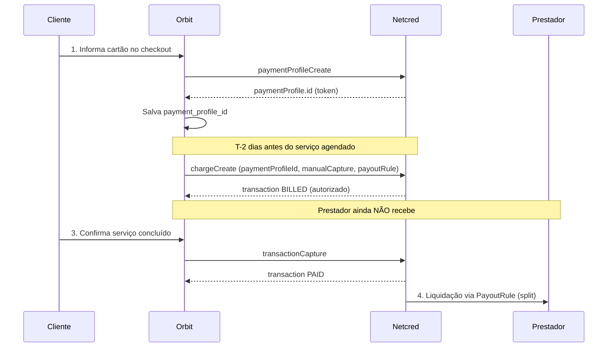
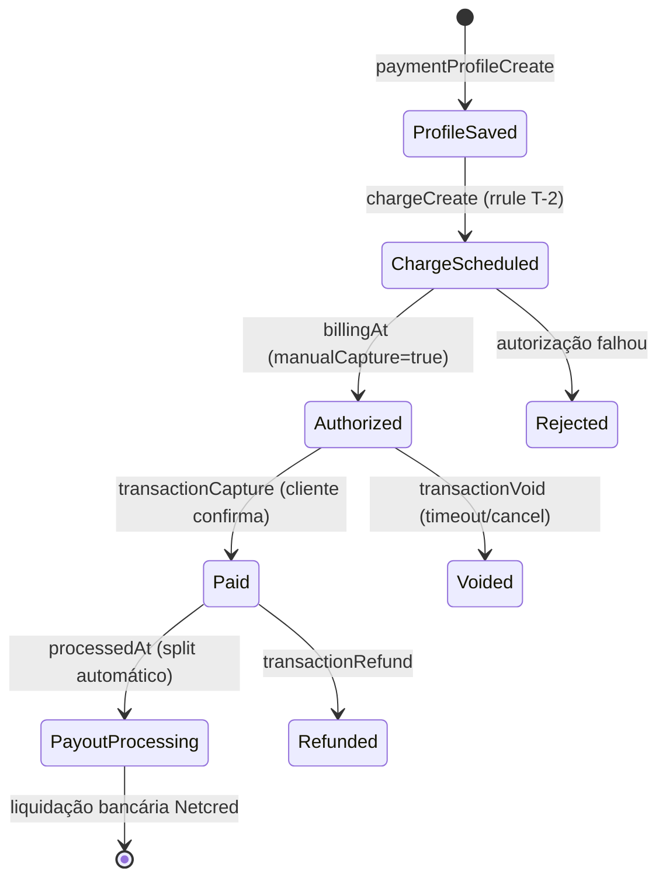

# API Netcred — Referência para Integração de Pagamentos

Documento derivado da coleção Postman **API Netcred** ([coleção](https://go.postman.co/collection/55609940-a4b17641-251f-4c8e-a147-c3a5facc5715)) e da documentação oficial em [docs.netcredbrasil.com.br](https://docs.netcredbrasil.com.br/).

Foco: **cartão com tokenização** → **cobrança agendada (T-2)** → **retenção até confirmação do cliente** → **liberação ao prestador (split/PayoutRule)** → **Pix** → **webhooks**.

---

## 1. Visão geral

| Aspecto | Detalhe |
|---------|---------|
| Protocolo | **GraphQL** sobre HTTP POST |
| Formato | JSON |
| Autenticação | JWT (`Authorization: JWT <token>`) |
| Sandbox | `https://api.sandbox.netcredbrasil.com.br/graphql` |
| Produção | `https://api.netcredbrasil.com.br/graphql` |
| Documentação | [netcredbrasil.com.br](https://netcredbrasil.com.br/) |

A API unifica **boleto**, **cartão de crédito** e **PIX** no mesmo modelo de domínio. Toda cobrança gera uma ou mais **Transactions** (pagamentos efetivos).

### Objetos principais

| Objeto | Papel |
|--------|-------|
| **Company** | Estabelecimento (`MERCHANT`) — obrigatório em quase todas as chamadas via `companyId` |
| **Customer** | Pagador (CPF/CNPJ, nome, e-mail, telefone) |
| **PaymentProfile** | Perfil de pagamento — para cartão, armazena o **token** do cartão tokenizado |
| **Charge** | Cobrança (agrupamento de transações) |
| **Transaction** | Pagamento individual (boleto emitido, PIX gerado ou autorização/captura de cartão) |
| **PayoutRule** | Regra de **split** — define como o valor é dividido entre contas bancárias |
| **BankAccount** | Conta bancária de destino no split (criada previamente junto à Netcred) |

---

## 2. Autenticação

### Obter token JWT

```graphql
mutation tokenAuth($username: String!, $password: String!) {
  tokenAuth(username: $username, password: $password) {
    token
    refreshExpiresIn
    errors { code field message }
    user {
      id
      username
      sandbox
      company { id }
    }
  }
}
```

| Parâmetro | Obrigatório | Descrição |
|-----------|-------------|-----------|
| `username` | Sim | Usuário fornecido pela Netcred |
| `password` | Sim | Senha fornecida pela Netcred |

**Validade do token:** 24 horas. Renovar com nova chamada `tokenAuth`.

**Header em todas as demais requisições:**

```
Authorization: JWT <token>
```

### Obter `companyId`

```graphql
query {
  getCompanies {
    edges {
      node {
        id
        name
        companyType
        companyState
      }
    }
  }
}
```

Use o `id` da Company do tipo `MERCHANT` nas mutations de cobrança e perfil de pagamento.

---

## 3. Fluxo de negócio Renovi (4 etapas)

Modelo desejado para serviços agendados com **escrow** — o prestador só recebe após o cliente confirmar a execução:

| Etapa | Quando | O que acontece | Estado Renovi sugerido |
|-------|--------|----------------|------------------------|
| **1. Tokenização** | Checkout / aprovação do orçamento | Cliente informa cartão; Renovi chama `paymentProfileCreate` e persiste `payment_profile_id` | `payment_profile_saved` |
| **2. Cobrança T-2** | 2 dias antes da data agendada do serviço | Renovi cobra o cartão tokenizado; valor **não** é repassado ao prestador | `charge_authorized` ou `charge_captured` |
| **3. Execução** | Data do serviço | Prestador executa; cliente valida no app | `service_completed_pending_release` |
| **4. Liberação** | Cliente confirma conclusão | Valor líquido do prestador é liquidado na conta bancária dele | `payout_released` |



> A seção **4** detalha como implementar cada etapa com os recursos disponíveis na API Netcred, incluindo limitações e decisões arquiteturais.

---

## 4. Modelo Escrow — cobrança T-2 e liberação ao prestador

Esta seção consolida tudo que a coleção Postman **API Netcred** oferece para o fluxo de escrow da Renovi.

### 4.1 O que a API Netcred oferece (e o que não oferece)

| Recurso na coleção | Suporta escrow Renovi? | Observação |
|--------------------|------------------------|------------|
| `paymentProfileCreate` + `token` | **Sim** — Etapa 1 | Tokenização PCI-safe; reutilizar via `paymentProfileId` |
| `chargeCreate` + `paymentProfileId` | **Sim** — Etapa 2 | Cobrança sem reenviar PAN/CVV |
| `rrule` (data futura) | **Sim** — agendar T-2 | Permite criar cobrança com `dueAt` = data de cobrança |
| `transactionBill` | **Sim** — antecipar cobrança | Força autorização antes de `billingAt` (casos excepcionais) |
| `manualCapture` + `transactionCapture` | **Parcial** | Separa **autorização** (T-2) de **captura** (confirmação do cliente) |
| `PayoutRule` / split (`payoutRuleInput`) | **Parcial** | Define **para quem** vai o dinheiro após `PAID`, não **quando** liberar por evento |
| `scheduleInput.automaticAdvance` | **Não** | Controla antecipação bancária por calendário, não por confirmação do cliente |
| `contractId` (FINANCIER) | **Não** | Direciona recebíveis a financiador como garantia de crédito — caso de uso diferente |
| Escrow nativo (tipo Asaas `escrow/finish`) | **Não encontrado** | Não há mutation de “liberar escrow” na coleção |
| Alterar split após cobrança | **Não encontrado** | `PayoutRule` é definida na criação da `Charge` |
| Transferência manual prestador pós-pagamento | **Não encontrado** | Sem mutation de payout avulso na coleção |

**Conclusão:** a Netcred separa dois problemas distintos:

1. **Cobrança do cliente** — bem suportada (tokenização, agendamento, captura manual).
2. **Liquidação ao prestador** — controlada por `PayoutRule` + calendário de liquidação (`processedAt` → `schedule`), **sem gatilho por evento de confirmação do cliente** documentado na API.

A Renovi precisa de **orquestração própria** para alinhar o passo 4 ao momento em que o cliente confirma o serviço.

### 4.1.1 Controles de liquidação documentados na coleção

Varredura completa da coleção Postman (pastas **Payout (Liquidação)**, **PayoutRules**, **Com Split de Pagamento**, **Marketplace**, mutations de cobrança e objetos `Charge`/`Transaction`). **Não existe** endpoint, flag ou mutation para *desativar liquidação automática* ou *liberar repasse sob demanda*.

#### O que existe (e o que cada um realmente faz)

| Mecanismo | O que parece fazer | O que realmente faz (segundo a documentação) |
|-----------|-------------------|---------------------------------------------|
| **`scheduleInput.automaticAdvance: false`** | “Não liquidar automaticamente” | **Não.** Apenas desliga a **antecipação** (adiantamento com taxa). A doc diz: *“Caso contrário, as datas **padrão de liquidação** serão utilizadas”* — ou seja, a liquidação **continua automática**, só segue o calendário padrão do cartão em vez de um calendário antecipado. Com `automaticAdvance: true`, `scheduleType`/`scheduleAnchor` definem **quando** antecipar (DAILY/WEEKLY/MONTHLY). |
| **`scheduleInput.automaticAdvance: true`** | Liquidar mais rápido | Antecipa a liquidação conforme `scheduleType` + `scheduleAnchor`, **com taxa de antecipação**. Não é um gatilho por evento externo. |
| **Omitir `payoutRuleInput` / `payoutRuleId`** | Evitar split / repasse | **Não.** Usa a `PayoutRule` **primária** (`isPrimary: true`) da empresa. Liquidação automática igualmente. |
| **`contractId`** (em vez de `payoutRule`) | Retenção / escrow | **Não.** Direciona recebíveis a um **FINANCIER** (garantia de operação de crédito). Mutuamente exclusivo com `payoutRule`. Não há doc de liberação posterior via API. |
| **`manualCapture: true`** | Segurar repasse ao prestador | **Parcial — outra camada.** Segura apenas a **captura no cartão** (autorização ≠ débito). Não impede geração de liquidações após `PAID`. |
| **`transactionCapture`** | Liberar pagamento | Captura valor no cartão (`BILLED` → `PAID`). É o gatilho de **cobrança**, não de **repasse bancário** ao prestador. |
| **Boleto / PIX** | — | Doc explícita: *“liquidação é sempre em **D+1**”*; `automaticAdvance` **não tem efeito**. Sem controle documentado. |
| **`processedAt`** (campo da Transaction) | — | Data base para **geração das liquidações** — processo automático pós-`PAID`. |
| **`getPayoutRules` / `bankAccounts`** | — | Apenas **consulta** de regras e contas. Sem mutation de criar/liberar/suspender payout. |
| **Marketplace (`MARKETPLACE` + `MERCHANT`)** | Escrow entre ECs | Doc cobre `PaymentProfile` e `Customer` por marketplace/EC. **Nenhuma** mutation de retenção/liberação de repasse ao prestador. |

#### Mutations de payout ausentes na coleção

A pasta **Payout (Liquidação)** contém somente a documentação do objeto `PayoutRule`. Não há:

- `payoutCreate` / `payoutRelease` / `payoutHold` / `payoutSuspend`
- Atualização de `PayoutRule` após a cobrança
- Segunda cobrança ou transferência interna para “liberar” saldo retido
- Webhook específico de liquidação/repasse (só eventos de `Transaction` e `Charge`)

#### Única forma documentada de “reter” valor do prestador

**Split 100% para conta bancária da Renovi** na `payoutRuleInput` (`proportion: "100.0"` ou `FIXED_AMOUNT` total na conta da plataforma). O prestador só receberia via processo **fora da API documentada** (repasse manual, produto comercial não exposto na coleção, ou segunda operação acordada com a Netcred).

#### Implicação para o fluxo Renovi

| Camada | Controle disponível na API | Quem decide o timing |
|--------|---------------------------|----------------------|
| Débito no cartão do cliente | `manualCapture` + `transactionCapture` | **Renovi** (confirmação do cliente) |
| Repasse bancário ao prestador | `PayoutRule` + calendário padrão ou antecipado | **Netcred** (automático após `PAID` + `processedAt`) |

Para escrow real do **repasse ao prestador**, a pergunta precisa ir ao suporte Netcred: existe produto marketplace com retenção de recebíveis não publicado na coleção Postman?

---

### 4.2 Arquitetura recomendada: `manualCapture` + split diferido

Combinação que melhor aproxima o modelo escrow com os endpoints documentados:

| Fase | Ação Netcred | Estado `transactionState` | Dinheiro |
|------|--------------|---------------------------|----------|
| Checkout | `paymentProfileCreate` | — | Nada cobrado |
| T-2 (automático ou cron) | `chargeCreate` com `manualCapture: true` | `SCHEDULED` → `BILLED` | Valor **pré-autorizado** no cartão |
| Cliente confirma serviço | `transactionCapture` | `BILLED` → `PAID` | Valor **capturado**; inicia geração de liquidações |
| Pós-`PAID` | Liquidação automática Netcred | — | Split enviado às contas do `PayoutRule` conforme `scheduleInput` |

**Por que `manualCapture`?**

- Com `manualCapture: false` (padrão), autorização e captura ocorrem juntas em T-2 → o cliente já é debitado, mas o split ainda segue o calendário da Netcred (não o evento de confirmação).
- Com `manualCapture: true`, a Renovi retém a captura até o passo 4, garantindo que o débito efetivo só aconteça quando o cliente confirmar (ou próximo disso).

**Janela de pré-autorização:** autorizações de cartão expiram (tipicamente 5–30 dias, dependendo da bandeira/adquirente). O serviço deve ser confirmado dentro dessa janela após T-2. Validar com a Netcred o prazo exato em produção.

---

### 4.3 Etapa 1 — Tokenização no checkout (sem cobrança)

Somente `paymentProfileCreate`. **Não** chamar `chargeCreate` neste momento.

```graphql
mutation paymentProfileCreateCard($input: PaymentProfileCreateInput!) {
  paymentProfileCreate(input: $input) {
    errors { field message code }
    paymentProfile {
      id
      token
      isActive
      cardNumber
      brand
      rejectedReason
    }
  }
}
```

**Persistir na Renovi (`service_payments` ou tabela dedicada):**

| Campo | Origem |
|-------|--------|
| `netcred_payment_profile_id` | `paymentProfile.id` |
| `netcred_customer_id` | `paymentProfile.customer.id` |
| `card_brand` | `paymentProfile.brand` |
| `card_last_four` | últimos dígitos de `cardNumber` truncado |
| `service_scheduled_at` | data agendada do serviço (domínio Renovi) |
| `charge_scheduled_at` | `service_scheduled_at - 2 days` |

**Webhook:** `PAYMENT_PROFILE_TOKENIZE` — confirmar `is_active: true` antes de prosseguir.

---

### 4.4 Etapa 2 — Cobrança 2 dias antes do serviço

Duas estratégias equivalentes (escolher uma):

#### Estratégia A — `chargeCreate` no momento do agendamento com `rrule` (recomendada)

Ao aceitar a proposta / agendar o serviço, criar a cobrança com data futura:

```json
{
  "input": {
    "companyId": 1014,
    "paymentProfileId": 12345,
    "amount": "1500.00",
    "referenceCode": "renovi-service-{service_id}",
    "manualCapture": true,
    "billDaysInAdvance": 0,
    "rrule": "DTSTART:20260608T000000Z RRULE:FREQ=DAILY;COUNT=1",
    "payoutRuleInput": {
      "name": "Renovi escrow {service_id}",
      "persist": false,
      "ruleItems": [
        {
          "splitType": "FIXED_AMOUNT",
          "amount": "225.00",
          "isLiable": true,
          "bankAccountId": 10,
          "scheduleInput": {
            "scheduleType": "DAILY",
            "scheduleAnchor": 1,
            "automaticAdvance": false
          }
        },
        {
          "splitType": "FIXED_AMOUNT",
          "amount": "1275.00",
          "isLiable": false,
          "bankAccountId": 20,
          "scheduleInput": {
            "scheduleType": "DAILY",
            "scheduleAnchor": 1,
            "automaticAdvance": false
          }
        }
      ]
    },
    "orderInput": {
      "orderItems": [{
        "productInput": {
          "name": "Serviço de reforma",
          "amount": "1500.00",
          "category": "Serviços"
        }
      }]
    }
  }
}
```

Onde `DTSTART` = **`service_scheduled_at - 2 dias`** (ex.: serviço em 10/06 → cobrança em 08/06).

- `chargeType` resultante: `RECURRING` (transação agendada).
- Em T-2, a Netcred autoriza automaticamente → `transactionState: BILLED`.
- Webhook esperado: `TRANSACTION_AUTHORIZE`.

> `rrule` e `installmentNumber` são **mutuamente exclusivos**. Para cobrança única agendada, usar `rrule` com `COUNT=1`.

#### Estratégia B — Cron/worker Renovi em T-2

Job diário busca serviços com `charge_scheduled_at = hoje` e chama `chargeCreate` **sem** `rrule` (cobrança imediata):

- Mesmos parâmetros: `paymentProfileId`, `manualCapture: true`, `payoutRuleInput`.
- Transação nasce `SCHEDULED` e é autorizada na hora (ou quase).
- Mais controle operacional; exige worker confiável e idempotência via `referenceCode`.

**Campos de agendamento relevantes (cartão):**

| Campo | Papel no fluxo T-2 |
|-------|-------------------|
| `rrule` / `DTSTART` | Define `dueAt` = data da cobrança |
| `billDaysInAdvance` | Dias antes de `dueAt` para autorizar (default `0` = no próprio `dueAt`) |
| `billingAt` | Data em que ocorrerá a autorização (retornado na `transaction`) |
| `dueAt` | Para cartão: data prevista de captura (com `manualCapture`, captura é manual) |

**Se a autorização falhar em T-2** (`REJECTED`): notificar cliente, permitir novo cartão (`paymentProfileCreate`) ou cancelar serviço (`chargeVoid` / `transactionVoid`).

---

### 4.5 Etapa 3 — Execução do serviço (domínio Renovi)

Nenhuma mutation Netcred obrigatória nesta fase. A Renovi:

- Atualiza `services.status` conforme fluxo operacional.
- Exibe ao cliente a ação “Confirmar conclusão do serviço”.
- Monitora `transactionState` — deve permanecer `BILLED` (pré-autorizado, não capturado).

**Timeout de segurança:** se o cliente não confirmar dentro da janela de pré-autorização, chamar `transactionVoid` para liberar o hold no cartão e tratar o serviço como disputa/cancelamento.

---

### 4.6 Etapa 4 — Liberação ao prestador

#### 4.6.1 Captura (gatilho principal)

Quando o cliente confirma:

```graphql
mutation captureOnServiceConfirmation($transactionId: Int!) {
  transactionCapture(input: { transactionId: $transactionId }) {
    errors { code message field }
    transaction {
      id
      transactionState
      paidAt
      processedAt
    }
  }
}
```

- Pré-requisito: `transactionState` = `BILLED` e `method` = `CARD`.
- Resultado esperado: `transactionState` → `PAID`.
- Webhooks: `TRANSACTION_CAPTURE`, depois `TRANSACTION_UPDATE`.

`processedAt` é a data base para **geração das liquidações** (repasse bancário).

#### 4.6.2 Split / PayoutRule — como repassar ao prestador

O split é configurado **na etapa 2** (`payoutRuleInput` ou `payoutRuleId`). Após `PAID`, a Netcred gera liquidações para cada `ruleItem`:

| `ruleItem` | Destino | Campo valor | Quando liquida |
|------------|---------|-------------|----------------|
| Comissão Renovi | `bankAccountId` da plataforma | `FIXED_AMOUNT` ou `PERCENTAGE` | Após `processedAt`, conforme `scheduleInput` |
| Líquido prestador | `bankAccountId` do prestador | restante | Idem |

**Requisitos para split de cartão para conta do prestador:**

- Conta bancária do prestador cadastrada previamente na Netcred (`getBankAccounts`).
- Para cartão: `cardPayoutAllowed: true` na `PayoutRule` — exige que o `holderDocument` da conta seja igual ao `document` do EC **ou** validar regras de marketplace com a Netcred.
- Empresa com **seleção de split habilitada** (configuração comercial Netcred).

**`automaticAdvance: false`** (recomendado): usa datas padrão de liquidação de cartão, sem taxa extra de antecipação. Ainda assim, a liquidação é **automática após `PAID`**, não espera evento Renovi.

#### 4.6.3 Gap: liberação condicionada à confirmação do cliente

A coleção **não documenta** como reter **somente a parcela do prestador** enquanto a Renovi já recebe a comissão, nem como disparar liquidação ao prestador apenas após confirmação.

**Opções para fechar o gap (validar com suporte Netcred):**

| Opção | Mecanismo | Prós | Contras |
|-------|-----------|------|---------|
| **A. `manualCapture` (recomendada V1)** | Só captura no passo 4; split dispara após `PAID` | Alinha débito do cliente à confirmação; usa API documentada | Liquidação ao prestador segue calendário Netcred, não é instantânea |
| **B. Split 100% Renovi → repasse manual** | `payoutRule` com 100% na conta Renovi; prestador pago fora da API | Controle total do timing ao prestador | Sem endpoint na coleção para repasse automatizado ao prestador |
| **C. Marketplace (`MARKETPLACE` + `MERCHANT`)** | Renovi como marketplace; prestador como EC | Modelo natural para marketplace | Coleção não documenta liberação sob demanda por EC |
| **D. `contractId` (FINANCIER)** | Recebíveis direcionados a financiador | Garantia de crédito | Não é escrow de serviço; fluxo financeiro diferente |

**Recomendação V1:** Opção **A** — `manualCapture` garante que o cliente só é debitado na confirmação (ou mantém pré-auth até lá), e o split com valores **fixos** (`FIXED_AMOUNT`) alinha com o plano Renovi de comissão fixa. Negociar com a Netcred:

1. Prazo máximo entre pré-autorização (T-2) e captura (confirmação).
2. Se existe produto marketplace com **retenção de repasse ao EC** não documentado na coleção pública.
3. Prazo de liquidação com `automaticAdvance: false` para contas de terceiros (prestador).

---

### 4.7 Modelo de split para Renovi (valores fixos)

Alinhado ao plano de pagamentos (`client_charge_amount` congelado no checkout):

```
client_charge_amount = proposed_amount + client_fee_amount   (o que o cliente paga)
provider_net_amount  = proposed_amount - provider_fee_amount (líquido do prestador)
platform_fee_amount  = client_charge_amount - provider_net_amount
```

Exemplo com `proposed_amount = 1500`, taxa prestador 15%, taxa cliente 5%:

| Parte | Valor | `ruleItem` |
|-------|-------|------------|
| Líquido prestador | R$ 1.275,00 | `FIXED_AMOUNT: "1275.00"` → `bankAccountId` prestador |
| Comissão Renovi | R$ 225,00 | `FIXED_AMOUNT: "225.00"` → `bankAccountId` Renovi, `isLiable: true` |

Usar `FIXED_AMOUNT` em vez de `PERCENTAGE` porque as taxas da Netcred incidem sobre valores líquidos imprevisíveis no percentual (mesma decisão do plano Asaas).

---

### 4.8 Estados e webhooks do fluxo escrow

| Momento | `transactionState` | Webhook Netcred | Ação Renovi |
|---------|-------------------|-----------------|-------------|
| Cobrança criada (T-2 agendado) | `SCHEDULED` | `CHARGE_CREATE`, `TRANSACTION_CREATE` | Persistir `charge_id`, `transaction_id` |
| Autorização em T-2 | `BILLED` | `TRANSACTION_AUTHORIZE` | Marcar `charge_authorized`; notificar se falha |
| Análise antifraude | `IN_ANALYSIS` / `MANUAL_ANALYSIS` | `TRANSACTION_UPDATE` | Aguardar; SLA até ~2h / manual |
| Cliente confirma serviço | `PAID` | `TRANSACTION_CAPTURE`, `TRANSACTION_UPDATE` | Marcar serviço `in_progress` → concluído; iniciar contagem liquidação |
| Autorização expirou | `VOIDED` / `EXPIRED` | `TRANSACTION_VOID` / `TRANSACTION_EXPIRED` | Reagendar cobrança ou cancelar |
| Chargeback | `is_disputed: true` | `TRANSACTION_DISPUTE` | Fluxo de disputa Renovi |

---

### 4.9 Dados e jobs na Renovi

**Tabela/campos sugeridos em `service_payments`:**

| Campo | Descrição |
|-------|-----------|
| `netcred_payment_profile_id` | Token do cartão (etapa 1) |
| `netcred_charge_id` | Charge criada na etapa 2 |
| `netcred_transaction_id` | Transaction para capture/refund |
| `netcred_payout_rule_snapshot` | JSON do split aplicado |
| `service_scheduled_at` | Data do serviço |
| `charge_scheduled_at` | T-2 |
| `payment_phase` | `profile_saved \| charge_scheduled \| authorized \| captured \| payout_pending \| payout_done \| failed` |
| `authorized_at` | Quando chegou `BILLED` |
| `captured_at` | Quando chegou `PAID` |
| `client_confirmed_at` | Timestamp da confirmação (gatilho do capture) |

**Jobs:**

| Job | Cron | Ação |
|-----|------|------|
| `schedule-netcred-charges` | Diário | Estratégia B: `chargeCreate` para `charge_scheduled_at = today` |
| `expire-stale-authorizations` | Diário | `transactionVoid` se `BILLED` sem confirmação após N dias |
| `reconcile-netcred-webhooks` | Horário | Polling de segurança em `transactions` |

---

### 4.10 Mutations do ciclo de vida escrow

| Evento Renovi | Mutation Netcred |
|---------------|------------------|
| Salvar cartão | `paymentProfileCreate` |
| Agendar/cobrar T-2 | `chargeCreate` (+ `rrule` ou imediato) |
| Antecipar autorização | `transactionBill` (se necessário) |
| Cliente confirma serviço | `transactionCapture` |
| Cancelar antes de capturar | `transactionVoid` |
| Cancelar cobrança agendada | `chargeVoid` (só `SCHEDULED`) |
| Estorno pós-captura | `transactionRefund` |
| Remover cartão salvo | `paymentProfileVoid` |

---

### 4.11 Diagrama completo de estados (cartão + escrow)



---

### 4.12 Pendências comerciais com a Netcred

| Item | Status | Observação |
|------|--------|------------|
| **Credenciamento de prestadores** | ✅ Alinhado | Sem API de onboarding; fluxo Renovi via e-mail + polling (ver **§4.13**) |
| **Liquidação/liberação sob evento manual** | ⏳ Pendente | Validar com Fernando: repasse ao prestador após confirmação de serviço concluído |
| **Webhook de credenciamento concluído** | 🔜 Em desenvolvimento (Netcred) | Hoje: cron de polling; futuro: substituir ou complementar com webhook |
| **Prazo de pré-autorização** | ⏳ Confirmar | Máximo entre `BILLED` (T-2) e `transactionCapture` |
| **SLA de liquidação** | ⏳ Confirmar | Com `automaticAdvance: false`, quantos dias até o prestador receber após `PAID`? |
| **Taxa de escrow** | ⏳ Confirmar | Equivalente aos R$ 9,90/mês do modelo Asaas no plano Renovi |

Suporte Netcred: [WhatsApp +55 47 3227-0080](https://wa.me/+554732270080).

---

### 4.13 Credenciamento de prestadores (alinhamento Renovi × Netcred)

**Decisão (2026-06):** não existe API para credenciar prestadores. O processo nativo da Netcred hoje é:

1. **Link Netcred** — prestador acessa, preenche dados e envia documentação.
2. **E-mail** — envio manual de informações e documentos para a Netcred cadastrar.

A Renovi **centraliza toda a experiência no app**: o prestador não passa pelo fluxo da Netcred diretamente.

#### Fluxo acordado

```mermaid
sequenceDiagram
  participant P as Prestador
  participant R as Orbit
  participant N as Netcred

  P->>R: 1. Cadastro no app (dados, conta bancária, KYC, docs)
  R->>R: 2. Persiste status pending
  R->>N: 3. E-mail formatado solicitando credenciamento
  Note over N: Netcred processa cadastro (manual)
  loop Cron (prestadores pending)
    R->>N: 4. getCompanies / bankAccounts (busca por CPF/CNPJ)
    N-->>R: companyId + bankAccountId (quando disponível)
    R->>R: 5. Atualiza status → active; salva IDs
  end
  Note over R,N: Futuro: webhook de credenciamento concluído (Netcred em desenvolvimento)
```

| Etapa | Responsável | Ação |
|-------|-------------|------|
| **1. Coleta no app** | Renovi | Dados cadastrais, conta bancária, KYC e documentos exigidos |
| **2. Solicitação** | Renovi → Netcred | E-mail automático formatado com todos os dados coletados |
| **3. Processamento** | Netcred | Credenciamento manual (sem API) |
| **4. Detecção de conclusão** | Renovi (cron) | Consulta API para prestadores `pending`; busca por CPF/CNPJ |
| **5. Ativação** | Renovi | Persiste `netcred_company_id`, `netcred_bank_account_id`; status → `active` |

#### O que a API oferece para o passo 4

Não há mutation de criação de EC/conta. Apenas **consulta** após credenciamento concluído pela Netcred:

```graphql
query GetCompaniesForOnboardingPoll {
  companies(first: 200, orderBy: "legalName") {
    edges {
      node {
        id
        name
        legalName
        documentType
        document
        companyType
        companyState
      }
    }
  }
}
```

```graphql
query GetProviderBankAccount($companyId: String!, $holderDocument: String!) {
  bankAccounts(
    companyId: $companyId
    isActive: true
    holderDocument: $holderDocument
  ) {
    edges {
      node {
        id
        holderName
        holderDocument
        agency
        number
        accountType
        isActive
      }
    }
  }
}
```

**Usuário `MARKETPLACE`:** `getCompanies` retorna a Renovi e todos os `MERCHANT` (prestadores) abaixo. O cron compara `document` (CPF/CNPJ) com o cadastro local.

#### Dados a persistir (`provider_profiles_private` ou equivalente)

| Campo | Descrição |
|-------|-----------|
| `netcred_onboarding_status` | `pending` \| `submitted` \| `active` \| `rejected` |
| `netcred_company_id` | ID da `Company` tipo `MERCHANT` (preenchido após credenciamento) |
| `netcred_bank_account_id` | `bankAccountId` para split no `payoutRuleInput` |
| `netcred_onboarding_submitted_at` | Quando o e-mail foi enviado à Netcred |
| `netcred_onboarding_activated_at` | Quando o cron encontrou o credenciamento |

#### Job de polling

| Job | Cron sugerido | Ação |
|-----|---------------|------|
| `poll-netcred-provider-onboarding` | A cada 1–4 h | Para cada prestador `pending`/`submitted`: `getCompanies` → match por `document` → `bankAccounts` → atualizar IDs e status |

**Futuro:** quando a Netcred disponibilizar webhook de credenciamento concluído, priorizar o evento e manter o cron apenas como reconciliação de segurança.

#### Pré-requisito para cobrança com split

O prestador precisa estar com `netcred_onboarding_status = active` e ter `netcred_company_id` + `netcred_bank_account_id` **antes** de aceitar serviços com pagamento via cartão/PIX com split. Caso contrário, a cobrança não pode referenciar o `bankAccountId` do prestador.

---

## 5. Tokenização de cartão (PaymentProfile)

A tokenização **não expõe o PAN completo** no sistema da Renovi após a criação. O gateway retorna um **PaymentProfile** com `id` e `token` interno para cobranças futuras.

### Mutation

```graphql
mutation paymentProfileCreateCard($input: PaymentProfileCreateInput!) {
  paymentProfileCreate(input: $input) {
    errors { field message code }
    paymentProfile {
      id
      method
      isActive
      cardNumber      # truncado, ex.: 497010XXXXXX0048
      expiryMonth
      expiryYear
      brand
      cardHolderName
      token           # token para reutilização
      rejectedReason
      customer { id name documentType document }
    }
  }
}
```

### Input de exemplo

```json
{
  "input": {
    "method": "CARD",
    "customerInput": {
      "companyId": 1014,
      "name": "Nome do Cliente",
      "email": "cliente@email.com",
      "documentType": "CPF",
      "document": "12235241913",
      "phone": "47999999999",
      "persist": true
    },
    "ccInput": {
      "cardNumber": "4970100000000048",
      "expiryMonth": 10,
      "expiryYear": 2027,
      "securityCode": "123",
      "cardHolderName": "NOME NO CARTAO"
    }
  }
}
```

### Parâmetros `ccInput`

| Campo | Obrigatório | Descrição |
|-------|-------------|-----------|
| `cardNumber` | Sim | Número do cartão |
| `expiryMonth` | Sim | Mês de validade (1–12) |
| `expiryYear` | Sim | Ano de validade (ex.: 2027) |
| `securityCode` | Sim | CVV |
| `cardHolderName` | Sim | Nome impresso no cartão |

### Idempotência / deduplicação

Um PaymentProfile de cartão é único pela combinação:

- `cardNumber` (truncado)
- `expiryMonth` / `expiryYear`
- documento do `customer`

Se já existir, a API **retorna o perfil existente** em vez de criar outro.

### Endereço de cobrança

Obrigatório (`billingAddressInput` ou `billingAddressId`) **somente se a empresa tiver análise de risco (ClearSale) habilitada**.

### Desativar perfil

```graphql
mutation paymentProfileVoid($input: PaymentProfileVoidInput!) {
  paymentProfileVoid(input: $input) {
    errors { field message code }
    paymentProfile { id isActive token }
  }
}
```

Parâmetro: `paymentProfileId`.

### Webhook associado

`PAYMENT_PROFILE_TOKENIZE` — disparado quando a tokenização conclui (sucesso ou falha). Verificar `is_active` e `rejected_reason`.

---

## 6. Cobrança com cartão tokenizado

Após tokenizar, use **`paymentProfileId`** na cobrança — **não** reenvie `ccInput`.

> **Fluxo escrow Renovi:** usar `manualCapture: true` + `rrule` (T-2) conforme **§4**. A captura efetiva (`transactionCapture`) ocorre apenas na confirmação do cliente.

### Mutation

```graphql
mutation chargeCreateCard($input: ChargeCreateInput!) {
  chargeCreate(input: $input) {
    errors { field message code }
    charge {
      id
      referenceCode
      amount
      chargeType
      chargeStatus
      installmentNumber
      paymentProfile { id token cardNumber }
      transactions {
        edges {
          node {
            id
            transactionState
            amount
            billingAt
            billedAt
            dueAt
            paidAt
            paidAmount
            rejectedReason
            cardInfo { cardNumber brand }
          }
        }
      }
    }
  }
}
```

### Input — cobrança com token + split

```json
{
  "input": {
    "companyId": 1013,
    "paymentProfileId": 99,
    "amount": "1500.00",
    "installmentNumber": 1,
    "referenceCode": "renovi-proposal-uuid-aqui",
    "billDaysInAdvance": 0,
    "extraInfo": "Serviço Renovi - proposta XYZ",
    "payoutRuleInput": {
      "name": "Split Renovi + Prestador",
      "isPrimary": false,
      "persist": true,
      "ruleItems": [
        {
          "splitType": "PERCENTAGE",
          "proportion": "15.0",
          "isLiable": true,
          "bankAccountId": 10,
          "scheduleInput": {
            "scheduleType": "DAILY",
            "scheduleAnchor": 1,
            "automaticAdvance": false
          }
        },
        {
          "splitType": "PERCENTAGE",
          "proportion": "85.0",
          "isLiable": false,
          "bankAccountId": 20,
          "scheduleInput": {
            "scheduleType": "DAILY",
            "scheduleAnchor": 1,
            "automaticAdvance": false
          }
        }
      ]
    },
    "orderInput": {
      "sessionId": "clearsale-session-id",
      "orderItems": [{
        "productInput": {
          "name": "Serviço de reforma",
          "amount": "1500.00",
          "description": "Descrição do serviço",
          "category": "Serviços"
        }
      }]
    }
  }
}
```

### Parâmetros principais de `chargeCreate` (cartão)

| Campo | Obrigatório | Descrição |
|-------|-------------|-----------|
| `companyId` | Sim | ID da Company `MERCHANT` |
| `amount` | Sim | Valor decimal com até 2 casas (string `"10.25"`) |
| `paymentProfileId` | Sim* | ID do perfil tokenizado (*ou `paymentProfileInput`) |
| `installmentNumber` | Não | Parcelas no cartão (default: 1) |
| `referenceCode` | Recomendado | **Idempotência** — repetir na mesma empresa gera erro |
| `payoutRuleId` | Não** | ID de split pré-existente |
| `payoutRuleInput` | Não** | Split inline na cobrança |
| `contractId` | Não** | Alternativa a payout (financiador) |
| `manualCapture` | Não | `true` = autoriza mas não captura automaticamente |
| `orderInput` | Condicional | Obrigatório com análise de risco habilitada |
| `customerIpAddress` | Não | IP do pagador (antifraude) |

** Mutuamente exclusivos: `payoutRuleId`, `payoutRuleInput`, `contractId`. Se nenhum for enviado, usa o split padrão da empresa.

### Captura manual

Se `manualCapture: true`:

1. Transação vai para `BILLED` (autorizada).
2. Chamar `transactionCapture` para capturar e ir para `PAID`.

```graphql
mutation transactionCapture($input: TransactionCaptureInput!) {
  transactionCapture(input: $input) {
    errors { code message field }
    transaction { id amount transactionState }
  }
}
```

Default (`manualCapture: false`): autorização + captura automáticas na criação.

### Análise de risco (ClearSale)

Quando habilitada na empresa:

- Integrar script ClearSale Behavior Analytics no checkout.
- Enviar `orderInput.sessionId` (obter `app_id` com suporte Netcred).
- Enviar `orderInput.orderItems` com descrições precisas do serviço.
- Estados intermediários: `IN_ANALYSIS`, `MANUAL_ANALYSIS`.

---

## 7. Cobrança PIX

### Criar cobrança PIX

Mesma mutation `chargeCreate`, com `paymentProfileInput.method: "PIX"`.

```json
{
  "input": {
    "companyId": 1014,
    "amount": "125.37",
    "referenceCode": "renovi-pix-uuid",
    "paymentProfileInput": {
      "method": "PIX",
      "billingAddressInput": {
        "street": "Rua Exemplo",
        "number": "100",
        "district": "Centro",
        "city": "Joinville",
        "state": "SC",
        "zipCode": "89201420"
      },
      "customerInput": {
        "name": "Cliente",
        "email": "cliente@email.com",
        "documentType": "CPF",
        "document": "12235241913",
        "phone": "47999999999",
        "persist": true
      }
    },
    "pixConditionInput": {
      "interestType": "DAYS",
      "interestValueType": "PERCENT",
      "interestValue": "5",
      "fineValueType": "VALUE",
      "fineValue": "10",
      "persist": false
    },
    "payoutRuleId": 99,
    "extraInfo": "Pagamento serviço Renovi"
  }
}
```

### Resposta relevante

Na `transaction` retornada, usar:

- `pixInfo.pixCopyPaste` — código copia e cola (gerar QR com biblioteca local)
- `pixInfo.pix_type` — `WITH_DUE_DATE` (cobrança com vencimento) ou `IMMEDIATE` (via ChargeLink)
- `dueAt` — data de vencimento
- `transactionState` — evolui até `PAID` após pagamento

### Split em PIX

`payoutRuleInput` / `payoutRuleId` funcionam igual ao cartão. Porém, **antecipação (`scheduleInput.automaticAdvance`) não tem efeito em PIX e boleto** — liquidação é D+1.

### Perfil PIX prévio (opcional)

`paymentProfileCreate` com `method: PIX` — mesmo padrão de endereço + customer. Reutilizar via `paymentProfileId` em cobranças futuras.

---

## 8. Split de pagamento (PayoutRule)

O split define **para quais contas bancárias** o valor líquido é direcionado após o processamento.

### Regras importantes

| Regra | Detalhe |
|-------|---------|
| Habilitação | Empresa precisa ter **seleção de split habilitada** pela Netcred |
| Contas | `bankAccountId` deve existir previamente (solicitar cadastro à Netcred) |
| Soma percentual | Itens `PERCENTAGE` devem somar **100.0** |
| `isLiable` | Define quem arca com débitos (taxas de aluguel, estornos) — MDR/antecipação são descontados independentemente |
| Cartão + terceiros | Para split de cartão para conta de terceiro, `cardPayoutAllowed` na regra deve ser `true` (titular da conta = documento do EC) |
| Reutilização | `payoutRuleId` para regra persistida; `payoutRuleInput` para regra ad-hoc (`persist: true` salva para reuso) |

### Tipos de split (`ruleItems`)

| `splitType` | Campo valor | Descrição |
|-------------|-------------|-----------|
| `PERCENTAGE` | `proportion` | Percentual repassado (ex.: `"85.0"`) |
| `FIXED_AMOUNT` | `amount` | Valor fixo repassado (ex.: `"50.00"`) |

### Schedule (antecipação — cartão)

| Campo | Valores | Descrição |
|-------|---------|-----------|
| `automaticAdvance` | boolean | `true` = antecipa liquidação (com taxa) |
| `scheduleType` | `DAILY`, `WEEKLY`, `MONTHLY` | Tipo de agenda |
| `scheduleAnchor` | 1–31 ou 0–6 | Dia relativo ao tipo (DAILY: dias após processamento; WEEKLY: 0=seg … 6=dom) |

### Consultar splits existentes

```graphql
query {
  getPayoutRules(companyId: 1014) {
    edges {
      node {
        id
        name
        isPrimary
        isActive
        ruleItems {
          splitType
          proportion
          amount
          isLiable
          bankAccount { id holderName }
        }
      }
    }
  }
}
```

### Modelo sugerido para Renovi (marketplace)

| Destino | `proportion` | `isLiable` | Observação |
|---------|--------------|------------|------------|
| Conta Renovi (comissão) | Taxa da plataforma | `true` | Arca com chargeback/estorno proporcional |
| Conta prestador | Restante | `false` | Líquido do prestador |

Valores exatos devem refletir a regra de negócio em `docs/payment-system/` (comissão fixa vs percentual).

---

## 9. Máquina de estados

### Charge (`chargeStatus`)

| Estado | Significado |
|--------|-------------|
| `ONGOING` | Ainda há transações pendentes |
| `ENDED` | Todas as transações em estado final |
| `VOIDED` | Cobrança cancelada |

### Transaction (`transactionState`)

| Estado | Significado | Métodos |
|--------|-------------|---------|
| `SCHEDULED` | Agendada; emissão/autorização em `billingAt` | Todos |
| `BILLED` | Emitida (boleto/PIX) ou autorizada (cartão) | Todos |
| `IN_ANALYSIS` | Análise de risco automática (até ~2h) | Cartão |
| `MANUAL_ANALYSIS` | Análise manual Netcred | Cartão |
| `REJECTED` | Recusada na autorização | Cartão |
| `PAID` | Paga / capturada | Todos |
| `EXPIRED` | Vencida (equivalente a cancelada) | Boleto, PIX |
| `VOIDED` | Cancelada | Todos |
| `PARTIALLY_REFUNDED` | Estorno parcial | Cartão, PIX online |
| `REFUNDED` | Estorno total | Cartão, PIX online |

### Fluxo cartão (captura automática)

```
SCHEDULED → BILLED (autorização) → PAID (captura automática)
         ↘ REJECTED
         ↘ IN_ANALYSIS → PAID | REJECTED
```

### Fluxo PIX

```
SCHEDULED → BILLED (QR gerado) → PAID (pagamento confirmado)
         ↘ EXPIRED
         ↘ VOIDED
```

### Eventos de confirmação para a Renovi

| Método | Webhook principal | `transaction_state` alvo |
|--------|-------------------|--------------------------|
| Cartão 1x | `TRANSACTION_UPDATE` ou `TRANSACTION_CAPTURE` | `PAID` |
| Cartão (análise risco) | `TRANSACTION_AUTHORIZE` → `TRANSACTION_UPDATE` | `PAID` ou `REJECTED` |
| PIX | `TRANSACTION_UPDATE` | `PAID` |

---

## 10. Webhooks

### Configuração

```graphql
mutation webhookCreate($input: WebhookCreateInput!) {
  webhookCreate(input: $input) {
    errors { field message code }
    webhook {
      id
      name
      targetUrl
      isActive
      secretKey
      company { name }
    }
  }
}
```

```json
{
  "input": {
    "name": "renovi-payments",
    "targetUrl": "https://<projeto>.supabase.co/functions/v1/netcred-webhook",
    "companyId": 1014,
    "isActive": true,
    "secretKey": "chave-secreta-forte",
    "maskUserAgent": true,
    "events": ["TRANSACTION_UPDATE", "TRANSACTION_CAPTURE", "PAYMENT_PROFILE_TOKENIZE", "CHARGE_CREATE"]
  }
}
```

| Parâmetro | Descrição |
|-----------|-----------|
| `targetUrl` | Endpoint HTTPS (obrigatório SSL) |
| `secretKey` | Usada para validar assinatura HMAC |
| `events` | Um ou mais eventos (ver tabela abaixo) |
| `maskUserAgent` | Simula user-agent de navegador se firewall bloquear |

**Testar conectividade:** `webhookPing(webhookId)`.

**Remover:** `webhookDelete(webhookId)`.

### Headers em todo webhook recebido

| Header | Exemplo | Descrição |
|--------|---------|-----------|
| `Content-Type` | `application/json` | Corpo JSON |
| `X-NETCRED-Event` | `TRANSACTION_UPDATE` | Tipo do evento |
| `X-NETCRED-Domain` | `https://api.sandbox.netcredbrasil.com.br` | Origem (sandbox ou produção) |
| `X-NETCRED-Signature` | `87e99e04...` | SHA256 do corpo com `secretKey` |

### Validação de assinatura

1. Ler corpo raw da requisição (bytes exatos).
2. Calcular `SHA256(secretKey + body)` (confirmar algoritmo exato com Netcred na homologação).
3. Comparar com `X-NETCRED-Signature`.
4. Rejeitar se divergir.

### Catálogo completo de eventos

| Evento | Quando dispara | Payload |
|--------|----------------|---------|
| `ANY` | Qualquer evento (header indica o real) | Variável |
| `CHARGE_CREATE` | Cobrança criada | `ChargePayload` |
| `CHARGE_UPDATE` | Cobrança atualizada | `ChargePayload` |
| `CHARGE_VOID` | Cobrança cancelada | `ChargePayload` |
| `TRANSACTION_CREATE` | Transação criada | `TransactionPayload` |
| `TRANSACTION_AUTHORIZE` | Emissão/autorização | `TransactionPayload` |
| `TRANSACTION_CAPTURE` | Captura (cartão) | `TransactionPayload` |
| `TRANSACTION_UPDATE` | Atualização geral (inclui pagamento PIX/boleto) | `TransactionPayload` |
| `TRANSACTION_EXPIRED` | Transação expirada | `TransactionPayload` |
| `TRANSACTION_VOID` | Transação cancelada | `TransactionPayload` |
| `TRANSACTION_REFUND` | Estorno | `TransactionPayload` |
| `TRANSACTION_DISPUTE` | Chargeback iniciado | `TransactionPayload` |
| `PAYMENT_PROFILE_TOKENIZE` | Tokenização concluída (sucesso ou falha) | `PaymentProfilePayload` |
| `PAYMENT_PROFILE_UPDATE` | Perfil atualizado | `PaymentProfilePayload` |
| `PAYMENT_PROFILE_DELETE` | Perfil desativado | `PaymentProfilePayload` |
| `PAYMENT_PROFILE_EXPIRING` | Cartão expira em ~1 mês | `PaymentProfilePayload` |
| `WEBHOOK_PING` | Teste via `webhookPing` | Ping |

> **Nota:** Na descrição textual da coleção aparece `TRANSACTION_EXPIRE`; no cadastro de webhook (`webhookCreate`) o valor aceito é `TRANSACTION_EXPIRED`.

### Payload `TransactionPayload` (campos principais)

```json
{
  "id": 123456,
  "uuid": "f6412196-35fb-4716-b308-0e2cfea7c970",
  "transaction_state": "PAID",
  "amount": "10.00",
  "refunded_amount": "0.00",
  "paid_amount": "10.00",
  "installment_number": 1,
  "company": 99,
  "method": "CARD",
  "capture_medium": "ONLINE",
  "billing_at": "2023-05-26",
  "billed_at": "2023-05-26T03:47:20.628345Z",
  "due_at": "2023-05-28",
  "paid_at": "2023-05-26T04:00:00Z",
  "attempts": 1,
  "is_disputed": false,
  "charge": {
    "id": 44892,
    "reference_code": "renovi-proposal-uuid",
    "charge_link_id": null
  },
  "pix_info": null,
  "billet_info": null,
  "operations": [{
    "operation_type": "CAPTURE",
    "operation_status": "SUCCESS",
    "operation_date": "2023-05-26T04:00:00Z"
  }],
  "payment_profile": { "id": 161258, "method": "CARD", "is_active": true }
}
```

`pix_info` (quando `method: PIX`):

| Campo | Descrição |
|-------|-----------|
| `pix_copy_paste` | Código copia e cola |
| `e2eid` | ID Bacen (após pagamento) |
| `pix_type` | `WITH_DUE_DATE`, `IMMEDIATE`, etc. |
| `expires_at` | Expiração (tipo `IMMEDIATE`) |

### Payload `PaymentProfilePayload` (tokenização)

```json
{
  "id": 12125,
  "method": "CARD",
  "is_active": true,
  "card_number": "497010XXXXXX0048",
  "expiry_month": "8",
  "expiry_year": "2027",
  "brand": "VCC",
  "card_holder_name": "Titular",
  "rejected_reason": "",
  "company": 99,
  "customer": 22125
}
```

Se `is_active: false` e `rejected_reason` preenchido → tokenização falhou.

### Payload `ChargePayload`

Inclui `id`, `reference_code`, `charge_type` (`SINGLE` | `RECURRING`), `charge_status`, `installment_number`, `payment_profile`, `rrule` e array `transactions` com `TransactionPayload` aninhados.

### Tipos de `operations` em Transaction

| `operation_type` | Significado |
|------------------|-------------|
| `AUTHORIZE` | Autorização cartão |
| `CAPTURE` | Captura |
| `VOID` | Cancelamento |
| `TOKENIZE` | Tokenização |
| `EMISSION` | Emissão boleto/PIX |
| `REFUND` | Estorno |
| `RISK_ANALYSIS` | Análise antifraude |
| `UPDATE` | Atualização |
| `IMPORT` | Importação |

| `operation_status` | Significado |
|--------------------|-------------|
| `SUCCESS` | Concluído com sucesso |
| `REJECTED` | Concluído mas recusado (ex.: sem limite) |
| `FAILURE` | Falha no gateway |

---

## 11. Outras mutations úteis

| Mutation | Uso |
|----------|-----|
| `chargeVoid` | Cancela charge `ONGOING` (transações `SCHEDULED`) |
| `transactionVoid` | Cancela transação `SCHEDULED` ou `BILLED` |
| `transactionRefund` | Estorno parcial/total (`PAID` ou `PARTIALLY_REFUNDED`) |
| `transactionBill` | Antecipa emissão/autorização |
| `transactionUpdate` | Atualiza dados da transação |
| `customerCreate` | Cria pagador isoladamente |

---

## 12. Consultas (polling)

```graphql
query {
  transactions(
    companyId: 1014
    referenceCode: "renovi-proposal-uuid"
    first: 10
  ) {
    edges {
      node {
        id
        transactionState
        amount
        paidAmount
        paidAt
        method
        charge { id referenceCode }
      }
    }
  }
}
```

Paginação: `first` (máx. 200), `offset`, `orderBy` (ex.: `"-due_at"`).

---

## 13. Sandbox vs produção

### URLs

| Ambiente | Base URL |
|----------|----------|
| Sandbox | `https://api.sandbox.netcredbrasil.com.br` |
| Produção | `https://api.netcredbrasil.com.br` |

### Dados de teste (sandbox)

| Cenário | Valor |
|---------|-------|
| Cartão aprovado | `4970100000000048` |
| Cartão rejeitado | `4970100000000071` |
| Antifraude aprovado | CPF/CNPJ terminando em **1** |
| Antifraude rejeitado | CPF/CNPJ terminando em **diferente de 1** |

**Limitações sandbox:** não simula pagamento real de boleto/PIX.

### Migração para produção

1. Trocar credenciais (`username` / `password`) — ambientes isolados.
2. Trocar todos os IDs (`companyId`, `bankAccountId`, `payoutRuleId`, etc.).
3. Trocar URL (remover `sandbox` do host).
4. Reconfigurar webhooks com `targetUrl` de produção.

---

## 14. Implicações para implementação na Renovi

Ver **seção 4** para o fluxo escrow completo (tokenização → T-2 → confirmação → liberação).

### Camada de API (`src/features/payments/api/`)

| Função | Mutation/Query Netcred | Fase escrow |
|--------|------------------------|-------------|
| `authenticate()` | `tokenAuth` | — |
| `getCompanies()` | `getCompanies` | Credenciamento (polling) |
| `getBankAccounts()` | `bankAccounts` | Credenciamento (polling) |
| `createCardPaymentProfile()` | `paymentProfileCreate` | Etapa 1 |
| `voidPaymentProfile()` | `paymentProfileVoid` | — |
| `createScheduledCardCharge()` | `chargeCreate` + `rrule` + `manualCapture` + `payoutRuleInput` | Etapa 2 |
| `captureTransaction()` | `transactionCapture` | Etapa 4 |
| `billTransaction()` | `transactionBill` | Opcional (antecipar T-2) |
| `voidTransaction()` | `transactionVoid` | Cancelamento / timeout |
| `createPixCharge()` | `chargeCreate` + PIX | Fluxo alternativo |
| `voidCharge()` | `chargeVoid` | Cancelar cobrança `SCHEDULED` |
| `refundTransaction()` | `transactionRefund` | Pós-captura |
| `getTransaction()` | `transactions` query | Reconciliação |

### Edge Function webhook

- Endpoint dedicado (ex.: `netcred-webhook`).
- Validar `X-NETCRED-Signature`.
- Tratar idempotentemente por `transaction.id` + `transaction_state`.
- Mapear `reference_code` → `service_payments`.
- **`BILLED`** → marcar `charge_authorized` (T-2 OK).
- **`PAID`** → após `transactionCapture`; atualizar `payment_phase` → `captured`.
- **`REJECTED` / `VOIDED` / `EXPIRED`** → fluxo de falha / reagendamento.

### Hook de confirmação do cliente

`useConfirmServiceCompletion` (ou equivalente) deve chamar `captureTransaction()` quando o cliente confirmar — **não** criar nova cobrança.

### Dados a persistir localmente

Ver também tabela em **§4.9**.

| Campo Netcred | Uso Renovi |
|---------------|------------|
| `paymentProfile.id` | Cartão tokenizado (etapa 1) |
| `charge.id` | Cobrança agendada (etapa 2) |
| `transaction.id` | Capture, void, refund |
| `referenceCode` | Idempotência (`renovi-service-{id}`) |
| `payoutRule` snapshot | Split Renovi + prestador |
| `service_scheduled_at` / `charge_scheduled_at` | Agendamento T-2 |
| `payment_phase` | Máquina de estados escrow Renovi |

### Credenciamento de prestadores

Ver **§4.13**. Resumo de implementação:

| Componente | Responsabilidade |
|------------|------------------|
| Feature `provider-onboarding` (ou equivalente) | Formulário no app: dados cadastrais, conta bancária, KYC, upload de documentos |
| Edge Function / serviço de e-mail | Monta e envia e-mail formatado à Netcred com payload do credenciamento |
| Cron `poll-netcred-provider-onboarding` | `getCompanies` + match CPF/CNPJ → `bankAccounts` → atualiza `netcred_*` no perfil do prestador |
| Guard de pagamento | Bloquear checkout/split se `netcred_onboarding_status !== 'active'` |

### Segurança PCI

- **Nunca** persistir PAN, CVV ou dados completos do cartão.
- Coletar dados do cartão apenas no checkout e enviar direto à Netcred via `paymentProfileCreate`.
- Armazenar somente `paymentProfileId` e metadados truncados (`cardNumber` mascarado, `brand`).

---

## 15. Referências

- Coleção Postman: [API Netcred](https://go.postman.co/collection/55609940-a4b17641-251f-4c8e-a147-c3a5facc5715)
- Environment sandbox: `Sandbox - Netcred` (`url`, `username`, `password`, `token`)
- Documentação Netcred: [docs.netcredbrasil.com.br](https://docs.netcredbrasil.com.br/)
- Plano de pagamentos Renovi: `docs/payment-system/payment-system-plan.md`
- Suporte Netcred: WhatsApp +55 47 3227-0080

---

*Gerado em 2026-06-09. Atualizado com modelo escrow Renovi, credenciamento de prestadores (alinhamento Renovi × Netcred, 2026-06) e mapeamento da coleção Postman API Netcred.*
