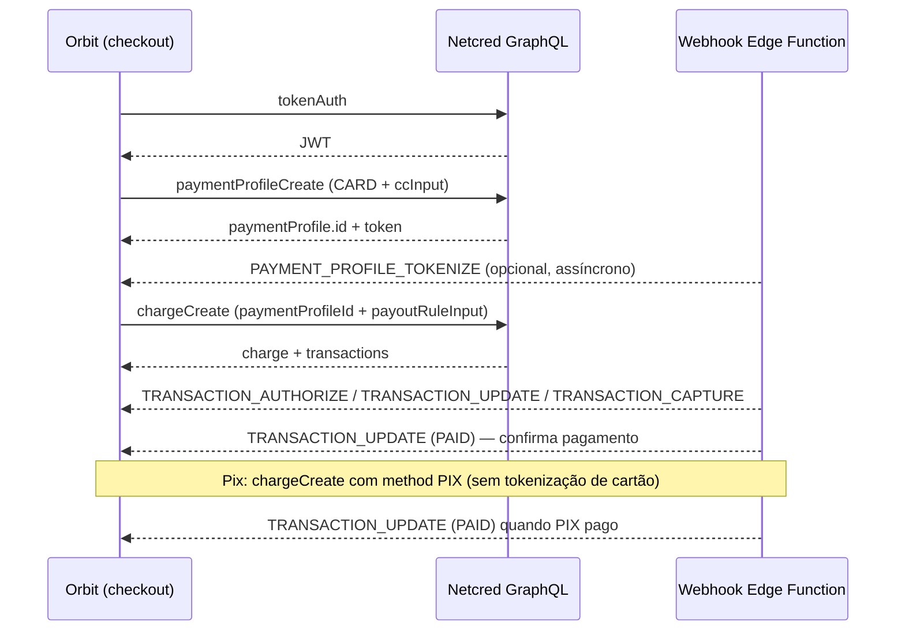

# API Netcred — Referência para Integração de Pagamentos

Documento derivado da coleção Postman **API Netcred** ([coleção](https://go.postman.co/collection/55609940-a4b17641-251f-4c8e-a147-c3a5facc5715)) e da documentação oficial em [docs.netcredbrasil.com.br](https://docs.netcredbrasil.com.br/).

Foco: **cartão de crédito com tokenização** → **cobrança com token (PaymentProfile)** → **split de pagamento (PayoutRule)** → **Pix** → **webhooks**.

---

## 1. Visão geral

| Aspecto | Detalhe |
|---------|---------|
| Protocolo | **GraphQL** sobre HTTP POST |
| Formato | JSON |
| Autenticação | JWT (`Authorization: JWT <token>`) |
| Sandbox | `https://api.sandbox.netcredbrasil.com.br/graphql` |
| Produção | `https://api.netcredbrasil.com.br/graphql` |
| Documentação | [netcredbrasil.com.br](https://netcredbrasil.com.br/) |

A API unifica **boleto**, **cartão de crédito** e **PIX** no mesmo modelo de domínio. Toda cobrança gera uma ou mais **Transactions** (pagamentos efetivos).

### Objetos principais

| Objeto | Papel |
|--------|-------|
| **Company** | Estabelecimento (`MERCHANT`) — obrigatório em quase todas as chamadas via `companyId` |
| **Customer** | Pagador (CPF/CNPJ, nome, e-mail, telefone) |
| **PaymentProfile** | Perfil de pagamento — para cartão, armazena o **token** do cartão tokenizado |
| **Charge** | Cobrança (agrupamento de transações) |
| **Transaction** | Pagamento individual (boleto emitido, PIX gerado ou autorização/captura de cartão) |
| **PayoutRule** | Regra de **split** — define como o valor é dividido entre contas bancárias |
| **BankAccount** | Conta bancária de destino no split (criada previamente junto à Netcred) |

---

## 2. Autenticação

### Obter token JWT

```graphql
mutation tokenAuth($username: String!, $password: String!) {
  tokenAuth(username: $username, password: $password) {
    token
    refreshExpiresIn
    errors { code field message }
    user {
      id
      username
      sandbox
      company { id }
    }
  }
}
```

| Parâmetro | Obrigatório | Descrição |
|-----------|-------------|-----------|
| `username` | Sim | Usuário fornecido pela Netcred |
| `password` | Sim | Senha fornecida pela Netcred |

**Validade do token:** 24 horas. Renovar com nova chamada `tokenAuth`.

**Header em todas as demais requisições:**

```
Authorization: JWT <token>
```

### Obter `companyId`

```graphql
query {
  getCompanies {
    edges {
      node {
        id
        name
        companyType
        companyState
      }
    }
  }
}
```

Use o `id` da Company do tipo `MERCHANT` nas mutations de cobrança e perfil de pagamento.

---

## 3. Fluxo recomendado para a Renovi

O fluxo alinhado ao requisito *“primeiro salvar o cartão com tokenização, depois cobrar com split”*:



### Passo a passo

1. **Autenticar** → obter JWT e `companyId`.
2. **Tokenizar cartão** → `paymentProfileCreate` com `method: CARD` e `ccInput`.
3. **Persistir** `paymentProfile.id` (e opcionalmente o `token` retornado) no banco da Renovi, vinculado ao cliente.
4. **Criar cobrança** → `chargeCreate` passando `paymentProfileId` (não reenviar dados do cartão) + `payoutRuleInput` ou `payoutRuleId` para o split.
5. **Acompanhar status** via **webhooks** (recomendado) ou polling em `transactions`.
6. **Pix** → `chargeCreate` com `paymentProfileInput.method: PIX` (ou `paymentProfileId` pré-existente); exibir `pixInfo.pixCopyPaste` ao cliente.

---

## 4. Tokenização de cartão (PaymentProfile)

A tokenização **não expõe o PAN completo** no sistema da Renovi após a criação. O gateway retorna um **PaymentProfile** com `id` e `token` interno para cobranças futuras.

### Mutation

```graphql
mutation paymentProfileCreateCard($input: PaymentProfileCreateInput!) {
  paymentProfileCreate(input: $input) {
    errors { field message code }
    paymentProfile {
      id
      method
      isActive
      cardNumber      # truncado, ex.: 497010XXXXXX0048
      expiryMonth
      expiryYear
      brand
      cardHolderName
      token           # token para reutilização
      rejectedReason
      customer { id name documentType document }
    }
  }
}
```

### Input de exemplo

```json
{
  "input": {
    "method": "CARD",
    "customerInput": {
      "companyId": 1014,
      "name": "Nome do Cliente",
      "email": "cliente@email.com",
      "documentType": "CPF",
      "document": "12235241913",
      "phone": "47999999999",
      "persist": true
    },
    "ccInput": {
      "cardNumber": "4970100000000048",
      "expiryMonth": 10,
      "expiryYear": 2027,
      "securityCode": "123",
      "cardHolderName": "NOME NO CARTAO"
    }
  }
}
```

### Parâmetros `ccInput`

| Campo | Obrigatório | Descrição |
|-------|-------------|-----------|
| `cardNumber` | Sim | Número do cartão |
| `expiryMonth` | Sim | Mês de validade (1–12) |
| `expiryYear` | Sim | Ano de validade (ex.: 2027) |
| `securityCode` | Sim | CVV |
| `cardHolderName` | Sim | Nome impresso no cartão |

### Idempotência / deduplicação

Um PaymentProfile de cartão é único pela combinação:

- `cardNumber` (truncado)
- `expiryMonth` / `expiryYear`
- documento do `customer`

Se já existir, a API **retorna o perfil existente** em vez de criar outro.

### Endereço de cobrança

Obrigatório (`billingAddressInput` ou `billingAddressId`) **somente se a empresa tiver análise de risco (ClearSale) habilitada**.

### Desativar perfil

```graphql
mutation paymentProfileVoid($input: PaymentProfileVoidInput!) {
  paymentProfileVoid(input: $input) {
    errors { field message code }
    paymentProfile { id isActive token }
  }
}
```

Parâmetro: `paymentProfileId`.

### Webhook associado

`PAYMENT_PROFILE_TOKENIZE` — disparado quando a tokenização conclui (sucesso ou falha). Verificar `is_active` e `rejected_reason`.

---

## 5. Cobrança com cartão tokenizado

Após tokenizar, use **`paymentProfileId`** na cobrança — **não** reenvie `ccInput`.

### Mutation

```graphql
mutation chargeCreateCard($input: ChargeCreateInput!) {
  chargeCreate(input: $input) {
    errors { field message code }
    charge {
      id
      referenceCode
      amount
      chargeType
      chargeStatus
      installmentNumber
      paymentProfile { id token cardNumber }
      transactions {
        edges {
          node {
            id
            transactionState
            amount
            billingAt
            billedAt
            dueAt
            paidAt
            paidAmount
            rejectedReason
            cardInfo { cardNumber brand }
          }
        }
      }
    }
  }
}
```

### Input — cobrança com token + split

```json
{
  "input": {
    "companyId": 1013,
    "paymentProfileId": 99,
    "amount": "1500.00",
    "installmentNumber": 1,
    "referenceCode": "renovi-proposal-uuid-aqui",
    "billDaysInAdvance": 0,
    "extraInfo": "Serviço Renovi - proposta XYZ",
    "payoutRuleInput": {
      "name": "Split Renovi + Prestador",
      "isPrimary": false,
      "persist": true,
      "ruleItems": [
        {
          "splitType": "PERCENTAGE",
          "proportion": "15.0",
          "isLiable": true,
          "bankAccountId": 10,
          "scheduleInput": {
            "scheduleType": "DAILY",
            "scheduleAnchor": 1,
            "automaticAdvance": false
          }
        },
        {
          "splitType": "PERCENTAGE",
          "proportion": "85.0",
          "isLiable": false,
          "bankAccountId": 20,
          "scheduleInput": {
            "scheduleType": "DAILY",
            "scheduleAnchor": 1,
            "automaticAdvance": false
          }
        }
      ]
    },
    "orderInput": {
      "sessionId": "clearsale-session-id",
      "orderItems": [{
        "productInput": {
          "name": "Serviço de reforma",
          "amount": "1500.00",
          "description": "Descrição do serviço",
          "category": "Serviços"
        }
      }]
    }
  }
}
```

### Parâmetros principais de `chargeCreate` (cartão)

| Campo | Obrigatório | Descrição |
|-------|-------------|-----------|
| `companyId` | Sim | ID da Company `MERCHANT` |
| `amount` | Sim | Valor decimal com até 2 casas (string `"10.25"`) |
| `paymentProfileId` | Sim* | ID do perfil tokenizado (*ou `paymentProfileInput`) |
| `installmentNumber` | Não | Parcelas no cartão (default: 1) |
| `referenceCode` | Recomendado | **Idempotência** — repetir na mesma empresa gera erro |
| `payoutRuleId` | Não** | ID de split pré-existente |
| `payoutRuleInput` | Não** | Split inline na cobrança |
| `contractId` | Não** | Alternativa a payout (financiador) |
| `manualCapture` | Não | `true` = autoriza mas não captura automaticamente |
| `orderInput` | Condicional | Obrigatório com análise de risco habilitada |
| `customerIpAddress` | Não | IP do pagador (antifraude) |

** Mutuamente exclusivos: `payoutRuleId`, `payoutRuleInput`, `contractId`. Se nenhum for enviado, usa o split padrão da empresa.

### Captura manual

Se `manualCapture: true`:

1. Transação vai para `BILLED` (autorizada).
2. Chamar `transactionCapture` para capturar e ir para `PAID`.

```graphql
mutation transactionCapture($input: TransactionCaptureInput!) {
  transactionCapture(input: $input) {
    errors { code message field }
    transaction { id amount transactionState }
  }
}
```

Default (`manualCapture: false`): autorização + captura automáticas na criação.

### Análise de risco (ClearSale)

Quando habilitada na empresa:

- Integrar script ClearSale Behavior Analytics no checkout.
- Enviar `orderInput.sessionId` (obter `app_id` com suporte Netcred).
- Enviar `orderInput.orderItems` com descrições precisas do serviço.
- Estados intermediários: `IN_ANALYSIS`, `MANUAL_ANALYSIS`.

---

## 6. Cobrança PIX

### Criar cobrança PIX

Mesma mutation `chargeCreate`, com `paymentProfileInput.method: "PIX"`.

```json
{
  "input": {
    "companyId": 1014,
    "amount": "125.37",
    "referenceCode": "renovi-pix-uuid",
    "paymentProfileInput": {
      "method": "PIX",
      "billingAddressInput": {
        "street": "Rua Exemplo",
        "number": "100",
        "district": "Centro",
        "city": "Joinville",
        "state": "SC",
        "zipCode": "89201420"
      },
      "customerInput": {
        "name": "Cliente",
        "email": "cliente@email.com",
        "documentType": "CPF",
        "document": "12235241913",
        "phone": "47999999999",
        "persist": true
      }
    },
    "pixConditionInput": {
      "interestType": "DAYS",
      "interestValueType": "PERCENT",
      "interestValue": "5",
      "fineValueType": "VALUE",
      "fineValue": "10",
      "persist": false
    },
    "payoutRuleId": 99,
    "extraInfo": "Pagamento serviço Renovi"
  }
}
```

### Resposta relevante

Na `transaction` retornada, usar:

- `pixInfo.pixCopyPaste` — código copia e cola (gerar QR com biblioteca local)
- `pixInfo.pix_type` — `WITH_DUE_DATE` (cobrança com vencimento) ou `IMMEDIATE` (via ChargeLink)
- `dueAt` — data de vencimento
- `transactionState` — evolui até `PAID` após pagamento

### Split em PIX

`payoutRuleInput` / `payoutRuleId` funcionam igual ao cartão. Porém, **antecipação (`scheduleInput.automaticAdvance`) não tem efeito em PIX e boleto** — liquidação é D+1.

### Perfil PIX prévio (opcional)

`paymentProfileCreate` com `method: PIX` — mesmo padrão de endereço + customer. Reutilizar via `paymentProfileId` em cobranças futuras.

---

## 7. Split de pagamento (PayoutRule)

O split define **para quais contas bancárias** o valor líquido é direcionado após o processamento.

### Regras importantes

| Regra | Detalhe |
|-------|---------|
| Habilitação | Empresa precisa ter **seleção de split habilitada** pela Netcred |
| Contas | `bankAccountId` deve existir previamente (solicitar cadastro à Netcred) |
| Soma percentual | Itens `PERCENTAGE` devem somar **100.0** |
| `isLiable` | Define quem arca com débitos (taxas de aluguel, estornos) — MDR/antecipação são descontados independentemente |
| Cartão + terceiros | Para split de cartão para conta de terceiro, `cardPayoutAllowed` na regra deve ser `true` (titular da conta = documento do EC) |
| Reutilização | `payoutRuleId` para regra persistida; `payoutRuleInput` para regra ad-hoc (`persist: true` salva para reuso) |

### Tipos de split (`ruleItems`)

| `splitType` | Campo valor | Descrição |
|-------------|-------------|-----------|
| `PERCENTAGE` | `proportion` | Percentual repassado (ex.: `"85.0"`) |
| `FIXED_AMOUNT` | `amount` | Valor fixo repassado (ex.: `"50.00"`) |

### Schedule (antecipação — cartão)

| Campo | Valores | Descrição |
|-------|---------|-----------|
| `automaticAdvance` | boolean | `true` = antecipa liquidação (com taxa) |
| `scheduleType` | `DAILY`, `WEEKLY`, `MONTHLY` | Tipo de agenda |
| `scheduleAnchor` | 1–31 ou 0–6 | Dia relativo ao tipo (DAILY: dias após processamento; WEEKLY: 0=seg … 6=dom) |

### Consultar splits existentes

```graphql
query {
  getPayoutRules(companyId: 1014) {
    edges {
      node {
        id
        name
        isPrimary
        isActive
        ruleItems {
          splitType
          proportion
          amount
          isLiable
          bankAccount { id holderName }
        }
      }
    }
  }
}
```

### Modelo sugerido para Renovi (marketplace)

| Destino | `proportion` | `isLiable` | Observação |
|---------|--------------|------------|------------|
| Conta Renovi (comissão) | Taxa da plataforma | `true` | Arca com chargeback/estorno proporcional |
| Conta prestador | Restante | `false` | Líquido do prestador |

Valores exatos devem refletir a regra de negócio em `docs/payment-system/` (comissão fixa vs percentual).

---

## 8. Máquina de estados

### Charge (`chargeStatus`)

| Estado | Significado |
|--------|-------------|
| `ONGOING` | Ainda há transações pendentes |
| `ENDED` | Todas as transações em estado final |
| `VOIDED` | Cobrança cancelada |

### Transaction (`transactionState`)

| Estado | Significado | Métodos |
|--------|-------------|---------|
| `SCHEDULED` | Agendada; emissão/autorização em `billingAt` | Todos |
| `BILLED` | Emitida (boleto/PIX) ou autorizada (cartão) | Todos |
| `IN_ANALYSIS` | Análise de risco automática (até ~2h) | Cartão |
| `MANUAL_ANALYSIS` | Análise manual Netcred | Cartão |
| `REJECTED` | Recusada na autorização | Cartão |
| `PAID` | Paga / capturada | Todos |
| `EXPIRED` | Vencida (equivalente a cancelada) | Boleto, PIX |
| `VOIDED` | Cancelada | Todos |
| `PARTIALLY_REFUNDED` | Estorno parcial | Cartão, PIX online |
| `REFUNDED` | Estorno total | Cartão, PIX online |

### Fluxo cartão (captura automática)

```
SCHEDULED → BILLED (autorização) → PAID (captura automática)
         ↘ REJECTED
         ↘ IN_ANALYSIS → PAID | REJECTED
```

### Fluxo PIX

```
SCHEDULED → BILLED (QR gerado) → PAID (pagamento confirmado)
         ↘ EXPIRED
         ↘ VOIDED
```

### Eventos de confirmação para a Renovi

| Método | Webhook principal | `transaction_state` alvo |
|--------|-------------------|--------------------------|
| Cartão 1x | `TRANSACTION_UPDATE` ou `TRANSACTION_CAPTURE` | `PAID` |
| Cartão (análise risco) | `TRANSACTION_AUTHORIZE` → `TRANSACTION_UPDATE` | `PAID` ou `REJECTED` |
| PIX | `TRANSACTION_UPDATE` | `PAID` |

---

## 9. Webhooks

### Configuração

```graphql
mutation webhookCreate($input: WebhookCreateInput!) {
  webhookCreate(input: $input) {
    errors { field message code }
    webhook {
      id
      name
      targetUrl
      isActive
      secretKey
      company { name }
    }
  }
}
```

```json
{
  "input": {
    "name": "renovi-payments",
    "targetUrl": "https://<projeto>.supabase.co/functions/v1/netcred-webhook",
    "companyId": 1014,
    "isActive": true,
    "secretKey": "chave-secreta-forte",
    "maskUserAgent": true,
    "events": ["TRANSACTION_UPDATE", "TRANSACTION_CAPTURE", "PAYMENT_PROFILE_TOKENIZE", "CHARGE_CREATE"]
  }
}
```

| Parâmetro | Descrição |
|-----------|-----------|
| `targetUrl` | Endpoint HTTPS (obrigatório SSL) |
| `secretKey` | Usada para validar assinatura HMAC |
| `events` | Um ou mais eventos (ver tabela abaixo) |
| `maskUserAgent` | Simula user-agent de navegador se firewall bloquear |

**Testar conectividade:** `webhookPing(webhookId)`.

**Remover:** `webhookDelete(webhookId)`.

### Headers em todo webhook recebido

| Header | Exemplo | Descrição |
|--------|---------|-----------|
| `Content-Type` | `application/json` | Corpo JSON |
| `X-NETCRED-Event` | `TRANSACTION_UPDATE` | Tipo do evento |
| `X-NETCRED-Domain` | `https://api.sandbox.netcredbrasil.com.br` | Origem (sandbox ou produção) |
| `X-NETCRED-Signature` | `87e99e04...` | SHA256 do corpo com `secretKey` |

### Validação de assinatura

1. Ler corpo raw da requisição (bytes exatos).
2. Calcular `SHA256(secretKey + body)` (confirmar algoritmo exato com Netcred na homologação).
3. Comparar com `X-NETCRED-Signature`.
4. Rejeitar se divergir.

### Catálogo completo de eventos

| Evento | Quando dispara | Payload |
|--------|----------------|---------|
| `ANY` | Qualquer evento (header indica o real) | Variável |
| `CHARGE_CREATE` | Cobrança criada | `ChargePayload` |
| `CHARGE_UPDATE` | Cobrança atualizada | `ChargePayload` |
| `CHARGE_VOID` | Cobrança cancelada | `ChargePayload` |
| `TRANSACTION_CREATE` | Transação criada | `TransactionPayload` |
| `TRANSACTION_AUTHORIZE` | Emissão/autorização | `TransactionPayload` |
| `TRANSACTION_CAPTURE` | Captura (cartão) | `TransactionPayload` |
| `TRANSACTION_UPDATE` | Atualização geral (inclui pagamento PIX/boleto) | `TransactionPayload` |
| `TRANSACTION_EXPIRED` | Transação expirada | `TransactionPayload` |
| `TRANSACTION_VOID` | Transação cancelada | `TransactionPayload` |
| `TRANSACTION_REFUND` | Estorno | `TransactionPayload` |
| `TRANSACTION_DISPUTE` | Chargeback iniciado | `TransactionPayload` |
| `PAYMENT_PROFILE_TOKENIZE` | Tokenização concluída (sucesso ou falha) | `PaymentProfilePayload` |
| `PAYMENT_PROFILE_UPDATE` | Perfil atualizado | `PaymentProfilePayload` |
| `PAYMENT_PROFILE_DELETE` | Perfil desativado | `PaymentProfilePayload` |
| `PAYMENT_PROFILE_EXPIRING` | Cartão expira em ~1 mês | `PaymentProfilePayload` |
| `WEBHOOK_PING` | Teste via `webhookPing` | Ping |

> **Nota:** Na descrição textual da coleção aparece `TRANSACTION_EXPIRE`; no cadastro de webhook (`webhookCreate`) o valor aceito é `TRANSACTION_EXPIRED`.

### Payload `TransactionPayload` (campos principais)

```json
{
  "id": 123456,
  "uuid": "f6412196-35fb-4716-b308-0e2cfea7c970",
  "transaction_state": "PAID",
  "amount": "10.00",
  "refunded_amount": "0.00",
  "paid_amount": "10.00",
  "installment_number": 1,
  "company": 99,
  "method": "CARD",
  "capture_medium": "ONLINE",
  "billing_at": "2023-05-26",
  "billed_at": "2023-05-26T03:47:20.628345Z",
  "due_at": "2023-05-28",
  "paid_at": "2023-05-26T04:00:00Z",
  "attempts": 1,
  "is_disputed": false,
  "charge": {
    "id": 44892,
    "reference_code": "renovi-proposal-uuid",
    "charge_link_id": null
  },
  "pix_info": null,
  "billet_info": null,
  "operations": [{
    "operation_type": "CAPTURE",
    "operation_status": "SUCCESS",
    "operation_date": "2023-05-26T04:00:00Z"
  }],
  "payment_profile": { "id": 161258, "method": "CARD", "is_active": true }
}
```

`pix_info` (quando `method: PIX`):

| Campo | Descrição |
|-------|-----------|
| `pix_copy_paste` | Código copia e cola |
| `e2eid` | ID Bacen (após pagamento) |
| `pix_type` | `WITH_DUE_DATE`, `IMMEDIATE`, etc. |
| `expires_at` | Expiração (tipo `IMMEDIATE`) |

### Payload `PaymentProfilePayload` (tokenização)

```json
{
  "id": 12125,
  "method": "CARD",
  "is_active": true,
  "card_number": "497010XXXXXX0048",
  "expiry_month": "8",
  "expiry_year": "2027",
  "brand": "VCC",
  "card_holder_name": "Titular",
  "rejected_reason": "",
  "company": 99,
  "customer": 22125
}
```

Se `is_active: false` e `rejected_reason` preenchido → tokenização falhou.

### Payload `ChargePayload`

Inclui `id`, `reference_code`, `charge_type` (`SINGLE` | `RECURRING`), `charge_status`, `installment_number`, `payment_profile`, `rrule` e array `transactions` com `TransactionPayload` aninhados.

### Tipos de `operations` em Transaction

| `operation_type` | Significado |
|------------------|-------------|
| `AUTHORIZE` | Autorização cartão |
| `CAPTURE` | Captura |
| `VOID` | Cancelamento |
| `TOKENIZE` | Tokenização |
| `EMISSION` | Emissão boleto/PIX |
| `REFUND` | Estorno |
| `RISK_ANALYSIS` | Análise antifraude |
| `UPDATE` | Atualização |
| `IMPORT` | Importação |

| `operation_status` | Significado |
|--------------------|-------------|
| `SUCCESS` | Concluído com sucesso |
| `REJECTED` | Concluído mas recusado (ex.: sem limite) |
| `FAILURE` | Falha no gateway |

---

## 10. Outras mutations úteis

| Mutation | Uso |
|----------|-----|
| `chargeVoid` | Cancela charge `ONGOING` (transações `SCHEDULED`) |
| `transactionVoid` | Cancela transação `SCHEDULED` ou `BILLED` |
| `transactionRefund` | Estorno parcial/total (`PAID` ou `PARTIALLY_REFUNDED`) |
| `transactionBill` | Antecipa emissão/autorização |
| `transactionUpdate` | Atualiza dados da transação |
| `customerCreate` | Cria pagador isoladamente |

---

## 11. Consultas (polling)

```graphql
query {
  transactions(
    companyId: 1014
    referenceCode: "renovi-proposal-uuid"
    first: 10
  ) {
    edges {
      node {
        id
        transactionState
        amount
        paidAmount
        paidAt
        method
        charge { id referenceCode }
      }
    }
  }
}
```

Paginação: `first` (máx. 200), `offset`, `orderBy` (ex.: `"-due_at"`).

---

## 12. Sandbox vs produção

### URLs

| Ambiente | Base URL |
|----------|----------|
| Sandbox | `https://api.sandbox.netcredbrasil.com.br` |
| Produção | `https://api.netcredbrasil.com.br` |

### Dados de teste (sandbox)

| Cenário | Valor |
|---------|-------|
| Cartão aprovado | `4970100000000048` |
| Cartão rejeitado | `4970100000000071` |
| Antifraude aprovado | CPF/CNPJ terminando em **1** |
| Antifraude rejeitado | CPF/CNPJ terminando em **diferente de 1** |

**Limitações sandbox:** não simula pagamento real de boleto/PIX.

### Migração para produção

1. Trocar credenciais (`username` / `password`) — ambientes isolados.
2. Trocar todos os IDs (`companyId`, `bankAccountId`, `payoutRuleId`, etc.).
3. Trocar URL (remover `sandbox` do host).
4. Reconfigurar webhooks com `targetUrl` de produção.

---

## 13. Implicações para implementação na Renovi

### Camada de API (`src/features/payments/api/`)

Sugestão de módulos alinhados à arquitetura feature-based:

| Função | Mutation/Query Netcred |
|--------|------------------------|
| `authenticate()` | `tokenAuth` |
| `getCompanies()` | `getCompanies` |
| `createCardPaymentProfile()` | `paymentProfileCreate` |
| `voidPaymentProfile()` | `paymentProfileVoid` |
| `createCardCharge()` | `chargeCreate` + `paymentProfileId` + `payoutRuleInput` |
| `createPixCharge()` | `chargeCreate` + PIX |
| `voidCharge()` | `chargeVoid` |
| `refundTransaction()` | `transactionRefund` |
| `getTransaction()` | `transactions` query |

### Edge Function webhook

- Endpoint dedicado (ex.: `netcred-webhook`).
- Validar `X-NETCRED-Signature`.
- Tratar idempotentemente por `transaction.id` + `transaction_state`.
- Mapear `reference_code` → `service_payments` / `provider_proposals`.
- Estados terminais: `PAID` (confirmar serviço), `REJECTED` / `VOIDED` / `EXPIRED` (liberar checkout).

### Dados a persistir localmente

| Campo Netcred | Uso Renovi |
|---------------|------------|
| `paymentProfile.id` | Cartão salvo do cliente |
| `charge.id` | ID da cobrança |
| `transaction.id` | ID da transação (webhook) |
| `referenceCode` | Idempotência (= ID interno do pagamento) |
| `payoutRule.id` | Split aplicado (auditoria) |
| `pixInfo.pixCopyPaste` | Exibir QR no checkout |

### Segurança PCI

- **Nunca** persistir PAN, CVV ou dados completos do cartão.
- Coletar dados do cartão apenas no checkout e enviar direto à Netcred via `paymentProfileCreate`.
- Armazenar somente `paymentProfileId` e metadados truncados (`cardNumber` mascarado, `brand`).

---

## 14. Referências

- Coleção Postman: [API Netcred](https://go.postman.co/collection/55609940-a4b17641-251f-4c8e-a147-c3a5facc5715)
- Environment sandbox: `Sandbox - Netcred` (`url`, `username`, `password`, `token`)
- Documentação Netcred: [docs.netcredbrasil.com.br](https://docs.netcredbrasil.com.br/)
- Plano de pagamentos Renovi: `docs/payment-system/payment-system-plan.md`
- Suporte Netcred: WhatsApp +55 47 3227-0080

---

*Gerado em 2026-06-09 a partir da coleção Postman API Netcred via MCP Postman.*
