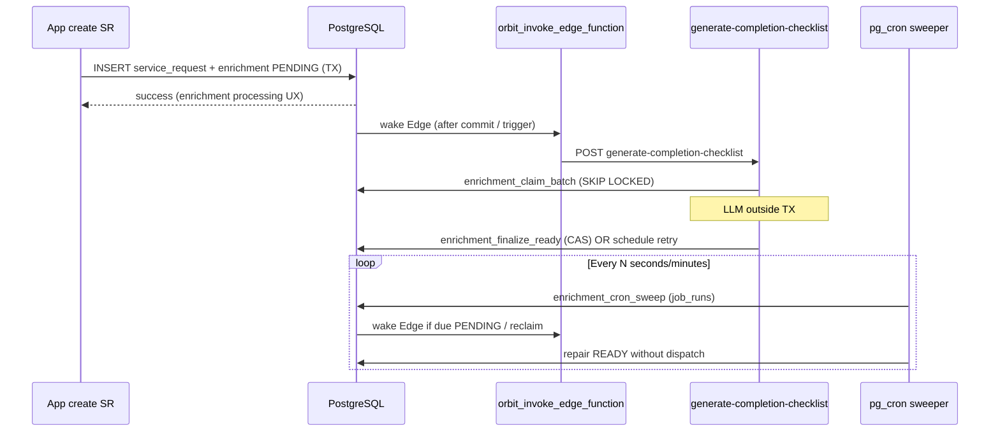
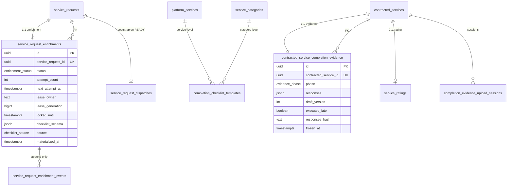
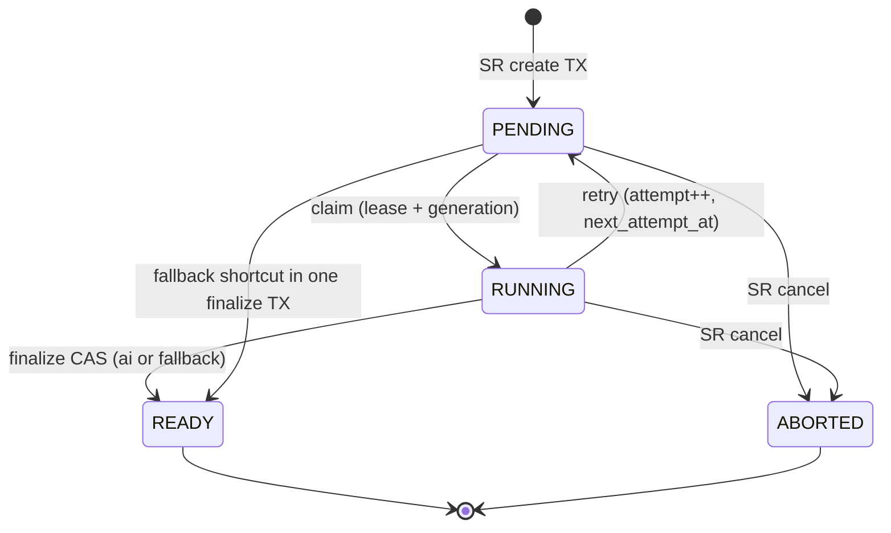
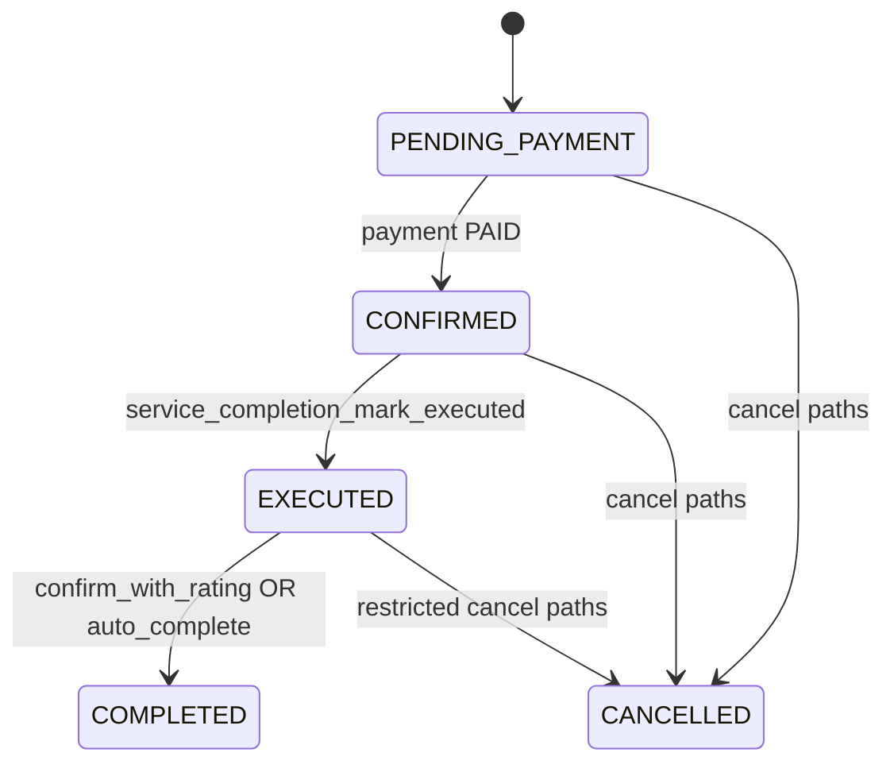
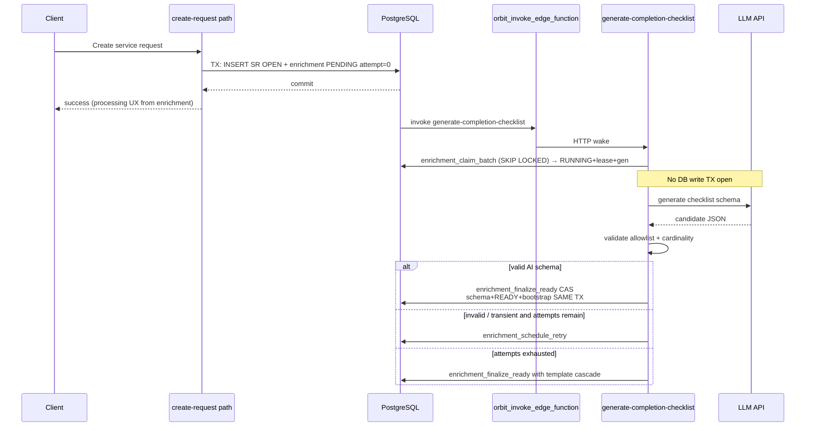
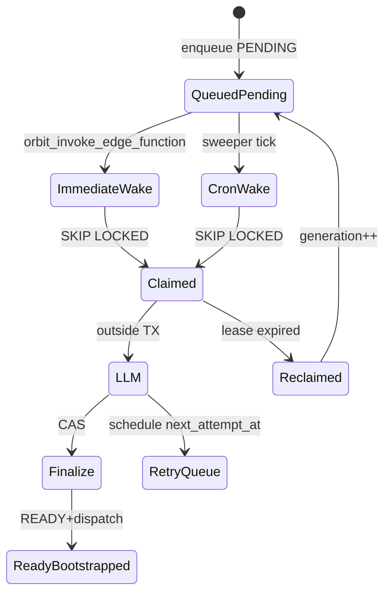

# Service Completion & Publication Readiness - Design Document

> **Covers Requirements 1–25**  
> **Version:** 1.1 — 2026-08-04 (gap closure)  
> **Status:** Engineering Review Ready  
> **Authors:** Staff Engineering · Principal Architecture  
>
> **Aligned with:** [`requirements.md`](./requirements.md), [`CONTEXT.md`](./CONTEXT.md) (decisions 1–32), [`ADR-0001`](./adr/0001-separate-enrichment-fsm-for-publication-readiness.md), [`ADR-0002`](./adr/0002-evidence-images-block-not-image-gallery.md), [`ADR-0003`](./adr/0003-completion-criterion-block.md), [`ADR-0004`](./adr/0004-completion-rpcs-outside-payments.md), [`infrastructure-constraints.md`](../infrastructure-constraints.md), [`concurrency-requirements.md`](../concurrency-requirements.md), [`scalability-requirements.md`](../scalability-requirements.md)

---

## Normative precedence (design locks)

If any wording in [`requirements.md`](./requirements.md) **Assumptions** or **Implementation Guidance** still mentions product APIs named `payment_mark_service_executed`, `payment_confirm_service_completed`, or `payment_cron_auto_complete_*`, **this design document and [`CONTEXT.md`](./CONTEXT.md) decisions 28–29 + [`ADR-0004`](./adr/0004-completion-rpcs-outside-payments.md) supersede that wording.**

| Legacy (REMOVE from product API) | Successor (MUST) |
|---|---|
| `payment_mark_service_executed` | `service_completion_mark_executed` |
| `payment_confirm_service_completed` | `service_completion_confirm_with_rating` |
| `payment_cron_auto_complete_executed_services` (and related payment wrappers) | `service_completion_auto_complete_executed` + `service_completion_cron_auto_complete_executed` (`job_runs`) |

NetCred charge/refund/settlement RPCs remain in the payments domain. Self-serve `EXECUTED` / manual `COMPLETED`+rating / system auto-complete are **service-completion** ownership.

**Cutover:** database reset in the current development phase — **no** legacy OPEN grandfather/backfill. Enrichment gate applies to all post-deploy service requests ([CONTEXT](./CONTEXT.md) decision 22).

---

# 1. Overall Architecture and Component Relationships

## 1.1 Architectural Intent

The Service Completion & Publication Readiness subsystem owns two coupled but distinct concerns:

1. **Publication Readiness (pre-matching enrichment)** — After `service_requests` insert, asynchronously materialize an immutable completion checklist (Dynamic Form schema) before matching may bootstrap. Until enrichment reaches `READY`, the request exists but MUST NOT be visible to providers as a matchable opportunity and MUST NOT create `service_request_dispatches`.
2. **Service Completion (post-contract execution)** — After `contracted_services` reaches `CONFIRMED`, the contracted provider fills checklist responses/evidence, transitions to `EXECUTED`, and the client confirms with mandatory rating (manual path) or the system auto-completes after grace (~24h) into `COMPLETED`.

The subsystem is **database-centric**. Authoritative FSM state, leases, schemas, drafts, frozen evidence, ratings composition, matching bootstrap handoff, and audit events live in PostgreSQL. Edge Functions are **stateless I/O connectors** for LLM generation, Storage session orchestration wake paths, and cron-invoked worker loops. They MUST NOT own enrichment or CS lifecycle state in memory.

Architectural principles (normative):

| # | Principle | Implication |
|---|---|---|
| P1 | Separate FSMs ([ADR-0001](./adr/0001-separate-enrichment-fsm-for-publication-readiness.md)) | Enrichment ≠ `service_request_status` ≠ matching `DISPATCH_*` ≠ `contracted_services.status` |
| P2 | PostgreSQL as system of record | All transitions via RPC; UNIQUE + CAS + status predicates |
| P3 | Edge = I/O only | LLM HTTP outside DB TX; finalize is a separate CAS TX |
| P4 | Fail closed on publication | No checklist ⇒ no matching bootstrap |
| P5 | Fail open on AI via template | Exhausted AI ⇒ cascade template → `READY`; never auto-cancel SR for AI failure |
| P6 | Atomic product transitions | EXECUTED submit and manual confirm+rating are single TX/RPC boundaries |
| P7 | Completion RPCs outside payments ([ADR-0004](./adr/0004-completion-rpcs-outside-payments.md)) | Writers are `service_completion_*` |

## 1.2 Runtime Topology

```mermaid
graph TB
    subgraph client["Client — React 19 / Capacitor"]
        UI_ENR["Enrichment UX\n'em processamento'"]
        UI_PROV["Provider checklist fill\ndraft + EXECUTED wizard"]
        UI_CLI["Client review\nconfirm+rating + dispute stub"]
        DF["Dynamic Form\ncompletion_criterion + static_text"]
    end

    subgraph app["App feature — src/features/service-completion/"]
        API["api/ layer\nRPC + Edge invoke"]
        HOOKS["hooks/\norchestration only"]
    end

    subgraph ef["Edge Functions — Deno (I/O)"]
        EF_CHK["generate-completion-checklist\nclaim → LLM → finalize CAS"]
    end

    subgraph pg["PostgreSQL — Supabase (source of truth)"]
        ENR["service_request_enrichments\n+ enrichment_events"]
        TPL["completion_checklist_templates"]
        EVD["contracted_service_completion_evidence"]
        UPS["completion_evidence_upload_sessions"]
        RPC["service_completion_* RPCs\nenrichment_* RPCs\nmatching_bootstrap_dispatch_for_service_request"]
        CRON["pg_cron → service_completion_cron_*\nenrichment_cron_*\njob_runs"]
        CS["contracted_services\nservice_ratings"]
        DISP["service_request_dispatches"]
    end

    subgraph ext["External"]
        LLM["LLM provider"]
        STOR["Supabase Storage"]
        MMD["Message Dispatcher\nmmd_ingest_event"]
    end

    client --> DF
    client --> app
    app -->|supabase.rpc authenticated| pg
    app -->|functions.invoke| ef
    CRON -->|orbit_invoke_edge_function| ef
    CRON -->|SQL wrappers| RPC
    ef -->|service_role RPC| pg
    ef -->|HTTP| LLM
    app -->|Storage.upload (RLS)| STOR
    RPC -->|DELETE storage.objects| STOR
    RPC -->|enqueue| MMD
    RPC -->|READY handoff| DISP
```

## 1.3 Component Responsibilities

| Component | Stateful? | Responsibility |
|---|---|---|
| `service_request_enrichments` | Stateful FSM | 1:1 publication readiness; lease; attempts; immutable schema when READY |
| `service_request_enrichment_events` | Append-only | Transition audit; correlation; error payloads |
| `completion_checklist_templates` | Configuration | Cascade platform_service → category → global |
| `contracted_service_completion_evidence` | Stateful | Draft → frozen package 1:1 with CS; `executed_late` at freeze |
| `completion_evidence_upload_sessions` | Stateful | KYC/chat-pattern upload sessions; orphan janitor |
| `contracted_services` | Stateful (existing) | Lifecycle `PENDING_PAYMENT\|CONFIRMED\|EXECUTED\|COMPLETED\|CANCELLED` — extended, not forked |
| `service_ratings` | Stateful (existing) | Manual confirm TX insert; optional post-auto-complete |
| `service_request_dispatches` | Stateful (matching) | Bootstrap only via READY handoff |
| Enrichment / completion RPCs | Stateless SQL | All authoritative mutations |
| `generate-completion-checklist` EF | Stateless | LLM I/O + claim/finalize orchestration |
| `src/features/service-completion/` | Ephemeral UI | Enrichment projection, checklist fill, confirm+rating; public API for `view-services` |
| MMD | Existing | `SERVICE_EXECUTED`, completion, auto-complete notifications |
| `job_runs` | Telemetry | Product cron wrappers |

## 1.4 RPC vs Edge Function Decision Matrix

| Operation | Layer | Rationale |
|---|---|---|
| SR create + enrichment `PENDING` insert + wake | **RPC** (create path) + `orbit_invoke_edge_function` | Same TX as SR insert; wake after commit (or AFTER INSERT that schedules net) |
| Enrichment claim (`PENDING`→`RUNNING`+lease) | **RPC** `enrichment_claim_batch` | `SKIP LOCKED`; short TX |
| LLM checklist generation | **EF** `generate-completion-checklist` | External secret + HTTP; MUST NOT hold DB TX |
| Schema validate + finalize READY + bootstrap | **RPC** `enrichment_finalize_ready` (CAS) | Same TX: schema + READY + `matching_bootstrap_dispatch_for_service_request` |
| Retry / abort / reclaim | **RPC** | Status predicates + lease generation |
| Draft save / upload session | **RPC** (+ Storage signed URL via EF or RPC pattern) | Auth + version conflict |
| Mark EXECUTED | **RPC** `service_completion_mark_executed` | Atomic freeze + CS status + MMD intent |
| Confirm + rating | **RPC** `service_completion_confirm_with_rating` | Atomic COMPLETED + rating |
| Auto-complete | **RPC** cron wrapper | Batch `SKIP LOCKED`; no rating |
| Orphan media janitor | **EF** + RPC claim | Storage delete is I/O |
| Smart description | **EF** `generate-smart-description` (existing) | Pre-create sync; NOT part of enrichment gate |

## 1.5 Transactional vs Async Boundaries

| Operation | Boundary | Guarantee |
|---|---|---|
| Insert SR + enrichment `PENDING` | **Sync single TX** | Exactly one enrichment row (`UNIQUE service_request_id`) |
| Immediate wake Edge | **Async after enqueue** | Best-effort; cron sweeper is safety net |
| Claim → RUNNING + lease + generation | **Sync short TX** | Commit **before** LLM |
| LLM HTTP | **Outside DB** | No open write TX across LLM |
| Finalize READY + schema + matching bootstrap | **Sync single TX (CAS)** | Exactly-once materialize + bootstrap under lease CAS |
| Abort on SR cancel | **Same TX as cancel (preferred)** | `ABORTED`; clear `next_attempt_at` |
| Draft upsert | **Sync TX** | Optimistic `draft_version` |
| EXECUTED submit | **Sync single TX** | Freeze + status + audit + MMD outbox intent |
| Confirm+rating | **Sync single TX** | COMPLETED + rating or full rollback |
| Auto-complete | **Async cron** | Per-row idempotent; no rating |
| MMD delivery | **Async worker** | Status commit MUST NOT depend on push/email success |
| Orphan Storage cleanup | **Async cron** | Idempotent deletes |

## 1.6 Wake and Scheduling Topology

**Design lock (CONTEXT decision 25):** after `PENDING` enqueue, the create path MUST invoke `orbit_invoke_edge_function('generate-completion-checklist', …)` for immediate processing **and** a `pg_cron` sweeper MUST reclaim due retries, expired leases, and READY-without-dispatch repairs. Create MUST NOT block the client on LLM completion. Workers MUST claim via `SKIP LOCKED` (no fan-out 1:1 without claim).



## 1.7 Feature Ownership Boundary

| Concern | Owner |
|---|---|
| Enrichment UX, checklist fill, confirm+rating, evidence uploads | `src/features/service-completion/` |
| Service detail composition | `view-services` imports **only** public API of `service-completion` |
| Matching bootstrap RPC | Matching domain (`matching_bootstrap_dispatch_for_service_request`) called from enrichment finalize |
| Money movement / NetCred | `src/features/payments/` — MUST NOT own EXECUTED/COMPLETED product writers |
| Notifications delivery | Message Dispatcher |

## 1.8 Fault Isolation

| Failure domain | Isolation strategy |
|---|---|
| LLM timeout / 5xx | Retry with backoff; lease reclaim; template fallback after max attempts |
| Invalid AI schema | Do not materialize; count attempt; fallback path |
| Missing templates at all cascade levels | Hold non-READY; CRITICAL alert; no empty publish |
| Worker crash mid-LLM | Lease TTL expiry → reclaim; stale finalize rejected by generation CAS |
| Cancel vs READY race | Row serialization; abort wins ⇒ no materialize/bootstrap |
| MMD enqueue failure after EXECUTED | Outbox / retry; CS status remains EXECUTED |
| Storage orphan | Janitor TTL; frozen refs never deleted |

---

# 2. Data Models and Relationships

## 2.1 Aggregates

| Aggregate | Table(s) | Cardinality | Role |
|---|---|---|---|
| **Enrichment** | `service_request_enrichments` + `service_request_enrichment_events` | 1:1 with `service_requests` | Publication readiness FSM + immutable checklist schema |
| **Checklist template catalog** | `completion_checklist_templates` | Many; resolved by cascade | Fallback materialization |
| **Completion evidence** | `contracted_service_completion_evidence` | 1:1 with `contracted_services` | Draft + frozen package |
| **Upload session** | `completion_evidence_upload_sessions` (+ paths) | N per CS/provider | Signed upload lifecycle |
| **Contracted service** | `contracted_services` (existing) | Marketplace lifecycle | EXECUTED/COMPLETED writers via `service_completion_*` |
| **Rating** | `service_ratings` (existing) | 1:1 CS | Manual confirm TX or optional post-auto-complete |
| **Dispatch** | `service_request_dispatches` (existing) | 1:1 SR when bootstrapped | Matching ownership after READY |

## 2.2 ERD



## 2.3 Enrichment FSM (publication readiness)



**Legal transitions (Requirement 25):**  
`PENDING→RUNNING`, `RUNNING→PENDING` (retry), `RUNNING→READY`, `PENDING→READY` (fallback in one step), `PENDING|RUNNING→ABORTED`.  
`READY` and `ABORTED` are terminal for enrichment.

**Operational annotations (not separate durable status values):** `RETRY_SCHEDULED` ≡ `PENDING` + `next_attempt_at`; `FALLBACK_APPLIED` ≡ event when `source = fallback_template`.

## 2.4 Contracted Service Completion Path (reuse — do not fork)



Evidence logical phases on `contracted_service_completion_evidence.phase`: `draft` (mutable, CS=`CONFIRMED`) → `frozen` (immutable, atomic with EXECUTED). Absent row ≡ no draft yet; final submit MAY create frozen directly.

## 2.5 Modeling Rationale

| Decision | Why |
|---|---|
| Separate enrichment table (decision 26) | Avoid polluting `service_requests`; clear readiness SoT ([ADR-0001](./adr/0001-separate-enrichment-fsm-for-publication-readiness.md)) |
| Append-only events | Reconstruct cancel vs READY races; ops forensics |
| Single evidence table draft\|frozen (decision 30) | Avoid dual-table sync; freeze is a phase flip + immutability |
| Schema jsonb on enrichment, not SR | Immutability scoped to enrichment READY |
| Templates as rows | Cascade resolution + ops seed without code deploy |
| Upload sessions dedicated | MUST NOT reuse request-quote/chat buckets (decision 21) |

## 2.6 Consistency Semantics

| Artifact | Consistency |
|---|---|
| Enrichment status / schema | Strong (TX); schema immutable after READY |
| Matching dispatch after READY | Strong preferred (same TX as READY); sweeper repairs eventual gap |
| Evidence draft | Strong per version; client-invisible via RLS |
| Frozen package | Strong with EXECUTED; immutable thereafter |
| Ratings on manual confirm | Strong same TX as COMPLETED |
| Auto-complete | Strong per row; eventual w.r.t. client inactivity |
| MMD notify | Eventual; at-least-once with dispatcher idempotency |

---

# 3. Table Schemas with Constraints

**New tables (CREATE):** `service_request_enrichments`, `service_request_enrichment_events`, `completion_checklist_templates`, `contracted_service_completion_evidence`, `completion_evidence_upload_sessions` (and optional `completion_evidence_upload_objects` if paths are normalized).

**Enums (migration):**

| Type | Values |
|---|---|
| `enrichment_status` | `PENDING`, `RUNNING`, `READY`, `ABORTED` |
| `checklist_source` | `ai`, `fallback_template` |
| `completion_evidence_phase` | `draft`, `frozen` |
| `completion_upload_session_status` | `open`, `committed`, `expired`, `aborted` |

**Existing alterations:**

- Prefer `executed_late` on `contracted_service_completion_evidence` at freeze (decision 30). Optionally mirror read-only projection on `contracted_services` for list queries — if mirrored, MUST be set only inside `service_completion_mark_executed` same TX.
- DROP trigger `trg_service_request_dispatch_bootstrap` (OPEN-insert bootstrap) — decision 31.
- REMOVE product grants / functions: `payment_mark_service_executed`, `payment_confirm_service_completed`, `payment_cron_auto_complete_*` (migrate callers).

**RLS:** deny-by-default; mutations via `SECURITY DEFINER` RPCs. Schema read ≠ response read (Requirement 8).

## 3.1 Platform constants (seed — decision 23)

```sql
-- Seed / upsert into platform_constants (keys MUST match CONTEXT decision 23)
-- checklist_criterion_min = 3
-- checklist_criterion_max = 12
-- checklist_evidence_min = 1
-- checklist_evidence_max = 5
-- checklist_ai_max_attempts = 3
-- enrichment_lease_ttl_seconds = 120
-- enrichment_claim_batch_size = 20
-- enrichment_retry_base_seconds = 30
-- completion_evidence_orphan_ttl_hours = 24
-- auto_complete_grace_hours = 24  (existing; reuse)
```

Dispute stub support destination SHALL use `VITE_SERVICE_COMPLETION_DISPUTE_SUPPORT_URL` (optional remote-config override `orbit.dispute_support_url`) — **not** `platform_constants` (§11.6).

## 3.2 `service_request_enrichments`

```sql
CREATE TYPE public.enrichment_status AS ENUM (
  'PENDING', 'RUNNING', 'READY', 'ABORTED'
);

CREATE TYPE public.checklist_source AS ENUM (
  'ai', 'fallback_template'
);

CREATE TABLE public.service_request_enrichments (
  id                   UUID PRIMARY KEY DEFAULT gen_random_uuid(),
  service_request_id   UUID NOT NULL
    REFERENCES public.service_requests(id) ON DELETE CASCADE,
  status               public.enrichment_status NOT NULL DEFAULT 'PENDING',
  attempt_count        INTEGER NOT NULL DEFAULT 0
    CHECK (attempt_count >= 0),
  next_attempt_at      TIMESTAMPTZ,
  -- Lease / ownership (Requirement 6)
  lease_owner          TEXT,                 -- worker instance id
  lease_generation     BIGINT NOT NULL DEFAULT 0,
  locked_until         TIMESTAMPTZ,
  -- Materialized checklist (immutable once set)
  checklist_schema     JSONB,
  source               public.checklist_source,
  materialized_at      TIMESTAMPTZ,
  schema_version       INTEGER,              -- DF schema version stamp
  last_error_code      TEXT,
  last_error_message   TEXT,
  -- Ops hold when template cascade fails after max AI attempts (stay PENDING, non-READY)
  ops_attention_at     TIMESTAMPTZ,
  ops_attention_reason TEXT,
  correlation_id       UUID,
  created_at           TIMESTAMPTZ NOT NULL DEFAULT now(),
  updated_at           TIMESTAMPTZ NOT NULL DEFAULT now(),
  CONSTRAINT service_request_enrichments_sr_uk UNIQUE (service_request_id),
  CONSTRAINT enrichment_ready_requires_schema CHECK (
    status <> 'READY'
    OR (
      checklist_schema IS NOT NULL
      AND source IS NOT NULL
      AND materialized_at IS NOT NULL
    )
  ),
  CONSTRAINT enrichment_aborted_no_schema CHECK (
    status <> 'ABORTED'
    OR checklist_schema IS NULL
  ),
  CONSTRAINT enrichment_running_has_lease CHECK (
    status <> 'RUNNING'
    OR (
      lease_owner IS NOT NULL
      AND locked_until IS NOT NULL
    )
  )
);

-- Claim polling: due PENDING jobs (excludes ops_attention holds — Task 63)
CREATE INDEX idx_enrichments_claim_due
  ON public.service_request_enrichments (next_attempt_at NULLS FIRST, created_at)
  WHERE status = 'PENDING' AND ops_attention_at IS NULL;

-- Lease reclaim: expired RUNNING
CREATE INDEX idx_enrichments_lease_expired
  ON public.service_request_enrichments (locked_until)
  WHERE status = 'RUNNING';

-- Bootstrap repair: READY without dispatch (sweeper join)
CREATE INDEX idx_enrichments_ready
  ON public.service_request_enrichments (materialized_at)
  WHERE status = 'READY';

COMMENT ON TABLE public.service_request_enrichments IS
  'Publication readiness FSM 1:1 with service_requests. Matching MUST NOT bootstrap until READY.';
```

**Invariants:**

- UNIQUE(`service_request_id`) prevents duplicate FSMs under create retries (Req 1 AC5).
- READY without schema is impossible (CHECK).
- ABORTED MUST NOT carry a published schema (CHECK) — cancel-before-ready path.
- Lease generation increments on every claim/reclaim; finalize CAS matches `(lease_owner, lease_generation)`.
- When template cascade fails after max AI attempts: set `ops_attention_at` + `ops_attention_reason`, keep `status = PENDING`, set `next_attempt_at = NULL`. Sweeper/claim MUST NOT infinite-retry while `ops_attention_at IS NOT NULL` unless ops clears the flag via `enrichment_clear_ops_attention`. Emit CRITICAL metric/alert.

## 3.3 `service_request_enrichment_events` (append-only)

```sql
CREATE TABLE public.service_request_enrichment_events (
  id                   UUID PRIMARY KEY DEFAULT gen_random_uuid(),
  enrichment_id        UUID NOT NULL
    REFERENCES public.service_request_enrichments(id) ON DELETE CASCADE,
  service_request_id   UUID NOT NULL
    REFERENCES public.service_requests(id) ON DELETE CASCADE,
  from_status          public.enrichment_status,
  to_status            public.enrichment_status NOT NULL,
  actor                TEXT NOT NULL,          -- 'system' | 'worker' | 'user' | RPC name
  event_type           TEXT NOT NULL,          -- CLAIMED|RETRY|READY|FALLBACK|ABORTED|RECLAIM|…
  lease_generation     BIGINT,
  correlation_id       UUID,
  payload              JSONB NOT NULL DEFAULT '{}'::jsonb,
  created_at           TIMESTAMPTZ NOT NULL DEFAULT now()
);

CREATE INDEX idx_enrichment_events_enrichment_created
  ON public.service_request_enrichment_events (enrichment_id, created_at);

CREATE INDEX idx_enrichment_events_sr_created
  ON public.service_request_enrichment_events (service_request_id, created_at);

-- No UPDATE/DELETE for authenticated; service_role insert-only via RPC helper
```

## 3.4 `completion_checklist_templates`

```sql
CREATE TABLE public.completion_checklist_templates (
  id                   UUID PRIMARY KEY DEFAULT gen_random_uuid(),
  -- Cascade resolution: exactly one of service / category / global
  platform_service_id  UUID REFERENCES public.platform_services(id),
  category_id          UUID REFERENCES public.service_categories(id),
  is_global            BOOLEAN NOT NULL DEFAULT false,
  checklist_schema     JSONB NOT NULL,
  schema_version       INTEGER NOT NULL DEFAULT 1,
  is_active            BOOLEAN NOT NULL DEFAULT true,
  created_at           TIMESTAMPTZ NOT NULL DEFAULT now(),
  updated_at           TIMESTAMPTZ NOT NULL DEFAULT now(),
  CONSTRAINT template_scope_xor CHECK (
    (
      (platform_service_id IS NOT NULL)::int
      + (category_id IS NOT NULL)::int
      + (is_global)::int
    ) = 1
  )
);

-- At most one active template per service
CREATE UNIQUE INDEX uq_template_active_service
  ON public.completion_checklist_templates (platform_service_id)
  WHERE is_active AND platform_service_id IS NOT NULL;

CREATE UNIQUE INDEX uq_template_active_category
  ON public.completion_checklist_templates (category_id)
  WHERE is_active AND category_id IS NOT NULL;

CREATE UNIQUE INDEX uq_template_active_global
  ON public.completion_checklist_templates ((is_global))
  WHERE is_active AND is_global;

COMMENT ON TABLE public.completion_checklist_templates IS
  'Fallback catalog. Resolve: platform_service → category → global (decision 19).';
```

Templates MUST pass the same allowlist/cardinality validation as AI output before materialization (Req 5 AC5). Invalid/missing at all levels ⇒ non-READY hold + CRITICAL (Req 5 AC4).

**Seed (MUST before prod traffic):** at least one `is_global = true` active template. Per-service templates are preferred when available. Minimal valid global example (3 criteria):

```json
{
  "version": 1,
  "blocks": [
    {
      "id": "crit_work_done",
      "type": "completion_criterion",
      "label": "O serviço combinado foi executado conforme o pedido?",
      "required": true,
      "config": { "requires_evidence_when_met": true, "evidence_min": 1, "evidence_max": 5 }
    },
    {
      "id": "crit_area_clean",
      "type": "completion_criterion",
      "label": "A área de trabalho ficou limpa e organizada?",
      "required": true,
      "config": { "requires_evidence_when_met": false, "evidence_min": 1, "evidence_max": 5 }
    },
    {
      "id": "crit_client_access",
      "type": "completion_criterion",
      "label": "Acesso e horários combinados foram respeitados?",
      "required": true,
      "config": { "requires_evidence_when_met": false, "evidence_min": 1, "evidence_max": 5 },
      "helpText": "Se não, explique e anexe evidência."
    }
  ]
}
```

## 3.5 `contracted_service_completion_evidence`

```sql
CREATE TYPE public.completion_evidence_phase AS ENUM ('draft', 'frozen');

CREATE TABLE public.contracted_service_completion_evidence (
  id                      UUID PRIMARY KEY DEFAULT gen_random_uuid(),
  contracted_service_id   UUID NOT NULL
    REFERENCES public.contracted_services(id) ON DELETE CASCADE,
  enrichment_id           UUID
    REFERENCES public.service_request_enrichments(id),
  checklist_schema_hash   TEXT,                 -- hash of schema at bind time
  phase                   public.completion_evidence_phase NOT NULL DEFAULT 'draft',
  responses               JSONB NOT NULL DEFAULT '{}'::jsonb,
  draft_version           INTEGER NOT NULL DEFAULT 1
    CHECK (draft_version >= 1),
  executed_late           BOOLEAN,              -- set only when freezing
  responses_hash          TEXT,                 -- tamper evidence at freeze
  frozen_at               TIMESTAMPTZ,
  idempotency_key         TEXT,                 -- last successful EXECUTED submit key
  created_at              TIMESTAMPTZ NOT NULL DEFAULT now(),
  updated_at              TIMESTAMPTZ NOT NULL DEFAULT now(),
  CONSTRAINT completion_evidence_cs_uk UNIQUE (contracted_service_id),
  CONSTRAINT completion_evidence_frozen_integrity CHECK (
    phase <> 'frozen'
    OR (
      frozen_at IS NOT NULL
      AND responses_hash IS NOT NULL
      AND executed_late IS NOT NULL
    )
  ),
  CONSTRAINT completion_evidence_draft_no_late CHECK (
    phase <> 'draft' OR executed_late IS NULL
  )
);

CREATE UNIQUE INDEX uq_completion_evidence_idempotency
  ON public.contracted_service_completion_evidence (idempotency_key)
  WHERE idempotency_key IS NOT NULL;

CREATE INDEX idx_completion_evidence_phase
  ON public.contracted_service_completion_evidence (phase);
```

**Freeze semantics:** `service_completion_mark_executed` sets `phase = frozen`, computes `executed_late`, stores canonical `responses` + `responses_hash`, sets `frozen_at`, and transitions CS → `EXECUTED` in **one TX**.

## 3.6 `completion_evidence_upload_sessions`

```sql
CREATE TYPE public.completion_upload_session_status AS ENUM (
  'open', 'committed', 'expired', 'aborted'
);

CREATE TABLE public.completion_evidence_upload_sessions (
  id                      UUID PRIMARY KEY DEFAULT gen_random_uuid(),
  contracted_service_id   UUID NOT NULL
    REFERENCES public.contracted_services(id) ON DELETE CASCADE,
  provider_id             UUID NOT NULL REFERENCES public.profiles(id),
  criterion_block_id      TEXT NOT NULL,        -- DF block id within schema
  status                  public.completion_upload_session_status NOT NULL DEFAULT 'open',
  storage_bucket          TEXT NOT NULL,        -- dedicated completion evidence bucket
  storage_prefix          TEXT NOT NULL,        -- cs_id/session_id/...
  max_files               INTEGER NOT NULL DEFAULT 5,
  expires_at              TIMESTAMPTZ NOT NULL,
  idempotency_key         TEXT,
  created_at              TIMESTAMPTZ NOT NULL DEFAULT now(),
  updated_at              TIMESTAMPTZ NOT NULL DEFAULT now(),
  CONSTRAINT upload_session_idem_uk UNIQUE (idempotency_key)
);

CREATE TABLE public.completion_evidence_upload_objects (
  id                UUID PRIMARY KEY DEFAULT gen_random_uuid(),
  session_id        UUID NOT NULL
    REFERENCES public.completion_evidence_upload_sessions(id) ON DELETE CASCADE,
  storage_path      TEXT NOT NULL,
  content_checksum  TEXT,
  byte_size         INTEGER CHECK (byte_size IS NULL OR byte_size > 0),
  registered_at     TIMESTAMPTZ NOT NULL DEFAULT now(),
  referenced_in_responses BOOLEAN NOT NULL DEFAULT false,
  CONSTRAINT upload_object_path_uk UNIQUE (storage_path)
);

CREATE INDEX idx_upload_sessions_orphan
  ON public.completion_evidence_upload_sessions (expires_at)
  WHERE status = 'open';

CREATE INDEX idx_upload_objects_unref
  ON public.completion_evidence_upload_objects (registered_at)
  WHERE referenced_in_responses = false;
```

**Pattern:** create session → signed upload to Storage → register path → bind into draft/frozen responses. Janitor deletes objects with `referenced_in_responses = false` older than `completion_evidence_orphan_ttl_hours` and not referenced by any frozen package.

## 3.7 Matching bootstrap — DROP OPEN trigger

```sql
-- REMOVE legacy bootstrap on first OPEN insert
DROP TRIGGER IF EXISTS trg_service_request_dispatch_bootstrap ON public.service_requests;

-- Matching-owned idempotent bootstrap (called from enrichment_finalize_ready)
-- CREATE OR REPLACE FUNCTION public.matching_bootstrap_dispatch_for_service_request(
--   p_service_request_id UUID
-- ) RETURNS VOID
-- Semantics:
--   INSERT service_request_dispatches (
--     service_request_id,
--     status = 'DISPATCH_PENDING',
--     next_batch_at = now() + matching.dispatch_start_delay_minutes
--   ) ON CONFLICT (service_request_id) DO NOTHING;
--   MUST NOT reset next_batch_at on conflict.
```

Sweeper repair: `READY` enrichment AND no dispatch row ⇒ call same bootstrap RPC (Req 2 AC7).

## 3.8 Indexes supporting scale

| Index | Supports |
|---|---|
| `idx_enrichments_claim_due` | Claim polling + SKIP LOCKED (`PENDING` ∧ `ops_attention_at IS NULL`) |
| `idx_enrichments_lease_expired` | Lease reclaim |
| `idx_enrichments_ready` | Bootstrap repair join |
| `uq_template_active_*` | Cascade uniqueness |
| `completion_evidence_cs_uk` | 1:1 evidence |
| `uq_completion_evidence_idempotency` | EXECUTED submit replay |
| `contracted_services_executed_auto_complete_idx` | Auto-complete cron (`EXECUTED` ∧ `executed_at`) |

---

# 4. Runtime Execution Flows

## 4.1 Create → Enrich → READY → Matching Bootstrap



**Guarantees:**

- Create latency MUST NOT include LLM wall-clock (Req 3 AC7).
- Matching bootstrap MUST run only inside READY finalize TX (or sweeper repair) — never on OPEN insert (Req 2).
- 5-minute `matching.dispatch_start_delay_minutes` starts at bootstrap `next_batch_at`, **not** at SR create and **not** reduced by enrichment duration (Req 2 AC4).

### 4.1.1 Create-path enqueue (normative)

Within the service-request create transaction (Edge `create-request-quote-order` or successor RPC), after successful `service_requests` insert, call the shared helper:

```sql
PERFORM public.service_request_enqueue_enrichment(v_sr_id);
-- helper (same TX as INSERT SR):
--   INSERT service_request_enrichments PENDING UNIQUE (ON CONFLICT DO NOTHING)
-- after COMMIT (deferred net / AFTER STATEMENT pattern used elsewhere):
--   orbit_invoke_edge_function('generate-completion-checklist', …)
```

Equivalent inline shape (helper owns this; callers MUST NOT diverge):

```sql
INSERT INTO public.service_request_enrichments (
  service_request_id, status, attempt_count, next_attempt_at, correlation_id
) VALUES (
  v_sr_id, 'PENDING', 0, NULL, v_correlation_id
)
ON CONFLICT (service_request_id) DO NOTHING;

-- After COMMIT of create TX (trigger AFTER INSERT STATEMENT / wrapper):
PERFORM public.orbit_invoke_edge_function(
  'generate-completion-checklist',
  jsonb_build_object('reason', 'enqueue_wake', 'service_request_id', v_sr_id),
  60  -- timeout seconds
);
```

Wake failure MUST NOT fail the create response once SR+enrichment committed — cron sweeper is the safety net (Req 22 AC8). UI MUST poll/subscribe enrichment status for “em processamento” clearance on `READY`. Create and republish (§4.11) MUST share this helper.

### 4.1.2 Abort integration on cancel

`cancel_service_request` (or equivalent) MUST, in the same TX when SR leaves matchable/open lifecycle before READY:

```sql
UPDATE public.service_request_enrichments
SET status = 'ABORTED',
    next_attempt_at = NULL,
    lease_owner = NULL,
    locked_until = NULL,
    updated_at = now()
WHERE service_request_id = p_sr_id
  AND status IN ('PENDING', 'RUNNING');
-- append ABORTED event with actor + cancel correlation
```

If enrichment already `READY`, cancel follows published-request matching cancel semantics (dispatch cancel) — outside enrichment-abort scope (Req 7 AC4).

## 4.2 Claim → LLM → Finalize CAS

```mermaid
sequenceDiagram
    participant EF as Worker EF
    participant PG as PostgreSQL

    EF->>PG: BEGIN
    EF->>PG: SELECT … FROM enrichments<br/>WHERE status=PENDING AND due<br/>FOR UPDATE SKIP LOCKED LIMIT N
    EF->>PG: UPDATE status=RUNNING, lease_owner, locked_until,<br/>lease_generation = lease_generation + 1
    EF->>PG: INSERT enrichment_event CLAIMED
    EF->>PG: COMMIT
    Note over EF: Load form_data + smart description<br/>Truncate if oversized; log truncation
    Note over EF: Call LLM (HTTP)
    EF->>PG: enrichment_finalize_ready(<br/>id, owner, generation, schema|fallback)
    Note over PG: CAS WHERE lease_owner AND lease_generation<br/>AND status=RUNNING<br/>AND SR not cancelled
    alt CAS ok
        PG-->>EF: READY + bootstrap done
    else CAS fail (stale / aborted)
        PG-->>EF: reject no-op
    end
```

**Phase separation (decision 27):** claim TX → LLM outside DB → finalize CAS. Long-running LLM MUST NOT hold DB transactions open.

## 4.3 Mark Executed (provider)

```mermaid
sequenceDiagram
    participant P as Provider app
    participant RPC as service_completion_mark_executed
    participant PG as PostgreSQL
    participant MMD as mmd_ingest_event

    P->>RPC: responses + idempotency_key
    RPC->>PG: LOCK CS FOR UPDATE
    alt already EXECUTED same key / frozen
        RPC-->>P: idempotent success
    else status ≠ CONFIRMED
        RPC-->>P: INVALID_STATUS_TRANSITION
    else D < scheduled_start_date (BRT)
        RPC-->>P: SERVICE_NOT_YET_DUE
    else validation fail
        RPC-->>P: reject; remain CONFIRMED
    else ok
        RPC->>PG: freeze evidence + executed_late<br/>CS→EXECUTED + audit + MMD intent
        PG->>MMD: SERVICE_EXECUTED enqueue
        RPC-->>P: success
    end
```

## 4.4 Confirm with Rating (client manual)

```mermaid
sequenceDiagram
    participant C as Client app
    participant RPC as service_completion_confirm_with_rating
    participant PG as PostgreSQL

    C->>RPC: scores 1-5 ×4 + optional comment + idempotency_key
    RPC->>PG: BEGIN; LOCK CS FOR UPDATE
    alt already COMPLETED
        RPC-->>C: ALREADY_COMPLETED / idempotent
    else missing score
        RPC->>PG: ROLLBACK
        RPC-->>C: reject
    else status = EXECUTED
        RPC->>PG: INSERT service_ratings<br/>UPDATE CS COMPLETED completed_by=client<br/>audit + MMD provider notify
        RPC->>PG: COMMIT
        Note over PG: rating stats triggers fire
        RPC-->>C: success
    end
```

Manual path MUST compose rating + COMPLETED in **one** RPC (decision 12). Client MUST NOT orchestrate two unprotected calls.

## 4.5 Auto-Complete

Cron wrapper `service_completion_cron_auto_complete_executed` → `service_completion_auto_complete_executed`:

1. Select CS where `status = 'EXECUTED'` AND `executed_at <= now() - grace`.
2. `FOR UPDATE SKIP LOCKED` per batch.
3. Per row: `UPDATE … WHERE status = 'EXECUTED' RETURNING` → if row updated, set `completed_by = 'system'`, audit `SERVICE_AUTO_COMPLETED`, enqueue client MMD (optional rating copy). **No rating insert.**
4. Record `job_runs` scanned/succeeded/failed.

Race with manual confirm: row lock + status predicate ⇒ exactly one winner (Req 14 AC6, Req 15 AC5).

### 4.5.1 Auto-complete claim SQL shape

```sql
WITH due AS (
  SELECT cs.id
  FROM public.contracted_services cs
  WHERE cs.status = 'EXECUTED'
    AND cs.executed_at <= now() - make_interval(
      hours => (SELECT value::int FROM public.platform_constants
                WHERE key = 'auto_complete_grace_hours')
    )
  ORDER BY cs.executed_at
  FOR UPDATE SKIP LOCKED
  LIMIT 20
),
upd AS (
  UPDATE public.contracted_services cs
  SET
    status = 'COMPLETED',
    completed_at = now(),
    completed_by = 'system',
    updated_at = now()
  FROM due
  WHERE cs.id = due.id
    AND cs.status = 'EXECUTED'  -- double-check predicate
  RETURNING cs.id
)
-- For each upd.id: audit SERVICE_AUTO_COMPLETED + mmd_ingest_event (client, optional rating CTA)
SELECT count(*) FROM upd;
```

**Chargeback / `is_disputed`:** default policy continues auto-complete (Req 15 AC4) unless a newer payment rule explicitly blocks — check payment invariants at implementation time; do not invent a pause here.

**`executed_late`:** MUST remain unchanged on COMPLETED (Req 11 AC8).

## 4.6 Cancel Abort Race

```mermaid
sequenceDiagram
    participant Cancel as cancel_service_request TX
    participant Worker as enrichment worker
    participant PG as enrichments row

    par Cancel path
        Cancel->>PG: LOCK enrichment FOR UPDATE
        Cancel->>PG: status=ABORTED; clear next_attempt_at; event
    and Worker finalize
        Worker->>PG: finalize CAS WHERE status=RUNNING AND gen=…
    end
    Note over PG: Serialization: if cancel committed first,<br/>CAS sees ABORTED/cancelled → NO-OP<br/>If READY committed first, cancel follows<br/>published-request cancel (matching cancel)
```

**Invariants:** `ABORTED` ⇒ no new checklist materialize, no new bootstrap. Delayed LLM after abort MUST be ignored (Req 7).

## 4.7 Lease Reclaim

```mermaid
sequenceDiagram
    participant Cron as enrichment_cron_sweep
    participant W1 as Worker A (stale)
    participant W2 as Worker B
    participant PG as PostgreSQL

    Note over W1: Holds gen=5; LLM still running; lease expired
    Cron->>PG: reclaim RUNNING where locked_until < now()
    PG->>PG: lease_generation=6; status back to PENDING or re-claimable
    W2->>PG: claim → RUNNING gen=6
    W1->>PG: finalize with gen=5
    PG-->>W1: REJECT stale generation
    W2->>PG: finalize gen=6 → READY
```

## 4.8 Template Fallback Cascade

Resolution order (decision 19):

1. Active template for `platform_service_id`
2. Else active template for service `category_id`
3. Else active `is_global` template
4. Else CRITICAL hold — MUST NOT READY, MUST NOT bootstrap; call `enrichment_mark_ops_attention` (stay `PENDING`, `next_attempt_at = NULL`, `ops_attention_at` set)

On success: `source = 'fallback_template'`, audit `FALLBACK_APPLIED` with prior AI failure summaries; clear any prior ops-attention flags.

Late AI after READY MUST be discarded (Req 5 AC7). Concurrent AI finalize vs fallback: CAS / READY presence ⇒ exactly one materialization (Req 5 AC8).

## 4.9 Evidence Draft Lifecycle

While CS=`CONFIRMED` and caller is contracted provider:

- Upsert `contracted_service_completion_evidence` with `phase=draft`.
- Optimistic concurrency: client sends `draft_version`; RPC rejects stale with conflict.
- Drafts MAY be incomplete; full validation only on EXECUTED submit.
- Client SELECT policies MUST NOT return draft `responses`.

On successful EXECUTED: phase → `frozen` atomically; draft mutability ends.

## 4.10 Upload Session Flow

1. RPC `service_completion_create_upload_session` → row `open` + storage prefix + expiry.
2. Client uploads via authenticated Storage API under open session prefix (KYC Option A / RLS).
3. Client uploads directly to Storage (bypass Edge body proxy — Req 20 AC7).
4. RPC register object path (idempotent by path UNIQUE).
5. Draft/EXECUTED responses reference registered paths.
6. Janitor deletes unreferenced objects after TTL; never deletes frozen refs.

## 4.11 Republish Cancelled Service Request

Today `republish_cancelled_service_request` inserts a new `OPEN` service request and relied on `trg_service_request_dispatch_bootstrap` (OPEN insert) for matching. After that trigger is **DROP**ped (§3.7), republish MUST NOT leave the new SR without enrichment enqueue.

**Normative behavior (same TX as the new SR insert):**

1. Keep inserting a new `OPEN` SR (idempotent as today via `rpc_idempotency_records` / existing republish contract).
2. Call shared helper `service_request_enqueue_enrichment(p_service_request_id)` — the **same** helper used by the create-request-quote path (§4.1.1): insert `service_request_enrichments` `PENDING` with UNIQUE(`service_request_id`) (`ON CONFLICT DO NOTHING`), then schedule wake via `orbit_invoke_edge_function('generate-completion-checklist', …)` after commit (or the deferred net-call pattern used elsewhere).
3. MUST NOT call `matching_bootstrap_dispatch_for_service_request` from republish — matching bootstraps only on READY finalize (or sweeper repair).
4. MUST NOT copy old enrichment / checklist / evidence from the source SR — the new SR always starts a fresh enrichment FSM.

**COMMENT ON** (replace legacy bootstrap wording):

```sql
COMMENT ON FUNCTION public.republish_cancelled_service_request(uuid, uuid) IS
  'Client duplicates a cancelled service request into a new OPEN row; reuses photo paths; enqueues enrichment via service_request_enqueue_enrichment; MUST NOT bootstrap matching.';
```

Wake failure after commit MUST NOT fail the republish response — cron sweeper recovers (same as create).

---

# 5. APIs, RPCs and Contracts

## 5.1 Naming and Migration from Payments

**Product API (authenticated app):**

| RPC | Actor | Purpose |
|---|---|---|
| `service_completion_save_evidence_draft` | Provider | Upsert draft responses |
| `service_completion_create_upload_session` | Provider | Start evidence upload session |
| `service_completion_register_upload_object` | Provider | Register storage path |
| `service_completion_mark_executed` | Provider | Validate + freeze + EXECUTED |
| `service_completion_confirm_with_rating` | Client | Atomic COMPLETED + rating |
| `submit_service_rating` / `update_service_rating` | Client | Optional post-auto-complete (grants restored) |
| `get_service_completion_context` | Client/Provider | Read-model projection (§5.10) |

**Internal / DEFINER helpers (not direct client product surface):**

| RPC | Purpose |
|---|---|
| `service_request_enqueue_enrichment` | Insert PENDING enrichment UNIQUE + schedule wake; used by create + republish |

**Service role / worker:**

| RPC | Purpose |
|---|---|
| `enrichment_claim_batch` | SKIP LOCKED claim (skips `ops_attention_at IS NOT NULL`) |
| `enrichment_schedule_retry` | attempt++ / backoff / PENDING |
| `enrichment_finalize_ready` | CAS materialize + READY + bootstrap |
| `enrichment_abort_for_service_request` | Called from cancel path |
| `enrichment_reclaim_expired_leases` | Sweeper |
| `enrichment_repair_ready_without_dispatch` | Sweeper |
| `enrichment_mark_ops_attention` | Template cascade exhausted; stay PENDING; CRITICAL |
| `enrichment_clear_ops_attention` | Ops clears hold; may re-arm `next_attempt_at` |
| `matching_bootstrap_dispatch_for_service_request` | Idempotent dispatch insert |
| `service_completion_auto_complete_executed` | Batch COMPLETED by system |
| `service_completion_janitor_orphan_uploads` | Expire sessions + DELETE storage orphans (SQL) |

**Cron wrappers (`job_runs` mandatory):**

| Wrapper | Invokes |
|---|---|
| `enrichment_cron_sweep` | reclaim + repair + `orbit_invoke_edge_function('generate-completion-checklist')` |
| `service_completion_cron_auto_complete_executed` | auto-complete batch |
| `service_completion_cron_orphan_upload_janitor` | SQL janitor (`DELETE FROM storage.objects`, KYC pattern) |

**REMOVE from product API (ADR-0004):**

- `payment_mark_service_executed`
- `payment_confirm_service_completed`
- `payment_cron_auto_complete_executed_services` (and payment-prefixed auto-complete wrappers)

Update payment-system docs/tests that previously owned completion under Req 32 to point at this design.

## 5.2 Edge Function: `generate-completion-checklist`

| Property | Value |
|---|---|
| Name | `generate-completion-checklist` |
| Auth | Cron secret / service role wake; `verify_jwt` false with internal secret (orbit pattern) |
| Role | Claim batch → LLM → validate → finalize or retry/fallback |
| MUST NOT | Be on the sync create-request critical path as a blocking wait |
| Related | `generate-smart-description` remains **pre-create sync**; distinct function |

**Worker algorithm (pseudocode):**

```
claim = rpc.enrichment_claim_batch(limit=N)
for row in claim.rows:
  try:
    ctx = load_sr_context(row.service_request_id)  // form_data, smart description
    ctx = truncate_if_needed(ctx)                  // log truncation
    candidate = await llm.generate(ctx)            // timeout < lease TTL margin
    if validate(candidate):
      rpc.enrichment_finalize_ready(..., source='ai', schema=candidate)
    else if row.attempt_count + 1 >= max_attempts:
      template = resolve_cascade(...)
      if template valid:
        rpc.enrichment_finalize_ready(..., source='fallback_template', schema=template)
      else:
        rpc.enrichment_mark_ops_attention(...)      // CRITICAL; stay non-READY
    else:
      rpc.enrichment_schedule_retry(...)
  catch transient:
    rpc.enrichment_schedule_retry(...)
  // always: ignore if aborted / stale generation on finalize
```

## 5.3 `enrichment_finalize_ready` contract (CAS)

**Inputs:** `p_enrichment_id`, `p_lease_owner`, `p_lease_generation`, `p_schema jsonb`, `p_source`, `p_correlation_id`.

**Preconditions (WHERE):**

- `status = 'RUNNING'`
- `lease_owner = p_lease_owner`
- `lease_generation = p_lease_generation`
- Parent SR not cancelled / enrichment not already `ABORTED`
- `checklist_schema IS NULL` (first materialize wins)

**Same TX effects:**

1. Validate schema allowlist + cardinality in SQL (defense in depth).
2. Set `checklist_schema`, `source`, `materialized_at`, `status = READY`, clear lease fields.
3. Insert enrichment event `READY` / `FALLBACK_APPLIED`.
4. Call `matching_bootstrap_dispatch_for_service_request(service_request_id)`.
5. Commit.

**Idempotency:** second call with stale generation or already READY ⇒ no-op success / structured conflict without mutating schema.

### 5.3.1 Finalize CAS SQL shape

```sql
CREATE OR REPLACE FUNCTION public.enrichment_finalize_ready(
  p_enrichment_id     UUID,
  p_lease_owner       TEXT,
  p_lease_generation  BIGINT,
  p_schema            JSONB,
  p_source            public.checklist_source,
  p_correlation_id    UUID DEFAULT NULL
) RETURNS JSONB
LANGUAGE plpgsql
SECURITY DEFINER
SET search_path = public
AS $$
DECLARE
  v_row public.service_request_enrichments%ROWTYPE;
  v_sr_status TEXT;
  v_criterion_count INT;
BEGIN
  -- Defense: allowlist + cardinality (also enforced in Edge)
  IF NOT public.enrichment_validate_checklist_schema(p_schema) THEN
    RAISE EXCEPTION 'INVALID_CHECKLIST_SCHEMA' USING ERRCODE = 'P0001';
  END IF;

  SELECT sr.status INTO v_sr_status
  FROM public.service_request_enrichments e
  JOIN public.service_requests sr ON sr.id = e.service_request_id
  WHERE e.id = p_enrichment_id
  FOR UPDATE OF e;

  IF v_sr_status = 'CANCELLED' THEN
    UPDATE public.service_request_enrichments
    SET status = 'ABORTED', next_attempt_at = NULL,
        lease_owner = NULL, locked_until = NULL, updated_at = now()
    WHERE id = p_enrichment_id AND status IN ('PENDING', 'RUNNING');
    PERFORM public.enrichment_append_event(p_enrichment_id, 'ABORTED', 'finalize_saw_cancel');
    RETURN jsonb_build_object('ok', false, 'reason', 'ABORTED');
  END IF;

  UPDATE public.service_request_enrichments e
  SET
    status = 'READY',
    checklist_schema = p_schema,
    source = p_source,
    materialized_at = now(),
    lease_owner = NULL,
    locked_until = NULL,
    last_error_code = NULL,
    last_error_message = NULL,
    correlation_id = COALESCE(p_correlation_id, e.correlation_id),
    updated_at = now()
  WHERE e.id = p_enrichment_id
    AND e.status = 'RUNNING'
    AND e.lease_owner = p_lease_owner
    AND e.lease_generation = p_lease_generation
    AND e.checklist_schema IS NULL
  RETURNING * INTO v_row;

  IF NOT FOUND THEN
    -- Already READY with schema ⇒ idempotent success; else stale lease
    SELECT * INTO v_row FROM public.service_request_enrichments WHERE id = p_enrichment_id;
    IF v_row.status = 'READY' AND v_row.checklist_schema IS NOT NULL THEN
      PERFORM public.matching_bootstrap_dispatch_for_service_request(v_row.service_request_id);
      RETURN jsonb_build_object('ok', true, 'idempotent', true);
    END IF;
    RETURN jsonb_build_object('ok', false, 'reason', 'STALE_LEASE_OR_STATE');
  END IF;

  PERFORM public.enrichment_append_event(
    p_enrichment_id,
    CASE WHEN p_source = 'fallback_template' THEN 'FALLBACK_APPLIED' ELSE 'READY' END,
    'finalize'
  );
  PERFORM public.matching_bootstrap_dispatch_for_service_request(v_row.service_request_id);
  RETURN jsonb_build_object('ok', true, 'service_request_id', v_row.service_request_id);
END;
$$;
```

### 5.3.2 Schema validation helper (normative rules)

`enrichment_validate_checklist_schema(schema jsonb) RETURNS boolean` MUST:

1. Reject any block `type` ∉ `{completion_criterion, static_text}`.
2. Count only `completion_criterion` blocks; require count ∈ `[platform_constants.checklist_criterion_min, checklist_criterion_max]`.
3. Require each `completion_criterion` to expose label, met slot, embedded evidence config, justification slot, and boolean `requires_evidence_when_met`.
4. Accept zero or more `static_text` blocks (instructions).
5. Return false on malformed JSON / missing required keys — caller schedules retry or fallback.

## 5.4 `service_completion_mark_executed` contract

**Inputs:** `p_contracted_service_id`, `p_responses jsonb`, `p_idempotency_key`, optional `p_expected_draft_version`.

**Validations:**

- Caller = contracted provider (`auth.uid()`).
- CS `status = CONFIRMED`; payment invariants as required by payments (PAID).
- Checklist schema exists (enrichment READY for SR) — fail closed if missing.
- Temporal: BRT date-only window — reject if `D < scheduled_start_date` (`SERVICE_NOT_YET_DUE`); allow late with `executed_late = true` when `D > effective_end + 1 day`.
- Per `completion_criterion`: answered; if `met=false` ⇒ non-empty justification + evidence count in `[min,max]`; if `met=true` and `requires_evidence_when_met` ⇒ evidence count in `[min,max]`.
- Reject legacy callers without checklist payload.

**Atomic effects:** freeze evidence; `executed_at = now()`; `executed_late`; CS → `EXECUTED`; audit; MMD `SERVICE_EXECUTED` intent; end draft mutability.

**Idempotency:** UNIQUE idempotency key / already EXECUTED ⇒ return existing state without mutating package.

### 5.4.1 Temporal helper (date-only BRT)

```sql
CREATE OR REPLACE FUNCTION public.service_completion_brt_today()
RETURNS DATE
LANGUAGE sql
STABLE
AS $$
  SELECT (now() AT TIME ZONE 'America/Sao_Paulo')::date;
$$;

CREATE OR REPLACE FUNCTION public.service_completion_compute_executed_late(
  p_cs public.contracted_services
) RETURNS BOOLEAN
LANGUAGE sql
STABLE
AS $$
  SELECT public.service_completion_brt_today()
    > (COALESCE(p_cs.scheduled_end_date, p_cs.scheduled_start_date) + 1);
$$;

-- Gate: reject when BRT today < scheduled_start_date
-- On-time: scheduled_start_date <= D <= effective_end + 1  ⇒ executed_late = false
-- Late:    D > effective_end + 1                           ⇒ executed_late = true (still allowed)
-- NOTE: payment_service_execution_at() remains the payment shift clock — MUST NOT be used here.
```

### 5.4.2 Mark-executed TX outline

```text
BEGIN
  LOCK contracted_services WHERE id = p_cs_id FOR UPDATE
  IF status = EXECUTED AND idempotency matches → RETURN existing
  IF status ≠ CONFIRMED → RAISE INVALID_STATUS_TRANSITION
  IF PENDING_PAYMENT → RAISE (calendar/payment invariants)
  IF BRT today < scheduled_start_date → RAISE SERVICE_NOT_YET_DUE
  LOAD enrichment READY schema for SR; IF missing → RAISE CHECKLIST_REQUIRED
  VALIDATE responses against schema + evidence policy (Req 13)
  UPSERT evidence SET phase=frozen, responses, responses_hash, executed_late, frozen_at, idempotency_key
  UPDATE contracted_services SET status=EXECUTED, executed_at=now()
  INSERT audit SERVICE_EXECUTED
  mmd_ingest_event(SERVICE_EXECUTED, …)  -- same TX intent
COMMIT
```

## 5.5 `service_completion_confirm_with_rating` contract

**Inputs:** `p_contracted_service_id`, scores quality/punctuality/communication/value (1–5), optional comment, `p_idempotency_key`.

**Atomic effects:** insert `service_ratings`; CS → `COMPLETED`; `completed_by = 'client'`; `completed_at = now()`; audit; MMD notify provider.

**Reject:** missing score; status ≠ EXECUTED (unless idempotent COMPLETED); duplicate rating (UNIQUE CS).

## 5.6 Idempotency Keys

| Flow | Key | Storage |
|---|---|---|
| EXECUTED submit | Client UUID | `contracted_service_completion_evidence.idempotency_key` or `rpc_idempotency_records` |
| Confirm+rating | Client UUID | `rpc_idempotency_records` + UNIQUE rating |
| Upload session | Client UUID | `completion_evidence_upload_sessions.idempotency_key` |
| Enrichment finalize | Lease generation CAS | Row predicates |
| Matching bootstrap | UNIQUE `service_request_id` on dispatches | `ON CONFLICT DO NOTHING` |
| MMD `SERVICE_EXECUTED` | `service_completion:{cs_id}:executed` | Dispatcher idempotency |
| MMD `SERVICE_COMPLETED` | `service_completion:{cs_id}:completed_client` | Dispatcher idempotency |
| MMD `SERVICE_AUTO_COMPLETED` | `service_completion:{cs_id}:auto_completed` | Dispatcher idempotency |

## 5.7 App Feature Public API

`src/features/service-completion/index.ts` SHALL export hooks/components/types needed by `view-services` only. Internal imports across features forbidden. API modules under `api/` call RPCs/Edge; components MUST NOT import Supabase client.

## 5.8 Dynamic Form Block Contract ([ADR-0003](./adr/0003-completion-criterion-block.md))

Allowlist: **`completion_criterion`**, **`static_text`** only.

### 5.8.1 `completion_criterion` block (normative)

```ts
{
  id: string; // stable block id
  type: "completion_criterion";
  label: string;
  required: true;
  config: {
    requires_evidence_when_met: boolean;
    evidence_min?: number; // default platform_constants
    evidence_max?: number;
  };
  helpText?: string;
}
```

`static_text` remains unchanged (instructional copy; does not count toward cardinality).

`completion_criterion` MUST define:

- Label / enunciado
- Met / not-met answer slot
- Embedded evidence upload capability
- Justification slot required when `met=false`
- Config flag `requires_evidence_when_met: boolean`

Intake `yes_no`, `image_gallery`, and top-level `evidence_images` MUST NOT appear in completion schemas ([ADR-0002](./adr/0002-evidence-images-block-not-image-gallery.md) superseded for allowlist by ADR-0003).

Cardinality: count(`completion_criterion`) ∈ `[checklist_criterion_min, checklist_criterion_max]` (3–12). `static_text` does not count.

### 5.8.2 Responses map (normative)

Responses are keyed by criterion block `id`:

```ts
{
  [criterionId: string]: {
    met: boolean;
    justification?: string; // required if met === false
    evidence_paths: string[]; // storage paths registered via upload sessions
  }
}
```

### 5.8.3 `responses_hash`

At freeze, RPCs MUST compute and store:

`responses_hash = sha256(canonical_json(responses))`

where `canonical_json` = UTF-8 JSON with object keys sorted recursively, arrays preserved in order, no insignificant whitespace. Verified optionally on read-path (integrity check); stored on `contracted_service_completion_evidence.responses_hash`.

### 5.8.4 Upload session bind

`completion_evidence_upload_sessions.criterion_block_id` (already in §3.6 DDL) links the session to the schema block `id`. Registered object paths appear in `responses[criterionId].evidence_paths`.

## 5.9 MMD Notification Catalog (Req 24)

| Event type | Recipient | Template key | Channels | Notes |
|---|---|---|---|---|
| `SERVICE_EXECUTED` | client | `service.service_executed` | push (+ email MAY later) | Extend vars: `executed_late`, deep_link to confirm |
| `SERVICE_COMPLETED` | provider | `service.service_completed` | push | Manual confirm path |
| `SERVICE_AUTO_COMPLETED` | client | `service.service_auto_completed` | push | MUST seed template + `mmd_ingest_event` routing if missing today; vars include `optional_rating_cta` |

**Implementation MUST:**

- Add `when 'SERVICE_AUTO_COMPLETED'` to `mmd_ingest_event` (and seed `service.service_auto_completed`) if absent — audit already writes `SERVICE_AUTO_COMPLETED`; code that returns `unsupported_event_type` MUST be fixed.
- Use idempotency keys: `service_completion:{cs_id}:executed`, `:completed_client`, `:auto_completed` (§5.6).
- MUST NOT enqueue MMD solely because enrichment reached `READY`.

## 5.10 Service Completion Read Model

### 5.10.1 RPC `get_service_completion_context(p_service_request_id uuid)` → `jsonb`

SECURITY DEFINER. Visibility MUST align with existing `get_service` / matching-feed access rules: owning client always; providers only when they have request access; unauthorized ⇒ deny / empty per those rules.

```json
{
  "service_request_id": "uuid",
  "enrichment": {
    "status": "PENDING|RUNNING|READY|ABORTED",
    "source": "ai|fallback_template|null",
    "materialized_at": "timestamptz|null",
    "ops_attention": false,
    "checklist_schema": { },
    "schema_version": 1
  },
  "contracted_service": {
    "id": "uuid|null",
    "status": "...",
    "executed_at": null,
    "completed_at": null,
    "completed_by": "client|system|null"
  },
  "evidence": {
    "phase": "draft|frozen|absent",
    "executed_late": null,
    "frozen_at": null,
    "responses": { },
    "draft_version": null
  },
  "capabilities": {
    "can_mark_executed": false,
    "can_save_draft": false,
    "can_confirm_with_rating": false,
    "can_submit_optional_rating": false,
    "show_dispute_stub": false
  }
}
```

**Projection rules:**

- `checklist_schema` omitted unless enrichment `READY` **and** caller authorized.
- `responses` omitted unless evidence `phase = frozen` **and** caller is owning client or contracted provider.
- Draft responses MUST NEVER be returned to the client (even if provider draft exists).
- `ops_attention` is a boolean projection of `ops_attention_at IS NOT NULL` (clients may see “processing” without ops internals).
- Providers without access: deny / empty per existing `get_service` access rules.

### 5.10.2 List / detail lightweight fields

`list_services` / `get_service` MUST include lightweight fields only:

| Field | Notes |
|---|---|
| `enrichment_status` | `PENDING` \| `RUNNING` \| `READY` \| `ABORTED` \| null |
| `enrichment_ready` | boolean (`status = READY`) |
| `executed_late` | when CS is `EXECUTED`/`COMPLETED` and evidence frozen |

MUST NOT embed full `checklist_schema` in list cards (payload size). Detail / sheet UIs load schema via `get_service_completion_context` or a detail enrichment branch of `get_service`.

---

# 6. Scheduling and Distributed Coordination

## 6.1 Scheduling Model

| Mechanism | Role |
|---|---|
| Immediate `orbit_invoke_edge_function` | Low-latency wake after PENDING enqueue |
| `pg_cron` enrichment sweeper | Retries (`next_attempt_at`), lease reclaim, bootstrap repair, wake Edge |
| `pg_cron` auto-complete | EXECUTED → COMPLETED after grace |
| `pg_cron` orphan janitor | Unreferenced Storage objects |
| Matching batch scheduler | Unchanged; starts after `next_batch_at` from READY bootstrap |

No always-on Node workers. No Redis/SQS. Database row leases are the sole distributed ownership mechanism.

## 6.2 Claim SQL Shape

```sql
WITH due AS (
  SELECT id
  FROM public.service_request_enrichments
  WHERE status = 'PENDING'
    AND ops_attention_at IS NULL
    AND (next_attempt_at IS NULL OR next_attempt_at <= now())
  ORDER BY created_at
  FOR UPDATE SKIP LOCKED
  LIMIT (SELECT value::int FROM platform_constants WHERE key = 'enrichment_claim_batch_size')
)
UPDATE public.service_request_enrichments e
SET
  status = 'RUNNING',
  lease_owner = p_worker_id,
  lease_generation = e.lease_generation + 1,
  locked_until = now() + make_interval(
    secs => (SELECT value::int FROM platform_constants WHERE key = 'enrichment_lease_ttl_seconds')
  ),
  updated_at = now()
FROM due
WHERE e.id = due.id
RETURNING e.*;
```

Batch size default **20**. Remaining due rows wait for next wake/cron tick (Req 6 AC7, Req 20).

## 6.3 Lease Lifecycle

| Event | Effect |
|---|---|
| Claim | `RUNNING`, owner set, `lease_generation++`, `locked_until = now()+120s` |
| Successful finalize | Clear lease fields; `READY` |
| Retry schedule | `PENDING`, clear lease, set `next_attempt_at` |
| Expiry | Sweeper reclaims; generation increments; stale finalize rejected |
| Abort | `ABORTED`; clear `next_attempt_at` and lease |

**Wall-clock:** Edge function timeout MUST be **strictly less than** lease TTL with margin, **or** heartbeat lease extension MUST be implemented. Default design: TTL 120s; LLM timeout budget ~60–90s; reclaim otherwise (Req 20 AC5).

## 6.4 Retry Backoff

```
next_attempt_at = now()
  + enrichment_retry_base_seconds * 2^attempt_count
  + jitter(0 .. base)
```

Cap attempts by `checklist_ai_max_attempts` (3) before template fallback. Base default **30s**.

## 6.5 Double-Processing Prevention

| Risk | Mitigation |
|---|---|
| Two workers claim same row | `FOR UPDATE SKIP LOCKED` |
| Stale finalize after reclaim | CAS on `(lease_owner, lease_generation)` |
| Double READY schema | READY CHECK + schema NULL predicate |
| Double matching bootstrap | `UNIQUE(service_request_id)` + `ON CONFLICT DO NOTHING` |
| Double EXECUTED package | Status predicate + idempotency UNIQUE |
| Double COMPLETED | `UPDATE WHERE status = 'EXECUTED'` + rating UNIQUE |
| Duplicate MMD spam | Dispatcher idempotency keys |

## 6.6 Scheduler Lifecycle Diagram



---

# 7. Concurrency Control and Transaction Semantics

## 7.1 Isolation and Locking

| Operation | Locking | Notes |
|---|---|---|
| Enrichment claim | `FOR UPDATE SKIP LOCKED` | Pessimistic dequeue |
| Enrichment finalize | Optimistic CAS on lease generation + status | Reject stale |
| Cancel vs finalize | `FOR UPDATE` on enrichment row | Serialize abort/READY |
| Draft save | Row lock and/or `draft_version` CAS | Conflict on stale version |
| EXECUTED submit | `SELECT CS FOR UPDATE` | Strong lock; draft saves fail after freeze |
| Confirm vs auto-complete | `FOR UPDATE` on CS + status predicate | Single COMPLETED winner |
| Auto-complete batch | `SKIP LOCKED` | Horizontal cron safe |
| Advisory locks | MAY augment | MUST NOT replace status predicates |

Default isolation: **Read Committed**. Critical invariants enforced by predicates + UNIQUE constraints, not by assuming serializable globally.

## 7.2 Exactly-Once Simulation

Orbit delivers **at-least-once** workers/crons. Exactly-once **effects** are simulated by:

1. UNIQUE constraints (enrichment per SR, dispatch per SR, rating per CS, idempotency keys).
2. Status-guarded updates (`WHERE status = …`).
3. Lease generation CAS for finalize.
4. Immutable schema/package after first successful write.

## 7.3 Transaction Boundaries (normative list)

| TX | Includes | Excludes |
|---|---|---|
| SR create | SR + enrichment PENDING | LLM, matching bootstrap |
| Claim | RUNNING + lease + event | LLM |
| Finalize READY | Schema + READY + event + matching bootstrap | LLM HTTP, MMD delivery |
| SR cancel (enriching) | SR cancel + enrichment ABORT | Worker memory |
| Draft save | Evidence draft upsert | Storage bytes |
| Mark EXECUTED | Freeze + CS status + audit + MMD intent | Push/email HTTP |
| Confirm+rating | Rating + COMPLETED + audit + MMD intent | Push/email HTTP |
| Auto-complete row | COMPLETED system + audit + MMD intent | Rating |

## 7.4 Race Matrix

| Race | Winner rule |
|---|---|
| Cancel vs READY finalize | Serialization on enrichment row; abort ⇒ no materialize/bootstrap; READY-first ⇒ published cancel path |
| AI finalize vs fallback finalize | First successful READY CAS; loser no-op |
| Stale worker vs reclaim | Higher `lease_generation` wins; stale finalize rejected |
| Draft save vs EXECUTED | EXECUTED lock wins; draft write after freeze fails |
| Manual confirm vs auto-complete | First `EXECUTED→COMPLETED` update wins |
| Duplicate client submit | Idempotency key / UNIQUE |

## 7.5 Deadlock Prevention

- Consistent lock order: always lock `contracted_services` before evidence row when both needed.
- Claim batches use `SKIP LOCKED` (no wait chains on contended queue rows).
- Keep TXs short; never hold locks across LLM/Storage HTTP.

---

# 8. Failure Handling and Recovery Semantics

## 8.1 Failure Matrix

| Failure | Classification | Action |
|---|---|---|
| LLM 5xx / timeout / network | Transient | Retry backoff; no partial schema |
| Invalid JSON / allowlist / cardinality | Validation | Retry; then fallback |
| Template missing/invalid all levels | Terminal ops | Non-READY hold; CRITICAL alert |
| Lease expired mid-LLM | Ownership loss | Reclaim; stale finalize no-op |
| Worker crash after READY commit | Redelivery | Idempotent READY no-op |
| READY without dispatch | Partial handoff | Sweeper bootstrap repair |
| Edge wake (pg_net) failure | Transient | Cron safety net claims due work |
| EXECUTED notify failure | Post-commit | Retry MMD; do not revert EXECUTED |
| Orphan uploads | Storage cost | Janitor after TTL |
| Confirm missing scores | Client error | Reject; remain EXECUTED |
| Mark executed before start date | Temporal | `SERVICE_NOT_YET_DUE`; drafts OK |

## 8.2 Retry Matrix

| Component | Max | Backoff | Terminal |
|---|---|---|---|
| AI enrichment | `checklist_ai_max_attempts` (3) | Exp + jitter from 30s base | Template fallback |
| MMD delivery | Dispatcher policy | Existing MMD | Dead-letter in MMD |
| Auto-complete row | Per tick retry next cron | N/A | Leave EXECUTED; alert on repeated fail |
| Orphan janitor | Idempotent each run | N/A | Skip referenced objects |
| Upload register duplicate | Idempotent by path | N/A | Return existing |

## 8.3 Recovery Workflows

**Expired RUNNING:** sweeper sets retryable state, increments generation, clears stale owner.

**READY without dispatch:** `enrichment_repair_ready_without_dispatch` calls matching bootstrap; MUST NOT regenerate schema.

**Missing template:** remain non-READY; page on-call; seed template; sweeper/worker retries fallback.

**Poison AI outputs:** after max attempts, stop calling LLM for that enrichment; apply template.

**Partial EXECUTED (should not happen):** single TX prevents status without freeze; if notify missing, reconcile from audit/outbox.

## 8.4 Resumability

- Enrichment: durable `PENDING` + `next_attempt_at` + lease reclaim.
- Matching: independent after bootstrap.
- Drafts: server-side resume across devices with version conflicts surfaced to UI.
- Confirm: idempotency key resumes after network timeout.

---

# 9. Scalability and Performance Strategy

## 9.1 Bottlenecks and Mitigations

| Bottleneck | Mitigation |
|---|---|
| LLM rate limits | Pace claims; bound concurrent LLM calls per worker invocation; backlog stays in PENDING |
| Enrichment backlog | Batch 20; scale Edge replicas; correctness via DB leases |
| Claim index scans | Partial indexes on PENDING due / RUNNING expired |
| Evidence jsonb growth | Cap images 1–5 per criterion; signed direct uploads |
| Auto-complete volume | SKIP LOCKED batches; per-row exception handling |
| Hot SR cancel/finalize | Single-row locks; short TXs |
| Provider feed | Non-READY SRs never bootstrapped ⇒ natural exclusion |

## 9.2 Throughput Strategy

- Horizontal Edge workers: throughput scales until LLM provider quota.
- Cron tick frequency sized so PENDING age p95 stays within SLO; alert on age threshold (Req 21).
- Matching remains separate scheduler — enrichment MUST NOT join-match inside LLM worker.

## 9.3 Caching

- App: TanStack Query projects enrichment status for “em processamento”; `staleTime` per platform defaults.
- Schema after READY: cacheable per SR id; immutable ⇒ long client stale OK.
- Drafts: short stale; version-aware mutations.
- No Edge RAM cache for FSM authority.

## 9.4 Backpressure

- Claim batch size caps work per invocation (`enrichment_claim_batch_size` = **20** in DB; Edge further caps via `ENRICHMENT_MAX_LLM_PER_INVOCATION`, default **1**, so lease 120s is not overrun by serial LLM at 75s timeout).
- LLM pacing: timeout hard-capped to lease − 30s margin; worker reads lease TTL + claim batch from `platform_constants` each tick (no stale Edge-only hardcodes for those knobs). See `supabase/functions/generate-completion-checklist/PACING.md`.
- Retry base **30s** (`enrichment_retry_base_seconds`) and AI max attempts **3** remain DB-driven.
- Storage: direct signed uploads avoid Edge memory ceiling.
- PostgREST `max_rows` unchanged; list via existing paginated RPCs.

## 9.5 Geo / Multi-region

Database row locks/leases remain sole ownership even if multiple Edge regions overlap (Req 6 AC8). Application memory locks MUST NOT be authoritative.

---

# 10. Observability and Auditability

## 10.1 Correlation

Every enrichment attempt, finalize, abort, EXECUTED, COMPLETED, and auto-complete MUST carry:

- `service_request_id` / `contracted_service_id`
- `enrichment_id` when applicable
- `correlation_id`
- `lease_generation` on worker paths
- `attempt_count`

Propagate into Sentry tags and structured logs (`logger` — not raw `console`).

## 10.2 `job_runs`

All product cron wrappers MUST record scanned / succeeded / failed / error samples per Orbit `job_runs` telemetry rules:

- `enrichment_cron_sweep`
- `service_completion_cron_auto_complete_executed`
- `service_completion_cron_orphan_upload_janitor`

## 10.3 Audit Surfaces

| Event | Store |
|---|---|
| Enrichment transitions | `service_request_enrichment_events` |
| EXECUTED / COMPLETED / AUTO_COMPLETED | Completion/payment audit log pattern (dedicated `service_completion_audit` or existing CS audit) with `executed_late` |
| Rating insert/update | `service_ratings` + matching stats triggers |
| MMD | Dispatcher message id chain from CS id |

Append-only enrichment events MUST explain cancel vs READY winners (Req 21 AC6).

## 10.4 Metrics (SHOULD)

| Metric | Use |
|---|---|
| Enrichment age p50/p95 | Backlog SLO |
| AI vs fallback ratio | Prompt/template quality |
| EXECUTED late ratio | Ops / marketplace health |
| Auto-complete vs manual confirm ratio | Client engagement |
| Confirm+rating success rate | Funnel |
| Lease reclaim count | Worker timeout tuning |
| Orphan deletes | Storage hygiene |

## 10.5 PII

Logs SHOULD redact checklist free text and MUST NOT broadly log evidence URLs. Prefer ids + error codes.

## 10.6 Alerting

| Condition | Severity |
|---|---|
| Missing global+service+category templates when fallback needed | CRITICAL |
| `ops_attention_at IS NOT NULL` (enrichment stuck pending ops) | CRITICAL |
| Enrichment PENDING age > threshold (excluding ops_attention) | WARNING→CRITICAL |
| Repeated finalize CAS mismatches spike | WARNING |
| Auto-complete job_runs error_count > 0 consecutive | WARNING |
| Janitor failing to delete | WARNING |

**Ops runbook:** [service-completion-monitoring.md](./service-completion-monitoring.md) — `service_completion_ops_metrics`, `service_completion_evaluate_sentry_alerts`, cron `service_completion_emit_sentry_alerts` → `orbit-emit-sentry-alerts` (Task 56).

---

# 11. Security and Operational Safety

## 11.1 Authorization

| Action | Who |
|---|---|
| Read enrichment status / schema when READY | Owning client; providers with request access (feed/detail/chat/proposal) |
| Read schema when not READY | Not available / processing — no partial AI leak |
| Read draft responses | Contracted provider only |
| Read frozen responses | Client + contracted provider only |
| Mark EXECUTED | Contracted provider |
| Confirm+rating | Owning client |
| Worker RPCs | `service_role` only |

## 11.2 RLS Posture

- Enrichments: client SELECT own SR enrichment; providers SELECT schema fields only when READY and visibility rules pass — prefer SECURITY DEFINER read RPCs/views to avoid complex policy bugs.
- Evidence: separate policies for draft vs frozen; client denied on `phase = draft`.
- Upload sessions: provider owns rows for their CS.
- Templates: read for service_role/workers; authenticated MAY read active schemas via RPC only if product needs (usually via materialized enrichment).
- Deny direct client UPDATE on FSM/evidence freeze columns.

### 11.2.1 RLS policy sketches

```sql
ALTER TABLE public.service_request_enrichments ENABLE ROW LEVEL SECURITY;
ALTER TABLE public.service_request_enrichment_events ENABLE ROW LEVEL SECURITY;
ALTER TABLE public.contracted_service_completion_evidence ENABLE ROW LEVEL SECURITY;
ALTER TABLE public.completion_evidence_upload_sessions ENABLE ROW LEVEL SECURITY;
ALTER TABLE public.completion_checklist_templates ENABLE ROW LEVEL SECURITY;

-- Enrichments: owning client may SELECT (status + schema when READY)
CREATE POLICY enrichment_select_own_client ON public.service_request_enrichments
  FOR SELECT TO authenticated
  USING (
    EXISTS (
      SELECT 1 FROM public.service_requests sr
      WHERE sr.id = service_request_id
        AND sr.client_id = (SELECT auth.uid())
    )
  );

-- Direct INSERT/UPDATE/DELETE denied for authenticated — RPCs only
-- (no permissive write policies for authenticated on enrichments)

-- Evidence: provider SELECT own draft+frozen; client SELECT only frozen
CREATE POLICY evidence_select_provider ON public.contracted_service_completion_evidence
  FOR SELECT TO authenticated
  USING (
    EXISTS (
      SELECT 1 FROM public.contracted_services cs
      WHERE cs.id = contracted_service_id
        AND cs.provider_id = (SELECT auth.uid())
    )
  );

CREATE POLICY evidence_select_client_frozen ON public.contracted_service_completion_evidence
  FOR SELECT TO authenticated
  USING (
    phase = 'frozen'
    AND EXISTS (
      SELECT 1 FROM public.contracted_services cs
      WHERE cs.id = contracted_service_id
        AND cs.client_id = (SELECT auth.uid())
    )
  );

-- Upload sessions: provider owns
CREATE POLICY upload_session_provider ON public.completion_evidence_upload_sessions
  FOR ALL TO authenticated
  USING (provider_id = (SELECT auth.uid()))
  WITH CHECK (provider_id = (SELECT auth.uid()));
```

Prefer exposing checklist schema to eligible providers via `SECURITY DEFINER` RPC (matching visibility rules) rather than broad provider SELECT on enrichments — keeps feed eligibility logic centralized.

### 11.2.2 GRANT posture

```sql
REVOKE ALL ON FUNCTION public.enrichment_claim_batch FROM PUBLIC, anon, authenticated;
GRANT EXECUTE ON FUNCTION public.enrichment_claim_batch TO service_role;

REVOKE ALL ON FUNCTION public.enrichment_finalize_ready FROM PUBLIC, anon, authenticated;
GRANT EXECUTE ON FUNCTION public.enrichment_finalize_ready TO service_role;

GRANT EXECUTE ON FUNCTION public.service_completion_mark_executed TO authenticated;
GRANT EXECUTE ON FUNCTION public.service_completion_confirm_with_rating TO authenticated;
GRANT EXECUTE ON FUNCTION public.service_completion_save_evidence_draft TO authenticated;

-- Restore after grant hygiene pass; RLS remains via RPC SECURITY DEFINER body checks
-- (COMPLETED + client ownership). Post-auto-complete path uses these; manual confirm
-- embeds rating inside service_completion_confirm_with_rating (does not require separate
-- grant for that insert path if internal).
GRANT EXECUTE ON FUNCTION public.submit_service_rating TO authenticated;
GRANT EXECUTE ON FUNCTION public.update_service_rating TO authenticated;

REVOKE ALL ON FUNCTION public.service_completion_auto_complete_executed FROM PUBLIC, anon, authenticated;
GRANT EXECUTE ON FUNCTION public.service_completion_auto_complete_executed TO service_role;

REVOKE ALL ON FUNCTION public.enrichment_mark_ops_attention FROM PUBLIC, anon, authenticated;
GRANT EXECUTE ON FUNCTION public.enrichment_mark_ops_attention TO service_role;

REVOKE ALL ON FUNCTION public.enrichment_clear_ops_attention FROM PUBLIC, anon, authenticated;
GRANT EXECUTE ON FUNCTION public.enrichment_clear_ops_attention TO service_role;
-- Ops tools MAY also grant enrichment_clear_ops_attention to a restricted ops role.
```

## 11.3 Replay and Abuse

- Idempotency keys on EXECUTED/confirm/upload.
- Rate limit Edge `generate-completion-checklist` wake where exposed.
- Evidence image bounds 1–5; session max_files.
- Reject mark-executed without checklist payload (no silent legacy path).

## 11.4 Storage Safety

- Dedicated bucket/prefix for completion evidence.
- Stable object paths; frozen package stores identities/checksums.
- Prevent silent overwrite via unique paths / immutability policy.
- Janitor never deletes `referenced_in_responses` or frozen refs.

## 11.5 Ranking Neutrality (Req 23)

Checklist schema, `source`, responses, and `executed_late` MUST NOT feed provider ranking features in this scope. Ratings after COMPLETED continue to update `provider_rating_stats` via existing triggers.

## 11.6 Dispute Stub Safety

MVP dispute is a **stub** (decision 20): human support only; no dispute aggregate.

| Item | Normative value |
|---|---|
| Env (web/app) | `VITE_SERVICE_COMPLETION_DISPUTE_SUPPORT_URL` |
| Remote config override (optional) | `orbit.dispute_support_url` — same precedence as other Orbit remote configs when present; else env only |
| Visibility | Client only; CS status ∈ `{EXECUTED, COMPLETED}` |
| Copy | Title: **Abrir disputa**; subtitle: **Em breve — fale com o suporte Renovi** |
| On tap | `trackEvent('service_completion_dispute_stub_opened', { contracted_service_id, cs_status })` then open URL (external browser / Capacitor Browser). If URL unset: toast **Em breve** only — MUST NOT crash |
| MUST NOT | Pause auto-complete; mutate evidence; create dispute rows; block confirm/rating |

## 11.7 Operational Cutover

DB reset — no backfill of legacy OPEN SRs without enrichment. After deploy, OPEN-insert bootstrap trigger is absent; all new SRs require READY handoff.

---

# 12. Requirement-to-Implementation Mapping

| Requirement | Acceptance Criteria | Implementation Section | Mechanism |
|---|---|---|---|
| **1** Enrichment persistence SoT | AC1–AC8 | §2.1–2.3, §3.2–3.3, §4.1 | `service_request_enrichments` 1:1 UNIQUE; events append-only; UI projects enrichment; reject SR-status readiness |
| **2** Publication gate + matching bootstrap | AC1–AC9 | §1.6, §3.7, §4.1, §4.11, §5.3, §6.1 | DROP OPEN trigger; create+republish enqueue enrichment; bootstrap only on READY; sweeper repair |
| **3** Async AI checklist generation | AC1–AC9 | §1.5, §4.2, §5.2 | Claim TX → LLM outside → finalize CAS; create non-blocking; truncate+log |
| **4** Schema validation allowlist/cardinality | AC1–AC8 | §5.8, §3.1, §4.8 | Normative `completion_criterion` + responses map; 3–12; evidence policy |
| **5** Template fallback never-empty | AC1–AC8 | §3.4, §4.8, §8.1 | Cascade + global seed example; `ops_attention` hold if missing; late AI discard |
| **6** Scheduling/leasing/ownership | AC1–AC8 | §6.2–6.5, §4.7, §3.2 | SKIP LOCKED; skip `ops_attention`; TTL 120s; generation CAS; batch 20 |
| **7** Abort on SR cancel | AC1–AC7 | §4.6, §5.1, §2.3 | Same-TX abort; worker NO-OP; no bootstrap; audit event |
| **8** Schema immutability + visibility | AC1–AC8 | §5.10, §11.1–11.2, §3.2, §3.5 | Read model omits schema until READY; draft never to client; RLS split |
| **9** Evidence draft while CONFIRMED | AC1–AC8 | §3.5, §4.9, §7.1 | Draft phase + `draft_version`; client-invisible; incomplete OK |
| **10** EXECUTED with checklist validation | AC1–AC9 | §5.4, §4.3, §3.5, §5.8 | `service_completion_mark_executed` + `responses_hash` freeze |
| **11** Temporal on-time / `executed_late` | AC1–AC8 | §5.4, §3.5, §5.10 | BRT date-only; list projects `executed_late` |
| **12** Evidence package immutability | AC1–AC6 | §3.5, §5.8.3, §11.4 | `phase=frozen`; sha256 canonical hash; reject self-serve patch |
| **13** Unmet criterion justification+evidence | AC1–AC7 | §5.4, §5.8.1–5.8.2 | Validate met=false rules; still EXECUTED; UI highlight |
| **14** Manual confirm atomic rating | AC1–AC8 | §5.5, §4.4, §7.4 | `service_completion_confirm_with_rating` single TX |
| **15** Auto-complete without rating | AC1–AC7 | §4.5, §5.1, §5.9, §6.1 | `service_completion_auto_complete_executed` + MMD `SERVICE_AUTO_COMPLETED` |
| **16** Optional rating after auto-complete | AC1–AC6 | §5.1, §11.2.2, §11.5 | Restore `submit_service_rating` / `update_service_rating` GRANTs |
| **17** Dispute stub | AC1–AC5 | §11.6 | `VITE_SERVICE_COMPLETION_DISPUTE_SUPPORT_URL` + analytics; no FSM |
| **18** Idempotency / TX coordination | AC1–AC8 | §5.6, §7.2–7.3 | UNIQUE + status predicates + MMD keys |
| **19** Concurrency / distributed locking | AC1–AC7 | §7, §6.2 | SKIP LOCKED; draft_version; CS FOR UPDATE |
| **20** Queue orchestration / scale | AC1–AC8 | §6, §9 | PG queue + cron/Edge wake; batch bounds; LLM pacing; signed uploads |
| **21** Observability / audit | AC1–AC8 | §10 | Events, job_runs, Sentry tags, metrics; ops_attention CRITICAL |
| **22** Failure recovery / orphans | AC1–AC8 | §8, §3.6, §4.7 | Reclaim; repair bootstrap; janitor TTL 24h; wake failure→cron |
| **23** Eligibility / ranking neutrality | AC1–AC7 | §11.5, §2.6, §3.7, §5.10 | No bootstrap ⇒ no feed; list lightweight fields only |
| **24** Notifications via MMD | AC1–AC7 | §5.9, §4.3–4.5 | Catalog EXECUTED/COMPLETED/AUTO_COMPLETED; seed auto template; no READY spam |
| **25** Transition matrix / invariants | AC1–AC8 | §2.3–2.4, §5.3–5.5, §7 | RPC rejects illegal jumps; defensive checklist presence |

---

# 13. Implementation Guidance

## 13.1 Layering Rules

Per [`infrastructure-constraints.md`](../infrastructure-constraints.md): **start with RPC**; Edge only for LLM, Storage admin deletes, and wake handlers. Per [`concurrency-requirements.md`](../concurrency-requirements.md): leases + SKIP LOCKED + idempotency. Per [`scalability-requirements.md`](../scalability-requirements.md): bounded batches, no always-on memory workers, signed uploads.

## 13.2 Migration Order (suggested)

1. Enums + tables (`enrichments`, `events`, `templates`, `evidence`, `upload_sessions`) + RLS + constants seed.
2. Enrichment RPCs + `matching_bootstrap_dispatch_for_service_request`; **DROP** `trg_service_request_dispatch_bootstrap`.
3. Wire create + **republish** via `service_request_enqueue_enrichment` + `orbit_invoke_edge_function`.
4. Edge `generate-completion-checklist` + cron sweeper + `job_runs`.
5. Seed templates (service/category/global) before enabling production traffic.
6. Add `completion_criterion` / `static_text` to Dynamic Form registry.
7. Introduce `service_completion_*` RPCs + `get_service_completion_context`; migrate app callers; **DROP/revoke** `payment_mark_service_executed`, `payment_confirm_service_completed`, `payment_cron_auto_complete_*`.
8. Restore `submit_service_rating` / `update_service_rating` GRANTs; seed MMD `SERVICE_AUTO_COMPLETED` template + routing.
9. Upload sessions + orphan janitor cron; list/detail projection fields.
10. Feature module `src/features/service-completion/`; thin `view-services` integration; dispute stub config.
11. pgTAP: FSM, republish enqueue, cancel race, idempotent EXECUTED/confirm, executed_late BRT, fallback/ops_attention; Deno: validation/retry; Vitest: hooks/gates.
12. Update matching docs bootstrap wording; sync payment design Req 32 references to this document; sync `docs/business/` as needed.

## 13.3 Testing Emphasis

| Area | Tests |
|---|---|
| Enrichment FSM | PENDING→RUNNING→READY; retry; abort; CAS stale; ops_attention skip |
| Bootstrap | No dispatch on OPEN; dispatch on READY; repair sweeper; idempotent conflict; republish enqueue |
| Fallback | Cascade order; missing template → ops_attention; invalid template |
| Temporal | Not-yet-due; on-time; late flag; reschedule dates |
| EXECUTED | Validation negatives; idempotency; responses_hash; MMD intent same TX |
| Confirm vs auto-complete | Race winner; no duplicate ratings; SERVICE_AUTO_COMPLETED MMD |
| Read model / RLS | Client cannot read drafts; schema vs responses; list lightweight fields |

## 13.4 Out of Scope (explicit)

- Negotiation-time schema editing
- Full dispute FSM
- Ops evidence amendment UI
- Ranking features from checklist
- Changing `generate-smart-description` into async readiness
- Parallel CS status enums

## 13.5 Placement Tables

### O que deve ficar no PostgreSQL

| Responsabilidade | Motivo |
|---|---|
| Enrichment FSM + lease + schema jsonb | Source of truth for publication readiness |
| Enrichment events (append-only) | Audit cancel/READY races |
| Checklist templates + cascade uniqueness | Deterministic fallback without code deploy |
| Matching bootstrap RPC + DROP OPEN trigger | Idempotent READY handoff |
| `contracted_service_completion_evidence` | Draft/frozen 1:1; `executed_late` |
| Upload sessions + object registry | Orphan janitor correctness |
| `service_completion_*` RPCs | Atomic EXECUTED / confirm+rating / auto-complete |
| `service_ratings` writes on confirm | Same TX as COMPLETED |
| Idempotency UNIQUE / status predicates | At-least-once safety |
| `platform_constants` bounds & TTLs | Tunable without redeploy |
| `job_runs` for crons | Operability |
| MMD enqueue intents in status TX | Notify without reverting state |
| RLS for schema vs responses | Exposure control |

### O que deve ficar em Edge Functions

| Responsabilidade | Motivo |
|---|---|
| LLM HTTP in `generate-completion-checklist` | Secrets + network I/O; no FSM authority |
| Pre-finalize schema validation (defense) | Fail fast before RPC |
| Claim loop orchestration / wake handler | Stateless worker |
| LLM pacing / truncation | Protect quotas; log truncation |
| Orphan Storage deletes | Storage admin API |
| Sentry structured logging | Correlation ids |
| `generate-smart-description` (existing) | Pre-create sync only — not readiness |

### O que deve ficar em Workers / Cron

| Responsabilidade | Motivo |
|---|---|
| `enrichment_cron_sweep` + Edge wake | Retries, reclaim, repair, safety net |
| `service_completion_cron_auto_complete_executed` | Grace completion without client |
| Orphan upload janitor cron | TTL cleanup |
| MMD worker (existing) | Push/email delivery |

### O que deve ficar em Filas / Event Bus

| Responsabilidade | Motivo |
|---|---|
| Enrichment rows as durable queue | PENDING/RUNNING/READY table queue |
| MMD ingest events | Decoupled notifications |
| No Redis/SQS | Orbit infrastructure constraint |

### O que deve ficar na Application Layer (`src/features/service-completion/`)

| Responsabilidade | Motivo |
|---|---|
| “Em processamento” UX from enrichment | Project FSM; no new SR status |
| Dynamic Form checklist render/fill | Reuse DF + new blocks |
| Provider draft + EXECUTED wizard | Single final submit API |
| Client review + confirm+rating + dispute stub | Product UX; stub only |
| `executed_late` badge | Read-only |
| Upload session UX | create → upload → register |
| Feature `api/` modules | No Supabase in components |
| Public `index.ts` for `view-services` | Feature architecture |

### O que MUST ser transacional vs assíncrono

| Operação | Modelo |
|---|---|
| SR + enrichment PENDING insert | Sync TX |
| Edge wake after enqueue | Async best-effort |
| Claim lease | Sync short TX |
| LLM | Async outside DB |
| Finalize READY + bootstrap | Sync TX (CAS) |
| Abort on cancel | Sync TX with cancel |
| Draft save | Sync TX |
| Mark EXECUTED | Sync TX |
| Confirm+rating | Sync TX |
| Auto-complete | Async cron |
| MMD delivery | Async |
| Orphan janitor | Async cron |

### O que MUST ser append-only / immutable

| Artifact | Rule |
|---|---|
| `service_request_enrichment_events` | Append-only |
| Checklist schema after READY | Immutable |
| Frozen evidence package | Immutable self-serve |
| `responses_hash` at freeze | Tamper evidence |
| Rating row on manual confirm | Created once; updates via matching edit window rules only |

---

## Document control

*Design document — Service Completion & Publication Readiness v1.0 — 2026-08-04.*  
*Covers Requirements 1–25; encodes CONTEXT decisions 1–31 and ADR-0001…0004.*  
*Supersedes stale `payment_*` completion API assumptions in requirements.md.*  
*Must be updated when: (a) enrichment lease/LLM budgets change, (b) template cascade rules change, (c) completion RPC names change, (d) matching bootstrap contract changes, (e) evidence storage layout changes, (f) auto-complete grace policy changes, or (g) dispute moves beyond stub.*
