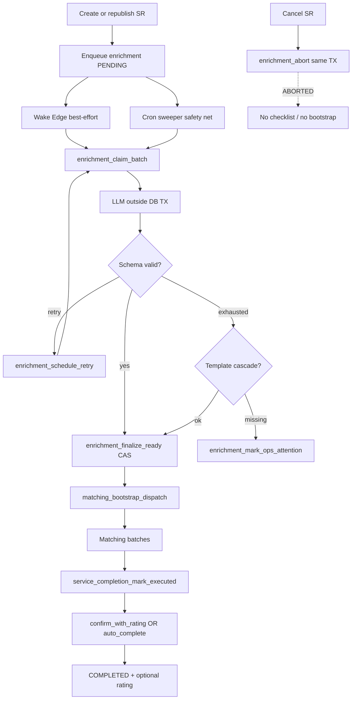

# Implementation Tasks — Service Completion & Publication Readiness

**Sources:** [`requirements.md`](./requirements.md) · [`design.md`](./design.md) · [`CONTEXT.md`](./CONTEXT.md) · [`cutover.md`](./cutover.md) · [`ADR-0001`](./adr/0001-separate-enrichment-fsm-for-publication-readiness.md) · [`ADR-0002`](./adr/0002-evidence-images-block-not-image-gallery.md) · [`ADR-0003`](./adr/0003-completion-criterion-block.md) · [`ADR-0004`](./adr/0004-completion-rpcs-outside-payments.md)  
**Scope:** Requirements 1–25 · **80 tasks** (1–80)  
**Migration policy:** Net-new timestamped files under `supabase/migrations/` only — SHALL NOT edit shipped migrations.  
**Precedence:** CONTEXT + ADR-0001…0004 > design.md > requirements.md. Where requirements still name `payment_mark_service_executed` / `payment_confirm_service_completed` / `payment_cron_auto_complete_*` as product APIs, **ADR-0004 + design §1 win**: implement `service_completion_*` and DROP/REVOKE those `payment_*` product writers.
**Cutover note:** DB reset (CONTEXT decision 22). SHALL NOT grandfather/backfill legacy OPEN service requests without enrichment. Explicit tasks MUST DROP `trg_service_request_dispatch_bootstrap` and DROP/REVOKE `payment_mark_service_executed`, `payment_confirm_service_completed`, and `payment_cron_auto_complete_*` product writers after `service_completion_*` cutover.

---

## Execution Strategy

### Implementation approach

Implementation SHALL follow a **database-first, dark-deploy, client-cutover** sequence aligned with design §13.2 migration order. PostgreSQL owns enrichment FSM, leases, checklist schemas, evidence draft/freeze, EXECUTED/COMPLETED writers, matching bootstrap handoff, and audit events. Edge Functions SHALL remain thin I/O connectors (LLM HTTP, Storage admin deletes, wake handlers). App feature `src/features/service-completion/` SHALL own enrichment UX, checklist fill, confirm+rating, and dispute stub; `view-services` consumes Public API only. Payments retains NetCred/settlement only ([ADR-0004](./adr/0004-completion-rpcs-outside-payments.md)).

### Flowchart (enrichment → matching → completion)

### Execution order

| Wave | Phase | Unblocks |
|------|-------|----------|
| F1 | Foundation constants + enums | All runtime reads of checklist/enrichment keys |
| F2 | Persistence tables + RLS deny-by-default | Enrichment/evidence storage |
| F3 | Matching bootstrap extract + DROP OPEN trigger + enqueue helpers | Create/republish without premature dispatch |
| F4 | Enrichment transactional RPCs | Claim → finalize CAS → READY+bootstrap |
| F5 | Edge worker + wake + cron sweeper | End-to-end AI/fallback enrichment |
| F6 | `service_completion_*` writers + DROP `payment_*` + MMD | EXECUTED / confirm+rating / auto-complete |
| F7 | Dynamic Form `completion_criterion` + read model | Schema render + list/detail projections |
| F8 | App feature + view-services cutover | User-visible flows |
| F9–F12 | Observability, recovery, security, performance | Production hardening |
| F13 | Verification suites | Ship confidence |
| F14 | Rollout + docs sync | Cutover (DB reset; no OPEN backfill) |

### Architectural dependencies

- **Transactional coupling:** SR create + enrichment `PENDING` enqueue (same TX); cancel + enrichment `ABORTED` (same TX); finalize READY + matching bootstrap (same TX CAS); mark EXECUTED freeze + CS status + MMD intent (same TX); confirm+rating COMPLETED + `service_ratings` (same TX).
- **Async boundary:** LLM HTTP MUST NOT hold a DB write TX; wake via `orbit_invoke_edge_function` is best-effort; cron sweeper is the safety net.
- **Matching handoff:** `matching_bootstrap_dispatch_for_service_request` is matching-owned; enrichment finalize calls it; OPEN-insert trigger MUST be DROPped before create/republish ship without bootstrap.
- **Completion ownership:** Self-serve EXECUTED / manual COMPLETED+rating / system auto-complete are `service_completion_*` only — never parallel product writers under `payment_*`.

### Rollout strategy

1. **Dark schema (Phases 1–2):** Deploy tables/enums/constants/RLS; no client change; existing OPEN bootstrap still live until Phase 3 DROP.
2. **Bootstrap cutover (Phase 3):** Extract matching bootstrap RPC → DROP OPEN trigger → wire enqueue on create+republish → abort on cancel. **Requires DB reset** (CONTEXT decision 22) — no legacy OPEN grandfather/backfill.
3. **Enrichment pipeline (Phases 4–5):** RPCs + Edge + cron; seed templates **before** production traffic.
4. **Completion writers (Phase 6):** Ship `service_completion_*`; migrate app callers; DROP/REVOKE `payment_*` completion APIs; seed MMD `SERVICE_AUTO_COMPLETED`.
5. **Read model + DF (Phase 7):** `completion_criterion` + context RPC + list fields.
6. **Client cutover (Phase 8):** Feature module; view-services stops re-exporting payments lifecycle writers.
7. **Hardening + verify (Phases 9–13):** Observability, janitor, security, perf, test suites.
8. **Docs (Phase 14):** Matching bootstrap wording, payment Req 32 refs, `docs/business/`.

### Validation strategy

- **Deno:** Edge claim→LLM→finalize/retry/fallback; schema validation; lease timeout margin.
- **pgTAP (orphan):** SQL janitor deletes Storage orphans (KYC pattern); cron wrapper + grants.
- **Vitest:** Feature hooks/API contracts; enrichment “em processamento”; dispute stub analytics; view-services Public API consumption.
- **Failure injection:** Lease reclaim + stale finalize reject; wake failure → cron recovery; missing template → CRITICAL hold.

### Risk isolation

- Schema/RPC dark-deploy before client cutover.
- Template global seed REQUIRED before enabling fallback traffic.
- Claim batch capped at `enrichment_claim_batch_size` (20) — bounds LLM blast radius.
- `ops_attention_at` prevents infinite retry when cascade fails.
- Completion cutover reversible until `payment_*` DROP; after DROP, only `service_completion_*` writers remain.

### Recovery & rollback

- **Lease crash:** TTL 120s; sweeper reclaim; stale generation finalize rejected.
- **READY without dispatch:** `enrichment_repair_ready_without_dispatch` idempotent bootstrap.
- **Wake failure:** Next cron tick claims due PENDING.
- **Missing templates:** Non-READY hold + CRITICAL; ops seed + clear ops_attention.
- **Rollback after OPEN trigger DROP:** Restore trigger from git **only** in emergency pre-cutover; post-reset environments MUST keep READY-handoff semantics.
- **Rollback completion writers:** Re-deploy prior app build ONLY if `payment_*` not yet dropped; after DROP, rollback requires reintroducing `service_completion_*` or restoring revoked functions from migration inverse (prefer forward-fix).

### Critical path tasks

| Category | Tasks |
|----------|-------|
| Observability | 54–56, 66–71 |
| Security | 10, 60–62 |
| Unblock enrichment → matching | 11–16, 17–25, 26–28 |
| Unblock EXECUTED/COMPLETED | 30–43, 44–46 |
| Client cutover | 47–53 |
| Cutover / docs | 74–80 |

---

## Traceability: Requirement → Tasks

| Req | Task #s |
|-----|---------|
| 1 | 3, 4, 12, 13, 14, 16, 44, 45, 47, 48, 66 |
| 2 | 11, 12, 13, 14, 15, 20, 24, 28, 66, 67, 75 |
| 3 | 17, 18, 19, 20, 26, 27, 28, 29, 72 |
| 4 | 1, 19, 25, 26, 44, 72 |
| 5 | 5, 20, 21, 22, 25, 26, 56, 71 |
| 6 | 1, 3, 17, 18, 23, 28, 29, 63, 64 |
| 7 | 15, 16, 20, 48, 67 |
| 8 | 9, 10, 45, 46, 60, 61 |
| 9 | 6, 31, 49, 60 |
| 10 | 34, 35, 41, 50, 69, 70 |
| 11 | 30, 35, 46, 50, 51, 69 |
| 12 | 6, 35, 50, 62 |
| 13 | 35, 44, 50, 51, 69 |
| 14 | 36, 39, 51, 62, 70 |
| 15 | 37, 38, 42, 43, 70 |
| 16 | 39, 51, 52 |
| 17 | 52, 76 |
| 18 | 20, 24, 35, 36, 37, 62 |
| 19 | 17, 23, 31, 35, 37, 63 |
| 20 | 1, 26–29, 33, 34, 57–59, 64 |
| 21 | 4, 16, 54–56, 66–71 |
| 22 | 7, 8, 23, 24, 28, 57–59, 71 |
| 23 | 11, 45, 46, 60, 75 |
| 24 | 35, 36, 37, 42, 43 |
| 25 | 3, 15, 20, 35, 36, 37, 66, 70 |

---

## Phase 1: Database Foundation

### 1. [x] Seed `platform_constants` for checklist / enrichment / orphan / auto-complete

Description:
Ship migration introducing/upserting service-completion operational constants per CONTEXT decision 23 and design §3.1. Keys MUST be readable via existing `platform_constant_int` (or numeric helper if required). Defaults: criterion 3–12, evidence 1–5, AI max attempts 3, lease TTL 120s, claim batch 20, retry base 30s, orphan TTL 24h; reuse existing `auto_complete_grace_hours = 24`. Dispute support URL MUST NOT be seeded here (env/remote config only).

Responsibilities:
- Upsert all checklist/enrichment/orphan keys idempotently.
- Document key names matching design §3.1 exactly.
- Preserve existing `auto_complete_grace_hours` if already present.

Implementation Details:
- Use `INSERT … ON CONFLICT (key) DO UPDATE` — no destructive wipe of unrelated constants.
- SHALL NOT hardcode these bounds in RPC bodies without reading constants (except documented matching-style exceptions — none for these keys).
- Dispute stub uses `VITE_SERVICE_COMPLETION_DISPUTE_SUPPORT_URL` / `orbit.dispute_support_url` — out of this migration.

Deliverables:
- `supabase/migrations/*_service_completion_platform_constants.sql`
- pgTAP: missing key returns documented default when helper supports defaults
- Regenerate `database.types.ts` if constants surface in types

Dependencies:
- Existing `platform_constants` table

Runtime Guarantees:
- Idempotent seed; stable reads at RPC invocation

Failure Handling:
- Migration failure blocks all downstream completion migrations

Observability:
- Deploy migration log only

Security Considerations:
- Authenticated MAY read via existing constant helpers if already granted; workers use service_role

Performance Considerations:
- Constants are O(1) lookups; cacheable per connection

Requirements covered:
1, 4, 5, 6, 11, 15, 20, 22

Acceptance Criteria covered:
4.2, 5.1, 6.2, 6.4, 6.7, 11.1, 15.1, 20.2, 22.4

---
### 2. [x] Create enums: `enrichment_status`, `checklist_source`, `completion_evidence_phase`, `completion_upload_session_status`

Description:
Ship migration defining PostgreSQL enums required by enrichment and evidence persistence (design §3). Values MUST match design exactly: enrichment `PENDING|RUNNING|READY|ABORTED`; source `ai|fallback_template`; evidence phase `draft|frozen`; upload session `open|committed|expired|aborted`.

Responsibilities:
- CREATE TYPE for each enum in `public`.
- Ensure values are stable for RLS/RPC predicates.

Implementation Details:
- No ALTER of existing CS status enums — reuse contracted_services lifecycle.
- Enum labels MUST be uppercase for enrichment_status per design SQL.

Deliverables:
- `supabase/migrations/*_service_completion_enums.sql`
- Type regeneration

Dependencies:
- Task 1 (soft — may parallel)

Runtime Guarantees:
- Enum casts fail closed on invalid values

Failure Handling:
- Migration rollback only via inverse migration if needed pre-prod

Observability:
- N/A

Security Considerations:
- No client write of enum columns except via SECURITY DEFINER RPCs

Performance Considerations:
- N/A

Requirements covered:
1, 9, 12, 25

Acceptance Criteria covered:
1.1, 9.1, 12.1, 25.1

---
## Phase 2: Persistence Layer

### 3. [x] Create `service_request_enrichments` with CHECKs, lease columns, ops_attention, indexes

Description:
Create 1:1 enrichment FSM table per design §3.2: UNIQUE(`service_request_id`), lease_owner/generation/locked_until, checklist_schema jsonb, source, materialized_at, ops_attention_at/reason, attempt_count, next_attempt_at, CHECKs for READY-requires-schema, ABORTED-no-schema, RUNNING-has-lease. Add partial indexes for claim due, lease expired, READY repair.

Responsibilities:
- Materialize publication readiness SoT separate from `service_requests.status` ([ADR-0001](./adr/0001-separate-enrichment-fsm-for-publication-readiness.md)).
- Enforce lease and READY integrity via CHECKs.
- Support ops hold without infinite retry (`ops_attention_*`).

Implementation Details:
- FK to `service_requests` ON DELETE CASCADE.
- Partial indexes: `idx_enrichments_claim_due`, `idx_enrichments_lease_expired`, `idx_enrichments_ready` exactly as design.
- Claim path MUST later skip rows where `ops_attention_at IS NOT NULL`.

Deliverables:
- Migration DDL + indexes + COMMENT ON TABLE
- pgTAP: UNIQUE prevents duplicate FSM; READY without schema rejected

Dependencies:
- Task 2

Runtime Guarantees:
- Exactly one enrichment row per SR; READY implies schema+source+materialized_at

Failure Handling:
- Invalid READY insert fails CHECK — fail closed on publication

Observability:
- Table comment documents matching MUST NOT bootstrap until READY

Security Considerations:
- No authenticated write policies (Task 10); mutations via DEFINER RPCs

Performance Considerations:
- Claim indexes support SKIP LOCKED polling at scale

Requirements covered:
1, 5, 6, 25

Acceptance Criteria covered:
1.1, 1.2, 1.5, 1.6, 5.4, 6.1, 6.2, 25.1

---
### 4. [x] Create append-only `service_request_enrichment_events`

Description:
Create enrichment event audit table per design §3.3: from_status/to_status, actor, event_type, lease_generation, correlation_id, payload jsonb. Indexes on (enrichment_id, created_at) and (service_request_id, created_at). Authenticated MUST NOT UPDATE/DELETE.

Responsibilities:
- Persist transition audit for cancel vs READY forensics.
- Support correlation and error payloads.

Implementation Details:
- Inserts only via RPC helper (Task 16).
- No UPDATE/DELETE grants to authenticated.

Deliverables:
- Migration DDL + indexes
- pgTAP: insert-only posture smoke (after RLS)

Dependencies:
- Task 3

Runtime Guarantees:
- Append-only history reconstructs race winners (Req 21 AC6)

Failure Handling:
- Missing event on transition is a defect — RPCs MUST append

Observability:
- Events queryable by SR for ops

Security Considerations:
- Deny client mutation

Performance Considerations:
- Indexed by enrichment_id for timeline reads

Requirements covered:
1, 7, 21

Acceptance Criteria covered:
1.8, 7.6, 21.1, 21.6

---
### 5. [x] Create `completion_checklist_templates` + seed cascade (service → category → global)

Description:
Create template catalog with XOR scope CHECK (exactly one of platform_service_id / category_id / is_global), unique active indexes per scope, and seed at least one active global template (3 valid `completion_criterion` + optional `static_text` per design §3.4). Prefer additional per-service/category seeds when catalog known. Templates MUST pass allowlist/cardinality before use.

Responsibilities:
- Provide deterministic fallback catalog (decision 19).
- Guarantee global template exists before prod traffic.
- Enforce one active template per scope via unique partial indexes.

Implementation Details:
- Seed JSON MUST use only `completion_criterion` and `static_text`.
- Invalid templates MUST fail validation at materialize time (Task 19/25) — seed valid schemas only.
- Cutover checklist (Task 74) REQUIRES global seed before traffic.

Deliverables:
- Migration DDL + seed SQL
- pgTAP: cascade uniqueness; global active exists

Dependencies:
- Tasks 1–2

Runtime Guarantees:
- Cascade resolution always finds global if seeded; missing all levels → ops_attention

Failure Handling:
- Bad seed discovered at validation — MUST NOT READY

Observability:
- Ops can add templates without code deploy

Security Considerations:
- Templates not writable by authenticated clients

Performance Considerations:
- Lookup by service/category/global is indexed

Requirements covered:
4, 5, 22

Acceptance Criteria covered:
4.7, 5.1, 5.4, 5.5, 22.6

---
### 6. [x] Create `contracted_service_completion_evidence` (draft|frozen, version, executed_late, responses_hash)

Description:
Create 1:1 evidence table per design §3.5: phase draft|frozen, responses jsonb, draft_version, executed_late (null on draft), responses_hash + frozen_at required when frozen, optional idempotency_key UNIQUE, enrichment_id/schema hash optional bind. CHECKs enforce frozen integrity and draft_no_late.

Responsibilities:
- Single-table draft→freeze model (decision 30).
- Store tamper hash at freeze.
- Support EXECUTED idempotency key.

Implementation Details:
- UNIQUE(`contracted_service_id`).
- `responses_hash = sha256(canonical_json(responses))` computed in mark-executed (Task 35).
- Optionally mirror `executed_late` on CS only inside mark-executed same TX if list needs denorm — prefer evidence table as SoT.

Deliverables:
- Migration DDL + indexes
- pgTAP: frozen CHECK rejects incomplete freeze

Dependencies:
- Tasks 2–3

Runtime Guarantees:
- Freeze atomic with EXECUTED in later RPC; draft mutable only while CONFIRMED

Failure Handling:
- Partial freeze impossible via CHECK

Observability:
- Idempotency index supports replay

Security Considerations:
- Client denied draft SELECT via RLS (Task 10)

Performance Considerations:
- 1:1 UK prevents duplicate packages

Requirements covered:
9, 10, 11, 12

Acceptance Criteria covered:
9.1, 10.2, 11.3, 11.4, 12.1, 12.6

---
### 7. [x] Create `completion_evidence_upload_sessions`

Description:
Create upload session table per design §3.6: contracted_service_id, provider_id, criterion_block_id, status, storage_bucket, storage_prefix, max_files, expires_at, idempotency_key UNIQUE. Partial index for orphan sweep on open sessions by expires_at. Dedicated completion evidence bucket — MUST NOT reuse request-quote/chat buckets.

Responsibilities:
- KYC/chat-pattern session lifecycle for criterion photos.
- Bind sessions to DF block ids.

Implementation Details:
- Default max_files from evidence max constant (5).
- Status enum from Task 2.

Deliverables:
- Migration DDL + `idx_upload_sessions_orphan`
- Storage bucket provisioning note for Task 79

Dependencies:
- Tasks 2, 6

Runtime Guarantees:
- Idempotent session create via UNIQUE idempotency_key

Failure Handling:
- Expired open sessions become janitor candidates

Observability:
- Session ids correlate uploads to criteria

Security Considerations:
- Provider owns sessions; RLS Task 10

Performance Considerations:
- Prefix isolation per CS/session

Requirements covered:
9, 20, 22

Acceptance Criteria covered:
9.6, 9.8, 20.7, 22.4

---
### 8. [x] Create `completion_evidence_upload_objects`

Description:
Create object registry table: session_id FK, storage_path UNIQUE, checksum, byte_size, referenced_in_responses flag. Partial index on unreferenced objects for janitor. Paths registered after signed upload; frozen packages set referenced flags.

Responsibilities:
- Track uploaded objects for orphan cleanup.
- Prevent duplicate path registration.

Implementation Details:
- UNIQUE(storage_path).
- Janitor deletes only `referenced_in_responses = false` older than TTL and not in frozen packages.

Deliverables:
- Migration DDL + `idx_upload_objects_unref`

Dependencies:
- Task 7

Runtime Guarantees:
- Idempotent register by path UNIQUE

Failure Handling:
- Janitor MUST NOT delete frozen refs (Task 57–59)

Observability:
- Checksum available for audit

Security Considerations:
- Paths not guessable — UUID prefixes

Performance Considerations:
- Index supports TTL scans

Requirements covered:
9, 18, 22

Acceptance Criteria covered:
9.6, 18.8, 22.4, 22.5

---
### 9. [x] Enable RLS deny-by-default on all new completion/enrichment tables

Description:
ENABLE ROW LEVEL SECURITY on enrichments, enrichment_events, templates, evidence, upload_sessions, upload_objects. Ship initial SELECT policies per design §11.2.1 sketches: owning client enrichment SELECT; provider evidence SELECT; client frozen-only evidence SELECT; provider upload session ownership. NO authenticated INSERT/UPDATE/DELETE on FSM/freeze columns — mutations via SECURITY DEFINER RPCs only.

Responsibilities:
- Fail closed on direct table access.
- Separate schema visibility vs response visibility baseline.

Implementation Details:
- Prefer DEFINER read RPCs for provider schema access later (Task 45) if feed visibility logic is complex.
- Templates: no broad authenticated SELECT unless product requires — workers use service_role.

Deliverables:
- Migration: ENABLE RLS + policies + REVOKE direct writes
- pgTAP stubs deferred to Task 60 for full deny matrix

Dependencies:
- Tasks 3–8

Runtime Guarantees:
- Unauthenticated/unauthorized reads fail closed

Failure Handling:
- Policy bugs surface as empty/denied — not data leaks

Observability:
- Policy names documented for ops

Security Considerations:
- Exposure control Req 8

Performance Considerations:
- Policies use `(SELECT auth.uid())` pattern for initplan efficiency

Requirements covered:
8, 11, 23

Acceptance Criteria covered:
8.4, 8.5, 8.7, 11.2, 23.5, 23.6

---
### 10. [x] Storage bucket + GRANT posture scaffolding for completion evidence

Description:
Provision dedicated Supabase Storage bucket/prefix for completion evidence; document signed-upload policies (provider write to own prefix; no silent overwrite of frozen paths). Scaffold GRANT REVOKE matrix comments for upcoming worker vs authenticated RPCs (full GRANT application lands with each RPC task; this task documents + creates bucket).

Responsibilities:
- Isolate evidence media from request-quote/chat.
- Establish immutability/unique path conventions.

Implementation Details:
- Bucket name recorded in upload session `storage_bucket`.
- Frozen paths MUST use unique keys; overwrite prevented.

Deliverables:
- Bucket config / migration notes
- `docs` or migration COMMENT referencing design §11.4

Dependencies:
- Tasks 7–9

Runtime Guarantees:
- Uploads cannot land in wrong bucket

Failure Handling:
- Misconfigured policy → fail upload, not silent cross-tenant write

Observability:
- Bucket metrics for orphan volume

Security Considerations:
- Path prefixes include cs_id/session_id

Performance Considerations:
- Direct signed uploads bypass Edge body (Req 20 AC7)

Requirements covered:
8, 12, 20, 22

Acceptance Criteria covered:
12.2, 20.7, 22.5

---
## Phase 3: Matching Bootstrap Handoff

### 11. [x] Extract `matching_bootstrap_dispatch_for_service_request` from OPEN trigger body

Description:
Create matching-owned idempotent RPC that INSERTs `service_request_dispatches` with `DISPATCH_PENDING` and `next_batch_at = now() + matching.dispatch_start_delay_minutes`, `ON CONFLICT (service_request_id) DO NOTHING` — MUST NOT reset `next_batch_at` on conflict. Extract logic from current OPEN-insert trigger body without changing delay semantics.

Responsibilities:
- Centralize bootstrap for READY handoff and sweeper repair.
- Preserve uniqueness/idempotency of today’s trigger.

Implementation Details:
- SECURITY DEFINER; GRANT to service_role (and callers that need it).
- 5-minute delay clock starts at bootstrap, not SR create.

Deliverables:
- Migration: CREATE FUNCTION `matching_bootstrap_dispatch_for_service_request`
- pgTAP: conflict does not reset next_batch_at (Task 67)

Dependencies:
- Existing matching dispatch schema

Runtime Guarantees:
- Exactly-once dispatch row per SR under retries

Failure Handling:
- ON CONFLICT DO NOTHING — safe redelivery

Observability:
- Callable from enrichment finalize

Security Considerations:
- Not callable by arbitrary authenticated clients

Performance Considerations:
- Single-row insert; no batch fan-out

Requirements covered:
2, 23

Acceptance Criteria covered:
2.2, 2.3, 2.4, 23.1, 23.2

---
### 12. [x] DROP `trg_service_request_dispatch_bootstrap` / trigger function

Description:
DROP TRIGGER `trg_service_request_dispatch_bootstrap` on `service_requests` and associated trigger function(s) that bootstrap dispatch on first OPEN insert (design §3.7). After this migration, OPEN insert alone MUST NOT create dispatch rows. Cutover assumes DB reset — no grandfather of legacy OPEN SRs without enrichment (decision 22).

Responsibilities:
- Remove legacy publication path.
- Force READY-handoff as sole bootstrap entry.

Implementation Details:
- DROP TRIGGER IF EXISTS …; DROP FUNCTION IF EXISTS trg_fn_* as named in repo.
- Update COMMENT / matching docs in Task 75.
- MUST land before or atomically with create/republish enqueue wiring to avoid orphan OPEN without enrichment AND without dispatch.

Deliverables:
- Migration DROP
- pgTAP: OPEN insert creates zero dispatch rows (Task 67)

Dependencies:
- Task 11 (bootstrap RPC must exist before DROP in same or prior migration wave)

Runtime Guarantees:
- No dispatch from OPEN alone

Failure Handling:
- Emergency rollback only pre-prod via restoring trigger from git

Observability:
- Deploy note: breaking change — requires reset

Security Considerations:
- N/A

Performance Considerations:
- N/A

Requirements covered:
2, 23

Acceptance Criteria covered:
2.1, 2.5, 2.8, 23.1, 23.7

---
### 13. [x] Implement `service_request_enqueue_enrichment` helper

Description:
Create shared helper that INSERTs `service_request_enrichments` PENDING with attempt_count=0, next_attempt_at NULL, correlation_id, `ON CONFLICT (service_request_id) DO NOTHING`. Schedules/records wake intent for `generate-completion-checklist` after commit (deferred net / AFTER pattern). Create and republish MUST call this helper only — no divergent inline inserts.

Responsibilities:
- Exactly-once enrichment row under create retries.
- Share enqueue between create and republish.
- Wake without blocking client on LLM.

Implementation Details:
- Same TX as SR insert for the INSERT portion.
- Wake failure MUST NOT fail create once SR+enrichment committed.

Deliverables:
- Migration: `service_request_enqueue_enrichment(uuid)`
- Unit/pgTAP: conflict DO NOTHING

Dependencies:
- Tasks 3, 12

Runtime Guarantees:
- UNIQUE prevents duplicate FSM; wake best-effort

Failure Handling:
- Wake fail → cron safety net (Task 28)

Observability:
- Correlation_id on row for tracing

Security Considerations:
- DEFINER; called from trusted create paths

Performance Considerations:
- O(1) insert

Requirements covered:
1, 2, 3

Acceptance Criteria covered:
1.1, 1.5, 2.9, 3.7

---
### 14. [x] Wire create-request-quote-order path to enqueue enrichment

Description:
Patch Edge/RPC create-request-quote-order (or successor) so after successful `service_requests` INSERT it calls `service_request_enqueue_enrichment` in the same TX. MUST NOT call matching bootstrap. Client success returns with enrichment processing UX expected. MUST NOT block on LLM.

Responsibilities:
- Ensure every new SR gets PENDING enrichment.
- Keep create latency free of LLM wall-clock.

Implementation Details:
- Verify no residual OPEN bootstrap dependency.
- Pass correlation_id from request id / idempotency.

Deliverables:
- Edge/SQL patch
- Deno or integration test: create → enrichment row PENDING, zero dispatch

Dependencies:
- Tasks 12–13

Runtime Guarantees:
- Atomic SR+enrichment; async enrichment thereafter

Failure Handling:
- Enqueue conflict safe under retry

Observability:
- Logs include service_request_id + enrichment pending

Security Considerations:
- Auth unchanged on create

Performance Considerations:
- No extra round-trips beyond enqueue

Requirements covered:
1, 2, 3

Acceptance Criteria covered:
1.1, 1.3, 2.1, 3.7

---
### 15. [x] Wire `republish_cancelled_service_request` to enqueue enrichment

Description:
Update republish RPC: after inserting new OPEN SR, call `service_request_enqueue_enrichment` for the **new** id. MUST NOT bootstrap matching; MUST NOT copy enrichment/checklist/evidence from cancelled source. Update COMMENT ON FUNCTION per design §4.11.

Responsibilities:
- Close gap where DROP OPEN trigger would leave republished SRs without enrichment or dispatch.
- Fresh enrichment FSM per republish.

Implementation Details:
- Reuse same helper as create.
- Wake failure must not fail republish response.

Deliverables:
- Migration patch to `republish_cancelled_service_request`
- pgTAP: republish → PENDING enrichment, no dispatch, no copied schema (Task 67)

Dependencies:
- Tasks 12–13

Runtime Guarantees:
- New SR always starts PENDING enrichment

Failure Handling:
- Idempotent republish contracts preserved

Observability:
- COMMENT documents new semantics

Security Considerations:
- Caller auth unchanged

Performance Considerations:
- Single extra insert

Requirements covered:
2

Acceptance Criteria covered:
2.9

---
### 16. [x] Implement `enrichment_abort_for_service_request` + wire cancel same TX

Description:
Implement abort RPC/helper that sets enrichment `ABORTED`, clears next_attempt_at and lease fields when status ∈ {PENDING,RUNNING}, appends ABORTED event with cancel correlation. Wire into `cancel_service_request` (or equivalent) **same TX**. If already READY, leave enrichment READY and follow published-request cancel (matching dispatch cancel) — outside abort scope.

Responsibilities:
- Prevent materialize/bootstrap after cancel.
- Audit abort with actor/correlation.

Implementation Details:
- Workers MUST NO-OP finalize when aborted/cancelled (enforced in Task 20).
- Also implement `enrichment_append_event` internal helper used by claim/finalize/abort.

Deliverables:
- Migration: `enrichment_abort_for_service_request`, `enrichment_append_event`
- Cancel path patch
- pgTAP cancel race (Task 68)

Dependencies:
- Tasks 3–4, 14

Runtime Guarantees:
- ABORTED ⇒ no schema, no bootstrap

Failure Handling:
- Race with finalize serialized on row lock

Observability:
- Event timeline explains winner

Security Considerations:
- Only cancel path / DEFINER

Performance Considerations:
- Single-row update

Requirements covered:
1, 7, 25

Acceptance Criteria covered:
1.6, 1.8, 7.1, 7.2, 7.3, 7.6, 25.1, 25.4

---
## Phase 4: Enrichment Transactional RPCs

### 17. [x] Implement `enrichment_claim_batch` (SKIP LOCKED, skip ops_attention)

Description:
Implement service_role RPC claiming due PENDING enrichments: `ops_attention_at IS NULL`, next_attempt_at null or due, `FOR UPDATE SKIP LOCKED`, LIMIT from `enrichment_claim_batch_size`. Set RUNNING, lease_owner, locked_until=now()+TTL, lease_generation++, append CLAIMED event. Commit before any LLM.

Responsibilities:
- Atomic ownership for workers.
- Skip ops-attention holds.
- Bound batch size.

Implementation Details:
- Read TTL/batch from platform_constants.
- Return claimed rows for Edge worker.
- GRANT EXECUTE TO service_role only.

Deliverables:
- Migration RPC + grants
- Concurrency pgTAP: two claimers get disjoint sets

Dependencies:
- Tasks 1, 3, 16

Runtime Guarantees:
- At most one owner per row; generation monotonic

Failure Handling:
- Skip locked — no wait chains

Observability:
- Claim latency metric later

Security Considerations:
- service_role only

Performance Considerations:
- Partial claim index; batch ≤20 default

Requirements covered:
3, 6, 19, 20

Acceptance Criteria covered:
3.1, 6.1, 6.7, 19.1, 20.2

---
### 18. [x] Implement `enrichment_schedule_retry`

Description:
Implement RPC to release lease, set status PENDING, increment attempt_count, set next_attempt_at with exponential backoff + jitter from `enrichment_retry_base_seconds * 2^attempt`, persist last_error_*, append RETRY event. Used for invalid schema and transient LLM failures while attempts remain.

Responsibilities:
- Retryable re-queue without READY.
- Record failure reason.

Implementation Details:
- Backoff formula per design §6.4.
- MUST NOT materialize partial schema.
- If attempt_count would exceed max, caller uses fallback/ops path instead.

Deliverables:
- Migration RPC
- pgTAP: next_attempt_at in expected window

Dependencies:
- Tasks 1, 17

Runtime Guarantees:
- Lease cleared; row claimable after next_attempt_at

Failure Handling:
- Invalid calls on non-RUNNING rejected

Observability:
- Error codes in events/logs

Security Considerations:
- service_role only

Performance Considerations:
- O(1) update

Requirements covered:
3, 6

Acceptance Criteria covered:
3.4, 3.5, 6.4

---
### 19. [x] Implement `enrichment_validate_checklist_schema`

Description:
Implement SQL helper `enrichment_validate_checklist_schema(jsonb) RETURNS boolean` enforcing allowlist `{completion_criterion, static_text}`, cardinality from platform_constants (3–12 criteria; static_text excluded), required structure (label, met slot, evidence config, justification slot, `requires_evidence_when_met`). Return false on malformed JSON — no exception required if callers handle boolean.

Responsibilities:
- Defense-in-depth validation at finalize.
- Reject intake yes_no/image_gallery/top-level evidence_images ([ADR-0003](./adr/0003-completion-criterion-block.md)).

Implementation Details:
- Read min/max from constants.
- Mirror rules in Edge pre-check (Task 26) but SQL is authoritative at finalize.

Deliverables:
- Migration function
- pgTAP: allowlist/cardinality matrix

Dependencies:
- Task 1

Runtime Guarantees:
- Invalid schemas never persist via finalize

Failure Handling:
- False return triggers retry/fallback orchestration

Observability:
- Validation failures tagged in Sentry by Edge

Security Considerations:
- N/A — pure function

Performance Considerations:
- CPU-bound JSON walk — schemas small (≤12 criteria)

Requirements covered:
4, 5

Acceptance Criteria covered:
4.1, 4.2, 4.3, 4.4, 4.5, 5.5

---
### 20. [x] Implement `enrichment_finalize_ready` (CAS lease_owner+generation, READY+schema+bootstrap same TX)

Description:
Implement CAS finalize per design §5.3: validate schema; lock enrichment; if SR cancelled → ABORT path; else UPDATE WHERE RUNNING AND lease_owner AND lease_generation AND checklist_schema IS NULL → set READY+schema+source+materialized_at, clear lease, append READY/FALLBACK_APPLIED event, call `matching_bootstrap_dispatch_for_service_request` same TX. Stale/idempotent READY handling per design SQL shape.

Responsibilities:
- Exactly-once materialize under lease CAS.
- Atomic READY + matching bootstrap.
- Reject stale workers after reclaim.

Implementation Details:
- Clear ops_attention flags on successful READY.
- Late AI after READY discarded via CAS/schema NULL predicate.
- PENDING→READY fallback shortcut MAY be supported only if still lease-safe — prefer RUNNING→READY after claim.

Deliverables:
- Migration RPC
- pgTAP: stale generation rejected; READY+dispatch atomic; cancel wins (Task 66–68)

Dependencies:
- Tasks 11, 16–19

Runtime Guarantees:
- Schema immutable after READY; bootstrap ON CONFLICT safe

Failure Handling:
- CAS fail → structured no-op; no partial schema

Observability:
- Events + correlation_id

Security Considerations:
- service_role only

Performance Considerations:
- Short TX — no LLM inside

Requirements covered:
2, 3, 5, 6, 7, 18, 25

Acceptance Criteria covered:
2.2, 2.3, 2.6, 3.2, 3.3, 3.8, 5.7, 5.8, 6.2, 6.3, 6.6, 7.2, 18.6, 25.1

---
### 21. [x] Implement `enrichment_mark_ops_attention`

Description:
Implement RPC setting ops_attention_at/reason, status remains PENDING, next_attempt_at NULL, clear lease, append event. Used when template cascade fails after max AI attempts. Claim MUST skip these rows. Emit path for CRITICAL metric/alert (Task 56).

Responsibilities:
- Fail closed without empty publish or auto-cancel.
- Stop infinite retries.

Implementation Details:
- Reason codes: TEMPLATE_CASCADE_MISSING, TEMPLATE_INVALID, etc.
- GRANT service_role only.

Deliverables:
- Migration RPC
- pgTAP: claim skips ops_attention rows (Task 71)

Dependencies:
- Tasks 3, 17

Runtime Guarantees:
- Non-READY hold until ops clears

Failure Handling:
- Does not bootstrap matching

Observability:
- CRITICAL alert hook

Security Considerations:
- service_role / ops role

Performance Considerations:
- O(1)

Requirements covered:
5, 22

Acceptance Criteria covered:
5.4, 5.5, 22.6

---
### 22. [x] Implement `enrichment_clear_ops_attention`

Description:
Implement RPC clearing ops_attention_* and optionally re-arming next_attempt_at for retry/fallback after ops seeds templates. MAY grant to restricted ops role in addition to service_role.

Responsibilities:
- Ops recovery path without redeploy.
- Re-enable claim eligibility.

Implementation Details:
- MUST NOT READY by itself — worker/finalize performs materialize.
- Audit event on clear.

Deliverables:
- Migration RPC + optional ops GRANT

Dependencies:
- Task 21

Runtime Guarantees:
- Row becomes claimable when next_attempt_at due/null

Failure Handling:
- Clear on non-ops_attention is no-op

Observability:
- Ops action logged

Security Considerations:
- Restricted execute grants

Performance Considerations:
- O(1)

Requirements covered:
5, 22

Acceptance Criteria covered:
5.4, 22.6

---
### 23. [x] Implement `enrichment_reclaim_expired_leases`

Description:
Implement sweeper RPC: RUNNING rows with locked_until < now() → return to PENDING (or re-claimable), increment lease_generation, clear owner, append RECLAIM event. Stale finalize with old generation MUST fail (Task 20).

Responsibilities:
- Recover mid-LLM worker crashes.
- Preserve generation monotonicity.

Implementation Details:
- Batch limited by claim batch constant.
- Do not reclaim non-expired leases.

Deliverables:
- Migration RPC
- pgTAP: reclaim then stale finalize rejected

Dependencies:
- Tasks 17, 20

Runtime Guarantees:
- Ownership transfer safe; no duplicate READY

Failure Handling:
- Idempotent if already PENDING

Observability:
- Reclaim count metric

Security Considerations:
- service_role only

Performance Considerations:
- Uses lease expired partial index

Requirements covered:
6, 19, 22

Acceptance Criteria covered:
6.2, 6.3, 19.1, 22.1

---
### 24. [x] Implement `enrichment_repair_ready_without_dispatch`

Description:
Implement sweeper RPC selecting READY enrichments lacking dispatch row and calling `matching_bootstrap_dispatch_for_service_request`. MUST NOT regenerate schema. Idempotent under concurrent repair.

Responsibilities:
- Heal partial handoff after READY commit.
- Preserve schema immutability.

Implementation Details:
- Batch bounded.
- Join uses idx_enrichments_ready.

Deliverables:
- Migration RPC
- pgTAP: READY without dispatch gets bootstrap once (Task 67)

Dependencies:
- Tasks 11, 20

Runtime Guarantees:
- Exactly-once dispatch via UNIQUE

Failure Handling:
- No schema rewrite

Observability:
- Repair counts in job_runs via cron

Security Considerations:
- service_role only

Performance Considerations:
- Indexed join

Requirements covered:
2, 18, 22

Acceptance Criteria covered:
2.7, 18.6, 22.2

---
### 25. [x] Implement template cascade resolve helper

Description:
Implement SQL helper resolving active template: platform_service → category → global. Returns schema + scope metadata or NULL if missing/inactive. Caller validates via `enrichment_validate_checklist_schema` before finalize; invalid/missing → mark_ops_attention.

Responsibilities:
- Deterministic cascade (decision 19).
- Shared by Edge fallback path and any SQL fallback shortcut.

Implementation Details:
- Respect is_active and unique active indexes.
- Do not mutate templates.

Deliverables:
- Migration function `resolve_completion_checklist_template(p_platform_service_id, p_category_id)`
- pgTAP: order service > category > global

Dependencies:
- Tasks 5, 19

Runtime Guarantees:
- Stable resolution under concurrent reads

Failure Handling:
- NULL ⇒ ops_attention path

Observability:
- Log resolved scope in finalize payload

Security Considerations:
- service_role execute

Performance Considerations:
- Indexed lookups

Requirements covered:
5

Acceptance Criteria covered:
5.1, 5.4, 5.5

---
## Phase 5: Scheduling & Workers

### 26. [x] Edge Function `generate-completion-checklist`

Description:
Implement Deno Edge worker: auth via cron/internal secret (verify_jwt false + orbit pattern); claim batch → load SR form_data + smart description; truncate oversized context with log; LLM HTTP outside DB TX; validate allowlist/cardinality; finalize AI OR schedule retry OR cascade fallback finalize OR mark_ops_attention. MUST NO-OP on abort/stale generation. Distinct from `generate-smart-description` (pre-create sync).

Responsibilities:
- LLM I/O connector only — no FSM authority in memory.
- Orchestrate claim → finalize/retry/fallback.

Implementation Details:
- LLM timeout budget strictly < lease TTL with margin (~60–90s vs 120s).
- Pace concurrent LLM calls per invocation (Task 29).
- Sentry tags: transient vs validation vs fallback vs ops_attention.

Deliverables:
- `supabase/functions/generate-completion-checklist/`
- Deno tests (Task 72)

Dependencies:
- Tasks 17–25

Runtime Guarantees:
- At-least-once safe via CAS/idempotent READY

Failure Handling:
- Transient → retry; exhausted → fallback; missing template → ops_attention

Observability:
- Structured logs with SR/enrichment/attempt/generation/correlation

Security Considerations:
- Internal secret; no public JWT product surface

Performance Considerations:
- Batch ≤20; pace LLM

Requirements covered:
3, 4, 5, 6, 20, 21

Acceptance Criteria covered:
3.1–3.9, 4.6, 5.1–5.3, 6.5, 20.3–20.5, 21.1, 21.2

---
### 27. [x] Wire `orbit_invoke_edge_function` wake on enrichment enqueue

Description:
After PENDING enqueue commit (create/republish), invoke `orbit_invoke_edge_function('generate-completion-checklist', payload, timeout)` via deferred net/AFTER pattern. Wake failure MUST NOT fail client create/republish. Payload includes reason `enqueue_wake` + service_request_id.

Responsibilities:
- Low-latency processing after create.
- Keep cron as safety net.

Implementation Details:
- Reuse existing orbit invoke helper patterns from matching/payments.
- Do not await LLM in client request.

Deliverables:
- SQL/trigger/wrapper wiring
- Integration: enqueue triggers net call (or documented best-effort)

Dependencies:
- Tasks 13–14, 26

Runtime Guarantees:
- Best-effort wake; durability via PENDING row

Failure Handling:
- pg_net failure → cron (Task 28)

Observability:
- Wake payload correlation

Security Considerations:
- Internal only

Performance Considerations:
- Non-blocking for create path

Requirements covered:
3, 6, 20, 22

Acceptance Criteria covered:
3.7, 6.5, 20.1, 22.8

---
### 28. [x] Implement `enrichment_cron_sweep` + `job_runs`

Description:
Implement pg_cron wrapper that: (a) reclaim expired leases, (b) repair READY-without-dispatch, (c) wake Edge for due PENDING (ops_attention skipped), (d) record job_runs scanned/succeeded/failed/error samples. Schedule interval sized for PENDING age SLO.

Responsibilities:
- Safety net for retries, orphans leases, wake failures, bootstrap gaps.
- Mandatory job_runs telemetry.

Implementation Details:
- Invoke `enrichment_reclaim_expired_leases`, `enrichment_repair_ready_without_dispatch`, `orbit_invoke_edge_function`.
- Bound work per tick by batch constants.

Deliverables:
- Migration: cron function + schedule + job_runs integration

Dependencies:
- Tasks 23–24, 26–27

Runtime Guarantees:
- Idempotent per tick; at-least-once

Failure Handling:
- Per-step errors counted; tick continues where safe

Observability:
- job_runs dashboardable

Security Considerations:
- service_role cron context

Performance Considerations:
- Bounded runtime per tick

Requirements covered:
6, 20, 21, 22

Acceptance Criteria covered:
6.5, 6.7, 20.1, 20.2, 21.4, 22.1, 22.2, 22.8

---
### 29. [x] LLM rate limit / timeout / truncation patterns in enrichment worker

Description:
Hardening pass inside `generate-completion-checklist`: token-bucket or max concurrent LLM calls per invocation; explicit HTTP timeout < lease margin; truncation policy for oversized intake with structured log; classify errors transient vs validation. Document constants/env for pacing.

Responsibilities:
- Protect LLM quotas under backlog.
- Avoid lease overrun from hung HTTP.

Implementation Details:
- Excess jobs remain PENDING for next wake/cron.
- Repeated validation failure still follows retry→fallback.

Deliverables:
- Edge code + config docs
- Deno tests for timeout/truncation classification

Dependencies:
- Tasks 1, 26

Runtime Guarantees:
- Pacing does not break claim correctness

Failure Handling:
- Timeout → schedule_retry

Observability:
- Truncation logged with SR id

Security Considerations:
- Secrets stay in Edge env

Performance Considerations:
- Backpressure via batch + pacing

Requirements covered:
3, 6, 20

Acceptance Criteria covered:
3.5, 3.9, 6.4, 20.3, 20.5

---
## Phase 6: Completion Writers (outside payments)

### 30. [x] Implement `service_completion_brt_today` + `service_completion_compute_executed_late`

Description:
Implement date-only America/Sao_Paulo helpers per design §5.4.1: brt_today(); executed_late when today > coalesce(scheduled_end_date, scheduled_start_date)+1. MUST NOT use `payment_service_execution_at` for completion gates.

Responsibilities:
- Canonical temporal rules for mark-executed.
- Keep payment shift clock separate.

Implementation Details:
- STABLE SQL functions.
- Reschedule updates dates → recomputed at submit time.

Deliverables:
- Migration functions
- pgTAP boundaries (Task 69)

Dependencies:
- None beyond CS schema

Runtime Guarantees:
- Deterministic per DB `now()` TZ conversion

Failure Handling:
- N/A

Observability:
- N/A

Security Considerations:
- Executable by DEFINER mark-executed

Performance Considerations:
- Cheap date math

Requirements covered:
11

Acceptance Criteria covered:
11.1, 11.3, 11.4, 11.6, 11.7

---
### 31. [x] Implement `service_completion_save_evidence_draft`

Description:
Authenticated provider RPC: upsert evidence phase=draft for CONFIRMED CS; optimistic draft_version CAS; incomplete drafts allowed; reject non-CONFIRMED; client-invisible via RLS. Optional idempotency for attachment binds.

Responsibilities:
- Server-side draft persistence.
- Version conflict safety.

Implementation Details:
- LOCK/version check; conflict error prompts reload.
- GRANT EXECUTE TO authenticated; auth.uid() must be contracted provider.

Deliverables:
- Migration RPC + grants
- Vitest/API contract later

Dependencies:
- Tasks 6, 9

Runtime Guarantees:
- Serializable draft writes under version

Failure Handling:
- Stale version → conflict, no silent overwrite

Observability:
- Draft save logs cs_id + version

Security Considerations:
- Provider-only; client SELECT denied on draft

Performance Considerations:
- Single-row upsert

Requirements covered:
9, 19

Acceptance Criteria covered:
9.1–9.8, 19.3

---
### 32. [x] Implement `service_completion_create_upload_session`

Description:
Authenticated provider RPC creating open upload session bound to criterion_block_id, storage prefix, expires_at, max_files, idempotency_key UNIQUE. Returns session id + upload instructions metadata for signed URL step.

Responsibilities:
- Start KYC-like upload lifecycle.
- Idempotent session create.

Implementation Details:
- Validate CS CONFIRMED + provider ownership + criterion id exists on READY schema.
- Dedicated bucket from Task 10.

Deliverables:
- Migration RPC

Dependencies:
- Tasks 7, 10, 31

Runtime Guarantees:
- One logical session per idempotency key

Failure Handling:
- Invalid status rejected

Observability:
- Session id correlation

Security Considerations:
- Provider-only

Performance Considerations:
- O(1) insert

Requirements covered:
9, 18, 20

Acceptance Criteria covered:
9.8, 18.1, 20.7

---
### 33. [x] Implement `service_completion_register_upload_object`

Description:
Authenticated provider RPC registering storage_path under session with UNIQUE path idempotency; checksum/size optional. Does not proxy file bytes.

Responsibilities:
- Bind uploaded object to session registry.
- Prevent duplicate attachment rows.

Implementation Details:
- Reject if session not open / expired / wrong provider.
- referenced_in_responses flips when draft/EXECUTED references path.

Deliverables:
- Migration RPC

Dependencies:
- Tasks 8, 32

Runtime Guarantees:
- Idempotent by path

Failure Handling:
- Duplicate callback safe

Observability:
- Path + session logged

Security Considerations:
- Provider-only; path must match prefix

Performance Considerations:
- O(1)

Requirements covered:
9, 18

Acceptance Criteria covered:
9.6, 18.8

---
### 34. [x] Completion evidence Storage upload (KYC pattern)

Description:
Client uploads evidence via authenticated Storage API under an open session prefix (RLS), same Option A pattern as provider KYC. No Edge signed-URL helper. AuthZ: session owner + open status via Storage policies + register RPC.

Responsibilities:
- Enable direct uploads at scale without Edge body proxy.
- Keep path minting under session prefix.

Implementation Details:
- create session RPC → `storage.upload` → register path RPC.
- Rate limits / max_files enforced by Storage policy helper + register RPC.

Deliverables:
- Client upload API + Vitest
- Storage RLS policies (Task 10)

Dependencies:
- Tasks 32–33

Runtime Guarantees:
- Unique paths; no authenticated UPDATE

Failure Handling:
- Deny upload when session expired/closed or max_files reached

Observability:
- Client logs on upload failure

Security Considerations:
- JWT + ownership via RLS helpers

Performance Considerations:
- No file proxy through Edge; no signed-URL Edge hop

Requirements covered:
20

Acceptance Criteria covered:
20.7

---
### 35. [x] Implement `service_completion_mark_executed`

Description:
Authenticated provider RPC per design §5.4: LOCK CS; idempotent if EXECUTED+key; require CONFIRMED + payment invariants; reject D < scheduled_start_date (SERVICE_NOT_YET_DUE); validate all criteria (Req 13); compute executed_late; freeze evidence with responses_hash; CS→EXECUTED; audit SERVICE_EXECUTED; mmd_ingest_event same TX intent. Reject legacy callers without checklist payload. ADR-0004 product writer.

Responsibilities:
- Atomic EXECUTED + freeze + notify intent.
- Enforce checklist/evidence/temporal rules.

Implementation Details:
- responses_hash = sha256(canonical JSON).
- MMD idempotency key `service_completion:{cs_id}:executed`.
- Draft mutability ends atomically.

Deliverables:
- Migration RPC + grants
- pgTAP suites Tasks 69–70

Dependencies:
- Tasks 6, 30–33, 42–43 soft for MMD

Runtime Guarantees:
- Single TX; idempotent replay

Failure Handling:
- Validation fail → remain CONFIRMED; notify fail post-commit → MMD retry without revert

Observability:
- Audit includes executed_late

Security Considerations:
- Contracted provider only

Performance Considerations:
- Row lock; short TX

Requirements covered:
10, 11, 12, 13, 18, 24, 25

Acceptance Criteria covered:
10.1–10.9, 11.2–11.5, 12.1, 12.6, 13.1–13.7, 18.3, 24.1, 25.2, 25.3, 25.8

---
### 36. [x] Implement `service_completion_confirm_with_rating`

Description:
Authenticated client RPC: single TX insert service_ratings (4 dimensions 1–5 + optional comment) + CS COMPLETED completed_by=client + audit SERVICE_COMPLETED + MMD provider notify. Reject missing scores with full rollback. Idempotent ALREADY_COMPLETED / unique rating. Race with auto-complete via FOR UPDATE + status predicate.

Responsibilities:
- Atomic manual confirm+rating (decision 12).
- No client saga of two unprotected calls.

Implementation Details:
- Trigger provider_rating_stats refresh via existing matching triggers.
- MMD key `service_completion:{cs_id}:completed_client`.

Deliverables:
- Migration RPC + grants
- pgTAP race with auto-complete (Task 70)

Dependencies:
- Existing service_ratings schema
- Task 35

Runtime Guarantees:
- COMPLETED iff rating on manual path; rollback atomic

Failure Handling:
- Duplicate confirm safe

Observability:
- Audit + MMD intent same TX

Security Considerations:
- Owning client only

Performance Considerations:
- Single-row lock

Requirements covered:
14, 18, 24, 25

Acceptance Criteria covered:
14.1–14.7, 18.2, 18.4, 18.7, 24.2, 25.2

---
### 37. [x] Implement `service_completion_auto_complete_executed`

Description:
Service_role batch RPC: select EXECUTED where executed_at + grace elapsed, FOR UPDATE SKIP LOCKED, UPDATE WHERE status=EXECUTED → COMPLETED completed_by=system, audit SERVICE_AUTO_COMPLETED, MMD client notify with optional rating CTA. NO rating insert. Preserve executed_late. Per-row exception isolation. Default: do not block on payment is_disputed unless newer payment rule says so.

Responsibilities:
- Liquidity-preserving auto-complete without rating.
- Horizontal cron safety.

Implementation Details:
- Grace from `auto_complete_grace_hours`.
- MMD key `service_completion:{cs_id}:auto_completed`.

Deliverables:
- Migration RPC
- pgTAP + race tests (Task 70)

Dependencies:
- Tasks 1, 36

Runtime Guarantees:
- Idempotent per row; single COMPLETED winner vs manual

Failure Handling:
- One row failure does not abort batch peers

Observability:
- Counts returned to cron wrapper

Security Considerations:
- service_role only

Performance Considerations:
- Batch bounded SKIP LOCKED

Requirements covered:
15, 18, 19, 24, 25

Acceptance Criteria covered:
15.1–15.6, 18.7, 19.2, 24.3, 25.2

---
### 38. [x] Implement `service_completion_cron_auto_complete_executed` + `job_runs`

Description:
pg_cron wrapper invoking auto-complete batch and recording job_runs scanned/succeeded/failed. Schedule ~aligned with existing payment auto-complete cadence or documented interval.

Responsibilities:
- Scheduled promotion EXECUTED→COMPLETED.
- Operability via job_runs.

Implementation Details:
- Replace payment cron wrappers after DROP (Task 40).

Deliverables:
- Migration cron + schedule

Dependencies:
- Task 37

Runtime Guarantees:
- At-least-once ticks; row idempotency

Failure Handling:
- Error samples in job_runs

Observability:
- job_runs metrics/alerts (Task 56)

Security Considerations:
- Cron service_role

Performance Considerations:
- Bounded batch runtime

Requirements covered:
15, 21

Acceptance Criteria covered:
15.1, 15.7, 21.4

---
### 39. [x] Restore `submit_service_rating` / `update_service_rating` authenticated GRANTs

Description:
GRANT EXECUTE on submit/update rating RPCs to authenticated for optional post-auto-complete path (Req 16). Manual confirm embeds rating inside `service_completion_confirm_with_rating` and MUST NOT rely on multi-call client saga. Enforce COMPLETED + ownership + edit window inside rating RPCs.

Responsibilities:
- Enable optional rating after system COMPLETED.
- Preserve matching edit-window rules (48h).

Implementation Details:
- Verify UNIQUE contracted_service_id on ratings.
- Reject rating when CS not COMPLETED (except composed confirm path).

Deliverables:
- Migration GRANTs + any RPC guard fixes
- Vitest/API tests in feature

Dependencies:
- Task 36

Runtime Guarantees:
- No duplicate ratings; update path for edits

Failure Handling:
- Expired edit window rejected

Observability:
- Rating events feed stats triggers

Security Considerations:
- Client ownership checks

Performance Considerations:
- O(1)

Requirements covered:
14, 16

Acceptance Criteria covered:
14.4, 16.1–16.5

---
### 40. [x] DROP/REVOKE `payment_mark_service_executed`, `payment_confirm_service_completed`, `payment_cron_auto_complete_*`

Description:
Remove product API surface for legacy payment-prefixed completion writers per ADR-0004: REVOKE EXECUTE from authenticated/anon/public and DROP or replace functions as appropriate after callers migrated (Task 41). NetCred charge/refund/settlement RPCs MUST remain. Update payment tests that asserted these names.

Responsibilities:
- Eliminate parallel writers.
- Make `service_completion_*` the sole self-serve completion API.

Implementation Details:
- Order: migrate callers first (Task 41) in same release train; then DROP/REVOKE.
- Remove payment cron schedules that call old wrappers.

Deliverables:
- Migration DROP/REVOKE
- Updated payment unit/pgTAP expectations

Dependencies:
- Tasks 35–38, 41

Runtime Guarantees:
- No authenticated path to old writers

Failure Handling:
- Stray callers fail closed

Observability:
- Changelog note for ops

Security Considerations:
- Prevents privilege via old names

Performance Considerations:
- N/A

Requirements covered:
10, 14, 15

Acceptance Criteria covered:
10.1, 14.1, 15.1 (ADR-0004 supersession)

---
### 41. [x] Migrate app callers from payments `serviceLifecycle` to `service-completion`

Description:
Update all app/Edge callers of mark-executed / confirm / auto-complete from payments feature re-exports to `src/features/service-completion` API (or interim RPC names). Remove payments ownership of EXECUTED/COMPLETED product transitions. Keep NetCred flows in payments.

Responsibilities:
- Client cutover of write paths.
- Avoid dual-write period beyond dark deploy.

Implementation Details:
- Search codebase for payment_mark_service_executed / payment_confirm_service_completed usages.
- Feature API layer only — components use hooks.

Deliverables:
- App code patches
- Vitest updates

Dependencies:
- Tasks 35–38
- Phase 8 scaffolding MAY land in parallel — complete before Task 40 DROP

Runtime Guarantees:
- Single writer path at runtime after cutover

Failure Handling:
- Compile-time removal of old imports

Observability:
- Analytics events retain cs ids

Security Considerations:
- Auth JWT unchanged

Performance Considerations:
- No extra latency

Requirements covered:
10, 14, 15

Acceptance Criteria covered:
10.9, 14.8, 15.1

---
### 42. [x] Seed MMD `SERVICE_AUTO_COMPLETED` template + `mmd_ingest_event` routing

Description:
Add when-branch for `SERVICE_AUTO_COMPLETED` in `mmd_ingest_event` if missing; seed template `service.service_auto_completed` with optional_rating_cta vars; ensure unsupported_event_type cannot occur for auto-complete path.

Responsibilities:
- Close notification gap for system COMPLETED.
- Reuse MMD bus — no parallel notifier.

Implementation Details:
- Idempotency key namespace per design §5.6.
- MUST NOT notify on enrichment READY alone.

Deliverables:
- Migration/seed + mmd_ingest_event patch
- Deno/pgTAP notify intent smoke

Dependencies:
- Task 37

Runtime Guarantees:
- At-least-once enqueue with dispatcher dedupe

Failure Handling:
- Missing template fails ingest loudly in tests

Observability:
- Trace cs_id → message id

Security Considerations:
- Recipient = client

Performance Considerations:
- N/A

Requirements covered:
15, 24

Acceptance Criteria covered:
15.6, 24.3, 24.5

---
### 43. [x] Extend MMD `SERVICE_EXECUTED` / `SERVICE_COMPLETED` templates for checklist/late

Description:
Extend existing SERVICE_EXECUTED client template vars with executed_late + deep link to confirm; ensure SERVICE_COMPLETED provider template still fires on manual confirm. Reuse channels/priority patterns; no READY spam.

Responsibilities:
- Timely confirm/rating actions.
- Surface late execution to client.

Implementation Details:
- Idempotency keys `…:executed` / `…:completed_client`.

Deliverables:
- Template seed updates + ingest var mapping

Dependencies:
- Tasks 35–36

Runtime Guarantees:
- Notify intent same TX as status; delivery async

Failure Handling:
- Delivery failure does not revert CS

Observability:
- Dispatcher idempotency

Security Considerations:
- No PII beyond needed template vars

Performance Considerations:
- N/A

Requirements covered:
24

Acceptance Criteria covered:
24.1, 24.2, 24.4, 24.6, 24.7

---
## Phase 7: Read Model & Dynamic Form

### 44. [x] Implement Dynamic Form `completion_criterion` block (ADR-0003)

Description:
Add `completion_criterion` block type to `src/features/dynamic-form/`: enunciado/label, met/not-met control, embedded evidence upload UI hooks, justification required when met=false, config `requires_evidence_when_met` + evidence min/max. Allowlist for completion schemas: completion_criterion | static_text only. MUST NOT reuse intake yes_no + image_gallery composition ([ADR-0002](./adr/0002-evidence-images-block-not-image-gallery.md) superseded for allowlist by ADR-0003).

Responsibilities:
- Renderable completion checklist unit.
- Shared renderer for provider fill and client review.

Implementation Details:
- Response shape per design §5.8.2.
- static_text unchanged; does not count toward cardinality.

Deliverables:
- DF block module + registry
- Vitest render/validation unit tests

Dependencies:
- Existing dynamic-form engine

Runtime Guarantees:
- Client-side validation mirrors server on submit

Failure Handling:
- Invalid local state blocks submit CTA

Observability:
- N/A beyond UI analytics

Security Considerations:
- No schema edit affordance post-READY

Performance Considerations:
- Lazy render OK for ≤12 criteria

Requirements covered:
4, 8, 13

Acceptance Criteria covered:
4.3, 4.8, 8.1, 13.1, 13.4

---
### 45. [x] Implement `get_service_completion_context` RPC

Description:
SECURITY DEFINER read-model RPC returning enrichment status/source/materialized_at/ops_attention boolean/schema (if READY+authorized), CS fields, evidence phase projection, capabilities flags per design §5.10. Omit draft responses to clients always; omit frozen responses unless client or contracted provider; omit schema until READY.

Responsibilities:
- Single authorized projection for detail UIs.
- Capability flags drive CTAs.

Implementation Details:
- Align visibility with get_service / matching feed rules.
- Unauthorized → deny/empty per existing patterns.

Deliverables:
- Migration RPC + GRANT authenticated
- pgTAP exposure matrix (Task 60)

Dependencies:
- Tasks 3, 6, 9

Runtime Guarantees:
- Strong reads of committed state

Failure Handling:
- No partial AI draft leak

Observability:
- RPC logged with actor role

Security Considerations:
- Exposure control Req 8/23

Performance Considerations:
- Avoid embedding in list — detail only

Requirements covered:
1, 8, 23

Acceptance Criteria covered:
1.3, 1.4, 8.1–8.5, 23.5, 23.6

---
### 46. [x] Add lightweight enrichment/executed_late fields to `list_services` / `get_service`

Description:
Extend list/detail projections with enrichment_status, enrichment_ready, executed_late (when frozen). MUST NOT embed full checklist_schema in list cards. Detail may branch to context RPC for schema/responses.

Responsibilities:
- List UX for processing/ready/late without heavy payloads.
- Ranking neutrality — fields not used as ranking inputs.

Implementation Details:
- Null-safe when enrichment missing (should not happen post-cutover).

Deliverables:
- RPC/view patches
- Vitest/API contract tests

Dependencies:
- Tasks 3, 6, 45

Runtime Guarantees:
- Consistent with enrichment SoT

Failure Handling:
- Missing enrichment → non-ready projection

Observability:
- N/A

Security Considerations:
- Respect existing list auth

Performance Considerations:
- Lightweight columns only

Requirements covered:
1, 8, 11, 23

Acceptance Criteria covered:
1.3, 8.1, 11.4, 23.7

---
## Phase 8: App Feature

### 47. [x] Scaffold `src/features/service-completion/` Public API

Description:
Create feature folders api/ components/ hooks/ types/ utils/ index.ts. Export only Public API consumed by view-services. api/ wraps RPCs/Edge; hooks orchestrate; components do not import Supabase. Align with feature-architecture + api-layer rules.

Responsibilities:
- Establish ownership boundary (decision 24).
- Prevent cross-feature internal imports.

Implementation Details:
- Types for context, draft, mark, confirm payloads.
- Placeholder exports until UX tasks land.

Deliverables:
- Feature scaffold + index.ts
- ESLint/architecture check if present

Dependencies:
- Tasks 35–36, 45 soft

Runtime Guarantees:
- N/A compile-time

Failure Handling:
- N/A

Observability:
- N/A

Security Considerations:
- No secrets in feature

Performance Considerations:
- Code-split via lazy routes later

Requirements covered:
1

Acceptance Criteria covered:
1.3 (architecture assumption)

---
### 48. [x] Enrichment processing UX (“em processamento”)

Description:
Hooks + UI projecting enrichment PENDING/RUNNING as processing; READY clears; ABORTED/cancelled clears to cancelled messaging. Poll/subscribe via get_service_completion_context or list fields. MUST NOT invent new service_request_status.

Responsibilities:
- Client-visible publication readiness.
- No false “published” while non-READY.

Implementation Details:
- TanStack Query staleTime appropriate for processing.
- Cancel during enrichment updates UI (Req 7 AC7).

Deliverables:
- Hooks/components
- Vitest gate tests

Dependencies:
- Tasks 45–47

Runtime Guarantees:
- UI reflects committed enrichment status

Failure Handling:
- Wake delay shows processing until READY/cron

Observability:
- Optional analytics on READY transition

Security Considerations:
- Authz via existing detail access

Performance Considerations:
- Lightweight polling

Requirements covered:
1, 7

Acceptance Criteria covered:
1.3, 7.7

---
### 49. [x] Provider draft checklist UX

Description:
Provider UI to render READY schema via completion_criterion, save drafts through API, handle draft_version conflicts with reload prompt. Invisible to client. Available while CS CONFIRMED.

Responsibilities:
- Preserve in-progress evidence server-side.

Implementation Details:
- Wire upload session create → signed upload → register → bind paths into draft.

Deliverables:
- Components/hooks
- Vitest conflict handling

Dependencies:
- Tasks 31–34, 44, 47

Runtime Guarantees:
- Server is SoT for drafts

Failure Handling:
- Conflict → reload; no silent merge corruption

Observability:
- N/A

Security Considerations:
- Provider-only routes

Performance Considerations:
- Debounced saves SHOULD be used

Requirements covered:
9

Acceptance Criteria covered:
9.1, 9.3, 9.7

---
### 50. [x] Provider EXECUTED wizard (final submit)

Description:
Wizard: complete all criteria, enforce unmet justification+evidence, show not-yet-due errors, allow late with executed_late messaging, single final submit calling `service_completion_mark_executed` with idempotency key. No post-EXECUTED self-serve edit.

Responsibilities:
- Product path to EXECUTED with validated package.

Implementation Details:
- Client-side validation mirrors RPC; server remains authoritative.
- Reject legacy submit without checklist payload at API layer.

Deliverables:
- Wizard components/hooks
- Vitest validation cases

Dependencies:
- Tasks 35, 44, 49

Runtime Guarantees:
- Idempotent double-tap submit

Failure Handling:
- RPC errors mapped to stable toasts

Observability:
- Track submit success/fail

Security Considerations:
- Provider contracted only

Performance Considerations:
- One network mutation for status transition

Requirements covered:
10, 11, 12, 13

Acceptance Criteria covered:
10.1, 11.2, 11.5, 12.1, 13.1–13.4

---
### 51. [x] Client confirm+rating review flow

Description:
Client UI: review frozen checklist/evidence (highlight unmet), enter 4 scores + optional comment, confirm via `service_completion_confirm_with_rating`. Order: review → ratings → confirm. Show executed_late badge. Support optional post-auto-complete rating via submit_service_rating when completed_by=system.

Responsibilities:
- Manual COMPLETED with mandatory rating.
- Optional rating after auto-complete.

Implementation Details:
- Capabilities from context RPC drive CTAs.
- Dispute stub adjacent, not required (Task 52).

Deliverables:
- Components/hooks
- Vitest flow gates

Dependencies:
- Tasks 36, 39, 45, 47

Runtime Guarantees:
- Single confirm RPC

Failure Handling:
- Missing scores blocked client-side and server-side

Observability:
- Funnel analytics

Security Considerations:
- Owning client only

Performance Considerations:
- Fetch frozen package once per session

Requirements covered:
11, 13, 14, 16

Acceptance Criteria covered:
11.4, 13.4, 14.1, 14.8, 16.1

---
### 52. [x] Dispute stub UI + `VITE_SERVICE_COMPLETION_DISPUTE_SUPPORT_URL`

Description:
Client dispute entry on EXECUTED/COMPLETED: copy “Abrir disputa” / “Em breve — fale com o suporte Renovi”; trackEvent then open support URL (env or orbit.dispute_support_url). If URL unset → toast Em breve only; MUST NOT crash. MUST NOT pause auto-complete, mutate evidence, or create dispute rows.

Responsibilities:
- Demand-sensing stub without dispute FSM.

Implementation Details:
- Capacitor Browser / external open as platform-appropriate.

Deliverables:
- UI + env example in `.env.example`
- Vitest: analytics fired; no status mutation

Dependencies:
- Task 51

Runtime Guarantees:
- No backend state change

Failure Handling:
- Missing URL safe toast

Observability:
- Analytics event service_completion_dispute_stub_opened

Security Considerations:
- Client-only visibility

Performance Considerations:
- N/A

Requirements covered:
17

Acceptance Criteria covered:
17.1–17.5

---
### 53. [x] view-services cutover from payments re-exports to service-completion Public API

Description:
Update view-services to import completion UX/hooks/types only from `@/features/service-completion`. Remove payments re-exports for mark/confirm lifecycle. Compose service detail with enrichment/completion panels.

Responsibilities:
- Enforce feature boundary at consumption site.

Implementation Details:
- Ensure lazy routes still work.
- No direct Supabase in view-services for completion writes.

Deliverables:
- view-services patches
- Vitest import/contract tests

Dependencies:
- Tasks 47–52

Runtime Guarantees:
- Single Public API surface

Failure Handling:
- Missing export fails compile

Observability:
- N/A

Security Considerations:
- Unchanged route guards

Performance Considerations:
- Code splitting preserved

Requirements covered:
1, 8

Acceptance Criteria covered:
1.3, 8.1

---
## Phase 9: Observability

### 54. [x] Enrichment events completeness + correlation propagation

Description:
Ensure every claim/retry/ready/fallback/abort/reclaim/ops_attention path appends enrichment events with actor, from/to, lease_generation, correlation_id, payload. Propagate correlation_id into Edge logs and finalize.

Responsibilities:
- Forensic timeline for races (Req 21 AC6).

Implementation Details:
- Add missing event_types if gaps found in code review.

Deliverables:
- RPC/Edge patches
- pgTAP: transition always creates event

Dependencies:
- Tasks 4, 16–24, 26

Runtime Guarantees:
- Append-only complete history

Failure Handling:
- Best-effort: missing event is bug — tests catch

Observability:
- Queryable by SR

Security Considerations:
- No PII in payloads beyond error codes

Performance Considerations:
- Indexed inserts

Requirements covered:
1, 21

Acceptance Criteria covered:
1.8, 21.1, 21.6

---
### 55. [x] Sentry tags + structured logging for enrichment and completion

Description:
Instrument Edge and RPC error paths with Sentry tags distinguishing transient LLM, validation, fallback, ops_attention, mark-executed, confirm, auto-complete. Use shared logger — not console. Redact checklist free text and evidence URLs.

Responsibilities:
- On-call diagnosability.
- PII-minimizing logs.

Implementation Details:
- Tags: service_request_id, enrichment_id, contracted_service_id, attempt, lease_generation, outcome.

Deliverables:
- Edge `_shared` logger usage
- Sample log fixtures in Deno tests

Dependencies:
- Task 26, 35–38

Runtime Guarantees:
- Correlatable failures

Failure Handling:
- Capture on unexpected exceptions

Observability:
- Sentry alerting hooks

Security Considerations:
- Redaction Req 21 AC8

Performance Considerations:
- Low overhead

Requirements covered:
21

Acceptance Criteria covered:
21.1, 21.2, 21.8

---
### 56. [x] Metrics and alerts (ops_attention CRITICAL, enrichment age, ratios)

Description:
Define/query metrics: enrichment age p50/p95, AI vs fallback ratio, executed_late ratio, auto-complete vs manual ratio, confirm success, lease reclaim count, orphan deletes. Alerts: ops_attention CRITICAL; missing templates CRITICAL; PENDING age threshold WARNING→CRITICAL (excluding ops_attention); auto-complete job_runs errors WARNING.

Responsibilities:
- SLO and paging signals.

Implementation Details:
- Implement via existing Orbit metrics/job_runs patterns available in repo.

Deliverables:
- Dashboards/alert config docs or code
- Runbook pointers in design sync

Dependencies:
- Tasks 21, 28, 38, 59

Runtime Guarantees:
- Metrics eventual from job_runs/events

Failure Handling:
- Alert flapping suppressed via thresholds

Observability:
- Ops dashboards

Security Considerations:
- No sensitive payloads in metrics labels

Performance Considerations:
- Cheap aggregates

Requirements covered:
5, 20, 21, 22

Acceptance Criteria covered:
5.4, 20.8, 21.4, 21.7, 22.6

---
## Phase 10: Recovery & Reliability

### 57. [x] Implement `service_completion_janitor_orphan_uploads` (SQL, KYC pattern)

Description:
Service_role RPC that expires open sessions past TTL and deletes unreferenced Storage objects (`DELETE FROM storage.objects`) + registry rows older than `completion_evidence_orphan_ttl_hours`, SKIP LOCKED/batch; MUST NEVER delete objects referenced by frozen packages or `referenced_in_responses=true` (defensive frozen scan on locked batch only).

Responsibilities:
- Identify and remove orphans safely in SQL (same pattern as `payment_janitor_orphan_kyc_documents`).

Implementation Details:
- No Edge claim/finalize split; delete in-place like KYC.

Deliverables:
- Migration RPC
- pgTAP: frozen refs excluded; orphans deleted; sessions expired

Dependencies:
- Tasks 1, 7–8

Runtime Guarantees:
- Idempotent (missing Storage object = success)

Failure Handling:
- Skip locked under concurrent janitors; per-row delete failures counted

Observability:
- Counts for job_runs

Security Considerations:
- service_role only

Performance Considerations:
- Bounded batch

Requirements covered:
22

Acceptance Criteria covered:
22.4, 22.5

---
### 58. [x] Orphan janitor cron (SQL-only)

Description:
Implement `service_completion_cron_orphan_upload_janitor` with job_runs; calls SQL janitor (expire sessions + Storage delete). Idempotent re-runs. No Edge Function.

Responsibilities:
- Self-heal storage cost on schedule.

Implementation Details:
- Cron wrapper sets service_role JWT claims and invokes `service_completion_janitor_orphan_uploads`.

Deliverables:
- Cron + pgTAP (wrapper exists; finalize RPC dropped)

Dependencies:
- Tasks 34, 57

Runtime Guarantees:
- At-least-once delete safe

Failure Handling:
- Missing object → success

Observability:
- job_runs + orphan delete metric

Security Considerations:
- service_role / postgres cron only

Performance Considerations:
- Bounded batch per tick

Requirements covered:
20, 22

Acceptance Criteria covered:
20.2, 22.4

---
### 59. [x] Failure matrix verification — reclaim, wake-fail, READY-without-dispatch

Description:
Executable verification task (scripts/pgTAP/Deno) covering design §8 failure matrix: expired lease reclaim + stale finalize reject; wake failure recovered by cron; READY without dispatch repaired; invalid AI → retry → fallback; missing template → ops_attention. Document expected outcomes in test names.

Responsibilities:
- Prove recovery semantics before rollout.

Implementation Details:
- Map each matrix row to an automated test where feasible.

Deliverables:
- Test suite additions
- Short recovery runbook section in tasks completion notes

Dependencies:
- Tasks 23–24, 28, 20–22

Runtime Guarantees:
- Automated assertions of invariants

Failure Handling:
- Failures fail CI

Observability:
- CI logs

Security Considerations:
- Uses service_role in tests only

Performance Considerations:
- N/A

Requirements covered:
6, 22

Acceptance Criteria covered:
22.1, 22.2, 22.3, 22.6, 22.7, 22.8

---
## Phase 11: Security

### 60. [x] RLS pgTAP deny matrix (schema vs responses, draft hidden)

Description:
pgTAP suite asserting: client cannot SELECT draft responses; other providers cannot read frozen responses; schema hidden until READY; authenticated cannot UPDATE enrichment/evidence freeze columns directly; worker RPCs denied to authenticated.

Responsibilities:
- Prove exposure control.

Implementation Details:
- Cover enrichments, evidence, upload_sessions, templates.

Deliverables:
- `supabase/tests/*service_completion_rls*.sql` or equivalent

Dependencies:
- Task 9, 45

Runtime Guarantees:
- Deny-by-default holds under role switching

Failure Handling:
- Policy regressions fail CI

Observability:
- Test names document AC

Security Considerations:
- Uses fixtures with multiple actors

Performance Considerations:
- N/A

Requirements covered:
8, 11, 23

Acceptance Criteria covered:
8.3–8.7, 11.2, 23.5, 23.6

---
### 61. [x] GRANT posture audit for enrichment vs completion RPCs

Description:
Apply/verify GRANT/REVOKE matrix from design §11.2.2: worker enrichment RPCs service_role only; mark/confirm/draft/upload/context authenticated; auto-complete/janitor/ops_attention service_role; clear_ops_attention service_role (+ optional ops).

Responsibilities:
- Least privilege.

Implementation Details:
- Script or migration asserting has_function_privilege where used in repo.

Deliverables:
- Migration/grants verification test

Dependencies:
- All RPC tasks

Runtime Guarantees:
- Privilege errors fail closed

Failure Handling:
- N/A

Observability:
- N/A

Security Considerations:
- Prevents authenticated claim/finalize

Performance Considerations:
- N/A

Requirements covered:
6, 8

Acceptance Criteria covered:
6.8, 8.7

---
### 62. [x] Idempotency/replay tests for mark-executed and confirm-with-rating

Description:
pgTAP/Deno: replay same idempotency key after success returns same outcome without mutating frozen package or duplicating ratings; concurrent confirm vs auto-complete single winner; duplicate upload path register safe.

Responsibilities:
- At-least-once client/worker safety.

Implementation Details:
- Cover UNIQUE constraints and status predicates.

Deliverables:
- Test suite

Dependencies:
- Tasks 35–37, 33

Runtime Guarantees:
- Exactly-once effects simulated

Failure Handling:
- Replay safe

Observability:
- N/A

Security Considerations:
- Keys attacker-controlled but scoped to actor’s CS

Performance Considerations:
- N/A

Requirements covered:
12, 14, 18

Acceptance Criteria covered:
12.1, 14.5, 14.6, 18.1–18.3, 18.7

---
## Phase 12: Performance

### 63. [x] Verify/tune partial indexes for enrichment claim and lease reclaim

Description:
EXPLAIN/pgTAP performance notes confirming claim due and lease expired partial indexes used by enrichment_claim_batch and reclaim. Add auto-complete supporting indexes on CS (status, executed_at) if missing.

Responsibilities:
- Sustain backlog polling.

Implementation Details:
- Avoid seq scans on large enrichments tables.

Deliverables:
- Index migration if gaps
- EXPLAIN snapshots in test comments or docs

Dependencies:
- Tasks 3, 17, 23, 37

Runtime Guarantees:
- Index usage stable

Failure Handling:
- N/A

Observability:
- Optional slow-query logs

Security Considerations:
- Indexes do not expose data

Performance Considerations:
- Claim O(log n)

Requirements covered:
6, 19, 20

Acceptance Criteria covered:
6.1, 6.7, 19.6, 20.2

---
### 64. [x] Verify batch/LLM pacing constants under load assumptions

Description:
Validate defaults (batch 20, lease 120s, retry base 30s, AI attempts 3) against Edge timeout and LLM provider quotas. Document tuning knobs; ensure worker respects constants dynamically (no stale hardcodes).

Responsibilities:
- Prevent thundering herd and lease overrun.

Implementation Details:
- Chaos: backlog of N PENDING still claims ≤ batch/tick.

Deliverables:
- Deno pacing tests + constants read assertions
- Short performance note in design sync if values change

Dependencies:
- Tasks 1, 26, 29

Runtime Guarantees:
- Bounded work per invocation

Failure Handling:
- Timeout → retry not hang

Observability:
- Pacing metrics

Security Considerations:
- N/A

Performance Considerations:
- Throughput scales with replicas until LLM quota

Requirements covered:
6, 20

Acceptance Criteria covered:
6.4, 6.7, 20.2–20.5

---
## Phase 13: Verification

### 65. [x] pgTAP — Enrichment FSM legal transitions

Description:
Suite covering PENDING→RUNNING→READY; RUNNING→PENDING retry; ABORT from PENDING/RUNNING; reject illegal transitions; READY/ABORTED terminal; schema immutability after READY.

Responsibilities:
- Normative matrix Req 25 for enrichment.

Implementation Details:
- Include event append assertions.

Deliverables:
- pgTAP file(s)

Dependencies:
- Tasks 16–20

Runtime Guarantees:
- DB enforces matrix

Failure Handling:
- Illegal jumps raise stable errors

Observability:
- CI

Security Considerations:
- Fixtures isolated

Performance Considerations:
- Fast unit SQL

Requirements covered:
1, 25

Acceptance Criteria covered:
25.1, 25.3, 25.4

---
### 66. [x] pgTAP — Bootstrap handoff, OPEN non-bootstrap, republish enqueue

Description:
Assert: OPEN insert creates no dispatch; finalize READY creates DISPATCH_PENDING with delay; conflict does not reset next_batch_at; republish enqueues fresh PENDING enrichment without copying schema; repair bootstrap works.

Responsibilities:
- Publication gate correctness.

Implementation Details:
- Requires trigger DROPped.

Deliverables:
- pgTAP file(s)

Dependencies:
- Tasks 11–15, 20, 24

Runtime Guarantees:
- Idempotent bootstrap

Failure Handling:
- N/A

Observability:
- CI

Security Considerations:
- N/A

Performance Considerations:
- N/A

Requirements covered:
2, 23

Acceptance Criteria covered:
2.1–2.4, 2.7, 2.9, 23.1

---
### 67. [x] pgTAP — Cancel vs READY race

Description:
Concurrent-style tests: cancel wins → ABORTED, no schema, no dispatch; READY wins → schema+dispatch then cancel follows published path. Delayed finalize after abort NO-OP.

Responsibilities:
- Req 7 race invariants.

Implementation Details:
- Use explicit ordering transactions where pgTAP allows.

Deliverables:
- pgTAP file(s)

Dependencies:
- Tasks 16, 20

Runtime Guarantees:
- Exactly one winner outcome

Failure Handling:
- N/A

Observability:
- CI

Security Considerations:
- N/A

Performance Considerations:
- N/A

Requirements covered:
2, 7

Acceptance Criteria covered:
2.6, 7.1–7.5

---
### 68. [x] pgTAP — `executed_late` BRT boundaries + not-yet-due

Description:
Freeze clock/BRT dates: before start → SERVICE_NOT_YET_DUE; on-time window → executed_late false; after end+1 → executed_late true still allowed; auto-complete does not clear flag; reschedule dates honored.

Responsibilities:
- Temporal rules Req 11.

Implementation Details:
- Do not use payment_service_execution_at.

Deliverables:
- pgTAP file(s)

Dependencies:
- Tasks 30, 35, 37

Runtime Guarantees:
- Deterministic with controlled now()/dates

Failure Handling:
- N/A

Observability:
- CI

Security Considerations:
- N/A

Performance Considerations:
- N/A

Requirements covered:
11

Acceptance Criteria covered:
11.1–11.5, 11.7, 11.8

---
### 69. [x] pgTAP — Mark executed validation (negatives, hash, idempotency)

Description:
Unmet without justification/evidence rejected; unmet with both → EXECUTED; responses_hash stable; idempotent replay; missing checklist fail closed; draft invisible assertions optional here or RLS suite.

Responsibilities:
- EXECUTED package integrity.

Implementation Details:
- Include MMD intent row presence if testable.

Deliverables:
- pgTAP file(s)

Dependencies:
- Task 35

Runtime Guarantees:
- Atomic freeze+status

Failure Handling:
- Reject leaves CONFIRMED

Observability:
- CI

Security Considerations:
- Provider fixture auth

Performance Considerations:
- N/A

Requirements covered:
10, 12, 13

Acceptance Criteria covered:
10.1–10.7, 12.6, 13.1–13.3, 13.6

---
### 70. [x] pgTAP — Confirm+rating vs auto-complete race + rating uniqueness

Description:
Manual confirm inserts rating+COMPLETED; missing score rolls back; auto-complete no rating; race yields single COMPLETED; duplicate rating prevented; completed_by preserved for winner.

Responsibilities:
- Req 14/15 concurrency.

Implementation Details:
- SKIP LOCKED batch does not double-complete.

Deliverables:
- pgTAP file(s)

Dependencies:
- Tasks 36–37

Runtime Guarantees:
- Single winner

Failure Handling:
- N/A

Observability:
- CI

Security Considerations:
- Client/provider fixtures

Performance Considerations:
- N/A

Requirements covered:
14, 15, 25

Acceptance Criteria covered:
14.2, 14.3, 14.5, 14.6, 15.2, 15.3, 15.5, 25.2

---
### 71. [x] pgTAP — ops_attention skip + template cascade fallback

Description:
After max attempts with missing templates → ops_attention set, claim skips row, no READY; after seeding template + clear_ops_attention → fallback READY with source fallback_template; invalid template treated as missing.

Responsibilities:
- Never-publish-empty + ops hold.

Implementation Details:
- Cascade order covered via helper tests.

Deliverables:
- pgTAP file(s)

Dependencies:
- Tasks 21–22, 25, 20

Runtime Guarantees:
- Non-READY until fixed

Failure Handling:
- N/A

Observability:
- CI

Security Considerations:
- N/A

Performance Considerations:
- N/A

Requirements covered:
5, 22

Acceptance Criteria covered:
5.1–5.5, 22.6, 22.7

---
### 72. [x] Deno Edge tests — generate-completion-checklist

Description:
Deno suite: claim→validate→finalize mocking LLM; invalid schema→retry; exhausted→fallback; abort/stale NO-OP; truncation logged; timeout classification. Orphan janitor is SQL-only (pgTAP Tasks 57–58). yarn test:deno filter for checklist function.

Responsibilities:
- Worker behavior without live LLM.

Implementation Details:
- Mock LLM/provider HTTP.

Deliverables:
- Deno test files under supabase/functions/generate-completion-checklist

Dependencies:
- Tasks 26, 29, 58

Runtime Guarantees:
- Mocks deterministic

Failure Handling:
- Failure paths asserted

Observability:
- CI deno project

Security Considerations:
- Secrets mocked

Performance Considerations:
- Fast

Requirements covered:
3, 4, 5, 20, 22

Acceptance Criteria covered:
3.2–3.5, 4.1, 20.5, 22.3, 22.4

---
### 73. [x] Vitest — service-completion feature hooks/UI gates

Description:
Vitest (dom/unit as appropriate): enrichment processing projection; draft conflict handling; EXECUTED wizard validation; confirm missing scores blocked; dispute stub analytics + URL missing toast; view-services consumes Public API only (import boundary test if feasible).

Responsibilities:
- App contract safety.

Implementation Details:
- happy-dom for hooks needing DOM; follow unit-tests rule.

Deliverables:
- *.test.ts(x) under feature

Dependencies:
- Tasks 47–53

Runtime Guarantees:
- Hooks deterministic with mocked api/

Failure Handling:
- N/A

Observability:
- CI vitest

Security Considerations:
- No real Supabase

Performance Considerations:
- Fast

Requirements covered:
1, 9, 14, 17

Acceptance Criteria covered:
1.3, 9.3, 14.8, 17.2, 17.3

---
## Phase 14: Rollout & Docs

### 74. [x] Cutover checklist — DB reset, templates before traffic, no OPEN backfill

Description:
Publish engineering cutover checklist: reset DB (decision 22); deploy migrations Phases 1–6; verify global template seeded; DROP OPEN trigger verified; create+republish enqueue smoke; enrichment worker live; payment_* writers revoked; app feature flags/env for dispute URL; no grandfather of legacy OPEN without enrichment.

Responsibilities:
- Safe production/dev cutover.

Implementation Details:
- Abort cutover if global template missing.
- Document rollback boundaries from Execution Strategy.

Deliverables:
- [`docs/service-completion/cutover.md`](./cutover.md) — engineering checklist + ops sign-off
- Ops sign-off list (in cutover.md §0)

Dependencies:
- Phases 1–8 complete

Runtime Guarantees:
- Post-cutover all new SRs gated by READY

Failure Handling:
- Missing prerequisite blocks traffic

Observability:
- Cutover log

Security Considerations:
- Secrets/env validated

Performance Considerations:
- N/A

Requirements covered:
2, 5

Acceptance Criteria covered:
2.1, 2.8, 5.4 (operational)

---
### 75. [x] Sync matching docs — bootstrap is READY-handoff not OPEN-insert

Description:
Update matching-algorithm requirements/design/CONTEXT references that still say dispatch bootstraps on first OPEN insert. Normative rule: enrichment READY handoff via `matching_bootstrap_dispatch_for_service_request`; 5-minute delay starts at bootstrap.

Responsibilities:
- Cross-domain documentation consistency (Req 2 AC8).

Implementation Details:
- Link to service-completion design §3.7 / §4.1.

Deliverables:
- Docs patches under docs/matching-algorithm/

Dependencies:
- Tasks 11–12

Runtime Guarantees:
- Docs match runtime

Failure Handling:
- N/A

Observability:
- N/A

Security Considerations:
- N/A

Performance Considerations:
- N/A

Requirements covered:
2, 23

Acceptance Criteria covered:
2.8, 23.7

---
### 76. [x] Sync payment Req 32 / design refs to `service_completion_*`

Description:
Update payment-system docs/tests commentary that owned mark/confirm/auto-complete under payment_* to point at service-completion design + ADR-0004. Clarify NetCred remains payments; completion writers moved.

Responsibilities:
- Remove stale payment_* product API guidance.

Implementation Details:
- Supersede requirements Assumptions that still name payment_* writers.

Deliverables:
- Docs patches under docs/payment-system/

Dependencies:
- Task 40

Runtime Guarantees:
- Docs match ADR-0004

Failure Handling:
- N/A

Observability:
- N/A

Security Considerations:
- N/A

Performance Considerations:
- N/A

Requirements covered:
10, 14, 15

Acceptance Criteria covered:
ADR-0004; design precedence note

---
### 77. [x] Sync `docs/business/` for completion checklist and confirmation UX

Description:
Update business docs for enrichment processing, checklist evidence, executed_late, confirm+rating, auto-complete, dispute stub support link — per business-docs-sync rule after product behavior ships.

Responsibilities:
- Business/product alignment.

Implementation Details:
- Portuguese OK if team standard for business docs.

Deliverables:
- docs/business/ updates

Dependencies:
- Phase 8 UX complete

Runtime Guarantees:
- N/A

Failure Handling:
- N/A

Observability:
- N/A

Security Considerations:
- N/A

Performance Considerations:
- N/A

Requirements covered:
17, 24

Acceptance Criteria covered:
17.1, 24.1–24.3 (product-facing)

---
### 78. [x] Regenerate Supabase types after schema/RPC freeze

Description:
Run `yarn generate-supabase-types` (nvm use 24.13) after migrations stabilize; commit database.types.ts updates; ensure feature types align with generated RPC signatures.

Responsibilities:
- Type-safe app/Edge clients.

Implementation Details:
- Do not hand-edit generated file.

Deliverables:
- Updated `database.types.ts`

Dependencies:
- Phases 1–7 RPCs landed

Runtime Guarantees:
- Compile-time contract

Failure Handling:
- Generation failure blocks

Observability:
- N/A

Security Considerations:
- N/A

Performance Considerations:
- N/A

Requirements covered:
1

Acceptance Criteria covered:
1.1 (engineering hygiene)

---
### 79. [x] Provision completion evidence Storage bucket in all environments

Description:
Ensure dedicated bucket exists in local/staging/prod with policies matching Task 10; document env-specific names if any; verify janitor service_role can delete. Include in cutover checklist.

Responsibilities:
- Runtime dependency for uploads.

Implementation Details:
- MUST NOT reuse request-quote/chat buckets.

Deliverables:
- [`docs/service-completion/storage-bucket.md`](./storage-bucket.md) — env provisioning + smoke
- Cutover checklist §3 link
- Local verified: bucket + 3 policies present after `db:reset`

Dependencies:
- Tasks 10, 34, 58

Runtime Guarantees:
- Uploads succeed only to dedicated bucket

Failure Handling:
- Misconfig fails smoke

Observability:
- N/A

Security Considerations:
- Least privilege policies

Performance Considerations:
- Direct signed uploads

Requirements covered:
20, 22

Acceptance Criteria covered:
20.7, 22.4

---
### 80. [x] Final architecture compliance review (ADRs 0001–0004 + CONTEXT decisions)

Description:
Staff review checklist: separate enrichment FSM (0001); no image_gallery in completion schemas (0002); completion_criterion allowlist (0003); no payment_* product completion writers (0004); decisions 22–32 honored (reset cutover, wake+cron, evidence table, bootstrap extract, MMD auto-complete, grants, dispute env). Produce sign-off before declaring feature done.

Responsibilities:
- Governance gate.

Implementation Details:
- Attach links to pgTAP/Deno/Vitest green CI.
- Confirm Traceability table coverage 1–25.

Deliverables:
- [`docs/service-completion/compliance-signoff.md`](./compliance-signoff.md) — ADR/decision checklist + local spot-checks + human sign-off table

Dependencies:
- Tasks 1–79

Runtime Guarantees:
- Runtime matches design locks

Failure Handling:
- Gaps become follow-up tasks — not silent drift

Observability:
- Review recorded

Security Considerations:
- Security posture included

Performance Considerations:
- N/A

Requirements covered:
1–25

Acceptance Criteria covered:
All AC ranges via prior tasks; this task confirms closure

---

---

## Parallelization Guide

| Can parallelize after | Stream |
|-----------------------|--------|
| Tasks 1–2 | Tasks 3–10 persistence (after enums) |
| Task 11 | Tasks 17–25 enrichment RPCs (after bootstrap extract) |
| Tasks 17–25 | Task 26 Edge worker (after claim/finalize exist) |
| Tasks 30–39 | Tasks 44–46 DF + read model |
| Tasks 44–46 | Tasks 47–53 app feature |
| Tasks 54–64 | Tasks 65–73 verification suites |
| Task 74 | Tasks 75–77 docs sync (parallel) |

**Critical path:** 1→2→3→11→12→13→14→15→16→17→19→20→26→28→30→35→36→37→40→44→45→47→50→51→53→65→66→69→70→74→80

**Total tasks:** 80 (Phases 1–14)

---

## Requirement → Phase Index

| Req | Primary phases |
|-----|----------------|
| 1 | 1, 2, 8, 13 |
| 2 | 3, 4, 5, 14 |
| 3 | 4, 5, 13 |
| 4 | 1, 4, 7 |
| 5 | 2, 4, 10 |
| 6 | 1, 4, 5, 12 |
| 7 | 3, 13 |
| 8 | 2, 7, 11 |
| 9 | 2, 6, 8 |
| 10 | 6, 8, 13 |
| 11 | 6, 7, 13 |
| 12 | 2, 6, 11 |
| 13 | 6, 7, 8 |
| 14 | 6, 8, 13 |
| 15 | 6, 13 |
| 16 | 6, 8 |
| 17 | 8, 14 |
| 18 | 4, 6, 11 |
| 19 | 4, 6, 12 |
| 20 | 1, 5, 6, 12 |
| 21 | 2, 9, 13 |
| 22 | 2, 5, 10 |
| 23 | 3, 7, 11, 14 |
| 24 | 6 |
| 25 | 1, 3, 6, 13 |

---

**End of implementation tasks document.**
